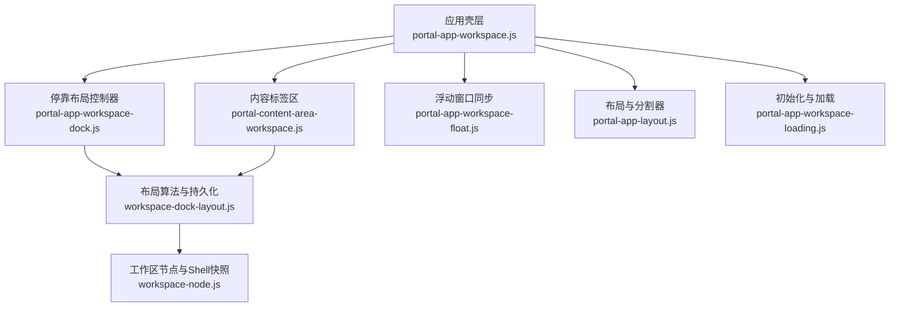
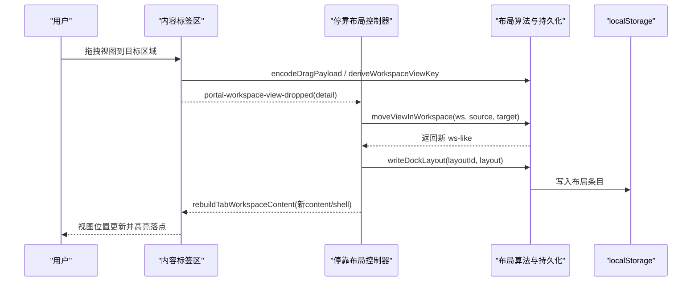
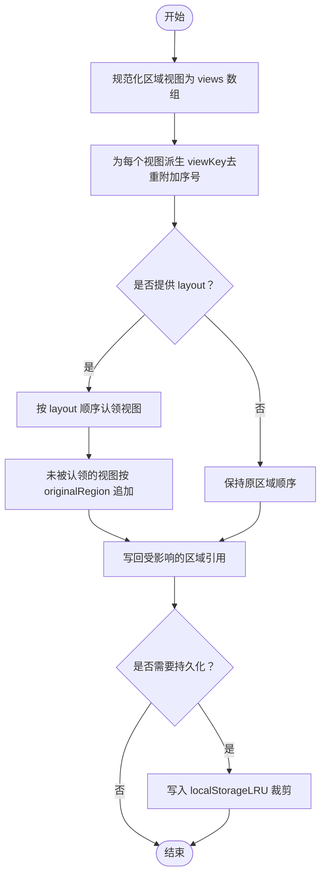
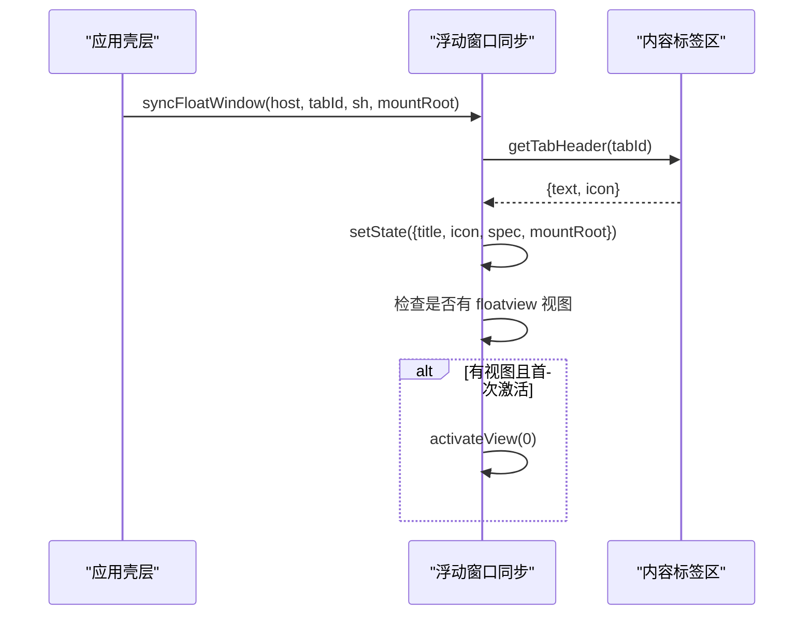
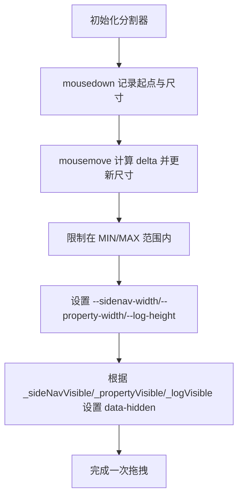
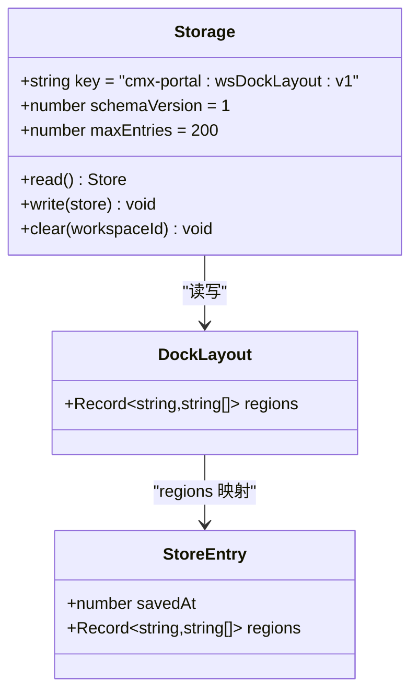
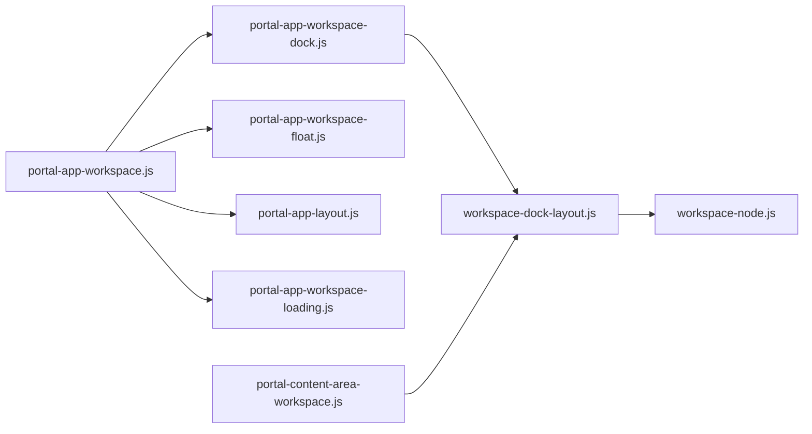

# 工作区布局

<cite>
**本文引用的文件**
- [portal-app-workspace.js](file://CMXPortalManager/src/components/portal-app-workspace.js)
- [portal-app-workspace-dock.js](file://CMXPortalManager/src/components/portal-app-workspace-dock.js)
- [portal-app-workspace-float.js](file://CMXPortalManager/src/components/portal-app-workspace-float.js)
- [workspace-dock-layout.js](file://CMXPortalManager/src/lib/workspace-dock-layout.js)
- [workspace-node.js](file://CMXPortalManager/src/lib/workspace-node.js)
- [portal-content-area-workspace.js](file://CMXPortalManager/src/components/portal-content-area-workspace.js)
- [portal-app-layout.js](file://CMXPortalManager/src/components/portal-app-layout.js)
- [portal-app-workspace-loading.js](file://CMXPortalManager/src/components/portal-app-workspace-loading.js)
</cite>

## 目录
1. [简介](#简介)
2. [项目结构](#项目结构)
3. [核心组件](#核心组件)
4. [架构总览](#架构总览)
5. [详细组件分析](#详细组件分析)
6. [依赖关系分析](#依赖关系分析)
7. [性能与重绘控制](#性能与重绘控制)
8. [故障排查指南](#故障排查指南)
9. [结论](#结论)
10. [附录：配置结构与序列化](#附录：配置结构与序列化)

## 简介
本文件系统化阐述工作区布局系统，覆盖整体布局架构、容器管理、停靠区域（Dock）与浮动区域的布局算法与状态管理、响应式布局适配、屏幕尺寸变化与方向切换处理、布局配置文件结构与序列化机制、用户自定义布局的保存与分享、布局同步与冲突解决、多设备一致性保证，以及布局性能优化、重绘控制与用户体验改进。

## 项目结构
工作区布局由“应用壳层”“内容标签区”“停靠面板”“浮动窗口”“布局持久化”等模块协作完成：
- 应用壳层负责活动切换、侧边栏/属性/底部面板显隐与尺寸调整、初始活动恢复。
- 内容标签区承载每个工作区标签的内容视图与拖拽交互。
- 停靠面板包含资源管理器、属性面板、日志/底部面板，支持视图拖拽到任意停靠区。
- 浮动窗口用于展示 floatview 区域视图，并随当前标签头信息更新标题与图标。
- 布局持久化通过 localStorage 存储各工作区的停靠布局，支持 LRU 清理与版本兼容。

**图示来源**
- [portal-app-workspace.js:28-62](file://CMXPortalManager/src/components/portal-app-workspace.js#L28-L62)
- [portal-content-area-workspace.js:17-100](file://CMXPortalManager/src/components/portal-content-area-workspace.js#L17-L100)
- [portal-app-workspace-dock.js:19-70](file://CMXPortalManager/src/components/portal-app-workspace-dock.js#L19-L70)
- [portal-app-workspace-float.js:15-43](file://CMXPortalManager/src/components/portal-app-workspace-float.js#L15-L43)
- [workspace-dock-layout.js:127-140](file://CMXPortalManager/src/lib/workspace-dock-layout.js#L127-L140)
- [portal-app-layout.js:33-71](file://CMXPortalManager/src/components/portal-app-layout.js#L33-L71)
- [portal-app-workspace-loading.js:19-66](file://CMXPortalManager/src/components/portal-app-workspace-loading.js#L19-L66)
- [workspace-node.js:216-281](file://CMXPortalManager/src/lib/workspace-node.js#L216-L281)

**章节来源**
- [portal-app-workspace.js:28-62](file://CMXPortalManager/src/components/portal-app-workspace.js#L28-L62)
- [portal-content-area-workspace.js:17-100](file://CMXPortalManager/src/components/portal-content-area-workspace.js#L17-L100)
- [portal-app-workspace-dock.js:19-70](file://CMXPortalManager/src/components/portal-app-workspace-dock.js#L19-L70)
- [portal-app-workspace-float.js:15-43](file://CMXPortalManager/src/components/portal-app-workspace-float.js#L15-L43)
- [workspace-dock-layout.js:127-140](file://CMXPortalManager/src/lib/workspace-dock-layout.js#L127-L140)
- [portal-app-layout.js:33-71](file://CMXPortalManager/src/components/portal-app-layout.js#L33-L71)
- [portal-app-workspace-loading.js:19-66](file://CMXPortalManager/src/components/portal-app-workspace-loading.js#L19-L66)
- [workspace-node.js:216-281](file://CMXPortalManager/src/lib/workspace-node.js#L216-L281)

## 核心组件
- 工作区入口与活动切换：负责应用活动激活、侧边栏可见性、布局应用、菜单项打开工作区节点或对话框。
- 停靠布局控制器：处理视图拖放、移动、保存与重置，维护各区域视图顺序与持久化。
- 浮动窗口同步：根据当前标签头信息与 shell.floatview 更新浮动窗口标题、图标与内容，首次激活时自动展开。
- 布局算法与持久化：派生 viewKey、计算区域视图列表、应用/写入/读取/清除布局，提供跨面板拖拽协议。
- 内容标签区：实现 content 区域的拖拽、右键菜单、缓存根创建与销毁、嵌入视图独立 root 管理。
- 布局与分割器：控制侧边栏、属性、底部面板的显示/隐藏与尺寸拖拽，应用 CSS 变量与 data-hidden。
- 初始化与加载：首屏域树加载、活动恢复、dock 显隐同步、批量加载防闪烁遮罩。

**章节来源**
- [portal-app-workspace.js:28-159](file://CMXPortalManager/src/components/portal-app-workspace.js#L28-L159)
- [portal-app-workspace-dock.js:19-153](file://CMXPortalManager/src/components/portal-app-workspace-dock.js#L19-L153)
- [portal-app-workspace-float.js:15-79](file://CMXPortalManager/src/components/portal-app-workspace-float.js#L15-L79)
- [workspace-dock-layout.js:127-609](file://CMXPortalManager/src/lib/workspace-dock-layout.js#L127-L609)
- [portal-content-area-workspace.js:17-406](file://CMXPortalManager/src/components/portal-content-area-workspace.js#L17-L406)
- [portal-app-layout.js:33-155](file://CMXPortalManager/src/components/portal-app-layout.js#L33-L155)
- [portal-app-workspace-loading.js:19-189](file://CMXPortalManager/src/components/portal-app-workspace-loading.js#L19-L189)

## 架构总览
工作区布局采用“事件驱动 + 数据模型 + 持久化”的分层架构：
- 事件层：dragstart/dragover/drop 在内容区与各停靠面板间传递拖拽意图；菜单选择事件触发工作区打开。
- 数据层：workspace 对象描述各区域视图；viewKey 唯一标识视图；layout JSON 描述区域视图顺序。
- 持久化层：localStorage 以 schemaVersion 管理布局条目，LRU 裁剪避免配额耗尽。
- 渲染层：按 region 渲染视图，缓存根复用减少重绘；embed 区每视图独立 root 便于借用与归还。

**图示来源**
- [portal-content-area-workspace.js:25-99](file://CMXPortalManager/src/components/portal-content-area-workspace.js#L25-L99)
- [workspace-dock-layout.js:480-604](file://CMXPortalManager/src/lib/workspace-dock-layout.js#L480-L604)
- [portal-app-workspace-dock.js:19-70](file://CMXPortalManager/src/components/portal-app-workspace-dock.js#L19-L70)
- [workspace-dock-layout.js:388-398](file://CMXPortalManager/src/lib/workspace-dock-layout.js#L388-L398)

## 详细组件分析

### 停靠区域（Dock）布局算法与状态管理
- 视图键派生：优先 html_page id → spec.id/viewId → 稳定哈希（type|tabLabel|dataKey）→ 回退位置占位符。同区内去重附加序号。
- 区域视图规范化：统一 wrapper 形态（含 views 数组与元字段 caption/icon），确保后续拖拽与渲染一致。
- 应用布局：将 layout 中的 key 序列认领到对应区域，未认领视图按 originalRegion 追加；丢弃找不到 key 的旧项并告警。
- 单步移动：从源区域移除视图，插入目标区域指定索引；同区移动补偿索引；仅写回受影响区域以减少重建。
- 持久化：读写 localStorage 的 cmx-portal:wsDockLayout:v1，schemaVersion 校验失败则丢弃旧数据；超过条目上限按 savedAt 升序删除最老条目。

**图示来源**
- [workspace-dock-layout.js:67-102](file://CMXPortalManager/src/lib/workspace-dock-layout.js#L67-L102)
- [workspace-dock-layout.js:155-243](file://CMXPortalManager/src/lib/workspace-dock-layout.js#L155-L243)
- [workspace-dock-layout.js:255-316](file://CMXPortalManager/src/lib/workspace-dock-layout.js#L255-L316)
- [workspace-dock-layout.js:321-398](file://CMXPortalManager/src/lib/workspace-dock-layout.js#L321-L398)

**章节来源**
- [workspace-dock-layout.js:67-102](file://CMXPortalManager/src/lib/workspace-dock-layout.js#L67-L102)
- [workspace-dock-layout.js:155-243](file://CMXPortalManager/src/lib/workspace-dock-layout.js#L155-L243)
- [workspace-dock-layout.js:255-316](file://CMXPortalManager/src/lib/workspace-dock-layout.js#L255-L316)
- [workspace-dock-layout.js:321-398](file://CMXPortalManager/src/lib/workspace-dock-layout.js#L321-L398)

### 浮动区域（Float）布局与状态管理
- 标题与图标：取自当前 Content 标签的 header（text/icon），默认 popup-window。
- 内容来源：shell.floatview（或 float 别名）；无则传 null，仅显示 AI 默认 tab。
- 自动展开：当某 content tab 首次激活且存在 floatview 视图时，自动展开并选中第 0 个视图。
- 设计器打开：html_pages 类型视图可在新标签页打开 HTML 设计器，附带 DAM 坐标参数以便预填。

**图示来源**
- [portal-app-workspace-float.js:15-43](file://CMXPortalManager/src/components/portal-app-workspace-float.js#L15-L43)
- [portal-app-workspace-float.js:52-79](file://CMXPortalManager/src/components/portal-app-workspace-float.js#L52-L79)

**章节来源**
- [portal-app-workspace-float.js:15-79](file://CMXPortalManager/src/components/portal-app-workspace-float.js#L15-L79)

### 响应式布局适配与方向切换
- 分割器拖拽：左侧/右侧/底部三个 splitter 支持水平/垂直拖动，限制最小/最大尺寸，实时更新 CSS 变量。
- 显隐控制：通过 data-hidden 属性与 CSS 变量控制侧边栏、属性、底部面板的显示与隐藏。
- 首屏恢复：根据持久化的 DAM 与应用恢复活动，应用布局并设置 dock 显隐偏好。
- 方向切换：当前实现基于鼠标事件与 CSS 变量，未内置方向检测；可通过外部监听 orientationchange 调用 applyLayout 或调整尺寸变量。

**图示来源**
- [portal-app-layout.js:33-71](file://CMXPortalManager/src/components/portal-app-layout.js#L33-L71)
- [portal-app-layout.js:81-137](file://CMXPortalManager/src/components/portal-app-layout.js#L81-L137)
- [portal-app-workspace-loading.js:72-85](file://CMXPortalManager/src/components/portal-app-workspace-loading.js#L72-L85)

**章节来源**
- [portal-app-layout.js:33-137](file://CMXPortalManager/src/components/portal-app-layout.js#L33-L137)
- [portal-app-workspace-loading.js:72-85](file://CMXPortalManager/src/components/portal-app-workspace-loading.js#L72-L85)

### 布局配置文件结构与序列化机制
- 布局 ID 派生：优先 sourceMenuId，其次 tabId；为空则不持久化。
- 布局结构：regions 包含 explorer/content/property/bottom/floatview 五个区域，每个区域为 viewKey 字符串数组。
- 序列化存储：cmx-portal:wsDockLayout:v1，entries 为 workspaceId -> {savedAt, regions}；schemaVersion 不匹配则丢弃旧数据。
- LRU 清理：超过 200 条按 savedAt 升序删除最老条目，防止 localStorage 配额耗尽。
- 读/写/清：readDockLayout/writeDockLayout/clearDockLayout 提供安全封装，异常时降级并记录日志。

**图示来源**
- [workspace-dock-layout.js:118-140](file://CMXPortalManager/src/lib/workspace-dock-layout.js#L118-L140)
- [workspace-dock-layout.js:321-398](file://CMXPortalManager/src/lib/workspace-dock-layout.js#L321-L398)

**章节来源**
- [workspace-dock-layout.js:118-140](file://CMXPortalManager/src/lib/workspace-dock-layout.js#L118-L140)
- [workspace-dock-layout.js:321-398](file://CMXPortalManager/src/lib/workspace-dock-layout.js#L321-L398)

### 用户自定义布局、保存与分享
- 自定义布局：用户在内容区或停靠面板拖拽视图，触发 moveViewInWorkspace 重组 ws-like 对象。
- 保存布局：saveCurrentTabDockLayout 读取当前 tab 的 layoutId 与 contentSpec/shell，派生 layout 并写入 localStorage。
- 重置布局：resetTabDockLayout 清除存储并重建原始布局，保留非 dock 区（model/inner/embed）引用以避免误删。
- 分享布局：可将导出后的 layout JSON 作为共享资产；导入时需确保 viewKey 在当前 workspace 中可解析（html_page/id/稳定哈希）。

**章节来源**
- [portal-app-workspace-dock.js:74-153](file://CMXPortalManager/src/components/portal-app-workspace-dock.js#L74-L153)
- [workspace-dock-layout.js:127-140](file://CMXPortalManager/src/lib/workspace-dock-layout.js#L127-L140)

### 布局同步、冲突解决与多设备一致性
- 同步时机：打开工作区节点时先抓取 originalWorkspace 快照，再读取并应用已保存布局；若不存在则使用菜单定义。
- 冲突解决：layout 中找不到对应 viewKey 的旧项会被丢弃并告警；新增视图自动追加到 originalRegion 末尾。
- 多设备一致性：localStorage 为浏览器本地存储，跨设备需借助后端服务或导出/导入机制；viewKey 的稳定哈希有助于在不同设备上识别同类视图。

**章节来源**
- [workspace-node.js:216-281](file://CMXPortalManager/src/lib/workspace-node.js#L216-L281)
- [workspace-dock-layout.js:155-243](file://CMXPortalManager/src/lib/workspace-dock-layout.js#L155-L243)

### 性能优化、重绘控制与用户体验改进
- 缓存根复用：ensureWorkspaceMountRoot 为每个 region 创建并缓存 DOM 根，spec 引用不变时不重建，减少重绘。
- 嵌入视图独立 root：embed 区每视图独立 root，便于借用与归还，避免整区重建。
- 变更最小化：moveViewInWorkspace 仅写回 source/target 两个区域，避免下游误判全部变更导致全量重建。
- 加载防闪烁：setHtmlPagesWorkspaceLoading 使用 show-delay/min-visible/双 rAF 淡入淡出与主题背景色混合，避免快速请求导致的闪烁。
- 分割器体验：拖拽过程中实时应用 CSS 变量，限制尺寸范围，提升交互流畅度。

**章节来源**
- [portal-content-area-workspace.js:182-226](file://CMXPortalManager/src/components/portal-content-area-workspace.js#L182-L226)
- [portal-content-area-workspace.js:238-294](file://CMXPortalManager/src/components/portal-content-area-workspace.js#L238-L294)
- [workspace-dock-layout.js:255-316](file://CMXPortalManager/src/lib/workspace-dock-layout.js#L255-L316)
- [portal-app-workspace-loading.js:101-189](file://CMXPortalManager/src/components/portal-app-workspace-loading.js#L101-L189)
- [portal-app-layout.js:81-137](file://CMXPortalManager/src/components/portal-app-layout.js#L81-L137)

## 依赖关系分析
- 应用壳层依赖内容标签区、停靠布局控制器、浮动窗口同步、布局与分割器、初始化与加载。
- 内容标签区依赖布局算法与持久化、工作区节点与 Shell 快照。
- 停靠布局控制器依赖布局算法与持久化、工作区节点与 Shell 快照。
- 布局算法与持久化依赖工作区节点与 Shell 快照。
- 初始化与加载依赖布局与分割器、API 客户端与上下文。

**图示来源**
- [portal-app-workspace.js:28-159](file://CMXPortalManager/src/components/portal-app-workspace.js#L28-L159)
- [portal-app-workspace-dock.js:1-153](file://CMXPortalManager/src/components/portal-app-workspace-dock.js#L1-L153)
- [portal-app-workspace-float.js:1-79](file://CMXPortalManager/src/components/portal-app-workspace-float.js#L1-L79)
- [portal-content-area-workspace.js:1-406](file://CMXPortalManager/src/components/portal-content-area-workspace.js#L1-L406)
- [workspace-dock-layout.js:1-609](file://CMXPortalManager/src/lib/workspace-dock-layout.js#L1-L609)
- [workspace-node.js:1-283](file://CMXPortalManager/src/lib/workspace-node.js#L1-L283)

**章节来源**
- [portal-app-workspace.js:28-159](file://CMXPortalManager/src/components/portal-app-workspace.js#L28-L159)
- [portal-app-workspace-dock.js:1-153](file://CMXPortalManager/src/components/portal-app-workspace-dock.js#L1-L153)
- [portal-app-workspace-float.js:1-79](file://CMXPortalManager/src/components/portal-app-workspace-float.js#L1-L79)
- [portal-content-area-workspace.js:1-406](file://CMXPortalManager/src/components/portal-content-area-workspace.js#L1-L406)
- [workspace-dock-layout.js:1-609](file://CMXPortalManager/src/lib/workspace-dock-layout.js#L1-L609)
- [workspace-node.js:1-283](file://CMXPortalManager/src/lib/workspace-node.js#L1-L283)

## 性能与重绘控制
- 最小化 DOM 操作：仅在必要时重建 region 根，embed 区独立 root 降低影响面。
- 变更检测：比较 prevSpec === nextSpec 决定是否重建，避免无意义重绘。
- 防抖与节流：加载遮罩使用 show-delay/min-visible 与 rAF 动画，避免频繁开关导致的闪烁。
- 存储优化：LRU 裁剪与 schemaVersion 校验，防止 localStorage 溢出与格式不兼容。

[本节为通用指导，无需特定文件来源]

## 故障排查指南
- 视图位置写入失败：检查 localStorage 权限与配额；查看控制台警告日志。
- 布局恢复失败：确认 workspaceLayoutId 正确；检查 schemaVersion 是否匹配；查看 dropped 列表了解丢失的 viewKey。
- 浮动窗口未展开：确认 shell.floatview 是否存在；检查首次激活标记 _floatAutoOpenedTabs。
- 分割器无效：确认 splitter 元素存在且绑定 mousedown；检查 MIN/MAX 限制是否阻止调整。

**章节来源**
- [portal-app-workspace-dock.js:62-69](file://CMXPortalManager/src/components/portal-app-workspace-dock.js#L62-L69)
- [workspace-dock-layout.js:321-343](file://CMXPortalManager/src/lib/workspace-dock-layout.js#L321-L343)
- [portal-app-workspace-float.js:35-43](file://CMXPortalManager/src/components/portal-app-workspace-float.js#L35-L43)
- [portal-app-layout.js:81-137](file://CMXPortalManager/src/components/portal-app-layout.js#L81-L137)

## 结论
工作区布局系统通过稳定的 viewKey 派生、区域视图规范化、最小化变更写回与缓存根复用，实现了高效、可持久化、可扩展的停靠与浮动布局。配合首屏活动恢复、加载防闪烁与分割器交互，提供了良好的用户体验。未来可增强方向切换感知与跨设备同步能力，进一步提升多端一致性。

[本节为总结，无需特定文件来源]

## 附录：配置结构与序列化
- 布局 ID：menu:<sourceMenuId> 或 tab:<tabId>。
- 布局结构：{ regions: { explorer: string[], content: string[], property: string[], bottom: string[], floatview: string[] } }。
- 存储键：cmx-portal:wsDockLayout:v1。
- 条目结构：{ savedAt: number, regions: Record<string, string[]> }。
- 版本策略：schemaVersion 不匹配则丢弃旧数据；超过 200 条按 savedAt 升序删除最老条目。

**章节来源**
- [workspace-dock-layout.js:118-140](file://CMXPortalManager/src/lib/workspace-dock-layout.js#L118-L140)
- [workspace-dock-layout.js:321-398](file://CMXPortalManager/src/lib/workspace-dock-layout.js#L321-L398)