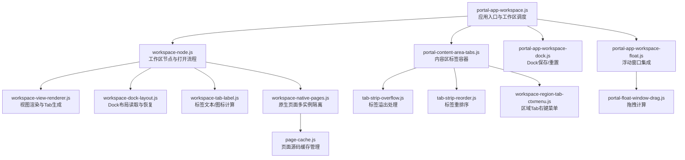
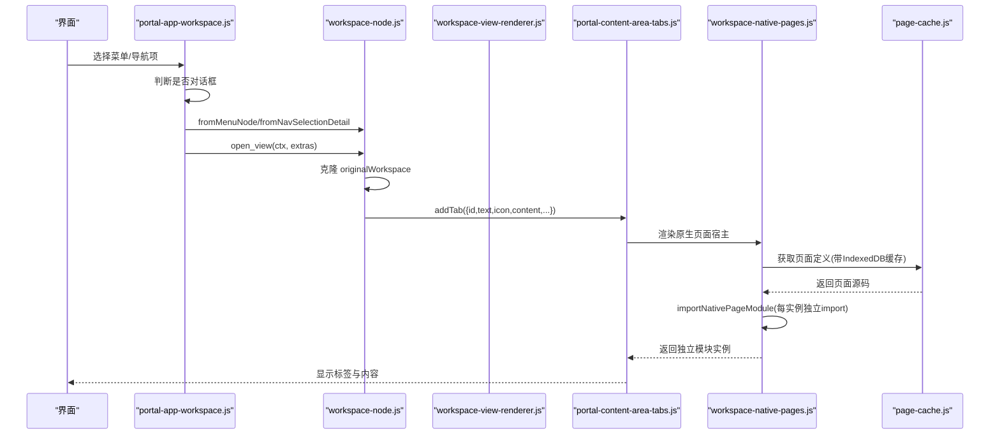
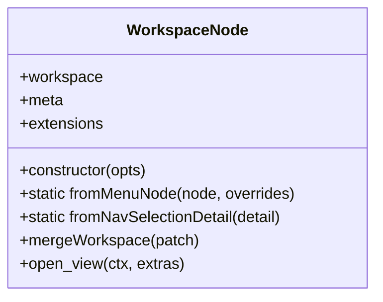
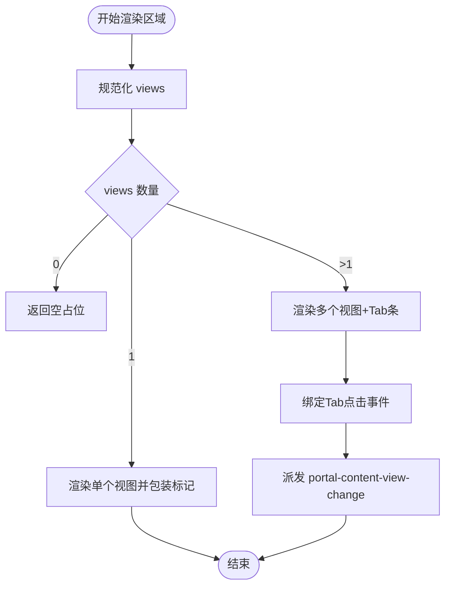
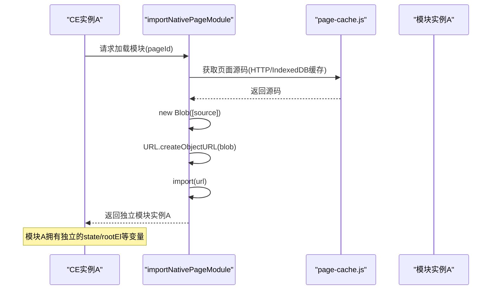
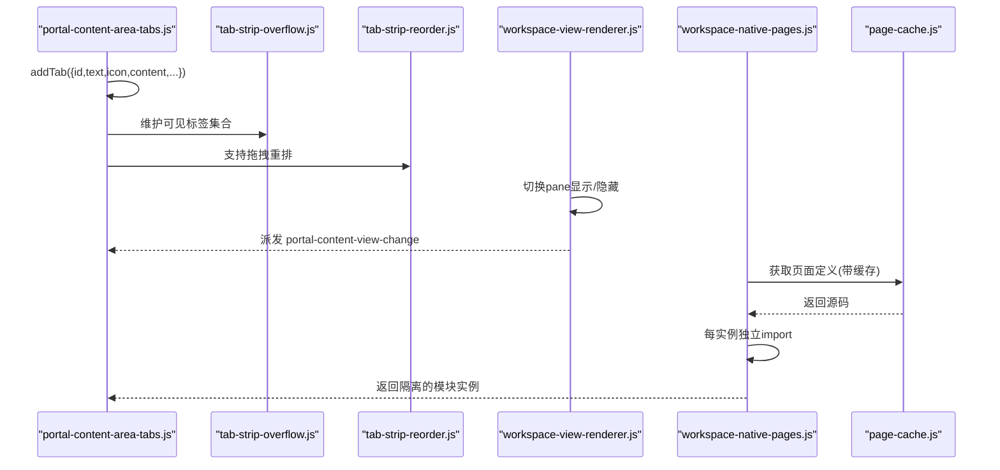
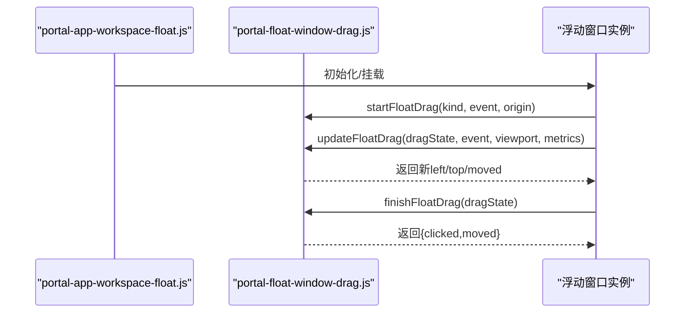
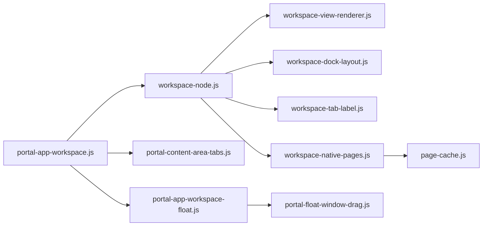

# 工作区管理

<cite>
**本文引用的文件**
- [workspace-node.js](file://CMXPortalManager/src/lib/workspace-node.js)
- [portal-app-workspace.js](file://CMXPortalManager/src/components/portal-app-workspace.js)
- [workspace-view-renderer.js](file://CMXPortalManager/src/lib/workspace-view-renderer.js)
- [portal-float-window-drag.js](file://CMXPortalManager/src/lib/portal-float-window-drag.js)
- [workspace-dock-layout.js](file://CMXPortalManager/src/lib/workspace-dock-layout.js)
- [workspace-tab-label.js](file://CMXPortalManager/src/lib/workspace-tab-label.js)
- [workspace-html-page-preview.js](file://CMXPortalManager/src/lib/workspace-html-page-preview.js)
- [workspace-native-pages.js](file://CMXPortalManager/src/lib/workspace-native-pages.js)
- [workspace-view-config.js](file://CMXPortalManager/src/lib/workspace-view-config.js)
- [portal-content-area-tabs.js](file://CMXPortalManager/src/components/portal-content-area-tabs.js)
- [portal-content-area-workspace.js](file://CMXPortalManager/src/components/portal-content-area-workspace.js)
- [portal-app-workspace-dock.js](file://CMXPortalManager/src/components/portal-app-workspace-dock.js)
- [portal-app-workspace-float.js](file://CMXPortalManager/src/components/portal-app-workspace-float.js)
- [portal-app-workspace-loading.js](file://CMXPortalManager/src/components/portal-app-workspace-loading.js)
- [tab-strip-overflow.js](file://CMXPortalManager/src/lib/tab-strip-overflow.js)
- [tab-strip-reorder.js](file://CMXPortalManager/src/lib/tab-strip-reorder.js)
- [workspace-region-tab-ctxmenu.js](file://CMXPortalManager/src/lib/workspace-region-tab-ctxmenu.js)
- [page-cache.js](file://CMXPortalManager/src/lib/page-cache.js)
</cite>

## 更新摘要
**变更内容**
- 新增原生页面多实例隔离机制说明，解释了模块缓存移除的原因和实现方式
- 更新了原生页面加载流程，强调每实例独立 import 的架构设计
- 增强了状态管理和内存隔离的相关章节
- 补充了跨标签页数据冲突的解决方案

## 目录
1. [简介](#简介)
2. [项目结构](#项目结构)
3. [核心组件](#核心组件)
4. [架构总览](#架构总览)
5. [详细组件分析](#详细组件分析)
6. [依赖关系分析](#依赖关系分析)
7. [性能考虑](#性能考虑)
8. [故障排查指南](#故障排查指南)
9. [结论](#结论)
10. [附录](#附录)

## 简介
本文件面向门户管理器的工作区管理系统，系统性阐述工作区概念、节点类型与生命周期、多标签页实现、标签状态持久化与内存管理策略、视图渲染器机制（含组件动态加载与依赖）、浮动窗口能力（拖拽定位与窗口间通信）、布局配置与恢复、以及常见问题的诊断方法与调试技巧。**特别关注原生页面多实例隔离机制，确保不同浏览器标签页中的同一页面类型能够完全独立运行，避免状态共享和数据冲突。**

## 项目结构
工作区管理在 CMXPortalManager 中由多个模块协同完成：
- 工作区节点与入口：负责从菜单或导航选择构建工作区节点，执行打开流程，协调侧栏、属性、底部区域与内容区。
- 视图渲染层：将工作区配置转换为 HTML，支持多种内置视图类型与自定义扩展，生成带 Tab 的区域容器。
- 标签页与溢出处理：提供标签条、溢出折叠、重排序、右键菜单等交互。
- 浮动窗口：提供浮窗挂载、拖拽定位、持久化与标签管理。
- Dock 布局：读写与恢复工作区各区域的布局快照。
- **原生页面隔离层：实现每实例独立的模块加载机制，确保多标签页间的完全隔离。**

**图表来源**
- [portal-app-workspace.js:28-159](file://CMXPortalManager/src/components/portal-app-workspace.js#L28-L159)
- [workspace-node.js:124-283](file://CMXPortalManager/src/lib/workspace-node.js#L124-L283)
- [workspace-view-renderer.js:148-208](file://CMXPortalManager/src/lib/workspace-view-renderer.js#L148-L208)
- [workspace-dock-layout.js:1-200](file://CMXPortalManager/src/lib/workspace-dock-layout.js#L1-L200)
- [workspace-tab-label.js:1-200](file://CMXPortalManager/src/lib/workspace-tab-label.js#L1-L200)
- [portal-content-area-tabs.js:1-200](file://CMXPortalManager/src/components/portal-content-area-tabs.js#L1-L200)
- [tab-strip-overflow.js:1-200](file://CMXPortalManager/src/lib/tab-strip-overflow.js#L1-L200)
- [tab-strip-reorder.js:1-200](file://CMXPortalManager/src/lib/tab-strip-reorder.js#L1-L200)
- [workspace-region-tab-ctxmenu.js:1-200](file://CMXPortalManager/src/lib/workspace-region-tab-ctxmenu.js#L1-L200)
- [portal-app-workspace-dock.js:1-200](file://CMXPortalManager/src/components/portal-app-workspace-dock.js#L1-L200)
- [portal-app-workspace-float.js:1-200](file://CMXPortalManager/src/components/portal-app-workspace-float.js#L1-L200)
- [portal-float-window-drag.js:1-59](file://CMXPortalManager/src/lib/portal-float-window-drag.js#L1-L59)
- [workspace-native-pages.js:1-510](file://CMXPortalManager/src/lib/workspace-native-pages.js#L1-L510)
- [page-cache.js:1-312](file://CMXPortalManager/src/lib/page-cache.js#L1-L312)

## 核心组件
- 工作区节点（WorkspaceNode）：封装工作区配置与元信息，提供从菜单/导航构造、合并配置、打开视图等能力；在打开时负责 Dock 布局恢复、内容区 HTML 渲染、Shell 区域同步与标签创建。
- 视图渲染器（workspace-view-renderer）：将工作区区域配置渲染为 HTML，支持 iframe/html/link/json/code/markdown/split/placeholder 等内置类型，并提供自定义类型注册与 Tab 切换事件派发。
- 标签与溢出：内容区标签容器承载 Tab 列表，提供溢出折叠、重排序与右键菜单，支撑多标签页体验。
- 浮动窗口：提供浮窗挂载、拖拽定位、持久化与标签管理，并与工作区 Shell 联动。
- Dock 布局：按工作区维度读写布局快照，支持恢复与重置。
- **原生页面隔离器：通过每实例独立 import 机制，确保不同浏览器标签页中的原生页面完全独立运行，避免模块级状态共享导致的跨实例数据污染。**

**章节来源**
- [workspace-node.js:124-283](file://CMXPortalManager/src/lib/workspace-node.js#L124-L283)
- [workspace-view-renderer.js:14-208](file://CMXPortalManager/src/lib/workspace-view-renderer.js#L14-L208)
- [portal-content-area-tabs.js:1-200](file://CMXPortalManager/src/components/portal-content-area-tabs.js#L1-L200)
- [portal-app-workspace-dock.js:1-200](file://CMXPortalManager/src/components/portal-app-workspace-dock.js#L1-L200)
- [portal-app-workspace-float.js:1-200](file://CMXPortalManager/src/components/portal-app-workspace-float.js#L1-L200)
- [workspace-native-pages.js:17-22](file://CMXPortalManager/src/lib/workspace-native-pages.js#L17-L22)

## 架构总览
工作区打开的主流程如下：
- 入口接收菜单或导航选择，判断是否为对话框类型，否则构建 WorkspaceNode。
- 打开前可触发准备流程（如参数收集），随后进入 open_view。
- open_view 先克隆原始 workspace 作为"重置目标"，再尝试根据工作区 ID 恢复 Dock 布局。
- 渲染 content 区域 HTML，抽取 shell 快照（explorer/property/bottom/floatview/model/inner/embed），并构造 tab 选项加入内容区。
- 内容区通过标签容器渲染 Tab，点击切换时由渲染器派发事件联动属性栏显隐与内部视图切换。
- **对于原生页面，采用每实例独立 import 机制，确保每个 CE 实例拥有独立的模块作用域和状态空间。**

**图表来源**
- [portal-app-workspace.js:93-148](file://CMXPortalManager/src/components/portal-app-workspace.js#L93-L148)
- [workspace-node.js:216-281](file://CMXPortalManager/src/lib/workspace-node.js#L216-L281)
- [workspace-view-renderer.js:148-208](file://CMXPortalManager/src/lib/workspace-view-renderer.js#L148-L208)
- [workspace-dock-layout.js:1-200](file://CMXPortalManager/src/lib/workspace-dock-layout.js#L1-L200)
- [portal-content-area-tabs.js:1-200](file://CMXPortalManager/src/components/portal-content-area-tabs.js#L1-L200)
- [workspace-native-pages.js:482-498](file://CMXPortalManager/src/lib/workspace-native-pages.js#L482-L498)
- [page-cache.js:393-416](file://CMXPortalManager/src/lib/page-cache.js#L393-L416)

## 详细组件分析

### 工作区节点与生命周期
- 节点构造：支持从菜单节点或导航选择细节构造，自动提取标签、图标、tabId 与 DAM 三元组（domain/application/module）。
- 生命周期：
  - 创建：fromMenuNode/fromNavSelectionDetail 生成实例。
  - 更新：mergeWorkspace 合并配置变更。
  - 打开：open_view 执行布局恢复、内容渲染、Shell 同步、标签添加。
  - 销毁：由内容区标签容器与区域视图管理器负责卸载与清理（见下文"内存管理"）。
- Shell 快照与应用：
  - 抽取 explorer/property/bottom/floatview/model/inner/embed 等影响宿主区域的配置。
  - applyWorkspaceShell 将快照应用到侧边栏、属性面板与日志面板，支持激活与挂载根节点复用。

**图表来源**
- [workspace-node.js:124-283](file://CMXPortalManager/src/lib/workspace-node.js#L124-L283)

**章节来源**
- [workspace-node.js:124-283](file://CMXPortalManager/src/lib/workspace-node.js#L124-L283)

### 视图渲染器与组件动态加载
- 视图类型系统：
  - 内置类型：html、iframe、link、json、code/pre、markdown、split、placeholder。
  - 自定义类型：通过 registerWorkspaceViewType(type, renderer) 注册，按 type 小写匹配。
- 区域渲染：
  - renderWorkspaceRegionViewsHtml 将 region 的 views 规范化，单视图直接渲染，多视图生成 Tab 条与 Pane。
  - 每个视图包裹 data-cmx-region/data-cmx-view-id 标记，便于后续 CE wrapper 识别与挂载。
- 交互与联动：
  - 区域 Tab 点击委托 handleWorkspaceRegionTabBarClick，切换 pane 并派发 portal-content-view-change 事件，携带 hideProperty/syncPropertyView，驱动属性栏联动。
  - activateWorkspaceRegionViewByIndex 支持按索引激活指定视图。

**图表来源**
- [workspace-view-renderer.js:14-208](file://CMXPortalManager/src/lib/workspace-view-renderer.js#L14-L208)
- [workspace-view-renderer.js:214-310](file://CMXPortalManager/src/lib/workspace-view-renderer.js#L214-L310)

**章节来源**
- [workspace-view-renderer.js:14-208](file://CMXPortalManager/src/lib/workspace-view-renderer.js#L14-L208)
- [workspace-view-renderer.js:214-310](file://CMXPortalManager/src/lib/workspace-view-renderer.js#L214-L310)

### 原生页面多实例隔离机制
**更新** 新增了原生页面多实例隔离机制，解决了跨标签页数据共享问题。

- **问题背景**：
  - 原实现使用 `_moduleCache` 按 `pageId` 全局共享模块实例
  - 导致同页面类型的多个 CE 实例共享模块级变量（state/rootEl等）
  - 多标签页操作时出现数据串扰，如 cr-form 表单数据互相覆盖

- **解决方案**：
  - 移除模块级缓存，改为每实例独立 `Blob + import()`
  - 源码仍走 page-cache/HTTP 缓存，仅增加一次解析执行开销
  - 每个 CE 实例获得独立的模块作用域和状态空间

- **实现细节**：
  - `importNativePageModule` 函数使用 Blob URL 动态导入模块
  - 保持 `_pageDefCache` 用于页面定义的轻量缓存
  - 支持 `cacheOnly` 模式优化刷新路径，避免重复加载

**图表来源**
- [workspace-native-pages.js:482-498](file://CMXPortalManager/src/lib/workspace-native-pages.js#L482-L498)
- [page-cache.js:393-416](file://CMXPortalManager/src/lib/page-cache.js#L393-L416)

**章节来源**
- [workspace-native-pages.js:17-22](file://CMXPortalManager/src/lib/workspace-native-pages.js#L17-L22)
- [workspace-native-pages.js:482-498](file://CMXPortalManager/src/lib/workspace-native-pages.js#L482-L498)
- [documents/plans/20260827_portal_原生页面多实例模块隔离方案.md:47-66](file://documents/plans/20260827_portal_原生页面多实例模块隔离方案.md#L47-L66)

### 多标签页实现、状态持久化与内存管理
- 多标签页：
  - 内容区通过 portal-content-area-tabs.js 管理标签集合，支持 addTab、切换、关闭等操作。
  - 标签条支持溢出折叠（tab-strip-overflow.js）与重排序（tab-strip-reorder.js），提升大量标签时的可用性。
  - 区域 Tab 右键菜单（workspace-region-tab-ctxmenu.js）提供上下文操作。
- 状态持久化：
  - Dock 布局：按工作区维度读写布局快照，open_view 时恢复，支持 saveCurrentTabDockLayout/resetTabDockLayout。
  - 浮动窗口：通过 portal-app-workspace-float.js 与 portal-float-window-persistence.js（若存在）进行持久化与恢复。
  - **原生页面缓存：通过 IndexedDB 持久化页面源码，支持 ETag/304 优化和网络回退。**
- 内存管理：
  - 标签切换时移动挂载根节点而非重复创建 DOM，减少重建开销。
  - 视图切换时仅隐藏/显示对应 pane，避免频繁销毁/重建。
  - 使用 structuredClone 或 JSON 序列化备份 originalWorkspace/sourceNode，避免引用污染。
  - **原生页面模块实例隔离：每实例独立 import，避免模块级状态共享导致的内存泄漏。**

**图表来源**
- [portal-content-area-tabs.js:1-200](file://CMXPortalManager/src/components/portal-content-area-tabs.js#L1-L200)
- [tab-strip-overflow.js:1-200](file://CMXPortalManager/src/lib/tab-strip-overflow.js#L1-L200)
- [tab-strip-reorder.js:1-200](file://CMXPortalManager/src/lib/tab-strip-reorder.js#L1-L200)
- [workspace-view-renderer.js:214-310](file://CMXPortalManager/src/lib/workspace-view-renderer.js#L214-L310)
- [workspace-native-pages.js:482-498](file://CMXPortalManager/src/lib/workspace-native-pages.js#L482-L498)
- [page-cache.js:393-416](file://CMXPortalManager/src/lib/page-cache.js#L393-L416)

**章节来源**
- [portal-content-area-tabs.js:1-200](file://CMXPortalManager/src/components/portal-content-area-tabs.js#L1-L200)
- [tab-strip-overflow.js:1-200](file://CMXPortalManager/src/lib/tab-strip-overflow.js#L1-L200)
- [tab-strip-reorder.js:1-200](file://CMXPortalManager/src/lib/tab-strip-reorder.js#L1-L200)
- [workspace-region-tab-ctxmenu.js:1-200](file://CMXPortalManager/src/lib/workspace-region-tab-ctxmenu.js#L1-L200)
- [workspace-native-pages.js:17-22](file://CMXPortalManager/src/lib/workspace-native-pages.js#L17-L22)

### 浮动窗口功能、拖拽定位与窗口间通信
- 浮动窗口集成：
  - portal-app-workspace-float.js 提供 syncFloatWindow/openHtmlPageInDesigner 等能力，与工作区 Shell 联动。
  - 浮动窗口支持独立标签管理（portal-float-window-tabs.js）。
- 拖拽定位：
  - portal-float-window-drag.js 提供 startFloatDrag/updateFloatDrag/finishFloatDrag，支持标题栏与拖拽球两种模式，限制在视口范围内，区分点击与拖动。
- 窗口间通信：
  - 通过工作区上下文（workspace.context）传递初始参数，页面脚本可通过 host.workspace.context.get(...) 读取。
  - 区域 Tab 切换事件 portal-content-view-change 可用于跨组件联动（如隐藏/同步属性栏）。

**图表来源**
- [portal-app-workspace-float.js:1-200](file://CMXPortalManager/src/components/portal-app-workspace-float.js#L1-L200)
- [portal-float-window-drag.js:1-59](file://CMXPortalManager/src/lib/portal-float-window-drag.js#L1-L59)

**章节来源**
- [portal-app-workspace-float.js:1-200](file://CMXPortalManager/src/components/portal-app-workspace-float.js#L1-L200)
- [portal-float-window-drag.js:1-59](file://CMXPortalManager/src/lib/portal-float-window-drag.js#L1-L59)

### 工作区布局配置、状态恢复与性能优化
- 布局配置：
  - workspace-view-config.js 定义区域视图输入规范与解析逻辑。
  - workspace-dock-layout.js 提供 deriveWorkspaceLayoutId/readDockLayout/applyDockLayoutToWorkspace，用于按工作区维度恢复布局。
- 状态恢复：
  - open_view 中优先恢复 Dock 布局，再渲染内容与 Shell，确保用户上次布局生效。
  - 支持 resetTabDockLayout 恢复至菜单原始布局（originalWorkspace）。
- 性能优化：
  - 视图渲染采用最小 DOM 变更，Tab 切换仅切换 display。
  - 区域挂载根节点复用，避免重复创建。
  - 结构化克隆备份 originalWorkspace/sourceNode，避免深层对象污染。
  - **原生页面缓存优化：IndexedDB 持久化 + ETag/304 机制，减少网络传输。**

**章节来源**
- [workspace-view-config.js:1-200](file://CMXPortalManager/src/lib/workspace-view-config.js#L1-L200)
- [workspace-dock-layout.js:1-200](file://CMXPortalManager/src/lib/workspace-dock-layout.js#L1-L200)
- [workspace-node.js:216-281](file://CMXPortalManager/src/lib/workspace-node.js#L216-L281)
- [page-cache.js:393-416](file://CMXPortalManager/src/lib/page-cache.js#L393-L416)

## 依赖关系分析
工作区模块之间的耦合关系如下：
- portal-app-workspace.js 作为编排者，依赖 workspace-node.js 进行节点打开，依赖 workspace-view-renderer.js 进行内容渲染，依赖 workspace-dock-layout.js 进行布局恢复，依赖 portal-content-area-tabs.js 管理标签。
- workspace-node.js 依赖 workspace-view-renderer.js、workspace-tab-label.js、workspace-dock-layout.js。
- 浮动窗口与拖拽模块解耦，通过事件与上下文协作。
- **原生页面模块依赖 page-cache.js 进行源码缓存管理，通过每实例独立 import 实现隔离。**

**图表来源**
- [portal-app-workspace.js:28-159](file://CMXPortalManager/src/components/portal-app-workspace.js#L28-L159)
- [workspace-node.js:124-283](file://CMXPortalManager/src/lib/workspace-node.js#L124-L283)
- [workspace-view-renderer.js:14-208](file://CMXPortalManager/src/lib/workspace-view-renderer.js#L14-L208)
- [workspace-dock-layout.js:1-200](file://CMXPortalManager/src/lib/workspace-dock-layout.js#L1-L200)
- [workspace-tab-label.js:1-200](file://CMXPortalManager/src/lib/workspace-tab-label.js#L1-L200)
- [portal-content-area-tabs.js:1-200](file://CMXPortalManager/src/components/portal-content-area-tabs.js#L1-L200)
- [portal-app-workspace-float.js:1-200](file://CMXPortalManager/src/components/portal-app-workspace-float.js#L1-L200)
- [portal-float-window-drag.js:1-59](file://CMXPortalManager/src/lib/portal-float-window-drag.js#L1-L59)
- [workspace-native-pages.js:1-510](file://CMXPortalManager/src/lib/workspace-native-pages.js#L1-L510)
- [page-cache.js:1-312](file://CMXPortalManager/src/lib/page-cache.js#L1-L312)

**章节来源**
- [portal-app-workspace.js:28-159](file://CMXPortalManager/src/components/portal-app-workspace.js#L28-L159)
- [workspace-node.js:124-283](file://CMXPortalManager/src/lib/workspace-node.js#L124-L283)

## 性能考虑
- 渲染层面：
  - 多视图 Tab 切换仅切换显示样式，避免重建 DOM。
  - 区域视图包装层使用 display:contents，不改变原有尺寸控制。
- 内存层面：
  - 使用 mounted root 缓存与移动方式复用节点，降低创建成本。
  - 结构化克隆备份原始数据，避免共享引用导致的副作用。
  - **原生页面模块隔离：每实例独立 import，避免模块级状态共享导致的内存泄漏。**
- 交互层面：
  - 标签溢出折叠减少视觉拥挤与事件处理开销。
  - 拖拽阈值与边界约束减少高频重绘。
- **缓存优化：**
  - **IndexedDB 持久化存储，支持大容量页面源码缓存。**
  - **ETag/304 机制，避免重复下载未修改的页面源码。**
  - **LRU 淘汰策略，自动管理存储空间。**

## 故障排查指南
- 工作区未显示内容：
  - 检查 content 视图是否配置，未配置时渲染器会返回空占位提示。
  - 确认区域渲染函数是否正确调用，查看渲染输出是否包含 data-cmx-region/data-cmx-view-id。
- 属性栏未联动：
  - 确认 content 区域 Tab 是否设置 hideProperty/syncPropertyView，切换时会派发 portal-content-view-change。
  - 检查宿主是否监听该事件并正确更新属性栏。
- 布局未恢复：
  - 确认 deriveWorkspaceLayoutId 返回值有效，readDockLayout 能读到布局数据。
  - 若需恢复至菜单原始布局，使用 resetTabDockLayout。
- 浮动窗口无法拖拽：
  - 检查 startFloatDrag/updateFloatDrag/finishFloatDrag 调用链是否完整。
  - 确认视口尺寸与最小窗口宽度、标题栏高度等指标传入正确。
- 标签异常：
  - 检查 addTab 参数是否包含 id/text/icon/content。
  - 确认标签溢出与重排序模块已正确初始化。
- **原生页面相关问题：**
  - **跨标签页数据串扰：确认已启用每实例独立 import 机制，检查模块级变量是否被正确隔离。**
  - **页面加载缓慢：检查 IndexedDB 缓存是否正常工作，验证 ETag/304 响应是否正确处理。**
  - **刷新后数据丢失：确认 cacheOnly 模式正确使用，避免重复加载导致的状态重置。**

**章节来源**
- [workspace-view-renderer.js:148-208](file://CMXPortalManager/src/lib/workspace-view-renderer.js#L148-L208)
- [workspace-view-renderer.js:214-310](file://CMXPortalManager/src/lib/workspace-view-renderer.js#L214-L310)
- [workspace-node.js:216-281](file://CMXPortalManager/src/lib/workspace-node.js#L216-L281)
- [portal-app-workspace-dock.js:1-200](file://CMXPortalManager/src/components/portal-app-workspace-dock.js#L1-L200)
- [portal-float-window-drag.js:1-59](file://CMXPortalManager/src/lib/portal-float-window-drag.js#L1-L59)
- [workspace-native-pages.js:482-498](file://CMXPortalManager/src/lib/workspace-native-pages.js#L482-L498)
- [page-cache.js:393-416](file://CMXPortalManager/src/lib/page-cache.js#L393-L416)

## 结论
工作区管理系统以 WorkspaceNode 为核心，结合视图渲染器、标签管理与浮动窗口能力，提供了完整的页面组织与交互体验。通过 Dock 布局恢复、Shell 快照应用与区域联动事件，实现了灵活的多区域工作流。**特别重要的是，通过原生页面多实例隔离机制，确保了不同浏览器标签页中的同一页面类型能够完全独立运行，避免了模块级状态共享导致的数据冲突问题。**系统在渲染与内存方面采取了多项优化措施，包括 IndexedDB 缓存、ETag/304 优化和每实例独立 import，保障大规模标签与复杂视图场景下的性能。建议在实际使用中遵循视图配置规范、合理设置属性栏联动、利用布局恢复与重置能力，以提升用户体验与可维护性。

## 附录
- 常用 API 路径参考：
  - 工作区节点：[workspace-node.js](file://CMXPortalManager/src/lib/workspace-node.js)
  - 视图渲染：[workspace-view-renderer.js](file://CMXPortalManager/src/lib/workspace-view-renderer.js)
  - 标签管理：[portal-content-area-tabs.js](file://CMXPortalManager/src/components/portal-content-area-tabs.js)
  - 浮动窗口：[portal-app-workspace-float.js](file://CMXPortalManager/src/components/portal-app-workspace-float.js)
  - 拖拽计算：[portal-float-window-drag.js](file://CMXPortalManager/src/lib/portal-float-window-drag.js)
  - Dock 布局：[workspace-dock-layout.js](file://CMXPortalManager/src/lib/workspace-dock-layout.js)
  - 标签工具：[workspace-tab-label.js](file://CMXPortalManager/src/lib/workspace-tab-label.js)
  - 页面预览：[workspace-html-page-preview.js](file://CMXPortalManager/src/lib/workspace-html-page-preview.js)
  - **原生页面隔离：[workspace-native-pages.js](file://CMXPortalManager/src/lib/workspace-native-pages.js)**
  - **页面缓存：[page-cache.js](file://CMXPortalManager/src/lib/page-cache.js)**
  - 视图配置：[workspace-view-config.js](file://CMXPortalManager/src/lib/workspace-view-config.js)