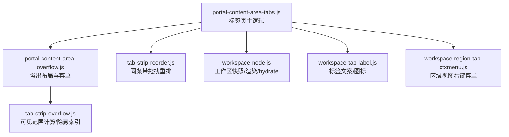
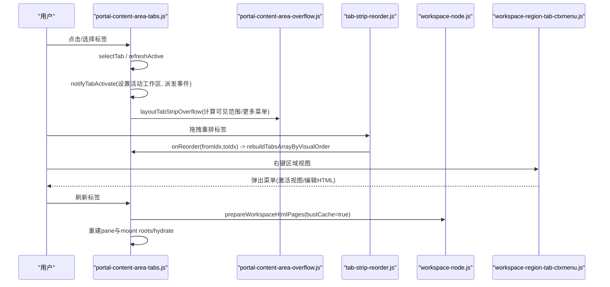
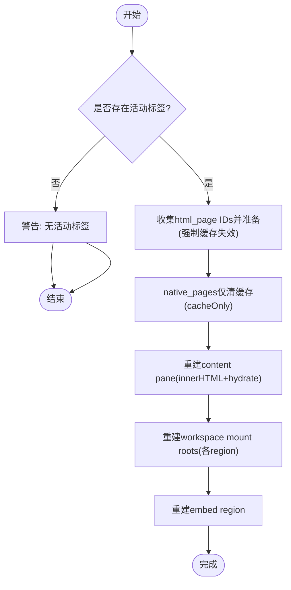
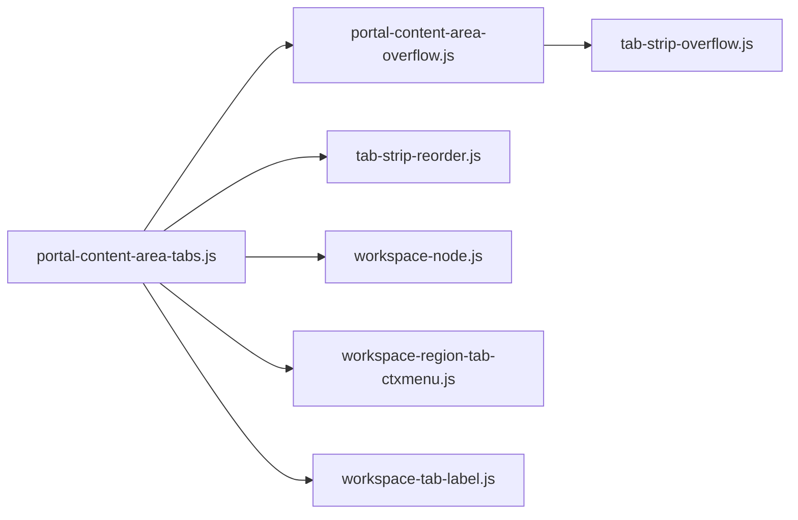

# 标签页管理

<cite>
**本文引用的文件**
- [portal-content-area-tabs.js](file://CMXPortalManager/src/components/portal-content-area-tabs.js)
- [tab-strip-overflow.js](file://CMXPortalManager/src/lib/tab-strip-overflow.js)
- [portal-content-area-overflow.js](file://CMXPortalManager/src/components/portal-content-area-overflow.js)
- [workspace-region-tab-ctxmenu.js](file://CMXPortalManager/src/lib/workspace-region-tab-ctxmenu.js)
- [workspace-tab-label.js](file://CMXPortalManager/src/lib/workspace-tab-label.js)
- [tab-strip-reorder.js](file://CMXPortalManager/src/lib/tab-strip-reorder.js)
- [workspace-node.js](file://CMXPortalManager/src/lib/workspace-node.js)
</cite>

## 目录
1. [简介](#简介)
2. [项目结构](#项目结构)
3. [核心组件](#核心组件)
4. [架构总览](#架构总览)
5. [详细组件分析](#详细组件分析)
6. [依赖关系分析](#依赖关系分析)
7. [性能考量](#性能考量)
8. [故障排查指南](#故障排查指南)
9. [结论](#结论)
10. [附录](#附录)

## 简介
本文件面向工作区标签页管理系统，系统性说明标签页的生命周期（创建、激活、切换、销毁）、状态管理（脏标记、缓存与内存优化）、操作实现（添加、删除、选择、刷新）、溢出处理与滚动行为、响应式布局适配、上下文菜单与快捷键支持、持久化与恢复以及错误处理机制。文档以代码级为依据，提供可视化图示与可追溯来源，帮助读者快速理解并扩展该子系统。

## 项目结构
标签页管理由“内容区域标签”、“溢出处理”、“拖拽重排”、“上下文菜单”、“标签文案与图标”、“工作区节点与渲染”等模块协作完成：
- 内容区域标签：负责标签的增删改查、激活切换、刷新、脏标记与事件派发。
- 溢出处理：计算可见范围、隐藏不可见标签、生成“更多”菜单。
- 拖拽重排：同条带内拖拽重排，使用 CSS order 避免 CE 生命周期抖动。
- 上下文菜单：为各区域视图提供右键菜单（激活视图、在 HTML 设计器中编辑）。
- 标签文案与图标：统一从工作区配置提取显示文本与图标。
- 工作区节点与渲染：提供工作区快照、应用 Shell、HTML 页面准备与 hydrate。

图表来源
- [portal-content-area-tabs.js:21-78](file://CMXPortalManager/src/components/portal-content-area-tabs.js#L21-L78)
- [portal-content-area-overflow.js:8-30](file://CMXPortalManager/src/components/portal-content-area-overflow.js#L8-L30)
- [tab-strip-reorder.js:26-197](file://CMXPortalManager/src/lib/tab-strip-reorder.js#L26-L197)
- [workspace-node.js:31-98](file://CMXPortalManager/src/lib/workspace-node.js#L31-L98)
- [workspace-tab-label.js:16-46](file://CMXPortalManager/src/lib/workspace-tab-label.js#L16-L46)
- [workspace-region-tab-ctxmenu.js:35-76](file://CMXPortalManager/src/lib/workspace-region-tab-ctxmenu.js#L35-L76)
- [tab-strip-overflow.js:70-104](file://CMXPortalManager/src/lib/tab-strip-overflow.js#L70-L104)

章节来源
- [portal-content-area-tabs.js:21-78](file://CMXPortalManager/src/components/portal-content-area-tabs.js#L21-L78)
- [portal-content-area-overflow.js:8-30](file://CMXPortalManager/src/components/portal-content-area-overflow.js#L8-L30)
- [tab-strip-reorder.js:26-197](file://CMXPortalManager/src/lib/tab-strip-reorder.js#L26-L197)
- [workspace-node.js:31-98](file://CMXPortalManager/src/lib/workspace-node.js#L31-L98)
- [workspace-tab-label.js:16-46](file://CMXPortalManager/src/lib/workspace-tab-label.js#L16-L46)
- [workspace-region-tab-ctxmenu.js:35-76](file://CMXPortalManager/src/lib/workspace-region-tab-ctxmenu.js#L35-L76)
- [tab-strip-overflow.js:70-104](file://CMXPortalManager/src/lib/tab-strip-overflow.js#L70-L104)

## 核心组件
- 标签页主逻辑（portal-content-area-tabs.js）
  - 新增标签：addTab 支持 id、文本、图标、内容、是否可关闭、脏标记、初始上下文、工作区 shell 等；若已存在则更新属性并选中。
  - 选择与激活：selectTab/selectTabById 设置活跃标签并触发激活事件；notifyTabActivate 设置活动工作区并派发 portal-content-tab-activate。
  - 删除与批量删除：removeTabIds/closeTabDirect 清理挂载、移除 DOM、调整活跃标签并重新渲染。
  - 刷新：refreshActiveTab 对 html_pages/native_pages/mount roots/embed 进行强制网络刷新与重建，确保数据最新。
  - 脏标记：setTabDirty/getTabDirty/hasAnyDirtyTab 配合 UI 提示与关闭确认。
  - 渲染策略：renderTabs 采用增量更新 pane，避免 CE 重复初始化导致的数据重复请求。
- 溢出处理（portal-content-area-overflow.js + tab-strip-overflow.js）
  - 计算可见范围：computeVisibleTabRange 保证当前激活标签始终可见，必要时隐藏两侧标签。
  - “更多”菜单：layoutTabStripOverflow 动态生成隐藏标签的菜单项，点击后跳转对应标签。
- 拖拽重排（tab-strip-reorder.js）
  - 同条带拖拽：wireTabStripReorder 监听 dragstart/dragover/drop 等事件，插入指示线，最终调用 onReorder。
  - CSS order 重排：reorderByCssOrder 仅修改 style.order，不移动 DOM，避免 CE 断开连接带来的副作用。
- 上下文菜单（workspace-region-tab-ctxmenu.js）
  - 多视图/单视图区域：根据命中目标确定目标视图索引，弹出 ui5-menu，支持“激活该视图”和“在 HTML 设计器中编辑”。
  - 事件分发：通过 portal-workspace-view-context-action 事件冒泡到宿主，由上层集中处理。
- 标签文案与图标（workspace-tab-label.js）
  - 统一从工作区配置的包装层或首个视图提取 caption/icon，提供浏览器标签、侧栏签、底部签等场景的显示名与图标。
- 工作区节点与渲染（workspace-node.js）
  - 工作区快照：workspaceShellSnapshot 抽取 explorer/property/bottom/floatview/model/inner/embed 等区域配置。
  - 应用 Shell：applyWorkspaceShell 将快照应用到侧栏/属性/底部面板，支持挂载根复用。
  - 导出能力：重导出 hydrateHtmlPagesWorkspaceViewsInRoot 等工具函数供标签页渲染使用。

章节来源
- [portal-content-area-tabs.js:21-78](file://CMXPortalManager/src/components/portal-content-area-tabs.js#L21-L78)
- [portal-content-area-tabs.js:80-129](file://CMXPortalManager/src/components/portal-content-area-tabs.js#L80-L129)
- [portal-content-area-tabs.js:131-248](file://CMXPortalManager/src/components/portal-content-area-tabs.js#L131-L248)
- [portal-content-area-tabs.js:250-312](file://CMXPortalManager/src/components/portal-content-area-tabs.js#L250-L312)
- [portal-content-area-tabs.js:327-412](file://CMXPortalManager/src/components/portal-content-area-tabs.js#L327-L412)
- [portal-content-area-overflow.js:8-30](file://CMXPortalManager/src/components/portal-content-area-overflow.js#L8-L30)
- [tab-strip-overflow.js:70-104](file://CMXPortalManager/src/lib/tab-strip-overflow.js#L70-L104)
- [tab-strip-reorder.js:26-197](file://CMXPortalManager/src/lib/tab-strip-reorder.js#L26-L197)
- [workspace-region-tab-ctxmenu.js:35-76](file://CMXPortalManager/src/lib/workspace-region-tab-ctxmenu.js#L35-L76)
- [workspace-tab-label.js:16-46](file://CMXPortalManager/src/lib/workspace-tab-label.js#L16-L46)
- [workspace-node.js:31-98](file://CMXPortalManager/src/lib/workspace-node.js#L31-L98)

## 架构总览
标签页系统围绕“内容区域标签”为核心，联动溢出处理、拖拽重排、上下文菜单与工作区渲染，形成完整的标签生命周期与交互闭环。

图表来源
- [portal-content-area-tabs.js:250-275](file://CMXPortalManager/src/components/portal-content-area-tabs.js#L250-L275)
- [portal-content-area-tabs.js:327-412](file://CMXPortalManager/src/components/portal-content-area-tabs.js#L327-L412)
- [portal-content-area-overflow.js:32-74](file://CMXPortalManager/src/components/portal-content-area-overflow.js#L32-L74)
- [tab-strip-reorder.js:26-197](file://CMXPortalManager/src/lib/tab-strip-reorder.js#L26-L197)
- [workspace-region-tab-ctxmenu.js:35-76](file://CMXPortalManager/src/lib/workspace-region-tab-ctxmenu.js#L35-L76)
- [workspace-node.js:31-98](file://CMXPortalManager/src/lib/workspace-node.js#L31-L98)

## 详细组件分析

### 标签页生命周期管理
- 创建流程（addTab）
  - 参数校验与去重：若标签已存在则更新 workspaceShell/contentSpec/layoutId/originalWorkspace/initialContext/dirty 并选中。
  - 新建标签：写入 _tabs 数组，触发 renderTabs 与 selectTab。
  - 初始上下文注入：createWorkspace 后通过 ws.context.set 注入 initialContext，并在渲染完成后清空以避免重复注入。
- 激活与切换（selectTab/notifyTabActivate）
  - 设置 host._activeTab，刷新 active 样式，派发 portal-content-tab-activate 事件，包含 tabId、workspaceShell、sourceNode（用于前进/回退重建）。
  - 设置活动工作区并失效 actions 缓存，确保按钮/菜单基于当前工作区重算。
- 销毁流程（removeTabIds/closeTabDirect）
  - 清理工作区挂载 disposeWorkspaceMountsForTab，移除浮动自动打开记录，更新 _tabs 与活跃标签，重新渲染并通知激活。
- 刷新流程（refreshActiveTab）
  - html_pages：collectHtmlPageIdsFromWorkspace + prepareWorkspaceHtmlPages({bustCache:true}) 强制网络拉取并写回 spec.data。
  - native_pages：仅清缓存（cacheOnly），避免旧实例与新实例重复加载。
  - 重建 pane：innerHTML = renderWorkspaceRegionViewsHtml('content', ...)，再 hydrate。
  - 重建 mount roots：逐个 region(explorer/property/bottom/floatview/model/inner) 重建并 hydrate，native pages 再次 _reload。
  - embed region：逐个 root 重建并 hydrate。
  - 防抖：_refreshInFlight 防止并发刷新。

图表来源
- [portal-content-area-tabs.js:327-412](file://CMXPortalManager/src/components/portal-content-area-tabs.js#L327-L412)

章节来源
- [portal-content-area-tabs.js:21-78](file://CMXPortalManager/src/components/portal-content-area-tabs.js#L21-L78)
- [portal-content-area-tabs.js:250-275](file://CMXPortalManager/src/components/portal-content-area-tabs.js#L250-L275)
- [portal-content-area-tabs.js:102-129](file://CMXPortalManager/src/components/portal-content-area-tabs.js#L102-L129)
- [portal-content-area-tabs.js:327-412](file://CMXPortalManager/src/components/portal-content-area-tabs.js#L327-L412)

### 状态管理机制（脏标记、缓存策略、内存优化）
- 脏标记
  - setTabDirty/getTabDirty/hasAnyDirtyTab 维护标签的 dirty 状态，UI 通过 is-dirty 类名展示。
  - 关闭时若存在脏标签，弹出确认对话框，避免误关未保存修改。
- 缓存策略
  - 刷新时 html_pages 使用 bustCache 强制走网络；native_pages 先 cacheOnly 清缓存，再由新实例单次加载，避免重复请求。
  - 渲染 pane 时采用增量策略：strip 整体重建，body 仅补充新 pane 或摘除已关闭 pane，避免 CE 重复初始化导致的 fetch 重复。
- 内存优化
  - 工作区挂载根复用：applyWorkspaceShell 支持 mounts 参数，只创建一次挂载根，切换时移动而非重建。
  - 初始上下文一次性注入：initialContext 在 createWorkspace 后立即写入 ws.context，随后清空，避免重复注入。
  - 刷新防抖：_refreshInFlight 标志位防止并发刷新造成资源浪费。

章节来源
- [portal-content-area-tabs.js:80-94](file://CMXPortalManager/src/components/portal-content-area-tabs.js#L80-L94)
- [portal-content-area-tabs.js:102-129](file://CMXPortalManager/src/components/portal-content-area-tabs.js#L102-L129)
- [portal-content-area-tabs.js:131-248](file://CMXPortalManager/src/components/portal-content-area-tabs.js#L131-L248)
- [portal-content-area-tabs.js:327-412](file://CMXPortalManager/src/components/portal-content-area-tabs.js#L327-L412)
- [workspace-node.js:31-98](file://CMXPortalManager/src/lib/workspace-node.js#L31-L98)

### 添加、删除、选择和刷新操作的具体实现
- 添加：addTab 支持 id/text/icon/content/closeable/dirty/contentSpec/workspaceLayoutId/originalWorkspace/sourceNode/initialContext/workspaceShell；已存在则更新并选中。
- 删除：removeTabIds/closeTabDirect 清理挂载、移除浮动自动打开记录、更新 _tabs 与活跃标签、重新渲染并通知激活。
- 选择：selectTab/selectTabById 设置活跃标签并刷新样式，派发激活事件。
- 刷新：refreshActiveTab 对 html_pages/native_pages/mount roots/embed 进行强制刷新与重建，确保数据一致性与界面最新。

章节来源
- [portal-content-area-tabs.js:21-78](file://CMXPortalManager/src/components/portal-content-area-tabs.js#L21-L78)
- [portal-content-area-tabs.js:102-129](file://CMXPortalManager/src/components/portal-content-area-tabs.js#L102-L129)
- [portal-content-area-tabs.js:250-275](file://CMXPortalManager/src/components/portal-content-area-tabs.js#L250-L275)
- [portal-content-area-tabs.js:327-412](file://CMXPortalManager/src/components/portal-content-area-tabs.js#L327-L412)

### 溢出处理、滚动行为与响应式布局适配
- 可见范围计算：computeVisibleTabRange 保证当前激活标签可见，必要时隐藏两侧标签。
- “更多”菜单：layoutTabStripOverflow 动态生成隐藏标签菜单项，点击后跳转对应标签；预留宽度 TAB_OVERFLOW_BTN_RESERVE 与样式 PORTAL_TAB_OVERFLOW_STYLES 保持一致。
- 响应式：根据容器宽度与标签自然宽度动态决定显示/隐藏，窗口尺寸变化时重新计算。

章节来源
- [tab-strip-overflow.js:70-104](file://CMXPortalManager/src/lib/tab-strip-overflow.js#L70-L104)
- [portal-content-area-overflow.js:32-74](file://CMXPortalManager/src/components/portal-content-area-overflow.js#L32-L74)

### 上下文菜单功能、右键操作与快捷键支持
- 区域视图右键菜单：wireWorkspaceRegionTabContextMenu 支持多视图/单视图区域，弹出 ui5-menu，提供“激活该视图”和“在 HTML 设计器中编辑”选项。
- 事件分发：通过 portal-workspace-view-context-action 事件冒泡到宿主，由上层集中处理实际行为。
- 快捷键：当前实现未内置全局快捷键绑定；可通过监听键盘事件并在合适时机调用 selectTab/addTab/removeTab 等方法扩展。

章节来源
- [workspace-region-tab-ctxmenu.js:35-76](file://CMXPortalManager/src/lib/workspace-region-tab-ctxmenu.js#L35-L76)
- [workspace-region-tab-ctxmenu.js:78-172](file://CMXPortalManager/src/lib/workspace-region-tab-ctxmenu.js#L78-L172)

### 持久化存储、状态恢复与错误处理
- 持久化：当前实现未直接涉及本地持久化；可通过外部机制（如 localStorage/sessionStorage）保存 _tabs 与 _activeTab，并在应用启动时恢复。
- 状态恢复：建议在应用初始化时读取持久化数据，调用 addTab/selectTab 重建标签状态。
- 错误处理：refreshActiveTab 捕获异常并返回 false；notifyTabActivate 在 workspace 未建时零开销；控制台输出警告信息便于调试。

章节来源
- [portal-content-area-tabs.js:327-412](file://CMXPortalManager/src/components/portal-content-area-tabs.js#L327-L412)
- [portal-content-area-tabs.js:250-275](file://CMXPortalManager/src/components/portal-content-area-tabs.js#L250-L275)

## 依赖关系分析
标签页系统内部依赖清晰，耦合度低，职责分明：
- portal-content-area-tabs.js 依赖溢出处理、拖拽重排、工作区节点与渲染、上下文菜单与标签文案。
- 溢出处理依赖 tab-strip-overflow.js 的计算逻辑。
- 拖拽重排独立于其他模块，仅通过回调与主逻辑交互。
- 上下文菜单通过事件与宿主解耦。
- 工作区节点提供快照与应用能力，被标签页渲染与刷新使用。

图表来源
- [portal-content-area-tabs.js:21-78](file://CMXPortalManager/src/components/portal-content-area-tabs.js#L21-L78)
- [portal-content-area-overflow.js:8-30](file://CMXPortalManager/src/components/portal-content-area-overflow.js#L8-L30)
- [tab-strip-reorder.js:26-197](file://CMXPortalManager/src/lib/tab-strip-reorder.js#L26-L197)
- [workspace-node.js:31-98](file://CMXPortalManager/src/lib/workspace-node.js#L31-L98)
- [workspace-region-tab-ctxmenu.js:35-76](file://CMXPortalManager/src/lib/workspace-region-tab-ctxmenu.js#L35-L76)
- [workspace-tab-label.js:16-46](file://CMXPortalManager/src/lib/workspace-tab-label.js#L16-L46)
- [tab-strip-overflow.js:70-104](file://CMXPortalManager/src/lib/tab-strip-overflow.js#L70-L104)

章节来源
- [portal-content-area-tabs.js:21-78](file://CMXPortalManager/src/components/portal-content-area-tabs.js#L21-L78)
- [portal-content-area-overflow.js:8-30](file://CMXPortalManager/src/components/portal-content-area-overflow.js#L8-L30)
- [tab-strip-reorder.js:26-197](file://CMXPortalManager/src/lib/tab-strip-reorder.js#L26-L197)
- [workspace-node.js:31-98](file://CMXPortalManager/src/lib/workspace-node.js#L31-L98)
- [workspace-region-tab-ctxmenu.js:35-76](file://CMXPortalManager/src/lib/workspace-region-tab-ctxmenu.js#L35-L76)
- [workspace-tab-label.js:16-46](file://CMXPortalManager/src/lib/workspace-tab-label.js#L16-L46)
- [tab-strip-overflow.js:70-104](file://CMXPortalManager/src/lib/tab-strip-overflow.js#L70-L104)

## 性能考量
- 渲染策略：renderTabs 采用增量更新 pane，避免 CE 重复初始化导致的 fetch 重复与性能损耗。
- 刷新优化：refreshActiveTab 使用 bustCache 强制网络刷新，native_pages 仅清缓存避免重复加载；_refreshInFlight 防止并发刷新。
- 内存优化：工作区挂载根复用，初始上下文一次性注入，减少不必要的对象创建与重复操作。
- 溢出计算：computeVisibleTabRange 保证激活标签可见，减少滚动与重绘开销。

[本节为通用性能讨论，无需具体文件分析]

## 故障排查指南
- 刷新失败：refreshActiveTab 捕获异常并返回 false，检查 console.warn 输出定位问题。
- 标签未激活：检查 selectTab/notifyTabActivate 是否正确设置 _activeTab 并派发事件。
- 溢出菜单不显示：检查 layoutTabStripOverflow 是否正确计算 visible range 与 needsOverflow。
- 拖拽重排无效：检查 wireTabStripReorder 是否正确绑定事件与 onReorder 回调。
- 上下文菜单不生效：检查 wireWorkspaceRegionTabContextMenu 是否正确注册 contextmenu 事件与菜单项。

章节来源
- [portal-content-area-tabs.js:327-412](file://CMXPortalManager/src/components/portal-content-area-tabs.js#L327-L412)
- [portal-content-area-tabs.js:250-275](file://CMXPortalManager/src/components/portal-content-area-tabs.js#L250-L275)
- [portal-content-area-overflow.js:32-74](file://CMXPortalManager/src/components/portal-content-area-overflow.js#L32-L74)
- [tab-strip-reorder.js:26-197](file://CMXPortalManager/src/lib/tab-strip-reorder.js#L26-L197)
- [workspace-region-tab-ctxmenu.js:35-76](file://CMXPortalManager/src/lib/workspace-region-tab-ctxmenu.js#L35-L76)

## 结论
标签页管理系统通过清晰的模块划分与职责分离，实现了完整的标签生命周期管理、状态控制、溢出处理、拖拽重排、上下文菜单与工作区渲染联动。其增量渲染、缓存策略与内存优化确保了良好的性能表现。未来可扩展持久化存储与快捷键支持，进一步提升用户体验与可定制性。

[本节为总结性内容，无需具体文件分析]

## 附录
- 关键函数路径参考：
  - 标签页主逻辑：[portal-content-area-tabs.js](file://CMXPortalManager/src/components/portal-content-area-tabs.js)
  - 溢出处理：[portal-content-area-overflow.js](file://CMXPortalManager/src/components/portal-content-area-overflow.js)、[tab-strip-overflow.js](file://CMXPortalManager/src/lib/tab-strip-overflow.js)
  - 拖拽重排：[tab-strip-reorder.js](file://CMXPortalManager/src/lib/tab-strip-reorder.js)
  - 上下文菜单：[workspace-region-tab-ctxmenu.js](file://CMXPortalManager/src/lib/workspace-region-tab-ctxmenu.js)
  - 标签文案与图标：[workspace-tab-label.js](file://CMXPortalManager/src/lib/workspace-tab-label.js)
  - 工作区节点与渲染：[workspace-node.js](file://CMXPortalManager/src/lib/workspace-node.js)

[本节为附录，无需具体文件分析]