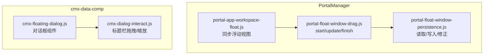
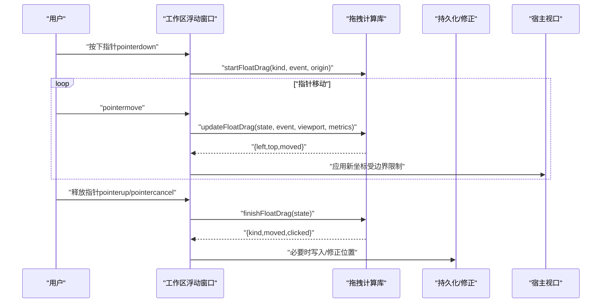
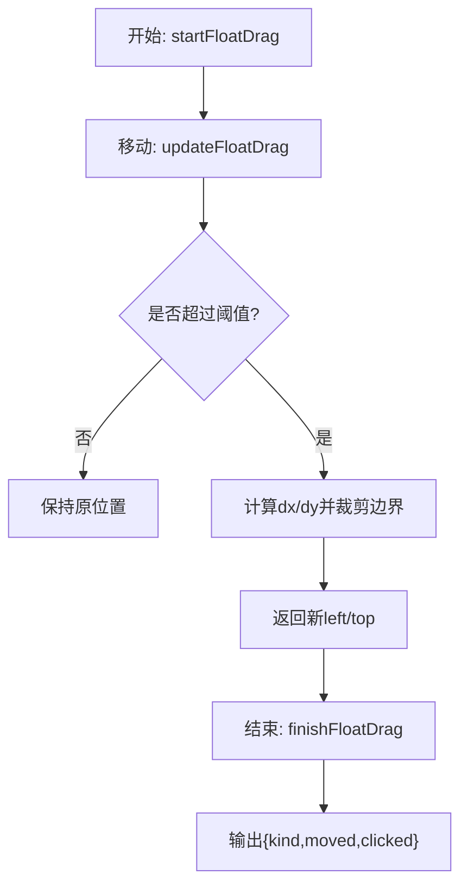
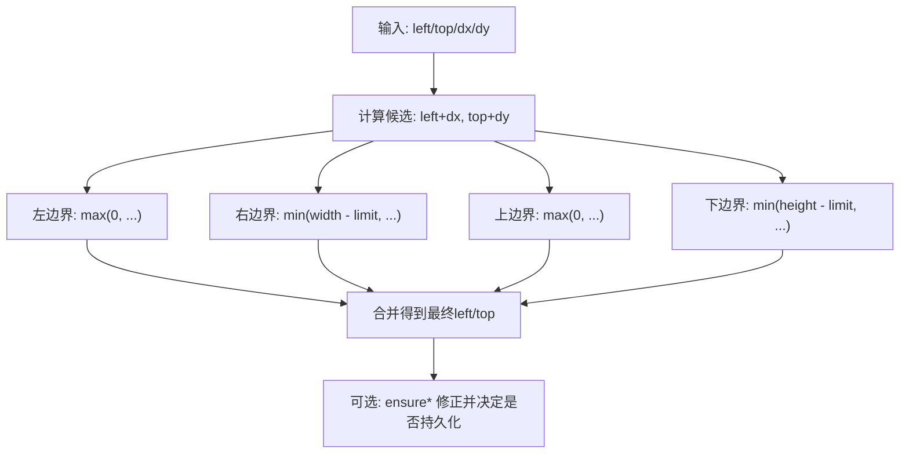
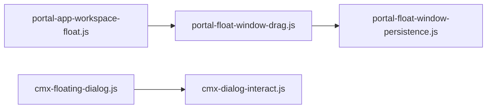

# 拖拽功能

<cite>
**本文引用的文件**
- [portal-float-window-drag.js](file://CMXPortalManager/src/lib/portal-float-window-drag.js)
- [portal-float-window-persistence.js](file://CMXPortalManager/src/lib/portal-float-window-persistence.js)
- [cmx-dialog-interact.js](file://packages/cmx-data-comp/src/lib/cmx-dialog-interact.js)
- [cmx-floating-dialog.js](file://packages/cmx-data-comp/src/components/cmx-floating-dialog.js)
- [portal-app-workspace-float.js](file://CMXPortalManager/src/components/portal-app-workspace-float.js)
</cite>

## 目录
1. [简介](#简介)
2. [项目结构](#项目结构)
3. [核心组件](#核心组件)
4. [架构总览](#架构总览)
5. [详细组件分析](#详细组件分析)
6. [依赖关系分析](#依赖关系分析)
7. [性能考虑](#性能考虑)
8. [故障排查指南](#故障排查指南)
9. [结论](#结论)
10. [附录](#附录)

## 简介
本文件聚焦“浮动窗口拖拽”能力，围绕以下目标展开：
- 解释拖拽状态管理机制，包括 startFloatDrag、updateFloatDrag、finishFloatDrag 的实现原理与数据流。
- 说明鼠标事件处理流程：指针位置计算、移动距离检测、移动阈值判断。
- 阐述边界检测算法：确保窗口在视口范围内移动，防止溢出屏幕。
- 对比标题栏拖拽与小球拖拽两种模式的差异。
- 提供性能优化策略（防抖与节流）与常见问题解决方案（卡顿、边界溢出等）。

## 项目结构
与浮动窗口拖拽相关的代码主要分布在以下模块：
- 纯函数式拖拽计算：portal-float-window-drag.js
- 持久化与视口修正：portal-float-window-persistence.js
- 对话框标题栏拖拽与缩放：cmx-dialog-interact.js
- 通用浮层对话框组件：cmx-floating-dialog.js
- 工作区浮动视图同步：portal-app-workspace-float.js



图表来源
- [portal-app-workspace-float.js:15-43](file://CMXPortalManager/src/components/portal-app-workspace-float.js#L15-L43)
- [portal-float-window-drag.js:10-58](file://CMXPortalManager/src/lib/portal-float-window-drag.js#L10-L58)
- [portal-float-window-persistence.js:42-102](file://CMXPortalManager/src/lib/portal-float-window-persistence.js#L42-L102)
- [cmx-floating-dialog.js:404-424](file://packages/cmx-data-comp/src/components/cmx-floating-dialog.js#L404-L424)
- [cmx-dialog-interact.js:54-102](file://packages/cmx-data-comp/src/lib/cmx-dialog-interact.js#L54-L102)

章节来源
- [portal-app-workspace-float.js:15-43](file://CMXPortalManager/src/components/portal-app-workspace-float.js#L15-L43)
- [portal-float-window-drag.js:10-58](file://CMXPortalManager/src/lib/portal-float-window-drag.js#L10-L58)
- [portal-float-window-persistence.js:42-102](file://CMXPortalManager/src/lib/portal-float-window-persistence.js#L42-L102)
- [cmx-floating-dialog.js:404-424](file://packages/cmx-data-comp/src/components/cmx-floating-dialog.js#L404-L424)
- [cmx-dialog-interact.js:54-102](file://packages/cmx-data-comp/src/lib/cmx-dialog-interact.js#L54-L102)

## 核心组件
- 拖拽计算库（portal-float-window-drag.js）
  - startFloatDrag：初始化拖拽状态，记录起始指针坐标与初始 left/top，并标记未移动。
  - updateFloatDrag：根据当前事件计算 dx/dy，结合 moveThreshold 判定是否真正移动；按模式（ball/title）分别进行边界裁剪，返回新的 left/top。
  - finishFloatDrag：结束拖拽时输出 kind、moved 以及 clicked（未移动视为点击）。
- 持久化与视口修正（portal-float-window-persistence.js）
  - ensureFloatBallPos / ensureFloatWindowRect：对已保存的位置或矩形进行可见性检查，若不可见则回退到默认值并标记是否需要重新持久化。
  - read/write 系列：读写 localStorage 中的小球位置与窗口矩形。
- 对话框交互（cmx-dialog-interact.js）
  - wireDialogBoxDrag：标题栏拖拽实现，包含指针捕获、移动计算与边界限制。
  - wireDialogBoxResize：边角缩放实现，支持最小宽高约束与视口边界限制。
  - centerDialogBox：居中定位，适配首帧尺寸不稳定场景。
- 对话框组件（cmx-floating-dialog.js）
  - 通过 _wireInteract 调用 wireDialogBoxDrag/wireDialogBoxResize，统一生命周期管理（AbortController），并在 dock/fullscreen/resizable/draggable 等配置下动态启用/禁用交互。

章节来源
- [portal-float-window-drag.js:10-58](file://CMXPortalManager/src/lib/portal-float-window-drag.js#L10-L58)
- [portal-float-window-persistence.js:42-102](file://CMXPortalManager/src/lib/portal-float-window-persistence.js#L42-L102)
- [cmx-dialog-interact.js:54-102](file://packages/cmx-data-comp/src/lib/cmx-dialog-interact.js#L54-L102)
- [cmx-dialog-interact.js:115-200](file://packages/cmx-data-comp/src/lib/cmx-dialog-interact.js#L115-L200)
- [cmx-floating-dialog.js:404-424](file://packages/cmx-data-comp/src/components/cmx-floating-dialog.js#L404-L424)

## 架构总览
整体流程分为两条主线：
- 工作区浮动窗口（小球 + 内容窗体）：由 portal-app-workspace-float.js 触发，使用 portal-float-window-drag.js 计算位移，并通过 portal-float-window-persistence.js 持久化与修正。
- 通用对话框（标题栏拖拽/缩放）：由 cmx-floating-dialog.js 组合 cmx-dialog-interact.js 的拖拽与缩放能力，遵循统一的宿主视口边界约束。



图表来源
- [portal-float-window-drag.js:10-58](file://CMXPortalManager/src/lib/portal-float-window-drag.js#L10-L58)
- [portal-float-window-persistence.js:42-102](file://CMXPortalManager/src/lib/portal-float-window-persistence.js#L42-L102)

## 详细组件分析

### 拖拽状态管理与三阶段函数
- 开始阶段（startFloatDrag）
  - 输入：拖拽类型（'ball'|'title'）、指针事件、初始坐标 origin。
  - 输出：包含 kind、pointerX/Y、left/top、moved=false 的状态对象。
  - 作用：锁定起始指针位置与窗口初始位置，为后续增量计算做准备。
- 更新阶段（updateFloatDrag）
  - 输入：当前 dragState、事件、viewport、metrics（ballSize/titleBarHeight/minWindowWidth/moveThreshold）。
  - 计算：dx = clientX - pointerX，dy = clientY - pointerY；基于 moveThreshold 判定 moved。
  - 边界：按模式裁剪 left/top，保证不超出视口且满足最小宽度/高度要求。
  - 输出：新的 left/top 与 moved 标志。
- 结束阶段（finishFloatDrag）
  - 输入：dragState。
  - 输出：{kind, moved, clicked}，其中 clicked 表示未发生有效移动时的点击语义。



图表来源
- [portal-float-window-drag.js:10-58](file://CMXPortalManager/src/lib/portal-float-window-drag.js#L10-L58)

章节来源
- [portal-float-window-drag.js:10-58](file://CMXPortalManager/src/lib/portal-float-window-drag.js#L10-L58)

### 鼠标事件处理流程
- 指针位置计算
  - 使用 PointerEvent 的 clientX/clientY 作为绝对坐标基准。
  - 在 updateFloatDrag 中计算 dx/dy，用于增量位移。
- 移动距离检测与阈值判断
  - moveThreshold 用于过滤微小抖动，避免误判为拖拽。
  - moved 标志一旦置位，后续即使位移很小也维持拖拽态，提升体验一致性。
- 事件绑定与生命周期
  - 工作区浮动窗口通常在 pointerdown/pointermove/pointerup 上调用上述三函数。
  - 对话框标题栏拖拽在 cmx-dialog-interact.js 中通过 pointerdown/move/up/cancel 完成，并使用 setPointerCapture/releasePointerCapture 保证跨元素稳定跟踪。

章节来源
- [portal-float-window-drag.js:27-49](file://CMXPortalManager/src/lib/portal-float-window-drag.js#L27-L49)
- [cmx-dialog-interact.js:54-102](file://packages/cmx-data-comp/src/lib/cmx-dialog-interact.js#L54-L102)

### 边界检测算法
- 小球模式（'ball'）
  - 左边界：left >= 0
  - 右边界：left <= width - ballSize
  - 上边界：top >= 0
  - 下边界：top <= height - ballSize
- 标题栏模式（'title'）
  - 左边界：left >= 0
  - 右边界：left <= width - minWindowWidth
  - 上边界：top >= 0
  - 下边界：top <= height - titleBarHeight
- 视口修正（持久化前）
  - ensureFloatBallPos / ensureFloatWindowRect：当保存的位置导致可视区域过小或不可见时，回退到默认位置并标记需要重新持久化。



图表来源
- [portal-float-window-drag.js:37-48](file://CMXPortalManager/src/lib/portal-float-window-drag.js#L37-L48)
- [portal-float-window-persistence.js:42-102](file://CMXPortalManager/src/lib/portal-float-window-persistence.js#L42-L102)

章节来源
- [portal-float-window-drag.js:37-48](file://CMXPortalManager/src/lib/portal-float-window-drag.js#L37-L48)
- [portal-float-window-persistence.js:42-102](file://CMXPortalManager/src/lib/portal-float-window-persistence.js#L42-L102)

### 标题栏拖拽 vs 小球拖拽的差异
- 触发源
  - 标题栏：在对话框标题栏 bar 上监听 pointer 事件（cmx-dialog-interact.js）。
  - 小球：在工作区浮动小球上调用 start/update/finish 流程（portal-float-window-drag.js）。
- 约束差异
  - 标题栏：以对话框 box 的宽高为约束，限制其相对宿主 host 的 left/top。
  - 小球：以球体尺寸 ballSize 为约束，限制其在视口中的可见范围。
- 行为语义
  - 标题栏拖拽通常伴随对话框的居中/缩放能力。
  - 小球拖拽更轻量，主要用于快速定位与收起/展开入口。

章节来源
- [cmx-dialog-interact.js:54-102](file://packages/cmx-data-comp/src/lib/cmx-dialog-interact.js#L54-L102)
- [portal-float-window-drag.js:37-48](file://CMXPortalManager/src/lib/portal-float-window-drag.js#L37-L48)

### 对话框拖拽与缩放（标题栏/边角）
- 标题栏拖拽
  - 使用 AbortController 统一管理事件监听生命周期，避免内存泄漏。
  - 通过 setPointerCapture 确保跨元素移动仍被正确跟踪。
  - 边界限制：将 box 的 left/top 限制在宿主 host 的可视范围内。
- 边角缩放
  - 识别 data-dlg-resize 手柄，进入缩放模式。
  - 先 snapDialogBoxToPixels 固化尺寸，再根据方向（e/w/n/s）调整宽高与位置。
  - 应用最小宽高与视口边界约束，确保不会溢出或小于最小尺寸。

```mermaid
sequenceDiagram
participant U as "用户"
participant Bar as "标题栏"
participant Int as "交互库"
participant Box as "对话框box"
participant Host as "宿主host"
U->>Bar : "pointerdown"
Bar->>Int : "wireDialogBoxDrag 启动"
Int->>Host : "记录宿主尺寸"
loop "pointermove"
U->>Int : "移动事件"
Int->>Box : "计算并设置left/top边界限制"
end
U->>Int : "pointerup/pointercancel"
Int->>Int : "释放指针捕获"
```

图表来源
- [cmx-dialog-interact.js:54-102](file://packages/cmx-data-comp/src/lib/cmx-dialog-interact.js#L54-L102)

章节来源
- [cmx-dialog-interact.js:54-102](file://packages/cmx-data-comp/src/lib/cmx-dialog-interact.js#L54-L102)
- [cmx-dialog-interact.js:115-200](file://packages/cmx-data-comp/src/lib/cmx-dialog-interact.js#L115-L200)
- [cmx-floating-dialog.js:404-424](file://packages/cmx-data-comp/src/components/cmx-floating-dialog.js#L404-L424)

## 依赖关系分析
- portal-app-workspace-float.js 负责同步浮动视图内容与自动打开逻辑，但不直接实现拖拽。
- portal-float-window-drag.js 提供无副作用的拖拽计算，便于在不同宿主复用。
- portal-float-window-persistence.js 提供持久化与可视性修正，确保用户体验一致。
- cmx-floating-dialog.js 组合 cmx-dialog-interact.js 的能力，形成可复用的对话框交互体系。



图表来源
- [portal-app-workspace-float.js:15-43](file://CMXPortalManager/src/components/portal-app-workspace-float.js#L15-L43)
- [portal-float-window-drag.js:10-58](file://CMXPortalManager/src/lib/portal-float-window-drag.js#L10-L58)
- [portal-float-window-persistence.js:42-102](file://CMXPortalManager/src/lib/portal-float-window-persistence.js#L42-L102)
- [cmx-floating-dialog.js:404-424](file://packages/cmx-data-comp/src/components/cmx-floating-dialog.js#L404-L424)
- [cmx-dialog-interact.js:54-102](file://packages/cmx-data-comp/src/lib/cmx-dialog-interact.js#L54-L102)

章节来源
- [portal-app-workspace-float.js:15-43](file://CMXPortalManager/src/components/portal-app-workspace-float.js#L15-L43)
- [portal-float-window-drag.js:10-58](file://CMXPortalManager/src/lib/portal-float-window-drag.js#L10-L58)
- [portal-float-window-persistence.js:42-102](file://CMXPortalManager/src/lib/portal-float-window-persistence.js#L42-L102)
- [cmx-floating-dialog.js:404-424](file://packages/cmx-data-comp/src/components/cmx-floating-dialog.js#L404-L424)
- [cmx-dialog-interact.js:54-102](file://packages/cmx-data-comp/src/lib/cmx-dialog-interact.js#L54-L102)

## 性能考虑
- 移动阈值（moveThreshold）
  - 通过 threshold 过滤微小抖动，减少无效渲染与状态切换。
- 事件节流/防抖建议
  - 在高频 pointermove 回调中，可对 updateFloatDrag 的结果进行节流（例如每 8-16ms 执行一次），降低重排压力。
  - 对 finishFloatDrag 后的持久化操作进行防抖，避免频繁写 localStorage。
- DOM 操作优化
  - 批量更新样式属性，避免多次强制回流。
  - 使用 requestAnimationFrame 包裹布局敏感操作，确保与浏览器绘制周期对齐。
- 资源清理
  - 使用 AbortController 管理事件监听，组件销毁时及时释放，避免内存泄漏。
- 视口修正
  - 仅在必要时调用 ensure* 修正，避免每次移动都进行复杂计算。

[本节为通用性能指导，不直接分析具体文件]

## 故障排查指南
- 拖拽卡顿
  - 现象：拖动过程中掉帧或延迟明显。
  - 排查要点：
    - 检查是否在 pointermove 中进行大量 DOM 查询或样式计算。
    - 确认是否启用了合理的 moveThreshold，避免微小抖动触发过多更新。
    - 评估是否需要对 updateFloatDrag 结果做节流。
- 边界溢出
  - 现象：窗口或小球部分移出视口。
  - 排查要点：
    - 核对 viewport.width/height 是否正确传入 updateFloatDrag。
    - 检查 ensureFloatBallPos/ensureFloatWindowRect 的阈值配置是否合理。
    - 对于对话框，确认宿主 host 的尺寸与容器层级是否正确。
- 点击与拖拽冲突
  - 现象：轻点被误判为拖拽，或拖拽后无法触发点击。
  - 排查要点：
    - 确认 finishFloatDrag 输出的 clicked 字段是否正确使用。
    - 检查 moveThreshold 是否过大导致轻微移动即判定为拖拽。
- 持久化异常
  - 现象：刷新后位置丢失或回到默认位置。
  - 排查要点：
    - 检查 localStorage 读写是否成功（配额、序列化错误）。
    - 确认 ensure* 是否因可视区域过小而重置位置。

章节来源
- [portal-float-window-drag.js:27-58](file://CMXPortalManager/src/lib/portal-float-window-drag.js#L27-L58)
- [portal-float-window-persistence.js:42-108](file://CMXPortalManager/src/lib/portal-float-window-persistence.js#L42-L108)
- [cmx-dialog-interact.js:54-102](file://packages/cmx-data-comp/src/lib/cmx-dialog-interact.js#L54-L102)

## 结论
- 拖拽能力由“计算库 + 持久化 + 交互组件”三层构成，职责清晰、易于复用。
- 通过 moveThreshold 与边界裁剪，兼顾了交互顺滑性与视觉稳定性。
- 标题栏拖拽与小球拖拽在约束与语义上各有侧重，可根据场景选择合适方案。
- 建议在高频事件中引入节流/防抖，并结合 ensure* 修正，以获得更优的性能与一致性体验。

[本节为总结性内容，不直接分析具体文件]

## 附录
- 关键参数速查
  - moveThreshold：移动阈值，单位像素，用于区分点击与拖拽。
  - ballSize：小球尺寸，用于小球模式边界计算。
  - titleBarHeight：标题栏高度，用于标题栏模式下边界计算。
  - minWindowWidth：最小窗口宽度，用于标题栏模式右边界限制。
  - margin/minVisible/minVisibleWidth：持久化修正相关阈值。
- 常用接口路径参考
  - 拖拽计算：[portal-float-window-drag.js:10-58](file://CMXPortalManager/src/lib/portal-float-window-drag.js#L10-L58)
  - 持久化修正：[portal-float-window-persistence.js:42-108](file://CMXPortalManager/src/lib/portal-float-window-persistence.js#L42-L108)
  - 标题栏拖拽：[cmx-dialog-interact.js:54-102](file://packages/cmx-data-comp/src/lib/cmx-dialog-interact.js#L54-L102)
  - 对话框交互装配：[cmx-floating-dialog.js:404-424](file://packages/cmx-data-comp/src/components/cmx-floating-dialog.js#L404-L424)
  - 浮动视图同步：[portal-app-workspace-float.js:15-43](file://CMXPortalManager/src/components/portal-app-workspace-float.js#L15-L43)

[本节为补充信息，不直接分析具体文件]