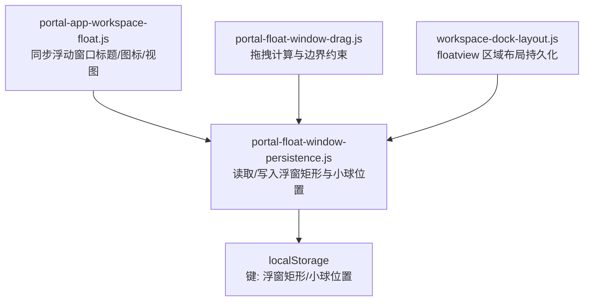
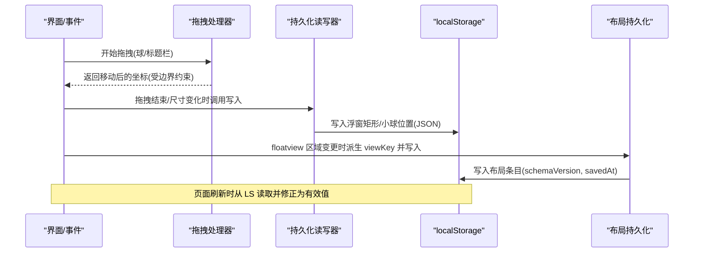
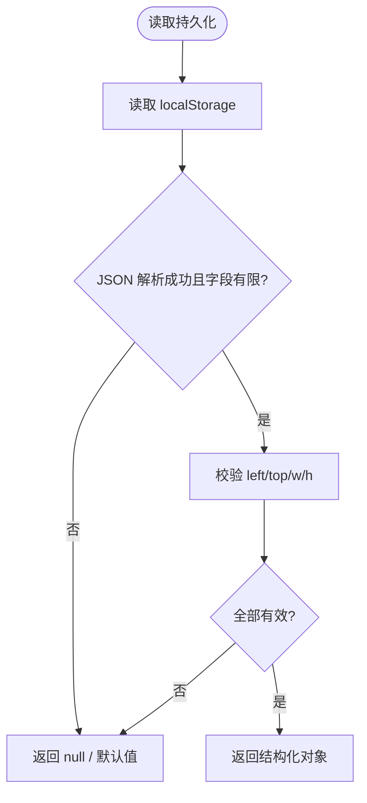
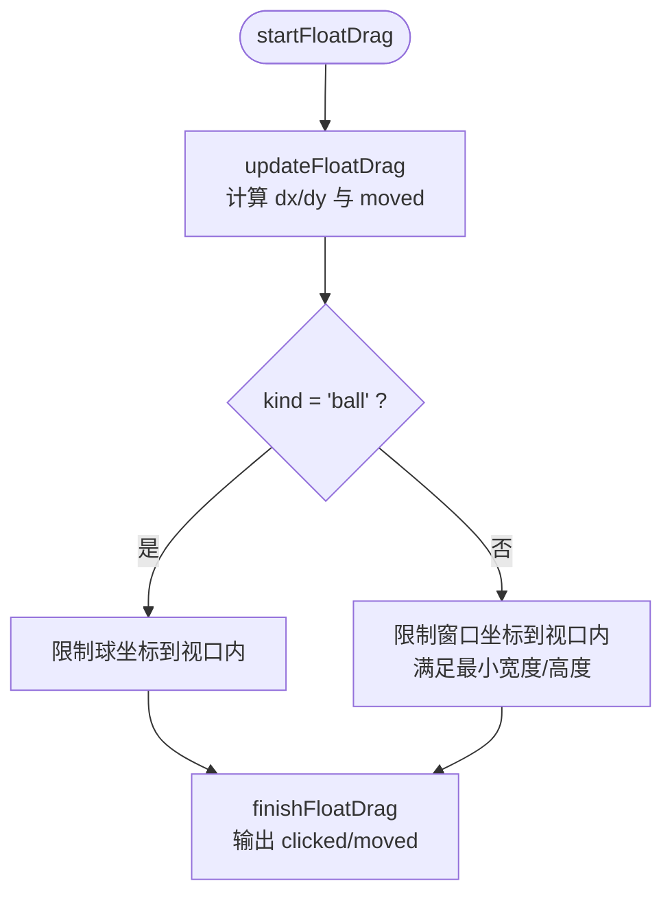
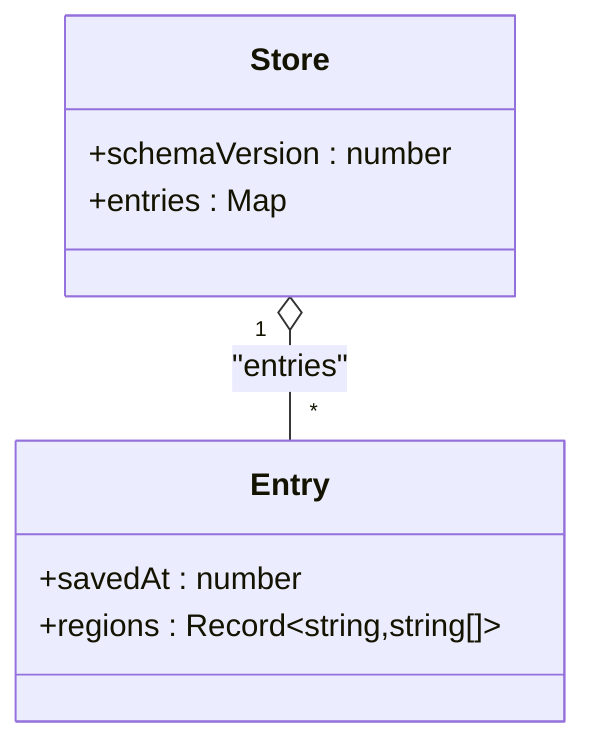
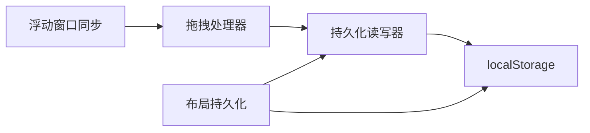
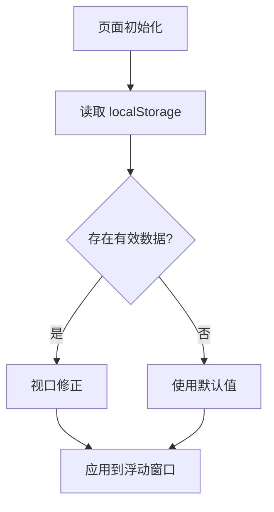

# 持久化存储

<cite>
**本文引用的文件**
- [portal-float-window-persistence.js](file://CMXPortalManager/src/lib/portal-float-window-persistence.js)
- [portal-float-window-drag.js](file://CMXPortalManager/src/lib/portal-float-window-drag.js)
- [workspace-dock-layout.js](file://CMXPortalManager/src/lib/workspace-dock-layout.js)
- [portal-app-workspace-float.js](file://CMXPortalManager/src/components/portal-app-workspace-float.js)
</cite>

## 目录
1. [简介](#简介)
2. [项目结构](#项目结构)
3. [核心组件](#核心组件)
4. [架构总览](#架构总览)
5. [详细组件分析](#详细组件分析)
6. [依赖关系分析](#依赖关系分析)
7. [性能考虑](#性能考虑)
8. [故障排查指南](#故障排查指南)
9. [结论](#结论)
10. [附录](#附录)

## 简介
本文件聚焦“浮动窗口持久化存储”的设计与实现，覆盖以下方面：
- 数据结构设计：位置、尺寸、显示状态等字段的定义与校验。
- 本地存储机制：localStorage 的使用策略与数据序列化方案。
- 保存时机：窗口关闭、拖拽结束、尺寸变化等触发条件。
- 恢复机制：页面刷新后的状态重建与默认值处理。
- 数据迁移：不同版本间的数据格式升级策略。
- 多标签页同步：跨标签页一致性保证（当前仓库未实现）。
- 错误处理与异常恢复：存储损坏、配额不足、数据过期等问题的处理方案。

## 项目结构
围绕浮动窗口的持久化，代码主要分布在以下模块：
- 持久化读写与视口修正：portal-float-window-persistence.js
- 拖拽交互与边界约束：portal-float-window-drag.js
- Workspace 布局持久化（含 floatview 区域）：workspace-dock-layout.js
- 浮动窗口与内容区联动：portal-app-workspace-float.js

图表来源
- [portal-app-workspace-float.js:15-43](file://CMXPortalManager/src/components/portal-app-workspace-float.js#L15-L43)
- [portal-float-window-persistence.js:6-36](file://CMXPortalManager/src/lib/portal-float-window-persistence.js#L6-L36)
- [portal-float-window-drag.js:10-58](file://CMXPortalManager/src/lib/portal-float-window-drag.js#L10-L58)
- [workspace-dock-layout.js:132-140](file://CMXPortalManager/src/lib/workspace-dock-layout.js#L132-L140)

章节来源
- [portal-float-window-persistence.js:1-109](file://CMXPortalManager/src/lib/portal-float-window-persistence.js#L1-L109)
- [portal-float-window-drag.js:1-59](file://CMXPortalManager/src/lib/portal-float-window-drag.js#L1-L59)
- [workspace-dock-layout.js:1-609](file://CMXPortalManager/src/lib/workspace-dock-layout.js#L1-L609)
- [portal-app-workspace-float.js:1-79](file://CMXPortalManager/src/components/portal-app-workspace-float.js#L1-L79)

## 核心组件
- 持久化读写器：提供浮窗矩形与小球位置的读写、清理与视口修正能力。
- 拖拽处理器：负责拖拽开始、更新、结束的状态计算与边界限制。
- 布局持久化：将 floatview 区域中的视图顺序与归属持久化到 localStorage，支持 LRU 修剪与 schema 版本控制。
- 浮动窗口同步：根据当前 content tab 的标题/图标与 shell 配置，驱动浮动窗口内容与激活态。

章节来源
- [portal-float-window-persistence.js:6-36](file://CMXPortalManager/src/lib/portal-float-window-persistence.js#L6-L36)
- [portal-float-window-drag.js:10-58](file://CMXPortalManager/src/lib/portal-float-window-drag.js#L10-L58)
- [workspace-dock-layout.js:320-398](file://CMXPortalManager/src/lib/workspace-dock-layout.js#L320-L398)
- [portal-app-workspace-float.js:15-43](file://CMXPortalManager/src/components/portal-app-workspace-float.js#L15-L43)

## 架构总览
浮动窗口持久化的整体流程如下：
- 初始化时从 localStorage 读取上次保存的矩形与小球位置，并进行视口修正，确保可见性与合理默认值。
- 用户拖拽过程中实时计算新坐标，并在拖拽结束时决定是否写回持久化。
- 当 workspace 中 floatview 区域的视图发生变化（如拖入/移出），通过布局持久化模块记录视图顺序与区域归属。
- 页面刷新后，重新加载持久化数据并重建浮动窗口状态。

图表来源
- [portal-float-window-drag.js:10-58](file://CMXPortalManager/src/lib/portal-float-window-drag.js#L10-L58)
- [portal-float-window-persistence.js:6-36](file://CMXPortalManager/src/lib/portal-float-window-persistence.js#L6-L36)
- [workspace-dock-layout.js:320-398](file://CMXPortalManager/src/lib/workspace-dock-layout.js#L320-L398)

## 详细组件分析

### 持久化读写器（portal-float-window-persistence.js）
- 数据结构
  - 小球位置：{ left: number, top: number }
  - 浮窗矩形：{ left: number, top: number, w: number, h: number }
- 序列化与校验
  - 使用 JSON 序列化；读取时严格校验数值有限性，非法或不存在则返回 null。
- 视口修正
  - ensureFloatBallPos：若小球不可见或越界，回退到右下角默认位置，并标记需要持久化。
  - ensureFloatWindowRect：若浮窗可见区域过小或高度低于标题栏高度，回退到默认矩形，并标记需要持久化。
- 清理
  - clearFloatWindowPersistence：按传入键名删除对应条目。

图表来源
- [portal-float-window-persistence.js:6-36](file://CMXPortalManager/src/lib/portal-float-window-persistence.js#L6-L36)

章节来源
- [portal-float-window-persistence.js:6-36](file://CMXPortalManager/src/lib/portal-float-window-persistence.js#L6-L36)
- [portal-float-window-persistence.js:42-63](file://CMXPortalManager/src/lib/portal-float-window-persistence.js#L42-L63)
- [portal-float-window-persistence.js:69-102](file://CMXPortalManager/src/lib/portal-float-window-persistence.js#L69-L102)
- [portal-float-window-persistence.js:105-108](file://CMXPortalManager/src/lib/portal-float-window-persistence.js#L105-L108)

### 拖拽处理器（portal-float-window-drag.js）
- 职责
  - startFloatDrag：记录起始指针与原始坐标。
  - updateFloatDrag：计算位移，应用最小宽度/高度与视口边界，区分“球”和“标题栏”两种模式。
  - finishFloatDrag：判断是否发生移动，用于决定点击与拖拽行为。
- 与持久化的协作
  - 在拖拽结束后，由上层组件决定是否调用持久化写入器保存新坐标。

图表来源
- [portal-float-window-drag.js:10-58](file://CMXPortalManager/src/lib/portal-float-window-drag.js#L10-L58)

章节来源
- [portal-float-window-drag.js:10-58](file://CMXPortalManager/src/lib/portal-float-window-drag.js#L10-L58)

### 布局持久化（workspace-dock-layout.js）
- 存储模型
  - 单 key：cmx-portal:wsDockLayout:v1
  - 值结构：{ schemaVersion: number, entries: Record<string, { savedAt: number, regions: Record<DockRegion, string[]> }> }
  - DockRegion 包含 explorer/content/property/bottom/floatview
- 视图键派生
  - deriveWorkspaceViewKey：优先 html_page id → 显式 id/viewId → 稳定哈希 → 位置占位符
- 读写与修剪
  - readDockLayoutStore/writeDockLayoutStore：读取/写入 store，超过上限按 savedAt 升序丢弃最老条目（LRU）
  - readDockLayout/writeDockLayout/clearDockLayout：按 workspaceId 粒度操作
- 与 floatview 的关系
  - floatview 作为独立区域参与布局持久化，视图顺序与归属被记录，便于恢复时重建

图表来源
- [workspace-dock-layout.js:320-398](file://CMXPortalManager/src/lib/workspace-dock-layout.js#L320-L398)

章节来源
- [workspace-dock-layout.js:20-26](file://CMXPortalManager/src/lib/workspace-dock-layout.js#L20-L26)
- [workspace-dock-layout.js:67-111](file://CMXPortalManager/src/lib/workspace-dock-layout.js#L67-L111)
- [workspace-dock-layout.js:132-140](file://CMXPortalManager/src/lib/workspace-dock-layout.js#L132-L140)
- [workspace-dock-layout.js:320-398](file://CMXPortalManager/src/lib/workspace-dock-layout.js#L320-L398)

### 浮动窗口同步（portal-app-workspace-float.js）
- 职责
  - syncFloatWindow：根据当前 content tab 的标题/图标与 shell.floatview 配置，设置浮动窗口标题、图标、spec 与挂载根节点；首次激活时自动展开并选中第 0 个视图。
- 与持久化的协作
  - 该组件不直接读写 localStorage，但会驱动浮动窗口内容变化，从而间接影响后续持久化（例如拖拽/调整尺寸后写回）。

章节来源
- [portal-app-workspace-float.js:15-43](file://CMXPortalManager/src/components/portal-app-workspace-float.js#L15-L43)

## 依赖关系分析
- 耦合关系
  - 拖拽处理器与持久化读写器松耦合：前者只负责坐标计算，后者只负责存储与修正。
  - 布局持久化与浮动窗口解耦：通过 viewKey 与 region 抽象，避免对具体视图实现的强依赖。
- 外部依赖
  - 浏览器 localStorage API
  - JSON 序列化/反序列化
- 潜在循环依赖
  - 当前模块之间无循环引用，均为单向依赖。

图表来源
- [portal-float-window-drag.js:10-58](file://CMXPortalManager/src/lib/portal-float-window-drag.js#L10-L58)
- [portal-float-window-persistence.js:6-36](file://CMXPortalManager/src/lib/portal-float-window-persistence.js#L6-L36)
- [workspace-dock-layout.js:320-398](file://CMXPortalManager/src/lib/workspace-dock-layout.js#L320-L398)

章节来源
- [portal-float-window-drag.js:10-58](file://CMXPortalManager/src/lib/portal-float-window-drag.js#L10-L58)
- [portal-float-window-persistence.js:6-36](file://CMXPortalManager/src/lib/portal-float-window-persistence.js#L6-L36)
- [workspace-dock-layout.js:320-398](file://CMXPortalManager/src/lib/workspace-dock-layout.js#L320-L398)

## 性能考虑
- 序列化开销：仅存储必要字段（left/top/w/h），避免冗余数据。
- 写入频率：建议在拖拽结束或尺寸变化时批量写入，减少频繁 I/O。
- 布局 LRU 修剪：当 entries 超过阈值时自动丢弃最旧条目，防止 localStorage 配额耗尽。
- 视口修正：避免无效坐标导致的重绘与布局抖动。

[本节为通用指导，无需特定文件来源]

## 故障排查指南
- 存储损坏或解析失败
  - 现象：读取返回 null，控制台出现警告。
  - 处理：忽略异常并回退到默认值；布局模块会在 schemaVersion 不匹配或 JSON 解析失败时丢弃旧数据。
- 存储空间不足
  - 现象：写入抛出异常。
  - 处理：捕获异常并忽略；布局模块在写入失败时记录警告。
- 数据过期或不一致
  - 现象：浮窗部分不可见或尺寸异常。
  - 处理：通过 ensure* 函数进行视口修正，必要时重置为默认值并标记需持久化。
- 多标签页不一致
  - 现状：当前仓库未实现跨标签页同步机制。
  - 建议：如需一致性，可基于 storage 事件或广播通道在各标签页间同步最新状态。

章节来源
- [workspace-dock-layout.js:320-364](file://CMXPortalManager/src/lib/workspace-dock-layout.js#L320-L364)
- [portal-float-window-persistence.js:6-36](file://CMXPortalManager/src/lib/portal-float-window-persistence.js#L6-L36)

## 结论
本方案通过明确的字段校验、严格的视口修正与稳健的存储读写，实现了浮动窗口位置与尺寸的可靠持久化。结合布局持久化模块，floatview 区域的视图顺序与归属也能在刷新后正确恢复。当前实现未包含多标签页同步，未来可通过 storage 事件或消息通道增强一致性。

[本节为总结，无需特定文件来源]

## 附录

### 数据恢复流程图

图表来源
- [portal-float-window-persistence.js:69-102](file://CMXPortalManager/src/lib/portal-float-window-persistence.js#L69-L102)

### 保存时机建议
- 拖拽结束：finishFloatDrag 判定 moved 为真时写回。
- 尺寸调整：窗口尺寸变化回调中写回。
- 窗口关闭：页面卸载前写回最终状态。
- 布局变更：floatview 区域视图增删改后写回布局条目。

章节来源
- [portal-float-window-drag.js:51-58](file://CMXPortalManager/src/lib/portal-float-window-drag.js#L51-L58)
- [workspace-dock-layout.js:384-398](file://CMXPortalManager/src/lib/workspace-dock-layout.js#L384-L398)