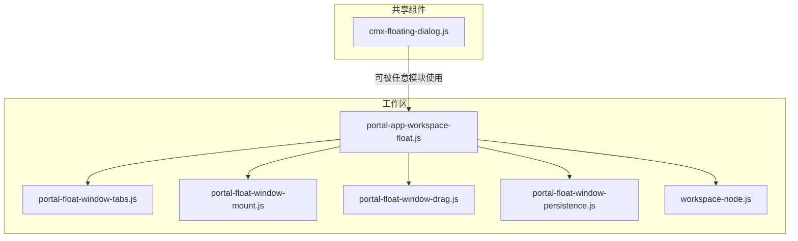
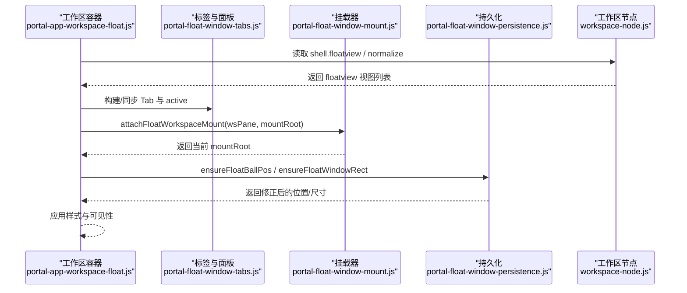
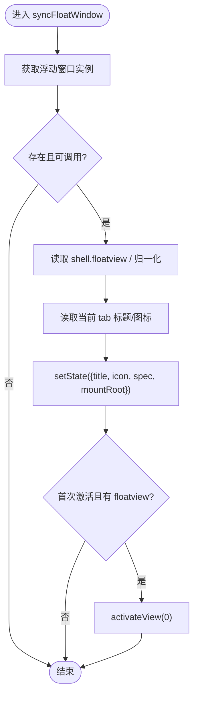
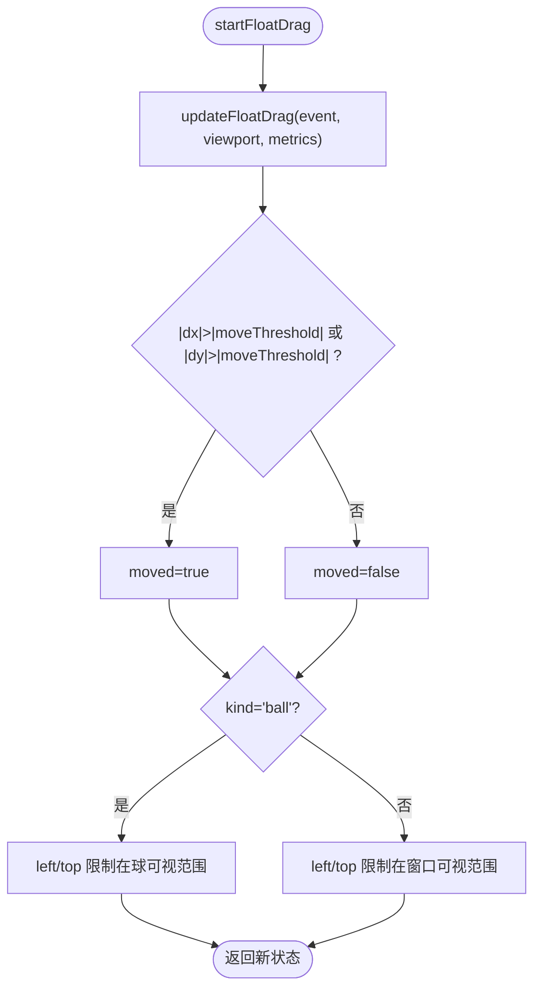
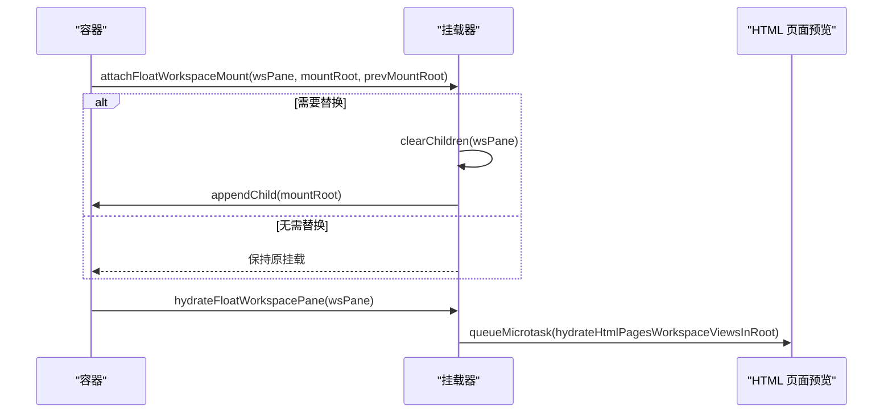
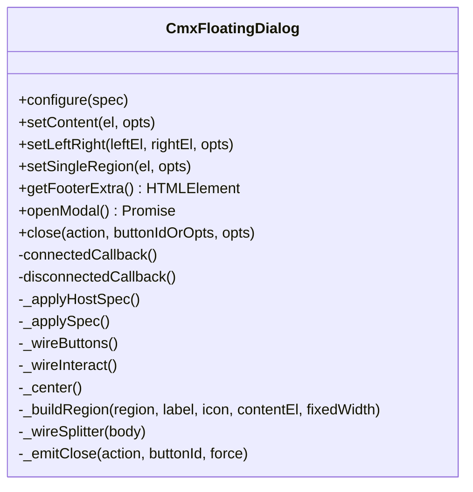
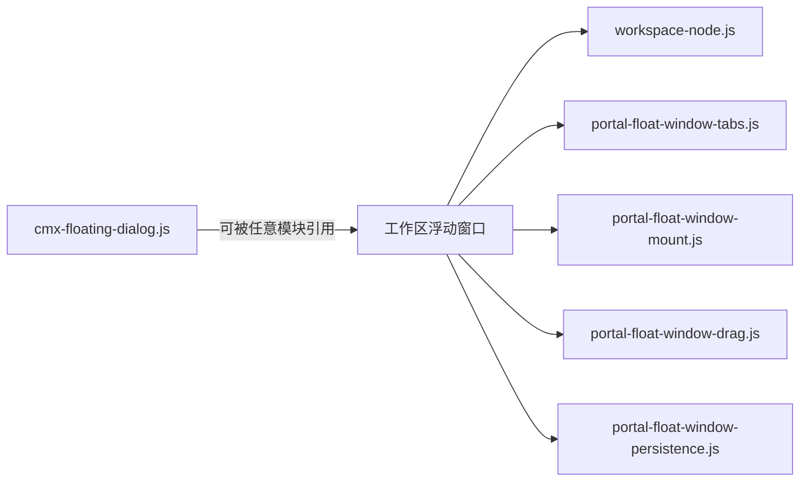

# 浮动窗口

<cite>
**本文引用的文件**
- [portal-app-workspace-float.js](file://CMXPortalManager/src/components/portal-app-workspace-float.js)
- [portal-float-window-drag.js](file://CMXPortalManager/src/lib/portal-float-window-drag.js)
- [portal-float-window-mount.js](file://CMXPortalManager/src/lib/portal-float-window-mount.js)
- [portal-float-window-persistence.js](file://CMXPortalManager/src/lib/portal-float-window-persistence.js)
- [portal-float-window-tabs.js](file://CMXPortalManager/src/lib/portal-float-window-tabs.js)
- [workspace-node.js](file://CMXPortalManager/src/lib/workspace-node.js)
- [cmx-floating-dialog.js](file://packages/cmx-data-comp/src/components/cmx-floating-dialog.js)
</cite>

## 目录
1. [简介](#简介)
2. [项目结构](#项目结构)
3. [核心组件](#核心组件)
4. [架构总览](#架构总览)
5. [详细组件分析](#详细组件分析)
6. [依赖关系分析](#依赖关系分析)
7. [性能与内存优化](#性能与内存优化)
8. [故障排查指南](#故障排查指南)
9. [结论](#结论)
10. [附录](#附录)

## 简介
本文件面向工作区“浮动窗口”子系统，系统性说明其创建、定位、生命周期管理、拖拽交互、大小调整、最小化/最大化、挂载与动态加载、持久化存储、多窗口管理与通信、焦点机制，以及性能优化与防泄漏策略。该子系统由 Portal 侧的浮动窗口容器与通用浮层对话框两个层次组成：前者负责工作区上下文中的浮动视图（含 Tab、挂载、持久化、拖拽），后者提供可复用、可配置、可拖拽缩放的通用弹窗能力。

## 项目结构
- 工作区浮动窗口（Portal 侧）
  - 容器与同步：portal-app-workspace-float.js
  - 拖拽计算：portal-float-window-drag.js
  - 挂载与渲染：portal-float-window-mount.js
  - 持久化：portal-float-window-persistence.js
  - 标签栏与面板切换：portal-float-window-tabs.js
  - 工作区节点与视图规范：workspace-node.js
- 通用浮层对话框（共享包）
  - cmx-floating-dialog.js

图表来源
- [portal-app-workspace-float.js:15-43](file://CMXPortalManager/src/components/portal-app-workspace-float.js#L15-L43)
- [portal-float-window-tabs.js:8-45](file://CMXPortalManager/src/lib/portal-float-window-tabs.js#L8-L45)
- [portal-float-window-mount.js:14-44](file://CMXPortalManager/src/lib/portal-float-window-mount.js#L14-L44)
- [portal-float-window-drag.js:10-58](file://CMXPortalManager/src/lib/portal-float-window-drag.js#L10-L58)
- [portal-float-window-persistence.js:6-108](file://CMXPortalManager/src/lib/portal-float-window-persistence.js#L6-L108)
- [workspace-node.js:31-54](file://CMXPortalManager/src/lib/workspace-node.js#L31-L54)

章节来源
- [portal-app-workspace-float.js:15-43](file://CMXPortalManager/src/components/portal-app-workspace-float.js#L15-L43)
- [workspace-node.js:31-54](file://CMXPortalManager/src/lib/workspace-node.js#L31-L54)

## 核心组件
- 浮动窗口容器（portal-app-workspace-float.js）
  - 职责：根据当前 Content 标签的 shell 配置同步浮动窗口的标题、图标、spec 与 mountRoot；当首次激活且存在 floatview 时自动展开并选中第 0 个视图；支持将 html_pages 视图在设计器中打开。
  - 关键点：通过 getTabHeader 获取标题与图标；normalizeWorkspaceRegionViews 判断是否存在浮动视图；_floatAutoOpenedTabs 避免重复自动展开。
- 拖拽计算（portal-float-window-drag.js）
  - 职责：封装 start/update/finish 三阶段拖拽状态机，支持“球”和“标题栏”两种起点；内置移动阈值与视口边界限制。
- 挂载与渲染（portal-float-window-mount.js）
  - 职责：在 wsPane 中安全地挂载/替换 mountRoot，避免频繁销毁重建导致 CE 组件风暴；提供 fallback 渲染与清理能力。
- 持久化（portal-float-window-persistence.js）
  - 职责：读写 localStorage 中的“浮动球位置”和“窗口矩形”，并在视口变化或不可见时修正默认位置；提供清理接口。
- 标签栏与面板（portal-float-window-tabs.js）
  - 职责：构建固定 Tab（AI 开发助手、AI 助手、详情）与动态视图 Tab；渲染 TabBar HTML；同步 active 态与面板显隐。
- 工作区节点（workspace-node.js）
  - 职责：从 workspace 快照中提取 floatview（兼容 float 别名），为浮动窗口提供 spec 来源；导出区域视图渲染与预览相关工具。
- 通用浮层对话框（cmx-floating-dialog.js）
  - 职责：提供可拖拽、可缩放、可全屏/贴边、可锁滚的通用对话框；支持 Promise 风格 openModal；内部通过 AbortController 管理交互监听，确保断开连接时释放资源。

章节来源
- [portal-app-workspace-float.js:15-43](file://CMXPortalManager/src/components/portal-app-workspace-float.js#L15-L43)
- [portal-float-window-drag.js:10-58](file://CMXPortalManager/src/lib/portal-float-window-drag.js#L10-L58)
- [portal-float-window-mount.js:14-44](file://CMXPortalManager/src/lib/portal-float-window-mount.js#L14-L44)
- [portal-float-window-persistence.js:6-108](file://CMXPortalManager/src/lib/portal-float-window-persistence.js#L6-L108)
- [portal-float-window-tabs.js:8-87](file://CMXPortalManager/src/lib/portal-float-window-tabs.js#L8-L87)
- [workspace-node.js:31-54](file://CMXPortalManager/src/lib/workspace-node.js#L31-L54)
- [cmx-floating-dialog.js:45-528](file://packages/cmx-data-comp/src/components/cmx-floating-dialog.js#L45-L528)

## 架构总览
工作区浮动窗口以“容器 + 工具库”的方式组织：容器负责与 Content 标签联动、驱动 Tab 与挂载；工具库分别处理拖拽、持久化、渲染与 Tab 状态。通用浮层对话框作为独立组件，可被任意模块复用，不依赖工作区机制。

图表来源
- [portal-app-workspace-float.js:15-43](file://CMXPortalManager/src/components/portal-app-workspace-float.js#L15-L43)
- [portal-float-window-tabs.js:8-87](file://CMXPortalManager/src/lib/portal-float-window-tabs.js#L8-L87)
- [portal-float-window-mount.js:14-44](file://CMXPortalManager/src/lib/portal-float-window-mount.js#L14-L44)
- [portal-float-window-persistence.js:42-101](file://CMXPortalManager/src/lib/portal-float-window-persistence.js#L42-L101)
- [workspace-node.js:31-54](file://CMXPortalManager/src/lib/workspace-node.js#L31-L54)

## 详细组件分析

### 浮动窗口容器：创建、定位与生命周期
- 创建与同步
  - 从宿主 shadowRoot 获取浮动窗口实例，调用 setState 设置 title/icon/spec/mountRoot。
  - 若当前 content tab 的 shell 包含 floatview，且是首次激活，则自动 activateView(0)。
- 定位与可见性
  - 结合持久化工具 ensureFloatBallPos/ensureFloatWindowRect 进行视口修正，保证球/窗口始终可见。
- 设计器打开
  - 对 html_pages 类型视图，构造 URL 并在新标签页打开，附带 DAM 坐标信息以便预填。

图表来源
- [portal-app-workspace-float.js:15-43](file://CMXPortalManager/src/components/portal-app-workspace-float.js#L15-L43)

章节来源
- [portal-app-workspace-float.js:15-79](file://CMXPortalManager/src/components/portal-app-workspace-float.js#L15-L79)

### 拖拽功能：鼠标事件处理、边界检测与吸附对齐
- 状态机
  - startFloatDrag：记录起点、kind（ball/title）、初始 left/top 与 moved=false。
  - updateFloatDrag：计算 dx/dy，超过 moveThreshold 才标记 moved=true；按 kind 更新 left/top，并做视口边界裁剪。
  - finishFloatDrag：输出 clicked=未移动时为 true，用于区分点击与拖拽。
- 边界与吸附
  - 球模式：left/top 限制在 [0, width-ballSize] / [0, height-ballSize]。
  - 标题栏模式：left/top 限制在 [0, width-minWindowWidth] / [0, height-titleBarHeight]。
  - 可结合 ensureFloatBallPos/ensureFloatWindowRect 在失焦或不可见时回退到默认位置。

图表来源
- [portal-float-window-drag.js:10-58](file://CMXPortalManager/src/lib/portal-float-window-drag.js#L10-L58)
- [portal-float-window-persistence.js:42-101](file://CMXPortalManager/src/lib/portal-float-window-persistence.js#L42-L101)

章节来源
- [portal-float-window-drag.js:10-58](file://CMXPortalManager/src/lib/portal-float-window-drag.js#L10-L58)
- [portal-float-window-persistence.js:42-101](file://CMXPortalManager/src/lib/portal-float-window-persistence.js#L42-L101)

### 窗口大小调整、最小化与最大化
- 大小调整
  - 工作区浮动窗口通过持久化工具 ensureFloatWindowRect 维护 w/h，并在视口变化时修正。
  - 通用浮层对话框 cmx-floating-dialog 提供 resizable 开关与八方位 resize 交互，支持 minWidth/minHeight 约束。
- 最小化/最大化
  - 工作区浮动窗口通过 Tab 切换实现“收起内容”的效果（仅显示标题/球）。
  - 通用浮层对话框支持 fullscreen 模式（与 dock 冲突时忽略），以及通过 CSS 变量控制尺寸。

章节来源
- [portal-float-window-persistence.js:69-101](file://CMXPortalManager/src/lib/portal-float-window-persistence.js#L69-L101)
- [cmx-floating-dialog.js:291-323](file://packages/cmx-data-comp/src/components/cmx-floating-dialog.js#L291-L323)

### 挂载机制、组件动态加载与资源管理
- 挂载策略
  - attachFloatWorkspaceMount：仅在 mountRoot 变化时替换子节点，避免频繁销毁；wsPane 内只保留一个 mountRoot。
  - hydrateFloatWorkspacePane：微任务中执行 hydrateHtmlPagesWorkspaceViewsInRoot，延迟初始化页面视图。
  - renderFloatWorkspaceFallback：在无可用 mountRoot 时，直接渲染 region HTML 作为降级。
- 资源管理
  - clearFloatWorkspacePane：清空 wsPane 子节点，防止残留。
  - 通用对话框在 disconnectedCallback 中释放滚动锁、移除全局 Esc 监听、abort 拖拽/缩放监听，避免内存泄漏。

图表来源
- [portal-float-window-mount.js:14-44](file://CMXPortalManager/src/lib/portal-float-window-mount.js#L14-L44)
- [cmx-floating-dialog.js:263-275](file://packages/cmx-data-comp/src/components/cmx-floating-dialog.js#L263-L275)

章节来源
- [portal-float-window-mount.js:14-51](file://CMXPortalManager/src/lib/portal-float-window-mount.js#L14-L51)
- [cmx-floating-dialog.js:263-275](file://packages/cmx-data-comp/src/components/cmx-floating-dialog.js#L263-L275)

### 持久化存储、位置记忆与状态恢复
- 存储键
  - 球位置：read/writeFloatBallPos
  - 窗口矩形：read/writeFloatWindowRect
- 视口修正
  - ensureFloatBallPos：若球不可见或越界，回退到右下角默认位置，并标记 shouldPersist=true 以便下次保存。
  - ensureFloatWindowRect：若窗口不可见或高度小于标题栏高度，回退到默认矩形。
- 清理
  - clearFloatWindowPersistence：删除对应 localStorage 项。

章节来源
- [portal-float-window-persistence.js:6-108](file://CMXPortalManager/src/lib/portal-float-window-persistence.js#L6-L108)

### 多窗口管理、窗口间通信与焦点管理
- 多窗口管理
  - 工作区浮动窗口在同一宿主下通过 Tab 管理多个视图；buildFloatWindowTabs 生成固定 Tab 与动态视图 Tab，并通过 data-pane-index 关联面板。
  - 通用浮层对话框支持多层叠放，Esc 仅关闭栈顶实例，避免误关下层。
- 窗口间通信
  - 通过自定义事件（如 cmx-dialog-confirm/cancel/button）与宿主解耦；工作区容器通过 setState/activateView 驱动 UI。
- 焦点管理
  - 通用对话框在 connectedCallback 注册 document keydown(Esc)，在 disconnectedCallback 移除，确保焦点与键盘行为正确。

章节来源
- [portal-float-window-tabs.js:8-87](file://CMXPortalManager/src/lib/portal-float-window-tabs.js#L8-L87)
- [cmx-floating-dialog.js:231-244](file://packages/cmx-data-comp/src/components/cmx-floating-dialog.js#L231-L244)
- [cmx-floating-dialog.js:499-522](file://packages/cmx-data-comp/src/components/cmx-floating-dialog.js#L499-L522)

### 类图：通用浮层对话框

图表来源
- [cmx-floating-dialog.js:45-528](file://packages/cmx-data-comp/src/components/cmx-floating-dialog.js#L45-L528)

## 依赖关系分析
- 工作区浮动窗口依赖
  - workspace-node.js：提供 floatview 提取与视图渲染工具。
  - portal-float-window-tabs.js：Tab 构建与状态同步。
  - portal-float-window-mount.js：挂载与降级渲染。
  - portal-float-window-drag.js：拖拽状态机。
  - portal-float-window-persistence.js：持久化与视口修正。
- 通用对话框依赖
  - 内部通过 AbortController 管理交互监听，避免跨实例干扰。
  - 与 UI5 WebComponents 集成（Bar/Button/Icon）。

图表来源
- [workspace-node.js:31-54](file://CMXPortalManager/src/lib/workspace-node.js#L31-L54)
- [portal-float-window-tabs.js:8-87](file://CMXPortalManager/src/lib/portal-float-window-tabs.js#L8-L87)
- [portal-float-window-mount.js:14-51](file://CMXPortalManager/src/lib/portal-float-window-mount.js#L14-L51)
- [portal-float-window-drag.js:10-58](file://CMXPortalManager/src/lib/portal-float-window-drag.js#L10-L58)
- [portal-float-window-persistence.js:6-108](file://CMXPortalManager/src/lib/portal-float-window-persistence.js#L6-L108)
- [cmx-floating-dialog.js:45-528](file://packages/cmx-data-comp/src/components/cmx-floating-dialog.js#L45-L528)

章节来源
- [workspace-node.js:31-54](file://CMXPortalManager/src/lib/workspace-node.js#L31-L54)
- [cmx-floating-dialog.js:45-528](file://packages/cmx-data-comp/src/components/cmx-floating-dialog.js#L45-L528)

## 性能与内存优化
- 避免频繁销毁重建
  - 挂载器仅在 mountRoot 变化时替换子节点，减少 CE 组件的 disconnect/dispose 风暴。
- 延迟初始化
  - 使用 queueMicrotask 延迟 hydrate，避免首帧阻塞。
- 事件监听生命周期管理
  - 通用对话框在 connectedCallback 注册 Esc，在 disconnectedCallback 移除；拖拽/缩放通过 AbortController 统一 abort，防止悬挂监听。
- 滚动锁计数
  - 通过 acquireScrollLock/releaseScrollLock 成对管理，避免多层嵌套导致的滚动锁定泄漏。
- 视口修正与默认值
  - 持久化工具在不可见或越界时回退默认位置，减少用户操作成本与异常布局。

章节来源
- [portal-float-window-mount.js:14-44](file://CMXPortalManager/src/lib/portal-float-window-mount.js#L14-L44)
- [cmx-floating-dialog.js:263-275](file://packages/cmx-data-comp/src/components/cmx-floating-dialog.js#L263-L275)
- [cmx-floating-dialog.js:404-424](file://packages/cmx-data-comp/src/components/cmx-floating-dialog.js#L404-L424)
- [portal-float-window-persistence.js:42-101](file://CMXPortalManager/src/lib/portal-float-window-persistence.js#L42-L101)

## 故障排查指南
- 浮动窗口未自动展开
  - 检查当前 tab 的 shell 是否包含 floatview；确认 _floatAutoOpenedTabs 是否已记录该 tabId。
- 拖拽无效或点击误判
  - 确认 moveThreshold 与 pointer 事件是否正确触发；检查 finished 状态中 clicked 是否为 false（即发生了移动）。
- 窗口/球不可见
  - 使用 ensureFloatBallPos/ensureFloatWindowRect 进行视口修正；必要时清理持久化数据后重试。
- 内存泄漏迹象
  - 检查对话框是否在 disconnectedCallback 中释放了滚动锁、Esc 监听与 AbortController；确认挂载器未遗留子节点。
- 设计器无法打开 html_pages
  - 确认 viewSpec.type 为 html_pages 且存在页面 ID；检查 DAM 参数注入是否成功。

章节来源
- [portal-app-workspace-float.js:15-79](file://CMXPortalManager/src/components/portal-app-workspace-float.js#L15-L79)
- [portal-float-window-drag.js:10-58](file://CMXPortalManager/src/lib/portal-float-window-drag.js#L10-L58)
- [portal-float-window-persistence.js:6-108](file://CMXPortalManager/src/lib/portal-float-window-persistence.js#L6-L108)
- [cmx-floating-dialog.js:263-275](file://packages/cmx-data-comp/src/components/cmx-floating-dialog.js#L263-L275)

## 结论
工作区浮动窗口系统通过清晰的职责划分与工具化设计，实现了稳定的创建、定位、拖拽、挂载与持久化能力；通用浮层对话框提供了高内聚、低耦合的可复用弹窗方案。借助视口修正、延迟初始化与严格的监听生命周期管理，系统在交互体验与性能稳定性方面具备良好表现。建议在实际使用中遵循“挂载一次、多次复用”的原则，并充分利用持久化与 Tab 机制提升用户体验。

## 附录
- 关键 API 路径参考
  - 同步浮动窗口：[syncFloatWindow:15-43](file://CMXPortalManager/src/components/portal-app-workspace-float.js#L15-L43)
  - 拖拽状态机：[start/update/finish:10-58](file://CMXPortalManager/src/lib/portal-float-window-drag.js#L10-L58)
  - 挂载与降级渲染：[attach/hydrate/fallback/clear:14-51](file://CMXPortalManager/src/lib/portal-float-window-mount.js#L14-L51)
  - 持久化读写与修正：[read/write/ensure/clear:6-108](file://CMXPortalManager/src/lib/portal-float-window-persistence.js#L6-L108)
  - 标签构建与同步：[build/render/sync:8-87](file://CMXPortalManager/src/lib/portal-float-window-tabs.js#L8-L87)
  - 工作区快照与视图：[workspaceShellSnapshot:31-54](file://CMXPortalManager/src/lib/workspace-node.js#L31-L54)
  - 通用对话框：[CmxFloatingDialog:45-528](file://packages/cmx-data-comp/src/components/cmx-floating-dialog.js#L45-L528)