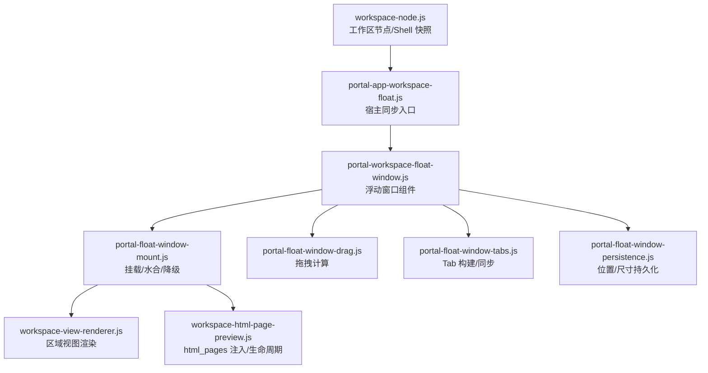
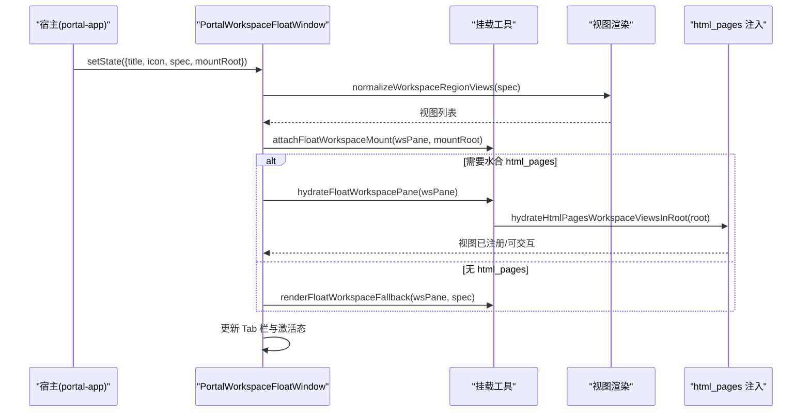
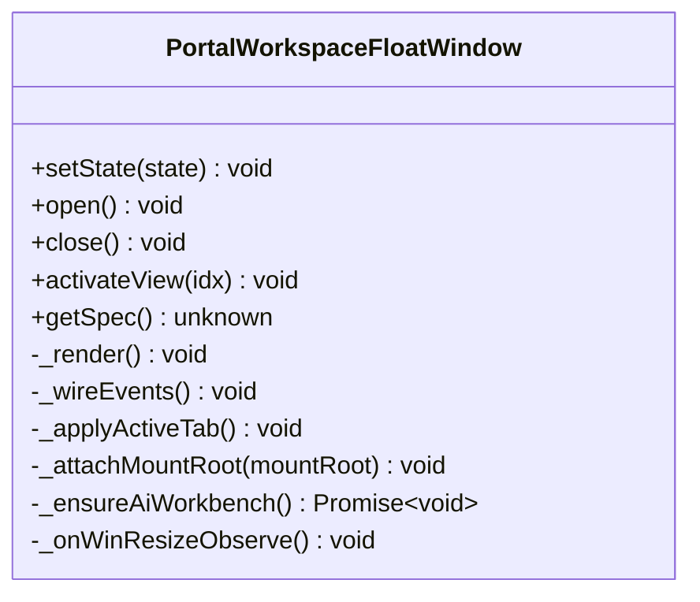
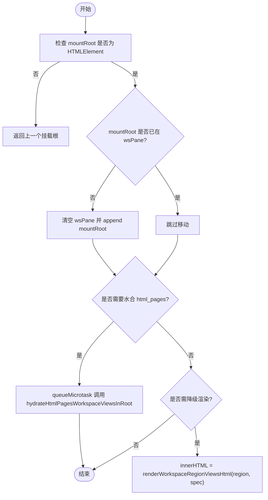
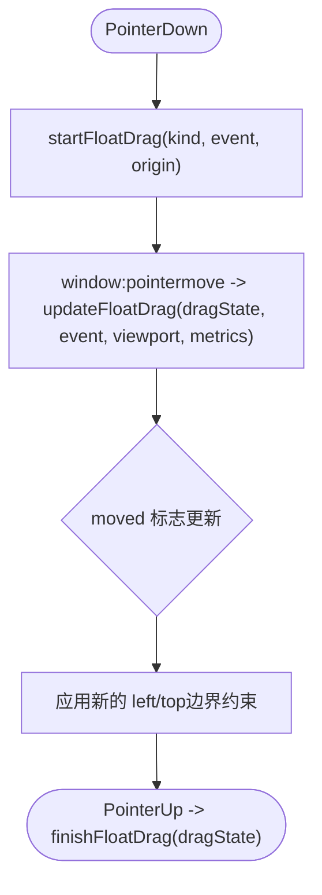
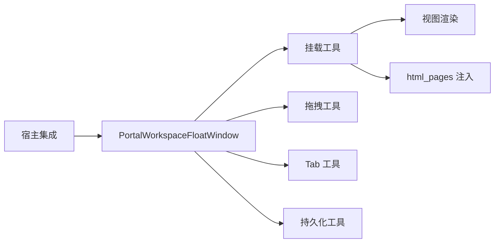

# 窗口挂载

<cite>
**本文引用的文件**
- [portal-workspace-float-window.js](file://CMXPortalManager/src/components/portal-workspace-float-window.js)
- [portal-float-window-mount.js](file://CMXPortalManager/src/lib/portal-float-window-mount.js)
- [portal-float-window-drag.js](file://CMXPortalManager/src/lib/portal-float-window-drag.js)
- [portal-float-window-persistence.js](file://CMXPortalManager/src/lib/portal-float-window-persistence.js)
- [portal-float-window-tabs.js](file://CMXPortalManager/src/lib/portal-float-window-tabs.js)
- [workspace-node.js](file://CMXPortalManager/src/lib/workspace-node.js)
- [workspace-view-renderer.js](file://CMXPortalManager/src/lib/workspace-view-renderer.js)
- [workspace-html-page-preview.js](file://CMXPortalManager/src/lib/workspace-html-page-preview.js)
- [portal-app-workspace-float.js](file://CMXPortalManager/src/components/portal-app-workspace-float.js)
</cite>

## 目录
1. [简介](#简介)
2. [项目结构](#项目结构)
3. [核心组件](#核心组件)
4. [架构总览](#架构总览)
5. [详细组件分析](#详细组件分析)
6. [依赖关系分析](#依赖关系分析)
7. [性能考量](#性能考量)
8. [故障排查指南](#故障排查指南)
9. [结论](#结论)
10. [附录](#附录)

## 简介
本文件围绕“浮动窗口挂载机制”进行系统化说明，覆盖以下主题：
- 组件动态加载与卸载的生命周期管理
- 窗口容器创建过程（DOM 生成、样式应用、事件绑定）
- 组件实例的创建、配置传递与初始化流程
- 资源管理机制（样式/脚本按需加载与缓存策略）
- 内存管理最佳实践（销毁时清理与事件监听器移除）
- 错误处理机制（加载失败回退与日志记录）
- 性能监控指标（加载时间统计与资源使用量监控）

该机制以 PortalWorkspaceFloatWindow 自定义元素为核心，结合工作区视图渲染、拖拽、持久化、Tab 管理与 html_pages 页面注入等能力，实现可拖拽、可持久化、多 Tab 的浮动窗口。

## 项目结构
与浮动窗口挂载相关的代码主要分布在 CMXPortalManager 模块中，按职责划分为：
- 组件层：portal-workspace-float-window.js（浮动窗口主组件）
- 挂载与渲染：portal-float-window-mount.js、workspace-view-renderer.js、workspace-html-page-preview.js
- 交互与状态：portal-float-window-drag.js、portal-float-window-tabs.js、portal-float-window-persistence.js
- 宿主集成：portal-app-workspace-float.js、workspace-node.js

图表来源
- [portal-workspace-float-window.js:1-120](file://CMXPortalManager/src/components/portal-workspace-float-window.js#L1-L120)
- [portal-float-window-mount.js:1-51](file://CMXPortalManager/src/lib/portal-float-window-mount.js#L1-L51)
- [portal-float-window-drag.js:1-59](file://CMXPortalManager/src/lib/portal-float-window-drag.js#L1-L59)
- [portal-float-window-tabs.js:1-87](file://CMXPortalManager/src/lib/portal-float-window-tabs.js#L1-L87)
- [portal-float-window-persistence.js:1-109](file://CMXPortalManager/src/lib/portal-float-window-persistence.js#L1-L109)
- [workspace-view-renderer.js:1-310](file://CMXPortalManager/src/lib/workspace-view-renderer.js#L1-L310)
- [workspace-html-page-preview.js:1-411](file://CMXPortalManager/src/lib/workspace-html-page-preview.js#L1-L411)
- [portal-app-workspace-float.js:1-79](file://CMXPortalManager/src/components/portal-app-workspace-float.js#L1-L79)
- [workspace-node.js:1-283](file://CMXPortalManager/src/lib/workspace-node.js#L1-L283)

章节来源
- [portal-workspace-float-window.js:1-120](file://CMXPortalManager/src/components/portal-workspace-float-window.js#L1-L120)
- [portal-float-window-mount.js:1-51](file://CMXPortalManager/src/lib/portal-float-window-mount.js#L1-L51)
- [workspace-view-renderer.js:148-201](file://CMXPortalManager/src/lib/workspace-view-renderer.js#L148-L201)
- [workspace-html-page-preview.js:326-411](file://CMXPortalManager/src/lib/workspace-html-page-preview.js#L326-L411)

## 核心组件
- PortalWorkspaceFloatWindow：自定义元素，负责悬浮球与浮动窗口的 UI、拖拽、Tab 切换、AI 助手懒加载、与宿主 setState 通信、以及工作区视图挂载。
- 挂载工具：attachFloatWorkspaceMount/hydrateFloatWorkspacePane/renderFloatWorkspaceFallback/clearFloatWorkspacePane，负责将工作区视图挂载到浮动窗口的工作区面板，并在必要时降级为 HTML 片段。
- 拖拽工具：startFloatDrag/updateFloatDrag/finishFloatDrag，提供球与标题栏拖拽的位置计算与点击判定。
- 持久化工具：读写 localStorage 中的球位置与窗口矩形，并进行视口修正。
- Tab 工具：buildFloatWindowTabs/renderFloatWindowTabBarHtml/syncFloatWindowTabBarState/syncFloatWorkspacePaneState，构建并同步 AI/详情/工作区视图的 Tab 栏与面板显示。
- 工作区视图渲染：renderWorkspaceRegionViewsHtml 将 spec 转换为带标记的 DOM，支持多视图 Tab 与内容区域。
- html_pages 注入：hydrateHtmlPagesWorkspaceViewsInRoot 将服务端返回的整页 HTML 注入运行槽，注册/注销视图，并处理模板刷新与卸载钩子。

章节来源
- [portal-workspace-float-window.js:61-122](file://CMXPortalManager/src/components/portal-workspace-float-window.js#L61-L122)
- [portal-float-window-mount.js:14-51](file://CMXPortalManager/src/lib/portal-float-window-mount.js#L14-L51)
- [portal-float-window-drag.js:10-59](file://CMXPortalManager/src/lib/portal-float-window-drag.js#L10-L59)
- [portal-float-window-persistence.js:6-109](file://CMXPortalManager/src/lib/portal-float-window-persistence.js#L6-L109)
- [portal-float-window-tabs.js:8-87](file://CMXPortalManager/src/lib/portal-float-window-tabs.js#L8-L87)
- [workspace-view-renderer.js:148-201](file://CMXPortalManager/src/lib/workspace-view-renderer.js#L148-L201)
- [workspace-html-page-preview.js:109-271](file://CMXPortalManager/src/lib/workspace-html-page-preview.js#L109-L271)

## 架构总览
浮动窗口由宿主 portal-app 通过 setState 驱动，内部维护三个固定 Tab（AI 开发助手、AI 助手、详情）与若干工作区视图 Tab。工作区视图通过 workspace-view-renderer 渲染为 region/pane，再由 portal-float-window-mount 挂载到浮动窗口的工作区面板；若为 html_pages 类型，则通过 workspace-html-page-preview 注入执行并注册视图生命周期。

图表来源
- [portal-workspace-float-window.js:135-161](file://CMXPortalManager/src/components/portal-workspace-float-window.js#L135-L161)
- [portal-float-window-mount.js:14-44](file://CMXPortalManager/src/lib/portal-float-window-mount.js#L14-L44)
- [workspace-view-renderer.js:148-201](file://CMXPortalManager/src/lib/workspace-view-renderer.js#L148-L201)
- [workspace-html-page-preview.js:326-411](file://CMXPortalManager/src/lib/workspace-html-page-preview.js#L326-L411)

## 详细组件分析

### 组件 A：PortalWorkspaceFloatWindow（浮动窗口主组件）
- 生命周期
  - connectedCallback：渲染 Shadow DOM、绑定事件、安装拖拽与右键菜单、应用可见性与位置。
  - disconnectedCallback：解绑拖拽、右键菜单、window 级 pointermove/pointerup/resize、ResizeObserver。
- 状态与接口
  - setState：接收宿主传入的 title/icon/spec/mountRoot，避免重复挂载与重渲染，更新图标、挂载根、Tab 栏与激活态。
  - open/close：控制窗口展开/收起。
  - activateView：激活指定索引或固定 Tab，必要时自动展开窗口。
  - getSpec：获取当前 spec。
- 资源与懒加载
  - _ensureAiWorkbench：首次切换到“AI 开发助手”时动态 import ai-app，避免首屏体积膨胀。
- 事件与交互
  - 标题栏与悬浮球拖拽：委托给 portal-float-window-drag 计算新位置，支持阈值与边界约束。
  - Tab 切换：点击 Tab 按钮设置 activeTab 并应用显示。
  - 详情面板：监听 agent console 的事件更新详情 HTML，支持清除与导出。
  - 窗口尺寸变化：ResizeObserver 监听 frame 尺寸变化并持久化。
- 持久化
  - 读取/写入 localStorage 中的球位置与窗口矩形，并在视口变化时修正。

图表来源
- [portal-workspace-float-window.js:61-216](file://CMXPortalManager/src/components/portal-workspace-float-window.js#L61-L216)
- [portal-workspace-float-window.js:728-793](file://CMXPortalManager/src/components/portal-workspace-float-window.js#L728-L793)

章节来源
- [portal-workspace-float-window.js:61-216](file://CMXPortalManager/src/components/portal-workspace-float-window.js#L61-L216)
- [portal-workspace-float-window.js:728-793](file://CMXPortalManager/src/components/portal-workspace-float-window.js#L728-L793)

### 组件 B：挂载与渲染管线（portal-float-window-mount + workspace-view-renderer + workspace-html-page-preview）
- 挂载
  - attachFloatWorkspaceMount：在 wsPane 中移动/替换 mountRoot，避免重复 appendChild；当 mountRoot=null 时保留 prevMountRoot，仅隐藏可见性，减少 CE 销毁风暴。
  - hydrateFloatWorkspacePane：微任务队列中调用 hydrateHtmlPagesWorkspaceViewsInRoot，完成 html_pages 的水合。
  - renderFloatWorkspaceFallback：当无法水合时，直接渲染 region HTML 作为降级方案。
  - clearFloatWorkspacePane：清空面板内容。
- 视图渲染
  - renderWorkspaceRegionViewsHtml：将 spec 规范化为 views，单视图直接渲染，多视图生成 pane/tab 并默认激活第一个；为每个视图添加 data-cmx-region/data-cmx-view-id 标记，便于后续注册与定位。
- html_pages 注入
  - hydrateHtmlPagesWorkspaceViewsInRoot：查找 textarea/script 中的 payload，解析并注入运行槽，执行脚本，注册视图，设置 props/actions，并在断开连接时注销视图与释放资源。
  - 模板刷新修复：对比 shadow root 与模板内容，不一致时替换并重水合事件，确保刷新后展示最新页面。
  - 卸载兜底：MutationObserver 监听宿主元素是否被移除，触发 unregister 与 observer 自毁。

图表来源
- [portal-float-window-mount.js:14-51](file://CMXPortalManager/src/lib/portal-float-window-mount.js#L14-L51)
- [workspace-view-renderer.js:148-201](file://CMXPortalManager/src/lib/workspace-view-renderer.js#L148-L201)
- [workspace-html-page-preview.js:326-411](file://CMXPortalManager/src/lib/workspace-html-page-preview.js#L326-L411)

章节来源
- [portal-float-window-mount.js:14-51](file://CMXPortalManager/src/lib/portal-float-window-mount.js#L14-L51)
- [workspace-view-renderer.js:148-201](file://CMXPortalManager/src/lib/workspace-view-renderer.js#L148-L201)
- [workspace-html-page-preview.js:109-271](file://CMXPortalManager/src/lib/workspace-html-page-preview.js#L109-L271)
- [workspace-html-page-preview.js:326-411](file://CMXPortalManager/src/lib/workspace-html-page-preview.js#L326-L411)

### 组件 C：拖拽与持久化（portal-float-window-drag + portal-float-window-persistence）
- 拖拽
  - startFloatDrag：记录初始指针坐标与 origin，标记 moved=false。
  - updateFloatDrag：根据 viewport 与 metrics 计算新 left/top，限制边界，区分 ball/title 两种模式，并判断是否发生有效移动。
  - finishFloatDrag：返回 clicked 标志（未移动时为点击），用于区分拖拽与点击行为。
- 持久化
  - read/writeFloatBallPos：保存/读取球位置，异常与配额不足时忽略。
  - read/writeFloatWindowRect：保存/读取窗口矩形（left/top/w/h）。
  - ensureFloatBallPos/ensureFloatWindowRect：根据视口修正不可见或越界的位置/尺寸，必要时重置为默认值并标记应持久化。
  - clearFloatWindowPersistence：清理持久化数据。

图表来源
- [portal-float-window-drag.js:10-59](file://CMXPortalManager/src/lib/portal-float-window-drag.js#L10-L59)
- [portal-float-window-persistence.js:6-109](file://CMXPortalManager/src/lib/portal-float-window-persistence.js#L6-L109)

章节来源
- [portal-float-window-drag.js:10-59](file://CMXPortalManager/src/lib/portal-float-window-drag.js#L10-L59)
- [portal-float-window-persistence.js:6-109](file://CMXPortalManager/src/lib/portal-float-window-persistence.js#L6-L109)

### 组件 D：Tab 管理（portal-float-window-tabs）
- buildFloatWindowTabs：构建固定 Tab（AI 开发助手、AI 助手、详情）与工作区视图 Tab，设置 label/icon/draggable/active。
- renderFloatWindowTabBarHtml：渲染 Tab 栏 HTML，转义安全属性。
- syncFloatWindowTabBarState：根据 activeTab 同步按钮的 active 与 aria-selected。
- syncFloatWorkspacePaneState：在工作区面板内根据 activeTab 显示/隐藏对应 pane。

章节来源
- [portal-float-window-tabs.js:8-87](file://CMXPortalManager/src/lib/portal-float-window-tabs.js#L8-L87)

### 组件 E：宿主集成（portal-app-workspace-float + workspace-node）
- portal-app-workspace-float.syncFloatWindow：从当前 content tab 的 shell 中提取 floatview 视图与标题信息，调用浮动窗口 setState；首次激活含 floatview 的 tab 时自动展开并选中第 0 个视图。
- workspace-node.workspaceShellSnapshot：抽取影响侧栏/属性/底部/浮动窗口的 shell 快照，统一 floatview 别名。
- workspace-node.applyWorkspaceShell：将 explorer/property/bottom 应用到宿主，支持 mounts 复用挂载根，避免重复渲染。

章节来源
- [portal-app-workspace-float.js:15-43](file://CMXPortalManager/src/components/portal-app-workspace-float.js#L15-L43)
- [workspace-node.js:31-54](file://CMXPortalManager/src/lib/workspace-node.js#L31-L54)
- [workspace-node.js:69-98](file://CMXPortalManager/src/lib/workspace-node.js#L69-L98)

## 依赖关系分析
- 组件耦合
  - PortalWorkspaceFloatWindow 强依赖挂载工具、拖拽工具、Tab 工具与持久化工具；弱依赖 workspace-view-renderer 与 workspace-html-page-preview。
  - 挂载工具依赖 workspace-view-renderer 与 workspace-html-page-preview。
  - 宿主集成通过 setState 与组件通信，避免直接操作 DOM。
- 外部依赖
  - ui5-icon/ui5-button 用于图标与按钮。
  - ResizeObserver 用于窗口尺寸监听。
  - MutationObserver 用于宿主元素移除检测。
  - localStorage 用于持久化。
- 循环依赖
  - 未发现循环导入；各模块职责清晰，单向依赖。

图表来源
- [portal-workspace-float-window.js:1-120](file://CMXPortalManager/src/components/portal-workspace-float-window.js#L1-L120)
- [portal-float-window-mount.js:1-51](file://CMXPortalManager/src/lib/portal-float-window-mount.js#L1-L51)
- [workspace-view-renderer.js:148-201](file://CMXPortalManager/src/lib/workspace-view-renderer.js#L148-L201)
- [workspace-html-page-preview.js:326-411](file://CMXPortalManager/src/lib/workspace-html-page-preview.js#L326-L411)

章节来源
- [portal-workspace-float-window.js:1-120](file://CMXPortalManager/src/components/portal-workspace-float-window.js#L1-L120)
- [portal-float-window-mount.js:1-51](file://CMXPortalManager/src/lib/portal-float-window-mount.js#L1-L51)

## 性能考量
- 避免重复挂载与重渲染
  - setState 中比较 spec 引用与 mountRoot 是否已挂载，相同则仅同步图标，减少 DOM 操作与 CE 重建。
- 懒加载
  - AI 开发助手组件仅在首次切换到对应 Tab 时动态 import，降低首屏体积。
- 水合时机
  - 使用 queueMicrotask 延迟水合，避免阻塞主线程；html_pages 注入完成后通过 requestAnimationFrame 两帧提升透明度，减少闪烁。
- 视口修正与持久化
  - 对球位置与窗口矩形进行视口修正，避免不可见或越界；localStorage 写入失败静默忽略，防止阻塞。
- 卸载优化
  - 切换至无 floatview 的 content tab 时保留 prevMountRoot 仅隐藏可见性，减少 CE 销毁风暴。

[本节为通用指导，不直接分析具体文件]

## 故障排查指南
- 组件加载失败
  - AI 开发助手加载失败：捕获 import 异常并记录警告，避免中断其他功能。
  - html_pages 注入失败：捕获异常并输出错误占位，同时恢复 run-slot 透明度，便于调试。
- 事件监听器泄漏
  - 确保 disconnectedCallback 中移除 window 级 pointermove/pointerup/resize 监听器，断开 ResizeObserver/MutationObserver。
- 持久化异常
  - localStorage 写入失败（配额不足）静默忽略；读取失败返回 null，使用默认位置/尺寸。
- 视图渲染异常
  - 自定义视图类型渲染失败时，返回错误提示 HTML，便于快速定位问题。

章节来源
- [portal-workspace-float-window.js:209-216](file://CMXPortalManager/src/components/portal-workspace-float-window.js#L209-L216)
- [workspace-html-page-preview.js:351-363](file://CMXPortalManager/src/lib/workspace-html-page-preview.js#L351-L363)
- [workspace-view-renderer.js:123-139](file://CMXPortalManager/src/lib/workspace-view-renderer.js#L123-L139)
- [portal-float-window-persistence.js:6-36](file://CMXPortalManager/src/lib/portal-float-window-persistence.js#L6-L36)

## 结论
浮动窗口挂载机制通过清晰的组件分层与工具函数拆分，实现了：
- 安全的 DOM 挂载与卸载，避免 CE 销毁风暴
- 灵活的 Tab 管理与懒加载策略
- 可靠的持久化与视口修正
- 完善的错误处理与日志记录
- 良好的性能表现（避免重复渲染、延迟水合、动画优化）

建议在实际使用中：
- 合理组织 spec，确保 viewId 唯一且稳定
- 关注 disconnectedCallback 的资源清理
- 利用持久化工具保持用户偏好
- 在关键路径加入性能埋点（如加载耗时、内存占用）

[本节为总结，不直接分析具体文件]

## 附录
- 关键 API 速查
  - setState：更新标题、图标、spec 与挂载根
  - activateView：激活指定视图或固定 Tab
  - attachFloatWorkspaceMount：挂载/移动 mountRoot
  - hydrateFloatWorkspacePane：水合 html_pages
  - renderFloatWorkspaceFallback：降级渲染
  - startFloatDrag/updateFloatDrag/finishFloatDrag：拖拽计算
  - read/writeFloatBallPos/read/writeFloatWindowRect：持久化
  - hydrateHtmlPagesWorkspaceViewsInRoot：注入并注册视图

[本节为补充说明，不直接分析具体文件]