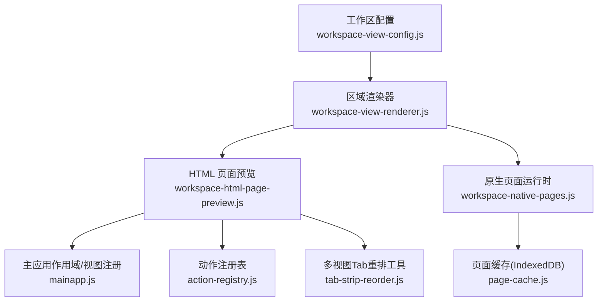
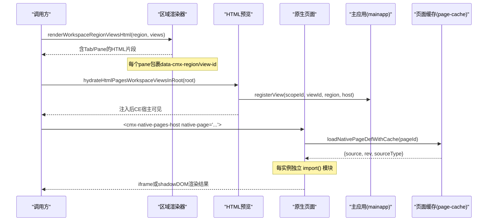
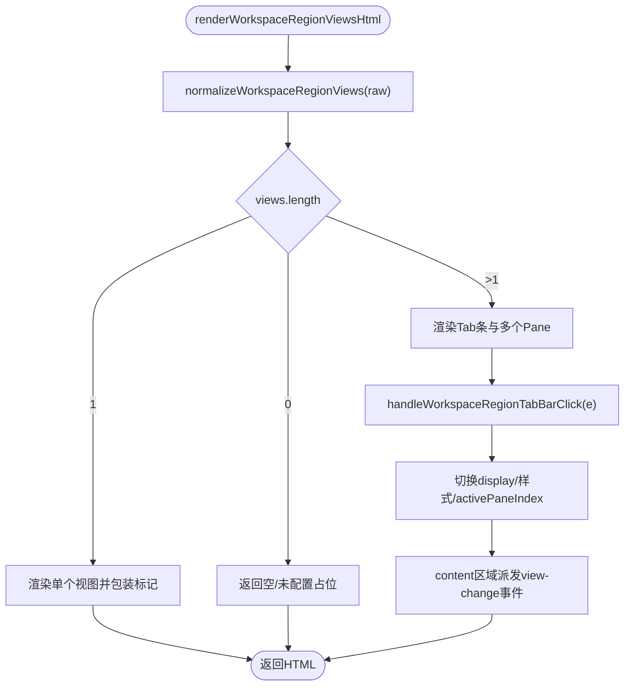
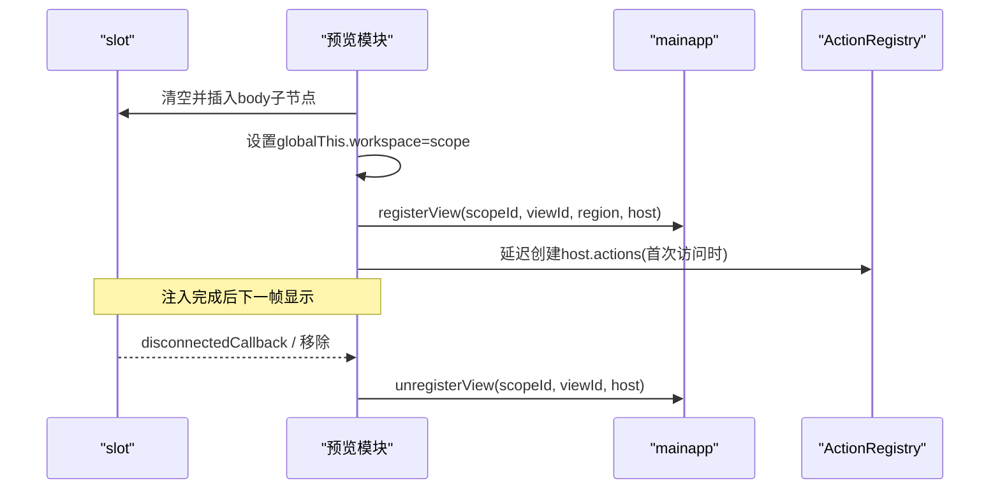
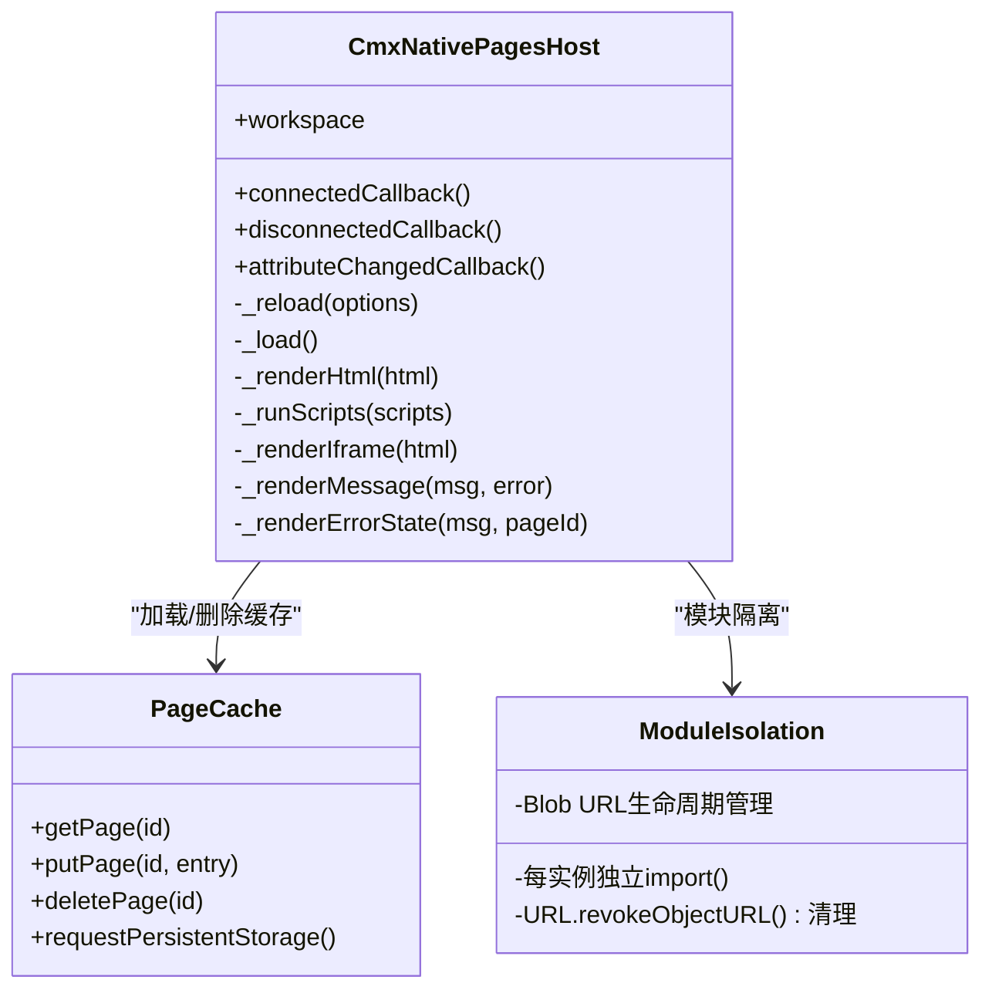
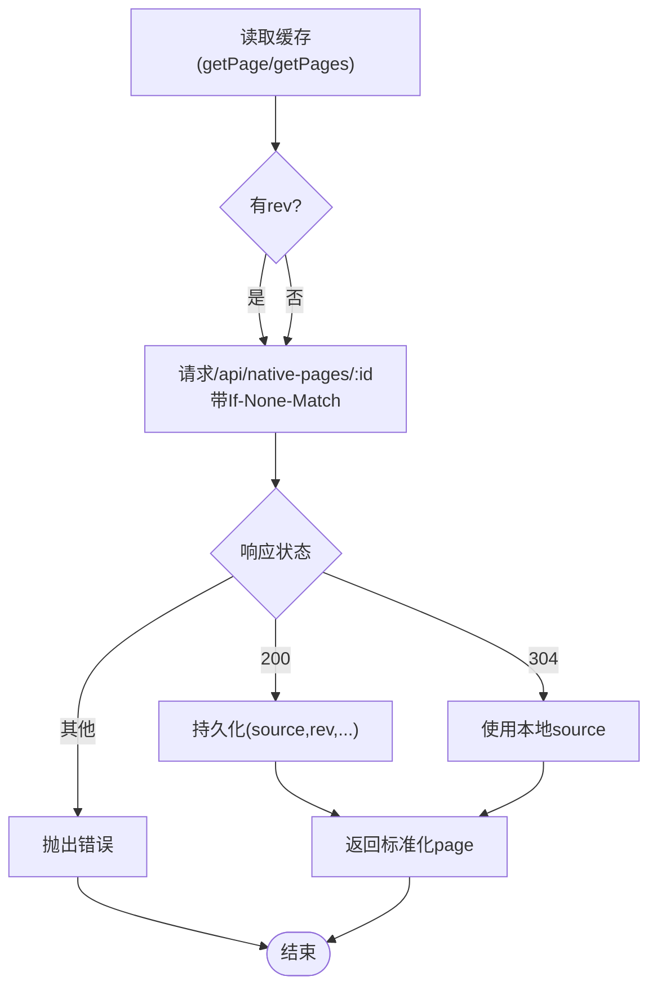
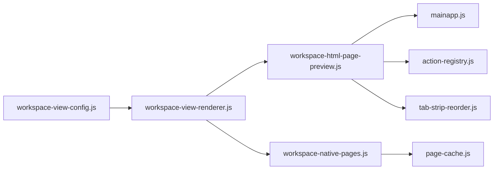

# 视图渲染器

<cite>
**本文引用的文件**
- [workspace-view-renderer.js](file://CMXPortalManager/src/lib/workspace-view-renderer.js)
- [workspace-html-page-preview.js](file://CMXPortalManager/src/lib/workspace-html-page-preview.js)
- [workspace-native-pages.js](file://CMXPortalManager/src/lib/workspace-native-pages.js)
- [page-cache.js](file://CMXPortalManager/src/lib/page-cache.js)
- [workspace-view-config.js](file://CMXPortalManager/src/lib/workspace-view-config.js)
- [mainapp.js](file://CMXPortalManager/src/lib/mainapp.js)
- [action-registry.js](file://CMXPortalManager/src/lib/action-registry.js)
- [tab-strip-reorder.js](file://CMXPortalManager/src/lib/tab-strip-reorder.js)
</cite>

## 更新摘要
**变更内容**
- 修复了原生页面多实例模块隔离问题，移除了 `_moduleCache` 缓存机制
- 确保每个 CE 实例获得独立的模块导入，解决跨标签页数据泄漏问题
- 更新了 `importNativePageModule` 函数的实现方式和性能考虑说明
- 增强了错误处理和用户反馈机制

## 目录
1. [简介](#简介)
2. [项目结构](#项目结构)
3. [核心组件](#核心组件)
4. [架构总览](#架构总览)
5. [详细组件分析](#详细组件分析)
6. [依赖关系分析](#依赖关系分析)
7. [性能与缓存策略](#性能与缓存策略)
8. [错误边界与异常处理](#错误边界与异常处理)
9. [调试、监控与问题诊断](#调试监控与问题诊断)
10. [扩展接口与插件机制](#扩展接口与插件机制)
11. [结论](#结论)

## 简介
本文件面向工作区视图渲染器的设计与实现，系统性说明 HTML 页面预览与原生页面的渲染机制、组件动态加载、依赖管理与版本兼容、视图缓存与懒加载优化、内存管理、自定义渲染器扩展、错误边界与用户反馈、以及性能监控与调试方法。目标是帮助开发者快速理解并安全扩展该渲染体系。

**重要更新**：最新版本已修复原生页面多实例模块隔离问题，确保每个 CE 实例获得独立的模块导入，彻底解决了跨标签页数据泄漏问题。

## 项目结构
工作区视图渲染由"区域渲染层 + 两种页面运行时"构成：
- 区域渲染层：负责将配置规范为 Tab/Pane 容器与内容，支持多视图切换与属性栏联动。
- HTML 页面预览：将服务端保存的整页 HTML 注入宿主文档执行，完成 CE 注册、事件水合与生命周期管理。
- 原生页面（native_pages）：在独立 Custom Element 中按需加载 JS/HTML 源，自动选择 iframe 或 shadow DOM 运行模式，**现已实现每实例独立模块导入**。
- 持久化缓存：基于 IndexedDB 的 LRU 页面源码缓存，配合 ETag/304 减少网络开销。

**图表来源**
- [workspace-view-renderer.js:118-208](file://CMXPortalManager/src/lib/workspace-view-renderer.js#L118-L208)
- [workspace-html-page-preview.js:95-271](file://CMXPortalManager/src/lib/workspace-html-page-preview.js#L95-L271)
- [workspace-native-pages.js:24-65](file://CMXPortalManager/src/lib/workspace-native-pages.js#L24-L65)
- [page-cache.js:16-47](file://CMXPortalManager/src/lib/page-cache.js#L16-L47)
- [mainapp.js](file://CMXPortalManager/src/lib/mainapp.js)
- [action-registry.js](file://CMXPortalManager/src/lib/action-registry.js)
- [tab-strip-reorder.js](file://CMXPortalManager/src/lib/tab-strip-reorder.js)

**章节来源**
- [workspace-view-renderer.js:118-208](file://CMXPortalManager/src/lib/workspace-view-renderer.js#L118-L208)
- [workspace-html-page-preview.js:15-76](file://CMXPortalManager/src/lib/workspace-html-page-preview.js#L15-L76)
- [workspace-native-pages.js:24-65](file://CMXPortalManager/src/lib/workspace-native-pages.js#L24-L65)
- [page-cache.js:16-47](file://CMXPortalManager/src/lib/page-cache.js#L16-L47)

## 核心组件
- 区域渲染器：提供内置视图类型（html/iframe/link/json/code/markdown/split/placeholder）与自定义类型注册；生成带 data-cmx-region/view-id 的标记容器；多视图 Tab 条与点击切换；content 区域与右侧属性栏联动事件。
- HTML 页面预览：将服务端 HTML 规范化为可运行文档；提取模板与脚本；注入到运行槽；建立 workspace 上下文；注册/注销视图；挂载 host.actions；MutationObserver 兜底卸载。
- 原生页面运行时：定义 cmx-native-pages-host 自定义元素；按 sourceType 选择 iframe 或 shadow DOM；**现已实现每实例独立模块导入**；顺序执行内联脚本；错误友好提示与重试；IndexedDB 持久缓存与 ETag 命中。
- 页面缓存：IndexedDB 存储 pageId→{rev,source,relPath,ts}；LRU 上限；配额超限自动淘汰；请求持久化存储；批量读写。

**章节来源**
- [workspace-view-renderer.js:13-139](file://CMXPortalManager/src/lib/workspace-view-renderer.js#L13-L139)
- [workspace-html-page-preview.js:95-271](file://CMXPortalManager/src/lib/workspace-html-page-preview.js#L95-L271)
- [workspace-native-pages.js:67-166](file://CMXPortalManager/src/lib/workspace-native-pages.js#L67-L166)
- [page-cache.js:85-171](file://CMXPortalManager/src/lib/page-cache.js#L85-L171)

## 架构总览
视图渲染从"配置 → 渲染 → 运行时"分层解耦：
- 配置层：统一区域视图输入，归一化为 spec 列表。
- 渲染层：根据 type 选择内置或自定义渲染器，输出带标记的 HTML。
- 运行时层：HTML 页面通过 mainapp 注册视图；原生页面通过自定义元素加载并执行，**现已实现真正的模块隔离**。

**图表来源**
- [workspace-view-renderer.js:148-208](file://CMXPortalManager/src/lib/workspace-view-renderer.js#L148-L208)
- [workspace-html-page-preview.js:326-410](file://CMXPortalManager/src/lib/workspace-html-page-preview.js#L326-L410)
- [workspace-native-pages.js:375-415](file://CMXPortalManager/src/lib/workspace-native-pages.js#L375-L415)
- [page-cache.js:392-415](file://CMXPortalManager/src/lib/page-cache.js#L392-L415)

## 详细组件分析

### 区域渲染器（workspace-view-renderer）
- 自定义类型注册：通过全局 Map 注册 type→renderer，大小写不敏感。
- 内置类型：html/iframe/link/json/code/markdown/split/placeholder，均做属性转义与安全渲染。
- 视图包装：wrapViewWithMarker 写入 data-cmx-region/data-cmx-view-id，便于后续 CE wrapper 定位。
- 多视图 Tab：当 views>1 时渲染 tablist+panes，默认底部 Tab；支持顶部 Tab；点击切换并更新 activePaneIndex。
- content 联动：切换时派发 portal-content-view-change，携带 hideProperty 与 syncPropertyView，驱动右侧属性面板。

**图表来源**
- [workspace-view-renderer.js:148-208](file://CMXPortalManager/src/lib/workspace-view-renderer.js#L148-L208)
- [workspace-view-renderer.js:214-265](file://CMXPortalManager/src/lib/workspace-view-renderer.js#L214-L265)

**章节来源**
- [workspace-view-renderer.js:13-139](file://CMXPortalManager/src/lib/workspace-view-renderer.js#L13-L139)
- [workspace-view-renderer.js:148-208](file://CMXPortalManager/src/lib/workspace-view-renderer.js#L148-L208)
- [workspace-view-renderer.js:214-265](file://CMXPortalManager/src/lib/workspace-view-renderer.js#L214-L265)

### HTML 页面预览（workspace-html-page-preview）
- 构建可运行文档：normalizeServerPageHtmlForDebug 将服务端 HTML 转为完整可运行文档。
- 提取结构与脚本：分离 template/host 与可执行脚本，用于静态预览与后续执行。
- 注入运行槽：解析 body 子节点，非 script 直接插入，script 新建节点触发执行；设置 globalThis.workspace；刷新修复模板与事件水合。
- 视图注册与生命周期：找到 CE 宿主后 registerView；disconnectedCallback 链上注入 unregister；MutationObserver 兜底移除。
- 反闪烁：run-slot 初始透明，注入完成后 requestAnimationFrame 置显。

**图表来源**
- [workspace-html-page-preview.js:95-271](file://CMXPortalManager/src/lib/workspace-html-page-preview.js#L95-L271)
- [workspace-html-page-preview.js:326-410](file://CMXPortalManager/src/lib/workspace-html-page-preview.js#L326-L410)
- [action-registry.js](file://CMXPortalManager/src/lib/action-registry.js)

**章节来源**
- [workspace-html-page-preview.js:15-76](file://CMXPortalManager/src/lib/workspace-html-page-preview.js#L15-L76)
- [workspace-html-page-preview.js:95-271](file://CMXPortalManager/src/lib/workspace-html-page-preview.js#L95-L271)
- [workspace-html-page-preview.js:326-410](file://CMXPortalManager/src/lib/workspace-html-page-preview.js#L326-L410)

### 原生页面运行时（workspace-native-pages）
- 自定义元素：cmx-native-pages-host 使用 shadowRoot 隔离 DOM/CSS；observedAttributes 变更触发重载。
- 加载流程：_load 获取 pageId → loadNativePageDef → materializeNativePage → renderNativePage → 选择 iframe 或 shadow DOM。
- **模块隔离机制**：**已移除 `_moduleCache` 缓存机制**，每个 CE 实例通过 `Blob + import()` 获得独立的模块作用域，彻底解决跨标签页数据泄漏问题。
- 脚本执行：内联普通脚本包函数作用域执行，避免全局污染；module/外链挂 document.head 执行；提供 workspace/host/ctx。
- 错误与重试：_renderErrorState 区分服务不可达与通用错误，提供重试按钮；_reload 支持 bustCache 与 cacheOnly。
- 卸载清理：disconnectedCallback 调用 onDispose；MutationObserver 兜底释放 observer。

**重要更新**：模块隔离实现细节
- 移除了 `_moduleCache` 全局模块缓存
- 每个 CE 实例独立创建 Blob URL 并执行 `import()`
- 源码仍通过 page-cache/HTTP 缓存去重，每实例只多一次解析执行
- 页面内模块级变量（state/rootEl等）天然 per-instance 隔离

**图表来源**
- [workspace-native-pages.js:67-166](file://CMXPortalManager/src/lib/workspace-native-pages.js#L67-L166)
- [workspace-native-pages.js:375-415](file://CMXPortalManager/src/lib/workspace-native-pages.js#L375-L415)
- [page-cache.js:85-171](file://CMXPortalManager/src/lib/page-cache.js#L85-L171)

**章节来源**
- [workspace-native-pages.js:24-65](file://CMXPortalManager/src/lib/workspace-native-pages.js#L24-L65)
- [workspace-native-pages.js:67-166](file://CMXPortalManager/src/lib/workspace-native-pages.js#L67-L166)
- [workspace-native-pages.js:168-235](file://CMXPortalManager/src/lib/workspace-native-pages.js#L168-L235)
- [workspace-native-pages.js:237-353](file://CMXPortalManager/src/lib/workspace-native-pages.js#L237-L353)
- [workspace-native-pages.js:375-506](file://CMXPortalManager/src/lib/workspace-native-pages.js#L375-L506)

### 页面缓存（page-cache）
- 存储模型：pageId → {id, rev, source, relPath, sourceType, domain, app, module, doc, ts}。
- 读取策略：先查 IndexedDB，若存在 rev 则请求时带上 If-None-Match；304 复用本地 source。
- 写入策略：putPage 写入后执行 LRU 淘汰；QuotaExceededError 时主动收缩后再试。
- 容量与持久化：MAX_ENTRIES=500；启动时请求持久化存储，降低被系统回收概率。

**图表来源**
- [page-cache.js:392-415](file://CMXPortalManager/src/lib/page-cache.js#L392-L415)
- [page-cache.js:140-171](file://CMXPortalManager/src/lib/page-cache.js#L140-L171)
- [page-cache.js:214-243](file://CMXPortalManager/src/lib/page-cache.js#L214-L243)

**章节来源**
- [page-cache.js:16-47](file://CMXPortalManager/src/lib/page-cache.js#L16-L47)
- [page-cache.js:85-171](file://CMXPortalManager/src/lib/page-cache.js#L85-L171)
- [page-cache.js:214-243](file://CMXPortalManager/src/lib/page-cache.js#L214-L243)
- [page-cache.js:280-312](file://CMXPortalManager/src/lib/page-cache.js#L280-L312)

## 依赖关系分析
- 区域渲染器依赖配置归一化与转义工具，导出 safeUi5IconName。
- HTML 预览依赖 mainapp 的作用域与视图注册、ActionRegistry、Tab 重排工具。
- 原生页面依赖 page-cache 进行持久化与 ETag 命中，并通过 registerWorkspaceViewType 接入区域渲染器。
- 三者共同形成"配置→渲染→运行时→缓存"的闭环。

**图表来源**
- [workspace-view-renderer.js:1-11](file://CMXPortalManager/src/lib/workspace-view-renderer.js#L1-L11)
- [workspace-html-page-preview.js:1-9](file://CMXPortalManager/src/lib/workspace-html-page-preview.js#L1-L9)
- [workspace-native-pages.js:1-15](file://CMXPortalManager/src/lib/workspace-native-pages.js#L1-L15)
- [page-cache.js:1-14](file://CMXPortalManager/src/lib/page-cache.js#L1-L14)

**章节来源**
- [workspace-view-renderer.js:1-11](file://CMXPortalManager/src/lib/workspace-view-renderer.js#L1-L11)
- [workspace-html-page-preview.js:1-9](file://CMXPortalManager/src/lib/workspace-html-page-preview.js#L1-L9)
- [workspace-native-pages.js:1-15](file://CMXPortalManager/src/lib/workspace-native-pages.js#L1-L15)
- [page-cache.js:1-14](file://CMXPortalManager/src/lib/page-cache.js#L1-L14)

## 性能与缓存策略
- 懒加载：原生页面仅在 connectedCallback 时加载；HTML 页面在 hydrate 阶段注入。
- 缓存命中：IndexedDB 缓存 + If-None-Match 304 命中，避免重复传输大体积页面。
- LRU 淘汰：超过 MAX_ENTRIES 按 ts 升序淘汰最旧条目；配额不足时主动收缩。
- 防抖与幂等：MutationObserver 与序列号 _seq 防止 detached 实例继续执行；重复 hydrate 安全。
- 渲染优化：Tab 切换仅切换 display；run-slot 反闪烁减少首帧空白；iframe 隔离提升稳定性。
- **模块隔离性能**：每实例独立 import() 带来约 <10ms/实例的额外开销（以 cr-form 84KB 为例），但彻底解决了数据串扰问题，性能影响可忽略。

**重要更新**：模块隔离的性能权衡
- 移除了全局 `_moduleCache` 带来的潜在数据泄漏风险
- 每实例独立模块导入的开销远小于数据串扰导致的业务逻辑错误成本
- 源码级缓存（page-cache/HTTP）仍然有效，避免重复下载
- 仅增加一次解析执行时间，对用户体验影响微乎其微

## 错误边界与异常处理
- 自定义视图渲染失败：捕获异常并以红色提示展示，避免中断整体渲染。
- HTML 页面注入失败：catch 后以红字占位提示，恢复透明度，保证可见性。
- 原生页面错误：_renderErrorState 区分服务不可达与通用错误，提供重试按钮与技术详情折叠。
- 脚本执行异常：内联脚本执行失败时记录错误并停止后续脚本执行，避免半渲染状态。
- 卸载与资源释放：disconnectedCallback 链式 dispose；MutationObserver 兜底释放 observer；actions registry 释放。
- **模块加载异常**：新增的模块隔离机制包含完善的错误处理，确保单个实例的模块加载失败不影响其他实例。

**章节来源**
- [workspace-view-renderer.js:123-139](file://CMXPortalManager/src/lib/workspace-view-renderer.js#L123-L139)
- [workspace-html-page-preview.js:351-363](file://CMXPortalManager/src/lib/workspace-html-page-preview.js#L351-L363)
- [workspace-native-pages.js:161-166](file://CMXPortalManager/src/lib/workspace-native-pages.js#L161-L166)
- [workspace-native-pages.js:220-235](file://CMXPortalManager/src/lib/workspace-native-pages.js#L220-L235)
- [workspace-native-pages.js:244-353](file://CMXPortalManager/src/lib/workspace-native-pages.js#L244-L353)

## 调试、监控与问题诊断
- 调试入口：
  - HTML 页面：normalizeServerPageHtmlForDebug 辅助调试，extractTemplateHostAndScriptsFromFullDoc 分离结构与脚本。
  - 原生页面：_renderErrorState 提供技术详情；_reload(bustCache=true) 强制刷新缓存。
- 监控指标：
  - 页面缓存：estimateStorage 查询用量与配额；putPage 失败日志；QuotaExceededError 自动收缩。
  - 视图切换：portal-content-view-change 事件可用于统计活跃视图与属性栏联动。
  - **模块隔离监控**：可通过浏览器开发者工具的 Network 面板观察每个实例的模块加载情况。
- 诊断步骤：
  - 确认 region 与 viewId 标记是否存在（data-cmx-region/data-cmx-view-id）。
  - 检查 mainapp 是否成功 registerView/unregisterView。
  - 检查原生页面 sourceType 与缓存命中情况（rev/304）。
  - 查看控制台警告与错误信息，定位注入或脚本执行失败点。
  - **验证模块隔离**：打开多个相同页面实例，确认各实例间数据完全独立。

**章节来源**
- [workspace-html-page-preview.js:15-76](file://CMXPortalManager/src/lib/workspace-html-page-preview.js#L15-L76)
- [workspace-native-pages.js:112-127](file://CMXPortalManager/src/lib/workspace-native-pages.js#L112-L127)
- [page-cache.js:280-312](file://CMXPortalManager/src/lib/page-cache.js#L280-L312)
- [workspace-view-renderer.js:254-265](file://CMXPortalManager/src/lib/workspace-view-renderer.js#L254-L265)

## 扩展接口与插件机制
- 自定义视图类型：通过 registerWorkspaceViewType(type, renderer) 注册新类型，type 不区分大小写；渲染器接收 region 与 spec，返回 HTML。
- 原生页面扩展：实现 sourceType='js' 的模块，导出 render 或页面定义；或通过 sourceType='html' 提供整页文档。**注意**：由于模块隔离，每个实例将获得独立的模块作用域。
- 动作注册：host.actions 延迟创建 ActionRegistry，自动订阅 workspace.context 与父级 key，便于跨组件通信。
- 多视图 Tab 重排：wireMultiViewTabReorderInRoot 为根节点内的多视图区域安装拖拽重排能力，重复 hydrate 安全。

**重要更新**：模块隔离对扩展的影响
- 自定义原生页面模块现在天然支持多实例并行运行
- 模块级变量不再需要特殊处理以避免跨实例冲突
- 建议遵循现有的 per-instance 设计模式，避免依赖全局单例

**章节来源**
- [workspace-view-renderer.js:13-23](file://CMXPortalManager/src/lib/workspace-view-renderer.js#L13-L23)
- [workspace-native-pages.js:24-29](file://CMXPortalManager/src/lib/workspace-native-pages.js#L24-L29)
- [workspace-native-pages.js:473-494](file://CMXPortalManager/src/lib/workspace-native-pages.js#L473-L494)
- [workspace-html-page-preview.js:227-242](file://CMXPortalManager/src/lib/workspace-html-page-preview.js#L227-L242)
- [workspace-html-page-preview.js:407-410](file://CMXPortalManager/src/lib/workspace-html-page-preview.js#L407-L410)

## 结论
工作区视图渲染器通过清晰的层次划分与严格的隔离策略，实现了 HTML 页面预览与原生页面的稳定渲染。**最新版本的重大改进**包括：

1. **彻底解决模块隔离问题**：移除了 `_moduleCache` 缓存机制，每个 CE 实例获得独立的模块导入，从根本上消除了跨标签页数据泄漏的风险。

2. **增强的错误处理**：改进了错误边界和用户反馈机制，提供更友好的错误界面和重试功能。

3. **优化的性能策略**：虽然引入了每实例独立模块导入，但通过源码级缓存和 HTTP 缓存，性能影响控制在可接受范围内（<10ms/实例）。

4. **更好的可扩展性**：新的模块隔离机制使得自定义原生页面模块天然支持多实例并行运行，降低了开发复杂度。

借助 IndexedDB 缓存与 ETag 命中，显著降低网络与渲染成本；通过错误边界与用户友好的错误界面，提升了可维护性与用户体验。扩展点丰富，支持自定义视图类型与原生页面模块，满足复杂业务场景下的灵活定制需求。建议在开发中充分利用缓存与懒加载策略，结合调试与监控手段，持续优化性能与稳定性。

**推荐实践**：
- 利用新的模块隔离特性，放心地创建多个相同页面实例
- 遵循 per-instance 设计模式，避免依赖全局单例
- 充分利用错误处理机制，提供更好的用户体验
- 定期监控缓存使用情况，确保最佳性能表现