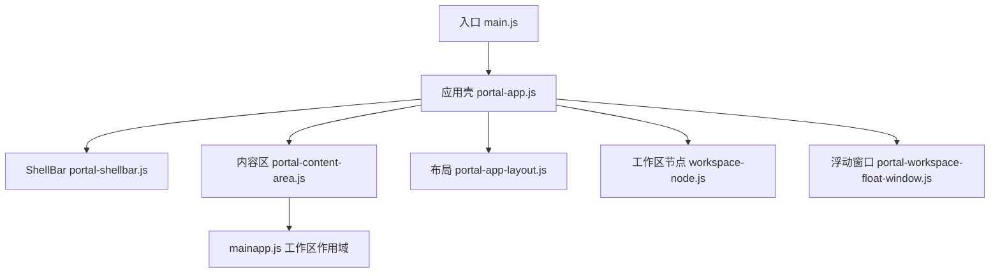
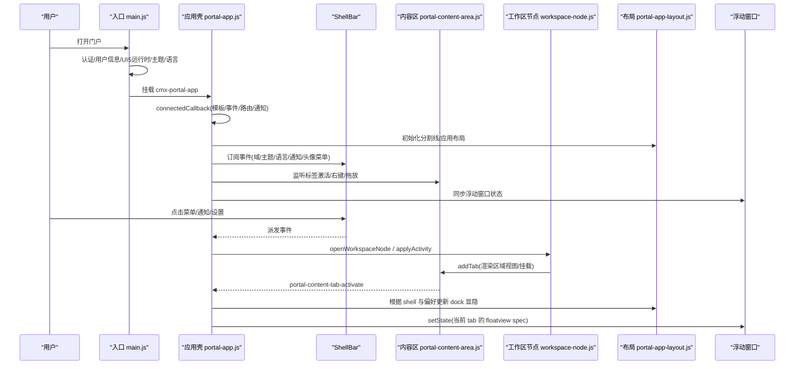
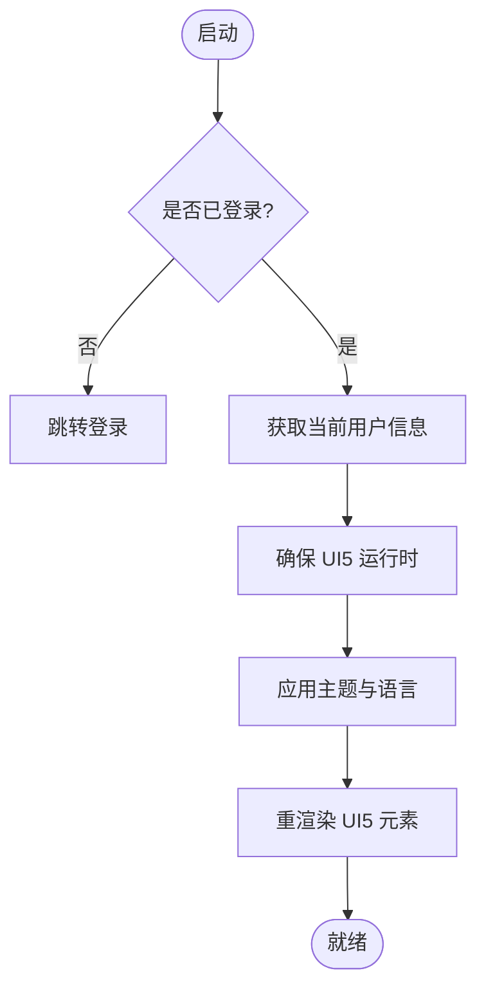
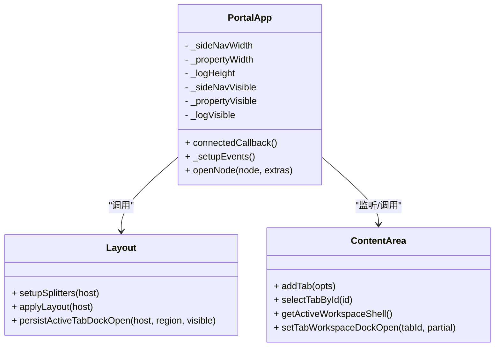
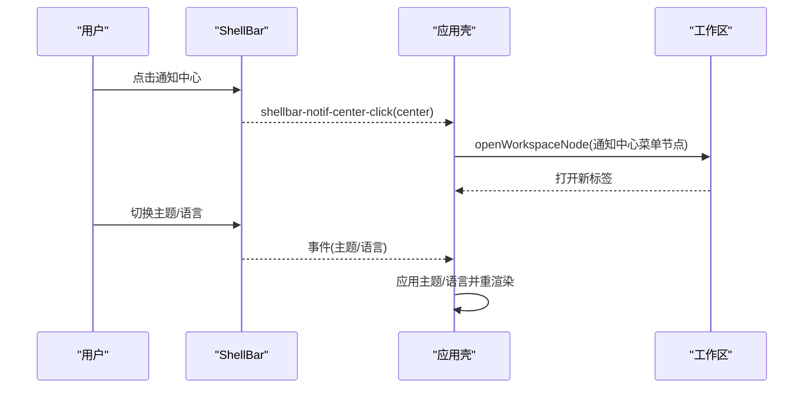
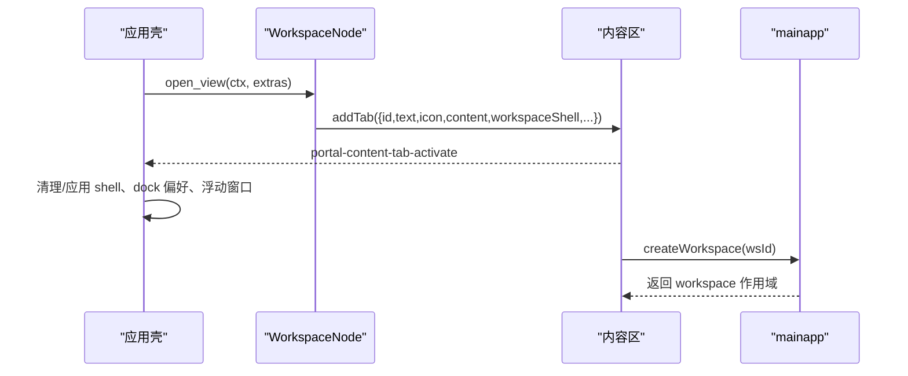
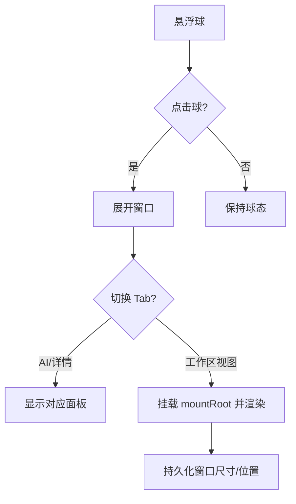
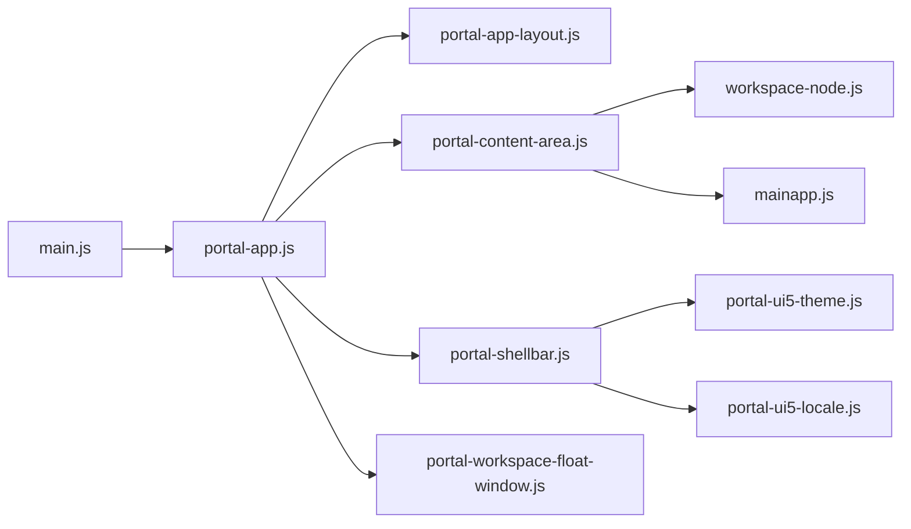

# 应用外壳与布局管理

<cite>
**本文引用的文件**
- [main.js](file://CMXPortalManager/src/main.js)
- [portal-app-shell.js](file://CMXPortalManager/src/components/portal-app-shell.js)
- [portal-app.js](file://CMXPortalManager/src/components/portal-app.js)
- [portal-shellbar.js](file://CMXPortalManager/src/components/portal-shellbar.js)
- [portal-content-area.js](file://CMXPortalManager/src/components/portal-content-area.js)
- [portal-workspace-float-window.js](file://CMXPortalManager/src/components/portal-workspace-float-window.js)
- [portal-app-layout.js](file://CMXPortalManager/src/components/portal-app-layout.js)
- [workspace-node.js](file://CMXPortalManager/src/lib/workspace-node.js)
- [mainapp.js](file://CMXPortalManager/src/lib/mainapp.js)
</cite>

## 目录
1. [简介](#简介)
2. [项目结构](#项目结构)
3. [核心组件](#核心组件)
4. [架构总览](#架构总览)
5. [详细组件分析](#详细组件分析)
6. [依赖关系分析](#依赖关系分析)
7. [性能考虑](#性能考虑)
8. [故障排查指南](#故障排查指南)
9. [结论](#结论)
10. [附录](#附录)

## 简介
本文件面向门户管理器应用外壳，系统性说明应用启动流程、主容器组件架构与布局管理系统；深入解释外壳生命周期、主题切换机制、响应式布局适配；详述 ShellBar 功能特性（用户头像菜单、通知中心集成、全局操作按钮）；说明工作区容器的初始化、多标签页管理与浮动窗口支持；并提供组件配置选项、事件处理模式、自定义扩展方法、性能优化建议与常见布局问题解决方案。

## 项目结构
门户外壳由“入口引导 → 应用壳 → 内容区域 → 工具栏与面板”构成：
- 入口引导：负责认证、UI5 运行时注入、主题与语言初始化、错误兜底。
- 应用壳：承载三段式网格布局（顶栏/主体/状态栏），装配侧边导航、内容区、属性面板、日志面板与浮动窗口。
- 内容区域：管理多标签页、视图挂载、上下文与拖放、溢出布局等。
- ShellBar：提供品牌、搜索、主题/语言切换、域切换、通知中心、用户头像菜单与全局操作按钮。
- 浮动窗口：右下角悬浮球与可移动窗口，承载 AI 助手与工作区 floatview 视图。

图表来源
- [main.js:22-43](file://CMXPortalManager/src/main.js#L22-L43)
- [portal-app.js:71-94](file://CMXPortalManager/src/components/portal-app.js#L71-L94)
- [portal-shellbar.js:93-112](file://CMXPortalManager/src/components/portal-shellbar.js#L93-L112)
- [portal-content-area.js:29-48](file://CMXPortalManager/src/components/portal-content-area.js#L29-L48)
- [portal-app-layout.js:33-71](file://CMXPortalManager/src/components/portal-app-layout.js#L33-L71)
- [workspace-node.js:216-281](file://CMXPortalManager/src/lib/workspace-node.js#L216-L281)
- [portal-workspace-float-window.js:61-108](file://CMXPortalManager/src/components/portal-workspace-float-window.js#L61-L108)
- [mainapp.js:389-400](file://CMXPortalManager/src/lib/mainapp.js#L389-L400)

章节来源
- [main.js:22-43](file://CMXPortalManager/src/main.js#L22-L43)
- [portal-app-shell.js:6-202](file://CMXPortalManager/src/components/portal-app-shell.js#L6-L202)

## 核心组件
- 入口引导（main.js）：安装控制台桥接、全局 fetch 拦截、全局错误提示；校验登录态并拉取当前用户信息；加载 UI5 运行时；初始化主题与语言；触发 UI5 元素重渲染。
- 应用壳（portal-app.js）：构建 Shadow DOM 模板、注册全局事件、同步活动域、路由接入、通知中心初始化、打开工作区节点、浮动窗口联动、快捷键与离开确认。
- ShellBar（portal-shellbar.js）：基于 UI5 ShellBar 的顶部栏，包含主题/语言下拉、资源域切换、通知中心、用户头像菜单、帮助/欢迎/DAM/集群数据源/菜单管理等全局按钮。
- 内容区（portal-content-area.js）：维护标签列表、选中态、溢出布局、脏标记、右键菜单、拖放、空状态、刷新与关闭逻辑。
- 布局（portal-app-layout.js）：三段式网格与可拖拽分割线；控制侧边栏、属性面板、日志面板显隐与尺寸；持久化当前标签 dock 偏好。
- 工作区节点（workspace-node.js）：从菜单节点构造 WorkspaceNode，抽取 shell 快照，渲染区域视图，创建 Content 标签并挂载。
- 浮动窗口（portal-workspace-float-window.js）：悬浮球与浮动窗口，支持拖拽、位置持久化、Tab 切换、AI 助手懒加载、工作区 floatview 视图挂载。
- 工作区作用域（mainapp.js）：跨视图共享上下文、视图注册/注销、Action 注册表、inner/embed 区能力。

章节来源
- [main.js:16-43](file://CMXPortalManager/src/main.js#L16-L43)
- [portal-app.js:32-94](file://CMXPortalManager/src/components/portal-app.js#L32-L94)
- [portal-shellbar.js:93-112](file://CMXPortalManager/src/components/portal-shellbar.js#L93-L112)
- [portal-content-area.js:9-48](file://CMXPortalManager/src/components/portal-content-area.js#L9-L48)
- [portal-app-layout.js:3-155](file://CMXPortalManager/src/components/portal-app-layout.js#L3-L155)
- [workspace-node.js:25-98](file://CMXPortalManager/src/lib/workspace-node.js#L25-L98)
- [portal-workspace-float-window.js:61-108](file://CMXPortalManager/src/components/portal-workspace-float-window.js#L61-L108)
- [mainapp.js:31-99](file://CMXPortalManager/src/lib/mainapp.js#L31-L99)

## 架构总览
应用外壳采用“组件化 + 事件驱动 + 作用域隔离”的架构：
- 入口层：统一初始化与错误兜底。
- 外壳层：通过自定义事件协调各子组件（ShellBar、ContentArea、SideNav、PropertyPanel、LogPanel、FloatWindow）。
- 工作区级：以 tab 为粒度维护 workspace 作用域，视图通过 registerView/unregisterView 加入/移出，避免重复挂载与内存泄漏。
- 布局层：CSS Grid + Flex 实现三段式布局，配合可拖拽分割线与 CSS 变量动态调整尺寸。
- 路由层：URL 决定首屏，tab 切换同步 URL，支持前进/回退重建动态节点。

图表来源
- [main.js:22-43](file://CMXPortalManager/src/main.js#L22-L43)
- [portal-app.js:71-94](file://CMXPortalManager/src/components/portal-app.js#L71-L94)
- [workspace-node.js:216-281](file://CMXPortalManager/src/lib/workspace-node.js#L216-L281)
- [portal-content-area.js:29-48](file://CMXPortalManager/src/components/portal-content-area.js#L29-L48)
- [portal-app-layout.js:33-71](file://CMXPortalManager/src/components/portal-app-layout.js#L33-L71)
- [portal-workspace-float-window.js:124-161](file://CMXPortalManager/src/components/portal-workspace-float-window.js#L124-L161)

## 详细组件分析

### 应用启动流程
- 认证与用户信息：未登录跳转登录页；成功后将用户信息挂到全局供页面模板读取，并补写会话标识。
- UI5 运行时：确保运行时可用后导入应用模块。
- 主题与语言：按本地存储或默认值应用主题与语言，并对已存在的 UI5 元素进行重渲染。
- 错误兜底：全局捕获未处理异常与 Promise 拒绝，显示轻量提示或致命屏幕。

图表来源
- [main.js:22-43](file://CMXPortalManager/src/main.js#L22-L43)

章节来源
- [main.js:16-43](file://CMXPortalManager/src/main.js#L16-L43)

### 主容器组件与布局管理
- 三段式网格：顶栏（ShellBar）、主体（侧边+内容+属性+日志）、状态栏（StatusBar）。
- 可拖拽分割线：左侧/右侧/底部三根分割线，支持水平/垂直拖动，限制最小/最大尺寸，实时写入 CSS 变量。
- Dock 偏好：属性面板与日志面板的显隐按“shell 是否声明该区域视图 + 用户偏好”计算，并持久化到当前标签。
- 响应式：使用 minmax(0,1fr) 防止子树 min-height:auto 导致的外溢；安全区域适配刘海屏。

图表来源
- [portal-app.js:32-94](file://CMXPortalManager/src/components/portal-app.js#L32-L94)
- [portal-app-layout.js:33-155](file://CMXPortalManager/src/components/portal-app-layout.js#L33-L155)
- [portal-content-area.js:72-143](file://CMXPortalManager/src/components/portal-content-area.js#L72-L143)

章节来源
- [portal-app-shell.js:6-202](file://CMXPortalManager/src/components/portal-app-shell.js#L6-L202)
- [portal-app-layout.js:3-155](file://CMXPortalManager/src/components/portal-app-layout.js#L3-L155)

### ShellBar 组件特性
- 主题切换：主题下拉菜单，图标随当前主题变化；应用主题并持久化。
- 语言切换：语言下拉菜单，带国旗标识；应用语言并持久化。
- 资源域切换：弹出域选择器，切换后刷新活动列表与默认活动。
- 通知中心：展示任务/消息/日志中心元信息与未读数角标；支持 SSE 实时更新计数。
- 用户头像菜单：账户、偏好、关于系统、退出登录。
- 全局操作按钮：欢迎页、DAM 注册中心、集群数据源、菜单管理、帮助中心、AI 助手浮窗开关。

图表来源
- [portal-shellbar.js:109-182](file://CMXPortalManager/src/components/portal-shellbar.js#L109-L182)
- [portal-app.js:116-184](file://CMXPortalManager/src/components/portal-app.js#L116-L184)

章节来源
- [portal-shellbar.js:93-800](file://CMXPortalManager/src/components/portal-shellbar.js#L93-L800)
- [portal-app.js:116-184](file://CMXPortalManager/src/components/portal-app.js#L116-L184)

### 工作区容器初始化与多标签页管理
- 初始化：应用壳在 connectedCallback 中完成模板渲染、分割线初始化、活动同步、布局应用、通知初始化与路由接入。
- 标签创建：通过 WorkspaceNode.open_view 渲染 content 区域视图 HTML，抽取 shell 快照，生成 tab 选项并添加到内容区。
- 标签切换：内容区派发激活事件，应用壳清理消失的区域、重新应用 shell、恢复 dock 偏好、同步浮动窗口与菜单选中态。
- 上下文与作用域：每个标签对应一个 workspace 作用域，视图通过 registerView 注册，支持 actions、inner/embed 区能力。

图表来源
- [workspace-node.js:216-281](file://CMXPortalManager/src/lib/workspace-node.js#L216-L281)
- [portal-content-area.js:72-143](file://CMXPortalManager/src/components/portal-content-area.js#L72-L143)
- [mainapp.js:408-418](file://CMXPortalManager/src/lib/mainapp.js#L408-L418)

章节来源
- [portal-app.js:71-94](file://CMXPortalManager/src/components/portal-app.js#L71-L94)
- [workspace-node.js:25-98](file://CMXPortalManager/src/lib/workspace-node.js#L25-L98)
- [portal-content-area.js:29-48](file://CMXPortalManager/src/components/portal-content-area.js#L29-L48)

### 浮动窗口支持
- 悬浮球：常驻右下角，可拖拽，位置持久化；点击展开为窗口。
- 窗口：标题栏可拖拽，右上角关闭；底部 Tab 包含 AI 助手、智能体详情与工作区 floatview 视图。
- 状态同步：宿主通过 setState 传入 title/icon/spec/mountRoot；内部去重避免重复挂载；自动聚焦最后一个工作区视图。
- 持久化：球位置与窗口尺寸/位置保存到 localStorage。

图表来源
- [portal-workspace-float-window.js:61-108](file://CMXPortalManager/src/components/portal-workspace-float-window.js#L61-L108)
- [portal-workspace-float-window.js:124-161](file://CMXPortalManager/src/components/portal-workspace-float-window.js#L124-L161)
- [portal-workspace-float-window.js:222-726](file://CMXPortalManager/src/components/portal-workspace-float-window.js#L222-L726)

章节来源
- [portal-workspace-float-window.js:61-108](file://CMXPortalManager/src/components/portal-workspace-float-window.js#L61-L108)
- [portal-workspace-float-window.js:124-161](file://CMXPortalManager/src/components/portal-workspace-float-window.js#L124-L161)

### 事件处理模式与自定义扩展
- 事件总线：组件间通过 CustomEvent 通信（如 activity-change、portal-content-tab-activate、panel-close、status-item-click）。
- 扩展点：
  - 应用壳：openNode、switchActivityForMenu、_openHelpCenter、_openNotifyCenter 等公开方法。
  - 内容区：addTab、selectTabById、setTabWorkspaceDockOpen、getTabContentSpec 等。
  - 浮动窗口：setState、open/close、activateView。
  - 工作区作用域：createWorkspace、registerView/unregisterView、actions 注册表。
- 键盘快捷键：Ctrl+B/J/P 分别切换侧边栏/日志/属性面板。

章节来源
- [portal-app.js:96-484](file://CMXPortalManager/src/components/portal-app.js#L96-L484)
- [portal-content-area.js:72-143](file://CMXPortalManager/src/components/portal-content-area.js#L72-L143)
- [portal-workspace-float-window.js:124-161](file://CMXPortalManager/src/components/portal-workspace-float-window.js#L124-L161)
- [mainapp.js:477-534](file://CMXPortalManager/src/lib/mainapp.js#L477-L534)

## 依赖关系分析
- 入口依赖：UI5 运行时、主题/语言模块、认证与 API 客户端、全局错误提示。
- 应用壳依赖：布局、工作区、路由、通知、菜单节点工厂、浮动窗口。
- 内容区依赖：标签管理、溢出布局、拖放、右键菜单、空状态。
- ShellBar 依赖：UI5 组件、主题/语言、对话框、通知中心。
- 工作区节点依赖：视图渲染、标签文案、显示文本、Dock 布局读写。
- 浮动窗口依赖：工作区节点工具、Tab 重排、持久化、挂载、拖拽。

图表来源
- [main.js:22-43](file://CMXPortalManager/src/main.js#L22-L43)
- [portal-app.js:1-31](file://CMXPortalManager/src/components/portal-app.js#L1-L31)
- [portal-content-area.js:1-8](file://CMXPortalManager/src/components/portal-content-area.js#L1-L8)
- [portal-shellbar.js:9-27](file://CMXPortalManager/src/components/portal-shellbar.js#L9-L27)
- [workspace-node.js:1-19](file://CMXPortalManager/src/lib/workspace-node.js#L1-L19)
- [mainapp.js:23-27](file://CMXPortalManager/src/lib/mainapp.js#L23-L27)

章节来源
- [main.js:22-43](file://CMXPortalManager/src/main.js#L22-L43)
- [portal-app.js:1-31](file://CMXPortalManager/src/components/portal-app.js#L1-L31)
- [portal-content-area.js:1-8](file://CMXPortalManager/src/components/portal-content-area.js#L1-L8)
- [portal-shellbar.js:9-27](file://CMXPortalManager/src/components/portal-shellbar.js#L9-L27)
- [workspace-node.js:1-19](file://CMXPortalManager/src/lib/workspace-node.js#L1-L19)
- [mainapp.js:23-27](file://CMXPortalManager/src/lib/mainapp.js#L23-L27)

## 性能考虑
- 延迟加载：AI 开发助手组件懒加载，避免首屏体积过大。
- 视图复用：内容区缓存工作区挂载根，切换标签时仅移动 DOM，减少重建。
- 去重渲染：浮动窗口 setState 对 spec 与 mountRoot 引用进行比对，避免无意义重渲染。
- 事件节流：分割线拖动使用 mousedown/mousemove/mouseup 组合，避免频繁布局抖动。
- 内存管理：disconnectedCallback 中移除事件监听与观察者；disposeWorkspace 清理上下文与 action registry。
- 网络请求：通知中心 SSE 订阅避免重复；计数事件增量更新 UI。

[本节为通用性能指导，不直接分析具体文件]

## 故障排查指南
- 启动失败：检查认证拦截、用户信息获取、UI5 运行时加载、主题/语言初始化；查看全局错误提示。
- 主题/语言不生效：确认 reRenderAllUI5Elements 被调用；检查主题/语言本地存储键。
- 侧边栏/属性/日志面板不显示：检查 shell 是否声明对应区域视图；确认 dock 偏好未被显式收起；验证分割线尺寸范围。
- 标签切换闪烁：确认应用壳仅清除消失的区域；检查 mounts 是否正确传递。
- 浮动窗口不展开：检查 setState 参数；确认 mountRoot 已挂载；验证 Tab 索引越界回落逻辑。
- 通知角标不更新：确认 SSE 订阅已建立；检查 counts 事件数据结构。

章节来源
- [main.js:16-43](file://CMXPortalManager/src/main.js#L16-L43)
- [portal-app-layout.js:33-71](file://CMXPortalManager/src/components/portal-app-layout.js#L33-L71)
- [portal-workspace-float-window.js:124-161](file://CMXPortalManager/src/components/portal-workspace-float-window.js#L124-L161)
- [portal-app.js:634-656](file://CMXPortalManager/src/components/portal-app.js#L634-L656)

## 结论
门户外壳通过清晰的启动流程、模块化组件与事件驱动架构，实现了稳定的主题/语言切换、响应式布局与多标签工作区管理。ShellBar 提供了丰富的全局操作与通知集成；浮动窗口增强了交互体验与 AI 助手可用性。借助工作区作用域与视图注册机制，系统在可扩展性与性能之间取得平衡。建议在实际使用中遵循事件约定与扩展点，合理配置 dock 偏好与浮动窗口状态，以获得最佳用户体验。

## 附录
- 常用配置项
  - 分割线尺寸范围：侧边栏 160-600px，属性面板 200-700px，日志面板 80-600px。
  - 浮动窗口默认尺寸：宽 520px，高 620px；标题栏高度 34px；球大小 48px。
  - 通知中心默认三中心：任务、消息、日志；可通过后端接口覆盖。
- 事件参考
  - activity-change：活动切换，携带 id/visible/sideNav/label。
  - portal-content-tab-activate：标签激活，携带 tabId/workspaceShell/node。
  - panel-close：属性/日志面板关闭，携带目标面板信息。
  - status-item-click：状态栏项点击，携带 id。
- 扩展方法
  - 应用壳：openNode、switchActivityForMenu、_openHelpCenter、_openNotifyCenter。
  - 内容区：addTab、selectTabById、setTabWorkspaceDockOpen、getTabContentSpec。
  - 浮动窗口：setState、open/close、activateView。
  - 工作区作用域：createWorkspace、registerView/unregisterView、actions。

[本节为补充信息，不直接分析具体文件]