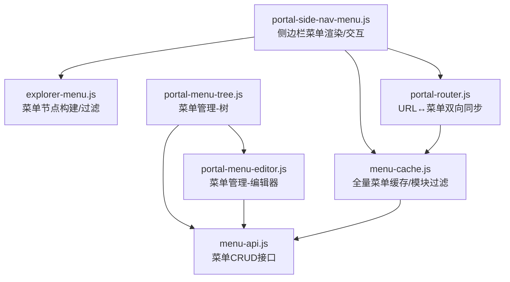
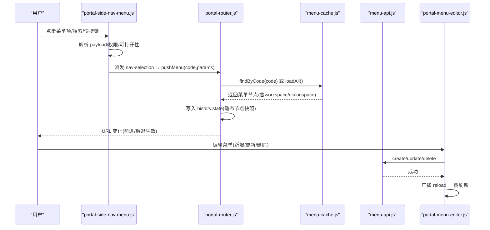
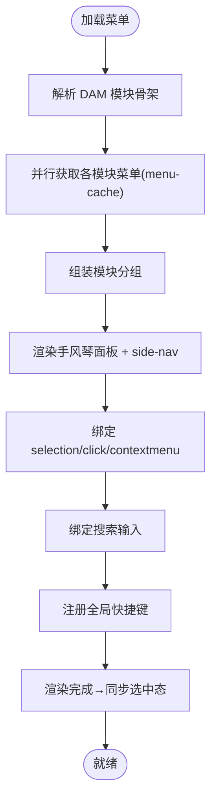
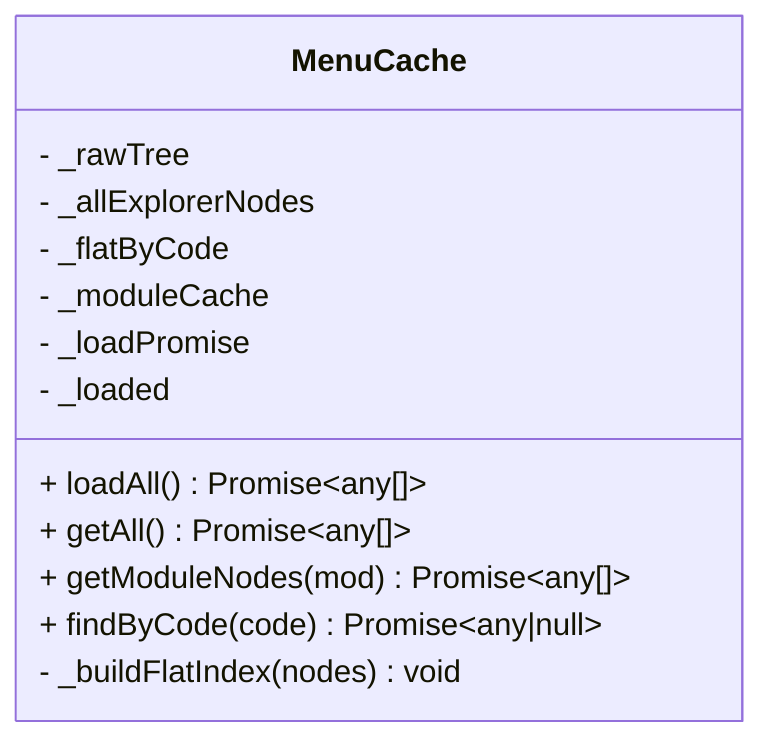
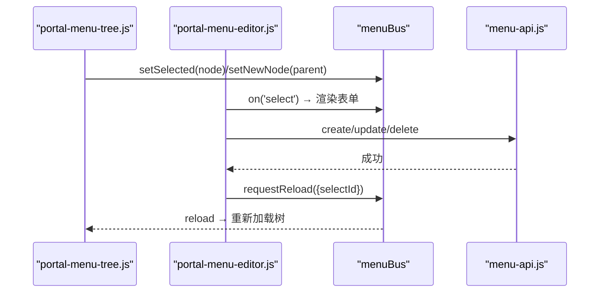
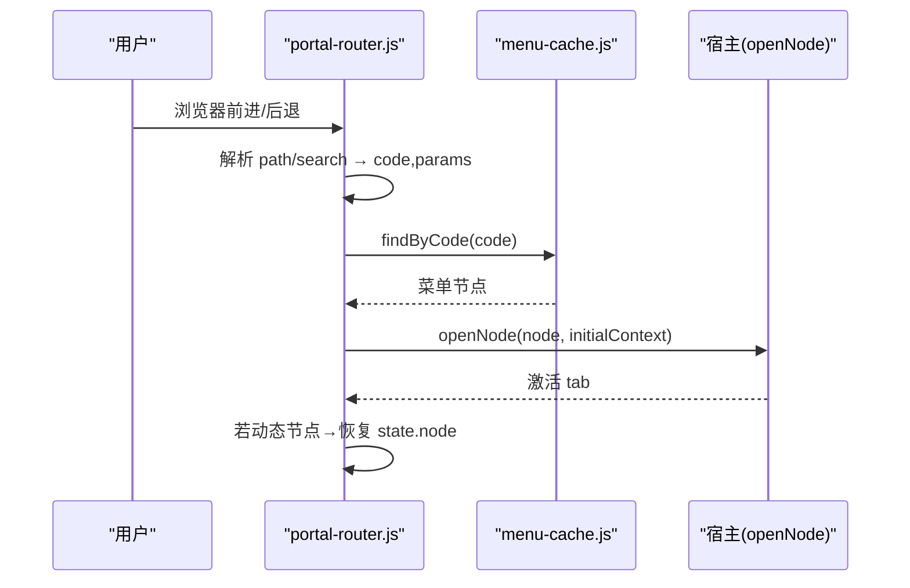
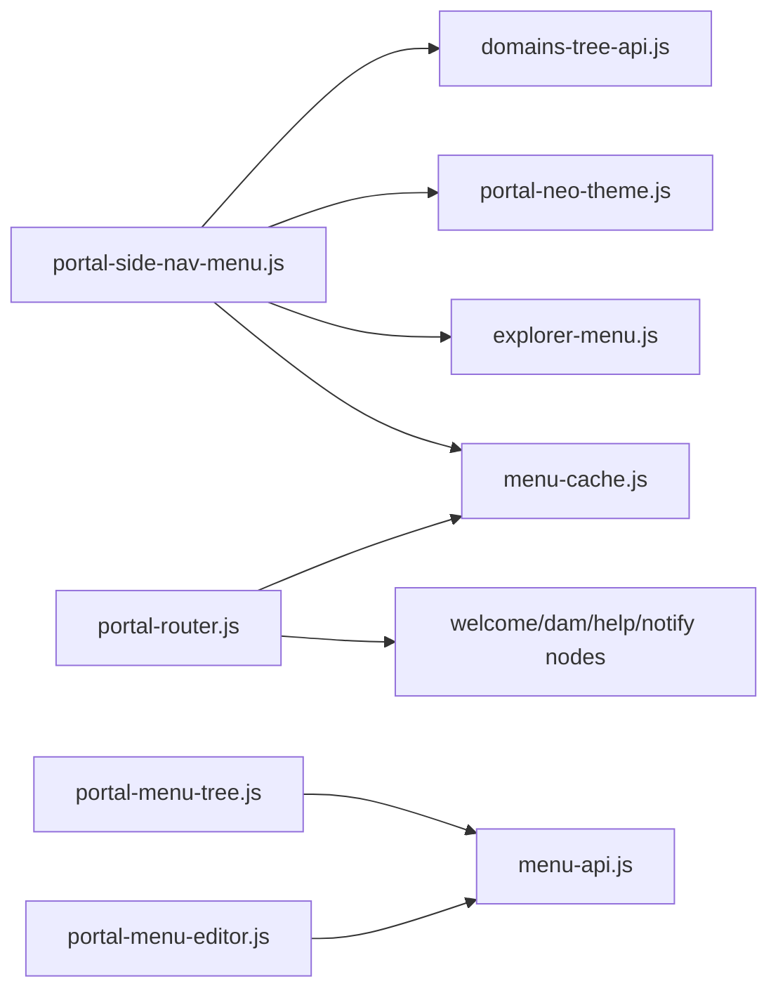

# 菜单导航系统

<cite>
**本文引用的文件**
- [portal-side-nav-menu.js](file://CMXPortalManager/src/components/portal-side-nav-menu.js)
- [portal-menu-tree.js](file://CMXPortalManager/src/components/portal-menu-tree.js)
- [portal-menu-editor.js](file://CMXPortalManager/src/components/portal-menu-editor.js)
- [menu-cache.js](file://CMXPortalManager/src/lib/menu-cache.js)
- [explorer-menu.js](file://CMXPortalManager/src/lib/explorer-menu.js)
- [portal-router.js](file://CMXPortalManager/src/lib/portal-router.js)
- [menu-api.js](file://CMXPortalManager/src/api/menu-api.js)
</cite>

## 目录
1. [简介](#简介)
2. [项目结构](#项目结构)
3. [核心组件](#核心组件)
4. [架构总览](#架构总览)
5. [详细组件分析](#详细组件分析)
6. [依赖关系分析](#依赖关系分析)
7. [性能与大数据优化](#性能与大数据优化)
8. [故障排查指南](#故障排查指南)
9. [结论](#结论)
10. [附录](#附录)

## 简介
本文件系统性地梳理门户管理器中的“菜单导航系统”，覆盖菜单数据结构、树形组织、动态加载、侧边栏渲染与交互、权限控制、缓存策略、路由映射、URL 参数与历史记录管理、菜单编辑器与数据同步、多级展开、搜索过滤、快捷键支持，以及面向大数据量与用户体验的性能优化方案。目标是帮助开发者快速理解并扩展该子系统。

## 项目结构
围绕菜单导航的核心代码集中在 CMXPortalManager 前端：
- 侧边栏菜单渲染与交互：portal-side-nav-menu.js
- 菜单管理（树+编辑器）：portal-menu-tree.js、portal-menu-editor.js
- 菜单数据缓存与转换：menu-cache.js
- 资源管理器菜单构建与过滤：explorer-menu.js
- 路由与 URL 同步：portal-router.js
- 菜单 API 封装：menu-api.js

图表来源
- [portal-side-nav-menu.js:1-697](file://CMXPortalManager/src/components/portal-side-nav-menu.js#L1-L697)
- [explorer-menu.js:1-335](file://CMXPortalManager/src/lib/explorer-menu.js#L1-L335)
- [menu-cache.js:1-274](file://CMXPortalManager/src/lib/menu-cache.js#L1-L274)
- [portal-router.js:1-702](file://CMXPortalManager/src/lib/portal-router.js#L1-L702)
- [portal-menu-tree.js:1-484](file://CMXPortalManager/src/components/portal-menu-tree.js#L1-L484)
- [portal-menu-editor.js:1-547](file://CMXPortalManager/src/components/portal-menu-editor.js#L1-L547)
- [menu-api.js:1-66](file://CMXPortalManager/src/api/menu-api.js#L1-L66)

章节来源
- [portal-side-nav-menu.js:1-697](file://CMXPortalManager/src/components/portal-side-nav-menu.js#L1-L697)
- [portal-menu-tree.js:1-484](file://CMXPortalManager/src/components/portal-menu-tree.js#L1-L484)
- [portal-menu-editor.js:1-547](file://CMXPortalManager/src/components/portal-menu-editor.js#L1-L547)
- [menu-cache.js:1-274](file://CMXPortalManager/src/lib/menu-cache.js#L1-L274)
- [explorer-menu.js:1-335](file://CMXPortalManager/src/lib/explorer-menu.js#L1-L335)
- [portal-router.js:1-702](file://CMXPortalManager/src/lib/portal-router.js#L1-L702)
- [menu-api.js:1-66](file://CMXPortalManager/src/api/menu-api.js#L1-L66)

## 核心组件
- 侧边栏菜单组件：负责从 DAM/菜单树拼装模块分组，渲染 ui5-side-navigation，绑定选择事件、右键上下文菜单、搜索与快捷键。
- 菜单缓存：单例维护全量菜单树，提供按域/应用/模块的本地过滤与 code 索引查找，避免重复请求后端。
- 资源管理器菜单工具：将后端 JSON 转为 ExplorerMenuNode，实现权限过滤、搜索匹配、UI 数据集与 WeakMap 载荷关联。
- 菜单管理界面：左侧树（拖拽换父、搜索、展开/折叠），右侧表单编辑（新增/更新/删除、功能码绑定、可见性、打开方式）。
- 路由器：基于 cmx_menu.code 的确定性路由，history/hash 双模式，URL 与当前激活 tab 双向同步，深链参数传递与历史状态管理。
- API 层：统一封装 /api/menu/* 接口，自动鉴权与信封解包。

章节来源
- [portal-side-nav-menu.js:1-697](file://CMXPortalManager/src/components/portal-side-nav-menu.js#L1-L697)
- [menu-cache.js:1-274](file://CMXPortalManager/src/lib/menu-cache.js#L1-L274)
- [explorer-menu.js:1-335](file://CMXPortalManager/src/lib/explorer-menu.js#L1-L335)
- [portal-menu-tree.js:1-484](file://CMXPortalManager/src/components/portal-menu-tree.js#L1-L484)
- [portal-menu-editor.js:1-547](file://CMXPortalManager/src/components/portal-menu-editor.js#L1-L547)
- [portal-router.js:1-702](file://CMXPortalManager/src/lib/portal-router.js#L1-L702)
- [menu-api.js:1-66](file://CMXPortalManager/src/api/menu-api.js#L1-L66)

## 架构总览
下图展示了菜单导航系统的整体交互：用户操作触发侧边栏事件，经解析后通过路由器更新 URL；菜单数据由缓存统一管理，编辑器变更通过 API 持久化并广播刷新。

图表来源
- [portal-side-nav-menu.js:358-499](file://CMXPortalManager/src/components/portal-side-nav-menu.js#L358-L499)
- [portal-router.js:440-623](file://CMXPortalManager/src/lib/portal-router.js#L440-L623)
- [menu-cache.js:170-241](file://CMXPortalManager/src/lib/menu-cache.js#L170-L241)
- [menu-api.js:38-65](file://CMXPortalManager/src/api/menu-api.js#L38-L65)
- [portal-menu-editor.js:334-409](file://CMXPortalManager/src/components/portal-menu-editor.js#L334-L409)

## 详细组件分析

### 侧边栏菜单（portal-side-nav-menu.js）
- 数据源与分组：优先走 DAM 域-应用-模块树生成模块骨架，再并行从 menu-cache 拉取各模块业务菜单；非 DAM key 走兼容分支（已废弃但保留回退）。
- 渲染流程：将模块文档转换为组，每组一个手风琴面板，内部用 ui5-side-navigation 渲染菜单树；首次默认展开第一个面板。
- 事件绑定：
  - selection-change：解析选中项载荷，仅对可打开叶子节点派发 nav-selection。
  - click 兜底：处理 UI5 深层 item 无法自处理的情况（捕获阶段补齐）。
  - 右键上下文菜单：编辑菜单节点（通过自定义事件冒泡到上层对话框）。
- 搜索与快捷键：
  - 输入框实时过滤菜单树（caption/id/name 子串匹配）。
  - 文档级快捷键 Alt+S 或 / 聚焦搜索框。
- 主题与滚动条：按模块稳定色板应用主题；为侧边栏注入滚动条样式。
- 选中态同步：在菜单渲染完成后通知上层按当前激活 tab 同步侧边栏选中态，解决深链/刷新场景不一致问题。

图表来源
- [portal-side-nav-menu.js:606-697](file://CMXPortalManager/src/components/portal-side-nav-menu.js#L606-L697)
- [portal-side-nav-menu.js:136-201](file://CMXPortalManager/src/components/portal-side-nav-menu.js#L136-L201)
- [portal-side-nav-menu.js:216-307](file://CMXPortalManager/src/components/portal-side-nav-menu.js#L216-L307)
- [portal-side-nav-menu.js:358-499](file://CMXPortalManager/src/components/portal-side-nav-menu.js#L358-L499)

章节来源
- [portal-side-nav-menu.js:1-697](file://CMXPortalManager/src/components/portal-side-nav-menu.js#L1-L697)

### 菜单缓存（menu-cache.js）
- 全量缓存：一次 GET /api/menu/tree，后续所有模块/路由复用同一份内存缓存。
- 数据转换：treeNodesToExplorerNodes 将后端 TreeNode 转为 ExplorerMenuNode，提取 workspace/dialogspace/type/expanded 等富信息，并做 visible=0 的整枝剪除。
- 模块过滤：filterRawTreeByModule 在前端按 domain/application/module 过滤扁平列表，再用 parent_id 重建树，语义等价于后端过滤。
- 索引与查找：_flatByCode 建立 code→节点的扁平索引，供 router 快速定位。
- 失败策略：加载失败时缓存空数组并提示，避免反复打挂掉的后端；未成功标记则允许重试。

图表来源
- [menu-cache.js:148-261](file://CMXPortalManager/src/lib/menu-cache.js#L148-L261)

章节来源
- [menu-cache.js:1-274](file://CMXPortalManager/src/lib/menu-cache.js#L1-L274)

### 资源管理器菜单工具（explorer-menu.js）
- 权限控制：getExplorerMenuPermissionContext 读取全局 __PORTAL_PERMISSION_IDS，filterExplorerMenuTree 递归过滤无权限节点及空子树。
- 搜索匹配：filterExplorerMenuBySearchText 支持 caption/id/name 子串匹配，保留命中节点及其子树。
- 节点构建：parseExplorerMenuResponse 兼容数组或 {items} 根；buildExplorerSideNavigation 递归构建 ui5 菜单项，并为深层嵌套提供点击兜底说明。
- 载荷关联：WeakMap(itemPayload) 将 DOM 元素与原始菜单节点关联，便于 selection-change 时还原 payload。

章节来源
- [explorer-menu.js:1-335](file://CMXPortalManager/src/lib/explorer-menu.js#L1-L335)

### 菜单管理界面（portal-menu-tree.js + portal-menu-editor.js）
- 树组件：
  - 三段式选择器（域/应用/模块）联动加载菜单树。
  - 搜索高亮并强制展开命中路径。
  - 拖拽换父：基于 parent_id 的祖先链检测防止环；根放置区支持提升为根节点。
  - 展开/折叠状态记忆，选中态与总线同步。
- 编辑器组件：
  - 监听总线 select/ctx 渲染表单（新增/编辑/空态）。
  - 字段：编码、名称、图标、排序、可见性、打开方式、父节点、功能码绑定。
  - 功能码选择器：弹窗表格，支持搜索与软过滤，回显名称。
  - CRUD 成功后通过总线请求重载，保持选中与展开状态。

图表来源
- [portal-menu-tree.js:117-260](file://CMXPortalManager/src/components/portal-menu-tree.js#L117-L260)
- [portal-menu-tree.js:279-458](file://CMXPortalManager/src/components/portal-menu-tree.js#L279-L458)
- [portal-menu-editor.js:170-409](file://CMXPortalManager/src/components/portal-menu-editor.js#L170-L409)
- [menu-api.js:38-65](file://CMXPortalManager/src/api/menu-api.js#L38-L65)

章节来源
- [portal-menu-tree.js:1-484](file://CMXPortalManager/src/components/portal-menu-tree.js#L1-L484)
- [portal-menu-editor.js:1-547](file://CMXPortalManager/src/components/portal-menu-editor.js#L1-L547)

### 路由与 URL 同步（portal-router.js）
- 确定性路由：以 cmx_menu.code 作为视图唯一标识，支持 history 与 hash 两种模式。
- URL 设计：view/<code> 带可选 query 参数；内置页面如欢迎页、帮助中心、菜单管理等。
- 双向同步：
  - 菜单点击/Tab 切换 → pushMenu/pushTab 写入 URL。
  - 浏览器前进/后退 → popstate/hashchange → 解析 code 与 params → openNode。
- 动态节点：对不在菜单树的运行时页面（如报表/HTML 页）将节点快照存入 history.state/sessionStorage，F5 后可重建或跳转首页。
- 深链修复：打开前根据菜单所属域/应用切换活动区域，确保侧边栏与选中态一致。

图表来源
- [portal-router.js:248-309](file://CMXPortalManager/src/lib/portal-router.js#L248-L309)
- [portal-router.js:358-431](file://CMXPortalManager/src/lib/portal-router.js#L358-L431)
- [portal-router.js:505-623](file://CMXPortalManager/src/lib/portal-router.js#L505-L623)

章节来源
- [portal-router.js:1-702](file://CMXPortalManager/src/lib/portal-router.js#L1-L702)

## 依赖关系分析
- portal-side-nav-menu.js 依赖 explorer-menu.js（构建/过滤）、menu-cache.js（模块菜单）、portal-neo-theme.js（滚动条/主题）、domains-tree-api.js（DAM 树）。
- portal-menu-tree.js 与 portal-menu-editor.js 通过 menuBus 通信，共同依赖 menu-api.js。
- portal-router.js 依赖 menu-cache.js 进行菜单查找，依赖 welcome/dam/help/notify 等内置节点工厂。
- menu-cache.js 直接调用 /api/menu/tree，并在失败时提示。

图表来源
- [portal-side-nav-menu.js:1-30](file://CMXPortalManager/src/components/portal-side-nav-menu.js#L1-L30)
- [portal-menu-tree.js:11-15](file://CMXPortalManager/src/components/portal-menu-tree.js#L11-L15)
- [portal-menu-editor.js:16-21](file://CMXPortalManager/src/components/portal-menu-editor.js#L16-L21)
- [portal-router.js:37-43](file://CMXPortalManager/src/lib/portal-router.js#L37-L43)
- [menu-cache.js:170-205](file://CMXPortalManager/src/lib/menu-cache.js#L170-L205)

章节来源
- [portal-side-nav-menu.js:1-697](file://CMXPortalManager/src/components/portal-side-nav-menu.js#L1-L697)
- [portal-menu-tree.js:1-484](file://CMXPortalManager/src/components/portal-menu-tree.js#L1-L484)
- [portal-menu-editor.js:1-547](file://CMXPortalManager/src/components/portal-menu-editor.js#L1-L547)
- [portal-router.js:1-702](file://CMXPortalManager/src/lib/portal-router.js#L1-L702)
- [menu-cache.js:1-274](file://CMXPortalManager/src/lib/menu-cache.js#L1-L274)

## 性能与大数据优化
- 全量缓存与模块过滤：一次性拉取 /api/menu/tree，后续按模块本地过滤并重建树，减少网络开销。
- 懒加载与去抖：搜索输入即时过滤，仅在必要时重绘；侧边栏渲染批量替换子节点。
- 事件防重派：selection-change 与 click 兜底通过微任务令牌避免重复派发 nav-selection。
- 深层菜单点击补偿：捕获阶段 click 处理 UI5 深层 item 无法自处理的问题，保证交互一致性。
- 动态节点快照：对不在菜单树的页面使用 sessionStorage/history.state 保存节点快照，避免重复构造与丢失上下文。
- 错误降级：菜单加载失败时缓存空数组并提示，避免雪崩；模块级失败单独提示，不影响其他模块。

[本节为通用指导，不直接分析具体文件]

## 故障排查指南
- 菜单为空或加载失败：检查 /api/menu/tree 响应与网络状态；确认 menu-cache 是否进入失败分支并显示 toast。
- 侧边栏选中态不一致：确认是否在菜单渲染完成后触发了选中态同步；检查当前激活 tab 的 code 是否与菜单项 data-menu-id 一致。
- 深层菜单点击无效：确认是否命中捕获阶段 click 兜底逻辑；检查 item 是否有 sideNavigation 引用。
- 搜索无结果：确认搜索匹配规则（caption/id/name 子串）；检查权限过滤是否隐藏了命中节点。
- 路由深链 404：确认 code 是否存在且可见；若是动态页刷新，会跳转首页；否则显示“页面不存在”占位页。
- 编辑器功能码为空：确认 iam-api.listMenuPermissions 是否返回数据；检查 DAM 上下文是否正确。

章节来源
- [menu-cache.js:170-205](file://CMXPortalManager/src/lib/menu-cache.js#L170-L205)
- [portal-side-nav-menu.js:358-499](file://CMXPortalManager/src/components/portal-side-nav-menu.js#L358-L499)
- [portal-router.js:563-688](file://CMXPortalManager/src/lib/portal-router.js#L563-L688)
- [portal-menu-editor.js:313-320](file://CMXPortalManager/src/components/portal-menu-editor.js#L313-L320)

## 结论
该菜单导航系统通过“全量缓存+前端过滤”、“确定性路由+双向同步”、“侧边栏事件标准化派发”、“编辑器与树的双向联动”实现了高性能、可扩展、易维护的企业级菜单体系。其权限控制、搜索过滤、快捷键、动态节点快照与错误降级机制，保障了复杂场景下的稳定性与用户体验。未来可在以下方面继续优化：
- 进一步细化模块级增量更新（diff 合并）以减少重绘。
- 引入虚拟滚动应对超大规模菜单树。
- 增强国际化与无障碍支持（ARIA 属性完善）。
- 提供更丰富的菜单行为配置（如预加载、延迟渲染）。

[本节为总结，不直接分析具体文件]

## 附录
- 关键数据模型
  - ExplorerMenuNode：id/name/caption/permissionId/icon/children/workspace/dialogspace/type/expanded 等。
  - TreeNode<MenuTreeNodeData>：后端返回的树节点，包含 data.parent_id/domain_code/application_code/module_code/visible 等。
- 主要 API
  - GET /api/menu/tree：按域/应用/模块加载菜单树。
  - POST /api/menu/create/update/delete：菜单节点增删改。
- 快捷键
  - Alt+S 或 /：聚焦菜单搜索框。
- 路由模式
  - history：/view/<code>（需后端 SPA fallback）。
  - hash：#/view/<code>（纯静态托管可用）。

章节来源
- [explorer-menu.js:22-154](file://CMXPortalManager/src/lib/explorer-menu.js#L22-L154)
- [menu-cache.js:36-137](file://CMXPortalManager/src/lib/menu-cache.js#L36-L137)
- [menu-api.js:38-65](file://CMXPortalManager/src/api/menu-api.js#L38-L65)
- [portal-side-nav-menu.js:216-255](file://CMXPortalManager/src/components/portal-side-nav-menu.js#L216-L255)
- [portal-router.js:15-35](file://CMXPortalManager/src/lib/portal-router.js#L15-L35)