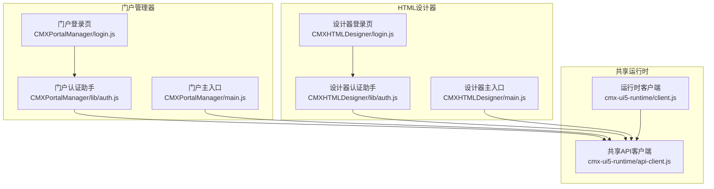
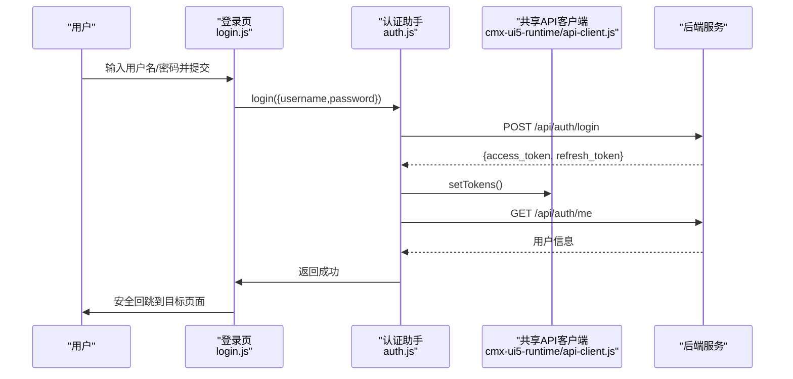
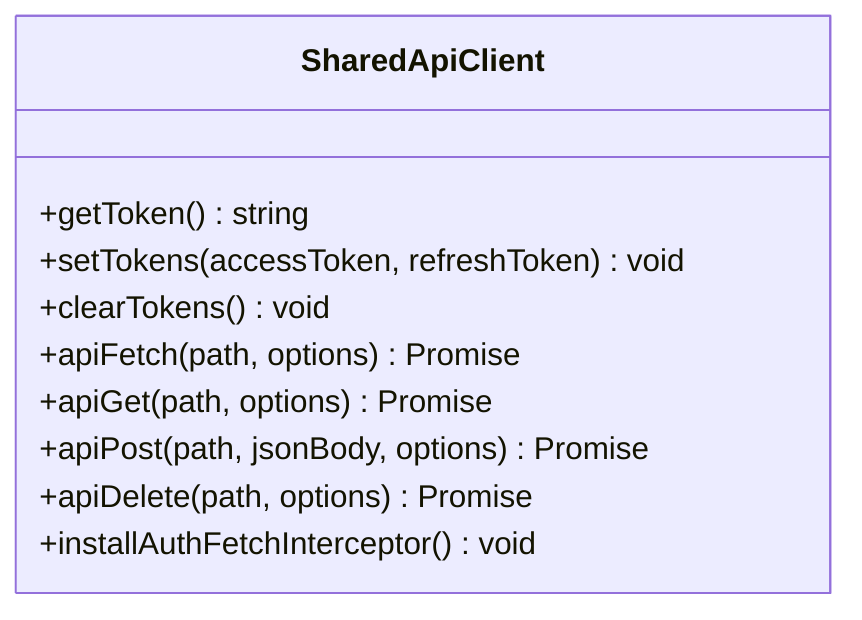
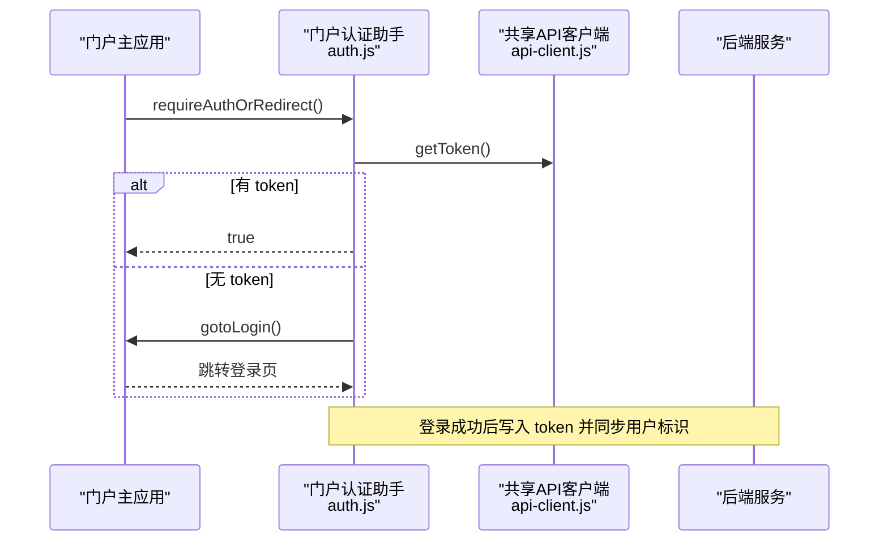
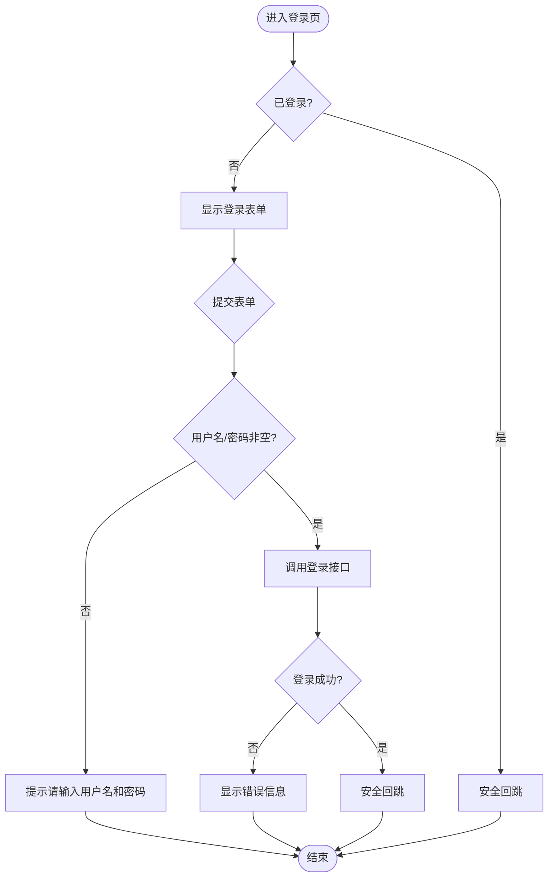
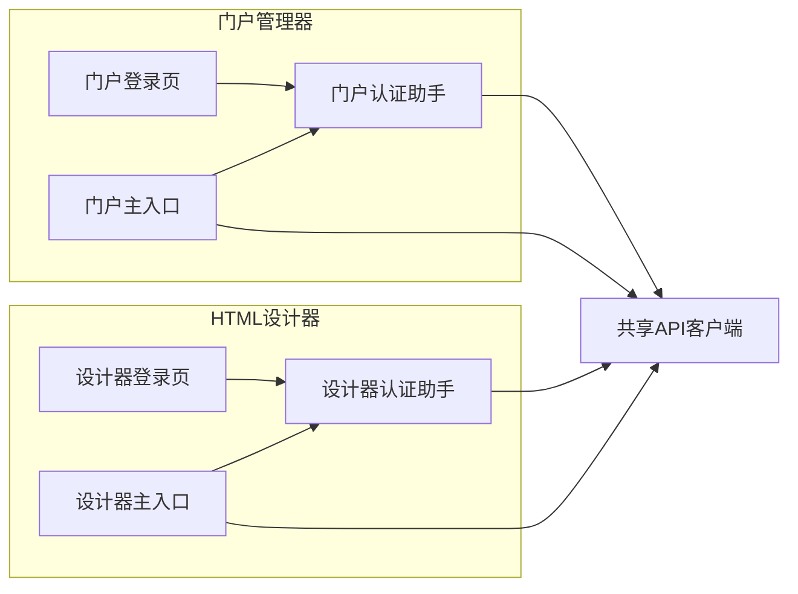

# 认证授权系统

<cite>
**本文引用的文件**
- [packages/cmx-ui5-runtime/src/api-client.js](file://packages/cmx-ui5-runtime/src/api-client.js)
- [CMXPortalManager/src/login.js](file://CMXPortalManager/src/login.js)
- [CMXPortalManager/src/lib/auth.js](file://CMXPortalManager/src/lib/auth.js)
- [CMXPortalManager/src/main.js](file://CMXPortalManager/src/main.js)
- [CMXHTMLDesigner/src/login.js](file://CMXHTMLDesigner/src/login.js)
- [CMXHTMLDesigner/src/lib/auth.js](file://CMXHTMLDesigner/src/lib/auth.js)
- [CMXHTMLDesigner/src/main.js](file://CMXHTMLDesigner/src/main.js)
- [packages/cmx-ui5-runtime/src/client.js](file://packages/cmx-ui5-runtime/src/client.js)
</cite>

## 更新摘要
**变更内容**
- 移除了 CMXHTMLDesigner 中的本地 api-client.js 重复实现（244行代码）
- 所有认证相关的HTTP请求现在统一通过 cmx-ui5-runtime/api-client 处理
- 更新了架构总览图以反映共享API客户端的新结构
- 增强了API客户端封装章节，详细说明共享实现的优势

## 目录
1. [简介](#简介)
2. [项目结构](#项目结构)
3. [核心组件](#核心组件)
4. [架构总览](#架构总览)
5. [详细组件分析](#详细组件分析)
6. [依赖关系分析](#依赖关系分析)
7. [性能考虑](#性能考虑)
8. [故障排查指南](#故障排查指南)
9. [结论](#结论)
10. [附录](#附录)

## 简介
本文件面向门户管理器的认证与授权子系统，系统化说明用户身份验证流程、会话管理、权限控制模型、登录页面实现、API 客户端封装、HTTP 请求拦截器与错误处理策略，以及菜单权限控制、页面访问控制、认证状态管理、令牌刷新机制与安全最佳实践。同时给出第三方认证集成、单点登录支持与审计日志记录的落地建议，并提供常见问题的排查方法与加固建议。

**更新** 认证系统现已采用统一的共享API客户端实现，消除了CMXHTMLDesigner中的重复代码，提升了代码复用性和维护性。

## 项目结构
认证授权相关的前端代码集中在两个子工程中，通过共享的cmx-ui5-runtime包实现统一：
- 共享API客户端：位于 packages/cmx-ui5-runtime/src/api-client.js，提供统一的网络层能力
- 门户管理器：CMXPortalManager 使用共享API客户端进行认证和授权
- HTML设计器：CMXHTMLDesigner 同样使用共享API客户端，移除了本地重复实现

**图表来源**
- [packages/cmx-ui5-runtime/src/api-client.js:1-264](file://packages/cmx-ui5-runtime/src/api-client.js#L1-L264)
- [packages/cmx-ui5-runtime/src/client.js:1-41](file://packages/cmx-ui5-runtime/src/client.js#L1-L41)
- [CMXPortalManager/src/lib/auth.js:1-121](file://CMXPortalManager/src/lib/auth.js#L1-L121)
- [CMXHTMLDesigner/src/lib/auth.js:1-100](file://CMXHTMLDesigner/src/lib/auth.js#L1-L100)

**章节来源**
- [packages/cmx-ui5-runtime/src/api-client.js:1-264](file://packages/cmx-ui5-runtime/src/api-client.js#L1-L264)
- [CMXPortalManager/src/lib/auth.js:1-121](file://CMXPortalManager/src/lib/auth.js#L1-L121)
- [CMXHTMLDesigner/src/lib/auth.js:1-100](file://CMXHTMLDesigner/src/lib/auth.js#L1-L100)

## 核心组件
- **共享API客户端**：位于cmx-ui5-runtime包中，提供统一的请求封装、自动注入令牌、信封解析、401处理、全局fetch拦截器
- **门户认证助手**：对接 /api/auth/*，完成登录、登出、获取当前用户、判断是否已登录、跳转登录
- **设计器认证助手**：与门户认证助手功能相同，但使用共享API客户端
- **登录页面**：负责表单输入校验、安全回跳、调用认证接口
- **运行时客户端**：确保UI5运行时的正确加载和初始化

**更新** 所有认证相关的HTTP请求现在都通过统一的cmx-ui5-runtime/api-client处理，消除了代码重复。

**章节来源**
- [packages/cmx-ui5-runtime/src/api-client.js:1-264](file://packages/cmx-ui5-runtime/src/api-client.js#L1-L264)
- [CMXPortalManager/src/lib/auth.js:1-121](file://CMXPortalManager/src/lib/auth.js#L1-L121)
- [CMXHTMLDesigner/src/lib/auth.js:1-100](file://CMXHTMLDesigner/src/lib/auth.js#L1-L100)
- [packages/cmx-ui5-runtime/src/client.js:1-41](file://packages/cmx-ui5-runtime/src/client.js#L1-L41)

## 架构总览
前端认证授权由"共享API客户端 + 应用认证助手 + 登录页面"三部分构成，形成清晰的职责边界与数据流：
- 共享API客户端提供统一的网络层能力，被门户和管理器共同使用
- 各应用的认证助手专注于业务逻辑，不关心底层网络实现
- 登录页面仅负责UI交互和安全回跳

**图表来源**
- [CMXPortalManager/src/login.js:1-47](file://CMXPortalManager/src/login.js#L1-L47)
- [CMXHTMLDesigner/src/login.js:1-47](file://CMXHTMLDesigner/src/login.js#L1-L47)
- [packages/cmx-ui5-runtime/src/api-client.js:1-264](file://packages/cmx-ui5-runtime/src/api-client.js#L1-L264)

## 详细组件分析

### 共享API客户端封装与HTTP请求拦截器
**更新** 认证系统现在使用共享的API客户端实现，该客户端位于 packages/cmx-ui5-runtime/src/api-client.js，为所有应用提供统一的网络层能力。

- **统一请求封装**：自动注入 Accept、Content-Type、Authorization 头
- **信封解析**：后端统一返回 {code,msg,data}，成功返回 data，失败抛错
- **401 处理**：清除本地 token 并跳转登录页
- **兼容裸错误**：过渡期支持 {error} 格式
- **全局 fetch 拦截器**：为所有同源 /api/* 请求自动注入 Authorization，并在 401 时清 token 并跳转；对 /api/auth/* 不强制加 token；对 JSON 响应透明拆信封，业务错误映射为非 2xx 并保留结构化数据

**图表来源**
- [packages/cmx-ui5-runtime/src/api-client.js:1-264](file://packages/cmx-ui5-runtime/src/api-client.js#L1-L264)

**章节来源**
- [packages/cmx-ui5-runtime/src/api-client.js:1-264](file://packages/cmx-ui5-runtime/src/api-client.js#L1-L264)

### 门户管理器认证流程
- **登录**：POST /api/auth/login，成功后写入 access_token 与 refresh_token，并同步当前用户标识到 localStorage
- **登出**：POST /api/auth/logout（携带 token），随后清理本地 token 与用户标识
- **当前用户**：GET /api/auth/me，未登录或 401 时返回 null
- **登录态判断**：基于本地是否存在 token；失效由 401 拦截处理
- **跳转登录**：带 redirect 参数，防止循环跳转

**图表来源**
- [CMXPortalManager/src/lib/auth.js:1-121](file://CMXPortalManager/src/lib/auth.js#L1-L121)
- [packages/cmx-ui5-runtime/src/api-client.js:1-264](file://packages/cmx-ui5-runtime/src/api-client.js#L1-L264)

**章节来源**
- [CMXPortalManager/src/lib/auth.js:1-121](file://CMXPortalManager/src/lib/auth.js#L1-L121)
- [packages/cmx-ui5-runtime/src/api-client.js:1-264](file://packages/cmx-ui5-runtime/src/api-client.js#L1-L264)

### HTML设计器认证流程
**更新** HTML设计器现在也使用共享API客户端，移除了本地的重复实现。

- **登录**：POST /api/auth/login，成功后写入 access_token 与 refresh_token
- **登出**：POST /api/auth/logout（携带 token），随后清理本地 token
- **当前用户**：GET /api/auth/me，未登录或 401 时返回 null
- **登录态判断**：基于本地是否存在 token；失效由 401 拦截处理
- **跳转登录**：带 redirect 参数，防止循环跳转

**章节来源**
- [CMXHTMLDesigner/src/lib/auth.js:1-100](file://CMXHTMLDesigner/src/lib/auth.js#L1-L100)
- [packages/cmx-ui5-runtime/src/api-client.js:1-264](file://packages/cmx-ui5-runtime/src/api-client.js#L1-L264)

### 登录页面实现与表单验证
- **表单提交前**：进行非空校验，禁用按钮并显示"登录中…"
- **成功后**：调用认证助手的登录方法，再执行安全回跳
- **安全回跳规则**：仅允许以单个 "/" 开头的站内绝对路径，拒绝 "//host" 或 http(s)://；若无效则回到应用 base
- **已登录用户**：直接回跳，避免重复登录

**图表来源**
- [CMXPortalManager/src/login.js:1-47](file://CMXPortalManager/src/login.js#L1-L47)
- [CMXHTMLDesigner/src/login.js:1-47](file://CMXHTMLDesigner/src/login.js#L1-L47)

**章节来源**
- [CMXPortalManager/src/login.js:1-47](file://CMXPortalManager/src/login.js#L1-L47)
- [CMXHTMLDesigner/src/login.js:1-47](file://CMXHTMLDesigner/src/login.js#L1-L47)

### 认证状态管理与令牌刷新机制
- **认证状态**：基于本地存储的 access_token 判断是否已登录；refresh_token 可用于服务端刷新
- **刷新策略**：当前实现未内置自动刷新逻辑；可在 apiFetch 或全局拦截器中扩展：当收到 401 时尝试使用 refresh_token 调用刷新接口，成功后重试原请求
- **安全建议**：将 refresh_token 置于更安全的存储（如 HttpOnly Cookie），避免 XSS 窃取；刷新接口应限制频率与设备指纹校验

**章节来源**
- [packages/cmx-ui5-runtime/src/api-client.js:1-264](file://packages/cmx-ui5-runtime/src/api-client.js#L1-L264)
- [CMXPortalManager/src/lib/auth.js:1-121](file://CMXPortalManager/src/lib/auth.js#L1-L121)

### 第三方认证集成与单点登录支持
- **集成方式**：在登录页或认证助手接入第三方 OIDC/SAML 回调，完成后调用 setTokens 写入令牌
- **单点登录**：利用浏览器同源策略与共享存储，确保多标签页共享登录态；必要时结合后端 session/cookie 实现跨域 SSO
- **回跳安全**：严格校验 redirect 参数，仅允许站内路径，防止开放重定向漏洞

**章节来源**
- [CMXPortalManager/src/login.js:1-47](file://CMXPortalManager/src/login.js#L1-L47)
- [CMXHTMLDesigner/src/login.js:1-47](file://CMXHTMLDesigner/src/login.js#L1-L47)
- [packages/cmx-ui5-runtime/src/api-client.js:1-264](file://packages/cmx-ui5-runtime/src/api-client.js#L1-L264)

### 审计日志记录
- **建议在认证助手与 API 客户端中记录关键事件**：登录成功/失败、登出、401 触发、菜单权限过滤结果
- **日志内容**：时间戳、用户标识、操作类型、IP/UA、结果与错误信息（脱敏）
- **传输方式**：可选上报至后端审计接口或本地持久化，便于问题追踪与安全分析

## 依赖关系分析
**更新** 依赖关系已简化，两个应用现在都依赖共享的cmx-ui5-runtime包。

- 登录页依赖各自应用的认证助手进行登录与回跳
- 认证助手依赖共享API客户端进行令牌存取与网络请求
- 两个应用的主入口都安装全局fetch拦截器

**图表来源**
- [CMXPortalManager/src/lib/auth.js:1-121](file://CMXPortalManager/src/lib/auth.js#L1-L121)
- [CMXHTMLDesigner/src/lib/auth.js:1-100](file://CMXHTMLDesigner/src/lib/auth.js#L1-L100)
- [packages/cmx-ui5-runtime/src/api-client.js:1-264](file://packages/cmx-ui5-runtime/src/api-client.js#L1-L264)

**章节来源**
- [CMXPortalManager/src/lib/auth.js:1-121](file://CMXPortalManager/src/lib/auth.js#L1-L121)
- [CMXHTMLDesigner/src/lib/auth.js:1-100](file://CMXHTMLDesigner/src/lib/auth.js#L1-L100)
- [packages/cmx-ui5-runtime/src/api-client.js:1-264](file://packages/cmx-ui5-runtime/src/api-client.js#L1-L264)

## 性能考虑
- **代码复用**：共享API客户端消除了244行重复代码，减少了维护成本
- **缓存策略**：token存储在localStorage中，避免重复认证
- **请求优化**：全局fetch拦截器确保所有/api/*请求都携带正确的认证信息
- **错误降级**：认证失败时提供友好的错误处理和回退机制

## 故障排查指南
- **401 风暴**：检查 redirect 参数是否被重复编码导致 URL 过长；确认拦截器仅在 /api/* 生效且排除 /api/auth/*
- **白屏问题**：确认 BASE_URL 正确拼接登录页路径，避免硬编码 /login 导致 404
- **登录失败**：查看后端返回信封 msg 与 code；确认用户名/密码校验与设备信息传递
- **共享客户端问题**：检查cmx-ui5-runtime包的版本兼容性，确保两个应用使用相同的API客户端版本

**章节来源**
- [packages/cmx-ui5-runtime/src/api-client.js:1-264](file://packages/cmx-ui5-runtime/src/api-client.js#L1-L264)
- [CMXPortalManager/src/lib/auth.js:1-121](file://CMXPortalManager/src/lib/auth.js#L1-L121)
- [CMXHTMLDesigner/src/lib/auth.js:1-100](file://CMXHTMLDesigner/src/lib/auth.js#L1-L100)

## 结论
该认证授权系统通过引入共享的cmx-ui5-runtime/api-client，实现了更好的代码复用和维护性。移除了CMXHTMLDesigner中的本地重复实现，使两个应用都能享受到统一的网络层能力。新的架构提供了清晰的职责划分、可靠的会话管理和灵活的权限控制。建议在生产环境中补充令牌自动刷新、审计日志与更严格的存储策略，以进一步增强安全性与可观测性。

## 附录
- **安全最佳实践**
  - 使用 HttpOnly Cookie 存储敏感令牌，避免 XSS
  - 严格校验 redirect 参数，仅允许站内路径
  - 限制刷新接口频率与设备指纹校验
  - 记录并上报认证相关审计日志
- **常见问题**
  - 401 循环跳转：检查拦截器与 redirect 编码
  - 登录失败：查看后端信封消息与前端校验逻辑
  - 共享客户端冲突：确保两个应用使用兼容的cmx-ui5-runtime版本