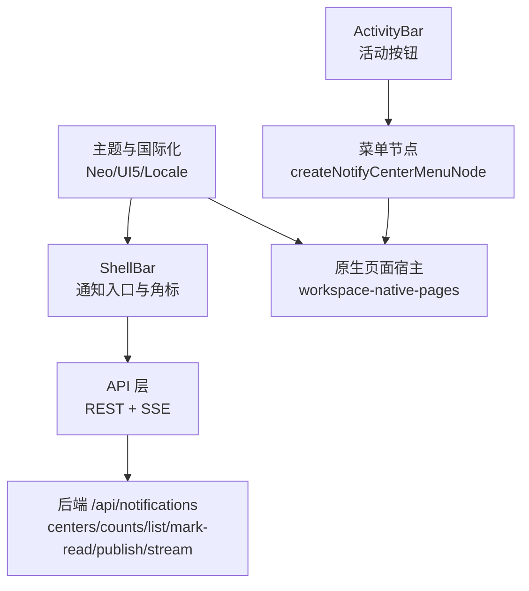
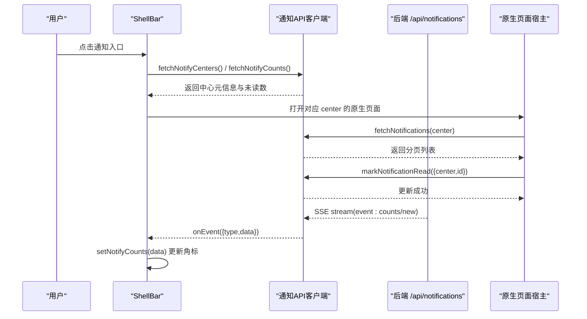
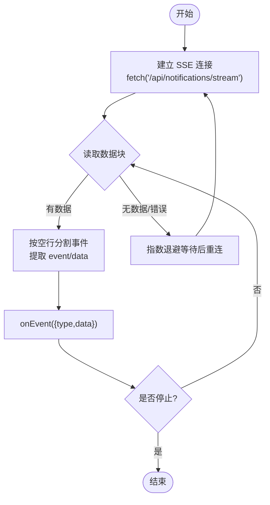
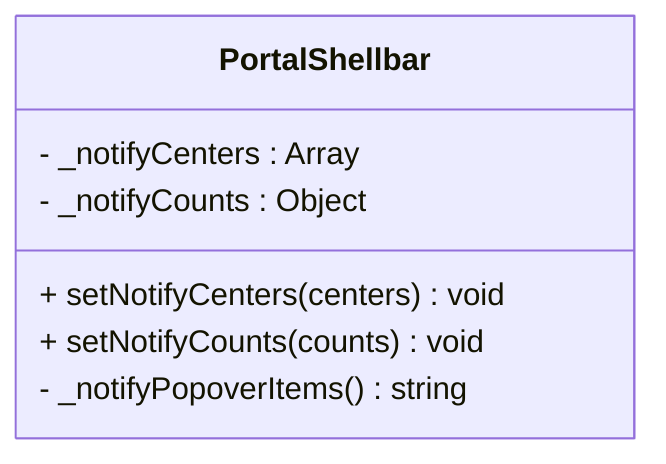
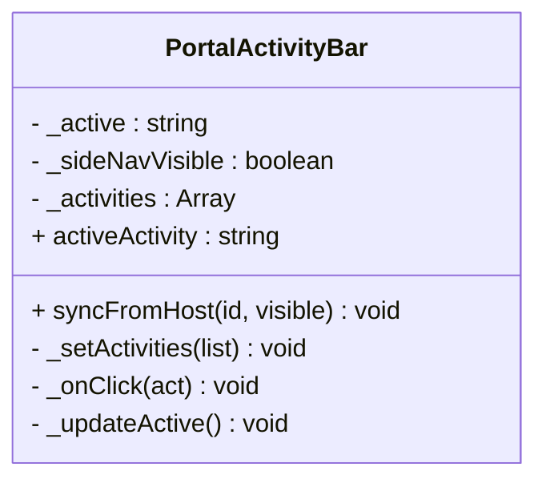
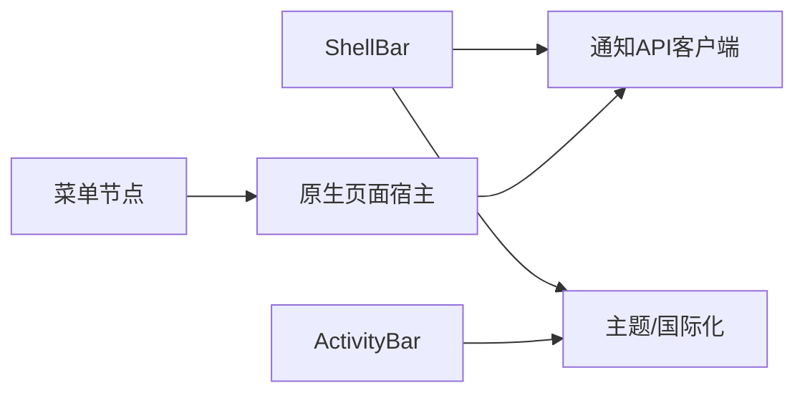

# 通知中心

<cite>
**本文引用的文件**
- [notifications-api.js](file://CMXPortalManager/src/api/notififications-api.js)
- [portal-shellbar.js](file://CMXPortalManager/src/components/portal-shellbar.js)
- [portal-activity-bar.js](file://CMXPortalManager/src/components/portal-activity-bar.js)
- [notify-center-menu-node.js](file://CMXPortalManager/src/lib/notify-center-menu-node.js)
- [portal-neo-theme.js](file://CMXPortalManager/src/lib/portal-neo-theme.js)
- [portal-ui5-locale.js](file://CMXPortalManager/src/lib/portal-ui5-locale.js)
- [portal-module-theme-core.js](file://CMXPortalManager/src/lib/portal-module-theme-core.js)
- [portal-module-theme.js](file://CMXPortalManager/src/lib/portal-module-theme.js)
- [sse-client.js](file://CMXPortalManager/src/ai-workbench/services/sse-client.js)
- [workspace-native-pages.js](file://CMXPortalManager/src/lib/workspace-native-pages.js)
- [20260826_cmx-portal_通知中心数据库化与群发改造方案.md](file://documents/plans/20260826_cmx-portal_通知中心数据库化与群发改造方案.md)
</cite>

## 目录
1. [简介](#简介)
2. [项目结构](#项目结构)
3. [核心组件](#核心组件)
4. [架构总览](#架构总览)
5. [详细组件分析](#详细组件分析)
6. [依赖关系分析](#依赖关系分析)
7. [性能考虑](#性能考虑)
8. [故障排查指南](#故障排查指南)
9. [结论](#结论)
10. [附录](#附录)

## 简介
本文件为门户管理器“通知中心”的完整技术文档，覆盖以下主题：
- 通知消息类型、格式与处理流程
- 活动栏组件实现、通知图标显示与未读计数管理
- 实时通知接收、SSE 连接管理与消息推送机制
- 通知分类、优先级排序与批量处理
- 通知设置配置、用户偏好保存与通知历史查询
- 通知模板定制、样式主题适配与多语言支持
- 通知性能优化、消息去重与存储策略

## 项目结构
通知中心在前端由多个协作模块构成：
- API 层：统一封装 REST 接口与 SSE 订阅（获取中心元信息、未读数、列表、标记已读、发布、流式事件）
- 壳顶栏：展示三中心入口、角标与下拉项
- 活动栏：承载业务活动按钮（与通知中心菜单联动）
- 菜单节点：按中心打开原生页面（任务/消息/日志）
- 主题与国际化：Neo 主题变量、UI5 语言切换、模块面板主题应用
- 原生页面宿主：承载并渲染通知中心页面脚本

图表来源
- [portal-shellbar.js:160-182](file://CMXPortalManager/src/components/portal-shellbar.js#L160-L182)
- [notifications-api.js:20-88](file://CMXPortalManager/src/api/notififications-api.js#L20-L88)
- [notify-center-menu-node.js:1-39](file://CMXPortalManager/src/lib/notify-center-menu-node.js#L1-L39)
- [workspace-native-pages.js:225-365](file://CMXPortalManager/src/lib/workspace-native-pages.js#L225-L365)

章节来源
- [portal-shellbar.js:160-182](file://CMXPortalManager/src/components/portal-shellbar.js#L160-L182)
- [notifications-api.js:20-88](file://CMXPortalManager/src/api/notififications-api.js#L20-L88)
- [notify-center-menu-node.js:1-39](file://CMXPortalManager/src/lib/notify-center-menu-node.js#L1-L39)
- [workspace-native-pages.js:225-365](file://CMXPortalManager/src/lib/workspace-native-pages.js#L225-L365)

## 核心组件
- 通知 API 客户端：提供 centers/counts/list/mark-read/publish 以及 SSE 订阅能力，负责错误处理与自动重连。
- ShellBar 通知区：维护三中心元信息与未读数，驱动顶部角标与下拉项角标。
- ActivityBar：活动按钮容器，点击触发 activity-change 事件，用于侧边导航切换。
- 通知中心菜单节点：将 task/message/log 三个中心映射为可打开的原生页面视图。
- 主题与国际化：通过 Neo 主题变量与 UI5 语言切换，确保通知界面在多主题/多语言下表现一致。
- 原生页面宿主：加载并执行通知中心页面脚本，隔离运行环境并提供错误重试。

章节来源
- [notifications-api.js:1-117](file://CMXPortalManager/src/api/notififications-api.js#L1-L117)
- [portal-shellbar.js:160-182](file://CMXPortalManager/src/components/portal-shellbar.js#L160-L182)
- [portal-activity-bar.js:1-142](file://CMXPortalManager/src/components/portal-activity-bar.js#L1-L142)
- [notify-center-menu-node.js:1-39](file://CMXPortalManager/src/lib/notify-center-menu-node.js#L1-L39)
- [portal-neo-theme.js:1-200](file://CMXPortalManager/src/lib/portal-neo-theme.js#L1-L200)
- [portal-ui5-locale.js:45-87](file://CMXPortalManager/src/lib/portal-ui5-locale.js#L45-L87)
- [workspace-native-pages.js:225-365](file://CMXPortalManager/src/lib/workspace-native-pages.js#L225-L365)

## 架构总览
通知中心采用“前端组件 + API 客户端 + 后端服务”的分层架构：
- 前端组件：ShellBar 暴露通知入口；ActivityBar 承载活动；菜单节点生成工作区视图；原生页面宿主承载具体页面逻辑。
- API 客户端：统一封装 REST 与 SSE，屏蔽鉴权头注入、错误处理与重连细节。
- 后端服务：提供 centers/counts/list/mark-read/publish/stream 等接口，使用数据库持久化、聚合与广播。

图表来源
- [portal-shellbar.js:160-182](file://CMXPortalManager/src/components/portal-shellbar.js#L160-L182)
- [notifications-api.js:20-117](file://CMXPortalManager/src/api/notififications-api.js#L20-L117)
- [workspace-native-pages.js:225-365](file://CMXPortalManager/src/lib/workspace-native-pages.js#L225-L365)

## 详细组件分析

### 通知 API 客户端（REST + SSE）
- REST 接口
  - centers：获取三中心元信息（id/label/icon），供 ShellBar 渲染下拉项。
  - counts：获取各中心未读数与总数，驱动 ShellBar 角标。
  - list：按 center 分页拉取通知列表。
  - mark-read：单条或全部标记已读。
  - publish：服务端发布通知（用于系统/第三方服务调用）。
- SSE 订阅
  - 使用 fetch + ReadableStream 读取 text/event-stream，解析 event/data 字段。
  - 指数退避自动重连，最长间隔 15s；支持 stop() 主动断开。
  - 事件类型包含 counts（刷新角标）、new（新通知）等。

图表来源
- [notifications-api.js:50-117](file://CMXPortalManager/src/api/notififications-api.js#L50-L117)

章节来源
- [notifications-api.js:1-117](file://CMXPortalManager/src/api/notififications-api.js#L1-L117)

### ShellBar 通知区（图标与计数）
- 三中心元信息：通过 setNotifyCenters 注入，渲染下拉项（任务/消息/日志）。
- 未读计数：setNotifyCounts 计算 total，设置 ui5-shellbar 的 notifications-count 属性，并在下拉项中显示角标（超过 99 显示 99+）。
- 交互：点击下拉项可跳转到对应中心页面。

图表来源
- [portal-shellbar.js:160-182](file://CMXPortalManager/src/components/portal-shellbar.js#L160-L182)
- [portal-shellbar.js:148-159](file://CMXPortalManager/src/components/portal-shellbar.js#L148-L159)

章节来源
- [portal-shellbar.js:148-182](file://CMXPortalManager/src/components/portal-shellbar.js#L148-L182)

### 活动栏组件（ActivityBar）
- 职责：渲染活动按钮组，维护当前激活项，切换侧边可见性。
- 事件：点击时派发 activity-change，携带 id、visible、label、sideNav。
- 样式：基于 Neo 主题变量，高亮激活项与悬停效果。

图表来源
- [portal-activity-bar.js:1-142](file://CMXPortalManager/src/components/portal-activity-bar.js#L1-L142)
- [portal-neo-theme.js:166-188](file://CMXPortalManager/src/lib/portal-neo-theme.js#L166-L188)

章节来源
- [portal-activity-bar.js:1-142](file://CMXPortalManager/src/components/portal-activity-bar.js#L1-L142)
- [portal-neo-theme.js:166-188](file://CMXPortalManager/src/lib/portal-neo-theme.js#L166-L188)

### 通知中心菜单节点
- 将 task/message/log 三种中心映射为工作区视图，使用同一 native_page（portal.notify.center），通过 props.center 区分。
- tabId 包含 center，使三中心各自独立标签页。

章节来源
- [notify-center-menu-node.js:1-39](file://CMXPortalManager/src/lib/notify-center-menu-node.js#L1-L39)

### 原生页面宿主（通知列表页）
- 负责加载并执行原生页面脚本，隔离运行环境。
- 错误处理：脚本异常时以占位提示，并提供重试按钮。
- 与通知中心配合：根据 props.center 拉取列表、标记已读、响应 SSE 更新。

章节来源
- [workspace-native-pages.js:225-365](file://CMXPortalManager/src/lib/workspace-native-pages.js#L225-L365)

### 主题与国际化
- Neo 主题：提供全局颜色 token、渐变背景、边框与阴影，确保通知界面在不同主题下视觉一致。
- UI5 语言：通过 getStoredPortalUi5Language 与 applyPortalUi5Language 切换语言，ShellBar 文案随之更新。
- 模块面板主题：根据 UI5 主题（亮/暗）动态应用 accent/header/content/border 等变量。

章节来源
- [portal-neo-theme.js:1-200](file://CMXPortalManager/src/lib/portal-neo-theme.js#L1-L200)
- [portal-ui5-locale.js:45-87](file://CMXPortalManager/src/lib/portal-ui5-locale.js#L45-L87)
- [portal-module-theme-core.js:41-102](file://CMXPortalManager/src/lib/portal-module-theme-core.js#L41-L102)
- [portal-module-theme.js:37-75](file://CMXPortalManager/src/lib/portal-module-theme.js#L37-L75)

## 依赖关系分析
- ShellBar 依赖通知 API 客户端获取 centers/counts，并依赖主题与国际化资源渲染文案与样式。
- ActivityBar 依赖 Neo 主题样式，并通过自定义事件与宿主通信。
- 菜单节点依赖工作区路由与原生页面宿主，将中心映射到页面。
- 原生页面宿主依赖通知 API 客户端进行数据拉取与 SSE 订阅。

图表来源
- [portal-shellbar.js:160-182](file://CMXPortalManager/src/components/portal-shellbar.js#L160-L182)
- [notifications-api.js:20-117](file://CMXPortalManager/src/api/notififications-api.js#L20-L117)
- [notify-center-menu-node.js:1-39](file://CMXPortalManager/src/lib/notify-center-menu-node.js#L1-L39)
- [workspace-native-pages.js:225-365](file://CMXPortalManager/src/lib/workspace-native-pages.js#L225-L365)

章节来源
- [portal-shellbar.js:160-182](file://CMXPortalManager/src/components/portal-shellbar.js#L160-L182)
- [notifications-api.js:20-117](file://CMXPortalManager/src/api/notififications-api.js#L20-L117)
- [notify-center-menu-node.js:1-39](file://CMXPortalManager/src/lib/notify-center-menu-node.js#L1-L39)
- [workspace-native-pages.js:225-365](file://CMXPortalManager/src/lib/workspace-native-pages.js#L225-L365)

## 性能考虑
- SSE 重连策略：指数退避，上限 15s，避免频繁重连导致服务器压力。
- 角标更新：仅当 total > 0 时设置属性，=0 移除属性，减少 DOM 操作。
- 列表分页：后端提供游标分页，前端按需加载更多，降低首屏负载。
- 消息聚合：后端支持 agg_key 时间窗内合并计数，减少重复通知对前端的冲击。
- 异步展开：收件人规模较大时转后台异步展开，避免同步长事务阻塞。
- 限流：每用户每分钟发布上限，防止风暴。

章节来源
- [notifications-api.js:50-117](file://CMXPortalManager/src/api/notififications-api.js#L50-L117)
- [20260826_cmx-portal_通知中心数据库化与群发改造方案.md:165-187](file://documents/plans/20260826_cmx-portal_通知中心数据库化与群发改造方案.md#L165-L187)

## 故障排查指南
- SSE 连接失败
  - 检查网络与鉴权拦截器是否正确注入 Authorization 头。
  - 观察控制台错误与重连日志，确认指数退避是否生效。
- 角标不更新
  - 确认后端 counts 接口返回结构与 total 字段。
  - 检查 setNotifyCounts 是否被 SSE 事件正确调用。
- 列表加载失败
  - 检查 center 参数是否正确传递。
  - 查看原生页面宿主错误占位与重试按钮。
- 标记已读无效
  - 校验 mark-read 请求体 center/id/all 字段。
  - 确认后端状态变更与 SSE counts 事件下发。

章节来源
- [notifications-api.js:11-18](file://CMXPortalManager/src/api/notififications-api.js#L11-L18)
- [notifications-api.js:34-48](file://CMXPortalManager/src/api/notififications-api.js#L34-L48)
- [workspace-native-pages.js:328-349](file://CMXPortalManager/src/lib/workspace-native-pages.js#L328-L349)

## 结论
通知中心通过清晰的组件分层与统一的 API 客户端，实现了稳定的通知展示、实时更新与良好的用户体验。结合数据库化存储、聚合与限流策略，系统在可扩展性与可靠性方面具备良好基础。后续可在通知偏好、渠道投递与权限精细化等方面继续演进。

## 附录

### 通知消息类型与格式
- 类型（type）：system、mdm.dead_letter、flow.approval、job.finished 等。
- 级别（level）：info、success、warning、error。
- 标题与正文：title、body。
- 跳转链接：link（node:<id>/menu:<key>/https://...）。
- 扩展负载：ext（业务单据 id 等；聚合命中时含 count）。
- 聚合键：agg_key（同键时间窗内合并计数）。
- 发送者与来源：sender_id、sender_name、source。
- 目标与受众：target_type、target_refs、recipient_count。
- 生命周期：created_at、expire_at、status（pending/done）。

章节来源
- [20260826_cmx-portal_通知中心数据库化与群发改造方案.md:47-73](file://documents/plans/20260826_cmx-portal_通知中心数据库化与群发改造方案.md#L47-L73)

### 实时通知接收与 SSE 管理
- 使用 subscribeNotifyStream 建立 SSE 连接，解析 event/data 并回调 onEvent。
- 自动重连：指数退避，最长 15s；stop() 可中断连接。
- 事件分发：参考通用 SSE 客户端的事件注册与通配符机制。

章节来源
- [notifications-api.js:50-117](file://CMXPortalManager/src/api/notififications-api.js#L50-L117)
- [sse-client.js:131-170](file://CMXPortalManager/src/ai-workbench/services/sse-client.js#L131-L170)

### 通知分类、优先级与批量处理
- 分类：task/message/log 三中心，由 centers 接口动态提供。
- 优先级：level 字段控制重要程度（info/success/warning/error）。
- 批量处理：mark-read 支持 all 标志一次性标记某中心全部已读；后端支持聚合键合并计数。

章节来源
- [notifications-api.js:20-48](file://CMXPortalManager/src/api/notififications-api.js#L20-L48)
- [20260826_cmx-portal_通知中心数据库化与群发改造方案.md:165-187](file://documents/plans/20260826_cmx-portal_通知中心数据库化与群发改造方案.md#L165-L187)

### 通知设置配置、用户偏好与历史查询
- 配置项：retention_days、retention_read_days、async_fanout_threshold、rate_limit_per_min。
- 用户偏好：预留 cmx_notification_preference 表（type/channel/enabled），与现有模型正交。
- 历史查询：list 接口支持 center/type/level/仅未读筛选与 nextCursor 分页。

章节来源
- [20260826_cmx-portal_通知中心数据库化与群发改造方案.md:179-187](file://documents/plans/20260826_cmx-portal_通知中心数据库化与群发改造方案.md#L179-L187)
- [20260826_cmx-portal_通知中心数据库化与群发改造方案.md:213-222](file://documents/plans/20260826_cmx-portal_通知中心数据库化与群发改造方案.md#L213-L222)

### 通知模板定制、样式主题与多语言
- 模板定制：ext 字段承载业务数据，前端可按需渲染详情。
- 样式主题：Neo 主题变量与 UI5 主题联动，保证亮/暗模式一致性。
- 多语言：getPortalCopy 与 applyPortalUi5Language 提供文案与语言切换。

章节来源
- [portal-neo-theme.js:1-200](file://CMXPortalManager/src/lib/portal-neo-theme.js#L1-L200)
- [portal-ui5-locale.js:45-87](file://CMXPortalManager/src/lib/portal-ui5-locale.js#L45-L87)
- [portal-module-theme-core.js:41-102](file://CMXPortalManager/src/lib/portal-module-theme-core.js#L41-L102)
- [portal-module-theme.js:37-75](file://CMXPortalManager/src/lib/portal-module-theme.js#L37-L75)

### 存储策略与消息去重
- 存储：cmx_notification 主体表 + 收件明细表（数据库化替代文件存储）。
- 去重：agg_key 在时间窗内合并计数，避免风暴。
- 清理：expire_at 过期清理任务，保留期按配置（未读/已读分别设定）。

章节来源
- [20260826_cmx-portal_通知中心数据库化与群发改造方案.md:47-73](file://documents/plans/20260826_cmx-portal_通知中心数据库化与群发改造方案.md#L47-L73)
- [20260826_cmx-portal_通知中心数据库化与群发改造方案.md:179-187](file://documents/plans/20260826_cmx-portal_通知中心数据库化与群发改造方案.md#L179-L187)