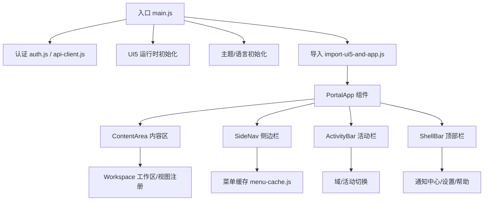
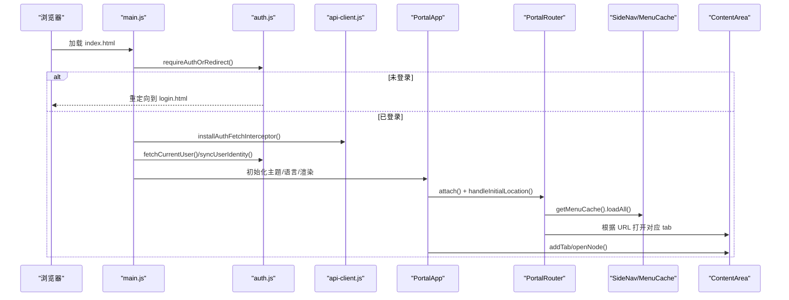
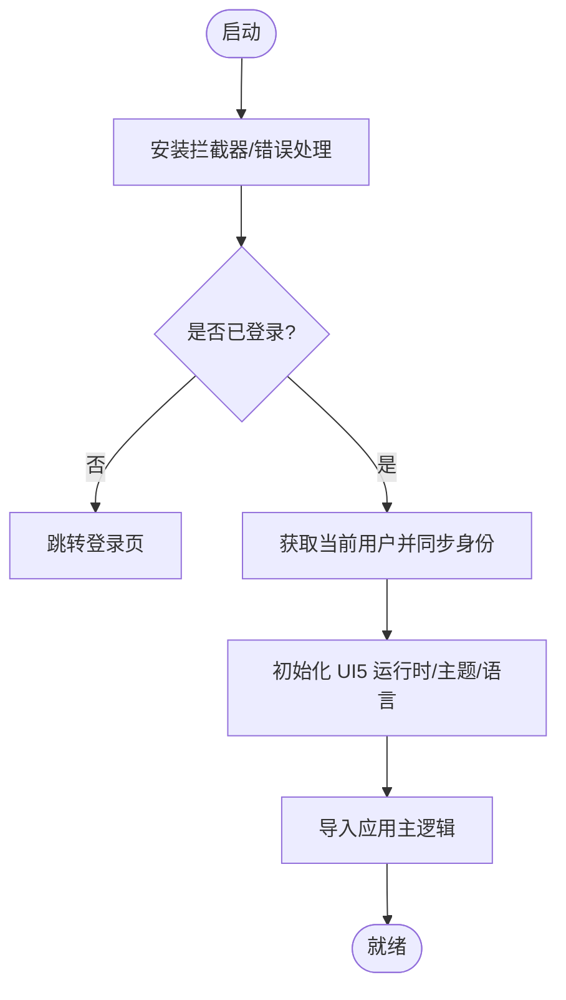
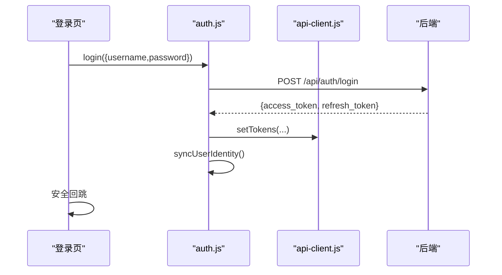
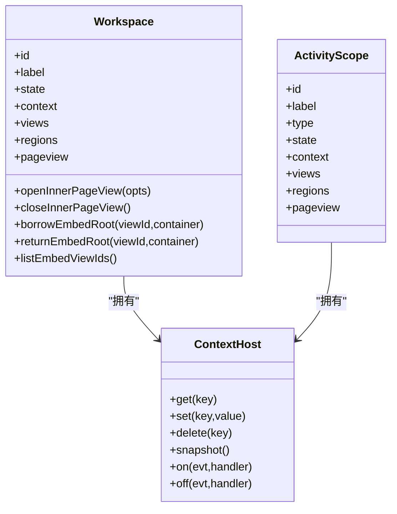
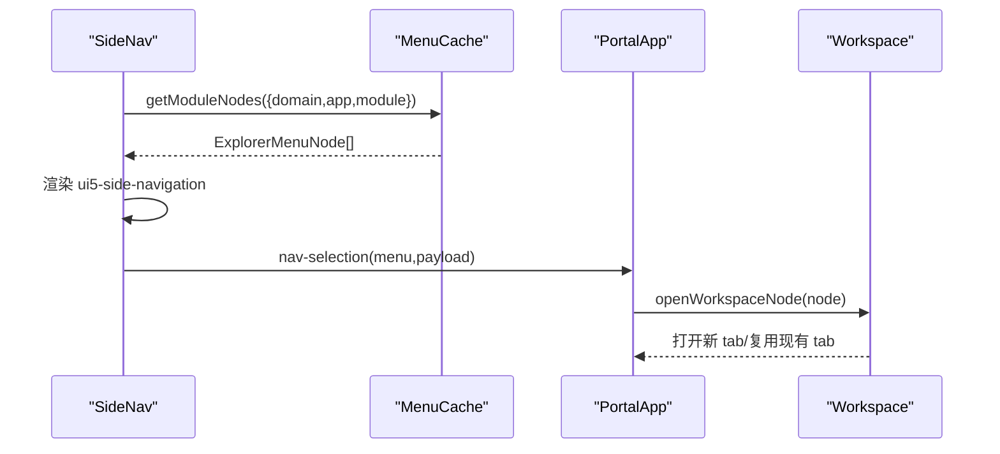
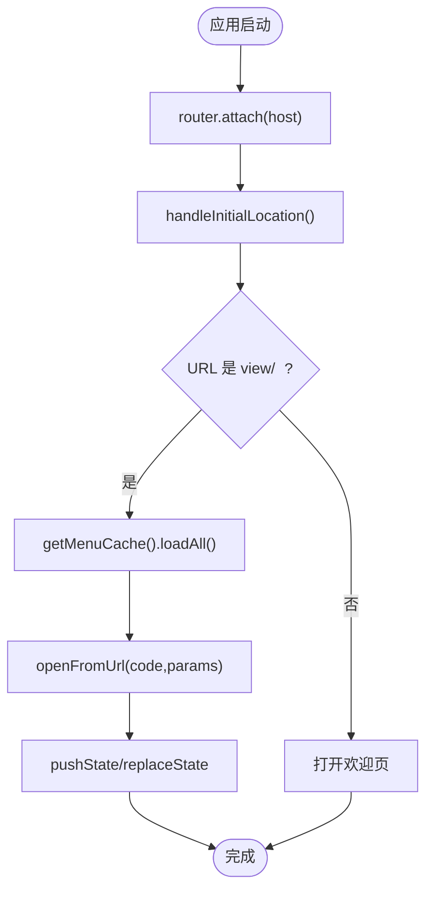
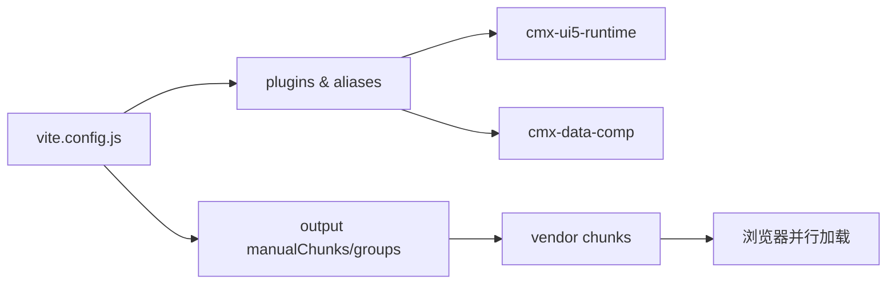

# 门户管理器 (CMXPortalManager)

<cite>
**本文引用的文件**
- [main.js](file://CMXPortalManager/src/main.js)
- [login.js](file://CMXPortalManager/src/login.js)
- [auth.js](file://CMXPortalManager/src/lib/auth.js)
- [api-client.js](file://CMXPortalManager/src/lib/api-client.js)
- [vite.config.js](file://CMXPortalManager/vite.config.js)
- [package.json](file://CMXPortalManager/package.json)
- [portal-app.js](file://CMXPortalManager/src/components/portal-app.js)
- [portal-content-area.js](file://CMXPortalManager/src/components/portal-content-area.js)
- [mainapp.js](file://CMXPortalManager/src/lib/mainapp.js)
- [workspace-node.js](file://CMXPortalManager/src/lib/workspace-node.js)
- [portal-router.js](file://CMXPortalManager/src/lib/portal-router.js)
- [menu-cache.js](file://CMXPortalManager/src/lib/menu-cache.js)
- [portal-side-nav-menu.js](file://CMXPortalManager/src/components/portal-side-nav-menu.js)
- [menu-api.js](file://CMXPortalManager/src/api/menu-api.js)
</cite>

## 更新摘要
**变更内容**
- 更新了项目结构部分以反映当前的模块化架构
- 增强了核心组件分析以包含最新的PortalApp功能
- 更新了认证与授权系统部分以反映cmx-container后端集成
- 添加了工作区管理与视图上下文的详细分析
- 更新了菜单导航系统与侧边栏的实现细节
- 增强了路由机制与确定性导航的说明
- 完善了API客户端封装与错误处理
- 更新了与其他模块的集成方式

## 目录
1. [简介](#简介)
2. [项目结构](#项目结构)
3. [核心组件](#核心组件)
4. [架构总览](#架构总览)
5. [详细组件分析](#详细组件分析)
6. [依赖关系分析](#依赖关系分析)
7. [性能与优化](#性能与优化)
8. [故障排查指南](#故障排查指南)
9. [结论](#结论)
10. [附录：配置与扩展](#附录：配置与扩展)

## 简介
本文件为 CMX 门户管理器的功能与实现文档，覆盖应用启动流程、认证授权、工作区管理、菜单导航、界面组件、状态管理、路由机制、API 客户端封装、错误处理与日志记录，以及与其他模块的集成方式、数据交互模式、性能优化建议与故障排查方法。目标是帮助开发者快速理解并扩展门户能力。

**更新** 本文档已迁移至集中式Wiki系统，提供统一的文档管理和版本控制。

## 项目结构
CMXPortalManager 采用模块化前端工程组织，围绕"应用壳 + 内容区 + 侧边栏 + 活动栏 + 工具面板"的布局展开，通过自定义元素（Web Components）组合 UI，配合 Vite 构建与多入口 HTML（index.html、login.html）。关键目录与职责：
- src/main.js：应用启动入口，负责鉴权门、UI5 运行时初始化、主题与语言切换、全局错误兜底。
- src/login.js：登录页脚本，提交后调用后端登录接口，成功后回跳。
- src/lib/*：核心库，包含认证、API 客户端、路由、工作区上下文、菜单缓存等。
- src/components/*：UI 组件，如 portal-app、portal-content-area、侧边栏菜单等。
- src/api/*：业务 API 封装（菜单、通知、工作区节点等）。
- vite.config.js：构建配置，含代理、分包策略、环境变量注入、多入口打包。
- package.json：依赖与脚本，定义开发、构建、预览命令。

**图表来源**
- [main.js:22-43](file://CMXPortalManager/src/main.js#L22-L43)
- [portal-app.js:71-94](file://CMXPortalManager/src/components/portal-app.js#L71-L94)
- [portal-content-area.js:29-48](file://CMXPortalManager/src/components/portal-content-area.js#L29-L48)
- [menu-cache.js:170-205](file://CMXPortalManager/src/lib/menu-cache.js#L170-L205)

**章节来源**
- [main.js:1-49](file://CMXPortalManager/src/main.js#L1-L49)
- [vite.config.js:27-96](file://CMXPortalManager/vite.config.js#L27-L96)
- [package.json:8-22](file://CMXPortalManager/package.json#L8-L22)

## 核心组件
- PortalApp：应用外壳，负责布局、事件分发、路由绑定、通知中心初始化、欢迎页自动打开、浮动窗口联动等。
- PortalContentArea：内容区域，管理标签页、拖拽、右键菜单、脏标记、空状态、工作区挂载点复用。
- Workspace/ActivityScope：跨视图共享上下文与作用域，提供视图注册/注销、inner 对话框、embed 借出归还等能力。
- PortalRouter：确定性路由，URL ↔ 当前激活 tab 双向同步，支持 history/hash 两种模式，内置页面与动态节点快照恢复。
- MenuCache：全量菜单树缓存，按域/应用/模块过滤，扁平索引加速查找，避免重复请求。
- API 客户端：统一拦截器，自动注入 Authorization、解析 ApiResp 信封、401 跳转登录、兼容裸错误响应。
- 认证模块：登录/登出/取当前用户/同步用户身份到 localStorage，供待办中心等按人过滤场景使用。

**章节来源**
- [portal-app.js:32-94](file://CMXPortalManager/src/components/portal-app.js#L32-L94)
- [portal-content-area.js:9-48](file://CMXPortalManager/src/components/portal-content-area.js#L9-L48)
- [mainapp.js:31-100](file://CMXPortalManager/src/lib/mainapp.js#L31-L100)
- [portal-router.js:361-431](file://CMXPortalManager/src/lib/portal-router.js#L361-L431)
- [menu-cache.js:148-205](file://CMXPortalManager/src/lib/menu-cache.js#L148-L205)
- [api-client.js:83-130](file://CMXPortalManager/src/lib/api-client.js#L83-L130)
- [auth.js:33-51](file://CMXPortalManager/src/lib/auth.js#L33-L51)

## 架构总览
门户以 PortalApp 为中心，协调 ShellBar、SideNav、ActivityBar、ContentArea、PropertyPanel、LogPanel、FloatWindow 等子组件。路由由 PortalRouter 驱动，菜单由 MenuCache 提供，工作区由 Workspace/ActivityScope 管理视图与上下文，API 通过 api-client 统一访问后端 cmx-container。

**图表来源**
- [main.js:22-43](file://CMXPortalManager/src/main.js#L22-L43)
- [auth.js:116-121](file://CMXPortalManager/src/lib/auth.js#L116-L121)
- [api-client.js:175-259](file://CMXPortalManager/src/lib/api-client.js#L175-L259)
- [portal-app.js:71-94](file://CMXPortalManager/src/components/portal-app.js#L71-L94)
- [portal-router.js:412-431](file://CMXPortalManager/src/lib/portal-router.js#L412-L431)
- [menu-cache.js:170-205](file://CMXPortalManager/src/lib/menu-cache.js#L170-L205)

## 详细组件分析

### 应用启动流程
- 安装控制台桥接、全局 fetch 拦截器、全局错误 Toast。
- 登录门：未登录直接跳转到登录页；已登录则拉取当前用户信息并写入 globalThis.__cmxUser，同时同步 cmx_user_id/cmx_username。
- 初始化 UI5 运行时、主题、语言，并重渲染所有 UI5 元素。
- 导入应用主逻辑（import-ui5-and-app.js），完成后续组件装配。

**图表来源**
- [main.js:16-43](file://CMXPortalManager/src/main.js#L16-L43)
- [auth.js:57-64](file://CMXPortalManager/src/lib/auth.js#L57-L64)

**章节来源**
- [main.js:16-43](file://CMXPortalManager/src/main.js#L16-L43)
- [auth.js:57-64](file://CMXPortalManager/src/lib/auth.js#L57-L64)

### 认证与授权系统
- 登录：POST /api/auth/login，成功后写入 access_token/refresh_token，并触发 syncUserIdentity。
- 登出：POST /api/auth/logout，清除本地 token 与用户标识。
- 当前用户：GET /api/auth/me，未登录或失效返回 null。
- 全局拦截：installAuthFetchInterceptor 为所有 /api/* 请求注入 Authorization，并在 401 时清 token 并跳转登录页；对非 JSON 响应原样透传。
- 登录页安全回跳：仅允许站内绝对路径，防止开放重定向。

**图表来源**
- [auth.js:33-51](file://CMXPortalManager/src/lib/auth.js#L33-L51)
- [api-client.js:175-259](file://CMXPortalManager/src/lib/api-client.js#L175-L259)
- [login.js:26-46](file://CMXPortalManager/src/login.js#L26-L46)

**章节来源**
- [auth.js:33-121](file://CMXPortalManager/src/lib/auth.js#L33-L121)
- [api-client.js:83-130](file://CMXPortalManager/src/lib/api-client.js#L83-L130)
- [login.js:11-46](file://CMXPortalManager/src/login.js#L11-L46)

### 工作区管理与视图上下文
- ContextHost：键值存储，set/delete 触发 change 事件，snapshot 浅克隆，off/on 订阅变更。
- Workspace：代表 content 区一个 workspace tab，维护 context、views、regions、pageview、inner 对话框、embed 借出归还、actions 注册表。
- ActivityScope：精简版作用域，仅 explorer 区域。
- registerView/unregisterView：冻结用户 API 对象并附加系统字段，处理 dock 拖动时的 host 替换顺序问题。
- openInnerPageView/closeInnerPageView：在 inner 区弹出对话框，支持参数传递、结果回调、Action 失效刷新。
- borrowEmbedRoot/returnEmbedRoot：将 embed 区的 mount root 借给外部容器显示，支持独占与归还校验。

**图表来源**
- [mainapp.js:31-100](file://CMXPortalManager/src/lib/mainapp.js#L31-L100)
- [mainapp.js:141-358](file://CMXPortalManager/src/lib/mainapp.js#L141-L358)
- [mainapp.js:363-387](file://CMXPortalManager/src/lib/mainapp.js#L363-L387)

**章节来源**
- [mainapp.js:31-100](file://CMXPortalManager/src/lib/mainapp.js#L31-L100)
- [mainapp.js:141-358](file://CMXPortalManager/src/lib/mainapp.js#L141-L358)
- [mainapp.js:363-387](file://CMXPortalManager/src/lib/mainapp.js#L363-L387)

### 菜单导航系统与侧边栏
- 侧边栏菜单：从 DAM 域-应用-模块树派生模块骨架，再按模块从菜单缓存加载具体菜单项，支持搜索、快捷键、右键编辑。
- 菜单缓存：一次 GET /api/menu/tree 全量拉取，构建 ExplorerMenuNode 树，按 domain/application/module 过滤，扁平索引 code→node。
- 选择事件：selection-change 与 click 兜底，派发 nav-selection，确保深层菜单项也能打开。
- 选中态同步：router 驱动打开 tab 时，显式同步 side-nav 选中项，避免视觉不一致。

**图表来源**
- [portal-side-nav-menu.js:606-697](file://CMXPortalManager/src/components/portal-side-nav-menu.js#L606-L697)
- [menu-cache.js:170-230](file://CMXPortalManager/src/lib/menu-cache.js#L170-L230)
- [portal-app.js:400-419](file://CMXPortalManager/src/components/portal-app.js#L400-L419)

**章节来源**
- [portal-side-nav-menu.js:100-134](file://CMXPortalManager/src/components/portal-side-nav-menu.js#L100-L134)
- [portal-side-nav-menu.js:369-499](file://CMXPortalManager/src/components/portal-side-nav-menu.js#L369-L499)
- [menu-cache.js:148-230](file://CMXPortalManager/src/lib/menu-cache.js#L148-L230)

### 路由机制与确定性导航
- 路由模式：history（默认）或 hash，由构建期环境变量决定。
- URL 设计：<APP_BASE>view/<code> 带可选 query 参数，欢迎页等价于首页。
- 初始位置处理：handleInitialLocation 解析 URL，若为 view/<code>，预拉菜单缓存并打开；否则走默认欢迎页。
- 动态节点快照：不在菜单树的 tab（如报表页）在 openNode 时持久化 sessionStorage，前进/回退时重建。
- 深链修复：打开前先按菜单的 domain/application 切换活动与侧栏菜单，保证选中态一致。

**图表来源**
- [portal-router.js:412-431](file://CMXPortalManager/src/lib/portal-router.js#L412-L431)
- [portal-router.js:547-623](file://CMXPortalManager/src/lib/portal-router.js#L547-L623)
- [portal-router.js:635-647](file://CMXPortalManager/src/lib/portal-router.js#L635-L647)

**章节来源**
- [portal-router.js:1-702](file://CMXPortalManager/src/lib/portal-router.js#L1-L702)

### 用户界面组件与状态管理
- PortalApp：监听 shellbar、content、side-nav、activity-bar 等事件，协调布局、dock 显隐、属性面板联动、浮动窗口状态。
- ContentArea：管理标签页生命周期、拖拽、右键菜单、脏标记、空状态、工作区挂载点复用、tab 溢出布局。
- 状态管理：ContextHost 提供细粒度变更通知；Workspace 维护 views/regions/pageview；PortalRouter 维护 URL 与 tab 的双向同步。

**章节来源**
- [portal-app.js:96-484](file://CMXPortalManager/src/components/portal-app.js#L96-L484)
- [portal-content-area.js:29-212](file://CMXPortalManager/src/components/portal-content-area.js#L29-L212)
- [mainapp.js:31-100](file://CMXPortalManager/src/lib/mainapp.js#L31-L100)

### API 客户端封装与错误处理
- 统一封装：apiFetch/apiGet/apiPost/apiDelete，自动注入 Authorization、解析 ApiResp 信封、处理 401 跳转。
- 全局拦截：installAuthFetchInterceptor 为 window.fetch 打补丁，透明拆信封、保留 data、构造错误响应。
- 错误处理：showCmxError/showCmxFatalScreen/installGlobalErrorToast，统一用户可见的错误提示。

**章节来源**
- [api-client.js:83-130](file://CMXPortalManager/src/lib/api-client.js#L83-L130)
- [api-client.js:175-259](file://CMXPortalManager/src/lib/api-client.js#L175-L259)
- [main.js:16-20](file://CMXPortalManager/src/main.js#L16-L20)

### 与其他模块的集成与数据交互
- 与 UI5 运行时：ensureCmxUi5Runtime 初始化，initPortalUi5Theme/initPortalUi5Language 应用主题与语言，reRenderAllUI5Elements 重渲染。
- 与 cmx-data-comp：toast 组件、消息提示、全局错误处理。
- 与后端 cmx-container：通过 /api/*、/rpc/*、/sse/*、/ws/* 代理转发，支持 SSE 通知、WebSocket 实时通信。
- 与菜单/通知/工作区节点 API：menu-api.js、notifications-api.js、workspace-nodes-api.js 等。

**章节来源**
- [main.js:8-14](file://CMXPortalManager/src/main.js#L8-L14)
- [vite.config.js:84-96](file://CMXPortalManager/vite.config.js#L84-L96)
- [menu-api.js:38-65](file://CMXPortalManager/src/api/menu-api.js#L38-L65)

## 依赖关系分析
- 构建期依赖：Vite、UI5 WebComponents、Lit、CodeMirror、Markdown-it、Shiki、Zod 等。
- 运行期依赖：cmx-ui5-runtime、cmx-data-comp、cmx-icon-resource。
- 插件与别名：cmxUi5RuntimeAppPlugin、localeDataWhitelistPlugin、alias 指向本地源码以便调试。
- 分包策略：按第三方库拆分 vendor chunk，减少首屏体积，提升并行解析效率。

**图表来源**
- [vite.config.js:41-83](file://CMXPortalManager/vite.config.js#L41-L83)
- [vite.config.js:112-168](file://CMXPortalManager/vite.config.js#L112-L168)

**章节来源**
- [package.json:24-53](file://CMXPortalManager/package.json#L24-L53)
- [vite.config.js:41-83](file://CMXPortalManager/vite.config.js#L41-L83)
- [vite.config.js:112-168](file://CMXPortalManager/vite.config.js#L112-L168)

## 性能与优化
- 首屏优化：modulePreload 过滤重型 vendor chunk（如 ignite-spreadsheet），避免首屏加载无关资源。
- 分包策略：按库拆分 vendor chunk，提升缓存命中与并行解析；lit/markdown/shiki 按需懒加载。
- 菜单缓存：全量菜单树一次性加载，模块级过滤在前端完成，避免多次网络请求。
- 视图复用：ContentArea 缓存工作区挂载根，切换 tab 时移动 DOM，减少重建开销。
- 路由稳定：push 前检查 URL 是否已等于目标值，避免重复 push 造成历史污染。
- 错误降级：菜单加载失败不阻断主流程，toast 提示并自动重试；401 统一跳转登录。

**章节来源**
- [vite.config.js:97-106](file://CMXPortalManager/vite.config.js#L97-L106)
- [vite.config.js:112-168](file://CMXPortalManager/vite.config.js#L112-L168)
- [menu-cache.js:170-205](file://CMXPortalManager/src/lib/menu-cache.js#L170-L205)
- [portal-content-area.js:119-147](file://CMXPortalManager/src/components/portal-content-area.js#L119-L147)
- [portal-router.js:476-486](file://CMXPortalManager/src/lib/portal-router.js#L476-L486)

## 故障排查指南
- 白屏/401 风暴：检查 LOGIN_PATH 是否正确拼接 BASE_URL；确认 installAuthFetchInterceptor 已安装；避免 redirect 参数指数叠加。
- 菜单为空：查看 menu-cache 加载失败 toast；确认 /api/menu/tree 可访问；检查 visible 字段与权限过滤。
- 路由不生效：确认 router 模式（history/hash）与后端 SPA fallback 配置；检查 APP_BASE 与 base 配置一致。
- 视图闪烁：检查 applyWorkspaceShell 的 mounts 参数与 activate 标志；确认 region 列表更新正确。
- 浮动窗口状态不同步：监听 portal-workspace-float-state-change 事件，同步 shellbar AI 按钮 pressed。
- 通知角标不刷新：确认 subscribeNotifyStream 已订阅，shellbar.setNotifyCounts 被调用。

**章节来源**
- [api-client.js:59-73](file://CMXPortalManager/src/lib/api-client.js#L59-L73)
- [menu-cache.js:170-205](file://CMXPortalManager/src/lib/menu-cache.js#L170-L205)
- [portal-router.js:412-431](file://CMXPortalManager/src/lib/portal-router.js#L412-L431)
- [portal-app.js:186-193](file://CMXPortalManager/src/components/portal-app.js#L186-L193)
- [portal-app.js:634-656](file://CMXPortalManager/src/components/portal-app.js#L634-L656)

## 结论
CMX 门户管理器通过清晰的启动流程、健壮的认证授权、灵活的工作区与视图管理、确定性的路由机制、高效的菜单缓存与统一的 API 客户端，构建了可扩展的企业门户平台。结合性能优化与完善的错误处理，能够满足复杂业务场景下的多模块、多工作区、多视图需求。

## 附录：配置与扩展
- 环境变量：
  - CMX_APP_BASE：应用基础路径（dev=/，prod=/portal/）。
  - VITE_API_BASE：前后端不同源时的后端域名重写。
  - VITE_ROUTER_MODE：路由模式（history/hash）。
- 构建脚本：
  - npm run dev：启动开发服务器。
  - npm run build：构建生产包（先构建 cmx-ui5-runtime）。
  - npm run preview：预览构建产物。
- 扩展点：
  - 自定义菜单节点：在 explorer-menu.json 中定义 workspace/dialogspace。
  - 自定义视图类型：在 workspace-view-renderer 中扩展渲染逻辑。
  - 自定义路由：在 portal-router 中添加内置菜单节点与处理逻辑。
  - 自定义通知中心：通过 notifications-api 与 shellbar 集成。

**章节来源**
- [vite.config.js:27-33](file://CMXPortalManager/vite.config.js#L27-L33)
- [package.json:8-22](file://CMXPortalManager/package.json#L8-L22)
- [portal-router.js:253-272](file://CMXPortalManager/src/lib/portal-router.js#L253-L272)
- [menu-api.js:38-65](file://CMXPortalManager/src/api/menu-api.js#L38-L65)