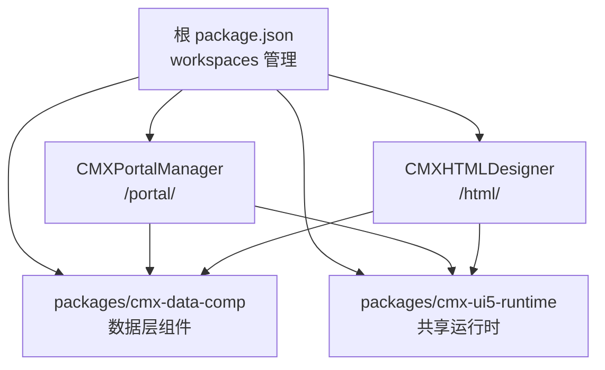
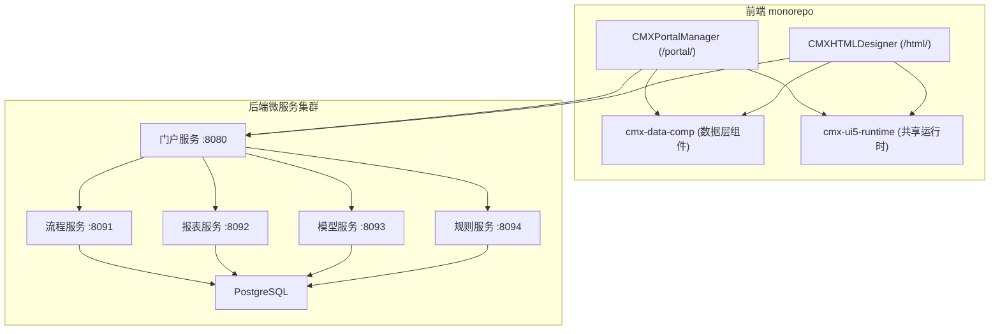
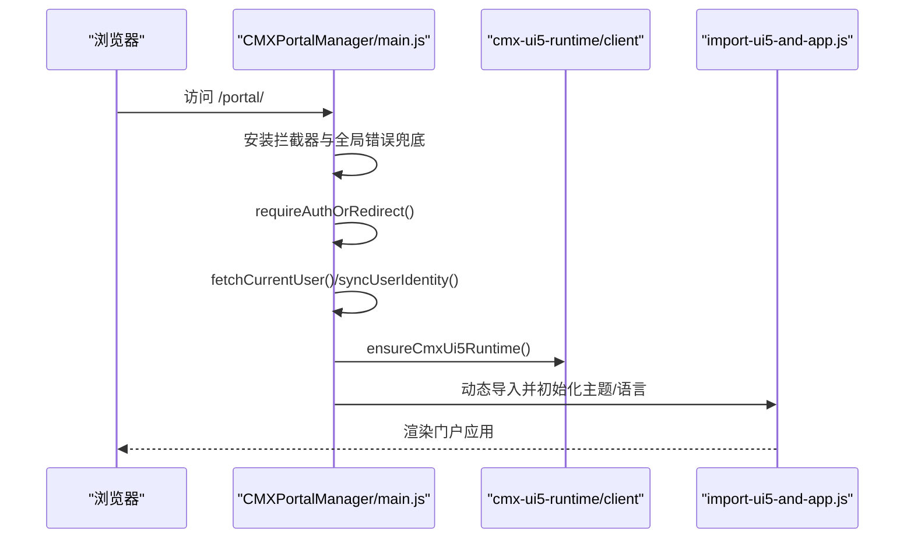
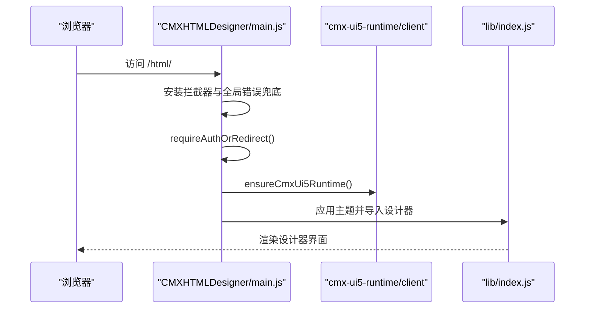
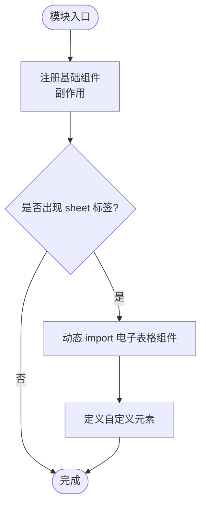
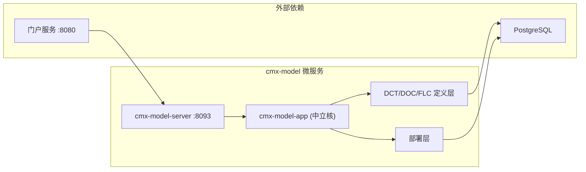
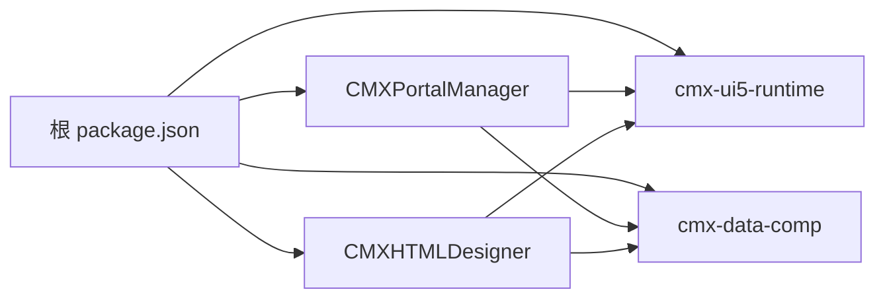

# 项目概览

<cite>
**本文引用的文件**
- [README.md](file://README.md)
- [package.json](file://package.json)
- [CMXPortalManager/package.json](file://CMXPortalManager/package.json)
- [CMXHTMLDesigner/package.json](file://CMXHTMLDesigner/package.json)
- [packages/cmx-data-comp/package.json](file://packages/cmx-data-comp/package.json)
- [packages/cmx-ui5-runtime/package.json](file://packages/cmx-ui5-runtime/package.json)
- [packages/cmx-data-comp/src/index.js](file://packages/cmx-data-comp/src/index.js)
- [CMXPortalManager/src/main.js](file://CMXPortalManager/src/main.js)
- [CMXHTMLDesigner/src/main.js](file://CMXHTMLDesigner/src/main.js)
- [CONTRIBUTING.md](file://CONTRIBUTING.md)
- [AGENTS.md](file://AGENTS.md)
- [docs/模型中心独立微服务-cmx-model-抽取方案.md](file://docs/模型中心独立微服务-cmx-model-抽取方案.md)
</cite>

## 更新摘要
**变更内容**
- 新增 cmx-model 微服务（:8093）作为独立的元数据中心，提供 DCT/DOC/主数据/编码引擎/部署能力
- 更新后端架构描述，从四微服务扩展为五微服务架构
- 新增模型中心微服务的详细说明和架构图
- 更新服务启动流程和端口配置信息

## 目录
1. [简介](#简介)
2. [项目结构](#项目结构)
3. [核心组件](#核心组件)
4. [架构总览](#架构总览)
5. [详细组件分析](#详细组件分析)
6. [依赖关系分析](#依赖关系分析)
7. [性能考量](#性能考量)
8. [故障排查指南](#故障排查指南)
9. [结论](#结论)
10. [附录：快速开始](#附录快速开始)

## 简介
CMX 企业门户平台是一个元数据驱动的前端 monorepo，提供"门户运行时 + 可视化设计器 + 数据层 Web Components"的一体化能力。它通过 JSON 元数据定义驱动单据、字典、报表等页面的装载与回存，并以无框架的 Web Components 构建可嵌入任意宿主的数据层组件。平台与后端微服务集群配套协作，由独立的 Rust 微服务提供元数据存储与服务、异步任务中心与插件体系。

核心价值主张：
- 元数据驱动：一份定义即生成一套 L1..Ln 业务页面，零专属代码即可实现装载/回存/建表。
- 数据层组件化：主从协调、列模型、数据集、增量 changeset 等能力沉淀为可复用组件。
- 无框架 Web Components：组件不依赖 React/Vue/Angular，可被任意宿主集成。
- Monorepo 工程化：统一构建、测试、发布，降低多子模块协作成本。
- 微服务架构：前后端解耦，支持独立部署和水平扩展。

**章节来源**
- [README.md:1-17](file://README.md#L1-L17)

## 项目结构
本仓库采用 npm workspaces 组织的 monorepo，包含两个应用与两个共享包：
- CMXPortalManager：门户运行时（路由 /portal/），负责应用壳、工作区、菜单、页面渲染与运行时上下文。
- CMXHTMLDesigner：可视化设计器（路由 /html/），用于以拖拽/配置方式编排页面与模型。
- packages/cmx-data-comp：数据层 Web Components 与运行时库（主从表格、组合框、树表、公式编辑器、单据/字典/报表组件等）。
- packages/cmx-ui5-runtime：UI5 + Tabler 共享运行时，供 Portal 与 Designer 复用。

**图表来源**
- [package.json:6-10](file://package.json#L6-L10)
- [README.md:10-17](file://README.md#L10-L17)

**章节来源**
- [package.json:1-10](file://package.json#L1-L10)
- [README.md:10-17](file://README.md#L10-L17)

## 核心组件
- 门户运行时（CMXPortalManager）
  - 职责：登录鉴权、主题与语言初始化、工作区与标签页管理、菜单与页面路由、与后端 API 交互。
  - 入口：启动流程先安装全局拦截与错误兜底，再校验登录、获取用户信息、加载 UI5 运行时并渲染应用。
- 可视化设计器（CMXHTMLDesigner）
  - 职责：页面可视化编排、模型面板、脚本提示、预览与导出、与设计态元数据交互。
  - 入口：登录门 → 加载共享 UI5 运行时 → 应用主题 → 导入并启动设计器。
- 数据层组件（cmx-data-comp）
  - 职责：提供主从协调器、列模型、数据集、表单/表格/树/对话框/筛选栏等 Web Components；暴露丰富的运行时 API（如文档/字典数据源、查询、流式加载、公式计算、弹性组合等）。
  - 特点：首屏按需懒加载重型组件（如 SpreadJS），避免 vendor 污染；通过 exports 字段精细暴露子路径。
- 共享运行时（cmx-ui5-runtime）
  - 职责：统一封装 UI5/Fiori 组件与主题/本地化能力，提供 client/vite 适配，供 Portal 与 Designer 复用。

**章节来源**
- [CMXPortalManager/src/main.js:1-49](file://CMXPortalManager/src/main.js#L1-L49)
- [CMXHTMLDesigner/src/main.js:1-29](file://CMXHTMLDesigner/src/main.js#L1-L29)
- [packages/cmx-data-comp/src/index.js:1-195](file://packages/cmx-data-comp/src/index.js#L1-L195)
- [packages/cmx-ui5-runtime/package.json:1-31](file://packages/cmx-ui5-runtime/package.json#L1-L31)

## 架构总览
前端 monorepo 与后端微服务集群形成前后端解耦：
- 前端通过统一的 API 客户端发起请求，携带认证令牌，处理 401 等异常。
- 后端由五个独立的 Rust 微服务组成：门户(:8080)、流程(:8091)、报表(:8092)、模型(:8093)、规则(:8094)，每个服务独立部署和扩展。
- 模型中心微服务(cmx-model)专门处理元数据相关的 DCT/DOC/主数据/编码引擎/部署能力。
- 构建产物由 web-server 同源托管，Portal 与设计器分别挂载到不同路由。

**图表来源**
- [AGENTS.md:11-19](file://AGENTS.md#L11-L19)
- [docs/模型中心独立微服务-cmx-model-抽取方案.md:396-404](file://docs/模型中心独立微服务-cmx-model-抽取方案.md#L396-L404)

**章节来源**
- [AGENTS.md:11-19](file://AGENTS.md#L11-L19)
- [docs/模型中心独立微服务-cmx-model-抽取方案.md:396-404](file://docs/模型中心独立微服务-cmx-model-抽取方案.md#L396-L404)

## 详细组件分析

### 门户运行时（CMXPortalManager）
- 启动顺序：安装控制台桥接与全局错误兜底 → 认证拦截 → 登录校验 → 获取当前用户 → 加载共享 UI5 运行时 → 初始化主题与语言 → 重渲染所有 UI5 元素。
- 关键能力：工作区、标签页、浮动窗口、菜单、页面缓存、原生页面与 HTML 页面渲染、AI 工作台等。

**图表来源**
- [CMXPortalManager/src/main.js:1-49](file://CMXPortalManager/src/main.js#L1-L49)

**章节来源**
- [CMXPortalManager/src/main.js:1-49](file://CMXPortalManager/src/main.js#L1-L49)

### 可视化设计器（CMXHTMLDesigner）
- 启动顺序：安装拦截器与全局错误兜底 → 登录校验 → 加载共享 UI5 运行时 → 应用主题 → 导入并启动设计器。
- 关键能力：页面画布、模型面板、脚本提示、预览、服务端导入/导出、调试工具等。

**图表来源**
- [CMXHTMLDesigner/src/main.js:1-29](file://CMXHTMLDesigner/src/main.js#L1-L29)

**章节来源**
- [CMXHTMLDesigner/src/main.js:1-29](file://CMXHTMLDesigner/src/main.js#L1-L29)

### 数据层组件（cmx-data-comp）
- 组件注册与懒加载：
  - 基础组件在 barrel 中副作用注册自定义元素。
  - 重型电子表格组件（SpreadJS/Ignite Spreadsheet）通过 MutationObserver 监听首次出现时动态 import，避免首屏体积膨胀。
- 运行时 API：
  - 文档/字典数据源、查询与流式加载、主从协调、列模型、数据集、弹性组合、公式计算、消息与 Toast、字段类型注册等。

**图表来源**
- [packages/cmx-data-comp/src/index.js:28-57](file://packages/cmx-data-comp/src/index.js#L28-L57)

**章节来源**
- [packages/cmx-data-comp/src/index.js:1-195](file://packages/cmx-data-comp/src/index.js#L1-L195)

### 共享运行时（cmx-ui5-runtime）
- 提供 client 接口供应用调用 ensureCmxUi5Runtime，统一加载 UI5/Fiori 组件与主题/本地化能力。
- 通过 exports 暴露 client/vite/vite-app 适配，便于 Vite 构建集成。

**章节来源**
- [packages/cmx-ui5-runtime/package.json:1-31](file://packages/cmx-ui5-runtime/package.json#L1-L31)

### 模型中心微服务（cmx-model）
- 端口：:8093，环境变量前缀：MODEL_
- 职责：元数据中心的独立微服务，提供 DCT/DOC/主数据/编码引擎/部署能力
- 架构：一芯多壳模式，中立核 `cmx-model-app` + 独立壳 `cmx-model-server` + 平台壳 `ModelProxyModule`
- 数据库：双 DB 栈注册（sqlx + tokio-pg），支持主库和目标库同时操作
- 前端联邦：支持 native-pages 和 html-pages 的联邦部署

**图表来源**
- [docs/模型中心独立微服务-cmx-model-抽取方案.md:126-156](file://docs/模型中心独立微服务-cmx-model-抽取方案.md#L126-L156)

**章节来源**
- [docs/模型中心独立微服务-cmx-model-抽取方案.md:126-156](file://docs/模型中心独立微服务-cmx-model-抽取方案.md#L126-L156)

## 依赖关系分析
- 根 workspace 统一管理版本与脚本，集中声明覆盖 vitest/graphql 等依赖。
- 应用层（Portal/Designer）依赖共享运行时与数据层组件，并通过 Vite 构建。
- 数据层组件依赖 Ignite/Tabulator/RevoGrid 等表格与 UI 库，以及 SpreadJS（按需懒加载）。
- 共享运行时依赖 UI5 生态与图标资源。

**图表来源**
- [package.json:6-10](file://package.json#L6-L10)
- [CMXPortalManager/package.json:45-48](file://CMXPortalManager/package.json#L45-L48)
- [CMXHTMLDesigner/package.json:26-29](file://CMXHTMLDesigner/package.json#L26-L29)
- [packages/cmx-data-comp/package.json:75-88](file://packages/cmx-data-comp/package.json#L75-L88)
- [packages/cmx-ui5-runtime/package.json:16-26](file://packages/cmx-ui5-runtime/package.json#L16-L26)

**章节来源**
- [package.json:1-39](file://package.json#L1-L39)
- [CMXPortalManager/package.json:1-62](file://CMXPortalManager/package.json#L1-L62)
- [CMXHTMLDesigner/package.json:1-39](file://CMXHTMLDesigner/package.json#L1-L39)
- [packages/cmx-data-comp/package.json:1-102](file://packages/cmx-data-comp/package.json#L1-L102)
- [packages/cmx-ui5-runtime/package.json:1-31](file://packages/cmx-ui5-runtime/package.json#L1-L31)

## 性能考量
- 首屏体积优化：
  - 电子表格相关重型组件采用懒加载，仅在首次遇到相关标签时动态引入，避免污染首屏。
- 运行时初始化：
  - 统一通过共享运行时加载 UI5 组件，减少重复加载与版本冲突。
- 网络与缓存：
  - 通过全局 fetch 拦截统一携带认证令牌与处理 401，减少重复逻辑与错误分支。
- 构建与依赖：
  - 使用 Vite 进行开发/构建，配合 workspace 统一依赖版本，提升构建一致性与速度。
- 微服务架构优势：
  - 各微服务独立部署和扩展，避免单体应用的资源竞争问题。
  - 模型中心微服务专门处理元数据相关的高负载操作，不影响其他服务性能。

## 故障排查指南
- 启动失败兜底：
  - 门户与设计器均在 bootstrap 阶段捕获异常并展示致命错误屏幕，便于快速定位问题。
- 认证与权限：
  - 未登录将自动跳转登录页；全局拦截器统一处理 401，确保会话一致性。
- 组件加载异常：
  - 若涉及电子表格功能，检查是否触发了懒加载条件；必要时可主动预加载。
- 日志与调试：
  - 安装控制台桥接与全局错误 Toast，结合浏览器 DevTools 查看堆栈与网络请求。
- 微服务连接问题：
  - 检查各微服务端口是否正确启动（:8080/:8091/:8092/:8093/:8094）
  - 验证模型中心微服务的数据库连接和配置
  - 确认门户与各微服务间的反向代理配置正确

**章节来源**
- [CMXPortalManager/src/main.js:16-20,45-48:16-20](file://CMXPortalManager/src/main.js#L16-L20)
- [CMXHTMLDesigner/src/main.js:11-14,25-28:11-14](file://CMXHTMLDesigner/src/main.js#L11-L14)
- [packages/cmx-data-comp/src/index.js:28-57](file://packages/cmx-data-comp/src/index.js#L28-L57)

## 结论
CMX 企业门户平台以元数据驱动为核心，结合 Web Components 与 monorepo 工程化实践，提供了可扩展、可复用的企业级前端基础设施。通过清晰的模块边界与共享运行时，Portal 与 Designer 既能独立演进又能协同工作；与后端微服务集群的解耦协作进一步增强了系统的可维护性与扩展性。新增的模型中心微服务使得元数据处理更加专业和高效。对于初学者而言，理解"元数据 → 组件 → 运行时 → 微服务"的主线，即可快速上手开发与定制。

## 附录：快速开始
- 环境要求：Node + npm；如需完整体验需准备 Rust + PostgreSQL（后端微服务集群）。
- 安装与构建：
  - 根目录执行安装与构建命令，分别构建各子项目。
- 测试与代码质量：
  - 使用 Vitest 运行测试，ESLint 进行代码规范检查。
- 贡献规范：
  - 遵循 Conventional Commits，提交前通过后端的 cargo test/clippy/fmt 与前端的 npm test/lint。
- 微服务启动：
  - 门户服务：`:8080`
  - 流程服务：`:8091`
  - 报表服务：`:8092`
  - 模型服务：`:8093`
  - 规则服务：`:8094`

**章节来源**
- [README.md:26-43](file://README.md#L26-L43)
- [CONTRIBUTING.md:5-19](file://CONTRIBUTING.md#L5-L19)
- [AGENTS.md:214](file://AGENTS.md#L214)