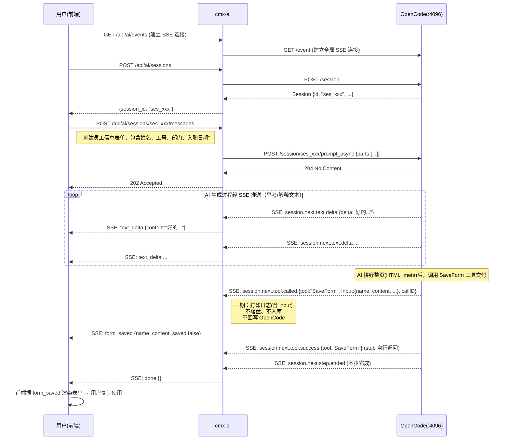
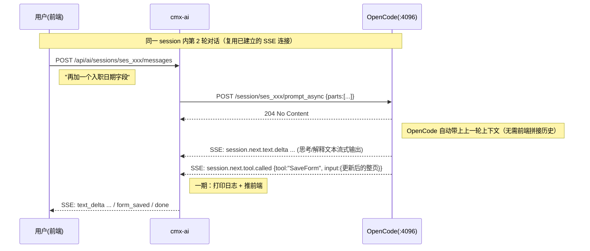

# CMX AI 表单/元数据生成 — 整体架构方案

> **生成能力**：AI 生成 HTML 表单页面、数据字典定义 (DCT)、业务单据定义 (DOC)
>
> **分期策略**：一期纯生成（新建），二期支持修改已有页面/定义

---

## 一、系统全景

整个系统由 **3 个独立部署单元** 组成：

```
┌───────────────────────────────────────────────────────────────────┐
│                     用户浏览器（前端）                            │
│  cmx-ai-workbench                                               │
│  ┌─────────────────────────────────────────────────────────┐  │
│  │ 对话面板 + 询问卡片 + 结果展示                           │  │
│  └─────────────────────────┬───────────────────────────────┘  │
└──────────────────────────┼────────────────────────────────────────┘
                        │ HTTP/SSE
                        ▼
┌───────────────────────────────────────────────────────────────────┐
│         cmx-container (Rust 统一服务)                             │
│                                                                   │
│  ┌─────────────────────────────────────────────────────────────┐ │
│  │  web-server  ──nest("/api")──→  cmx-api                    │ │
│  │  (装配 AppState/中间件/监听)     (/api/ai/* 在此 AiModule)  │ │
│  └────────────────────────────┬────────────────────────────────┘ │
│                               │                                   │
│  ┌────────────────────────────▼───────────────────────────────┐ │
│  │  crates/libs/cmx-ai (新增模块，一期=薄代理)                 │ │
│  │  ┌───────────────┐  ┌───────────────┐  ┌──────────────┐  │ │
│  │  │ opencode_client│  │  sse_relay    │  │    auth      │  │ │
│  │  │ (reqwest 转发) │  │ (事件分发/翻译)│  │ (Bearer 凭证) │  │ │
│  │  └───────────────┘  └───────────────┘  └──────────────┘  │ │
│  │  (二期新增 session_store: 会话入库 + 会话列表)             │ │
│  └────────────────────────────┬───────────────────────────────┘ │
│                    ┌───────────┴───────────┐                     │
│                    ▼                       ▼                     │
│  ┌──────────────────────────┐  ┌──────────────────────────────┐ │
│  │ (二期) cmx-portal        │  │  HTTP ──→ OpenCode           │ │
│  │  保存产物(html-pages/    │  │  (调 /session /prompt_async  │ │
│  │  dict/definitions)       │  │   /event /question /permission)│
│  └──────────────────────────┘  └──────────────────────────────┘ │
└──────────────────────────────────────────┬──────────────────────┘
                                           │ HTTP (OpenCode Server API, Bearer)
                                           ▼
                          ┌─────────────────────────────┐
                          │  OpenCode（AI Agent，独立部署）│
                          │  加载 CMX Skill + 知识库     │
                          └─────────────────────────────┘
```

**关键设计决策**：
- AI 能力作为 `crates/libs/cmx-ai` 模块加入现有 `cmx-container` workspace；路由经 `cmx-api` 的 `AiModule` 注册，统一由 `web-server` 暴露（详见 2.2 节路由注册点说明）
- 一期 cmx-ai 是**薄代理**（转发 + SSE 翻译，无持久化）；二期演进为**胖代理**（会话入库 + 会话列表）
- **表单产物通过 `SaveForm` 工具交付**：AI 生成完页面后调用一个名为 `SaveForm` 的工具输出表单（工具在 OpenCode 侧注册为 no-op stub）。cmx-ai 仍维持薄代理定位——**被动监听** `session.next.tool.called` 事件，按 `tool === "SaveForm"` 捕获工具入参（整页 HTML 片段 + `__designer_meta__` 的 content 字符串）。cmx-ai **不主动向 OpenCode 注册工具、不反向监听**，接口方向与现有薄代理完全一致。详见 2.3 节「SaveForm 工具」与第 4.2 节。
- **一期：cmx-ai 仅打印日志 + 推前端展示**：捕获到 `SaveForm` 调用后，cmx-ai 把入参记录到日志，并翻译为 `form_saved` 事件推给前端，前端渲染表单。**不落盘、不入库**。
- **二期：cmx-ai 处理 SaveForm 内容**：在薄代理基础上增加处理逻辑——收到 `SaveForm` 调用后调门户 `POST /api/portal/html-pages` 等接口落盘，把产物 id 回填会话表，向前端发 `form_saved`（带 `saved:true` 与产物引用）。详见 2.4 节与附录 B。
- 一期不涉及已有页面的读取和修改

---

## 二、各组件职责

### 2.1 前端（Browser）— 两阶段策略

**阶段一：独立应用 `cmx-ai-workbench`**

| 模块 | 说明 |
|------|------|
| 对话面板 | 用户输入需求，展示 AI 流式回复 |
| 询问卡片 | AI ask_user 事件对应的内联选择/输入 UI |
| 结果展示 | 生成的 HTML/JSON 代码展示 + 复制按钮 |

**技术选型（经源码核实）**：
- 框架：**Vite + 原生 Web Components（标准 Custom Elements API，`class extends HTMLElement`）**。⚠️ 注意：CMXHTMLDesigner / CMXPortalManager / cmx-data-comp 实际都是原生 Web Components，**不用 Lit**（CMXPortalManager/package.json 里的 `lit` 依赖是死依赖，源码无 import；lit 仅作为 @ui5/webcomponents 的间接依赖存在）。若新前端用 Lit 自写组件，反而与 CMX 写法不一致；调用 @ui5 / cmx-data-comp 标签这一层才是一致的。
- UI 组件：`@ui5/webcomponents` + `cmx-ui5-runtime` + `cmx-data-comp`（直接以 HTML 标签形式调用，如 `<ui5-input>`、`<cmx-ui5-form>`）
- 构建：独立 vite.config.js，开发时代理 API 到 Rust 服务
- 目录：`cmx-ai-workbench/`（monorepo 根级新目录）

**项目结构**：
```
cmx-ai-workbench/
├── index.html
├── package.json
├── vite.config.js
└── src/
    ├── main.js                    # 入口
    ├── components/
    │   ├── ai-chat-panel.js       # 对话面板（核心）
    │   ├── ai-ask-card.js         # 询问卡片
    │   └── ai-result-viewer.js    # 结果展示（HTML/JSON + 复制）
    ├── services/
    │   ├── session-service.js     # 会话管理 API
    │   └── sse-client.js          # SSE 流式接收 + 事件分发
    └── styles/
        └── chat.css
```

**阶段二：迁移到 CMXPortalManager**

将对话面板组件迁移到 `../cmx-portal-manager`，作为门户的内置功能。

### 2.2 Rust 服务层（cmx-container 内的 cmx-ai 模块）

代码位置：`/home/zhangqin/workspaces/pansoft/cmx/cmx-container/crates/libs/cmx-ai`

在现有 `cmx-container` workspace 中新增 `cmx-ai` crate，与已有的 `cmx-metadata`、`cmx-biz`、`cmx-service` 平级（均在 `crates/libs/` 下）。

> ⚠️ **路由注册点说明（经代码核实）**：HTTP 业务路由**不在 `web-server` crate 内定义**。`web-server`（位于 `crates/web/web-server/`）只负责装配 `CmxAppState`、中间件、静态文件 fallback 与启动监听；它的 `routes.rs` 仅调用 `cmx_api::routes::routes_impl::api_routes()`，后者在 `main.rs` 中被 `.nest("/api", ...)`。真正的业务路由全部在 **`cmx-api` crate**（`crates/libs/cmx-api/src/routes/routes_impl.rs`）通过各模块实现 `ModuleRoutes` trait 后 `.merge()` 聚合。因此新增 `/api/ai/*` 的正确做法是：在 `cmx-api` 的 `handlers/` 下新增 `ai` 模块、实现 `AiModule.routes()`，并在 `api_routes()` 里 `.merge(ai::AiModule.routes())`。若 cmx-ai 需要共享状态，经 `CmxAppState`（`cmx-api/src/app_state.rs`）的 `.with_xxx()` builder 注入，与现有 `FunctionInvoker`/`ServiceInvoker` 一致。

**模块定位（一期薄代理 → 二期胖代理）**：

- **一期（薄代理）**：前端与 OpenCode 之间的纯转发层。由于 OpenCode 自己管理会话和消息历史，cmx-ai 主要做：
  - 前端请求转发到 OpenCode
  - SSE 事件流截取和转发（OpenCode 的 `GET /event` 是**全局单流**，所有 session 事件混在一起，cmx-ai 需按事件载荷里的 `sessionID` 字段做分发路由）
  - 权限控制 / 认证
- **二期（胖代理）**：在薄代理基础上增加 cmx-ai **自有的会话元数据存储**——每个 AI 会话在 cmx-ai 落库一条记录（标题、所属用户、关联的 OpenCode sessionID、生成产物引用等），支撑「用户会话列表 / 历史回看 / 恢复继续」。OpenCode 侧的 session 仍由 OpenCode 管，cmx-ai 额外维护一张到 cmx-ai 会话的映射表（详见第 2.4 节及附录 A）。

**一期子模块**：

| 子模块 | 职责 |
|--------|------|
| `opencode_client` | OpenCode HTTP 客户端（reqwest，`reqwest = { workspace = true }`）—— 封装会话创建、发消息、中止、question/permission 回复等接口；统一携带 OpenCode 访问凭证 |
| `sse_relay` | 维护到 OpenCode `GET /event` 的 SSE 连接，按 `sessionID` 路由事件，翻译为 cmx-ai 事件推给前端 |
| `types` | 请求/响应/SSE 事件类型定义 |
| `auth` | OpenCode 访问凭证管理（见下方「OpenCode 鉴权」） |

**crate 结构**：
```
crates/libs/cmx-ai/
├── Cargo.toml
└── src/
    ├── lib.rs
    ├── opencode_client.rs  # OpenCode API 客户端
    ├── sse_relay.rs        # SSE 事件流转发（按 sessionID 分发）
    ├── types.rs            # 类型定义
    ├── auth.rs             # OpenCode 凭证管理
    └── error.rs            # 错误类型
```

**依赖关系**：
```
cmx-api  → cmx-ai            (在 cmx-api 内实现 AiModule.routes()，注册 /api/ai/*)
cmx-ai   → cmx-core, cmx-utils
```

**OpenCode 鉴权（经代码核实）**：

OpenCode `serve` 默认挂载 `Authorization` 中间件，若未设置 `OPENCODE_SERVER_PASSWORD` 环境变量会打印 `server is unsecured` 警告。cmx-ai 调用 OpenCode 的所有 HTTP 请求（含 SSE 连接）**必须携带该凭证**（`Authorization: Bearer <password>`）。生产部署应显式配置强密码，凭证由 cmx-ai 的 `auth` 子模块从配置读取并注入到 `opencode_client` 的每次请求。`OPENCODE_SERVER_PASSWORD` 同时也是 OpenCode 面向 cmx-ai 的唯一访问边界，需纳入密钥管理。

**SSE 连接模型（架构决策）**：

OpenCode 的 `GET /event` 是全局单流，一个连接接收所有 session 的事件。cmx-ai 的 `sse_relay` 有两种实现可选：
- **A. 单连接多路复用（推荐）**：cmx-ai 维护**一条**到 OpenCode 的 SSE 长连接，按事件载荷 `properties.sessionID` 分发到对应的前端 SSE 连接。优点是连接数少、心跳统一；需自行维护 `{前端连接 → sessionID 集合}` 的路由表。
- **B. 每前端一连接**：每个前端 SSE 连接对应一条 cmx-ai→OpenCode 的 SSE 连接（前端连 OpenCode 无意义，仍由 cmx-ai 代理）。实现简单但连接数翻倍。

一期采用方案 A。注意 OpenCode SSE 每帧的 `event:` 字段固定为 `message`，真实类型在 `data.type` 字段中（见第 4 节）；首帧固定为 `server.connected`，之后每 10 秒发一帧 `server.heartbeat`，实例销毁时发 `server.instance.disposed`。

**一期 API 设计**：

cmx-ai 对前端暴露的接口（内部转发到 OpenCode 真实端点）：

```
POST   /api/ai/sessions                       → 创建会话（转发 OpenCode POST /session）
POST   /api/ai/sessions/{sid}/messages        → 发送消息（异步：转发 prompt_async；见 2.3 说明）
POST   /api/ai/sessions/{sid}/answer          → 回答询问（转发 OpenCode POST /question/{requestID}/reply）
POST   /api/ai/sessions/{sid}/approval        → 审批决策（转发 OpenCode POST /permission/{requestID}/reply）
POST   /api/ai/sessions/{sid}/abort           → 中止生成（转发 OpenCode POST /session/{sid}/abort）
GET    /api/ai/events                         → SSE 事件流（转发 OpenCode GET /event，按 sessionID 分发）
DELETE /api/ai/sessions/{sid}                 → 删除会话（转发 OpenCode DELETE /session/{sid}）
```

**各接口用途说明**：

| cmx-ai 接口 | 作用 | OpenCode 对应接口 |
|------|------|------------------|
| `POST /sessions` | 创建新会话 | `POST /session`（返回 Session 对象，body 可选） |
| `POST /sessions/{sid}/messages` | 发送用户输入，触发 AI 生成（异步，结果走 SSE） | `POST /session/{sid}/prompt_async`（返回 204） |
| `POST /sessions/{sid}/answer` | 回答 AI 询问 | `POST /question/{requestID}/reply`（body: `{answers: string[][]}`） |
| `POST /sessions/{sid}/approval` | 回复权限审批 | `POST /permission/{requestID}/reply`（body: `{reply: "once"\|"always"\|"reject", message?}`） |
| `POST /sessions/{sid}/abort` | 中止当前生成 | `POST /session/{sid}/abort` |
| `GET /events` | SSE 事件流（多会话共用，按 sessionID 分发） | `GET /event`（全局单流） |
| `DELETE /sessions/{sid}` | 关闭会话，释放资源 | `DELETE /session/{sid}` |

> ⚠️ **关键修正**：`answer` / `approval` **不是**「作为 tool_result 提交给 OpenCode」。OpenCode 原生提供 **Question** 和 **Permission** 两个挂起-恢复子系统（全仓 grep 不存在 `ask_user`/`tool_result` 这类交互）。询问对应 `question.v2.asked` 事件，回复走 `POST /question/{requestID}/reply`；审批对应 `permission.v2.asked` 事件，回复走 `POST /permission/{requestID}/reply`。详见第 4.5 节。
>
> 注意：`answer`/`approval` 的 URL 虽然带 `{sid}`，但实际转发目标是 question/permission 的 `{requestID}`——`requestID` 来自挂起事件载荷，cmx-ai 需在内存中维护「当前 session 的待回答 question_id / approval_id」，前端 POST 时带上即可。

**多轮会话说明**：

OpenCode 自己维护会话内的消息历史，前端只需在同一 session_id 下反复调用 `POST /messages`，OpenCode 会自动带上上下文。典型场景：

```
第1轮: "创建员工信息表单，包含姓名、工号、部门"     → AI 生成 HTML 表单 v1
第2轮: "再加一个入职日期字段"                     → AI 基于 v1 生成 v2
第3轮: "把部门改成下拉选择，引用部门字典"        → AI 基于 v2 生成 v3
```

> ℹ️ 这与“二期修改已有表单”的区别：一期的多轮是在**当前会话中迭代生成结果**，二期是**加载系统中已保存的页面/元数据进行修改**。

### 2.3 OpenCode（AI Agent）

独立部署的 AI 编码代理，通过 `opencode serve --port 4096` 启动 HTTP 服务。

> ℹ️ **端口与启动（经源码核实）**：`--port` 的默认值是 `0`，启动逻辑为**优先尝试 4096，被占用则回退到随机端口**（`server.ts` 的 `startWithPortFallback`）。生产部署**必须显式** `--port 4096` 才能固定端口；不写 `--port` 不保证一定是 4096。默认 hostname `127.0.0.1`，容器内启动需配合 `--host 0.0.0.0`。

**官方 API 文档**：https://opencode.ai/docs/zh-cn/server/ ｜ 本机交互式文档：`http://127.0.0.1:4096/doc`（返回 OpenAPI 3.1 JSON）

**核心接口（cmx-ai 调用，路径经 OpenAPI 文档核实）**：

> 路径参数名为 `:sessionID`（pattern `^ses`），并非 `:id`。OpenCode 还提供一套前缀为 `/api/` 的 v2 接口，下表沿用 v1 路径（功能等价）。

| OpenCode 接口 | 用途 | 返回 |
|---------------|------|------|
| `POST /session` | 创建新会话（请求体可选，可为空） | `Session` 对象 |
| `POST /session/{sid}/message` | **同步**发送消息并等待完整响应 | `{info: AssistantMessage, parts: Part[]}` |
| `POST /session/{sid}/prompt_async` | **异步**发送消息，立即返回，结果走 SSE 流 | `204 No Content` |
| `POST /session/{sid}/abort` | 中止正在运行的会话 | `boolean` |
| `GET /event` | SSE 事件流（全局单流，所有 session 事件混合） | `text/event-stream` |
| `DELETE /session/{sid}` | 删除会话及其数据 | `boolean` |
| `GET /session/{sid}/message` | 获取会话消息列表（支持 `limit`/`before` 分页） | `{info, parts}[]` |
| `POST /question/{requestID}/reply` | 回复 AI 询问（body: `{answers: string[][]}`） | `boolean` |
| `POST /question/{requestID}/reject` | 拒绝 AI 询问 | `boolean` |
| `POST /permission/{requestID}/reply` | 回复权限审批（body: `{reply, message?}`，reply ∈ `once\|always\|reject`） | `boolean` |

**同步 vs 异步的选择（关键）**：

- `POST /message`（同步）：**一次性返回完整 `{info, parts}`**，HTTP 响应体里就是最终结果。**拿不到流式过程**（text_delta 等）。
- `POST /prompt_async`（异步）：立即返回 204，所有生成过程（流式文本、工具调用、询问、审批、最终结果）都通过 `GET /event` SSE 流推送。

> ⚠️ **一期统一走 `prompt_async` + SSE**（见 3.1/3.3 节），否则前端无法获得流式「打字机」效果和询问/审批交互。同步 `/message` 仅作为降级手段或后端拉取历史时使用。文档早先把 3.1 流程图画成「同步 `/message` 返回结果」与「流式回复」自相矛盾，现已统一为异步。

**一期能力**：

| 能力 | 说明 |
|------|------|
| HTML 表单生成 | 根据自然语言需求生成 CMXHTMLDesigner 格式的 HTML 页面 |
| DCT 字典生成 | 生成数据字典定义 JSON |
| DOC 单据生成 | 生成业务单据定义 JSON |
| 自检校验 | 生成后校验 HTML 结构和 designer_meta 完整性 |

OpenCode 参考本工程产出的 Skill 文档和知识库文档，以及项目代码来生成内容。

> 📌 **二期新增**：接收 `existing_page` 进行修改、Diff 输出

**一期通信流程（异步 + SSE）**：

```
前端 ──POST /api/ai/sessions/{sid}/messages──→ cmx-ai
                                                    │
                                        转发 POST /session/{sid}/prompt_async
                                                    │
                                                    ▼
                                               OpenCode ──→ 返回 204
                                                    │
                                   生成过程经 GET /event SSE 推送
                               (session.next.text.delta / question.v2.asked / ...)
                                                    │
                                                    ▼
前端 ←── SSE 事件流 ── cmx-ai (按 sessionID 分发 + 翻译为 cmx-ai 事件)
          (text_delta 流式 → ask_user → ... → result → done)
```

**OpenCode 消息格式**（`POST /session/{sid}/prompt_async` 与 `/message` 请求体一致）：

```json
{
  "parts": [
    {
      "type": "text",
      "text": "创建一个员工信息录入表单，包含姓名、工号、部门、入职日期"
    }
  ]
}
```

请求体 `parts` 为必填，每项可选 `TextPartInput` / `FilePartInput` / `AgentPartInput` / `SubtaskPartInput`。最简形态即上例 `{type:"text", text}`。其它可选字段：`messageID`、`model{providerID,modelID}`、`agent`、`tools{toolName:bool}`、`system`、`variant`、`format` 等。多轮对话无需手动拼接历史，OpenCode 自动维护会话上下文。

**响应格式（同步 `/message` 的返回；异步模式则由 SSE 的 `session.next.*` 事件组装出等价结构）**：

```json
{
  "info": { "id": "msg_xxx", "role": "assistant", ... },
  "parts": [
    { "type": "text", "text": "生成的思考过程/解释文本" },
    { "type": "text", "text": "<div data-node-id=\"n-1\" ...>...</div>\n<script ...>...</script>" }
  ]
}
```

`parts` 是联合类型，常见子类：`text` / `reasoning` / `tool` / `file` / `step-start` / `step-finish` / `agent` / `snapshot` / `patch` 等。其中 `type:"text"` 的 parts 携带 AI 的思考/解释文本（用于流式「打字机」展示），**表单产物本身不放在 text part 里**——AI 生成完页面后改为调用 `SaveForm` 工具交付整页内容，cmx-ai 从 `session.next.tool.called`（`tool === "SaveForm"`）的 `input` 中取产物（见上方「SaveForm 工具」小节）。`tool`/`reasoning` 等 part 仅用于展示生成过程。

**表单输出格式说明（经设计器源码核实，权威定义见 `../cmx-html-designer` 的 `getState()`）**：

OpenCode 生成的表单是 **CMXHTMLDesigner 格式的 HTML 页面**，AI 完成 HTML 片段与 designer 元数据块的拼接后，**通过调用 `SaveForm` 工具交付**（而非把整页文本作为普通 `text` part 返回）。cmx-ai 在 SSE 事件流中捕获该工具调用，取出入参中的整页内容，一期推前端展示、二期落盘。页面内容本身包含两部分：
1. **HTML 片段**：Web Components 布局。注意区分类别：
   - `ui5-*`（如 `ui5-bar`、`ui5-input`、`ui5-button`、`ui5-label`、`ui5-icon`、`ui5-title`）：SAP UI5 Web Components。
   - `cmx-*`（如 `cmx-ui5-form`、`cmx-revo-grid`、`cmx-dict-select`、`cmx-tabulator`、`cmx-web-treeview`、`cmx-combo-box`）：**项目自研** Web Components（来自 `cmx-data-comp` 包，在 `cmx-data-plugin.js` 注册），不是 UI5 官方组件。
   - 每个节点带 `data-node-id` 属性（格式 `n-1`、`n-2a` 等自增带字母后缀）。
   - 事件绑定约定：**任何以 `data-event` 开头的属性都按事件处理**，去掉 `data-event` 前缀并转小写即得事件名。如 `data-eventclick` → 监听 `click`，`data-eventcmx-row-selected` → 监听 `cmx-row-selected`，`data-eventcmx-cell-changed` → 监听 `cmx-cell-changed`。
   - 另保留 `data-bind-*`（双向绑定，如 `data-bind-title="var1"`）与 `data-cmx-*`（模型关联，如 `data-cmx-master-slave-id`、`data-cmx-dataset-id`、`data-cmx-model-id`、`data-cmx-fields`）属性。
2. **Designer 元数据块**：`<script type="application/json" id="__designer_meta__">`，JSON 内容包含 **8 个顶层字段**（早期文档漏列 3 个，已补全）：
   - `pageData`：页面变量定义（`[{name, type, defaultValue}]`）。
   - `pageFns`：页面函数（`[{name, params, body, readsVars, writesVars}]`，事件处理/业务逻辑）。
   - `pageServices`：服务绑定，`type` 支持 **4 种**：`rest` / `rpc` / `graphql` / `websocket`（每项含 `url`、`method`、`rpcMethod`、`gqlOperationName`、`gqlQuery`、`headers`、`bodyTemplate`、`responseTo`、`responseTransform` 等）。
   - `pageDeps`：外部依赖（`[{name, url, loadType, globalName?}]`，UMD/module 库）。
   - `pageInterfaces`：**对外接口契约表**（并非单纯的「生命周期钩子」）。设计器 registry（`page-interface-registry.js`）定义约 35 个接口，分 7 组，meta 中只存作者启用的项（`{name, enabled, body}`）：
     | 分组 | 代表接口 |
     |------|----------|
     | status | `isDirty`、`getState`、`validate`、`getResult`、`isEditable`、`isLocked`、`canUndo`、`canRedo` |
     | lifecycle | `onMount`、`initPage`（默认启用）、`onActivate`、`onDeactivate`、`onDispose` |
     | edit | `undo`、`redo`、`reset`、`setEditable`、`setLocked` |
     | persist | `save`、`apply`、`cancel`、`canClose`、`refresh`、`importData`、`exportData`、`print` |
     | workflow | `submit`、`recall`、`returnBack`、`addApprover`、`addCC`、`getWorkflowProgress`、`previewWorkflow` |
     | dialog | `onDialogOpen`、`onDialogClose`、`getDialogTitle`、`getDialogButtons`、`getDialogSize` |
     | inject | `setData`、`setContext` |
   - `dataSources`：CMX DataSource 注册表（与 dataFlow 配合的扁平数据源列表）。
   - `dataFlow`：数据流定义（`{schema: [], aggregations: [], relations: []}`，schema 为嵌套层级树）。
   - `models`：数据模型定义（`[{id, modelType, instanceId, props, events}]`，`modelType` ∈ `CmxDataSet`/`CmxMasterSlave`/`CmxColumnModel`/`CmxDCTMeta`/`CmxDOCMeta`/`ContextProfile`）。

> 📌 **保存格式 vs 运行格式**：保存到 `{data_root}/html-pages/sources/`（cmx-container 后端，`data_root` 默认 `./data`）的源码包 = **HTML 片段 + `__designer_meta__`**（即 AI 一期生成的目标产物）。完整可运行 HTML 由 `wrapHtmlDocument()` 在预览/导出时再包一层（`<template>` + `<cmx-html-pages-*>` 宿主 + 运行时 script + importmap）。

#### SaveForm 工具（表单产物的唯一交付机制）

AI 生成完页面后，**不再把整页文本作为普通 `text` part 返回**，而是调用 `SaveForm` 工具把产物交给 cmx-ai。这是表单输出的一期与二期统一入口。

**工具定义**（在 OpenCode 侧注册为一个 **no-op stub 工具**，不执行真实副作用，仅作为 AI 输出产物的结构化载体）：

```jsonc
// 工具名：SaveForm
{
  "description": "交付生成的 CMX 表单页面。生成完 HTML 片段与 designer 元数据后调用本工具，整页内容作为 content 入参传入。",
  "inputSchema": {
    "type": "object",
    "properties": {
      "name":   { "type": "string", "description": "页面名称，如 \"员工信息表单\"" },
      "content": {
        "type": "string",
        "description": "整页内容：CMXHTMLDesigner 格式的 HTML 片段 + <script type=\"application/json\" id=\"__designer_meta__\"> 元数据块，二者拼成一个字符串"
      },
      "domain": { "type": "string", "description": "可选，归属域" },
      "app":    { "type": "string", "description": "可选，归属应用" },
      "module": { "type": "string", "description": "可选，归属模块" }
    },
    "required": ["name", "content"]
  }
}
```

> ⚠️ **工具入参粒度**：`content` 是**整页字符串**（HTML 片段 + `__designer_meta__` 整包），不做字段拆分。这样工具 schema 最简单，与现有源码包格式完全一致；cmx-ai 二期保存时再按需从 content 中解析出 html 片段与 meta 块（解析规则见 2.4 节）。AI 只负责"拼好一整页 → 调 SaveForm"。

**cmx-ai 的捕获与处理（薄代理被动拦截）**：

cmx-ai 维持薄代理定位，**不主动注册工具、不反向监听**。它只做一件事：在 `sse_relay` 监听 OpenCode `GET /event` 的事件流时，识别 `session.next.tool.called` 事件（载荷含 `tool`、`input`、`callID` 等），当 `tool === "SaveForm"` 时取出 `input`（即上面 schema 的对象），按阶段做不同处理：

| 阶段 | cmx-ai 收到 SaveForm 调用后的行为 |
|------|----------------------------------|
| **一期** | (1) 把 `input`（含 name/content 等）**打印到日志**（tracing::info，含 sessionID/callID/name，content 可截断）；<br>(2) 翻译为 `form_saved` 事件（载荷见 4.2 节）经 SSE 推给前端，前端渲染表单；<br>(3) **不落盘、不入库**。cmx-ai 不向 OpenCode 回写任何 tool result（工具是 stub，OpenCode 侧自行返回一个空/成功结果，AI 收到后正常收尾）。 |
| **二期** | (1) 解析 content → 拆出 HTML 片段与 `__designer_meta__`；<br>(2) 调 `POST /api/portal/html-pages`（body 用 `name` + 拆出的 html，详见 2.4 节）落盘，拿到产物 id；<br>(3) 把产物 id 回填 `ai_sessions.product_ref`；<br>(4) 翻译为 `form_saved` 事件推给前端，载荷带 `saved:true` + `product_ref`。 |

> ℹ️ **为什么用 no-op stub 而不是让工具真的执行保存？** 保持 cmx-ai 薄代理 + 单向 SSE 的架构边界——工具"执行"的真实副作用（保存到门户）发生在 cmx-ai 侧而非 OpenCode 侧，且一期根本不保存。stub 让 AI 的行为契约（"生成完调 SaveForm"）在一期/二期完全一致，cmx-ai 侧的演进对 AI 透明。

**为什么 cmx-ai 不注册为 MCP server（经评估否决）**：曾考虑让 cmx-ai 作为 MCP server 向 OpenCode 暴露 SaveForm，由 OpenCode 主动调用。但这会 (1) 给 cmx-ai 增加反向监听端，破坏薄代理定位；(2) 把"是否保存"的决策点耦合进 OpenCode 的工具执行链。当前选择（cmx-ai 被动拦截 SSE 工具事件）接口方向不变、改动最小，是更贴合现有架构的方案。

### 2.4 存储策略

- **一期**：表单产物**不保存**——AI 调用 `SaveForm` 工具时，cmx-ai 仅打印日志并把 content 推前端展示（`form_saved` 事件，`saved:false`），用户可复制使用。cmx-ai 也不持久化会话记录——会话即 OpenCode 的 session，刷新即丢。
- **二期（cmx-ai 处理 SaveForm 内容并保存）**：cmx-ai 收到 `SaveForm` 调用后，从 content 中拆出 HTML 片段与 `__designer_meta__`，调现有门户接口落盘（注意：现有 html-pages/DCT/DOC 接口都是**文件存储**，非 DB），并在 cmx-ai 自有的会话表里登记关联：

  | 产物类型 | cmx-ai 调用的保存接口（经源码核实） | 落盘位置 |
  |----------|------|----------|
  | HTML 页面 | `POST /api/portal/html-pages`（body: `HtmlPageInput{id,name,html,domain,app,module}`） | `data/html-pages/sources/<domain>/<app>/<module>/<page>.html` + 索引 |
  | DCT 字典 | `POST /api/portal/dict/{dictId}/entries?rebuild=true`（body: `{entries:[...]}`） | `data/dict/entries/<dictId>.json` |
  | DOC 单据 | `POST /api/portal/definitions/config?domain=&application=&module=&file=`（body: JSON 文档） | `data/` 下对应路径 |

  > ⚠️ 这些接口只写文件、不入库。cmx-ai 二期负责（在拦截到 `SaveForm` 工具调用时触发）：(1) 从 `SaveForm` 入参的 `content` 中解析出 HTML 片段与 `__designer_meta__`，按产物类型调上表对应接口拿到产物 id/路径；(2) 在 `ai_sessions`（或独立结果表）里记录该会话产出的页面 id / dictId / 文件路径，用于「历史会话 → 点击回看产物」。若需对生成产物做版本管理，需 cmx-ai 自行扩展（现有 portal 保存接口覆盖式写入，无版本）。
  >
  > ℹ️ **content 解析约定**：`SaveForm` 的 `content` = HTML 片段 + `<script type="application/json" id="__designer_meta__">...</script>`。二期保存时，HTML 页面产物用正则/简单解析定位 `id="__designer_meta__"` 的 script 块，将「块之前的部分」作为 `html-pages` 接口的 `html` 字段，整包 content 作为源码包写入。这与设计器 `getState()` 输出的源码包格式一致（见 2.3 节「保存格式 vs 运行格式」）。

  | 阶段 | 会话（OpenCode session） | 生成产物 | 用户可见性 |
  |------|----------------------|----------|------------|
  | 一期 | 不持久化（OpenCode 内存） | 不保存 | 仅当前会话，刷新丢失 |
  | 二期 | cmx-ai 落库 `ai_sessions`（映射 OpenCode sessionID ↔ cmx-ai 会话） | 调 portal API 保存为文件 + 会话表登记关联 | 会话列表 / 历史回看 / 恢复继续 |

---

## 三、核心交互流程（一期）

### 3.1 生成 HTML 表单（Happy Path，异步 + SSE）

一期统一走 `prompt_async` + SSE，前端可获得流式「打字机」效果与询问/审批交互。



> ℹ️ **表单产物只通过 `form_saved` 事件下发**：AI 调用 `SaveForm` 后，cmx-ai 把整页内容包进 `form_saved` 事件推给前端。一期不再下发 `result`（带 `type:"html_page_result"`）事件——表单的唯一交付通道是 `SaveForm`→`form_saved`。`done` 仍作为本轮流结束标志。
>
> 同步降级：若前端不需要流式，cmx-ai 也可改走 `POST /session/{sid}/message`，在 HTTP 响应体里一次性拿到 `{info, parts}`，从中识别 `type:"tool"` 且工具名为 `SaveForm` 的 part 取出 `input`（与异步模式从 `session.next.tool.called` 取的一致）。两种模式不可混用于同一次请求。

### 3.2 多轮迭代



### 3.3 异步模式说明

一期的「异步模式」即上述 Happy Path 所用的 `prompt_async` + SSE，是**默认且唯一**的生成流程。OpenCode 的 `GET /event` 是全局单流，cmx-ai 维护一条到 OpenCode 的 SSE 长连接，按事件载荷 `properties.sessionID` 将事件分发到各前端连接，并翻译为 cmx-ai 事件格式（映射见第 4.1 节）。前端的 `GET /api/ai/events` 建立后即可持续接收该 session 的所有事件，无需为每次发消息重新建连。

---

## 四、SSE 交互协议

> **两层事件模型（关键，经 OpenAPI 文档核实）**：存在两套完全不同的事件命名，切勿混淆。
>
> - **OpenCode 原生事件**（cmx-ai 监听 `GET /event` 收到）：每帧的 SSE `event:` 字段**固定为 `message`**，真实类型在 `data.type` 字段中，命名带层级前缀，如 `session.next.text.delta`、`session.next.tool.called`、`question.v2.asked`、`permission.v2.asked`、`server.connected`、`server.heartbeat` 等。OpenCode 全仓**不存在** `text_delta` / `ask_user` / `require_approval` 这类事件名。
> - **cmx-ai 对前端事件**（cmx-ai 翻译产出，经 `GET /api/ai/events` 推送）：下表的 `text_delta` / `ask_user` / `form_saved` 等，是 cmx-ai 把 OpenCode 原生事件**翻译**后的简化协议，前端只需实现这一套。
>
> cmx-ai 的 `sse_relay` 职责就是：监听 OpenCode 事件 → 按 `properties.sessionID` 过滤 → 翻译为下表的 cmx-ai 事件 → 推给对应前端连接。

### 4.1 cmx-ai 对前端事件类型

| cmx-ai 事件 | 阶段 | 说明 | 来源 OpenCode 事件（映射） |
|------|------|------|------|
| `text_delta` | 一期 | AI 思考/解释的流式文本片段 | `session.next.text.delta`（`properties.delta`） |
| `reasoning_delta` | 一期(可选) | 推理过程片段（若模型输出） | `session.next.reasoning.delta` |
| `tool_call` | 一期(可选) | 工具调用进度（展示生成步骤） | `session.next.tool.called` / `.progress` / `.success` / `.failed` |
| `json_chunk` | 一期 | 渐进 JSON 片段，前端实时拼装预览（用于 DCT/DOC 等 JSON 产物） | 由 cmx-ai 从 `session.next.text.delta` 中识别 JSON 边界后切分（见 4.4） |
| **`form_saved`** | **一期** | **表单产物交付——AI 调用 `SaveForm` 工具时由 cmx-ai 翻译下发，前端据此渲染整页表单** | `session.next.tool.called`（`tool === "SaveForm"`，取 `input`；见 4.2） |
| `ask_user` | 一期 | 弹出询问卡片，用户回答后继续 | `question.v2.asked`（见 4.3/4.6） |
| `require_approval` | 一期 | 审批窗口，展示变更待确认/拒绝 | `permission.v2.asked`（见 4.5/4.6） |
| `error` | 一期 | 异常信息 | `session.error`，或 OpenCode 连接/超时错误 |
| `done` | 一期 | 本轮流结束标志 | 由 cmx-ai 在 form_saved/abort 后下发 |

> ⚠️ **表单产物不再走 `result` 事件**。早期版本的 `result {type:"html_page_result", data:"<HTML+meta>"}` 已被 `form_saved` 取代——表单的唯一交付通道是 AI 调用 `SaveForm` 工具，cmx-ai 翻译为 `form_saved`。`json_chunk` 仍保留用于 DCT/DOC 等 JSON 产物的渐进预览；若二期这些产物也改走工具交付（如 `SaveDict`/`SaveDoc`），届时再相应调整。当前一期仅 HTML 表单接入 `SaveForm`。

> 控制帧（前端可忽略）：OpenCode 还会发 `server.connected`（首帧）、`server.heartbeat`（每 10s）、`server.instance.disposed`（实例销毁）。cmx-ai 用于连接健康检查，不下发给前端。

### 4.2 表单交付（form_saved ← SaveForm 工具）

表单产物的唯一下发事件。来源是 OpenCode 的 `session.next.tool.called` 事件，当 cmx-ai 在 `sse_relay` 中识别到 `tool === "SaveForm"` 时，取出 `input`（即 2.3 节 SaveForm 工具 schema 的入参对象），翻译为前端事件：

```json
event: form_saved
data: {
  "name": "员工信息表单",
  "content": "<div data-node-id=\"n-1\" ...>...</div>\n<script type=\"application/json\" id=\"__designer_meta__\">{...}</script>",
  "domain": "hr",
  "app": "portal",
  "module": "employee",
  "saved": false,
  "summary": "已生成包含4个字段的员工信息表单"
}
```

| 字段 | 阶段 | 说明 |
|------|------|------|
| `name` | 一期/二期 | 页面名称（来自 SaveForm 入参） |
| `content` | 一期/二期 | 整页内容（HTML 片段 + `__designer_meta__`），前端据此渲染 |
| `domain`/`app`/`module` | 一期/二期 | 归属信息（来自 SaveForm 入参，可选） |
| `saved` | 一期固定 `false` / 二期 `true` | 是否已落盘——一期只展示不保存故为 `false`；二期 cmx-ai 处理后置 `true` |
| `product_ref` | 二期新增 | 产物引用（如 `{html_page_id, path}`），一期不下发此字段 |
| `summary` | 可选 | AI 给的一句话摘要（可从 SaveForm 前的 text_delta 累积或工具入参附注） |

**cmx-ai 处理流程（按阶段）**：

```
sse_relay 收到 session.next.tool.called
    │  tool === "SaveForm" ?
    │
    ├─ 否 → 走原 tool_call 事件流程（见 4.1 表格 tool_call 行）
    │
    └─ 是 → 取 input{name, content, domain?, app?, module?, callID, sessionID}
            │
            ├─【一期】 tracing::info!("SaveForm captured", sessionID, callID, name, content.len())
            │          （content 过长可截断打印，完整内容仍写入 form_saved 事件下发）
            │          → 组装 form_saved{saved:false} 推前端
            │          → 不回写 OpenCode（stub 自行收尾）
            │
            └─【二期】 解析 content → 调 POST /api/portal/html-pages 落盘 → 拿产物 id
                       → UPDATE ai_sessions.product_ref
                       → 组装 form_saved{saved:true, product_ref} 推前端
```

> ℹ️ **不回写 OpenCode 的 tool result**：SaveForm 是 OpenCode 侧的 no-op stub，AI 调用后 OpenCode 自行返回一个空成功结果并继续（发 `session.next.tool.success` → `step.ended`）。cmx-ai 一期/二期都**不向 OpenCode 回写**任何 tool result——保存与否是 cmx-ai 侧的副作用，对 AI 透明。

### 4.3 询问窗口（ask_user）

来源是 OpenCode 的 `question.v2.asked` 事件（载荷含 `id`(以 `que` 开头)、`sessionID`、`questions[]`、`tool?`）。cmx-ai 将其翻译为前端事件：

```json
event: ask_user
data: {
  "question_id": "que_abc123",
  "type": "single_choice",
  "title": "需要确认字段类型",
  "message": "'客户'字段你希望用哪种方式？",
  "multiple": false,
  "options": [
    {"label": "引用客户字典（下拉选择）", "description": "推荐：数据规范，可维护"},
    {"label": "树形选择", "description": "支持多层级"},
    {"label": "纯文本输入", "description": "自由填写"}
  ],
  "timeout_seconds": 120
}
```

> 字段映射自 OpenCode 的 `QuestionInfo`：`question`→`message`、`header`→`title`、`options[{label,description}]`→`options`、`multiple`→决定 `type`（`multiple:true` → `multi_choice`，否则 `single_choice`）、`custom`→是否允许自由输入。`question_id` 即 OpenCode 的 `que_*` requestID。**OpenCode 原生不支持 `default_value`/`recommended`**，如需默认值需由 cmx-ai 在超时策略中自行定义。

**回答 API**（cmx-ai 转发到 `POST /question/{requestID}/reply`）：

```
POST /api/ai/sessions/{sid}/answer
Body: { "question_id": "que_abc123", "answers": [["引用客户字典（下拉选择）"]] }
Response: 204 No Content（SSE 流继续）
```

> ⚠️ 回复格式：OpenCode 的 `/question/{requestID}/reply` 要求 `{answers: string[][]}`——「按问题顺序，每个问题一个被选 label 数组」（`QuestionV2Reply`）。即使单选也是数组的数组。cmx-ai 负责把前端简单形态转成此结构。也可 `POST /question/{requestID}/reject` 拒绝。

### 4.4 渐进输出（json_chunk）

OpenCode 本身不区分「JSON 片段」事件，文本统一走 `session.next.text.delta`。当 AI 正在输出 DCT/DOC 等 JSON 产物时，cmx-ai 识别到 JSON 边界（如 ```` ```json ```` 围栏或连续 `{`/`[`），把累积的 JSON 片段切分为 `json_chunk` 事件，供前端实时预览：

```json
event: json_chunk
data: {
  "chunk_index": 0,
  "path": "fields[2]",
  "content": {"name": "客户名称", "type": "string", "widget": "ui5-input"},
  "total_hint": 8
}
```

| 字段 | 说明 |
|------|------|
| `chunk_index` | 片段序号（从 0 开始） |
| `path` | 当前片段在最终 JSON 中的位置提示（可选，cmx-ai 推断） |
| `content` | 本次输出的 JSON 片段 |
| `total_hint` | 预估总片段数（可选，用于进度指示） |

**前端处理**：收到 `json_chunk` 后实时拼装到预览区，用户可在生成过程中看到字段逐步出现。最终完整 JSON 由 `form_saved`（HTML 表单场景，见 4.2）承载，或在本节后续扩展的同类交付事件中给出。HTML 表单输出走 `text_delta`（思考/解释）+ `SaveForm` 工具调用 → `form_saved`（整页交付），不切分 json_chunk。

### 4.5 修改审批（require_approval）

一期（纯生成）场景下审批触发较少，但二期「修改已有页面」会频繁用到。来源是 OpenCode 的 `permission.v2.asked` 事件（载荷含 `id`(以 `per` 开头)、`sessionID`、`action`、`resources[]`、`save[]`、`source`）。cmx-ai 翻译为：

```json
event: require_approval
data: {
  "approval_id": "per_xyz789",
  "action": "modify_field",
  "title": "确认修改字段",
  "description": "将修改 '客户名称' 字段的组件类型",
  "diff": {
    "before": {"name": "客户名称", "widget": "ui5-input"},
    "after": {"name": "客户名称", "widget": "cmx-combo-box", "dict_ref": "customer"}
  },
  "timeout_seconds": 120
}
```

| 字段 | 说明 |
|------|------|
| `approval_id` | 审批请求 ID（OpenCode 的 `per_*` requestID，用于回复） |
| `action` | 操作类型（来自 OpenCode `action` 字段） |
| `title` / `description` | cmx-ai 生成的人话描述 |
| `diff` | 变更前后对比（before/after，cmx-ai 从 `resources`/`source` 推断组装） |
| `timeout_seconds` | 超时时间 |

**回复 API**（cmx-ai 转发到 `POST /permission/{requestID}/reply`）：

```
POST /api/ai/sessions/{sid}/approval
Body: { "approval_id": "per_xyz789", "decision": "approve", "comment": "可选备注" }
Response: 204 No Content（approve → SSE 流继续；reject → SSE 发 done）
```

> ⚠️ 回复格式：OpenCode 的 `/permission/{requestID}/reply` 要求 `{reply: "once"|"always"|"reject", message?}`（`PermissionV2Reply`）。cmx-ai 把前端的 `decision:"approve"` 映射为 `reply:"once"`（或 `"always"` 记住决策），`decision:"reject"` 映射为 `reply:"reject"`，`comment`→`message`。

### 4.6 挂起-恢复机制（经源码核实，重写）

OpenCode **原生**提供两个独立挂起-恢复子系统，并非「tool_call 模式」。全仓 grep 不存在 `ask_user` / `tool_result` 这类交互，早期文档的 `tool_calls(ask_user)` / `role:tool` 描述是错误的。

**A. Question 子系统**（询问用户）
- 触发：工具/agent 调用 `Question.ask({sessionID, questions, tool?})` → 发布 `question.v2.asked` 事件 → **阻塞在 Deferred 上等待**。
- 恢复：`POST /question/{requestID}/reply`（body `{answers: string[][]}`）或 `POST /question/{requestID}/reject` → `Deferred.succeed` 恢复执行。
- 事件：`question.v2.asked` / `question.v2.replied` / `question.v2.rejected`。
- `Request` 携带 `tool?: {messageID, callID}`，可关联到具体 tool_call。

**B. Permission 子系统**（权限审批）
- 触发：工具执行前评估权限规则，若 effect 为 `ask` → 发布 `permission.v2.asked` 并阻塞。
- 恢复：`POST /permission/{requestID}/reply`（body `{reply: "once"|"always"|"reject", message?}`）。
- 事件：`permission.v2.asked` / `permission.v2.replied`。

**完整挂起-恢复时序**：

```
OpenCode 生成中，调用某工具 → 触发 Question.ask
    │
    ▼
SSE: question.v2.asked {id:"que_abc", sessionID, questions:[...], tool:{...}}
    │
    ▼ cmx-ai 翻译为 ask_user 事件，按 sessionID 推给前端
SSE(前端): ask_user {question_id:"que_abc", ...}
    │  (生成流程在 OpenCode 侧阻塞)
    ▼ 用户在前端选择
POST /api/ai/sessions/{sid}/answer {question_id:"que_abc", answers:[[...]]}
    │
    ▼ cmx-ai 转发
POST /question/que_abc/reply {answers:[[...]]}
    │
    ▼ Deferred 解除阻塞
OpenCode 继续生成 → session.next.text.delta ... → step.ended
```

cmx-ai 需在内存中维护「当前 session 待处理的 `que_*` / `per_*` requestID」，前端 POST 时带上，cmx-ai 据此转发到正确的 OpenCode 端点。

### 4.7 会话状态机

```
idle ──[用户发送消息]──→ streaming
streaming ──[text_delta/json_chunk/tool_call]──→ streaming
streaming ──[form_saved(SaveForm 工具调用)]──→ streaming (表单已交付，等待本步结束)
streaming ──[ask_user(question.v2.asked)]──→ waiting_answer
streaming ──[require_approval(permission.v2.asked)]──→ waiting_approval
waiting_answer ──[POST /answer → question.reply]──→ streaming
waiting_approval ──[POST /approval (approve → permission.reply once/always)]──→ streaming
waiting_approval ──[POST /approval (reject → permission.reply reject)]──→ done
streaming ──[done(本步结束，step.ended/idle)]──→ done
streaming ──[error/session.error]──→ error
done ──[用户新消息(多轮)]──→ streaming
waiting_answer ──[timeout]──→ timeout_error
waiting_approval ──[timeout]──→ timeout_error
```

> ℹ️ `form_saved` 不触发状态切换——它只是把表单产物下发给前端，生成流程仍在 streaming，直到 `step.ended`/`idle` 后由 cmx-ai 发 `done` 转入 done。`done` 现在是本流结束的唯一标志（早期版本由 `result` 触发，现已移除 `result`）。

### 4.8 异常处理

| 场景 | 处理方式 |
|------|----------|
| 用户超时未回答 (ask_user) | cmx-ai 超时后调 `POST /question/{id}/reject` 拒绝，并向前端发 `error`/`done`（OpenCode 无原生 default_value，cmx-ai 可选实现「用首选项自动回复」策略） |
| 用户超时未审批 (require_approval) | cmx-ai 超时后调 `POST /permission/{id}/reply {reply:"reject"}`，向前端发 `done` |
| SaveForm 入参校验失败（缺 name/content 或 content 不含 `__designer_meta__`） | cmx-ai 记录 warn 日志，仍按原 content 下发 `form_saved`（saved:false）并附 `summary` 说明校验告警；一期不阻塞流程。二期校验失败则不发 saved:true，前端提示「内容不完整，未保存」 |
| 二期保存接口失败（portal API 5xx） | cmx-ai 记录 error 日志，向前端发 `form_saved{saved:false, save_error:"..."}`（仍带 content 供前端展示），不阻塞 AI 收尾；可在会话表标记待重试 |
| SaveForm 后未收到 tool.success / step.ended | cmx-ai 设个超时（如 30s），超时仍未结束则发 `done` 结束本轮，避免前端卡在 streaming |
| 用户关闭页面 | 检测前端 SSE 连接断开；若该 session 无其他活跃连接且无挂起，调 `DELETE /session/{sid}` 或保留会话供恢复 |
| OpenCode SSE 断开 | cmx-ai 重连 `GET /event`，重连期间向前端发 `error`；恢复后续推 |
| OpenCode 超时/错误 | 收到 `session.error` 事件时翻译为 `error` 推给前端 |
| 并发冲突 | session 级 lock，同一 session 仅允许一条活跃生成流（`prompt_async` 返回 409 或排队） |
| 鉴权失败 | cmx-ai 调 OpenCode 返回 401 → 检查 `OPENCODE_SERVER_PASSWORD` 配置 |

### 4.9 完整 SSE 流示例

以下为**前端收到的 cmx-ai 事件**（已从 OpenCode 原生事件翻译）。用户发送："创建一个订单表单，包含客户、产品、数量、金额"

```
event: text_delta
data: {"content": "好的，我来创建订单表单。"}

event: text_delta
data: {"content": "我注意到你提到了'客户'字段，需要确认一下："}

event: ask_user
data: {"question_id": "que_001", "type": "single_choice", "title": "'客户'字段如何处理？", "message": "'客户'字段如何处理？", "multiple": false, "options": [{"label": "引用客户字典", "description": "推荐"}, {"label": "自由文本输入", "description": ""}], "timeout_seconds": 120}

// ... 前端 POST /answer {question_id:"que_001", answers:[["引用客户字典"]]} ...
// cmx-ai 转发 POST /question/que_001/reply {answers:[["引用客户字典"]]}

event: text_delta
data: {"content": "明白了，客户字段将引用客户字典。正在生成表单..."}

// AI 拼好整页后调用 SaveForm 工具交付
// OpenCode 推送 session.next.tool.called {tool:"SaveForm", input:{name, content, ...}}
// cmx-ai 一期：打印日志 + 翻译为 form_saved 下发

event: form_saved
data: {"name": "订单表单", "content": "<div data-node-id=\"n-1\" ...>...</div>\n<script type=\"application/json\" id=\"__designer_meta__\">{...}</script>", "domain": "sales", "app": "portal", "module": "order", "saved": false, "summary": "已生成包含4个字段的订单表单页面"}

// OpenCode: session.next.tool.success (stub 自行返回) → session.next.step.ended

event: done
data: {}
```

> 对应的 OpenCode 原生事件（cmx-ai 收到并翻译的源）：`session.next.text.delta`×N → `question.v2.asked` → （reply 后）`question.v2.replied` → `session.next.text.delta`×N → **`session.next.tool.called`（tool="SaveForm"）** → `session.next.tool.success` → `session.next.step.ended` / `session.idle`。

> 对应的 OpenCode 原生事件（cmx-ai 收到并翻译的源）：`session.next.text.delta`×N → `question.v2.asked` → （reply 后）`question.v2.replied` → `session.next.text.delta`×N → `session.next.tool.called` → `session.next.tool.success` → `session.next.step.ended` / `session.idle`。

---

## 五、OpenCode 知识体系

OpenCode 需要加载的文件（由本工程产出）：

| 类型 | 文件 | 用途 |
|------|------|------|
| Knowledge | `cmx-html-page-format-reference.md` | CMXHTMLDesigner HTML 页面格式规范（布局组件 + designer_meta 结构） |
| Knowledge | `cmx-metadata-definition-reference.md` | DCT/DOC 元数据格式规范 |
| Skill | `skill-html-page-generation.md` | HTML 表单/页面生成行为指令 + 示例 |
| Skill | `skill-metadata-generation.md` | 元数据生成行为指令（DCT 字典 + DOC 单据）+ 示例 |
| Tool（注册到 OpenCode） | `SaveForm`（no-op stub） | 表单产物交付工具。AI 生成完页面后**必须调用**本工具，把整页（HTML 片段 + `__designer_meta__`）作为 `content` 入参传入。工具定义见 2.3 节「SaveForm 工具」 |

> ⚠️ **Skill 文档必须明确要求 AI 调用 SaveForm**：`skill-html-page-generation.md` 的行为指令里需写明「页面生成完成后，调用 `SaveForm` 工具交付，不要把整页 HTML 作为普通文本回复」。这是 cmx-ai 能在 SSE 流中捕获产物的唯一约定——若 AI 直接把整页塞进 text part 而不调工具，cmx-ai 一期无法识别产物边界（只能看到 text_delta 流），前端拿不到结构化的 `form_saved` 事件。Skill 文档示例应演示完整的「生成 → 调 SaveForm」收尾动作。

> ℹ️ **二期演进**：DCT/DOC 产物的交付是否也走工具（如 `SaveDict`/`SaveDoc`）二期再定；一期 `skill-metadata-generation` 仍可让 AI 以 JSON 文本输出，cmx-ai 用 `json_chunk`（见 4.4）做渐进预览。仅 HTML 表单一期强制走 `SaveForm`。

---

## 六、独立前端设计

### 6.1 工作流（一期）

```
用户输入需求 → AI 流式回复 → [可能询问] → 生成结果展示 → 用户复制使用 / 继续对话生成新内容
```

### 6.2 UI 状态机（一期）

```
idle ──[用户发送]──→ generating
generating ──[text_delta]──→ generating (持续追加文字)
generating ──[form_saved]──→ generating (表单已渲染，等待 done)
generating ──[ask_user]──→ asking
asking ──[用户回答]──→ generating
generating ──[done]──→ done
generating ──[error]──→ error
done ──[用户发新消息]──→ generating
error ──[重试]──→ generating
```

> ℹ️ `form_saved` 只渲染表单，不切换状态（生成可能未结束）；`done` 才标志本轮完成。

### 6.3 SSE 客户端

一期走异步 `prompt_async` + SSE，前端用**两个独立通道**：一条 `EventSource` 长连接接收事件，一条 POST 触发生成。注意不要把 `Accept: text/event-stream` 加在发消息的 POST 上（那是同步流式的用法，与一期架构不符）。

```js
// sse-client.js
class SSEClient {
  constructor() {
    // 1. 建立到 cmx-ai 的 SSE 长连接（cmx-ai 内部维护到 OpenCode 的全局 SSE 连接）
    this.es = new EventSource('/api/ai/events');
    this.es.onmessage = (e) => {
      // cmx-ai 推送的每帧 event 字段即 cmx-ai 事件类型（text_delta/ask_user/form_saved/...）
      // data 是 JSON 字符串
      const { event, data } = JSON.parse(e.data); // 视 cmx-ai 实现而定
      this.dispatch(event, data);
    };
    this.es.onerror = () => { /* 重连/通知用户 */ };
  }

  // 2. 发消息：POST 触发 prompt_async，返回 202，真正的结果走 SSE
  async send(sessionId, messageBody) {
    const res = await fetch(`/api/ai/sessions/${sessionId}/messages`, {
      method: 'POST',
      headers: { 'Content-Type': 'application/json' },
      body: JSON.stringify(messageBody)   // {parts:[{type:"text", text:"..."}]}
    });
    if (!res.ok) throw new Error(`发送失败: ${res.status}`);
    return res.status; // 202 Accepted
  }

  // 3. 回答询问 / 审批（分别转发到 question/permission reply）
  async answer(sessionId, questionId, answers) {
    return fetch(`/api/ai/sessions/${sessionId}/answer`, {
      method: 'POST', headers: { 'Content-Type': 'application/json' },
      body: JSON.stringify({ question_id: questionId, answers })  // answers: string[][]
    });
  }
  async approve(sessionId, approvalId, decision, comment) {
    return fetch(`/api/ai/sessions/${sessionId}/approval`, {
      method: 'POST', headers: { 'Content-Type': 'application/json' },
      body: JSON.stringify({ approval_id: approvalId, decision, comment })
    });
  }

  on(event, handler) { /* 注册 text_delta/ask_user/form_saved/error/done 等回调 */ }
}
```

---

## 七、部署拓扑

**生产部署：单一 Docker 镜像 (cmx-ai-all-in-one)**

构建一个 Docker 镜像，核心是 OpenCode AI Agent 服务，镜像内同时携带项目源码供 OpenCode 参考：

| 镜像内容 | 用途 |
|----------|------|
| OpenCode :4096 | AI Agent 服务（镜像内端口，对外由 cmx-container 代理） |
| Skill & Knowledge 文档 | OpenCode 加载的行为指令和知识库 |
| 前端源码 (cmx-enterprise-portal) | 供 OpenCode 参考的项目代码（不是服务） |
| 后端源码 (cmx-container) | 供 OpenCode 参考的项目代码（不是服务） |

> ℹ️ 镜像内的前端/后端源码**不是对外服务**，而是作为 OpenCode 的参考资料——让 AI 能读取项目代码来生成符合项目规范的内容。
>
> ⚠️ **OpenCode 鉴权**：镜像启动时必须设置 `OPENCODE_SERVER_PASSWORD` 强密码环境变量（否则 OpenCode 打印 `server is unsecured` 警告）。cmx-container 的 cmx-ai 模块读取同一密码，所有到 OpenCode 的请求（含 SSE）携带 `Authorization: Bearer <password>`。该密码仅用于 cmx-ai ↔ OpenCode 内部通信，OpenCode 端口**不直接对外暴露**，仅 cmx-container 可达。
>
> ⚠️ **OpenCode 启动命令**：容器内需显式 `opencode serve --host 0.0.0.0 --port 4096`（`--host` 必须，否则只监听 127.0.0.1；`--port` 显式固定，见 2.3 节端口说明）。

**整体架构**：
```
前端(cmx-ai-workbench) ──→ cmx-container(:8080) ──→ Docker镜像内的 OpenCode(:4096)
     (独立部署)              (独立部署)           (镜像内带源码供参考, Bearer 鉴权)
```

**开发时**：
```
前端 (Vite :5173) ──proxy─→ cmx-container (:8080) ──→ OpenCode (:4096, 本地独立启动)
```

```
┌─ 用户浏览器 ─────────────────────────────────────────┐
│  cmx-ai-workbench (独立前端 / 后期迁移到门户)          │
└──────────────────────────────────────────────────────┘
          │ HTTPS
          ▼
┌─ Nginx / Traefik ────────────────────────────────────┐
│  /api/*    →  cmx-container:8080                      │
│  /*        →  前端静态文件 / Vite dev server           │
└──────────────────────────────────────────────────────┘
          │
          ▼
┌─ cmx-container (:8080) ──────────────────────────────┐
│  web-server (axum)                                   │
│   └ cmx-api (/api/ai/* → AiModule)                   │
│       └ cmx-ai (reqwest + sse_relay)                 │
│           │  Bearer: OPENCODE_SERVER_PASSWORD          │
└───────────┼──────────────────────────────────────────┘
            │ HTTP + SSE (内部网络, 不对外)
            ▼
┌─ OpenCode 镜像 (:4096) ──────────────────────────────┐
│  opencode serve --host 0.0.0.0 --port 4096           │
│  + Skill/Knowledge 文档 + 项目源码(供 AI 参考)         │
│  + LLM Provider 凭证 (OpenAI/Anthropic/...)          │
└──────────────────────────────────────────────────────┘
```

> 安全要点：(1) OpenCode :4096 仅在内部网络可达，不通过 Nginx 暴露；(2) LLM Provider 的 API Key 配置在 OpenCode 侧——经源码核实，**新增/设置 API Key 走 `POST /api/integration/{integrationID}/connect/key`**（body `{key, label?}`，落 SQLite `CredentialTable`，id `cred_*`）；`/api/credential/{id}` 仅能改 label/删除，不能新增；另有旧体系 `PUT /auth/{providerID}`（写 `auth.json`）。也可用环境变量（integration 的 `EnvMethod`）。无论哪种方式，cmx-ai 都不接触 API Key，全部由 OpenCode 侧管理；(3) cmx-container 现有的 auth/permission 中间件同样作用于 `/api/ai/*`，前端访问 AI 接口需先通过门户认证。

## 八、本工程产出物

| 文件路径 | 类型 | 说明 |
|----------|------|------|
| `.agents/skills/cmx-html-page-format-reference.md` | Knowledge | CMXHTMLDesigner HTML 页面格式规范 |
| `.agents/skills/cmx-metadata-definition-reference.md` | Knowledge | DCT/DOC 元数据定义格式 + 示例 |
| `.agents/skills/skill-html-page-generation.md` | Skill | HTML 表单/页面生成行为指令 + 示例 |
| `.agents/skills/skill-metadata-generation.md` | Skill | 元数据生成行为指令（DCT + DOC）+ 示例 |

---

## 九、技术选型

| 组件 | 推荐技术 | 理由 |
|------|----------|------|
| 独立前端 | Vite + 原生 Web Components + @ui5/webcomponents + cmx-data-comp | 与 CMX 体系一致（原生 Custom Elements，非 Lit）；调用 UI5/cmx 组件标签零成本 |
| cmx-ai crate | Axum handler + Tokio + reqwest | 复用 cmx-container 已有栈 |
| 前端流式 | EventSource / fetch + ReadableStream | SSE 事件流接收 |
| OpenCode | opencode serve :4096 | 原生 HTTP API + SSE 事件流 |
| 部署 | 单一 Docker 镜像 | OpenCode + Skill 文档 + 项目源码(供参考) |

---

## 十、实施路线

### 一期：纯生成（支持多轮会话迭代）

一期表单产物统一通过 `SaveForm` 工具交付：AI 生成完调用工具 → cmx-ai 在 SSE 流拦截 → **打印日志 + 推前端展示**（不落盘）。因此一期的关键里程碑包含「SaveForm 工具注册」与「cmx-ai 拦截处理」。

| 阶段 | 任务 | 产出 |
|------|------|------|
| P0 | 产出 Skill & Knowledge 文档（**含 SaveForm 调用约定**） | 4 个 .md 文件（`skill-html-page-generation.md` 明确要求 AI 生成完调 `SaveForm`） |
| P0.5 | 在 OpenCode 注册 `SaveForm` no-op stub 工具（工具 schema 见 2.3 节） | OpenCode 可被 AI 调用的工具就绪 |
| P1 | 独立前端脚手架 + 对话面板 + SSE 客户端 | 前端基础框架 |
| P2 | 询问卡片 + **结果展示（监听 `form_saved` 事件渲染表单）** + 多轮对话交互 | 前端 UI 闭环 |
| P3 | cmx-container 新增 `cmx-ai` crate + SSE 转发 + **`SaveForm` 拦截（打印日志 + 翻译为 `form_saved` 下发）** | Rust 模块 MVP（含表单交付链路） |
| P4 | cmx-api 注册 `/api/ai/*` 路由（实现 `AiModule.routes()`）+ 前后端联调 | 前后端联通 |
| P5 | OpenCode 部署 + Skill 调试 + 端到端联调（验证 AI 确实调 `SaveForm`、cmx-ai 确实捕获、前端确实渲染） | 一期全链路打通 |

> 📌 **一期 cmx-ai 的 SaveForm 处理就是「打印日志 + 推前端」**，这是本次更新的核心约定。具体实现位置在 `sse_relay`：监听 `session.next.tool.called`，`tool === "SaveForm"` 分支内做 `tracing::info!` 记录 input 并组装 `form_saved{saved:false}` 事件。日志建议字段：`session_id`、`call_id`、`tool_name`、`name`、`content_len`、`content_preview(前 500 字)`。完整 content 通过 `form_saved` 事件给前端，不进日志以免刷屏。

### 二期：胖代理 + 会话入库 + 修改支持（规划）

二期 cmx-ai 从「薄代理」演进为「胖代理」：新增 cmx-ai 自有的会话存储，支撑用户会话列表、历史回看、结果保存。关键技术决策（经源码核实，详见附录 A）：

- **数据库**：复用 cmx-container 的 PG + sqlx + sea-query + modql 栈。`DatabaseManager` 通过 `get_default_db_manager()` 全局获取，无需经 AppState 传递；db_id 用 `get_biz_db_id()`。cmx-ai 依赖 workspace 已声明的 `cmx-database` / `sea-query` / `sea-query-sqlx` / `modql`。
- **建表**：在 `docs/sql/migrations/` 加迁移文件（范本：`20260624_008_cmx_audit_log.up.sql`），**不是** ORM 自动建表。注意 `migration.enabled` 默认 false，dev 需手动跑 SQL 或开 enabled。
- **CRUD 模式**：完全套用 IAM User 全链路——`AiSessionBmc`（impl `DbBmc`，`has_owner_id()` 设 true 自动填 `user_id`）+ `AiSessionFilter`（派生 `FilterNodes`）+ `AiSessionForInsert`（派生 `Fields`）+ `GenericCrudService::<AiSessionBmc, AiSessionFilter>::page(...)`。
- **用户/租户**：handler 用 `CmxSvrContext` 取 `auth_context.user_id`（当前用户），`CmxAppState.app_id()` 取租户。
- **生成产物保存（处理 SaveForm 内容）**：在 cmx-ai 拦截到 `SaveForm` 工具调用处，从 `content` 解析出 HTML 片段与 `__designer_meta__`，调现有 `/api/portal/*` 接口（文件存储）落盘，产物 id 回填会话表（详见 2.4）。一期在该处只打印日志 + 推前端，二期把保存逻辑插到同一个拦截分支内——这正是「一期打印日志、二期处理内容」的接缝所在。

| 阶段 | 任务 | 说明 |
|------|------|------|
| M0 | `ai_sessions` 表 + 迁移 + BMC/Filter/Service | 建表（列含 `id/app_id/user_id/title/opencode_session_id/status/产物引用/审计列/archived`），实现会话 CRUD 与分页查询 |
| M1 | 会话列表接口 `POST /api/ai/sessions/page` | 套用 `PageParams<AiSessionFilter>`，默认按 `user_id = 当前用户` 过滤，返回该用户的会话历史（标题、更新时间、产物摘要） |
| M2 | 会话生命周期接入 | 创建 cmx-ai 会话时同时建 OpenCode session 并记录映射；发消息/收结果时更新 `last_message_time/title(从首条消息摘要)`；删会话同步 `DELETE /session/{sid}` |
| M3 | **处理 SaveForm 内容（保存对接）** | cmx-ai 拦截 `SaveForm` 调用时，解析 content → 调 `POST /api/portal/html-pages` 等落盘 → 产物 id 写回 `ai_sessions.product_ref` → `form_saved` 事件带 `saved:true` + `product_ref` → 列表/详情可回看（取代一期「仅打印日志」） |
| M4 | 新增 `existing_page` 上下文传递 | 前端可从会话历史选已有页面，作为修改输入（加载产物 → 嵌入 prompt） |
| M5 | Diff 展示 | 修改前后对比（复用 `require_approval` / `permission.v2.asked` 事件） |
| M6 | 迁移到 CMXPortalManager | 对话面板迁入门户，会话列表成为门户功能 |

### 一期需为二期预留的内容

为避免二期大改，一期实现时就应预留以下「接缝」（一期可不实现完整逻辑，但接口/结构要留好）：

| 预留项 | 一期做法 | 二期只需填充 |
|--------|----------|----------|
| **会话 ID 双轨** | cmx-ai 接口路径已用 `/sessions/{sid}`，一期 `sid` 直接透传 OpenCode 的 `ses_*` | 二期引入 cmx-ai 自增/UUID 会话 id，内部映射到 `opencode_session_id`；前端无感（一期 sid 即可复用为外部 id） |
| **创建会话返回结构** | `POST /api/ai/sessions` 返回 `{session_id, ...}` | 二期补 `title/created_at/产物引用` 等字段；一期多返回几个空字段不影响前端 |
| **表单交付事件载荷** | `form_saved` 事件含 `name/content/domain/app/module/saved/summary`，一期 `saved` 固定 `false` | 二期把 `saved` 置 `true` 并补 `product_ref`（产物 id/路径）；前端据 `saved` 决定是否显示「已保存/可回看」 |
| **SaveForm 拦截分支（核心接缝）** | 一期在 `sse_relay` 的 `tool === "SaveForm"` 分支内**只做** `tracing::info!` + 组装 `form_saved{saved:false}` 下发，**不调任何保存接口** | 二期在**同一分支**内插入：解析 content → 调 portal API → 回填会话表 → 改发 `form_saved{saved:true}`。AI 侧契约不变 |
| **app_id / user_id 透传** | 一期 handler 已带 `CmxSvrContext` + `CmxAppState`（cmx-api 现有中间件要求），即便薄代理也可取到用户上下文 | 二期直接用于 `ai_sessions` 的 `user_id/app_id` 写入与会话列表过滤 |
| **cmx-ai crate 内部分层** | 一期 `opencode_client` / `sse_relay` 与未来的 `session_store` 分文件，不把转发逻辑与（未来的）持久化耦合 | 二期新增 `session_store.rs`（BMC/Service）+ 迁移 SQL，不动转发层；SaveForm 拦截分支调用 session_store 而非内联保存 |
| **config 配置项** | 一期 cmx-ai 的配置结构预留 `session_store.enabled`（默认 false）与 `save_form.persist`（默认 false）字段 | 二期置 true 激活落库与 SaveForm 持久化；false 时保持「打印日志 + 仅展示」行为 |

---

## 附录 A：二期胖代理数据模型设计（参考）

> 以下基于 cmx-container 现有模式给出设计草案，供二期实施时落地。均经源码核实。

**A.1 迁移文件** `docs/sql/migrations/YYYYMMDD_NNN_ai_sessions.up.sql`（参照 `cmx_audit_log` 表）：

```sql
CREATE TABLE IF NOT EXISTS ai_sessions (
  id              VARCHAR(64)  NOT NULL,          -- cmx-ai 会话 id（一期可与 opencode_session_id 同值）
  app_id          VARCHAR(64)  NOT NULL DEFAULT 'default',  -- 租户（与 cmx_audit_log.app_id 一致）
  user_id         VARCHAR(100) NOT NULL,          -- 所属用户（auth_context.user_id）
  title           VARCHAR(255),                   -- 会话标题（首条消息摘要）
  opencode_session_id VARCHAR(64),                -- 映射到 OpenCode 的 ses_*
  status          VARCHAR(32)  NOT NULL DEFAULT 'active',  -- active/archived
  product_ref     JSONB,                          -- 生成产物引用 {html_page_id?, dict_id?, def_path?}
  last_message_at TIMESTAMPTZ,
  -- 审计列（项目统一约定，见 cmx_user/cmx_audit_log）
  create_time     TIMESTAMPTZ  NOT NULL DEFAULT CURRENT_TIMESTAMP,
  update_time     TIMESTAMPTZ  NOT NULL DEFAULT CURRENT_TIMESTAMP,
  create_by       VARCHAR(100),
  create_name     VARCHAR(100),
  update_by       VARCHAR(100),
  update_name     VARCHAR(100),
  archived        INT4         NOT NULL DEFAULT 0,  -- 软删除 0/1
  PRIMARY KEY (id)
);
CREATE INDEX IF NOT EXISTS idx_ai_sessions_user  ON ai_sessions (app_id, user_id, archived);
CREATE INDEX IF NOT EXISTS idx_ai_sessions_ocid  ON ai_sessions (opencode_session_id);
COMMENT ON TABLE ai_sessions IS 'AI 会话记录（cmx-ai 二期胖代理）';
```

**A.2 会话列表接口** `POST /api/ai/sessions/page`（套用 IAM `page_users` 范式）：

```rust
// handler（crates/libs/cmx-api/src/handlers/ai/session.rs）
pub async fn page_sessions(
    State(cmx_state): State<CmxAppState>,
    CmxSvrContext(svr_ctx): CmxSvrContext,
    Json(params): Json<PageParams<AiSessionFilter>>,
) -> Result<Json<ApiResp<Vec<AiSession>>>> {
    let mut filters = params.filters.clone().filter(|v| !v.is_empty());
    // 默认只看自己 + 未归档（参考 user/service/query.rs::with_default_archived）
    filters = inject_current_user(filters, svr_ctx.auth_context());
    let (rows, total) = ai_session_service
        .page_sessions(cmx_state.app_id(), filters, params.to_list_options()).await?;
    Ok(Json(ApiResp::ok_with_pagination(rows, params.get_page(), params.get_size(), total as u64)))
}
```

**A.3 会话-OpenCode 映射的生命周期**：

```
一期(薄代理):  前端 POST /sessions → cmx-ai 透传 POST /session → 返回 ses_*  (不入库)

二期(胖代理):  前端 POST /sessions → cmx-ai
                 ├─ POST /session (OpenCode) → 拿到 ses_*
                 ├─ INSERT ai_sessions (id, app_id, user_id, opencode_session_id=ses_*, ...)
                 └─ 返回 cmx-ai 会话 id（对外）
               前端 POST /sessions/{id}/messages → cmx-ai
                 ├─ 查 ai_sessions 得 opencode_session_id
                 ├─ prompt_async → SSE ...
                 └─ 收到首条 form_saved(SaveForm 调用) 后 UPDATE ai_sessions SET title=摘要, last_message_at=now
               cmx-ai 拦截 SaveForm（二期）→ 解析 content → 调 POST /api/portal/html-pages → UPDATE ai_sessions.product_ref → 发 form_saved{saved:true}
               会话列表 → page_sessions (WHERE user_id=当前 AND archived=0)
```

> 关键：一期把 `sid` 直接当 OpenCode 的 `ses_*` 用，二期换成 cmx-ai 自有 id 时，前端路径 `/sessions/{sid}` 不变，只是内部多一层映射查询——这就是「一期预留接缝」的价值。

---

## 附录 B：SaveForm 工具与一期→二期演进（核心）

> 本附录集中说明本次更新的核心约定：表单产物通过 `SaveForm` 工具交付，cmx-ai 一期「打印日志 + 推前端」、二期「处理内容并保存」。AI 侧行为契约一期/二期完全一致，演进只发生在 cmx-ai 的拦截分支内。

**B.1 工具 schema（注册到 OpenCode，no-op stub）**

```jsonc
{
  "name": "SaveForm",
  "description": "交付生成的 CMX 表单页面。生成完 HTML 片段与 designer 元数据后调用本工具，整页内容作为 content 入参传入。",
  "inputSchema": {
    "type": "object",
    "properties": {
      "name":    { "type": "string",  "description": "页面名称" },
      "content": { "type": "string",  "description": "整页内容：HTML 片段 + <script type=\"application/json\" id=\"__designer_meta__\"> 元数据块，拼成一个字符串" },
      "domain":  { "type": "string",  "description": "可选，归属域" },
      "app":     { "type": "string",  "description": "可选，归属应用" },
      "module":  { "type": "string",  "description": "可选，归属模块" }
    },
    "required": ["name", "content"]
  }
}
```

**B.2 cmx-ai 拦截伪代码（一期 vs 二期）**

```rust
// crates/libs/cmx-ai/src/sse_relay.rs（示意）
match event.type_.as_str() {
    "session.next.tool.called" => {
        let tool = &event.properties["tool"];
        if tool == "SaveForm" {
            let input = event.properties["input"].clone(); // {name, content, domain?, app?, module?}
            let sid   = event.properties["sessionID"].as_str().unwrap();
            let call_id = event.properties["callID"].as_str().unwrap();

            // ───────── 一期：只打印日志 + 推前端 ─────────
            tracing::info!(
                target: "cmx-ai::save_form",
                session_id = sid, call_id = call_id,
                name = %input["name"], content_len = input["content"].as_str().map(|s| s.len()).unwrap_or(0),
                content_preview = %input["content"].as_str().unwrap_or("").chars().take(500).collect::<String>(),
                "SaveForm captured (phase-1: log only, no persist)"
            );
            let form_saved = json!({
                "name": input["name"], "content": input["content"],
                "domain": input.get("domain"), "app": input.get("app"), "module": input.get("module"),
                "saved": false,
                "summary": format!("表单 {} 已生成（一期仅展示）", input["name"]),
            });
            relay.push_to_front(sid, "form_saved", form_saved).await;

            // ───────── 二期：在同一分支内插入保存 ─────────
            // #[cfg(feature = "phase2")]  或  if config.save_form.persist {
            //     let (html, _meta) = parse_content(input["content"].as_str().unwrap()); // 拆 __designer_meta__
            //     let product_id = portal_client.save_html_page(&input, html).await?;
            //     session_store.update_product_ref(sid, json!({"html_page_id": product_id})).await?;
            //     relay.push_to_front(sid, "form_saved", form_saved_with_saved_true_and_product_ref).await;
            // }
            // ⚠️ 一期/二期都不向 OpenCode 回写 tool result（stub 自行收尾）
        } else {
            // 其它工具：走原 tool_call 事件
            relay.push_to_front(sid, "tool_call", translated_tool_call).await;
        }
    }
    // ... 其它事件分支
}
```

**B.3 一期 → 二期差异对照**

| 维度 | 一期（本次更新核心） | 二期 |
|------|---------------------|------|
| AI 行为 | 生成完页面 → 调 `SaveForm` | **完全一致**（AI 无感） |
| OpenCode 工具 | `SaveForm` no-op stub 已注册 | **完全一致**（仍 stub） |
| cmx-ai 拦截 `SaveForm` | 打印 `tracing::info!` 日志 + 翻译为 `form_saved{saved:false}` 推前端 | 同位置插入：解析 content → 调 portal API 落盘 → 回填 `ai_sessions.product_ref` → 翻译为 `form_saved{saved:true, product_ref}` |
| 是否落盘 | ❌ 不落盘、不入库 | ✅ 落盘 + 会话表登记 |
| 前端展示 | 监听 `form_saved` 渲染 content，提示「仅展示，未保存」 | 监听 `form_saved`，据 `saved` 字段提示「已保存」并支持回看 |
| `done` 事件 | cmx-ai 在 `step.ended`/`idle` 后下发 | 一致 |

> 📌 **演进的安全点**：所有一期/二期差异都收敛在 `sse_relay` 的 `tool === "SaveForm"` 这一个分支内，且 AI 侧契约不变。这意味着一期上线后，二期只需在该分支内「把日志换成保存」，无需改 OpenCode 工具、无需改 Skill 文档、无需改前端事件契约——这正是本次设计的目标。
