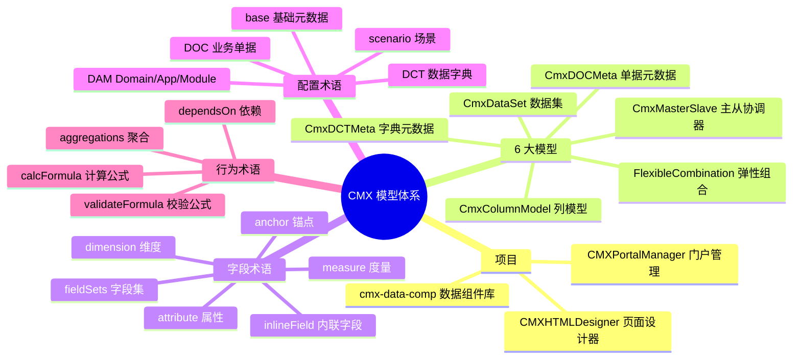

# 00 · 术语表（速读版）

> 这章是**整本书的钥匙**。把这里的名词先认熟，后面的章节才看得不头疼。

---

## 1. 项目相关

| 术语 | 是什么 | 简称 |
| --- | --- | --- |
| **CMX** | 这套低代码开发框架的总称 | 框架名 |
| **CMXPortalManager** | 门户管理端：管理菜单、字典、弹性组合等设计期元数据 | 门户端 |
| **cmx-container** | Rust 后端：原 Node 服务的替代品（`crates/libs/cmx-portal` + `crates/libs/cmx-api`），统一提供 REST API + 数据存储 | 后端 |
| **CMXHTMLDesigner** | HTML 页面可视化设计器：拖拽出业务页面 | 设计器 |
| **cmx-data-comp** | 共享数据组件库（`packages/cmx-data-comp`） | 数据组件包 |
| **portal / runtime** | 终端用户实际打开的运行页面 | 运行时 |
| **designer / design-time** | 开发者用设计器配置页面的过程 | 设计期 |

---

## 2. 模型类（6 大模型）

> 想象你做一道菜，"模型"就像"菜谱模板"——告诉你这道菜要哪些原料、怎么摆盘、放什么调料。

| 模型 | 中文 | 一句话解释 |
| --- | --- | --- |
| **CmxDataSet** | 数据集 | "一堆行"的容器，可以是树形结构（行里挂子行） |
| **CmxColumnModel** | 列模型 | 表格的"列模板"，定义有哪些列、每列怎么显示和编辑 |
| **CmxMasterSlave** | 主从协调器 | 把"主表"和"从表"绑在一起，主表选了某行，从表自动刷新 |
| **CmxDCTMeta** | 数据字典元数据 | "字典是什么"的元数据；比如"会计科目表"里有 1000 多个科目 |
| **CmxDOCMeta** | 业务单据元数据 | "单据是什么"的元数据；比如"凭证"由"表头 + 分录"组成 |
| **FlexibleCombination** | 弹性组合 | 按"上下文"（一个或多个维度值）动态生成列；比如选了"应收账款"科目，列就变 |

---

## 3. 字段 / 表格相关

| 术语 | 含义 |
| --- | --- |
| **column / 列** | 表格里的一列 |
| **columnGroup / 列组** | 把多列合成一组，可以整组合并单元格、做合计 |
| **columnModelId** | 列模型的"实例名"，运行时通过 `host.<实例名>` 访问 |
| **datasetId** | 数据集的"实例名"，同上 |
| **dimension / 维度** | 一种"分析轴"，比如"客户""产品""时间" |
| **attribute / 属性** | 维度自带的"次要字段"，比如"产品"的"规格""单位" |
| **measure / 度量** | 可输入或可计算的数值，比如"金额""数量""单价" |
| **fieldSets / 字段集** | 一组可被多张表共享的"通用字段"，写一次到处用 |
| **inlineField / 内联字段** | 在某张表里直接定义的字段（不和别表共享） |
| **anchor / 锚点** | 弹性组合里驱动列变化的"维度组合"；比如 `{account: '1122'}` |

---

## 4. 设计期编辑器名词

| 术语 | 含义 |
| --- | --- |
| **Models 面板** | 设计器里专门放"模型类"的标签页（Page Data → Models） |
| **Page Data** | 设计器里的"页面数据"区，下含 Data/Fn/Service/Flow/Deps/Interface/Models 等标签 |
| **pageFns** | 页面自定义函数（写在 Page Data → Fn 里） |
| **pageServices** | 页面发起的服务调用（写在 Page Data → Service 里） |
| **dataFlow** | Page Data → Flow 标签里的"主从数据流"配置（旧位置；新版用 Models 里的 CmxMasterSlave） |
| **DAM** | "Domain/Application/Module"——CMX 用来定位元数据存储位置的"三段路径" |
| **DCT** | "Data Dictionary"——数据字典（`dictionaryTables`） |
| **DOC** | "Document"——业务单据（`voucherTables`） |
| **base / 基础元数据** | 共享的字段集定义，可以被多张表/多个 DCT/DOC 引用 |
| **scenario** | 弹性组合的"业务场景"标识，比如 `account`（科目辅助核算） |

---

## 5. 聚合 / 计算

| 术语 | 含义 |
| --- | --- |
| **aggregations** | 主从协调器里的"自动汇总"规则：子表改了 → 主表自动算 |
| **聚合函数** | sum（求和）、avg（平均）、min、max、count |
| **calcFormula** | 列的"计算公式"，比如 `amount = qty * price` |
| **validateFormula** | 列的"校验公式"，比如 `qty > 0` |
| **dependsOn** | 计算列的"依赖项"——变了哪些就重算哪些 |
| **validations** | 一组校验规则，保存前会跑 |

---

## 6. 关键英文缩写

| 缩写 | 全称 | 含义 |
| --- | --- | --- |
| DTO | Data Transfer Object | 跨层传数据用的对象 |
| API | Application Programming Interface | 服务接口 |
| REST | Representational State Transfer | 一种 HTTP 接口风格 |
| JSON-RPC | JSON Remote Procedure Call | 一种 RPC 协议 |
| UI | User Interface | 用户界面 |
| UX | User Experience | 用户体验 |
| AST | Abstract Syntax Tree | 抽象语法树（公式求值用） |
| ESLint | - | JS 代码静态检查工具 |
| UI5 | SAP UI5 | 框架用的 UI 库（按钮、表格等） |
| Lit | - | 框架用的 Web Component 微库 |
| Vite | - | 框架用的前端构建工具 |

---

## 7. 一张图看全主要术语

---

## 小结

- **CMX 是什么** → 一套低代码框架，两个项目分别管"门户元数据"和"页面设计"
- **6 大模型** → 表格/列/主从/字典/单据/弹性组合，覆盖所有业务场景
- **DAM** → Domain/App/Module 用来定位元数据存在哪
- **DCT vs DOC** → 字典 vs 单据；DCT 描述"有哪些可选值"，DOC 描述"要填哪些字段"
- **字段三态** → dimension（选值）/ attribute（带出）/ measure（输入或计算）

---

下一步：去 [01-项目总览](01-项目总览-两个项目干什么的.md) 了解两个项目各干啥的。
