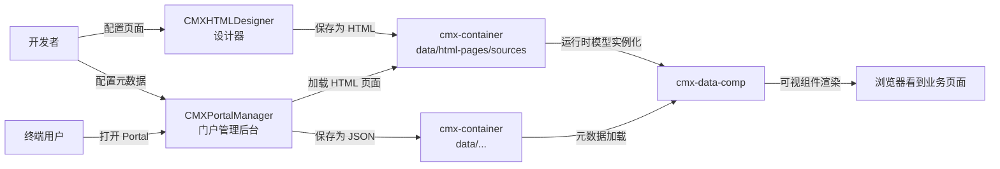

# 01 · 项目总览：CMXPortalManager 与 CMXHTMLDesigner 各自干啥

> 这一章只回答一个问题：**这两个项目分别是什么、它们之间怎么配合。**

---

## 1. 一句话总结

| 项目 | 一句话定位 |
| --- | --- |
| **CMXHTMLDesigner**（设计器） | 让开发者**拖拽**出业务页面（HTML + 脚本），不写代码也能搞定大部分工作 |
| **CMXPortalManager**（门户管理） | 让开发者**管理**菜单、字典、单据、弹性组合等**元数据**，并提供运行时 Portal 给最终用户用 |
| **cmx-data-comp**（数据组件库） | 两者共享的"积木块"——所有模型类、可视组件都从这里出 |

---

## 2. CMXHTMLDesigner（页面设计器）

### 它是干啥的？

想象你要做一个会计凭证的录入页：表头（凭证号、日期、摘要），分录行（科目、借方金额、贷方金额）。手写 HTML + JS 累不累？设计器让你：

1. 左侧拖一个 `<cmx-form>`（表单组件）到中间画布
2. 右侧 Property 面板配置这个表单的字段
3. 中间画布下方有个 "Page Data" 面板，里面有 Models 标签——在这里配置 CmxDataSet / CmxColumnModel / CmxMasterSlave / FlexibleCombination 等
4. 顶部"运行"按钮一按 → 立刻在浏览器里跑起来

### 它的技术栈

- 纯原生 JS（无 React / Vue）
- Web Components（自定义元素）
- UI5 Web Components（按钮、表格等）
- Lit（轻量 Web Component 库）
- Vite（开发服务器 / 构建工具）

### 它的目录结构（只看 src）

```
CMXHTMLDesigner/src/
├── components/                # 设计器自身的 UI 组件
│   ├── designer-app.js        # 根组件
│   ├── designer-canvas.js     # 中间画布
│   ├── designer-tree-panel.js # 左侧元素树
│   ├── designer-inspector.js  # 右侧属性面板
│   ├── designer-page-data.js  # Page Data 面板（核心：Models 标签在这里）
│   └── designer-page-data/    # 各子面板（Models 单独一个）
│       ├── page-data-panel-models.js
│       ├── models-props-*.js  # 6 个模型各自的属性编辑器
│       └── ...
├── plugins/                   # 调色板里能拖出来的"积木"
│   ├── cmx-models-plugin.js   # 6 大模型类的注册入口
│   ├── cmx-data-plugin.js
│   └── cmx-ignite-plugin.js
├── lib/                       # 工具库
├── metadata/                  # UI5 / HTML 标签的元数据
├── debug-portal/              # 内置的"轻量门户"，用来预览设计结果
└── ...
```

### 关键源码链接

- 模型注册入口：[cmx-models-plugin.js](file:///media/yqs/工作/rustspace/cmx/CMXHTMLDesigner/src/plugins/cmx-models-plugin.js)
- 模型面板主入口：[page-data-panel-models.js](file:///media/yqs/工作/rustspace/cmx/CMXHTMLDesigner/src/components/designer-page-data/page-data-panel-models.js)
- 入口文件：[main.js](file:///media/yqs/工作/rustspace/cmx/CMXHTMLDesigner/src/main.js)

---

## 3. CMXPortalManager（门户管理）

### 它是干啥的？

CMXPortalManager **不只是"运行时门户"**，它还包含**门户管理后台**（"元数据管理"）。这两个角色都在同一个项目里：

| 角色 | 干啥 | 典型功能 |
| --- | --- | --- |
| **门户管理后台** | 开发者配置整个系统的菜单、字典、弹性组合、单据定义等"基础数据" | 设计期弹性组合编辑器、定义中心（DCT/DOC 元数据编辑）、活动/通知中心 |
| **运行时 Portal** | 最终用户用这个 Portal 打开"业务页面"（设计器里设计出来的 HTML） | 多 Tab 切换、侧边栏导航、Activity Bar、Status Bar |

### 它的目录结构

```
CMXPortalManager/src/
├── components/                     # UI 组件
│   ├── portal-app.js               # Portal 根组件
│   ├── portal-shellbar.js          # 顶部 Shell
│   ├── portal-side-nav-*.js        # 侧边栏各 Tab
│   ├── portal-content-area-*.js    # 中间内容区
│   ├── portal-workspace-*.js       # 工作区（打开 HTML 页面）
│   ├── portal-flexible-combination-manager.js   # 弹性组合编辑器
│   ├── portal-definition-manager.js              # DCT/DOC 定义中心
│   └── ...
├── lib/                            # mainapp / workspace / auth / API
├── api/                            # 前端 API 客户端
└── ...
CMXPortalManager/                     # 门户管理端（纯前端，Vite + Lit）
├── src/                              # 源代码
│   ├── components/                   # 组件库（见上）
│   ├── lib/                          # mainapp / workspace / auth / API
│   ├── api/                          # 前端 API 客户端
│   └── ...
cmx-container/                       # Rust 后端（替代原 Node 服务）
├── crates/libs/cmx-portal/           # 业务实现（DAM / FACT / HELP / 模型中心 / Launcher / AI Agent 等）
├── crates/libs/cmx-api/              # axum HTTP 路由 + Handler
├── crates/libs/cmx-model/            # 模型中心：definitions / flexible_combination / dict
├── data/                             # 本地数据存储（活动/菜单/HTML 页面/工作区节点/字典/单据等）
├── config/                           # TOML 配置
└── web/                              # 静态资源 + 内置 web-server
```

### 关键源码链接

- 弹性组合编辑器：[portal-flexible-combination-manager.js](file:///media/yqs/工作/rustspace/cmx/CMXPortalManager/src/components/portal-flexible-combination-manager.js)
- 定义中心：[portal-definition-manager.js](file:///media/yqs/工作/rustspace/cmx/CMXPortalManager/src/components/portal-definition-manager.js)
- 入口：[main.js](file:///media/yqs/工作/rustspace/cmx/CMXPortalManager/src/main.js)
- 后端入口：[web-server/src/main.rs](file:///media/yqs/工作/rustspace/cmx/cmx-container/crates/web/web-server/src/main.rs)
- 模型中心：[cmx-model/src/lib.rs](file:///media/yqs/工作/rustspace/cmx/cmx-container/crates/libs/cmx-model/src/lib.rs)

---

## 4. cmx-data-comp（共享数据组件库）

### 它是干啥的？

两个项目都需要用到的"模型类 + 可视组件"，抽出来做成一个 npm 包。

| 内容 | 在哪 |
| --- | --- |
| 模型类 | `packages/cmx-data-comp/src/lib/`（CmxDataSet、CmxColumnModel、CmxMasterSlave、CmxDCTMeta、CmxDOCMeta、CmxFlexibleCombination...） |
| 可视组件 | `packages/cmx-data-comp/src/components/`（`<cmx-form>`、`<cmx-revo-grid>`、`<cmx-web-treeview>`...） |
| 公式/校验引擎 | `formula-eval.js`、`flexible-combination-engine.js` |
| 字段类型注册表 | `cmx-field-schema.js`、`cmx-field-ui.js` |

### 关键源码链接

- 运行时模型初始化入口（把设计器保存的 `models` 数组变成真实对象）：[init-page-models.js](file:///media/yqs/工作/rustspace/cmx/packages/cmx-data-comp/src/lib/init-page-models.js)
- CmxMasterSlave 实现：[cmx-master-slave.js](file:///media/yqs/工作/rustspace/cmx/packages/cmx-data-comp/src/lib/cmx-master-slave.js)

---

## 5. 三个项目怎么配合



简单说：

- **CMXHTMLDesigner** 输出"HTML 页面（带 `__designer_meta__` 元数据）"保存到后端
- **CMXPortalManager** 在浏览器里把这些 HTML 页面加载、运行、渲染
- **cmx-data-comp** 是运行时的"模型+组件"实现，桥接"元数据"与"真实 UI"

---

## 6. 三者关系对比

| 维度 | CMXHTMLDesigner | CMXPortalManager | cmx-data-comp |
| --- | --- | --- | --- |
| 角色 | 设计器 | 门户（管理 + 运行时） | 数据组件库 |
| 用户 | 开发者 | 开发者 + 终端用户 | 两个项目共用 |
| 输出 | HTML 页面（含元数据） | 元数据 + 加载容器 | 模型类 + 组件 |
| 主入口 | `designer-app.js` | `portal-app.js` | `index.js` |
| 包大小 | 大（设计器本身复杂） | 大（管理 UI + 运行时） | 中（只放模型和组件） |

---

## 小结

- **CMXHTMLDesigner** = 设计器，拖拽出 HTML 页面
- **CMXPortalManager** = 门户管理后台 + 运行时 Portal
- **cmx-data-comp** = 共享模型 + 组件
- 三个项目**配合工作**：设计器出页面 → 门户加载页面 → 共享库实现模型

---

下一步：去 [02-模型体系全景图](02-模型体系全景图.md) 看一张大图把 6 大模型和视图组件串起来。
