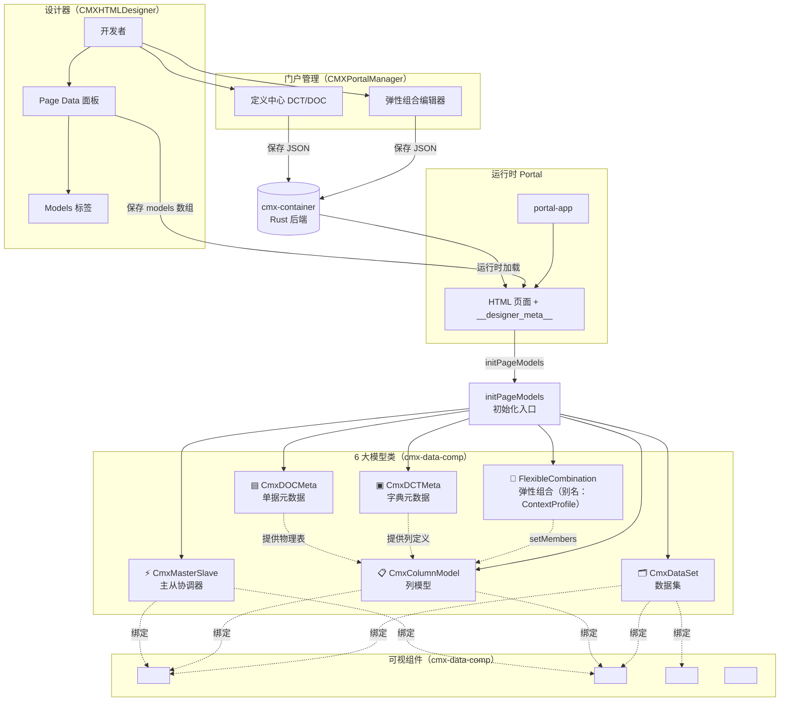
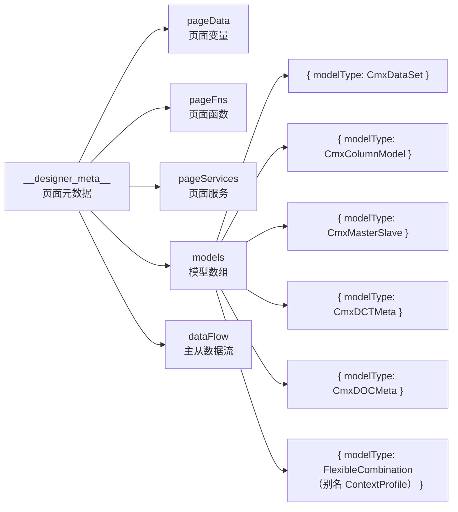
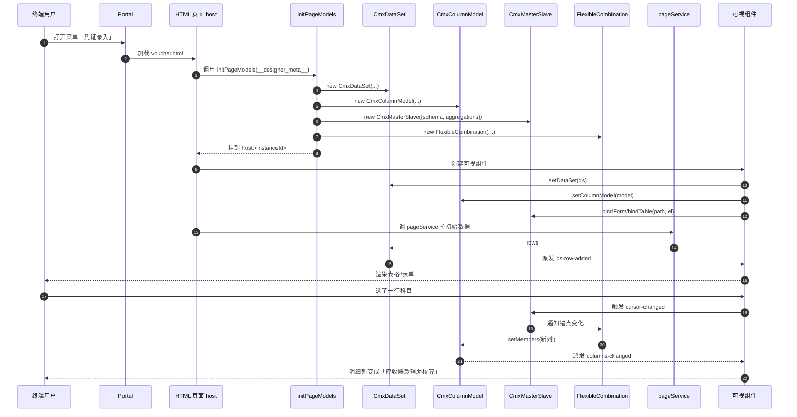

# 02 · 模型体系全景图

> 用一张图把 6 大模型、可视组件、Portal 容器之间的关系画清楚。

---

## 1. 总览图

---

## 2. 6 大模型在"页面数据"中的位置

---

## 3. 模型如何对应到可视组件

| 模型 | 通常绑定的可视组件 | 怎么绑 |
| --- | --- | --- |
| CmxDataSet | `<cmx-revo-grid>`、`<cmx-form>`、`<cmx-web-treeview>` | `el.setDataSet(ds)` |
| CmxColumnModel | `<cmx-revo-grid>`、`<cmx-form>` | `el.setColumnModel(model)` |
| CmxMasterSlave | 一个或多个 Form / Grid（按 `path` 区分） | `ms.bindForm(path, formEl)` / `ms.bindTable(path, gridEl)` |
| CmxDCTMeta | 不直接绑定 UI；提供"列定义来源"给 CmxColumnModel | 加载 JSON → 提取 columns → 写 ColumnModel |
| CmxDOCMeta | 同上 | 同上 |
| FlexibleCombination | 写**目标** CmxColumnModel（`columnModelId` 指定） | 引擎 → setMembers → 派发 `columns-changed` |

> ⚠️ **6 大模型里 FlexibleCombination 又叫 `ContextProfile`**——这是早期设计稿和 AI 知识库（`.qoder/repowiki/zh/`）里用的名字。代码里类名是 `CmxFlexibleCombination`，`__designer_meta__.models[i].modelType` 字符串写 `"FlexibleCombination"`，但部分 AI 提示词/工具（如 `SaveForm` 工具说明）里仍按 `ContextProfile` 列举。见 [15-术语表-ContextProfile](15-术语表-详细版.md#contextprofile--弹性组合的别名)。

---

## 4. 一条完整的链路（用户在 Portal 里看到的）

---

## 5. 设计期 vs 运行期（对照）

| 维度 | 设计期 | 运行期 |
| --- | --- | --- |
| 在哪 | CMXHTMLDesigner | CMXPortalManager |
| 干啥 | 开发者拖拽 + 填字段 | 终端用户录入数据 |
| 6 大模型 | 在 Models 面板里以"卡片"形式编辑 | 真实对象实例化后挂到 `host.<instanceId>` |
| CmxDataSet | 配 `dataSource` / `children` | 装填真实行数据 |
| CmxColumnModel | 配 `columns` / `columnGroups` | 被 FlexibleCombination 改写 |
| CmxMasterSlave | 配 `schema` / `aggregations` | 自动跑聚合 + 协调选中和编辑 |
| CmxDCTMeta | 粘贴后端 JSON | 提供字段定义 |
| CmxDOCMeta | 粘贴后端 JSON | 提供物理表定义 |
| FlexibleCombination | 配 DAM/scenario/inlineData | 监听锚点变化 → 重写目标列模型 |

---

## 小结

- **设计器输出元数据 → Portal 加载并运行 → 共享库实现模型**
- **6 大模型 = 6 种"业务数据形状"**，每种都有自己的运行时职责
- **可视组件只是"画皮"，模型才是"骨架"**——同一个 `<cmx-revo-grid>` 挂不同的列模型就显示不同的列

---

下一步：去 [03-模型面板](03-模型面板-在设计器里怎么配.md) 看设计器里 Models 面板长啥样。
