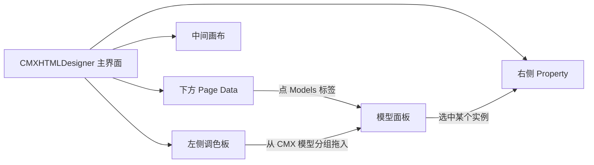
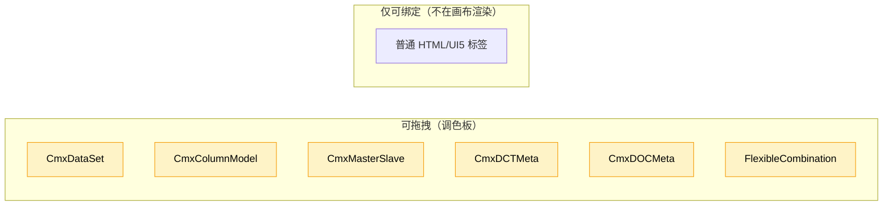
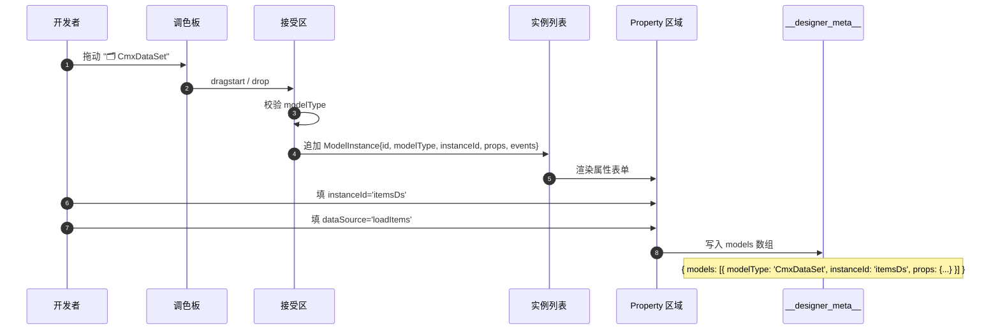

# 03 · 模型面板——在设计器里怎么配

> 带你走一遍 CMXHTMLDesigner 里"模型"是怎么被配出来的。

---

## 1. 怎么打开 Models 面板



1. 设计器主界面下方有"Page Data"区
2. 切到 **Models** 标签 → 看到模型面板
3. 左侧调色板里有一个分组叫 **CMX 模型**，里面有 6 个图标
4. 把图标拖到下方 Models 面板的"接受区" → 就多了一个模型实例卡片
5. 点卡片 → 右侧 Property 区显示该模型的详细属性

---

## 2. 调色板里的 6 个模型

| 图标 | 模型类型 | 颜色 | 默认实例名前缀 |
| --- | --- | --- | --- |
| 🗂 | CmxDataSet | 蓝 | `ds` |
| 📋 | CmxColumnModel | 绿 | `model` |
| ⚡ | CmxMasterSlave | 橙 | `ms` |
| ▣ | CmxDCTMeta | 青 | `dctMeta` |
| ▤ | CmxDOCMeta | 蓝 | `docMeta` |
| 🧭 | FlexibleCombination | 紫 | `flexibleCombination` |

> 注意：这些图标在源码里是 emoji 字符（见 `page-data-panel-models.js:36-41`），真实渲染时会被替换为对应颜色的小标签。

---

## 3. 模型实例卡片长啥样

```text
┌────────────────────────────────────┐
│  🗂  CmxDataSet          [×]       │
│  └─ ds1 ← 默认实例名               │
└────────────────────────────────────┘
```

- 🗂 图标 + 模型类型文字（带颜色）
- 实例名（运行时通过 `host.<实例名>` 访问）
- × 删除按钮
- 点击卡片本身（除删除按钮外）→ 选中 → 右侧 Property 区出现属性表单

---

## 4. 每个模型的"属性表单"在哪

属性表单出现在右侧 **Property** 区域，按模型类型分到不同 builder：

| 模型 | 属性 builder 文件 |
| --- | --- |
| CmxDataSet | [models-props-dataset.js](file:///media/yqs/工作/rustspace/cmx/CMXHTMLDesigner/src/components/designer-page-data/models-props-dataset.js) |
| CmxColumnModel | [models-props-columnmodel.js](file:///media/yqs/工作/rustspace/cmx/CMXHTMLDesigner/src/components/designer-page-data/models-props-columnmodel.js) |
| CmxMasterSlave | [models-props-masterslave.js](file:///media/yqs/工作/rustspace/cmx/CMXHTMLDesigner/src/components/designer-page-data/models-props-masterslave.js) |
| CmxDCTMeta | [models-props-meta.js](file:///media/yqs/工作/rustspace/cmx/CMXHTMLDesigner/src/components/designer-page-data/models-props-meta.js) |
| CmxDOCMeta | 同上（共用 builder） |
| FlexibleCombination | [models-props-flexible-combination.js](file:///media/yqs/工作/rustspace/cmx/CMXHTMLDesigner/src/components/designer-page-data/models-props-flexible-combination.js) |

> 简单模型（DataSet、FlexibleCombination）只在 Property 区域显示一段"提示文本"——它们的实际配置在画布右侧更深的 Property 区域（具体是哪个文件后面章节会讲）。

---

## 5. 模型面板的下半部分

选中模型后，下半部分有**两个 Tab**：

| Tab | 干啥 |
| --- | --- |
| **属性** | 改模型的字段（如 `domain` / `scenario` / `columns`） |
| **事件** | 给模型的某个事件写处理脚本（`function(event, host) { ... }`） |

事件清单见 [11-模型事件与脚本](11-模型事件与脚本.md)。

---

## 6. 拖拽支持的模型 vs 普通标签



**关键点**：6 大模型在调色板注册时都带 `modelOnly: true`——意思是"你只能拖到 Models 面板，不能拖到画布"。它们是**不可视**的。

> 源码参考：[cmx-models-plugin.js:48-115](file:///media/yqs/工作/rustspace/cmx/CMXHTMLDesigner/src/plugins/cmx-models-plugin.js#L48-L115)，每个 component 都有 `modelOnly: true`。

---

## 7. 完整的添加流程



---

## 8. 实际看到的样子（伪截图）

```text
┌─ Page Data ──────────────────────────────────────────────┐
│  [Data] [Fn] [Service] [Flow] [Deps] [Interface] [Models]│ ← 切到 Models
├──────────────────────────────────────────────────────────┤
│                                                          │
│   🗂 CmxDataSet                                         │
│   ┌────────────────────────────────────────────────┐     │
│   │ 🗂  CmxDataSet    itemsDs           [×]         │     │ ← 拖入的实例
│   │ 🗂  CmxDataSet    detailDs         [×]         │     │
│   │ [+ 拖一个模型到这里]                              │     │
│   └────────────────────────────────────────────────┘     │
│                                                          │
│  ────── 已选中: itemsDs ──────                            │
│                                                          │
│  [属性] [事件]                                            │
│  ───── 属性 ─────                                        │
│  实例名: [itemsDs        ]                                │
│  数据来源: [loadItems   ]                                 │
│  调用时机: [onInit ▾]                                     │
│  ...                                                      │
└──────────────────────────────────────────────────────────┘
```

---

## 小结

- **打开路径**：设计器主界面 → 下方 Page Data → Models 标签
- **6 个图标** = 6 大模型类，全部带 `modelOnly: true`，只能拖到 Models 面板
- **每个模型** 都有自己的 Property 表单（在右下方）
- **属性 + 事件** = 两个 Tab，事件写处理脚本
- **所有配置最终写到** `__designer_meta__.models` 数组

---

下一步：去 [04-字典模型 CmxDCTMeta](04-字典模型-CmxDCTMeta.md) 看第一个模型怎么填字段。
