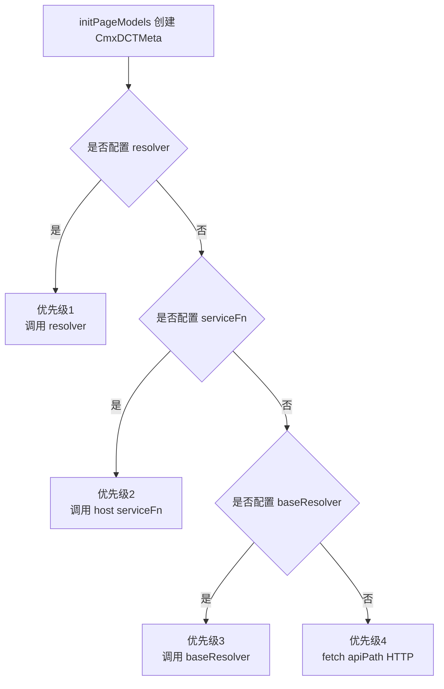
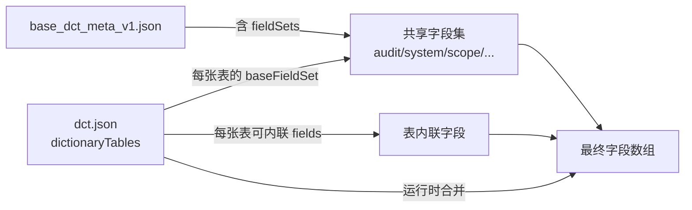
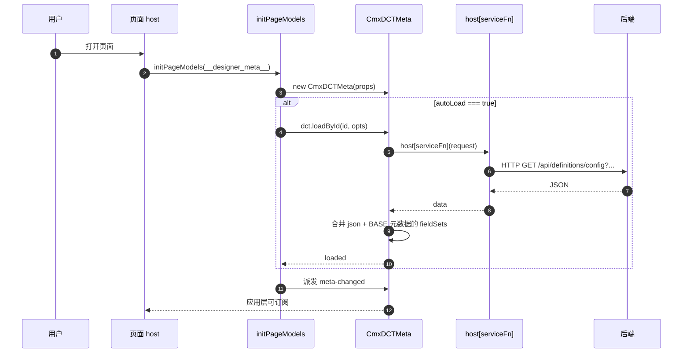

# 04 · 字典模型 CmxDCTMeta

> 本章详解 CmxDCTMeta：怎么用、字段含义、数据结构、加载流程。

---

## 1. 它是啥

> CmxDCTMeta 是**"数据字典"的元数据模型**。你可以把它想成"描述一本字典的目录"——告诉程序"这本字典里有哪几张表、每张表有哪些字段、字段之间能组成什么字段集"。

它在 Models 面板里以 **▣ CmxDCTMeta** 图标出现，是不可视的——只用于"加载后端返回的 JSON 元数据 + 提供字段定义给其他模型"。

---

## 2. 一句话与典型用途

- **一句话**：CmxDCTMeta = "加载 + 访问" 数据字典元数据的容器
- **典型用途**：
  1. 后端 `/api/definitions/config?kind=DCT&file=xxx` 返回一个大 JSON
  2. CmxDCTMeta 把这个 JSON 加载进来，按 `dictionaryTables` 暴露成 `getDictionary(dictCode)` 这种 API
  3. 业务页里 `dctMeta.getField('gl_account', 'code')` 就能拿到某字典某字段的属性

---

## 3. 构造参数（props）完整字段表

字段名是 `props.xxx`（在设计器的 Property 区域配置）。CmxDCTMeta 继承自基类 `CmxBaseMeta`（[cmx-meta-model.js](file:///media/yqs/工作/rustspace/cmx/packages/cmx-data-comp/src/lib/cmx-meta-model.js)），所有 props 由基类统一处理。

### 3.1 设计器面板常用字段

| 字段 | 类型 | 必填 | 默认值 | 说明 |
| --- | --- | --- | --- | --- |
| `id` / `metaId` / `file` | string | 是 | `''` | 元数据文件 id，三者联动（设置 `id` 时同步赋值 `metaId` 和 `file`）。例如 `cmxfico_dct_meta_v3.json` |
| `domain` | string | 否 | `''` | 业务域，例如 `base`、`fi` |
| `module` | string | 否 | `''` | 模块名，例如 `gl` |
| `apiPath` | string | 否 | `/api/definitions/config` | 元数据加载 API |
| `baseApiPath` | string | 否 | 同 `apiPath` | 基础字段集加载 API |
| `serviceFn` | string | 否 | `''` | 可选，自定义加载函数（pageService 名） |
| `baseServiceFn` | string | 否 | `''` | 可选，基础字段集自定义加载函数 |
| `autoLoad` | boolean | 否 | `false` | 设计器运行时初始化后是否自动加载 |
| `json` | object | 否 | `{}` | 直接粘贴的元数据 JSON（不通过 API，传入了就触发 `load()`） |
| `fieldSets` | object | 否 | `{}` | 直接粘贴的共享字段集 JSON（BASE 元数据的 `fieldSets` 部分；传入了就触发 `mergeFieldSets()`） |

> 来源：[models-props-meta.js](file:///media/yqs/工作/rustspace/cmx/CMXHTMLDesigner/src/components/designer-page-data/models-props-meta.js)

### 3.2 基类扩展字段（代码可配，设计器面板不暴露）

| 字段 | 类型 | 默认值 | 说明 |
| --- | --- | --- | --- |
| `backendPath` | string | `''` | 后端绝对全路径（批量响应回填时用） |
| `backendRelPath` | string | `''` | 相对 definitions 根的路径（`/` 分隔） |
| `sourceName` | string | `''` | 来源名称 |
| `moduleCode` | string | `''` | 元数据编码（`load()` 后从 JSON 的 `moduleMeta.moduleCode` 更新） |
| `version` | string/number | `''` | 版本（`load()` 后从 JSON 的 `moduleMeta.version` 更新） |
| `remark` | string | `''` | 备注（`load()` 后从 JSON 的 `moduleMeta.remark` 更新） |
| `resolver` | function | `null` | **最高优先级**：自定义元数据加载器 `(request) => Promise<json>` |
| `baseResolver` | function | `null` | 自定义字段集加载器 `(request) => Promise<baseJson>` |

> 来源：[cmx-meta-model.js](file:///media/yqs/工作/rustspace/cmx/packages/cmx-data-comp/src/lib/cmx-meta-model.js)

### 3.3 CmxDCTMeta 硬编码常量

CmxDCTMeta 构造时固定传入基类 3 个参数（不可配）：

| 参数 | 值 | 含义 |
| --- | --- | --- |
| `kind` | `'DCT'` | 元数据类型标识 |
| `tableProp` | `'dictionaryTables'` | JSON 中字典表数组的键名 |
| `metaProp` | `'moduleMeta'` | JSON 中模块元数据的键名 |

> 来源：[cmx-dct-meta.js](file:///media/yqs/工作/rustspace/cmx/packages/cmx-data-comp/src/lib/cmx-dct-meta.js)

---

## 4. 数据结构（`json` 里装什么）

`json` 字段对应后端返回的 DCT 元数据 JSON。以真实文件 [cmxfico_dct_meta_v3.json](file:///media/yqs/工作/rustspace/cmx/cmx-container/data/meta/definitions/fi/cmxfico/gl/cmxfico_dct_meta_v3.json) 为例，完整结构如下。

### 4.1 顶层键（5 个）

```jsonc
{
  "moduleMeta":              { /* ① 文件自身元信息 */ },
  "baseDctMetaRef":          { /* ② 引用 base 字段集 */ },
  "dictionaryTableConventions": { /* ③ 命名约定（注释性） */ },
  "dictionaryTables":        [ /* ④ 32 张业务字典 */ ],
  "updatedAt":               "2026-07-12T01:31:02.113Z"  // ⑤ 更新时间
}
```

| 顶层键 | 类型 | 含义 |
| --- | --- | --- |
| `moduleMeta` | object | 文件自身元信息（编码、名称、版本等） |
| `baseDctMetaRef` | object | 引用 base_dct_meta 文件的配置 |
| `dictionaryTableConventions` | object | 命名约定（注释性，无运行时意义） |
| `dictionaryTables` | array | **核心**：32 张业务字典表数组 |
| `updatedAt` | string | ISO 时间戳 |

### 4.2 `moduleMeta`（文件自身元信息）

| 字段 | 类型 | 含义 | 真实值 |
| --- | --- | --- | --- |
| `moduleCode` | string | 业务模块代号 | `"FICO"` |
| `moduleName` | string | 业务模块名 | `"cmx-fico 总账"` |
| `metaKind` | string | 文件类型 | `"DCT"` |
| `metaName` | string | 文件标题 | `"cmx-fico 会计凭证数据字典元数据"` |
| `version` | int | 版本号（对应文件名 `_v3`） | `3` |
| `designStyle` | string | 设计风格 | `"separate-dictionary-tables"`（SAP 风格，一张字典一张表） |
| `remark` | string | 备注 | 解释这个文件"是什么、覆盖什么" |
| `versionName` | string | 版本名 | `""`（可空） |
| `isDefault` | boolean | 同 stem 多版本时是否默认 | `true` |

### 4.3 `baseDctMetaRef`（引用基础字段集）

```jsonc
{
  "file":       "base_dct_meta_v1.json",   // 引用的 base 文件名
  "version":    1,                          // base 文件版本
  "fieldSets":  [                           // 本文件用到的字段集名列表
    "dictionaryCommonFields",
    "dictionaryHierarchyFields",
    "dictionaryAuditFields",
    "dictionaryEffectiveFields",
    "dictionaryDisableFields",
    "dictionarySystemFields"
  ],
  "remark":     "复用 base_dct_meta_v1.json fieldSet"
}
```

| 字段 | 类型 | 含义 |
| --- | --- | --- |
| `file` | string | 引用的 base 文件名 |
| `version` | int | base 文件版本 |
| `fieldSets` | string[] | 本文件用到的字段集名列表（值必须在 base 文件的 `fieldSets` 顶层键中存在） |
| `remark` | string | 备注 |

> `fieldSets` 列出的名字是"声明本文件可能用到哪些"，单张字典表通过 `baseFieldSet` 等字段**具体引用**其中某一个。详见 [06-基础元数据](06-基础元数据-BASE是什么.md)。

### 4.4 `dictionaryTableConventions`（命名约定）

**注释性**字段，没有运行时意义：

```jsonc
{ "remark": "参考 SAP 字典;辅助核算行用其中主数据..." }
```

### 4.5 `dictionaryTables[]`（核心：32 张字典表）

每张字典表是一个对象，含 **dictMeta / fields / 引用配置** 三大块。

#### 4.5.1 `dictMeta`（字典元信息）

| 字段 | 类型 | 必填 | 含义 | 真实值 |
| --- | --- | --- | --- | --- |
| `dictCode` | string | 是 | 字典代号（全局唯一） | `"client"` / `"gl_account"` / `"comp_unit"` |
| `dictName` | string | 是 | 字典中文名 | `"客户端"` / `"总账科目"` |
| `dictKind` | string | 是 | 字典种类 | `"BUSINESS"`（业务）/ `"CLASSIFY"`（分类）/ `"GROUP"`（分组） |
| `selfHierarchy` | boolean | 是 | 是否有内部父子层级 | `true`（如 gl_account）/ `false` |
| `tableName` | string | 是 | 物理表名 | `"cf_client"` / `"cf_gl_account"` |
| `idField` | string | 是 | 主键列名 | `"id"` |
| `codeField` | string | 是 | 编码列名 | `"code"` |
| `labelField` | string | 是 | 名称列名 | `"name"` |
| `parentField` | string | 否 | 父级列名（仅 `selfHierarchy: true` 时有） | `"parent_id"` |
| `remark` | string | 否 | 备注 | 用途/参考来源说明 |
| `codeLength` | int | 否 | 编码长度约束 | `3`（client）/ `10`（gl_account） |

#### 4.5.2 `fields[]`（字典内联字段定义）

每张字典表都先复用 base 字段集，再追加自己的业务字段。字段定义的**完整属性清单**（全文件并集）：

| 属性键 | 类型 | 必填 | 含义 | 例子 |
| --- | --- | --- | --- | --- |
| `id` | string | 是 | 字段逻辑 id（= 落库列名） | `"company_id"` |
| `name` | string | 是 | 字段名（通常与 id 相同） | `"company_id"` |
| `dataType` | string | 是 | 数据类型 | `"VARCHAR"` / `"BIGINT"` / `"INT"` / `"TINYINT"` / `"DECIMAL"` / `"DATE"` / `"DATETIME"` / `"TEXT"` |
| `fieldLength` | int | 否 | 字符串/数字总位数 | `20` / `64` / `128` |
| `intDigits` | int | 否 | 数值字段整数部分位数 | `20` |
| `decimalDigits` | int | 否 | 数值字段小数部分位数 | `0` / `2` |
| `nullable` | boolean | 否 | 是否可空 | `true` / `false` |
| `caption` | object | 是 | 多语言标题 | `{ "zh_CN": "集团合并主体" }` |
| `dimType` | string | 否 | 字段三态 | `"dimension"` / `"attribute"` / `"measure"`（详见 [18 章](18-维度概念详解.md)） |
| `edit` | object | 否 | 编辑控制 | `{ "mode": "input" }` / `{ "mode": "checkbox" }` / `{ "mode": "number" }` / `{ "mode": "select" }` |
| `refDict` | string | 否 | 引用字典的 dictCode | `"company"` / `"currency"` / `"coa"` |
| `refField` | string | 否 | 引用字典的哪一列 | `"code"` / `"id"` |
| `displayField` | string | 否 | 显示值从字典的哪一列取 | `"name"` |
| `physicalField` | string | 否 | 兼容物理列名（SAP 字段名） | `"MANDT"` / `"BUKRS"` / `"LOGSYS"` |
| `isPrimaryKey` | int | 否 | 是否主键（0/1） | `1` |
| `agg` | string | 否 | 聚合方式（配 `dimType: "measure"`） | `"sum"` / `"avg"` / `"min"` / `"max"` / `"count"` |

**真实例子**（comp_unit 表引用 company 字典）：

```jsonc
{
  "dataType":      "BIGINT",
  "nullable":      true,
  "dimType":       "attribute",
  "refDict":       "company",          // ← 引用 company 字典
  "refField":      "code",             // ← 关联到 company.code
  "displayField":  "name",             // ← 显示时取 company.name
  "id":            "company_id",
  "name":          "company_id",
  "caption":       { "zh_CN": "集团合并主体" },
  "physicalField": "BUKRS"             // ← SAP 字段名（迁移/集成用）
}
```

#### 4.5.3 表级别引用配置（`fields[]` 之后的字段）

每张字典表除了 `dictMeta` 和 `fields`，还有以下表级别配置键：

| 键名 | 类型 | 含义 | 引入的字段集 |
| --- | --- | --- | --- |
| `baseFieldSet` | string | 基础列（id/code/name/sort_no/status） | `dictionaryCommonFields` 或 `dictionaryCommonNoIDFields` |
| `hierarchyFieldSet` | string | 层级列（仅 `selfHierarchy: true` 时用） | `dictionaryHierarchyFields` 或 `dictionaryHierarchyNoIDFields` |
| `auditFieldSet` | string | 审计列（create_by/create_time/update_by/update_time） | `dictionaryAuditFields` |
| `effectiveFieldSet` | string | 生效期列（effective_from/effective_to） | `dictionaryEffectiveFields` |
| `disableFieldSet` | string | 停用信息列（disabled_reason/disabled_time） | `dictionaryDisableFields` |
| `systemFieldSet` | string | 系统预置列（is_system） | `dictionarySystemFields` |
| `scopeFieldSet` | string | 数据范围列（scope_type/entity_id） | `dictionaryScopeFields` |
| `permissionScope` | string | 权限范围 | `"global"` / `"acct_entity"` |
| `codeRule` | object | 编码规则（见下） | - |
| `uniqueKeys` | array | 唯一键约束（见下） | - |

> **字段集引用键常量**：基类 `CmxBaseMeta` 识别以下 7 个键（[cmx-meta-model.js](file:///media/yqs/工作/rustspace/cmx/packages/cmx-data-comp/src/lib/cmx-meta-model.js) 中的 `DCT_FIELD_SET_KEYS`）：
> ```js
> const DCT_FIELD_SET_KEYS = [
>   'baseFieldSet', 'hierarchyFieldSet', 'auditFieldSet',
>   'scopeFieldSet', 'effectiveFieldSet', 'disableFieldSet', 'systemFieldSet',
> ]
> ```
> 值必须是 `baseDctMetaRef.fieldSets` 列表里声明的字段集名。

#### 4.5.4 `codeRule`（编码规则）

| 子字段 | 类型 | 含义 | 例子 |
| --- | --- | --- | --- |
| `mode` | string | 编码模式 | `"manual"`（人工输入）/ `"auto"`（自动生成）/ `"auto-serial"`（前缀+流水） |
| `field` | string | 编码字段名 | `"code"` |
| `pattern` | string | 编码正则 | `"^[0-9]{1,3}$"` / `"^[A-Za-z0-9_.-]{1,6}$"` |
| `uniqueCheck` | boolean | 是否全局唯一 | `true` |

#### 4.5.5 `uniqueKeys`（唯一键约束）

```jsonc
"uniqueKeys": [
  ["code"]              // 单字段唯一：code 不可重复
  // 或
  ["coa_id", "code"]    // 组合唯一：同一科目表下 code 不重复
]
```

### 4.6 真实文件顶层结构总览

以 [cmxfico_dct_meta_v3.json](file:///media/yqs/工作/rustspace/cmx/cmx-container/data/meta/definitions/fi/cmxfico/gl/cmxfico_dct_meta_v3.json) 为例（2854 行，32 张字典）：

```jsonc
{
  "moduleMeta": { "moduleCode": "FICO", "moduleName": "cmx-fico 总账", "metaKind": "DCT", "metaName": "cmx-fico 会计凭证数据字典元数据", "version": 3, ... },
  "baseDctMetaRef": { "file": "base_dct_meta_v1.json", "fieldSets": [6 个], ... },
  "dictionaryTableConventions": { "remark": "..." },
  "dictionaryTables": [
    { "dictMeta": { "dictCode": "client", ... }, "fields": [...], "baseFieldSet": "...", ... },
    { "dictMeta": { "dictCode": "company", ... }, "fields": [...], "baseFieldSet": "...", ... },
    { "dictMeta": { "dictCode": "comp_unit", ... }, "fields": [...], ... },
    { "dictMeta": { "dictCode": "gl_account", "selfHierarchy": true, ... }, "fields": [...], "hierarchyFieldSet": "...", ... },
    // ... 共 32 张
  ],
  "updatedAt": "2026-07-12T01:31:02.113Z"
}
```

> 详细的 JSON 字段解析见 [17-元数据 JSON 文件字段详解](17-元数据JSON文件字段详解.md)。

---

## 5. 加载方式（4 种优先级）



> 4 种来源按优先级链式尝试：用户 resolver（最高）→ serviceFn → baseResolver → 内置 fetch（兜底）。任一环节抛错则 `console.warn` 后继续下一环。

### 5.1 构造参数与默认请求

```js
const dct = new CmxDCTMeta({
  id: 'gl_md_dct_meta_v1.json',
  domain: 'fi',
  module: 'gl',
  // apiPath / baseApiPath 都有默认值
})

// 默认请求体：
// GET /api/definitions/config?kind=DCT&id=...&domain=...&module=...&file=...
```

### 5.2 三种使用方式

```js
// 方式 1：直接拿 JSON（设计期/测试）
dct.load(json)

// 方式 2：按 id + 自动推断 base
await dct.loadById('gl_md_dct_meta_v1.json', { domain: 'fi', module: 'gl' })

// 方式 3：批量
const bundle = await loadMetaBatch([
  { domain: 'fi', module: 'gl', file: 'gl_md_dct_meta_v1.json' }
], { host })
```

---

## 6. API 完整速查

CmxDCTMeta 继承自 `CmxBaseMeta`（[cmx-meta-model.js](file:///media/yqs/工作/rustspace/cmx/packages/cmx-data-comp/src/lib/cmx-meta-model.js)），大部分方法来自基类。

### 6.1 属性

| 属性 | 类型 | 作用 |
| --- | --- | --- |
| `model.kind` | string | 元数据类型（`'DCT'`） |
| `model.id` | string | 元数据 ID |
| `model.domain` | string | 业务域 |
| `model.module` | string | 模块名 |
| `model.file` | string | 文件名 |
| `model.moduleCode` | string | 元数据编码（`load()` 后更新） |
| `model.version` | string/number | 版本（`load()` 后更新） |
| `model.remark` | string | 备注（`load()` 后更新） |
| `model.apiPath` | string | API 路径 |
| `model.baseApiPath` | string | 字段集 API 路径 |
| `model.autoLoad` | boolean | 自动加载标志 |
| `model.resolver` | function | 自定义加载器 |
| `model.baseResolver` | function | 自定义字段集加载器 |
| `model.meta` | object | 顶层 `moduleMeta` 摘要（getter，冻结） |
| `model.raw` | object | 冻结后的完整原始 JSON（getter） |

### 6.2 数据访问方法

| 方法 | 签名 | 作用 |
| --- | --- | --- |
| `getTable` | `getTable(id)` | 按编码取一张表（返回 `CmxMetaTable`） |
| `listTables` | `listTables()` | 所有表（返回 `CmxMetaTable[]`） |
| `getFieldSet` | `getFieldSet(id)` | 按 id 取某个字段集（返回 `CmxMetaFieldSet`） |
| `listFieldSets` | `listFieldSets()` | 所有字段集（返回 `CmxMetaFieldSet[]`） |
| `getField` | `getField(tableId, fieldId)` | 取某表某字段对象 |
| `getFieldRef` | `getFieldRef(tableId, fieldId)` | 取某表某字段的引用（`CmxMetaFieldRef`，轻量） |
| `listFields` | `listFields(tableId, opts?)` | 展开后的字段数组（合并字段集 + 内联） |
| `listFieldRefs` | `listFieldRefs(tableId, opts?)` | 字段引用数组（`CmxMetaFieldRef[]`，轻量） |
| `getPath` | `getPath(path)` | 按点分路径读取原始 JSON（如 `'moduleMeta.version'`） |
| `toJSON` | `toJSON()` | 返回原始 JSON |
| `getSummary` | `getSummary()` | 返回摘要 `{ kind, moduleCode, version, tables, fieldSets, inlineFields }` |

### 6.3 加载方法

| 方法 | 签名 | 作用 |
| --- | --- | --- |
| `bindHost` | `bindHost(host)` | 绑定页面 host，返回 this |
| `load` | `load(json)` | 从 JSON 对象加载元数据（同步） |
| `mergeFieldSets` | `mergeFieldSets(json)` | 合并字段集 JSON |
| `loadById` | `async loadById(id?, opts?)` | 按 id 异步加载主元数据 + 自动合并 base |
| `loadBaseById` | `async loadBaseById(baseId?, opts?)` | 单独加载 base 字段集 |
| `applyBatchItem` | `applyBatchItem(item, bases, opts?)` | 用批量响应条目就地装载 |
| `getLastLoad` | `getLastLoad()` | 最近一次加载请求摘要 |

### 6.4 DCT 专用方法

| 方法 | 签名 | 作用 |
| --- | --- | --- |
| `getDictionary` | `getDictionary(dictCode)` | 取某张字典表（基类 `getTable` 的语义别名） |
| `listDictionaries` | `listDictionaries()` | 所有字典表（基类 `listTables` 的语义别名） |

### 6.5 关联类

| 类 | 说明 | 关键属性/方法 |
| --- | --- | --- |
| `CmxMetaTable` | 表对象 | `id` / `name` / `tableName` / `kind` / `listFields()` / `getField(id)` / `listFieldSetIds()` / `listInlineFields()` / `get(prop)` / `getPath(path)` / `toJSON()` |
| `CmxMetaFieldSet` | 字段集 | `id` / `remark` / `fields` / `getField(id)` / `hasField(id)` / `listFields()` / `toJSON()` |
| `CmxMetaFieldRef` | 字段引用（轻量） | `field` / `table` / `fieldSet` / `fieldSetId` / `source` / `index` / `id` / `fieldName` / `get(prop)` / `getPath(path)` / `isFromFieldSet()` / `toJSON()` |
| `CmxMetaSummary` | 汇总表 | `id` / `name` / `caption` / `remark` / `fields` / `listFields()` / `getField(id)` / `toJSON()` |

### 6.6 模块级函数

| 函数 | 签名 | 作用 |
| --- | --- | --- |
| `registerMetaModelKind` | `registerMetaModelKind(kind, ModelClass)` | 注册 kind -> 类 映射 |
| `loadMetaBatch` | `loadMetaBatch(refs, options)` | 批量加载元数据 |
| `loadMetaModelsBatch` | `loadMetaModelsBatch(models, options)` | 批量加载已声明的模型实例 |

---

## 7. 字段集（`fieldSets`）的来龙去脉

> **字段集 = 一组可被多张表共享的字段**，写一次别处就能引用。



- `fieldSets` 是一组"通用字段集合"——比如"审计字段" `created_by, created_at, updated_by, updated_at`
- 多个 DCT/DOC 的表都可以**引用**同一个字段集（通过 `baseFieldSet` 等字段）
- 避免每张表重复定义 `created_by` 等 20 个公共字段
- **BASE 元数据**（设计器里单独一个 Tab）专门用来集中管理这些共享字段集

→ 想了解 BASE 元数据是什么，去 [06-基础元数据](06-基础元数据-BASE是什么.md)。

---

## 8. 加载时序图



---

## 9. 一个最小示例

```jsonc
// __designer_meta__.models[0]
{
  "modelType": "CmxDCTMeta",
  "instanceId": "glDctMeta",
  "props": {
    "id":         "gl_md_dct_meta_v1.json",
    "domain":     "fi",
    "module":     "gl",
    "autoLoad":   true,
    "json":       { /* 暂时为空，由 loadById 填充 */ },
    "fieldSets":  { /* 暂时为空，由 loadById 自动合并 */ }
  }
}
```

页面里这样用：

```js
// 假设已绑 host
const acct = host.glDctMeta.getDictionary('gl_account')
const codeField = host.glDctMeta.getField('gl_account', 'code')
console.log(acct.dictName, codeField.caption)
```

---

## 10. 与 CmxDOCMeta 的对比

| 维度 | CmxDCTMeta | CmxDOCMeta |
| --- | --- | --- |
| 含义 | 数据字典 | 业务单据 |
| 顶层表字段 | `dictionaryTables` | `voucherTables` |
| 表内联字段 | `fields` | `fields` |
| 字段集 | `fieldSets` | `fieldSets`（+ `voucherCommonFieldSet`） |
| DCT/DOC 专用方法 | `getDictionary` / `listDictionaries` | `getDocument` / `listDocuments` |
| 典型场景 | 选科目、选客户 | 录入凭证、录入交易 |

> 详细对比见 [05-单据模型](05-单据模型-CmxDOCMeta.md)。

---

## 11. 容易踩的坑

| 坑 | 解释 |
| --- | --- |
| 走默认 API 时 `domain` 必填 | 后端 `/api/definitions/config` 强校验，缺 `domain` 返回 400 |
| `loadById` 不传 `id` 时用构造时的 `id` | 调 `dct.loadById()` 等价 `dct.loadById(dct.id)` |
| 自动加载 base | 默认 `loadById` 会继续 `loadBaseById`；要关闭传 `loadBase: false` |
| 多个 DCT 共享 base | 设计期把 `fieldSets` 字段填相同的 JSON，或通过 `bundle` 共享 |
| DCT JSON 必须有 `dictionaryTables` 数组 | 没有就是空表，但 `summarize` 计数会是 0 |

---

## 小结

- **CmxDCTMeta** 加载并暴露"数据字典"元数据，继承自 `CmxBaseMeta`
- **构造参数**：设计器面板 10 个常用字段（`id`/`domain`/`module`/`apiPath`/`baseApiPath`/`serviceFn`/`baseServiceFn`/`autoLoad`/`json`/`fieldSets`）+ 基类 8 个扩展字段（`resolver`/`baseResolver`/`backendPath` 等）
- **JSON 顶层 5 个键**：`moduleMeta` / `baseDctMetaRef` / `dictionaryTableConventions` / `dictionaryTables` / `updatedAt`
- **每张字典表**：`dictMeta`（11 字段）+ `fields[]`（16 种属性键）+ 7 种字段集引用 + `codeRule` + `uniqueKeys` + `permissionScope`
- **API**：15 个属性 + 11 个数据访问方法 + 7 个加载方法 + 2 个 DCT 专用方法 + 4 个关联类 + 3 个模块级函数
- **DCT 字段集共享**：通过 `baseDctMetaRef` 引用 base 文件 -> 详见 [06-基础元数据](06-基础元数据-BASE是什么.md)

---

下一步：去 [05-单据模型 CmxDOCMeta](05-单据模型-CmxDOCMeta.md) 看 DOC 怎么用。
