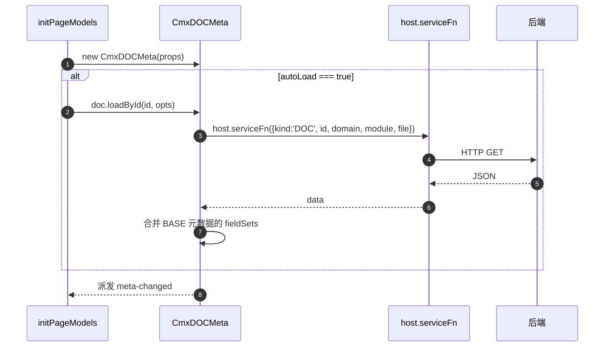

# 05 · 单据模型 CmxDOCMeta

> 本章详解 CmxDOCMeta：业务单据（凭证、交易、订单…）的元数据怎么定义和加载。

---

## 1. 它是啥

> **CmxDOCMeta = 业务单据的元数据模型**。你可以把它想成"描述一张单据由哪些表组成、每张表有哪些字段、表之间怎么关联、金额怎么聚合"。

它在 Models 面板里以 **▤ CmxDOCMeta** 图标出现，与 CmxDCTMeta 共用同一个属性 builder（[models-props-meta.js](file:///media/yqs/工作/rustspace/cmx/CMXHTMLDesigner/src/components/designer-page-data/models-props-meta.js)）。

---

## 2. 一句话与典型用途

- **一句话**：CmxDOCMeta = 加载"业务单据"元数据（多张物理表 + 关系 + 聚合 + 状态流 + 校验），给 CmxColumnModel / CmxMasterSlave / FlexibleCombination 用
- **典型用途**：
  - 一张"会计凭证"由 4 层 5 张表组成：批 -> 头 -> 科目行 -> 辅助行
  - CmxDOCMeta 加载完后，可以 `docMeta.getDocument('cv_header')` 拿到表头结构
  - 列模型可以基于"辅助行"的字段定义（`cost_center_id, amount, ...`）

---

## 3. 构造参数（props）

CmxDOCMeta 与 CmxDCTMeta **共享同一个 builder**，props 字段完全一致。完整字段表见 [04 章 §3](04-字典模型-CmxDCTMeta.md#3-构造参数props完整字段表)。

### 3.1 设计器面板常用字段（10 个）

| 字段 | 类型 | 必填 | 默认值 | 说明 |
| --- | --- | --- | --- | --- |
| `id` / `metaId` / `file` | string | 是 | `''` | 元数据文件 id，例如 `cmxfico_doc_meta_v2.json` |
| `domain` | string | 否 | `''` | 业务域 |
| `module` | string | 否 | `''` | 模块名 |
| `apiPath` | string | 否 | `/api/definitions/config` | 元数据加载 API |
| `baseApiPath` | string | 否 | 同 `apiPath` | 基础字段集加载 API |
| `serviceFn` | string | 否 | `''` | 自定义加载函数（pageService 名） |
| `baseServiceFn` | string | 否 | `''` | 基础字段集自定义加载函数 |
| `autoLoad` | boolean | 否 | `false` | 是否自动加载 |
| `json` | object | 否 | `{}` | 直接粘贴的元数据 JSON |
| `fieldSets` | object | 否 | `{}` | 直接粘贴的共享字段集 JSON（BASE 元数据的 `fieldSets` 部分） |

### 3.2 基类扩展字段（8 个）

与 CmxDCTMeta 相同：`backendPath` / `backendRelPath` / `sourceName` / `moduleCode` / `version` / `remark` / `resolver` / `baseResolver`。详见 [04 章 §3.2](04-字典模型-CmxDCTMeta.md#32-基类扩展字段代码可配设计器面板不暴露)。

### 3.3 CmxDOCMeta 硬编码常量

| 参数 | 值 | 含义 |
| --- | --- | --- |
| `kind` | `'DOC'` | 元数据类型标识 |
| `tableProp` | `'voucherTables'` | JSON 中单据表数组的键名 |
| `metaProp` | `'moduleMeta'` | JSON 中模块元数据的键名 |

> 来源：[cmx-doc-meta.js](file:///media/yqs/工作/rustspace/cmx/packages/cmx-data-comp/src/lib/cmx-doc-meta.js)

---

## 4. 数据结构（`json` 里装什么）

`json` 字段对应后端返回的 DOC 元数据 JSON。以真实文件 [cmxfico_doc_meta_v2.json](file:///media/yqs/工作/rustspace/cmx/cmx-container/data/meta/definitions/fi/cmxfico/gl/cmxfico_doc_meta_v2.json) 为例（3447 行，4 层 5 张表）。

### 4.1 顶层键（8 个）

```jsonc
{
  "moduleMeta":            { /* ① 文件自身元信息（含 DOC 专属字段） */ },
  "baseDocMetaRef":        { /* ② 引用 base 字段集 */ },
  "voucherCommonFieldSet": "documentTechnicalFields",  // ③ 全单据通用字段集名
  "voucherSchema":         { /* ④ 单据结构（schema + relations + aggregations） */ },
  "voucherTables":         [ /* ⑤ 4 层 5 张物理表 */ ],
  "voucherStatusFlow":     { /* ⑥ 单据状态机 */ },
  "updatedAt":             "2026-07-14T08:33:47.183Z", // ⑦ 更新时间
  "validationRules":       [ /* ⑧ 跨表校验规则 */ ]
}
```

| 顶层键 | 类型 | 含义 |
| --- | --- | --- |
| `moduleMeta` | object | 文件自身元信息（含 DOC 专属字段） |
| `baseDocMetaRef` | object | 引用 base_doc_meta 文件的配置 |
| `voucherCommonFieldSet` | string | 全单据最常用字段集名（所有表都引入） |
| `voucherSchema` | object | 单据形状（层级 + 主外键 + 聚合规则） |
| `voucherTables` | array | **核心**：4 层 5 张物理表 |
| `voucherStatusFlow` | object | 单据状态机（状态 + 流转 + 守卫） |
| `updatedAt` | string | ISO 时间戳 |
| `validationRules` | array | 跨表校验规则 |

### 4.2 `moduleMeta`（含 DOC 专属字段）

与 DCT 共有的 9 个字段（`moduleCode` / `moduleName` / `metaKind` / `metaName` / `version` / `designStyle` / `remark` / `versionName` / `isDefault`）详见 [04 章 §4.2](04-字典模型-CmxDCTMeta.md#42-modulemeta文件自身元信息)。

DOC **额外**4 个专属字段：

| 字段 | 类型 | 含义 | 真实值 |
| --- | --- | --- | --- |
| `organizationDict` | string | 组织隔离字典代号 | `"comp_unit"`（按公司代码隔离数据） |
| `keyDicts` | string | 关键字典代号 | `"gl_account"`（总账科目） |
| `documentTypeDict` | string | 单据类型字典代号 | `"doc_type"` |
| `versioning` | object | 版本化配置 | `{ "enabled": true }`（启用版本化，见 [16 章 §3.14](16-后端API详解.md)） |

### 4.3 `baseDocMetaRef`（引用基础字段集）

```jsonc
{
  "file":       "base_doc_meta_v1.json",
  "version":    1,
  "fieldSets":  [
    "documentIdentityFields",
    "documentSourceFields",
    "documentLifecycleFields",
    "documentTechnicalFields",
    "documentCommonFields"
  ],
  "remark":     "复用 base_doc_meta_v1.json"
}
```

| 字段 | 类型 | 含义 |
| --- | --- | --- |
| `file` | string | 引用的 base 文件名 |
| `version` | int | base 文件版本 |
| `fieldSets` | string[] | 本文件用到的字段集名列表 |
| `remark` | string | 备注 |

> base_doc_meta_v1.json 有 6 个字段集，详见 [17 章 §6](17-元数据JSON文件字段详解.md#6-基础-doc-字段集详解base_doc_meta_v1json)。

### 4.4 `voucherSchema`（单据形状）

单据的"形状"定义，含 3 个子段。

#### 4.4.1 `schema`（层级树）

二维数组，每个外层 = 一个层级；内层 = 该层并存的多个表。

```jsonc
"schema": [
  [ { "id": "cv_batch",    "kind": "list", "level": "L1", "levelName": "凭证批" } ],
  [ { "id": "cv_header",   "kind": "list", "level": "L2", "levelName": "凭证头" } ],
  [ { "id": "cv_acc_line", "kind": "list", "level": "L3", "levelName": "科目行" } ],
  [ { "id": "cv_aux_line", "kind": "list", "level": "L4", "levelName": "辅助行" },
    { "id": "cv_zycb_line","kind": "list", "level": "L4" } ]
]
```

| 字段 | 类型 | 含义 | 真实值 |
| --- | --- | --- | --- |
| `id` | string | 表 id | `"cv_batch"` / `"cv_header"` |
| `kind` | string | 节点类型 | `"list"`（列表型）/ `"single"`（单值型） |
| `level` | string | 业务层级 | `"L1"` ~ `"L4"` |
| `levelName` | string | 层级中文名 | `"凭证批"` / `"凭证头"` |

#### 4.4.2 `relations`（主外键关系）

```jsonc
"relations": [
  { "parent": "cv_batch",       "child": "headers",       "parentKey": "id", "childKey": "upper_id" },
  { "parent": "headers",        "child": "account_lines", "parentKey": "id", "childKey": "upper_id" },
  { "parent": "account_lines",  "child": "aux_lines",     "parentKey": "id", "childKey": "upper_id" }
]
```

| 字段 | 类型 | 含义 |
| --- | --- | --- |
| `parent` | string | 父表 schema id |
| `child` | string | 子表 schema id |
| `parentKey` | string | 父表关联字段（默认 `id`） |
| `childKey` | string | 子表外键字段（指向父表） |

#### 4.4.3 `aggregations`（聚合规则）

```jsonc
"aggregations": [
  { "from": "...entered_dr", "to": "上层", "field": "entered_dr", "toField": "entered_dr", "agg": "sum", "remark": "..." }
]
```

| 字段 | 类型 | 含义 |
| --- | --- | --- |
| `from` | string | 源路径（`...` = 同级及以上所有） |
| `to` | string | 目标路径（`"上层"` / 具体表 id） |
| `field` | string | 源字段 |
| `toField` | string | 目标字段 |
| `agg` | string | 聚合方式：`sum` / `avg` / `min` / `max` / `count` |
| `remark` | string | 备注 |
| `scope` | string | 范围（默认 `siblings`，可选 `all`） |

> 详见 [09 章 §3](09-主从协调器-CmxMasterSlave.md) 主从协调器对 aggregations 的处理。真实文件有 6 条聚合规则（6 币种金额逐层上卷）。

### 4.5 `voucherTables[]`（4 层 5 张表）

每张表是一个对象。

#### 4.5.1 表级别字段

| 字段 | 类型 | 含义 | 真实值 |
| --- | --- | --- | --- |
| `level` | string | 业务层级 | `"L1"` / `"L2"` / `"L3"` / `"L4"` |
| `tableName` | string | 物理表名 | `"cv_batch"` / `"cv_header"` / `"cv_acc_line"` / `"cv_aux_line"` / `"cv_zycb_line"` |
| `tableAlias` | string | 表中文别名 | `"凭证批"` / `"凭证头"` / `"凭证科目行"` / `"凭证辅助核算行"` / `"作业成本表"` |
| `fields` | array | 字段定义数组 | （见 §4.5.2） |
| `remark` | string | 备注 | 通常引用 SAP 表名 + 字段映射 |
| `documentFieldSets` | string[] | 本表**额外**引用的 base 字段集 | `["documentLevelFields", "documentIdentityFields", ...]` |
| `fieldOverrides` | object | 字段级覆盖配置 | `{ "client_code": { "refDict": "client" }, ... }` |
| `parentTable` | string | 父表名（子表才有） | `"cv_header"`（cv_acc_line 的父表） |

> **`voucherCommonFieldSet` vs `documentFieldSets`**：
> - `voucherCommonFieldSet`（顶层字符串）= 整个单据最常用的那一个字段集（默认 `"documentTechnicalFields"`）
> - `documentFieldSets`（每张表的数组）= 该表**额外**引入的字段集（每张表可不同）

#### 4.5.2 `fields[]`（字段定义）

字段属性与 DCT 完全一致（16 种属性键），详见 [04 章 §4.5.2](04-字典模型-CmxDCTMeta.md#452-fields字典内联字段定义)。

DOC **额外**出现的字段属性：

| 属性键 | 类型 | 含义 | 例子 |
| --- | --- | --- | --- |
| `editSettings` | object | 编辑控件的扩展配置（字典选择器坐标等） | `{ "dictCode": "cf_comp_unit", "coord": { "domain": "fi", "application": "cmxfico", "module": "gl" } }` |
| `agg` | string | 聚合方式（DOC 中大量使用，配 `dimType: "measure"`） | `"sum"` |

**真实例子**（cv_batch 表的 comp_unit_id 字段）：

```jsonc
{
  "dataType":      "BIGINT",
  "nullable":      true,
  "dimType":       "dimension",
  "id":            "comp_unit_id",
  "name":          "comp_unit_id",
  "caption":       { "zh_CN": "公司代码" },
  "fieldLength":   20,
  "intDigits":     20,
  "decimalDigits": 0,
  "refDict":       "comp_unit",
  "refField":      "id",
  "displayField":  "code",
  "physicalField": "BUKRS",
  "edit":          { "mode": "cmx-dict-select" },
  "editSettings":  {
    "dictCode": "cf_comp_unit",
    "coord":    { "domain": "fi", "application": "cmxfico", "module": "gl" }
  }
}
```

#### 4.5.3 `documentFieldSets`（本表引用的 base 字段集）

每张表可引入不同的 base 字段集组合：

| 表 | documentFieldSets |
| --- | --- |
| cv_batch（L1） | `documentLevelFields` / `documentIdentityFields` / `documentLifecycleFields` / `documentTechnicalFields` |
| cv_header（L2） | 同上 + `documentSourceFields` |
| cv_acc_line（L3） | `documentLevelFields` / `documentTechnicalFields` |
| cv_aux_line（L4） | `documentLevelFields` / `documentTechnicalFields` |
| cv_zycb_line（L4） | `documentLevelFields` / `documentTechnicalFields` |

> base_doc_meta_v1.json 的 6 个字段集详见 [17 章 §6](17-元数据JSON文件字段详解.md#6-基础-doc-字段集详解base_doc_meta_v1json)。

#### 4.5.4 `fieldOverrides`（字段级覆盖）

对 base 字段集引入的字段做**属性覆盖**（如绑定字典）：

```jsonc
"fieldOverrides": {
  "client_code":     { "refDict": "client" },
  "comp_unit_id":    { "refDict": "comp_unit" },
  "doc_currency_code": { "refDict": "currency" },
  "doc_type_code":   { "refDict": "doc_type" }
}
```

### 4.6 `voucherStatusFlow`（单据状态机）

```jsonc
{
  "stateField": "doc_status",
  "states": [
    { "code": "draft",    "name": "草稿",   "editable": true  },
    { "code": "audited",  "name": "已审核", "editable": false },
    { "code": "posted",   "name": "已过账", "editable": false },
    { "code": "reversed", "name": "已冲销", "editable": false }
  ],
  "transitions": [
    { "action": "audit",   "name": "审核", "from": "draft",   "to": "audited", "guard": ["balance_check"] },
    { "action": "post",    "name": "过账", "from": "audited", "to": "posted",  "guard": ["balance_check", "period_open_check"] },
    { "action": "reverse", "name": "冲销", "from": "posted",  "to": "reversed","guard": ["period_open_check"] }
  ]
}
```

| 字段 | 类型 | 含义 |
| --- | --- | --- |
| `stateField` | string | 状态字段名（对应表里的列） |
| `states[]` | array | 状态列表 |
| `states[].code` | string | 状态代号 |
| `states[].name` | string | 状态中文名 |
| `states[].editable` | boolean | 该状态下是否可编辑 |
| `transitions[]` | array | 状态流转列表 |
| `transitions[].action` | string | 动作代号 |
| `transitions[].name` | string | 动作中文名 |
| `transitions[].from` | string | 源状态 |
| `transitions[].to` | string | 目标状态 |
| `transitions[].guard` | string[] | 守卫条件（引用 `validationRules` 的 code） |

### 4.7 `validationRules[]`（跨表校验规则）

```jsonc
"validationRules": [
  {
    "code":    "voucher_local_balance",
    "name":    "凭证本位币借贷平衡",
    "level":   "L2",
    "expr":    "sum(account_lines.local_dr) == sum(account_lines.local_cr)",
    "message": "凭证本位币借贷必须平衡"
  }
]
```

| 字段 | 类型 | 含义 |
| --- | --- | --- |
| `code` | string | 规则唯一代号（被 `voucherStatusFlow.transitions[].guard` 引用） |
| `name` | string | 规则中文名 |
| `level` | string | 触发层（`"L1"` / `"L2"` / `"L3"` / `"L4"` / `"L1-L4"` 范围） |
| `expr` | string | 表达式（自定义语法） |
| `message` | string | 校验失败时的错误提示 |

真实文件有 7 条规则：

| code | 用途 | level |
| --- | --- | --- |
| `voucher_local_balance` | 凭证本位币借贷平衡 | L2 |
| `account_line_aux_rollup` | 科目行金额 = 辅助行金额合计 | L3 |
| `aux_dimension_consistency` | 动态维度与专列维度一致 | L4 |
| `customer_supplier_role` | 客户/供应商角色校验 | L4 |
| `period_open_check` | 期间开放校验 | L2 |
| `client_company_propagation` | 客户端/公司代码逐层一致 | L1-L4 |
| `gl_account_propagation` | 科目在科目行与辅助行一致 | L3-L4 |

### 4.8 真实文件顶层结构总览

```jsonc
{
  "moduleMeta":            { "moduleCode": "FICO", "moduleName": "cmx-fico 总账", "metaKind": "DOC", "metaName": "cmx-fico 会计凭证单据元数据", "version": 2, "organizationDict": "comp_unit", ... },
  "baseDocMetaRef":        { "file": "base_doc_meta_v1.json", "fieldSets": [5 个], ... },
  "voucherCommonFieldSet": "documentTechnicalFields",
  "voucherSchema":         { "schema": [4 层], "relations": [3 条], "aggregations": [6 条], ... },
  "voucherTables":         [ 5 张表：cv_batch / cv_header / cv_acc_line / cv_aux_line / cv_zycb_line ],
  "voucherStatusFlow":     { "stateField": "doc_status", "states": [4 个], "transitions": [3 条] },
  "updatedAt":             "2026-07-14T08:33:47.183Z",
  "validationRules":       [ 7 条 ]
}
```

> 详细的 JSON 字段解析见 [17-元数据 JSON 文件字段详解](17-元数据JSON文件字段详解.md)。

---

## 5. API 完整速查

CmxDCTMeta 与 CmxDOCMeta 继承自同一个基类 `CmxBaseMeta`，通用 API 完全一致。完整清单见 [04 章 §6](04-字典模型-CmxDCTMeta.md#6-api-完整速查)。

### DOC 专用方法

| 方法 | 签名 | 作用 |
| --- | --- | --- |
| `getDocument` | `getDocument(voucherCode)` | 取某张单据表（基类 `getTable` 的语义别名） |
| `listDocuments` | `listDocuments()` | 所有单据表（基类 `listTables` 的语义别名） |

> 其余 15 个属性 + 11 个数据访问方法 + 7 个加载方法 + 4 个关联类 + 3 个模块级函数，全部与 DCT 相同，详见 [04 章 §6](04-字典模型-CmxDCTMeta.md#6-api-完整速查)。

---

## 6. 一个最小示例

```jsonc
// __designer_meta__.models[0]
{
  "modelType": "CmxDOCMeta",
  "instanceId": "voucherDocMeta",
  "props": {
    "id":       "cmxfico_doc_meta_v2.json",
    "domain":   "fi",
    "module":   "gl",
    "autoLoad": true
  }
}
```

页面里这样用：

```js
const doc = host.voucherDocMeta.getDocument('cv_header')
const detail = host.voucherDocMeta.getDocument('cv_aux_line')
const entryFields = host.voucherDocMeta.listFields('cv_aux_line')
// entryFields: [{ id: 'cost_center_id', caption: '成本中心', dataType: 'BIGINT', ... }, ...]
```

---

## 7. 与 CmxDCTMeta 的对比（速查表）

| 维度 | CmxDCTMeta（字典） | CmxDOCMeta（单据） |
| --- | --- | --- |
| 用途 | "可选项"的目录 | "要录入的单据"的结构 |
| `kind` | `'DCT'` | `'DOC'` |
| `tableProp` | `'dictionaryTables'` | `'voucherTables'` |
| 顶层键 | 5 个 | **8 个**（多 `voucherCommonFieldSet` / `voucherSchema` / `voucherStatusFlow` / `validationRules`） |
| `moduleMeta` 专属字段 | 无 | `organizationDict` / `keyDicts` / `documentTypeDict` / `versioning` |
| 表元信息 | `dictMeta`（11 字段） | `level` + `tableName` + `tableAlias` + `parentTable` |
| 字段集引用 | 7 种（`baseFieldSet` / `hierarchyFieldSet` / ...） | `documentFieldSets`（数组）+ `fieldOverrides`（覆盖） |
| 关系/聚合 | 无 | `voucherSchema`（`schema` + `relations` + `aggregations`） |
| 状态机 | 无 | `voucherStatusFlow`（`states` + `transitions`） |
| 校验规则 | 无 | `validationRules[]` |
| 专用方法 | `getDictionary` / `listDictionaries` | `getDocument` / `listDocuments` |
| 典型场景 | 选科目、选客户 | 录入凭证、录入交易 |
| 颜色（设计器面板） | 青 #0f766e | 蓝 #2563eb |

---

## 8. 加载时序（与 DCT 完全相同）



---

## 9. 一次加载多份元数据

页面常同时需要 DCT（字典）+ DOC（单据）。推荐用 `loadMetaBatch` 一次拿：

```js
import { loadMetaBatch } from 'cmx-data-comp'

const bundle = await loadMetaBatch([
  { domain: 'fi', module: 'gl', file: 'cmxfico_dct_meta_v3.json' },
  { domain: 'fi', module: 'gl', file: 'cmxfico_doc_meta_v2.json' },
], { host })

const dctModel  = bundle.get('cmxfico_dct_meta_v3.json')   // CmxDCTMeta
const docModel  = bundle.get('cmxfico_doc_meta_v2.json')   // CmxDOCMeta
```

- 字段集**自动去重**，多个文件引用的同一 base 只下载一次
- 单个 ref 失败不影响整体

---

## 10. 与弹性组合的衔接

> 这一节简单预告，详见 [10-弹性组合](10-弹性组合-FlexibleCombination.md) 和 [18-维度概念详解 §10](18-维度概念详解.md#10-弹性组合与主从协调器的关系)。


**关键点**：CmxDOCMeta 提供的"物理表"是**单据结构的事实源**。弹性组合不应该**重复定义**这些列，而应该用 `ref` 引用 + `over` 增量覆盖--这就是 [flexible-combination-overlay-design.md](file:///media/yqs/工作/rustspace/cmx/packages/cmx-data-comp/docs/flexible-combination-overlay-design.md) 提出的"Overlay 模式"。

---

## 11. 容易踩的坑

| 坑 | 解释 |
| --- | --- |
| `voucherTables` 里的 `tableName` 要和 `voucherSchema.schema` 里的 `id` 对应 | schema 定义层级关系，tables 定义字段，两者通过表名关联 |
| `fieldOverrides` 的 key 是字段 id | 覆盖的是 base 字段集引入的字段，不是表内联字段 |
| `voucherStatusFlow.transitions[].guard` 引用的 code 要在 `validationRules` 里存在 | 否则流转时守卫检查会找不到规则 |
| `aggregations` 的 `from` 用 `...` 前缀 | `...entered_dr` = 同级及以上所有表的 `entered_dr` 字段求和 |
| `parentTable` 只在子表上出现 | cv_acc_line 的 parentTable 是 cv_header，cv_header 不需要写 |

---

## 小结

- **CmxDOCMeta** = 业务单据（凭证、交易、订单）的元数据容器，继承自 `CmxBaseMeta`
- **构造参数**与 CmxDCTMeta 完全相同（10 个面板字段 + 8 个基类扩展字段）
- **JSON 顶层 8 个键**：比 DCT 多 `voucherCommonFieldSet` / `voucherSchema` / `voucherStatusFlow` / `validationRules`
- **`moduleMeta`** 比 DCT 多 4 个专属字段：`organizationDict` / `keyDicts` / `documentTypeDict` / `versioning`
- **`voucherTables[]`** 每张表有 `level` / `tableName` / `tableAlias` / `fields` / `documentFieldSets` / `fieldOverrides` / `parentTable`
- **`voucherSchema`** 含 schema（层级树）+ relations（主外键）+ aggregations（聚合规则）
- **`voucherStatusFlow`** 含状态列表 + 流转规则 + 守卫条件
- **`validationRules`** 7 条跨表校验规则
- **推荐 `loadMetaBatch`** 一次拉 DCT + DOC + base

---

下一步：去 [06-基础元数据 BASE](06-基础元数据-BASE是什么.md) 解决"DCT 和 base DCT 有什么区别"这个重点问题。
