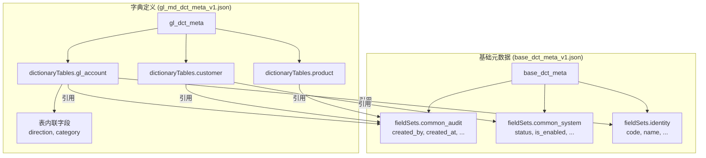
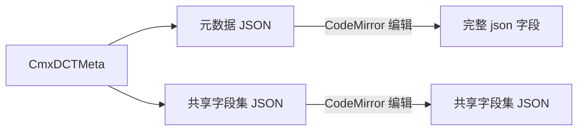
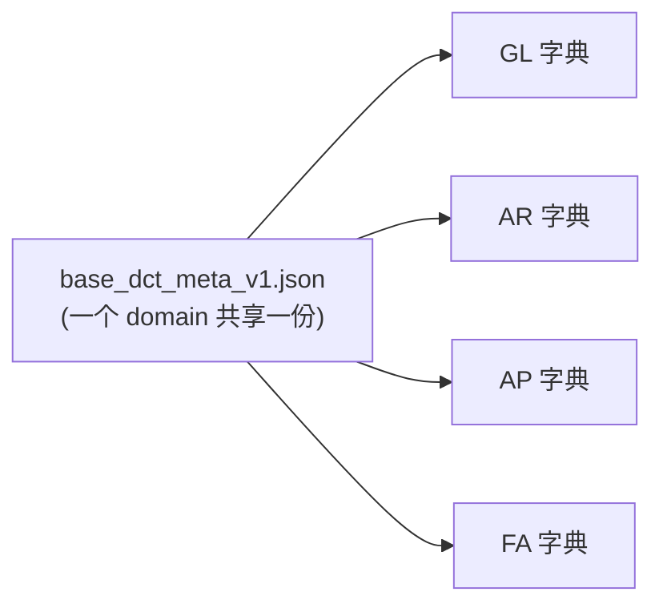
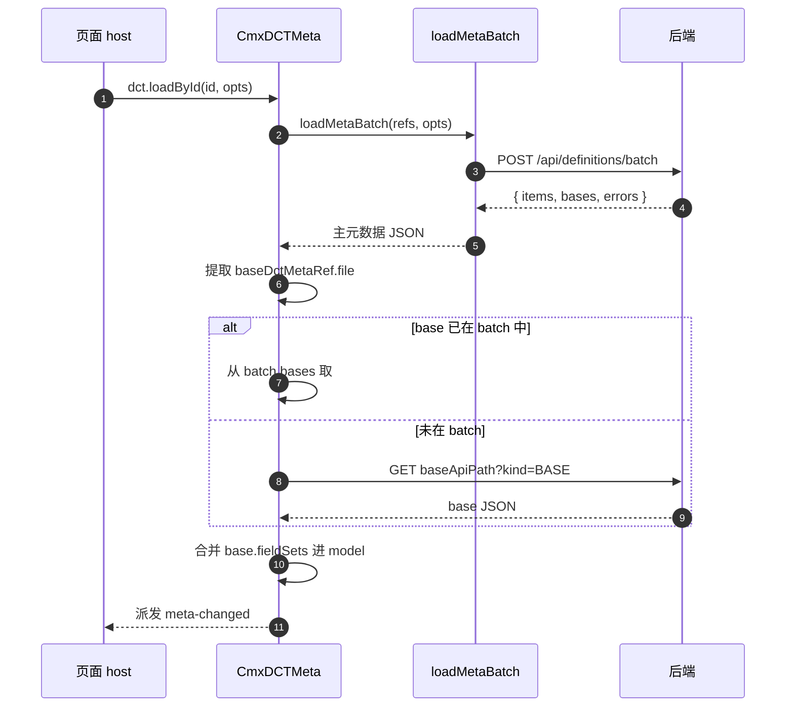

# 06 · 基础元数据 BASE 是什么（重点回答：DCT 和"字典基础元数据"有什么区别）

> 本章直接回答用户的重点问题：**数据字典定义**和**字典基础元数据**有什么区别。

---

## 1. 一句话回答

> **"数据字典定义" = 某本字典的全部内容（表 + 内联字段 + 字段集引用）**，
> **"字典基础元数据" = 多个字典共享的字段集定义（base / common / audit / system 等）**。
>
> 简单说：字典定义是"内容"，基础元数据是"被内容引用的公共部分"。

更精确的说法：
- **CmxDCTMeta.json** = "字典"的内容（叫"模块元数据" / "Module Meta"）
- **BASE 元数据**（`metaKind: "BASE"`）= "共享字段集"的存放地（叫"基础元数据" / "Base Meta"）

---

## 2. 一个具体例子（GL 模块）



- **"gl_dct_meta_v1.json"** = 字典定义 = 一组字典表（gl_account / customer / product）+ 这些表引用了哪些字段集 + 表内联的特殊字段
- **"base_dct_meta_v1.json"** = 基础元数据 = 共享字段集本身（这里有 3 个：common_audit / common_system / identity）

**关键点**：字典定义里**不重复**写 `created_by` 等公共字段——它们在 base 文件里写一次，字典表**引用**即可。

---

## 3. 对比表

| 维度 | 数据字典定义 | 字典基础元数据 |
| --- | --- | --- |
| **英文** | Module Meta / DCT | Base Meta / BASE |
| **JSON 文件名** | `gl_md_dct_meta_v1.json` | `base_dct_meta_v1.json` |
| **后端 kind** | `DCT` | `BASE` |
| **顶层表字段** | `dictionaryTables[]` | `fieldSets`（**无字典表数组**） |
| **典型数量** | 一个模块一份 | 一个域（domain）一份 |
| **被谁加载** | CmxDCTMeta.props.json | `loadMetaBatch` 的 `bases` 返回 / `loadBaseById` 合并 |
| **典型内容** | 字典表 + 内联字段 + 字段集引用 | 字段集本身（字段的"完整定义"） |
| **CmxDCTMeta 中哪个 Tab 编辑** | 元数据 JSON Tab | 共享字段集 JSON Tab |

> 来源：[models-props-meta.js:36-47](file:///media/yqs/工作/rustspace/cmx/CMXHTMLDesigner/src/components/designer-page-data/models-props-meta.js#L36-L47) 中两个 Tab：元数据 JSON / 共享字段集 JSON。

---

## 4. 设计期怎么编辑

CmxDCTMeta 选中后，Property 区域有**两个 Tab**：



- **元数据 JSON** Tab → 编辑 `props.json`（字典定义）
- **共享字段集 JSON** Tab → 编辑 `props.baseMeta`（BASE 元数据粘贴缓存，仅设计器面板使用，运行时不消费）

顶部还有几个"快速配置"字段：`id` / `domain` / `module` / `apiPath` / `autoLoad` 等。

---

## 5. 字段集（`fieldSets`）到底是啥

> 字段集 = 一组字段的"完整定义"集合，**可被多张表引用**。

```jsonc
// 在 BASE 元数据文件里
{
  "fieldSets": {
    "common_audit": [
      { "id": "created_by",  "dataType": "VARCHAR", "caption": { "zh_CN": "创建人" } },
      { "id": "created_at",  "dataType": "DATETIME", "caption": { "zh_CN": "创建时间" } },
      { "id": "updated_by",  "dataType": "VARCHAR", "caption": { "zh_CN": "修改人" } },
      { "id": "updated_at",  "dataType": "DATETIME", "caption": { "zh_CN": "修改时间" } }
    ]
  }
}
```

```jsonc
// 在字典表里引用
{
  "dictCode": "gl_account",
  "tableName": "gl_account",
  "baseFieldSet": { "use": "common_audit" }   // ← 引用上面那个字段集
}
```

> 运行后，访问 `gl_account` 字段时，**`created_by` 等会自动出现**在字段数组里。

---

## 6. 字段集分类（DCT vs DOC）

### DCT 可以引用的字段集名

| 字段集名 | 含义 |
| --- | --- |
| `baseFieldSet` | 基础字段集 |
| `hierarchyFieldSet` | 树形层级字段（id / parent / path / level） |
| `auditFieldSet` | 审计字段（created_by / updated_by / ...） |
| `scopeFieldSet` | 范围字段（org / 部门） |
| `effectiveFieldSet` | 生效字段（valid_from / valid_to） |
| `disableFieldSet` | 停用字段 |
| `systemFieldSet` | 系统字段（系统主键、系统版本） |

### DOC 可以引用的字段集名

| 字段集名 | 含义 |
| --- | --- |
| `voucherCommonFieldSet` | 单据级"通用字段" |
| `documentFieldSets` | 单据内表的字段集列表 |
| `baseFieldSet` | 基础字段集 |
| `technicalFieldSet` | 技术字段 |
| `identityFieldSet` | 身份字段 |
| `sourceFieldSet` | 来源字段 |
| `lifecycleFieldSet` | 生命周期字段 |
| `commonFieldSet` | 通用字段 |

> 来源：[dct-doc-meta-model.md](file:///media/yqs/工作/rustspace/cmx/packages/cmx-data-comp/docs/dct-doc-meta-model.md)

---

## 7. 多个 CmxDCTMeta 共享同一个 BASE 元数据



实际配置：

```jsonc
// GL 字典
{ "modelType": "CmxDCTMeta", "instanceId": "glDct", "props": {
  "id": "gl_md_dct_meta_v1.json", "domain": "fi", "module": "gl", "autoLoad": true
}}

// AR 字典（也引用同一个 base）
{ "modelType": "CmxDCTMeta", "instanceId": "arDct", "props": {
  "id": "ar_md_dct_meta_v1.json", "domain": "fi", "module": "ar", "autoLoad": true
}}
```

> 加载时，`loadMetaBatch` 会**自动**只下载一次 `base_dct_meta_v1.json`，所有引用它的 DCT 共享这个结果。

---

## 8. 一次完整的加载时序（含 base）



> 来源：[dct-doc-meta-model.md §"批量一次性加载（loadMetaBatch）"](file:///media/yqs/工作/rustspace/cmx/packages/cmx-data-comp/docs/dct-doc-meta-model.md)

---

## 9. 设计期 vs 运行期看到的区别

| 场景 | 设计期怎么配 | 运行期怎么用 |
| --- | --- | --- |
| 字段集 | 在 BASE 元数据 JSON 里定义 | 不感知——访问字段时自动出现 |
| 字段集引用 | 表里 `baseFieldSet: { use: 'common_audit' }` | 字段被合并进 `listFields()` 结果 |
| 多 DCT 共享 | 各自配置 `domain` + `module` | `loadMetaBatch` 自动去重 base |
| 改 base 影响 | 修改 BASE 元数据 JSON 后所有引用方重新加载 | 字段集合更新 |

---

## 10. 实战：扩展 BASE 元数据加一个新字段集

```jsonc
// 1) 打开 base_dct_meta_v1.json（设计器“共享字段集 JSON” Tab）
// 2) 增加一个字段集：
{
  "fieldSets": {
    "common_audit": [ /* ... 原有 ... */ ],
    "common_ext": [
      { "id": "tenant_id", "dataType": "VARCHAR", "caption": { "zh_CN": "租户 ID" } },
      { "id": "ext_tag",   "dataType": "VARCHAR", "caption": { "zh_CN": "扩展标签" } }
    ]
  }
}
// 3) 在 gl_account 表里引用：
{
  "dictCode": "gl_account",
  "baseFieldSet": { "use": "common_audit" },
  "systemFieldSet": { "use": "common_ext" }   // ← 新加的
}
// 4) 运行时访问：
// dctMeta.getField('gl_account', 'tenant_id')  // 存在
// dctMeta.getField('gl_account', 'created_by')  // 也存在（来自 common_audit）
```

---

## 11. 容易踩的坑

| 坑 | 解释 |
| --- | --- |
| 把所有字段都塞 base | base 是"共享的"，独有的字段应该写在表内联 `fields` 里 |
| 多个 DCT 改同一 base | base 是**共享**的，改 base = 改所有引用方的字段集合 |
| 字段集 id 写错 | `baseFieldSet: { use: 'common_audi' }` 拼错 → 字段集**不会**展开 |
| 期望 base 自动合并 | 设计器只在你点 "Load" 或 `autoLoad=true` 时才合并 |
| 把 BASE 元数据填到 json 字段 | 两个 Tab 互不通用，放错位置不会生效 |

---

## 小结

- **数据字典定义** = 字典表 + 内联字段 + 字段集引用（CmxDCTMeta.json）
- **字典基础元数据** = 共享字段集（BASE 元数据文件）
- **BASE 元数据是"字典的字典"**：写一次，N 张表共享
- **设计期** 靠两个 Tab 分别编辑；**运行期** 字段集引用被自动展开

---

下一步：去 [07-数据集 CmxDataSet](07-数据集-CmxDataSet.md) 看数据怎么"装进来"。
