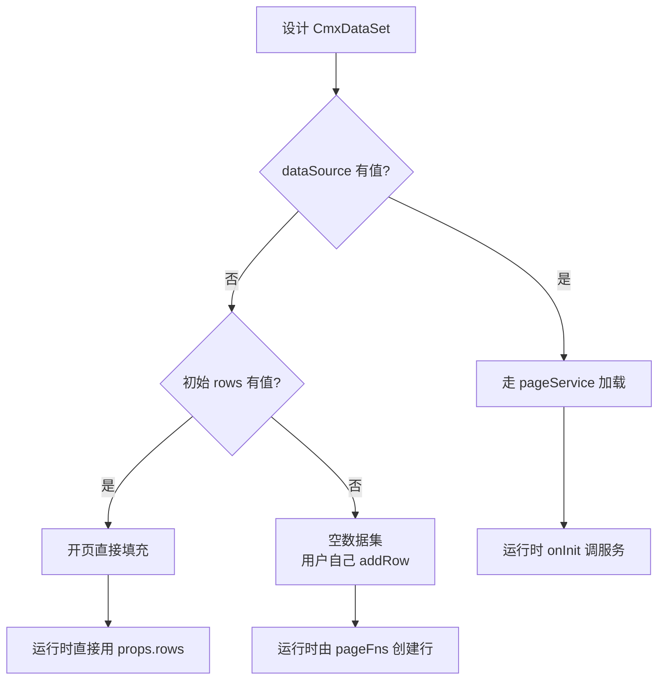
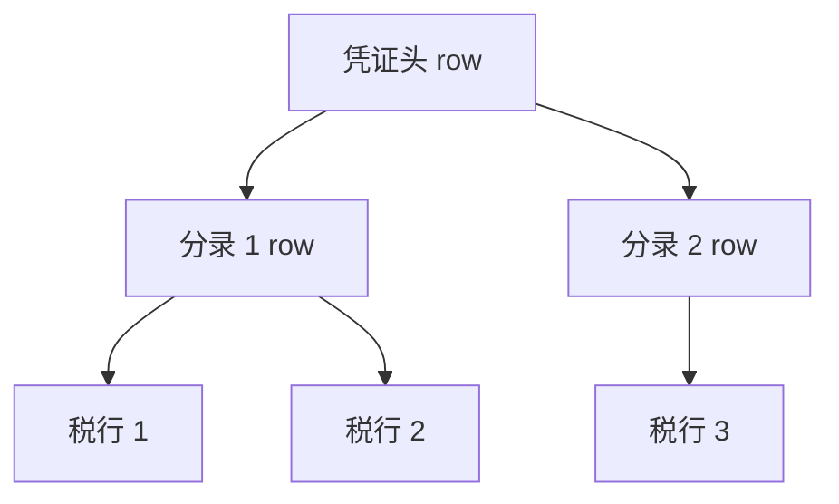
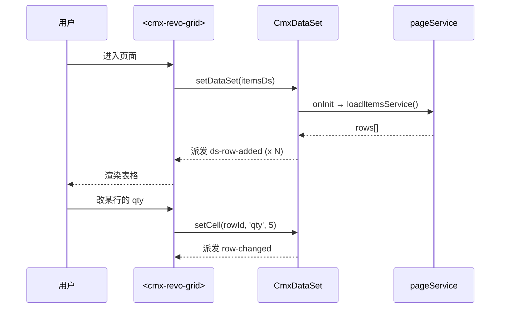
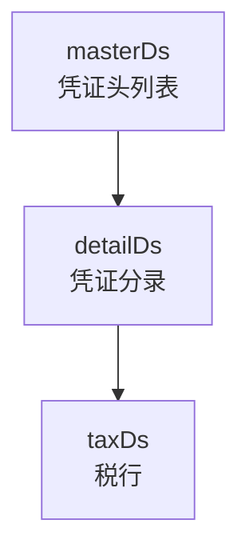

# 07 · 数据集 CmxDataSet

> 本章详解 CmxDataSet：数据是什么形状、怎么填、怎么绑。

---

## 1. 它是啥

> **CmxDataSet = "数据行"的容器**。你可以把它想成"一个表格 + 子表"——主行下面挂子行，子行下面还可以挂子行（树形结构）。

它在 Models 面板里以 **🗂 CmxDataSet** 图标出现。

---

## 2. 一句话与典型用途

- **一句话**：CmxDataSet = 多级树形数据容器
- **典型用途**：
  - 一张凭证的"分录"列表（主表 = 凭证头 + 子表 = 分录行）
  - 一棵组织机构树（根节点 + 子部门 + 子部门 + ...）
  - 任何"行里还有行"的场景

---

## 3. 字段速查表

| 字段 | 类型 | 必填 | 默认值 | 说明 |
| --- | --- | --- | --- | --- |
| `instanceId` | string | 否 | `ds` | 实例名，运行时 `host.<instanceId>` |
| `dataSource` | string | 否 | `''` | 数据来源（pageService 名） |
| `dataSourceEvent` | string | 否 | `'onInit'` | 调用时机（onInit / onClick ...） |
| `children` | array | 否 | `[]` | 子数据集数组 |
| `rows` | array | 否 | `[]` | 初始数据行（一般运行时由 dataSource 填充） |

> 来源：[page-data-panel-models.js:66-78](file:///media/yqs/工作/rustspace/cmx/CMXHTMLDesigner/src/components/designer-page-data/page-data-panel-models.js#L66-L78) 中 `defaultProps('CmxDataSet')`

---

## 4. 三种配置数据来源



### 4.1 走 pageService（最常用）

```jsonc
{
  "modelType": "CmxDataSet",
  "instanceId": "itemsDs",
  "props": {
    "dataSource": "loadItemsService",   // 对应 pageServices 里的服务名
    "dataSourceEvent": "onInit"          // 何时触发
  }
}
```

### 4.2 直接用初始 rows

```jsonc
{
  "modelType": "CmxDataSet",
  "instanceId": "staticDs",
  "props": {
    "rows": [
      { "id": "1", "name": "A" },
      { "id": "2", "name": "B" }
    ]
  }
}
```

### 4.3 子数据集（树形）

```jsonc
{
  "modelType": "CmxDataSet",
  "instanceId": "masterDs",
  "props": {
    "children": [
      {
        "instanceId": "detailDs",
        "props": { "dataSource": "loadDetailService" }
      }
    ]
  }
}
```

> 运行时父子关系：父行 addRow 时会同时给子 DataSet 创建占位行（`row._children: { detailDs: CmxDataSet }`）。

---

## 5. 树形结构长啥样



每个 `row` 都可以挂 `_children`，里面装别的 CmxDataSet。

---

## 6. 事件清单

CmxDataSet 派发的事件（在 Models 面板事件 Tab 可见）：

| 事件 | 何时触发 | event.detail |
| --- | --- | --- |
| `ds-row-added` | 新增一行 | `{ row }` |
| `ds-row-removed` | 删除一行 | `{ row }` |
| `cursor-changed` | 当前选中行变化 | `{ index, prevIndex, row, id }` |
| `row-changed` | 某行某字段变化 | `{ row, key, value }` |

> 来源：[models-event-script-hints.js:11-29](file:///media/yqs/工作/rustspace/cmx/CMXHTMLDesigner/src/components/designer-page-data/models-event-script-hints.js#L11-L29)

---

## 7. 怎么绑到可视组件

设计期在画布上拖入一个 `<cmx-revo-grid>` 或 `<cmx-form>`，然后用 `data-cmx-dataset-id` 或 JS 绑定：

### 7.1 声明式（最简单）

```html
<cmx-revo-grid id="itemsGrid" data-cmx-dataset-id="itemsDs"></cmx-revo-grid>
```

### 7.2 命令式

```js
const grid = root.querySelector('#itemsGrid')
const ds = host.itemsDs
grid.setDataSet(ds)
```

---

## 8. 页面里怎么用

```js
// 访问实例
const ds = host.itemsDs

// 加一行
ds.addRow({ id: 'r1', qty: 3, price: 100 })

// 删一行
ds.removeRow('r1')

// 改某字段
ds.setCell('r1', 'qty', 5)

// 监听事件
ds.addEventListener('ds-row-added', (e) => {
  console.log('新增行：', e.detail.row)
})

// 拿到所有行
console.log(ds.rows)
```

---

## 9. 常见数据流



---

## 10. 与 CmxMasterSlave 的关系

- CmxDataSet 是"数据本身"
- CmxMasterSlave 是"管理多张 CmxDataSet + 视图绑定 + 自动聚合"
- 配合用法见 [09-主从协调器](09-主从协调器-CmxMasterSlave.md)

> 简单说：要做"主表 + 子表 + 自动汇总"，用 CmxMasterSlave；
> 单纯"装数据"用 CmxDataSet。

---

## 11. 实战：两层主子数据集



```jsonc
// 三个 CmxDataSet 实例
[
  { "modelType": "CmxDataSet", "instanceId": "masterDs",
    "props": { "dataSource": "loadHeaders", "dataSourceEvent": "onInit" } },
  { "modelType": "CmxDataSet", "instanceId": "detailDs",
    "props": { "dataSource": "loadEntries", "dataSourceEvent": "onRowSelect" } },
  { "modelType": "CmxDataSet", "instanceId": "taxDs",
    "props": { "dataSource": "loadTaxes", "dataSourceEvent": "onRowSelect" } }
]
```

> 三个 DataSet 通过 CmxMasterSlave 的 schema 串起来，自动管理"选父行 → 刷子 DataSet → 选子行 → 刷孙 DataSet"的级联。

---

## 小结

- **CmxDataSet** = 行容器（可树形）
- **三种数据来源**：pageService / 初始 rows / 空
- **4 个事件**：ds-row-added/removed、cursor-changed、row-changed
- **绑可视组件**：`el.setDataSet(ds)` 或 `data-cmx-dataset-id`
- **多层级联**：用 CmxMasterSlave 协调

---

下一步：去 [08-列模型 CmxColumnModel](08-列模型-CmxColumnModel.md) 看"列怎么定义"。
