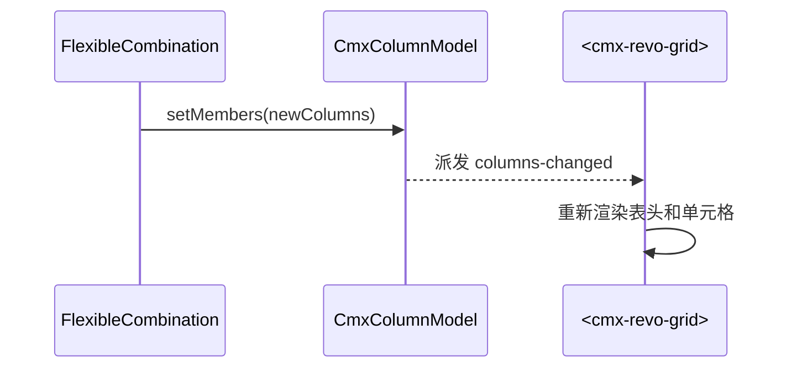

# 08 · 列模型 CmxColumnModel

> 本章详解 CmxColumnModel：表格列怎么定义、列组怎么聚合、字段三态是什么。

---

## 1. 它是啥

> **CmxColumnModel = 表格的"列模板"**。它不直接显示，而是定义"一个表格有哪些列、每列怎么显示、怎么编辑、能不能聚合"。

它在 Models 面板里以 **📋 CmxColumnModel** 图标出现。

---

## 2. 一句话与典型用途

- **一句话**：CmxColumnModel = 列的"配方"——加哪些列、每列什么样子
- **典型用途**：
  - 一个凭证分录表的列配方：分录号 / 摘要 / 科目 / 借方 / 贷方
  - 一个组织机构列表的列配方：编码 / 名称 / 上级 / 状态
  - 通过 FlexibleCombination 按上下文动态换列（见 [10-弹性组合](10-弹性组合-FlexibleCombination.md)）

---

## 3. 字段速查表

| 字段 | 类型 | 必填 | 默认值 | 说明 |
| --- | --- | --- | --- | --- |
| `instanceId` | string | 否 | `model` | 实例名，运行时 `host.<instanceId>` |
| `datasetId` | string | 否 | `''` | 关联的 CmxDataSet 实例名 |
| `columns` | array | 否 | `[]` | 列定义数组（每项 = 一个 CmxColumn） |
| `columnGroups` | array | 否 | `[]` | 列组定义数组（每项 = 一个 CmxColumnGroup） |
| `columnsSource` | string | 否 | `''` | 列定义的 pageService 名（动态从后端拿列） |

> 来源：[page-data-panel-models.js:70](file:///media/yqs/工作/rustspace/cmx/CMXHTMLDesigner/src/components/designer-page-data/page-data-panel-models.js#L70)

---

## 4. CmxColumn 的字段

每一列都是一个 `CmxColumn` 对象，关键字段：

| 字段 | 含义 |
| --- | --- |
| `id` | 列的唯一编码（运行时数据行的字段名） |
| `caption` | 显示标题（多语言对象：`{ zh_CN: '...', en: '...' }`） |
| `dataType` | 数据类型：`VARCHAR` / `BIGINT` / `NUMBER` / `DATE` / `DATETIME` / `BOOLEAN` 等 |
| `width` | 列宽（`'140px'`、`'20%'`） |
| `frozen` | 是否冻结列 |
| `visible` | 是否可见 |
| `agg` | 聚合方式：`sum` / `avg` / `min` / `max` / `count` |
| `edit.mode` | 编辑方式：`text` / `number` / `select` / `combo` / `date` / `ref` / `tree-ref` / `readonly` / `computed` / `none` |
| `edit.required` | 是否必填 |
| `edit.options` | select 的可选项 |
| `edit.validate` | 校验规则 |
| `edit.readonlyWhen` | 只读条件（表达式） |
| `display.mode` | 显示方式：`text` / `number` / `badge` / `icon` / `link` / `cellStyle` |
| `display.decimalDigits` | 小数位数 |
| `display.thousandSeparator` | 千分位符号 |
| `displayMask` | 显示格式模板 |
| `calcFormula` | 计算公式（preset 或 函数体） |
| `validateFormula` | 校验公式 |
| `dependsOn` | 计算公式依赖的字段（用于重算） |
| `length` / `integerDigits` / `decimalDigits` | 字段长度/整数位/小数位 |
| `defaultFrom` | 默认值来源（dimension / attribute） |
| `unitField` | 单位字段（数量挂计量单位） |

> 来源：[models-props-columnmodel.js](file:///media/yqs/工作/rustspace/cmx/CMXHTMLDesigner/src/components/designer-page-data/models-props-columnmodel.js) 字段映射表

---

## 5. 一个最小列定义示例

```jsonc
{
  "id": "sku",
  "caption": { "zh_CN": "SKU" },
  "dataType": "VARCHAR",
  "width": "140px",
  "edit": { "mode": "text" },
  "display": { "mode": "text" }
}

{
  "id": "qty",
  "caption": { "zh_CN": "数量" },
  "dataType": "NUMBER",
  "width": "90px",
  "edit": { "mode": "number", "required": true },
  "display": { "mode": "number", "decimalDigits": 2, "thousandSeparator": "," }
}

{
  "id": "subtotal",
  "caption": { "zh_CN": "小计" },
  "dataType": "NUMBER",
  "width": "110px",
  "edit": { "mode": "computed" },
  "calcFormula": "r.subtotal = r.qty * r.unitPrice",
  "dependsOn": ["qty", "unitPrice"]
}
```

---

## 6. CmxColumnGroup（列组）

> 列组 = 多列的"组"，可以合并表头、做组内合计。

| 字段 | 含义 |
| --- | --- |
| `id` | 列组编码 |
| `caption` | 显示标题 |
| `members` | 成员列表（列 id 字符串 或 嵌套列组对象） |
| `aggregate` | 组内聚合：`{ sum: true, avg: true, max: true, min: true, count: true }` |
| `aggregatePosition` | 聚合行位置：`before` / `after`（汇总行放在组前还是组后） |

```jsonc
{
  "id": "money",
  "caption": "金额组",
  "members": ["debit", "credit"],
  "aggregate": { "sum": true },
  "aggregatePosition": "after"
}
```

---

## 7. 字段三态（dimension / attribute / measure）

> 来自 [flexible-combination-meta-model.md §3](file:///media/yqs/工作/rustspace/cmx/packages/cmx-data-comp/docs/flexible-combination-meta-model.md)

| 态 | 取值来源 | 典型例 | edit.mode | 可进公式 |
| --- | --- | --- | --- | --- |
| **dimension**（维度） | 从某维度主数据选一个值 | 客户、产品、币种 | `ref` / `select` / `tree-ref` | 它的 attribute 可被带出 |
| **attribute**（属性） | 从已选维度自动带出 | 产品→规格、单位 | `readonly`（可改） | 可作输入 |
| **measure**（度量） | 数值 | 单价、数量、金额 | `input` / `computed` | 是 |

```jsonc
// 维度
{ "code": "customer", "kind": "dimension", "valueSourceId": "customerMaster", "edit": { "mode": "ref", "required": true } }

// 属性
{ "code": "spec", "kind": "attribute", "source": { "dimension": "product", "attribute": "spec" }, "edit": { "mode": "readonly" } }

// 度量（输入）
{ "code": "quantity", "kind": "measure", "edit": { "mode": "input" }, "validations": [{ "expr": "quantity > 0", "message": "数量须大于 0" }] }

// 度量（计算）
{ "code": "amount", "kind": "measure", "edit": { "mode": "computed" }, "formula": "unitPrice * quantity", "dependsOn": ["unitPrice", "quantity"] }
```

---

## 8. 怎么绑到可视组件

```html
<cmx-revo-grid id="itemsGrid" data-cmx-model-id="itemsModel" data-cmx-dataset-id="itemsDs"></cmx-revo-grid>
```

```js
const grid = root.querySelector('#itemsGrid')
const model = host.itemsModel
grid.setColumnModel(model)   // 注入列定义
grid.setDataSet(host.itemsDs) // 注入数据
```

---

## 9. 运行时改列（FlexibleCombination 触发）



> 弹性组合改写列模型的完整流程见 [10-弹性组合](10-弹性组合-FlexibleCombination.md)

---

## 10. 列的复制粘贴

设计器里支持"复制列"和"粘贴列"（[models-props-columnmodel.js:222-247](file:///media/yqs/工作/rustspace/cmx/CMXHTMLDesigner/src/components/designer-page-data/models-props-columnmodel.js#L222-L247)）：

- 选中一个 ColumnModel 实例 → 工具栏"复制"按钮 → 复制所有 `columns` + `columnGroups` 到剪贴板
- 在另一个 ColumnModel 实例 → "粘贴"按钮 → 还原

格式：

```jsonc
{
  "source": "CMXHTMLDesigner.CmxColumnModel",
  "fields":  [ /* CmxColumn[] */ ],
  "groups":  [ /* CmxColumnGroup[] */ ]
}
```

---

## 11. 字段类型注册表（Field Types）

`cmx-data-comp` 提供一个**字段类型注册表**——你可以零代码加新的"字段类型 + 编辑器"：

```js
import { registerFieldType } from 'cmx-data-comp'

registerFieldType('color', {
  form: { create(field, ctx) { /* 创建一个 input 元素 */ } },
  grid: { editor(col, save, close) { /* 返回 { element, getValue } */ } },
})
```

- form 端：未注册时回退到内置 `cmx-text-input`
- grid 端：mount 时把已注册类型写入 `revo.editors`
- 详细：[packages/cmx-data-comp/CLAUDE.md §"字段类型注册表"](file:///media/yqs/工作/rustspace/cmx/packages/cmx-data-comp/CLAUDE.md)

---

## 12. JSON 视图 vs 定义视图

设计器里编辑 CmxColumnModel 有两个 Tab：

| Tab | 干啥 |
| --- | --- |
| **定义** | 可视化表格（拖列、复制粘贴、上下移） |
| **JSON** | CodeMirror 直接编辑 JSON（高级用户） |

两个 Tab 双向同步——定义改完 JSON 自动刷新，JSON 改完点"应用"也更新定义。

---

## 小结

- **CmxColumnModel** = 列配方
- **columns[]** = 列数组；**columnGroups[]** = 列组（可聚合）
- **每列有 20+ 字段**：caption / dataType / width / edit / display / calcFormula / validations / dependsOn...
- **字段三态**：dimension（选）/ attribute（带出）/ measure（输入或计算）
- **可被弹性组合动态改写**

---

下一步：去 [09-主从协调器 CmxMasterSlave](09-主从协调器-CmxMasterSlave.md) 看协调器怎么把"多张表"绑在一起。
