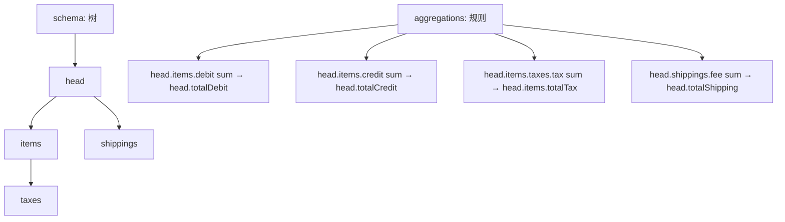
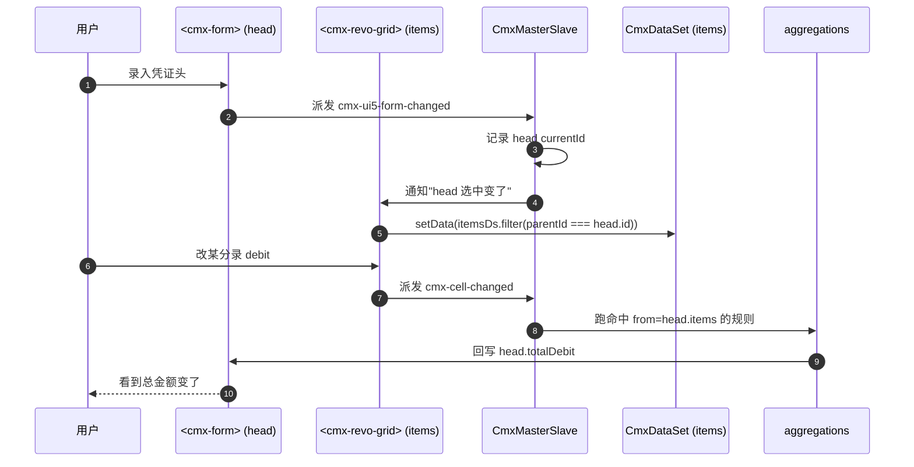

# 09 · 主从协调器 CmxMasterSlave

> 本章详解 CmxMasterSlave：什么是"协调"、它干啥、怎么配。

---

## 1. 它是啥

> **CmxMasterSlave = "多张表的管家"**。它不存业务数据，它做的事是：把"主表 + 子表 + 孙表"绑在一起，让选主表行 → 自动刷子表 → 选子表行 → 自动刷孙表……然后改子表某个值 → 自动汇总到主表。

它在 Models 面板里以 **⚡ CmxMasterSlave** 图标出现。

> 来源：[cmx-master-slave.js §注释 1-31](file:///media/yqs/工作/rustspace/cmx/packages/cmx-data-comp/src/lib/cmx-master-slave.js)

---

## 2. 一句话与典型用途

- **一句话**：CmxMasterSlave = 主从多表"协调器"——选行 + 改值 + 聚合全自动
- **典型用途**：
  - **凭证录入**：表头是主，N 条分录是子；分录金额改了 → 表头"总金额"自动算
  - **订单管理**：订单主表 + 订单明细 + 订单物流 + 订单发票（4 级）
  - **BOM 展开**：物料主表 + 子件清单

---

## 3. 它的四大职责

| 职责 | 说明 |
| --- | --- |
| **1. 持有递归主从数据树** | 每个 `row` 可挂 `_children: { tableId: CmxDataSet }` |
| **2. 视图按 path 注册** | `ms.bindForm('head', formEl)` / `ms.bindTable('head.items', gridEl)` |
| **3. 维护"当前选中行"** | 上级选中变了 → 下级视图自动重算（联动） |
| **4. 自动跑聚合规则** | 监听 `cmx-cell-changed` / `cmx-row-added` → 跑 sum/avg/min/max/count → 回写目标字段 |

> 来源：[cmx-master-slave.js:1-31](file:///media/yqs/工作/rustspace/cmx/packages/cmx-data-comp/src/lib/cmx-master-slave.js)

---

## 4. 字段速查表

| 字段 | 类型 | 必填 | 默认值 | 说明 |
| --- | --- | --- | --- | --- |
| `instanceId` | string | 否 | `ms` | 实例名，运行时 `host.<instanceId>`（约定俗成叫 `ms`） |
| `schema` | array | 否 | `[]` | **路径树**——定义有哪些表、父子关系 |
| `aggregations` | array | 否 | `[]` | **聚合规则**——子表改了写回主表 |
| `relations` | array | 否 | （隐式） | 平铺数据时的主外键关系 |
| `columnModels` | array | 否 | （隐式） | 关联的列模型 |
| `dataSources` | array | 否 | （隐式） | 关联的数据源（pageService） |
| `editable` | boolean | 否 | （默认） | 全局可编辑标志 |

> 来源：[page-data-panel-models.js:69](file:///media/yqs/工作/rustspace/cmx/CMXHTMLDesigner/src/components/designer-page-data/page-data-panel-models.js#L69) + [cmx-master-slave.js:42-69](file:///media/yqs/工作/rustspace/cmx/packages/cmx-data-comp/src/lib/cmx-master-slave.js#L42-L69)

---

## 5. Schema（路径树）怎么配

> Schema 是一棵"表树"，每个节点 = 一张表。

```jsonc
{
  "schema": [
    { "id": "head" },
    { "id": "items", "children": [
      { "id": "taxes" }
    ]},
    { "id": "shippings" }
  ]
}
```

展开后路径（**点分隔**）：

| 节点 | 路径 | 含义 |
| --- | --- | --- |
| `head` | `head` | 表头（顶级） |
| `items` | `head.items` | 头下面的"分录"子表 |
| `taxes` | `head.items.taxes` | 分录下面的"税行"孙表 |
| `shippings` | `head.shippings` | 头下面的"物流"子表 |

**重要规则**：所有 path 都用 `.` 分隔的完整路径（如 `head.items` 而不是 `items`）。

> 来源：[packages/cmx-data-comp/CLAUDE.md §"generate-cmx-page"](file:///media/yqs/工作/rustspace/cmx/packages/cmx-data-comp/CLAUDE.md) 关键规则

---

## 6. Aggregations（聚合规则）怎么配

```jsonc
{
  "aggregations": [
    {
      "from":     "head.items",      // 从哪收集
      "agg":      "sum",             // sum / avg / min / max / count
      "field":    "debit",           // 收集哪个字段
      "to":       "head",            // 写回到哪
      "toField":  "totalDebit"       // 写到哪个字段
    },
    {
      "from":     "head.items",
      "agg":      "sum",
      "field":    "credit",
      "to":       "head",
      "toField":  "totalCredit"
    },
    {
      "from":     "head.items.taxes",
      "agg":      "sum",
      "field":    "tax",
      "to":       "head.items",
      "toField":  "totalTax"
    }
  ]
}
```

### 6.1 聚合语义（重要）

| 规则 | 行为 |
| --- | --- |
| `to` 是 single（与 `from` 共同祖先是 single 或 root） | 在整树里收集 from → 写到 to 那一行 |
| `to` 是 list（与 `from` 有共同 list 祖先） | 对 to 列表中**每一行 t**，把 source 限定在 t 的子树 |
| `scope: 'all'` | 强制忽略上述上下文，整树聚合 |

### 6.2 触发时机

- `setData` 之后整体跑一次（"预热"）
- `cmx-cell-changed`（某字段值变了）→ 跑命中 from 的规则
- `cmx-row-added` / `cmx-row-removed` → 跑 `from === X` 或 `from` 以 `X` 为前缀的规则

> 来源：[cmx-master-slave.js:16-31](file:///media/yqs/工作/rustspace/cmx/packages/cmx-data-comp/src/lib/cmx-master-slave.js)

---

## 7. 完整字段配置示例（带截图说明）



---

## 8. 视图绑定（运行时怎么把 Form/Grid 挂进来）

```js
const ms = host.ms
// 把 <cmx-ui5-form id="orderForm"> 绑到 head 路径
ms.bindForm('head', root.querySelector('#orderForm'))
// 把 <cmx-revo-grid id="itemsGrid"> 绑到 head.items 路径
ms.bindTable('head.items', root.querySelector('#itemsGrid'))
// 把 <cmx-revo-grid id="taxGrid"> 绑到 head.items.taxes
ms.bindTable('head.items.taxes', root.querySelector('#taxGrid'))
```

> **绑定的视图会收到 `currentId` 变化**——上级一选中，下级自动重算"我该显示哪些行"。

---

## 9. 事件清单

CmxMasterSlave 派发的事件：

| 事件 | 何时触发 | event.detail |
| --- | --- | --- |
| `change` | 某行某字段值变化 | `{ path, id, key, value, row }` |
| `select` | 某行被选中 | `{ path, id }` |
| `aggregate` | 聚合规则触发 | `{ rule, value, targetId }` |

> 来源：[models-event-script-hints.js:13](file:///media/yqs/工作/rustspace/cmx/CMXHTMLDesigner/src/components/designer-page-data/models-event-script-hints.js#L13)

---

## 10. 主从协调的完整流程



---

## 11. setData vs setFlatData

CmxMasterSlave 支持两种喂数据方式：

### 11.1 setData（树形）

```js
ms.setData({
  tables: { head: headDs, items: itemsDs, ... }
}, /* options */)
```

### 11.2 setFlatData（平铺 + 外键）

```js
ms.setFlatData({
  head: [{ id: 'h1', totalAmt: 0 }],
  items: [
    { id: 'i1', headId: 'h1', debit: 100 },
    { id: 'i2', headId: 'h1', credit: 100 }
  ]
}, {
  relations: [
    { parent: 'head', child: 'items', childKey: 'headId' }
  ]
})
```

> 推荐用法：复杂场景用 `setData`（自己管理 CmxDataSet）；简单场景用 `setFlatData`（让它自己建关联）。

---

## 12. 业务无感知

> **CmxMasterSlave 完全不知道任何业务术语**——它不认"凭证""客户""订单"，它只认 schema 路径、字段名、聚合规则。

这意味着：
- 同一份 CmxMasterSlave 代码可用于会计、库存、订单、CRM……任何主从结构
- "凭证"只是个 schema = `[{id:head, children:[{id:items, children:[{id:taxes}]}]}]` 的业务术语解释
- 业务逻辑全部由**配置**驱动

---

## 13. 实战：凭证主从协调器

```jsonc
{
  "modelType": "CmxMasterSlave",
  "instanceId": "ms",
  "props": {
    "schema": [
      { "id": "head" },
      { "id": "items", "children": [
        { "id": "taxes" }
      ]},
      { "id": "attachments" }
    ],
    "aggregations": [
      { "from": "head.items", "agg": "sum", "field": "debit",  "to": "head", "toField": "totalDebit"  },
      { "from": "head.items", "agg": "sum", "field": "credit", "to": "head", "toField": "totalCredit" },
      { "from": "head.items.taxes", "agg": "sum", "field": "tax", "to": "head.items", "toField": "totalTax" }
    ]
  }
}
```

页面里这样用：

```js
// 设置主子数据
ms.setData({ tables: { head, items, taxes, attachments } })

// 选某条凭证头
ms.setCurrentId('head', 'V001')

// 监听聚合
ms.addEventListener('aggregate', (e) => {
  console.log(`规则 ${e.detail.rule.from} 写入 ${e.detail.targetId}.${e.detail.rule.toField} = ${e.detail.value}`)
})

// 拿到某行
const row = ms.getRow('head', 'V001')
```

---

## 14. 容易踩的坑

| 坑 | 解释 |
| --- | --- |
| 路径写错（`items` 而不是 `head.items`） | 协调器不知道"父级是哪个" |
| 重复 path | `schema` 里不能有同名 id，重复会抛 `duplicate path` |
| 聚合 `to` 写错 | 写到一个不存在的 path，抛 `unknown path` |
| 没绑视图就调 `setCurrentId` | 业务没影响，但视图不会自动刷新 |
| `aggregations` 数组大 | 每次 cell change 都重算；规则按 `from` 反向索引，无关规则不跑 |
| 忘记 `destroy()` | SPA 切换页面会内存泄漏 |

---

## 小结

- **CmxMasterSlave** = 主从协调器（管家）
- **四大职责**：持有数据树 / 绑视图 / 维护选中 / 自动聚合
- **两个核心配置**：`schema`（路径树）+ `aggregations`（规则）
- **业务无感知**：不认任何业务术语，全靠配置
- **路径用 `.` 分隔**：`head.items.taxes` 完整路径

---

下一步：去 [10-弹性组合 FlexibleCombination](10-弹性组合-FlexibleCombination.md) 看"上下文驱动的动态列"。
