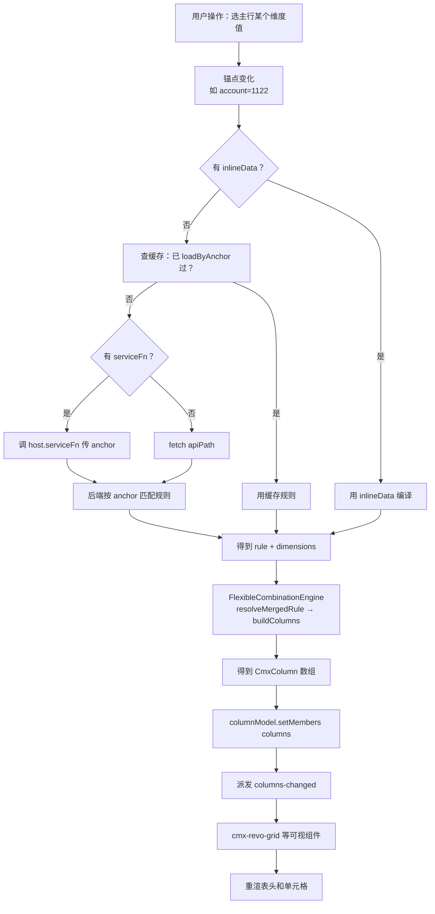
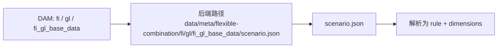
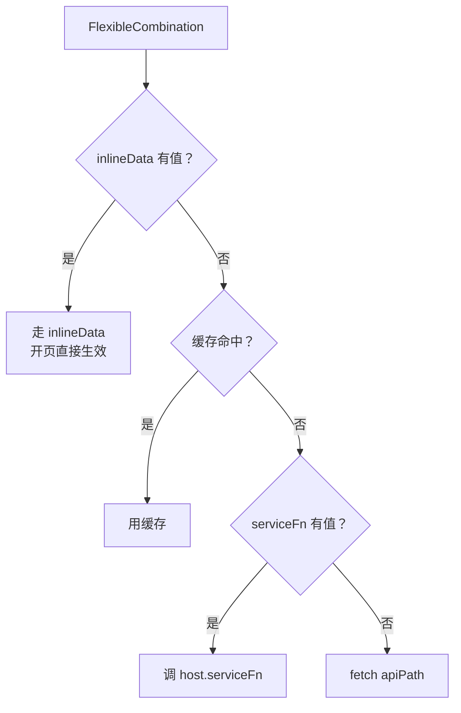
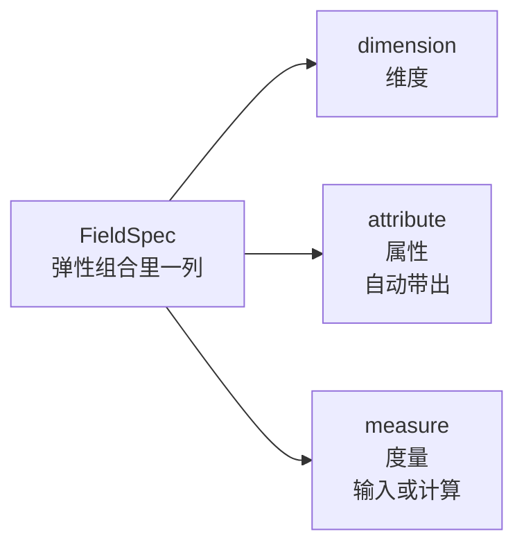
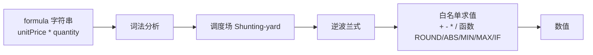
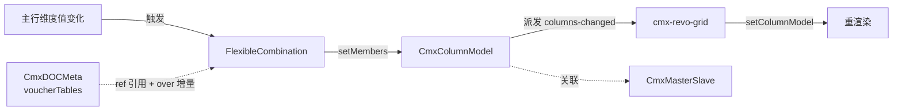

# 10 · 弹性组合 FlexibleCombination（重点回答：怎么配置使用）

> 本章详解 FlexibleCombination：什么是"上下文驱动的动态列"、怎么配、怎么用。

---

## 1. 它是啥

> **FlexibleCombination = "按维度组合动态生成列"的模型组件**。你选了"应收账款"科目，凭证分录的列就变成"客户+部门+金额"；选了"原材料"科目，列就变成"仓库+数量+单价"。

它在 Models 面板里以 **🧭 FlexibleCombination** 图标出现。

> **别名 `ContextProfile`**：早期设计稿、`.qoder/repowiki/zh/` 知识库、[docs/AI_Form_Agent_task-23d.md](file:///media/yqs/工作/rustspace/cmx/docs/AI_Form_Agent_task-23d.md) 等文档里把 6 大模型第 6 个写为 `ContextProfile`，指的是同一个类。代码里类名是 `CmxFlexibleCombination`，`__designer_meta__.models[i].modelType` 字符串值是 `"FlexibleCombination"`，而 Rust 后端 crate 是 `cmx-model` 的 `flexible_combination` 模块。

> 来源：[flexible-combination-model-guide.md](file:///media/yqs/工作/rustspace/cmx/packages/cmx-data-comp/docs/flexible-combination-model-guide.md) + [cmx-models-plugin.js:105-114](file:///media/yqs/工作/rustspace/cmx/CMXHTMLDesigner/src/plugins/cmx-models-plugin.js)

---

## 2. 一句话与典型用途

- **一句话**：FlexibleCombination = "上下文变化 → 列模型跟着变" 的自动化
- **典型用途**：
  - 会计科目辅助核算：选 `account = 1122`（应收账款）→ 列变成客户/部门/金额
  - 交易明细：选 `{txType: 'sale', productType: 'goods'}` → 列变成产品/规格/数量/单价
  - 任何"上下文决定表单/表格形状"的场景

---

## 3. 完整流程图



> 来源：[flexible-combination-model-guide.md §1](file:///media/yqs/工作/rustspace/cmx/packages/cmx-data-comp/docs/flexible-combination-model-guide.md)

---

## 4. 字段速查表

| 字段 | 类型 | 必填 | 默认值 | 说明 |
| --- | --- | --- | --- | --- |
| `instanceId` | string | 否 | `flexibleCombination` | 实例名 |
| `domain` | string | 否 | `''` | DAM 第一段（业务域），如 `fi` |
| `app` | string | 否 | `''` | DAM 第二段（应用），如 `gl` |
| `module` | string | 否 | `''` | DAM 第三段（模块），如 `fi_gl_base_data` |
| `scenario` | string | 否 | `''` | 业务场景，如 `account` / `trade` |
| `columnModelId` | string | 是 | `''` | **目标列模型**（必须填） |
| `serviceFn` | string | 否 | `''` | 自定义取数服务（pageService 名） |
| `apiPath` | string | 否 | `/api/flexible-combination/rule` | 默认 API |
| `anchorDimensions` | array | 否 | `[]` | 锚点维度名列表（留空则跟随后端） |
| `inlineData` | object | 否 | （无） | **直接内联**的规则 JSON（开页生效） |

> 来源：[page-data-panel-models.js:73-75](file:///media/yqs/工作/rustspace/cmx/CMXHTMLDesigner/src/components/designer-page-data/page-data-panel-models.js#L73-L75)

---

## 5. DAM 三段定位

> **DAM = Domain / App / Module**——用来定位后端存储位置。



- **`domain`** = 业务域（fi / ar / ap / fa / hr ...）
- **`app`** = 应用（gl / ap / ...）
- **`module`** = 模块（fi_gl_base_data / ...）
- **`scenario`** = 场景（account / trade / ...）

组合起来告诉系统"去哪取这个弹性组合的规则"。

---

## 6. 三种数据来源（重点）



### 6.1 inlineData（声明式，开页生效）

```jsonc
{
  "modelType": "FlexibleCombination",
  "instanceId": "detailFC",
  "props": {
    "domain": "fi", "app": "gl", "module": "fi_gl_base_data",
    "scenario": "account",
    "columnModelId": "detailModel",
    "inlineData": {
      "rule": {
        "id": "demo",
        "detail": { "fields": [
          { "code": "customer", "kind": "dimension", "dimension": "customer",
            "edit": { "mode": "select", "required": true } },
          { "code": "amount",   "kind": "measure",
            "edit": { "mode": "input" } }
        ]}
      },
      "dimensions": {
        "customer": { "name": "客户", "valueType": "select",
                      "values": [ { "code": "C-001", "name": "上海科技" } ] }
      }
    }
  }
}
```

### 6.2 serviceFn（推荐：动态取数）

```jsonc
// Models 面板
{
  "modelType": "FlexibleCombination",
  "instanceId": "detailFC",
  "props": {
    "domain": "fi", "app": "gl", "module": "fi_gl_base_data",
    "scenario": "account",
    "columnModelId": "detailModel",
    "serviceFn": "resolveFlexibleCombination"
  }
}
```

```jsonc
// Services 面板
{ "name": "resolveFlexibleCombination", "type": "rest", "url": "/api/flexible-combination/rule", "method": "GET" }
```

```js
// 页面函数（仅一行）
function onEntrySelected(e) {
  var rowId = e?.detail?.id
  if (!rowId) return
  var row = host.ms.getRow('head.items', rowId)
  host.detailFC.loadByAnchor({ account: row?.acctCode || '' })
}
```

### 6.3 setCombination（运行时 JSON 直设）

实际 API 名是 `setCombination`（不是 `setProfile`），它宽容接受两种 JSON 形态：

```js
// 形态 A：单规则
host.detailFC.setCombination({ rule, dimensions })
//   → 内部等价 setRule({rule, dimensions})
//   → 立即把 columns 写入 columnModel

// 形态 B：多规则 + 锚点
host.detailFC.setCombination({ rules: [...], dimensions, anchor: { account: '1122' } })
//   → 用 FlexibleCombinationEngine.resolveMergedRule(anchor) 选一条
//   → 选中后写入 columnModel + 缓存

// 形态 B 简写：后端整份 /config 直接喂入
host.detailFC.setCombination({ config: backendConfig, anchor: { account: '1122' } })
```

**不合法**（既无 `rule` 也无 `rules`）→ `console.warn` + **不写入** columnModel，目标列保持原状。

---

## 7. 两种 JSON 形态

### 形态 A：单规则（最常见）

```jsonc
{
  "rule": {
    "id": "fi-cash",
    "detail": { "fields": [ /* 一组字段 */ ] }
  },
  "dimensions": { /* 维度定义 */ }
}
```

### 形态 B：多规则 + 锚点

```jsonc
{
  "rules": [ /* 多条规则，按 anchor 选 */ ],
  "dimensions": { /* 所有维度 */ },
  "anchor": { "account": "1122" }   // 在 rules 里按 anchor 解析一条
}
```

也接受 `{ "config": { rules, dimensions }, "anchor": {...} }` 套层形式（便于把后端整份 `/config` 直接喂入）。

不合法（既无 `rule` 也无 `rules`）→ `console.warn` + **不派发**事件，目标列模型保持原状。

---

## 8. 字段三态（FieldSpec.kind）

> 来自 [flexible-combination-meta-model.md §3](file:///media/yqs/工作/rustspace/cmx/packages/cmx-data-comp/docs/flexible-combination-meta-model.md)



| 态 | 取值 | edit.mode | 典型例 |
| --- | --- | --- | --- |
| **dimension** | 从某维度主数据选 | `ref` / `select` / `tree-ref` | 客户、产品、币种 |
| **attribute** | 从已选维度带出 | `readonly` | 产品→规格、单位 |
| **measure** | 数值（输入或计算） | `input` / `computed` | 单价、数量、金额 |

完整 FieldSpec 结构（精简）：

```jsonc
{
  "code":     "amount",                      // 列 id
  "kind":     "measure",                     // dimension / attribute / measure
  "caption":  "金额",                        // 显示标题
  "dataType": "number",
  "valueSourceId": "customerMaster",         // dimension: 值主数据
  "source":   { "dimension": "product", "attribute": "spec" },  // attribute: 从哪带出
  "defaultFrom": { "dimension": "currency", "attribute": "todayRate" },  // measure: 默认值
  "edit":     { "mode": "input", "required": false },
  "formula":  "unitPrice * quantity",        // computed
  "dependsOn": ["unitPrice", "quantity"],
  "validations": [ { "expr": "quantity > 0", "message": "数量须大于 0" } ],
  "display":  { "decimals": 2, "thousand": ",", "zeroBlank": true },
  "unitField": "uom"
}
```

---

## 9. 匹配评分（`resolveMergedRule`）

> 来源：[flexible-combination-meta-model.md §5](file:///media/yqs/工作/rustspace/cmx/packages/cmx-data-comp/docs/flexible-combination-meta-model.md)

| 评分来源 | score |
| --- | --- |
| `match` 全部字段精确等值（`account: '1122'`） | 3 |
| `match` 命中维度属性（`account.category === 'receivable'`） | ~1 |
| anchor.dimensions 相同但无 match 的兜底规则 | 0 |
| 任一条件不符 | -1（淘汰） |

**最终得分**：`specificity = score * 100 + 锚点维度数`

**字段合并语义**（`resolveMergedRule`，生产默认）：

- 所有 score ≥ 0 的命中规则**全部参与**
- 同名字段取 specificity 高者胜出；同分取定义顺序靠前者
- 全部不命中 → 返回 `null`（调用方给最小列集）

---

## 10. 公式与校验引擎（formula-eval）

> 来自 [flexible-combination-meta-model.md §6](file:///media/yqs/工作/rustspace/cmx/packages/cmx-data-comp/docs/flexible-combination-meta-model.md)



- 不用裸 `eval`——只用白名单的运算符和函数
- 支持字段引用（裸 code）：`amount` → 当前行的 `amount` 字段值
- 函数：`ROUND` / `ABS` / `MIN` / `MAX` / `IF`
- 链式计算：`dependsOn` 建有向图 → 拓扑排序后按序重算

```jsonc
// computed 列
{
  "code": "amount",
  "kind": "measure",
  "edit": { "mode": "computed" },
  "formula": "unitPrice * quantity",
  "dependsOn": ["unitPrice", "quantity"],
  "display": { "decimals": 2, "thousand": "," }
}
```

> 公式保存期跑 validations + 必填检查。

---

## 11. 与 CmxColumnModel / CmxMasterSlave / CmxDOCMeta 的关系



### Overlay 模式（重点设计）

> **关键洞见**：弹性组合**不应该重复定义**单据已有的列，而应该**引用 + 增量**。

- **现状（inline）**：CTX 规则里整列深拷贝（20+ 字段全列重写）
- **未来（ref + over）**：只锚定 `ref: "voucher_detail.cost_center_id"`，加 `over: { edit: { required: true } }` 增量

```jsonc
// ref 字段（Overlay 模式）
{
  "ref": "voucher_detail.cost_center_id",     // 锚点：DOC 的「表.列」
  "over": { "edit": { "required": true } }    // 只写差异
}
```

> 详细设计：[flexible-combination-overlay-design.md](file:///media/yqs/工作/rustspace/cmx/packages/cmx-data-comp/docs/flexible-combination-overlay-design.md)

---

## 12. 运行时 API

```js
// 走后端取规则（按 anchor）
await host.detailFC.loadByAnchor({ account: row.acctCode })
// → Promise<{ ruleId, fromCache }>

// 直接 JSON 喂入（最常用：设计期 inlineData 走的就是它）
host.detailFC.setCombination({ rule, dimensions })
// 或
host.detailFC.setCombination({ rules, dimensions, anchor: { account: '1122' } })

// 细粒度：单规则直设
host.detailFC.setRule({ rule: serverRule, dimensions, anchor })

// 清空缓存 + 还原初始列
host.detailFC.clear()

// 只清某个 anchor 的缓存
host.detailFC.invalidateCache({ account: '1122' })
```

---

## 13. 实战：会计科目辅助核算

**场景**：选 `account = 1122`（应收账款）→ 显示客户/部门/金额；选 `account = 6601`（销售费用）→ 显示客户/项目/金额

```jsonc
// Models 面板 ① CmxColumnModel
{
  "modelType": "CmxColumnModel",
  "instanceId": "detailModel",
  "props": {
    "datasetId": "head.items",
    "columns": [],                           // 初始为空，由 FC 填充
    "columnGroups": []
  }
}

// ② FlexibleCombination
{
  "modelType": "FlexibleCombination",
  "instanceId": "detailFC",
  "props": {
    "domain": "fi", "app": "gl", "module": "fi_gl_base_data",
    "scenario": "account",
    "columnModelId": "detailModel",
    "serviceFn": "resolveFlexibleCombination"
  }
}

// ③ pageService
{ "name": "resolveFlexibleCombination", "type": "rest",
  "url": "/api/flexible-combination/rule", "method": "GET" }

// ④ pageFn（仅一行触发）
function onEntrySelected(e) {
  var rowId = e?.detail?.id; if (!rowId) return
  var row = host.ms.getRow('head.items', rowId)
  host.detailFC.loadByAnchor({ account: row?.acctCode || '' })
}
```

> 后端按 anchor 返回：

```jsonc
// 选 account=1122
{
  "rule": {
    "id": "fi-receivable",
    "anchor": { "dimensions": ["account"], "match": { "account": { "category": "receivable" } } },
    "detail": { "fields": [
      { "code": "customer",   "kind": "dimension", "edit": { "mode": "ref", "required": true } },
      { "code": "department", "kind": "dimension", "edit": { "mode": "tree-ref" } },
      { "code": "amount",     "kind": "measure",   "edit": { "mode": "input" } }
    ]}
  },
  "dimensions": { /* ... */ }
}
```

---

## 14. 关键特性

| 特性 | 说明 |
| --- | --- |
| **零页面胶水** | 业务页只剩一句 `loadByAnchor({...})` 或干脆用 `inlineData` |
| **多消费者** | 同一 `CmxColumnModel` 被多个组件绑时，列变更通过事件自动广播 |
| **缓存** | 按锚点签名缓存最近结果，重复锚点不再请求后端 |
| **回退** | 服务失败或无匹配规则 → 自动还原到列模型初始 members |
| **可叠加** | 多次 `setCombination` 在同一 `CmxColumnModel` 上交替使用 |

---

## 15. 容易踩的坑

| 坑 | 解释 |
| --- | --- |
| `columnModelId` 写错 | 列变更会派发，但目标不存在 → 静默失败 |
| `inlineData` 既无 `rule` 也无 `rules` | `console.warn` + 不派发事件 |
| 锚点不传或传空 | 引擎给"最小列集"或回退到初始列 |
| 后端没匹配规则 | 调用方拿到 `null` → 列保持原状 |
| 改 `scenario` 后没清缓存 | 旧规则可能仍被命中，调 `clear()` 一次 |

---

## 小结

- **FlexibleCombination** = 上下文驱动的动态列
- **三种来源**：inlineData / serviceFn / setCombination
- **DAM 三段定位** + scenario 标识
- **两种 JSON 形态**：单 rule / 多 rules + anchor
- **字段三态**：dimension / attribute / measure
- **匹配评分**：精确 > 属性 > 兜底
- **公式白名单求值**（`+ - * / ( )` + 字段引用 + `ROUND/ABS/MIN/MAX/IF`）
- **Overlay 模式** 引用 CmxDOCMeta 的列而不是重复定义

---

下一步：去 [11-模型事件与脚本](11-模型事件与脚本.md) 看怎么监听模型事件。
