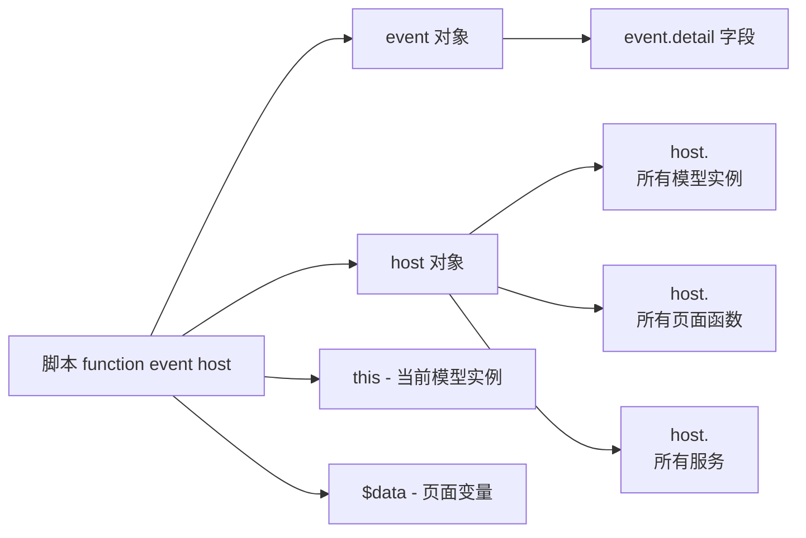

# 11 · 模型事件与脚本

> 本章讲解 6 大模型的事件清单、event.detail 形状、怎么在设计期绑定脚本。

---

## 1. 一句话

> **6 大模型都能派发事件，你可以在 Models 面板的"事件"Tab 给某个事件写一段处理脚本。**

脚本运行环境：

```js
function(event, host) {
  with (host) {
    // 你写的代码（可以直接用 host 上的所有东西）
  }
}
```

> 来源：[models-event-script-hints.js:75-91](file:///media/yqs/工作/rustspace/cmx/CMXHTMLDesigner/src/components/designer-page-data/models-event-script-hints.js)

---

## 2. 6 大模型的事件清单

> **设计器 Models 面板「事件」Tab 展示的内置事件** 来自 [models-event-script-hints.js:11-17](file:///media/yqs/工作/rustspace/cmx/CMXHTMLDesigner/src/components/designer-page-data/models-event-script-hints.js#L11-L17)。

| 模型 | 事件 |
| --- | --- |
| **CmxDataSet** | `ds-row-added` / `ds-row-removed` / `cursor-changed` / `row-changed` |
| **CmxMasterSlave** | `change` / `select` / `aggregate` |
| **CmxColumnModel** | （无内置事件；不继承 EventTarget，写自定义事件名运行时绑定会被静默跳过） |
| **CmxDCTMeta** | `meta-changed` |
| **CmxDOCMeta** | `meta-changed` |
| **FlexibleCombination** | （**未在设计器事件清单中暴露**，但运行时仍派发——见 §6） |

> 来源：[models-event-script-hints.js:11-17](file:///media/yqs/工作/rustspace/cmx/CMXHTMLDesigner/src/components/designer-page-data/models-event-script-hints.js#L11-L17)

---

## 3. 每个事件的 `event.detail` 形状

### 3.1 CmxDataSet 事件

| 事件 | event.detail |
| --- | --- |
| `ds-row-added` | `{ row }` |
| `ds-row-removed` | `{ row }` |
| `cursor-changed` | `{ index, prevIndex, row, id }` |
| `row-changed` | `{ row, key, value }` |

### 3.2 CmxMasterSlave 事件

| 事件 | event.detail |
| --- | --- |
| `change` | `{ path, id, key, value, row }` |
| `select` | `{ path, id }` |
| `aggregate` | `{ rule, value, targetId }` |

### 3.3 元数据事件

| 事件 | event.detail |
| --- | --- |
| `meta-changed` | `{ reason, model }`，reason: `load` / `merge-field-sets` |

---

## 4. 脚本里能访问的变量



| 变量 | 含义 |
| --- | --- |
| `event` | 触发的 CustomEvent 对象 |
| `host` | 当前页面的 Web Component 实例 |
| `this` | 当前模型实例（`CmxDataSet` / `CmxMasterSlave` 等） |
| `$data` | 页面变量（在 Page Data → Data 标签里声明的） |
| `host.<instanceId>` | 任何模型实例 |
| `host.<pageFnName>` | 任何页面函数 |
| `host.<pageServiceName>` | 任何服务 |

---

## 5. 实战：监听"行变化 → 改总金额"

```js
// 在 Models 面板选中 CmxDataSet → 事件 Tab → row-changed → 写脚本
function(event, host) {
  with (host) {
    // event.detail = { row, key, value }
    if (event.detail.key === 'debit') {
      // 重新汇总
      var total = 0
      $data.items.forEach(function(r) { total += Number(r.debit) || 0 })
      $data.totalDebit = total
    }
  }
}
```

或者用 CmxMasterSlave 的 `aggregate` 事件：

```js
function(event, host) {
  with (host) {
    // event.detail = { rule, value, targetId }
    console.log('规则', event.detail.rule.from, '→',
                event.detail.targetId + '.' + event.detail.rule.toField,
                '=', event.detail.value)
  }
}
```

---

## 6. 弹性组合的事件

虽然**没在 `MODEL_EVENT_PRESETS` 里列出**（设计器「事件」Tab 里看不到），`CmxFlexibleCombination` 在引擎内部会派发（`cmx-flexible-combination.js:23-26`）：

| 事件 | 含义 | event.detail |
| --- | --- | --- |
| `flexible-combination-loaded` | 规则应用成功（`loadByAnchor` 命中缓存或取数成功后） | `{ anchor, ruleId, fromCache }` |
| `flexible-combination-error` | 取数失败或解析失败 | `{ anchor, error }` |
| `flexible-combination-cleared` | `clear()` 调用 | （无 detail） |

你可以直接用 `addEventListener` 监听（注意：**没在设计器事件 Tab 暴露，需要在 pageFns 里写**）：

```js
// 某个 pageFn 里
host.detailFC.addEventListener('flexible-combination-loaded', function (e) {
  console.log('规则应用成功：', e.detail.ruleId, '（来自缓存：' + e.detail.fromCache + '）')
})

host.detailFC.addEventListener('flexible-combination-error', function (e) {
  console.warn('弹性组合失败：', e.detail.error)
})
```

---

## 7. 一个事件 Tab 的设计期画面

```text
┌─ CmxDataSet: itemsDs ─────────────────────────────┐
│  [属性] [事件]                                      │
│                                                    │
│  事件名:  [row-changed      ▾]                      │
│  脚本:    [                                          ]
│  [                                          ]
│  [ function(event, host) {                          ]
│  [   with (host) {                                  ]
│  [     if (event.detail.key === 'qty') { ... }      ]
│  [   }                                              ]
│  [ }                                                ]
│                                                    │
│  提示：                                            │
│    event.detail.row  — 发生变更的行对象             │
│    event.detail.key  — 变更的字段名                 │
│    event.detail.value — 变更后的新值                │
└────────────────────────────────────────────────────┘
```

> 提示框内容来自 [models-event-script-hints.js §getModelEventScriptHintHtml](file:///media/yqs/工作/rustspace/cmx/CMXHTMLDesigner/src/components/designer-page-data/models-event-script-hints.js)

---

## 8. 注意点

| 点 | 说明 |
| --- | --- |
| 脚本运行环境是 `with (host) { ... }` | 写 `ms` 等于 `host.ms` |
| 不能用 `import` | 脚本不是 ES Module；要引用类用 `globalThis.__cmxDataComp` |
| 事件名区分大小写 | `row-changed` ≠ `rowChanged` |
| 自定义事件 | CmxColumnModel 不内置事件，写了也只在模型层看到 |
| 错误捕获 | 脚本抛错会被 `console.error` 捕获，不会让页面崩 |

---

## 小结

- **6 大模型都有事件**（CmxColumnModel 例外，无内置事件）
- **event.detail 形状** 见上表
- **脚本环境** = `function(event, host) { with (host) { ... } }`
- **可访问**：event / host / this / $data / 任何 host 上的模型/函数/服务

---

下一步：去 [12-运行时初始化流程](12-运行时初始化流程.md) 看从设计器保存到 Portal 渲染的完整链路。
