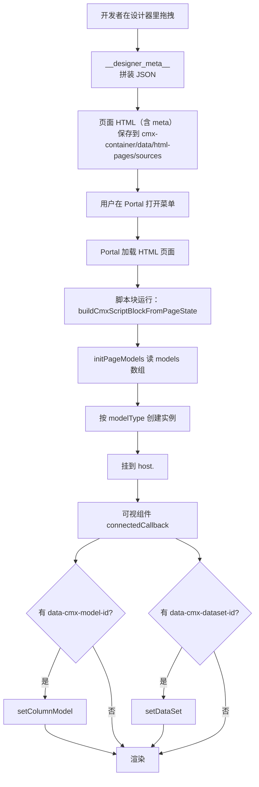
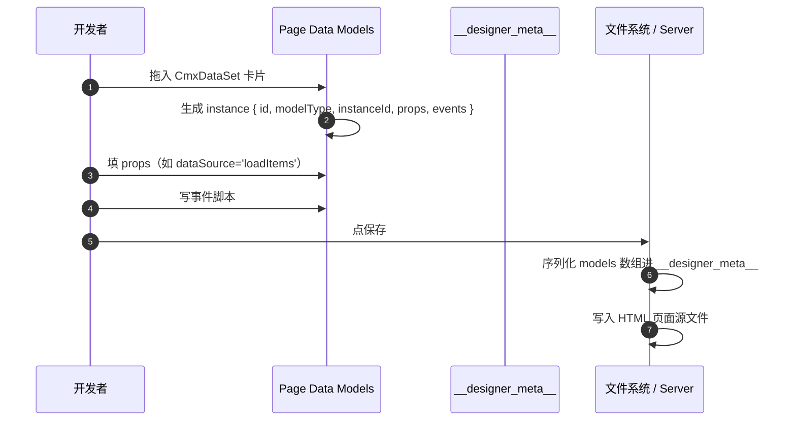
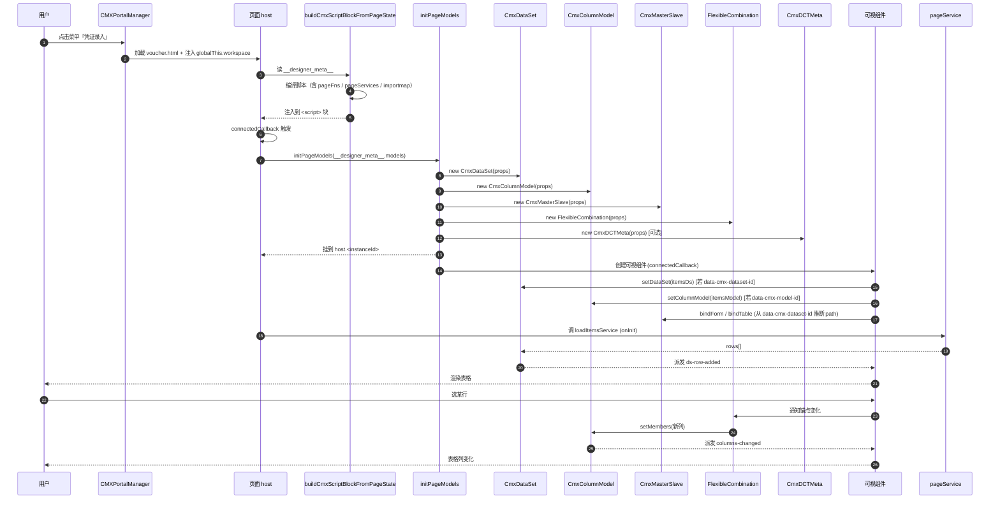
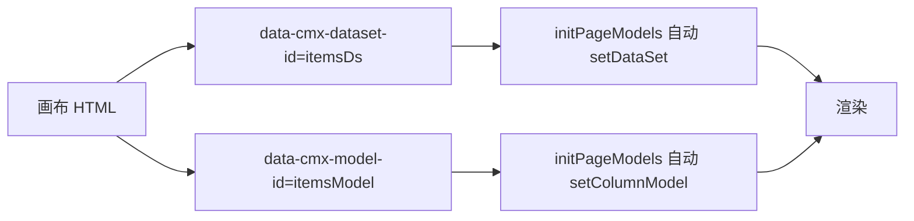
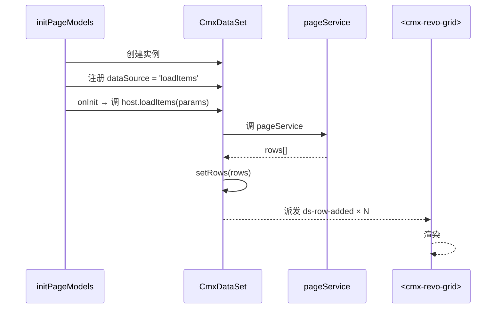
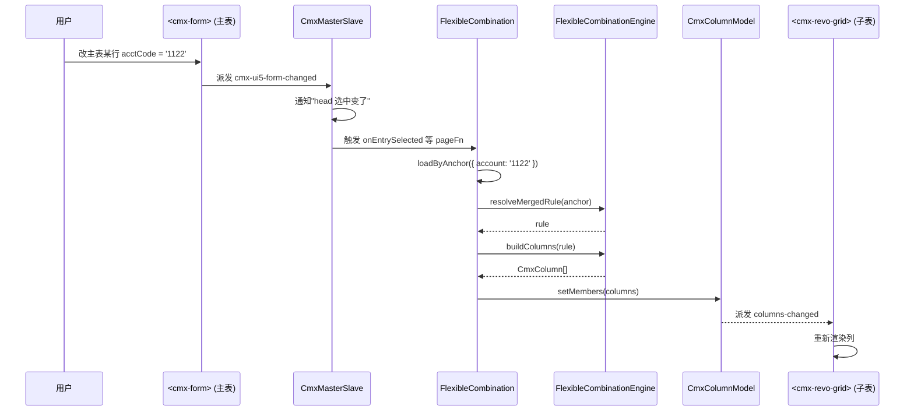
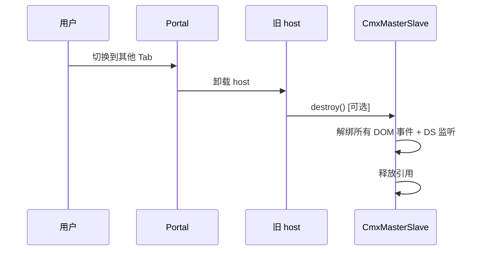

# 12 · 运行时初始化流程（设计 → 运行 全过程）

> 本章把前面 11 章串起来，画一张从"开发者拖拽保存"到"用户在 Portal 看到内容"的完整链路。

---

## 1. 全景图



---

## 2. 设计器侧：保存



最终 `__designer_meta__` 大致这样：

```jsonc
{
  "pageData":       [ /* $data 变量 */ ],
  "pageFns":        [ /* pageFns 函数 */ ],
  "pageServices":   [ /* pageServices */ ],
  "pageDeps":       [ /* import 声明 */ ],
  "pageInterfaces": [ /* 页面接口 */ ],
  "dataFlow":       { /* 兼容老配置 */ },
  "models": [
    { "modelType": "CmxDataSet",     "instanceId": "itemsDs",   "props": {...}, "events": {...} },
    { "modelType": "CmxColumnModel", "instanceId": "itemsModel", "props": {...}, "events": {...} },
    { "modelType": "CmxMasterSlave", "instanceId": "ms",        "props": {...}, "events": {...} },
    { "modelType": "FlexibleCombination", "instanceId": "detailFC", "props": {...}, "events": {...} }
  ]
}
```

---

## 3. 运行时：完整初始化流程



> 来源：[init-page-models.js](file:///media/yqs/工作/rustspace/cmx/packages/cmx-data-comp/src/lib/init-page-models.js) + [packages/cmx-data-comp/CLAUDE.md](file:///media/yqs/工作/rustspace/cmx/packages/cmx-data-comp/CLAUDE.md)

---

## 4. 关键源码链路

| 阶段 | 关键文件 |
| --- | --- |
| 设计器配置 | `../../cmx-html-designer` |
| 序列化进 HTML | `../../cmx-html-designer` 的 `setState/getState` |
| 编译脚本 | `../../cmx-html-designer` |
| 运行时初始化 | `packages/cmx-data-comp/src/lib/init-page-models.js` |
| 模型类 | `packages/cmx-data-comp/src/lib/cmx-data-set.js` / `cmx-column-model.js` / `cmx-master-slave.js` / `cmx-flexible-combination.js` / `cmx-dct-meta.js` / `cmx-doc-meta.js` |
| 注入 host | `init-page-models.js` 的 `initPageModels` 函数 |
| 可视组件绑定 | 通过 `data-cmx-dataset-id` / `data-cmx-model-id` DOM 属性 |

---

## 5. 视图与模型的"声明式绑定"



```html
<cmx-revo-grid
  id="itemsGrid"
  data-cmx-dataset-id="itemsDs"
  data-cmx-model-id="itemsModel">
</cmx-revo-grid>
```

```js
// init-page-models.js 内部
const grid = root.querySelector('#itemsGrid')
if (grid?.setDataSet && host.itemsDs) grid.setDataSet(host.itemsDs)
if (grid?.setColumnModel && host.itemsModel) grid.setColumnModel(host.itemsModel)
```

---

## 6. 服务调用与数据流



> 关键点：`pageService` 编译后的签名是 `(params, _opts)`，`AbortSignal` 通过 `_opts.signal` 自动传入。

> 来源：[packages/cmx-data-comp/CLAUDE.md §use-combo-box](file:///media/yqs/工作/rustspace/cmx/packages/cmx-data-comp/CLAUDE.md)

---

## 7. 弹性组合触发的列变更流程



---

## 8. 销毁（SPA 场景）



> 来源：[cmx-master-slave.js §destroy()](file:///media/yqs/工作/rustspace/cmx/packages/cmx-data-comp/src/lib/cmx-master-slave.js)

---

## 9. 常见运行时问题排查

| 现象 | 可能原因 |
| --- | --- |
| `host.<instanceId>` 是 undefined | models 数组里漏了这个 modelType / instanceId 拼错 |
| 表格没数据 | `dataSource` 没填 / `dataSourceEvent` 不是 `onInit` / service 404 |
| 列没出现 | `columnModelId` 拼错 / 列模型 `columns=[]` 且没 FC 触发 |
| 聚合不工作 | `aggregations` 的 `from/to/toField` 路径写错 |
| 事件没触发 | 事件名拼错（区分大小写）/ 脚本语法错误 |
| FC 静默失败 | `columnModelId` 目标不存在 / inlineData 解析失败（控制台有 warn） |

---

## 小结

- **设计期** = 配 `models` 数组，序列化进 `__designer_meta__`
- **运行期** = `initPageModels` 按 `modelType` 创建实例，挂到 `host.<instanceId>`
- **视图绑定** = `data-cmx-dataset-id` / `data-cmx-model-id` DOM 属性自动桥接
- **数据流** = pageService → DataSet → 可视组件
- **列变更流** = 锚点变化 → FC → Engine → setMembers → 可视组件

---

下一步：去 [13-常用字段速查表](13-常用字段速查表.md) 当备查手册。
