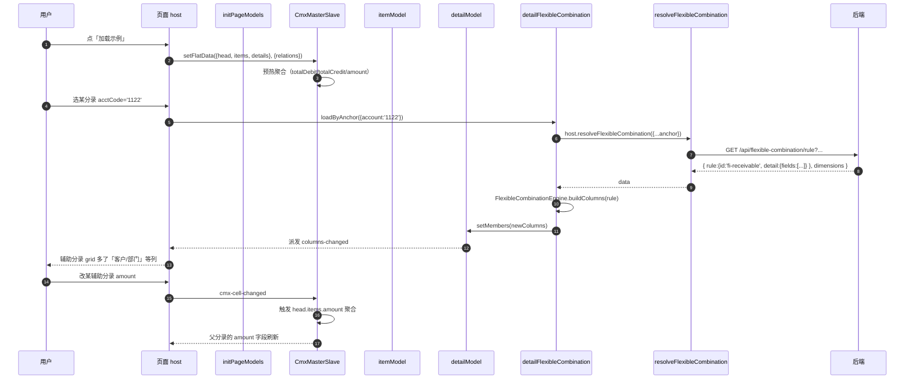
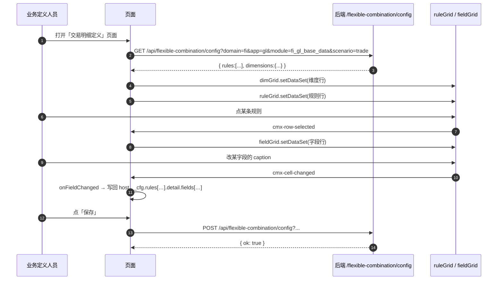
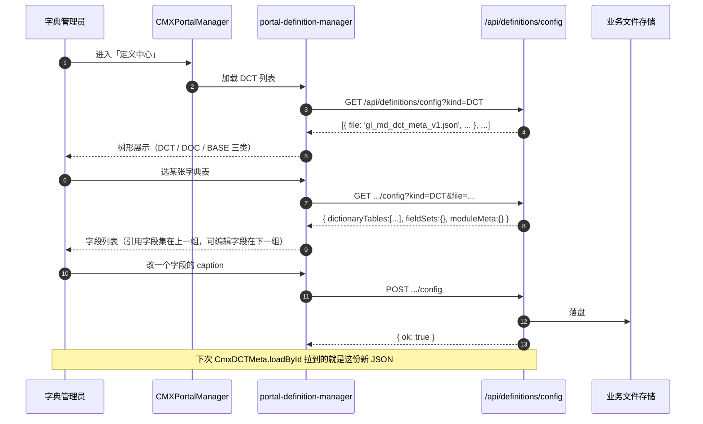
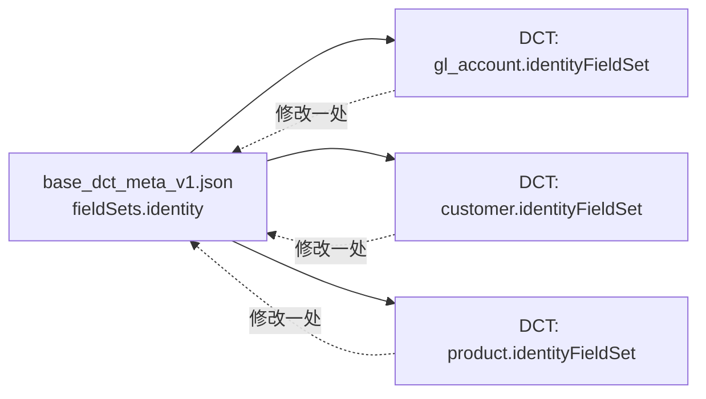

# 14 · 典型场景示例（3 个端到端真实案例）

> 本章用 3 个**真实存在的页面源文件**（位于 `cmx-container/data/html-pages/sources/fi/cmxfico/gl/`）演示：
> 1. 6 大模型怎么配合
> 2. 真实 JSON 长什么样
> 3. 一条端到端的数据/列变更链路怎么走
>
> 全部基于代码现状，不掺水。

---

## 场景 1 · 会计凭证（cnpc-ms）= CmxMasterSlave 三层主从 + FlexibleCombination 科目辅助核算

> **真实文件**：`cmx-container/data/html-pages/sources/fi/cmxfico/gl/erp-voucher-cnpc-ms.html`
> （迁移前位于 `../../cmx-html-designer`）

### 1.1 场景目标

- 一个**凭证头**（period / orgUnit / voucherDate / ...）
- N 条**会计分录**（科目编号 / 借方 / 贷方 / ...）
- 每个分录下面有 N 条**辅助分录**（按所选科目动态决定有哪些列）
- 三层之间的关键联动：分录改了借/贷 → 表头自动汇总；分录选了科目 → 辅助分录的列跟着变

### 1.2 用到哪些模型

| 模型 | instanceId | 作用 |
| --- | --- | --- |
| CmxMasterSlave | `ms` | 三层主子协调 + 聚合 |
| CmxColumnModel | `itemModel` | 会计分录 grid 的列 |
| CmxColumnModel | `detailModel` | 辅助分录 grid 的列（**初始为空**，由 FC 填充） |
| FlexibleCombination | `detailFlexibleCombination` | 按 `account` 锚点动态生成辅助分录的列 |
| CmxDataSet | `headDataSet` / `itemDataSet` / `detailsDataSet` | 树形数据（设计期写死但没在运行时主动用，靠 `setFlatData` 直喂） |

> 来源：`erp-voucher-cnpc-ms.html` 的 `__designer_meta__.models` 数组

### 1.3 关键 JSON（models 数组）

```jsonc
{
  "models": [
    { "modelType": "CmxMasterSlave", "instanceId": "ms", "props": {
        "schema": [
          { "id": "head", "children": [
            { "id": "items", "children": [
              { "id": "details" }
            ]}
          ]}
        ],
        "aggregations": [
          { "from": "head.items.details", "to": "head.items", "field": "amount", "toField": "amount", "agg": "sum" },
          { "from": "head.items",         "to": "head",       "field": "debit",  "toField": "totalDebit",  "agg": "sum" },
          { "from": "head.items",         "to": "head",       "field": "credit", "toField": "totalCredit", "agg": "sum" }
        ]
    }},
    { "modelType": "CmxColumnModel", "instanceId": "itemModel", "props": {
        "datasetId": "head.items",
        "columns": [
          { "id":"acctCode", "caption":"科目编号", "type":"text",  "width":"110px" },
          { "id":"acctName", "caption":"科目名称", "type":"text",  "width":"140px" },
          { "id":"summary",  "caption":"业务摘要", "type":"text",  "width":"220px" },
          { "id":"debit",    "caption":"借方金额", "type":"number","width":"130px", "align":"right" },
          { "id":"credit",   "caption":"贷方金额", "type":"number","width":"130px", "align":"right" }
        ]
    }},
    { "modelType": "CmxColumnModel", "instanceId": "detailModel", "props": {
        "datasetId": "head.items.details",
        "columns": [
          { "id":"remark", "caption":"备注", "type":"text",  "width":"240px" },
          { "id":"amount", "caption":"金额", "type":"number","width":"120px", "align":"right" }
        ]
    }},
    { "modelType": "FlexibleCombination", "instanceId": "detailFlexibleCombination", "props": {
        "domain": "fi", "app": "gl", "module": "fi_gl_base_data",
        "scenario": "account",
        "columnModelId": "detailModel",
        "serviceFn": "resolveFlexibleCombination",
        "apiPath": "/api/flexible-combination/rule"
    }}
  ]
}
```

> 关键点：`detailModel.columns` 一开始**只有 `remark + amount` 两列**——选好科目后才被 FC 追加 `customer / department / project / ...` 等。

### 1.4 端到端流程图



### 1.5 数据装载的 pageFn（节选自 voucher.html）

```js
// pageFn: initVoucher
var ms = host.ms
host.__flexibleCombinationCache = {}
var demoHeads = [{ id:'h1', period:'2026-05', orgUnit:'总部财务部', voucherDate:'2026-05-28',
                   voucherType:'ZK', voucherNo:'ZK-202605-0001',
                   preparer:'李会计', auditor:'王主管', payerInfo:'出纳：张三' }]
var demoItems  = [
  { id:'i1', headId:'h1', acctCode:'1001', acctName:'库存现金', summary:'收到客户回款', debit:50000, credit:0     },
  { id:'i2', headId:'h1', acctCode:'1122', acctName:'应收账款', summary:'冲销应收',     debit:0,     credit:50000 },
  { id:'i3', headId:'h1', acctCode:'6601', acctName:'管理费用', summary:'差旅报销',     debit:1200,  credit:0     },
  { id:'i4', headId:'h1', acctCode:'1002', acctName:'银行存款', summary:'现金转入',     debit:0,     credit:1200  }
]
var demoDetails = [
  { id:'d1', itemId:'i1', amount:50000, remark:'5 月预付' },
  { id:'d2', itemId:'i2', amount:50000, customer:'C-001', project:'P-2026-001', remark:'冲销应收' },
  { id:'d3', itemId:'i3', amount:1200,  department:'D-100', project:'P-2026-002', remark:'上海差旅' },
  { id:'d4', itemId:'i4', amount:1200,  bankAccount:'BOC-6228', remark:'ATM 取现' }
]

ms.setFlatData({ head: demoHeads, items: demoItems, details: demoDetails }, {
  relations: [
    { parent:'head',  child:'items',   parentKey:'id', childKey:'headId'  },
    { parent:'items', child:'details', parentKey:'id', childKey:'itemId' }
  ]
})

// 监听「选分录」事件 → 触发 FC
host.detailGrid.addEventListener('cmx-columns-changed', function () { host.onDetailColumnsChanged() })
host.applyDetailSchema(demoItems[0] && demoItems[0].acctCode)
```

### 1.6 「小白可以怎么改」

| 想做的事 | 改哪里 |
| --- | --- |
| 加一条聚合规则 | Models 面板 → `ms` → 聚合规则 → `+ 添加聚合规则` |
| 改科目辅助核算的列 | 后端 `/api/flexible-combination/rule` 的 rules 配置 |
| 不走后端，直接把规则写死在页面里 | Models 面板 → `detailFlexibleCombination` → `props.inlineData` |
| 监控 FC 加载结果 | pageFns 里写 `host.detailFlexibleCombination.addEventListener('flexible-combination-loaded', ...)` |

---

## 场景 2 · 交易明细定义（trade-def）= 设计期编辑器 + 双锚点 [txType, productType]

> **真实文件**：`cmx-container/data/html-pages/sources/fi/cmxfico/gl/trade-def.html`
> （迁移前位于 `../../cmx-html-designer`）

### 2.1 场景目标

- 业务定义人员可以**在线编辑**「交易明细」场景的弹性组合规则
- 锚点：**两个维度组合** `txType`（交易类型）× `productType`（产品类型）
- 三个 cmx-revo-grid 分别展示「维度目录 / 细分规则 / 字段定义」
- 改完一个字段（caption / 必填 / 公式）→ 调 `saveFlexibleCombination` 落库

### 2.2 用到哪些模型

- **没用 Models 面板的模型组件**——直接用 `CmxColumnModel` 类在 pageFns 里 new 出来喂给 grid
- 整页是**设计期编辑器**，不直接体现"运行时"模型组件

> 这是一个**反例**——不是每个页面都要走 6 大模型实例化；这里用更轻量的方式。

### 2.3 关键 pageFn：loadDef

```js
var CmxColumnModel = C.CmxColumnModel, CmxColumn = C.CmxColumn
var mkCol = function (o) { return new CmxColumn(o) }

dimGrid.setColumnModel(new CmxColumnModel({ datasetId:'dims', members:[
  mkCol({ id:'code',      caption:'维度编码',  type:'text',  width:'140px', editMode:'readonly' }),
  mkCol({ id:'name',      caption:'名称',     type:'text',  width:'120px', editMode:'readonly' }),
  mkCol({ id:'valueType', caption:'取值方式',  type:'text',  width:'120px', editMode:'readonly' }),
  mkCol({ id:'attrs',     caption:'属性',     type:'text',  width:'240px', editMode:'readonly' })
]}))

ruleGrid.setColumnModel(new CmxColumnModel({ datasetId:'rules', members:[
  mkCol({ id:'id',         caption:'规则ID',  type:'text',   width:'180px', editMode:'readonly' }),
  mkCol({ id:'anchor',     caption:'锚点匹配', type:'text',   width:'260px', editMode:'readonly' }),
  mkCol({ id:'fieldCount', caption:'字段数',  type:'number', width:'90px',  align:'right', editMode:'readonly' })
]}))

fieldGrid.setColumnModel(new CmxColumnModel({ datasetId:'fields', members:[
  mkCol({ id:'code',     caption:'字段编码', type:'text',  width:'140px', editMode:'readonly' }),
  mkCol({ id:'kind',     caption:'类型',    type:'text',  width:'110px', editMode:'readonly' }),
  mkCol({ id:'caption',  caption:'显示名',   type:'text',  width:'130px' }),
  mkCol({ id:'editMode', caption:'编辑方式', type:'text',  width:'120px' }),
  mkCol({ id:'required', caption:'必填',    type:'text',  width:'80px'  }),
  mkCol({ id:'formula',  caption:'计算公式', type:'text',  width:'220px' })
]}))
```

### 2.4 端到端流程图



### 2.5 「小白可以怎么改」

| 想做的事 | 改哪里 |
| --- | --- |
| 改展示用的列 | `loadDef` 里的 `mkCol(...)` 调用 |
| 监听字段变化 | `data-eventcmx-cell-changed="onFieldChanged(event);"` |
| 加第三个锚点 | `anchor.dimensions: ['txType', 'productType', 'org']` 在后端配置 |
| 让编辑页能直接试运行 FC | pageFns 里 `new FlexibleCombination(...).setCombination(host.__cfg)` |

---

## 场景 3 · DCT/DOC 设计期管理（portal-definition-manager）= 字段集共享 + 多文档树

### 3.1 场景目标

- **CMXPortalManager** 内置组件，负责"数据字典 + 业务单据"设计期编辑
- 树形展示三种文档：**DCT**（字典）/ **DOC**（单据）/ **BASE**（基础元数据）
- 一张 DCT 字典表可以通过 `baseFieldSet / systemFieldSet / ...` 引用 BASE 的字段集
- 一张 DOC 单据表既可引用 BASE 字段集，也可引用 `voucherCommonFieldSet` 单据级字段集

### 3.2 与 6 大模型的关系

- **portal-definition-manager 不是 6 大模型之一**——它直接编辑业务文件
- 它输出的 JSON 才是 `CmxDCTMeta` / `CmxDOCMeta` 在运行时加载的"产品"
- 所以它是**生产 DCT/DOC JSON 的工具**

### 3.3 关键字段集分类（与 [06-基础元数据](06-基础元数据-BASE是什么.md) 对应）

| 文档类型 | 可引用的字段集名 |
| --- | --- |
| **DCT（字典）** | `baseFieldSet` / `hierarchyFieldSet` / `auditFieldSet` / `scopeFieldSet` / `effectiveFieldSet` / `disableFieldSet` / `systemFieldSet` |
| **DOC（单据）** | `voucherCommonFieldSet` / `documentFieldSets` / `baseFieldSet` / `technicalFieldSet` / `identityFieldSet` / `sourceFieldSet` / `lifecycleFieldSet` / `commonFieldSet` |

> 来源：`portal-definition-manager.js:578` 附近；命名键以 `*FieldSet` 结尾

### 3.4 端到端流程图



### 3.5 字段集共享的实际效果



- 三张字典都引用了同一个 `identity` 字段集
- 在 portal-definition-manager 里改 `identity` 字段集本身 → 三张字典都自动跟随
- 字段集本身**不可在每张字典上单独改 caption**——它是共享定义

### 3.6 「小白可以怎么改」

| 想做的事 | 改哪里 |
| --- | --- |
| 新增一个共享字段集 | portal-definition-manager → BASE 文档 → fieldSets 加新 key |
| 把字段集引用到新表 | DCT/DOC 文档 → 选表 → `+ 引用模板` |
| 看某字段是否在多个 fieldSet 出现歧义 | 切换到「带限定键」模式 |
| 让运行时自动加载 | 在 HTML 页面里 Models 面板加 CmxDCTMeta，`autoLoad: true` |

---

## 三个场景对比

| 维度 | 场景 1 凭证 | 场景 2 交易定义 | 场景 3 定义中心 |
| --- | --- | --- | --- |
| 用的模型组件 | 5 个（MS + 2 CM + FC + 3 DS） | 0 个（直接 `new` 类） | 0 个（管理工具） |
| 主要交互 | 录凭证 / 选科目 | 编辑规则 | 维护字典/单据定义 |
| 列怎么变 | FC 按 `account` 改 | 整页是列定义本身 | 整页是 JSON |
| 数据流方向 | 模型 → 视图 | 视图 ↔ 后端 ↔ 文件 | 视图 ↔ 文件 |
| 端到端关键 | `setFlatData` + `loadByAnchor` | `setDataSet` + `addEventListener` | 写后端文件 |
| 触发列变更的动作 | 选分录 | 选规则 | （无） |

---

## 小结

- **场景 1** 是 6 大模型**最完整的应用**：MS 协调 + FC 动态列 + DS 树形数据
- **场景 2** 是**反例/简化**：直接用类，不走 6 大模型声明；适合"页面本身就是定义编辑器"的场景
- **场景 3** 是**上游工厂**：portal-definition-manager 生产 DCT/DOC JSON，被场景 1 的 CmxDCTMeta 消费
- 三个场景**互补**，形成"定义 → 消费 → 维护"闭环

---

下一步：去 [15-术语表-详细版](15-术语表-详细版.md) 查阅所有术语。
