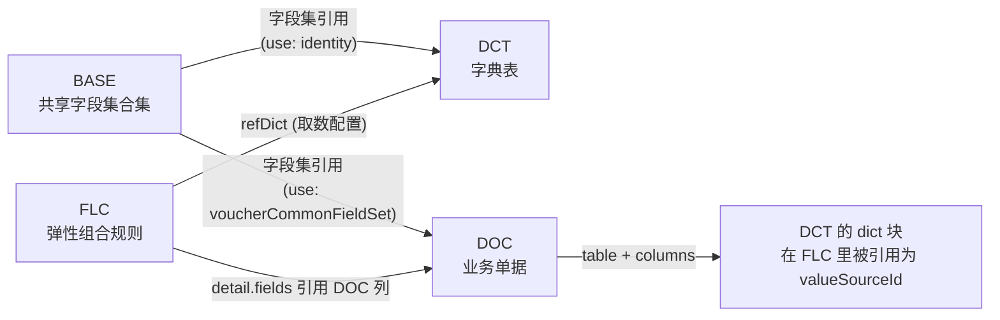
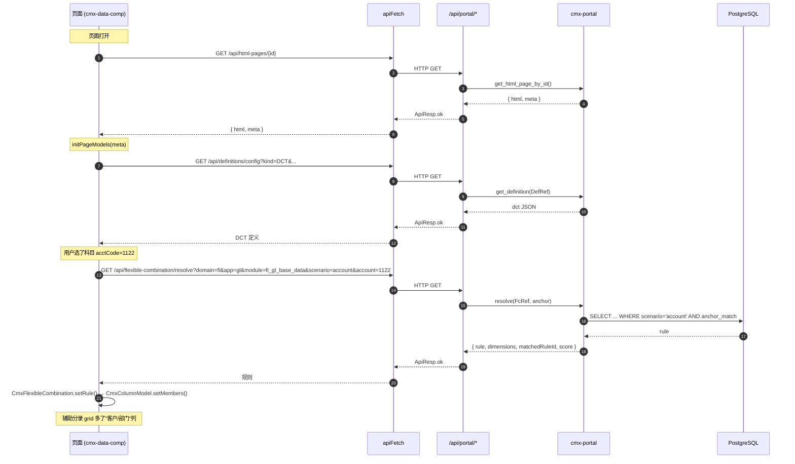

# 16 · 后端 API 详解（cmx-container / Rust）

> 本章梳理 **6 大模型 + 设计器/门户** 实际调用的后端接口。所有路径挂在 **`/api/`** 前缀下（Rust 后端在 `cmx-container/crates/libs/cmx-api/src/handlers/portal/mod.rs:256` 注册的 prefix 是 `portal`）。
>
> 全部基于源码现状（`cmx-container` 替换了原 `cmx-node-server`，2026-06 切换完成），不掺水。

---

## 1. 通用约定

### 1.1 响应信封

所有 handler 统一返回 [`ApiResp`](file:///media/yqs/工作/rustspace/cmx/cmx-container/crates/libs/cmx-api/src/lib.rs) 信封：

```jsonc
// 成功
{ "code": 0, "ok": true,  "data": { ... } }
// 业务失败
{ "code": 422, "ok": false, "msg": "校验未通过", "data": { ...diagnostics } }
// 系统错误
{ "code": 500, "ok": false, "msg": "Internal: ..." }
```

> 前端 [`apiFetch`](file:///media/yqs/工作/rustspace/cmx/CMXPortalManager/src/lib/apiFetch.js) 自动拆 `data`，所以业务代码看到的总是 `data` 内部形状。

### 1.2 身份与上下文头

| Header | 含义 | 说明 |
| --- | --- | --- |
| `Authorization: Bearer <jwt>` | 鉴权 | 由 [`mw_auth`](file:///media/yqs/工作/rustspace/cmx/cmx-container/crates/libs/cmx-api/src/middleware/mw_auth.rs) 校验 |
| `x-cmx-db-id: default` | 数据源 | 多库时切换；DCT/DOC 数据接口必读 |
| `x-cmx-trace-id: ...` | 链路追踪 | 缺省自动生成（[`mw_trace`](file:///media/yqs/工作/rustspace/cmx/cmx-container/crates/libs/cmx-api/src/middleware/mw_trace.rs)） |

### 1.3 DAM 三段定位

几乎所有"业务文件"类接口都用四段定位：

| 段 | 含义 | 例子 |
| --- | --- | --- |
| `domain` | 业务域 | `fi` / `ar` / `ap` / `fa` / `hr` / `base` |
| `app` / `application` | 应用 | `cmxfico` / `gl` |
| `module` | 模块 | `fi_gl_base_data` / `cmxfico` |
| `file` | 定义文件名 | `cmxfico_dct_meta_v1.json` |
| `scenario`（仅 FLC） | 业务场景 | `account` / `trade` / `order` |

### 1.4 `kind` 枚举值详解（DCT / DOC / BASE / FLC）

> 在 2.1、2.2、2.6、2.16、4.1 等接口里反复出现的 `kind` 参数，是 cmx 模型的**四大文件类型**。它们分别对应**不同的设计期产物**，被**不同的运行时模型组件**消费。

| kind | 全称 | 它是啥 | 装的是啥 | 运行时谁用 | 落盘目录 | 举例文件名 |
| --- | --- | --- | --- | --- | --- | --- |
| **DCT** | **D**ata **C**ode **T**able（数据字典） | 业务用"编码+名称"对查的字典 | 一个业务域的若干张字典表（如 `currency` / `gl_account` / `customer`），每张表含**列定义** + **字段集引用** | `CmxDCTMeta`（[04 章](04-字典模型-CmxDCTMeta.md)） | `cmx-container/data/meta/definitions/<domain>/<app>/<module>/<dctFile>` | `cmxfico_dct_meta_v1.json` |
| **DOC** | **D**ocument **O**f **C**ontent（业务单据） | 业务单据的"物理表+业务层"定义 | 一张单据的若干**物理表**（如 `voucher_head` / `voucher_detail`）+ 物理表之间的**主外键关系** + **字段集引用** | `CmxDOCMeta`（[05 章](05-单据模型-CmxDOCMeta.md)） | `cmx-container/data/meta/definitions/<domain>/<app>/<module>/<docFile>` | `cmxfico_doc_meta_v1.json` |
| **BASE** | **Base** MetaData（基础元数据） | "多个 DCT/DOC 共用"的**字段集合集** | 若干**共享字段集**（如 `common_audit` / `identity` / `hierarchy` / `voucherCommonFieldSet`）——本身不是表，是给 DCT/DOC 复用的"零件库" | `loadMetaBatch` 的 `bases` 返回 / `loadBaseById` 合并（[06 章](06-基础元数据-BASE是什么.md)） | `cmx-container/data/meta/definitions/<domain>/<app>/<module>/<baseFile>` | `cmxfico_base_meta_v1.json` |
| **FLC** | **F**lexible Combination **L**ogic（弹性组合规则） | "选 X 维度后，列出 Y 列"的规则集 | 业务场景下的若干**规则**（`rules[]`），每条规则含**锚点** + **detail 字段定义** + **维度配置** | `CmxFlexibleCombination`（[10 章](10-弹性组合-FlexibleCombination.md)，**别名 ContextProfile**） | `cmx-container/data/meta/flexible-combination/<domain>/<app>/<module>/<scenario>/<flcFile>` | `account.json` / `trade.json` |

#### 四个 kind 的关系图



#### 关键点

1. **BASE 不是表**——它本身不能被运行时直接加载，必须被 **DCT/DOC 通过 `use: 'xxx'` 引用**后才能用
2. **DCT 和 DOC 的文件命名约定**是 `<app>_{dct|doc|base}_meta_v<version>.json`；多版本同时存在
3. **FLC 的目录约定**多一层 `<scenario>/`——一个 module 下可有多个场景规则文件
4. **`kind` 在数据库建表里也很重要**——`/api/model/deploy` 接受 `kind` 来决定建 DCT 表还是 DOC 表
5. **真实路径**（`fi/cmxfico/gl/` 模块下）：

```
cmx-container/data/meta/definitions/fi/cmxfico/gl/
├── cmxfico_base_meta_v1.json
├── cmxfico_dct_meta_v1.json
└── cmxfico_doc_meta_v1.json
cmx-container/data/meta/flexible-combination/fi/cmxfico/gl/
└── account/
    └── account.json
```

> 📖 **进一步阅读**：
> - DCT 见 [04 章](04-字典模型-CmxDCTMeta.md)
> - DOC 见 [05 章](05-单据模型-CmxDOCMeta.md)
> - BASE 与字段集关系见 [06 章](06-基础元数据-BASE是什么.md)
> - FLC 见 [10 章](10-弹性组合-FlexibleCombination.md)

---

### 1.4 错误码

| 范围 | 含义 | 例子 |
| --- | --- | --- |
| `0` | 成功 | — |
| `4xx` | 业务可处理 | `422` 校验失败，`404` 资源不存在 |
| `5xx` | 系统错误 | `500` SQL 失败，`501` 业务未实现 |

---

## 2. 三元定义 API（DCT / DOC / FLC）

> 路径统一以 `/api/definitions/*` / `/api/flexible-combination/*` / `/api/defs/*` 为前缀。
> 来源：[`mod.rs:133-253`](file:///media/yqs/工作/rustspace/cmx/cmx-container/crates/libs/cmx-api/src/handlers/portal/mod.rs#L133-L253)

### 2.1 `GET /api/definitions/list` —— 列定义清单

| Query 字段 | 类型 | 必填 | 含义 |
| --- | --- | --- | --- |
| `kind` | string | 否 | 四大文件类型之一：`DCT` / `DOC` / `BASE` / `FLC`（**详见 [§1.4](#14-kind-枚举值详解dct--doc--base--flc)**）；不传 = 全部 |
| `domain` | string | 否 | 业务域；不传 = 全部域 |
| `application` / `app` | string | 否 | 应用别名/全名；二者等价 |
| `module` | string | 否 | 模块；不传 = 全部模块 |

**响应 `data`**：`{ items: [{ file, version, isDefault, tableCount, summary, ... }] }`

**示例**：

```bash
curl 'http://localhost:8080/api/definitions/list?kind=DCT&domain=fi&app=cmxfico'
```

---

### 2.2 `GET /api/definitions/config` —— 读单个定义

| Query 字段 | 类型 | 必填 | 含义 |
| --- | --- | --- | --- |
| `kind` | string | 是 | 四大文件类型之一（**详见 [§1.4](#14-kind-枚举值详解dct--doc--base--flc)**） |
| `domain` | string | 是 | 业务域 |
| `application` | string | 是 | 应用 |
| `module` | string | 是 | 模块 |
| `file` | string | 是 | 文件名（含版本） |

**响应 `data`**：定义 JSON 全文（与 `cmx-container/data/meta/definitions/.../<file>` 内容一致）。

**示例**：

```bash
curl 'http://localhost:8080/api/definitions/config?kind=DCT&domain=fi&app=cmxfico&module=cmxfico&file=cmxfico_dct_meta_v1.json'
```

> 这是 6 大模型里 **CmxDCTMeta / CmxDOCMeta** 加载时调用的接口（见 [04 章](04-字典模型-CmxDCTMeta.md) 和 [05 章](05-单据模型-CmxDOCMeta.md)）。

---

### 2.3 `POST /api/definitions/config` —— 保存定义

| Query 字段 | 类型 | 必填 | 含义 |
| --- | --- | --- | --- |
| `kind` / `domain` / `application` / `module` / `file` | 同 2.2 | 是 | 定位 |

**Request body**：完整定义 JSON（与 2.2 响应同构）。

**响应 `data`**：`{ ok: true, saved: { file, version, isDefault } }`

> 这是 `portal-definition-manager.js` 保存字典/单据时调用的接口。

---

### 2.4 `DELETE /api/definitions/config` —— 删除定义

参数同 2.2，**无 body**。响应 `{ ok, removed }`。

---

### 2.5 `POST /api/definitions/batch` —— 批量读定义 + base

**Request body**：`{ requests: [{ kind, domain, application, module, file }, ...] }`

**响应 `data`**：与请求顺序一一对应的 JSON 数组。`portal-definition-manager` 打开时一次性拉全量用。

---

### 2.6 `POST /api/definitions/default` —— 设为默认版本

参数同 2.2。**同 stem 互斥**（如 `cmxfico_dct_meta_v1.json` 与 `cmxfico_dct_meta_v2.json` 互斥，只能一个为默认）。

---

### 2.7 `GET /api/flexible-combination/list` —— FLC 规则列表

| Query 字段 | 类型 | 必填 | 含义 |
| --- | --- | --- | --- |
| `domain` | string | 否 | 域 |
| `app` | string | 否 | 应用 |
| `module` | string | 否 | 模块 |
| `scenario` | string | 否 | 业务场景 |

**响应**：`{ items: [{ file, anchor, ruleId, ... }] }`

> 这是 `portal-flexible-combination-manager.js` 打开规则库时调用的接口。

---

### 2.8 `GET /api/flexible-combination/config` —— 读 FLC 完整配置

参数同 2.7。**响应**：FLC JSON 全文（含 `rules / dimensions / anchor` 等）。

---

### 2.9 `POST /api/flexible-combination/config` —— 保存 FLC

参数同 2.7 + body=FLC JSON 全文。

---

### 2.10 `DELETE /api/flexible-combination/config` —— 删除 FLC

参数同 2.7。

---

### 2.11 `GET /api/flexible-combination/resolve` —— **核心** 按锚点解析

| Query 字段 | 类型 | 必填 | 含义 |
| --- | --- | --- | --- |
| `domain` | string | 是 | DAM 第 1 段 |
| `app` | string | 是 | DAM 第 2 段 |
| `module` | string | 是 | DAM 第 3 段 |
| `scenario` | string | 是 | DAM 第 4 段 |
| `<anchor_key>` | string | 否 | 任意锚点维度键值对，如 `?gl_account=1122&company=001` |

**响应 `data`**：`{ rule: {...}, dimensions: {...}, matchedRuleId, score }`

> 这是 **CmxFlexibleCombination** 运行时 `loadByAnchor(anchorValues)` 实际调的接口。对应 [10 章](10-弹性组合-FlexibleCombination.md) 的 §3 流程图"6. serviceFn → resolve"步骤。

**真实示例**：

```bash
curl 'http://localhost:8080/api/flexible-combination/resolve?domain=fi&app=gl&module=fi_gl_base_data&scenario=account&account=1122'
```

---

### 2.12 `GET /api/flexible-combination/rule` —— 仅取规则（不含维度）

参数同 2.11。响应只含 `{ rule }`，**比 resolve 轻量**（不查 dimensions 表）。

---

### 2.13 `POST /api/flexible-combination/validate` —— 校验 FLC 规则

参数同 2.11 + body=FLC 规则 JSON。

**响应 `data`**：`{ valid: true|false, diagnostics: [{ code, level, path, message, ... }] }`

校验失败时 `code = 422`。

---

### 2.14 `POST /api/flexible-combination/preview` —— 校验 + 解析预览

参数 + body 同 2.13。响应 `{ diagnostics, resolved: { rule, dimensions } }`。

---

### 2.15 `POST /api/flexible-combination/default` —— 设为默认 FLC

参数同 2.7。

---

### 2.16 `GET /api/defs/list` —— 统一列定义（DCT/DOC/FLC/BASE）

参数同 2.1（`kind` 可选）。**比 2.1 多支持 FLC**。

---

### 2.17 `GET /api/defs/resolve?drn=...` —— DRN 解析

| Query 字段 | 类型 | 必填 | 含义 |
| --- | --- | --- | --- |
| `drn` | string | 是 | 单个 DRN 字符串 |
| `domain` / `app` / `module` | string | 否 | DRN 缺段时回退 |

> **DRN**（DAM Resource Name）格式：`<scheme>://domain/app/module/file#anchor` 或简写 `domain/app/module/file`。
> 来源：[`defs.rs`](file:///media/yqs/工作/rustspace/cmx/cmx-container/crates/libs/cmx-portal/src/flexible_combination/defs.rs)。

**响应**：定义全文。

---

### 2.18 `GET /api/defs/deps?drn=...` —— 依赖图

**响应 `data`**：`{ drn, dependencies: ["drn://...", ...] }`

> 用于设计期"画依赖图"。

---

### 2.19 `GET /api/defs/compile?domain&app&module&scenario&<anchor>` —— FLC overlay 编译

参数同 2.11。**响应同 2.11**（= 复用 resolve 路径）。

---

## 3. 业务数据 API（DCT 数据 / DOC 数据）

> 路径：`/api/dct/*` 和 `/api/doc/*`。
> 这是 6 大模型里 **CmxDataSet** 装载业务数据时调用的接口。

### 3.1 `GET /api/dct/meta` —— 数据字典元数据（带列定义）

| Query 字段 | 类型 | 必填 | 含义 |
| --- | --- | --- | --- |
| `domain` | string | 是 | 业务域 |
| `application` | string | 是 | 应用 |
| `module` | string | 是 | 模块 |
| `file` | string | 是 | 定义文件名 |
| `dict` | string | 是 | 字典表 dictCode（如 `currency` / `gl_account`） |

**响应 `data`**：`{ name, tableName, columns: [{ name, caption, dataType, ... }], valueType, helpLayout, hierarchical }`

> 这是 6 大模型里 **CmxDCTMeta** 加载字典表后，**前端列定义来源**（dict 下拉框的列怎么显示、值怎么绑）。

---

### 3.2 `GET|POST /api/dct/data/search` —— 字典检索

| Query 字段 | 类型 | 必填 | 含义 |
| --- | --- | --- | --- |
| `domain` / `application` / `module` / `file` / `dict` | string | 是 | 同 3.1 |

**Request body**（POST 用，GET 时为 query 简化版）：

```jsonc
{
  "filter": "code = '1122' AND status = 'active'",   // WHERE 子句
  "params": { "code": "1122" },                        // 参数化绑定
  "sort": [{ "field": "code", "dir": "asc" }],         // 排序
  "page": 1, "pageSize": 50,                            // 分页
  "fields": ["id", "code", "name"],                    // 列裁剪
  "includeDisabled": false                              // 含禁用项
}
```

**响应 `data`**：`{ rows: [...], total, page, pageSize, sql }`

> 这是 6 大模型里 **CmxDCTMeta** 取字典行（如下拉框选项）时调用的接口。

---

### 3.3 `GET|POST /api/dct/data/tokio-zmc-msgpack` —— 零拷贝 + msgpack 二进制

参数同 3.2。**响应是二进制**（`application/msgpack`），用于大批量字典行性能优化场景。

---

### 3.4 `POST /api/dct/entries` —— 新增/更新字典条目

| Query 字段 | 同 3.1 |
| --- | --- |

**Request body**：`{ entries: [{ id?, code, name, ..., status: 'active' }, ...] }`

**响应**：`{ ok, upserted: n, errors?: [...] }`

---

### 3.5 `DELETE /api/dct/entries/:id` —— 删除字典条目

| Path | 类型 | 必填 | 含义 |
| --- | --- | --- | --- |
| `id` | string | 是 | 字典条目 id |

---

### 3.6 `POST /api/dct/save` —— Changeset 回存

**Request body**：`{ source, changes: [{ op: 'insert'|'update'|'delete', rowId, data? }, ...] }`

> 对标 `doc/save`（详见 3.10），用于 DCT 表格内联编辑。

---

### 3.7 `GET /api/doc/meta` —— 业务单据元数据（带层序/列定义）

| Query 字段 | 类型 | 必填 | 含义 |
| --- | --- | --- | --- |
| `domain` / `application` / `module` / `file` | string | 是 | 单据定义坐标（同 2.2） |
| `filter` | string | 否 | 根层 `col:value` 简单等值过滤 |
| `limit` | number | 否 | 根层限制行数 |
| `depth` | number | 否 | 装载深度（懒下钻） |

**响应 `data`**：投影过的单据元数据：

```jsonc
{
  "docId": "voucher",
  "title": { "zh_CN": "会计凭证" },
  "layers": [
    { "name": "head",    "tableName": "voucher_head",    "columns": [...], "primaryKey": "id" },
    { "name": "items",   "tableName": "voucher_detail",  "columns": [...], "primaryKey": "id" },
    { "name": "details", "tableName": "voucher_aux_line","columns": [...], "primaryKey": "id" }
  ],
  "relations": [
    { "parent": "head",    "child": "items",   "childKey": "head_id"  },
    { "parent": "items",   "child": "details", "childKey": "item_id"  }
  ]
}
```

> 这是 6 大模型里 **CmxDOCMeta** 加载时真正调的接口——给前端"通用单据页"使用。

---

### 3.8 `GET|POST /api/doc/data/sqlx-dataset-json` —— 单据数据装载（老链路）

参数同 3.7 + body 见下。

**Request body**（POST 模式 — `DocQuery` 富查询）：

```jsonc
{
  "perLayer": {
    "head":  { "filter": "period = '2026-05'", "sort": [{ "field": "id", "dir": "asc" }], "page": 1, "pageSize": 20 },
    "items": { "filter": "amount > 0",         "sort": [{ "field": "id", "dir": "asc" }] }
  }
}
```

**响应 `data`**：`{ tables: { head: [...], items: [...], details: [...] }, total: { head: n, items: m, details: k } }`

> 这是 6 大模型里 **CmxDataSet** 装载业务单据数据时调的接口（被 [09 章](09-主从协调器-CmxMasterSlave.md) 主从协调器的 `setData` 间接使用）。

---

### 3.9 `/api/doc/data/tokio-zmc-msgpack` / `tokio-zmc-json` / `sqlx-zmc-msgpack` / `sqlx-zmc-json` —— 数据传输变体

> 4 种变体命名规则：**驱动-内存-传输**：
>
> - 驱动：`sqlx`（默认连接池） / `tokio`（tokio-postgres 直连）
> - 内存：`dataset`（全拷贝老 DataSet） / `zmc`（ZmcDataSet 零拷贝）
> - 传输：`json`（文本） / `msgpack`（二进制）
>
> 参数 + body 与 3.8 完全相同，只是传输层不同。前端默认 `sqlx-dataset-json`；大批量场景切 `tokio-zmc-msgpack`。

### 3.10 `POST /api/doc/save` —— 单据数据回存

| Query 字段 | 类型 | 必填 | 含义 |
| --- | --- | --- | --- |
| `domain` / `application` / `module` / `file` | string | 是 | 单据定义坐标 |

**Request body**（`saveBody`）：

```jsonc
{
  "saveMode": "merge",   // 'merge'（增量）| 'replace'（全替换）
  "changes": [            // merge 模式用
    { "layer": "items", "op": "insert", "data": {...} },
    { "layer": "items", "op": "update", "rowId": "i1", "data": {...} },
    { "layer": "items", "op": "delete", "rowId": "i2" }
  ]
  // 或 replace 模式用
  // "snapshot": { "head": [...], "items": [...], "details": [...] }
}
```

**响应 `data`**：`{ ok, affected: { items: 3 }, warnings?: [...] }`

> `validationRules` 不通过 → 422，详情见 [`doc.rs:535-580`](file:///media/yqs/工作/rustspace/cmx/cmx-container/crates/libs/cmx-api/src/handlers/portal/doc.rs#L535-L580)。

---

### 3.11 `POST /api/doc/save/batch` —— 批量单据回存

**Request body**：`{ atomic: true, docs: [{ domain, app, module, file, saveBody }, ...] }`

`atomic: true` → 任一失败整体回滚；`false` → 单文档独立提交。

---

### 3.12 `POST /api/doc/data/children` —— 懒下钻

**Request body**：`{ domain, app, module, file, layer, parentId }`

**响应**：`{ rows: [...] }`

> 前端 grid 展开子层时调。

---

### 3.13 `/api/doc/data/tokio-zmc-stream` —— 流式 chunked 传输

> 超大扁平单层结果，零内存 chunked 推送。前端用 `ReadableStream` 消费。

---

### 3.14 `GET /api/doc/revisions` / `/api/doc/revision` / `POST /api/doc/restore` —— 单据版本化

| 端点 | 用途 | 关键参数 |
| --- | --- | --- |
| `GET /api/doc/revisions` | 列历史版本 | `domain/app/module/file/rowId` |
| `GET /api/doc/revision` | 取某版本快照 | 同上 + `version` |
| `POST /api/doc/restore` | 还原 | `body: { rowId, version }` |

---

## 4. 模型中心 API

> 路径：`/api/model/*`。
> 来源：[`model_center.rs`](file:///media/yqs/工作/rustspace/cmx/cmx-container/crates/libs/cmx-api/src/handlers/portal/model_center.rs)

### 4.1 `GET /api/model/db-state` —— 库门闸 + 全部模块 scenario

**Query 字段**：无（或 `?db_id=default`）。

**响应 `data`**：

```jsonc
{
  "db_id": "default",
  "initialized": true,
  "meta_version": 1,
  "expected_meta_version": 1,
  "db_status": "CURRENT",
  "page_mode": "normal",                    // init | meta_upgrade | normal
  "scenario_counts": { "create": 0, "upgrade": 2, "current": 5, "retry": 0, "drift": 0 },
  "installed_modules": [
    { "key": "fi/cmxfico/gl", "module_name": "总账基础数据", "dct": {...}, "doc": {...}, "seed": {...} }
  ],
  "modules": [
    { "domain": "fi", "application": "cmxfico", "module": "gl", "dct": { "applied": "1", "scenario": "current" }, "doc": { "scenario": "upgrade" } }
  ]
}
```

**scenario 枚举**：`create` / `upgrade` / `downgrade` / `current` / `retry` / `drift` / `none`。

---

### 4.2 `POST /api/model/init` —— 一次性初始化（同步）

**Request body**：`{ dbId, operatorId, operatorName }`

**响应 `data`**：初始化后的完整 `db-state`（同 4.1）。

> 已初始化会直接返回现状（幂等）。

---

### 4.3 `POST /api/model/init-stream` —— 流式初始化（SSE）

参数同 4.2。**响应是 SSE**（`text/event-stream`），逐步推送事件：

| 事件 | 含义 | data 字段 |
| --- | --- | --- |
| `connect` | 建立连接/库探测 | `{ ok, message, db_id }` |
| `step` | 阶段说明 | `{ message, reinit, total }` |
| `progress` | 进度更新 | `{ index, total, object, message }` |
| `done` | 完成 | `{ message, reinit, tables, db_state, duration_ms }` |
| `error` | 失败中止 | `{ stage, message, index?, object? }` |

---

### 4.4 `POST /api/model/init-plan-stream` —— 计划预览（不执行）

参数同 4.2。**SSE 事件**只读探测，不发 DDL、不写台账。

---

### 4.5 `POST /api/model/deploy` —— 批量部署（同步）

**Request body**：

```jsonc
{
  "dbId": "default",
  "operatorId": "u_001",
  "operatorName": "李四",
  "items": [
    { "kind": "DCT", "domain": "fi", "application": "cmxfico", "module": "gl", "file": "cmxfico_dct_meta_v1.json" },
    { "kind": "DOC", "domain": "fi", "application": "cmxfico", "module": "gl", "file": "cmxfico_doc_meta_v1.json" }
  ]
}
```

**响应 `data`**：

```jsonc
{
  "ok": true,
  "batch_id": "sn_xxxxx",
  "results": [
    { "module": "gl", "kind": "DCT", "status": "success", "version": 1, "tables": 12, "changes": [{ "table": "cf_currency", "action": "create_table", "addedColumns": [...] }] },
    { "module": "gl", "kind": "DOC", "status": "failed", "error": "..." }
  ],
  "db_state": { ... }   // 最新 db-state
}
```

> `additive-only` 约束：只加列/加索引，**不 DROP**。

---

### 4.6 `POST /api/model/deploy-stream` / `deploy-plan-stream` —— 流式版

> `deploy-stream` 真实落库 + SSE 事件；`deploy-plan-stream` 只读计划，不落库。

---

## 5. DAM 注册表 / 工作区 / 页面类

### 5.1 `GET /api/registry/dam` —— 只读 DAM 全量

**响应**：`{ domains: [...], apps: [...], modules: [...] }`

> 这是 [00 章](00-术语表-名词解释.md) "DAM 注册表" 概念的对外查询入口。

### 5.2 `GET /api/registry/{domains,apps,modules}` —— 分段

| 端点 | 含义 |
| --- | --- |
| `/api/registry/domains` | 所有域 |
| `/api/registry/apps?domain=fi` | 某域下所有 app |
| `/api/registry/modules?domain=fi&app=cmxfico` | 某 app 下所有 module |

### 5.3 `/api/dam-registry/...` —— DAM 写 CRUD

> 写操作（upsert/delete）走这一组。注册表是 `cmx-container/data/dam-registry/` 下的 JSON 文件。

| 方法 | 路径 | 用途 |
| --- | --- | --- |
| GET | `/api/dam-registry` | 完整注册表 |
| GET | `/api/dam-registry/domains` | 列域 |
| POST | `/api/dam-registry/domains` | 新增/更新域（body = 域对象） |
| DELETE | `/api/dam-registry/domains/{domain}` | 删域 |
| GET | `/api/dam-registry/applications?domain=fi` | 列 app |
| POST | `/api/dam-registry/applications` | upsert app |
| DELETE | `/api/dam-registry/applications/{domain}/{application}` | 删 app |
| GET | `/api/dam-registry/modules?domain=fi&app=cmxfico` | 列 module |
| POST | `/api/dam-registry/modules` | upsert module |
| DELETE | `/api/dam-registry/modules/{domain}/{application}/{module}` | 删 module |

### 5.4 `GET /api/domains` / `/api/menu-pages` / `/api/activities`

| 端点 | Query | 用途 |
| --- | --- | --- |
| `GET /api/domains` | — | 域清单（DAM 优先，回退 `activities/domains.json`） |
| `GET /api/menu-pages` | `?menu=xxx` | 单个菜单 JSON |
| `GET /api/activities` | `?name=xxx` | 活动（活动分组） |

### 5.5 `/api/workspace-nodes` —— 工作区节点

| 方法 | 路径 | 用途 |
| --- | --- | --- |
| GET | `/api/workspace-nodes` | 树形列出工作区节点 |
| POST | `/api/workspace-nodes` | 新增/更新节点（body = 节点对象） |
| GET | `/api/workspace-nodes/{id}` | 单节点 |
| DELETE | `/api/workspace-nodes/{id}` | 删节点 |

### 5.6 `/api/html-pages` —— 设计期 HTML 页面（核心）

| 方法 | 路径 | 用途 |
| --- | --- | --- |
| GET | `/api/html-pages?page=&pageSize=&domain=&app=&module=` | 分页列表（带过滤） |
| POST | `/api/html-pages` | 保存（body = [`HtmlPageInput`](file:///media/yqs/工作/rustspace/cmx/cmx-container/crates/libs/cmx-portal/src/pages/html.rs) 含 `id`/`path`/`html`/`meta`） |
| GET | `/api/html-pages/{id}` | 单页（含 html 字符串） |
| POST | `/api/html-pages/batch` | 批量取完整页面（body = `{ ids: [...] }`） |

> 设计器"保存"按钮 → POST `/api/html-pages`，文件落到 `cmx-container/data/html-pages/sources/<domain>/<app>/<module>/`。
> 终端用户"打开页面" → GET `/api/html-pages/{id}`，runtime 把 `html` 注入到 `<main>`，把 `meta`（含 `__designer_meta__`）交给 `initPageModels` 跑模型。

### 5.7 `/api/form-pages` / `/api/native-pages`

> 老协议：表单页 + 原生页。已逐步迁移到 `/api/html-pages`（v2 协议），保留兼容。

---

## 6. 字典检索 API

> 路径：`/api/dict/*`（**注意是 `/dict/` 不是 `/dct/`**——`/dct/` 是 DCT 数据服务，`/dict/` 是字典检索引擎，更底层）。

### 6.1 `POST /api/dict/_schemas` —— 列出已注册 schema

**响应**：`{ schemas: [{ dictId, fields, ... }] }`

### 6.2 `POST /api/dict/_schema` —— 注册/更新 schema

**Request body**：`{ dictId, fields: [{ name, dataType, indexed, ... }] }`

### 6.3 `POST /api/dict/multi-search` —— 多字典批量检索

**Request body**：`{ queries: [{ dictId, filter, ... }, ...] }`

**响应**：`{ results: { [dictId]: { rows, total } } }`

### 6.4 `POST /api/dict/batch-data` —— 批量取字典数据

**Request body**：`{ dictIds: [...] }` → 一次性返回各字典全量行。

### 6.5 `POST /api/dict/{dictId}/search`

| Query | 类型 | 必填 | 含义 |
| --- | --- | --- | --- |
| `dictId`（path） | string | 是 | 字典 id |
| `q`（query） | string | 否 | 搜索关键字 |
| `rebuild` | string | 否 | `true` 强制重建索引 |

**Request body**：`{ filter, sort, page, pageSize, fields }`

### 6.6 `GET /api/dict/{dictId}/suggest?q=...`

> 用于前端"输入联想"下拉。

### 6.7 `POST /api/dict/{dictId}/entries` / `DELETE`

> 批量 upsert / 清空。

### 6.8 `POST /api/dict/{dictId}/deactivate` / `supersede`

| 端点 | 用途 |
| --- | --- |
| `POST /api/dict/{dictId}/deactivate` | 停用某条 |
| `POST /api/dict/{dictId}/supersede` | 替代（被新版本取代） |

---

## 7. AI Agent API

### 7.1 `POST /api/ai/chat` —— DeepSeek/OpenAI 兼容中继

**Request body**：OpenAI chat 兼容格式 `{ messages: [{ role, content }], model, temperature, ... }`

**响应**：OpenAI chat 响应。

> 未配置 API key → `code=501`。

### 7.2 `GET /api/agent/capabilities` —— Agent 工具清单

**响应**：`{ tools: [{ name, description, inputSchema, ... }], flows: [...] }`

### 7.3 `POST /api/agent/message` —— 一次性返回

**Request body**：`{ messages: [...], context: {...} }`

**响应**：`{ events: [{ type, ... }, ...] }`

### 7.4 `POST /api/agent/message/stream` —— SSE 真流式

参数同 7.3。**SSE 事件**：

| 事件 | data |
| --- | --- |
| `meta` | `{ conversationId }` |
| `agent_event` | `{ type, payload }`（planner / plan / tool_call / tool_result / assistant …） |
| `done` | `{ conversationId }` |
| `error` | `{ error }` |

### 7.5 `POST /api/agent/approvals/{id}` —— Agent 工具调用审批

**Request body**：`{ decision: 'approve' | 'reject' }`

---

## 8. 其它辅助 API

### 8.1 `/api/modules` —— 模块清单

| 方法 | 路径 | 用途 |
| --- | --- | --- |
| GET | `/api/modules` | 全部模块清单 |
| GET | `/api/modules/{domain}/{application}/{module}` | 单模块 manifest |
| GET | `/api/modules/{domain}/{application}/{module}/resources/{type}` | 模块资源（type = `html-pages` / `form-pages` / `native-pages` / `dict-entries` / `fact-data` …） |
| GET | `/api/module-resources` | 跨模块资源汇总 |

### 8.2 `/api/fact/...` —— 业务事实数据

| 方法 | 路径 | 用途 |
| --- | --- | --- |
| GET | `/api/fact/list` | 列事实数据 |
| GET | `/api/fact/{domain}/{app}/{module}/{file}` | 路径方式取 |
| POST | `/api/fact/get` | body 方式取（参数更灵活） |

### 8.3 `/api/help/...` —— 帮助中心

| 方法 | 路径 | 用途 |
| --- | --- | --- |
| GET | `/api/help/catalog` | 帮助目录 |
| GET | `/api/help/doc/{domain}/{app}/{module}/{file}` | 取帮助文档 |
| POST | `/api/help/get` | body 方式取 |
| POST | `/api/help/doc` | 保存 |
| DELETE | `/api/help/doc/{domain}/{app}/{module}/{file}` | 删 |

### 8.4 `/api/launcher/...` —— AI 助手"我要…"启动器

| 方法 | 路径 | 用途 |
| --- | --- | --- |
| GET | `/api/launcher/catalog` | 启动器目录 |
| POST | `/api/launcher/resolve` | 解析"我要…"意图 → 目标页面 |

### 8.5 `/api/notifications/...` —— 通知中心

> 见 [`mod.rs:81-87`](file:///media/yqs/工作/rustspace/cmx/cmx-container/crates/libs/cmx-api/src/handlers/portal/mod.rs#L81-L87)。支持 SSE 主动推送（`/api/notifications/stream`）。

### 8.6 `/api/service-catalog/...` —— 服务目录

> 解析 Bruno collection 格式的服务清单。`GET /api/service-catalog?domain=&app=&module=` + `GET /api/service-catalog/{id}`。

### 8.7 `/api/auth/...` —— 鉴权

> 完整的 OAuth2 + API Key 体系（`/api/auth/oauth2/...`），由 [`handlers/auth/`](file:///media/yqs/工作/rustspace/cmx/cmx-container/crates/libs/cmx-api/src/handlers/auth/) 实现。

---

## 9. 6 大模型调用后端 API 一图速查

| 模型组件 | 主要调用 | 备注 |
| --- | --- | --- |
| **CmxDataSet** | `/api/doc/data/{driver}-{mem}-{trans}` 或 `/api/dct/data/search` | 见 [07 章](07-数据集-CmxDataSet.md) |
| **CmxColumnModel** | **不直接调 API** | 纯前端组件，列定义来自 props |
| **CmxMasterSlave** | 间接调（`CmxDataSet.setData` 时） | 见 [09 章](09-主从协调器-CmxMasterSlave.md) |
| **CmxDCTMeta** | `loadById` → `/api/definitions/config?kind=DCT&...` + `/api/dct/meta?dict=xxx` | 见 [04 章](04-字典模型-CmxDCTMeta.md) §5 |
| **CmxDOCMeta** | `loadById` → `/api/definitions/config?kind=DOC&...` + `/api/doc/meta?file=xxx` | 见 [05 章](05-单据模型-CmxDOCMeta.md) |
| **FlexibleCombination** | `loadByAnchor(anchor)` → `/api/flexible-combination/resolve?domain&app&module&scenario&<anchor>` | 见 [10 章](10-弹性组合-FlexibleCombination.md) §6.2 / §12 |

设计期工具（不通过 6 大模型）：

| 设计器组件 | 主要调用 | 用途 |
| --- | --- | --- |
| `portal-definition-manager` | `/api/definitions/{list,config,batch,default}` | DCT/DOC 编辑 |
| `portal-flexible-combination-manager` | `/api/flexible-combination/{list,config,validate,preview}` | FLC 编辑 |
| 通用页面保存 | `/api/html-pages` (POST) | 设计器"保存"按钮 |
| 模型中心 | `/api/model/{db-state,init,init-stream,deploy,deploy-stream}` | 数据库初始化/部署 |

---

## 10. 调用示例（页面 → 后端 → 模型）



---

## 小结

- **6 大模型** 实际碰后端只走 5 个核心 API（`definitions/config` × 2、`dct/meta`、`doc/meta`、`flexible-combination/resolve` + 数据装载 `doc|data|dct` 系列）
- **设计器** 另走 `/api/html-pages` + `/api/definitions/*` + `/api/flexible-combination/*` 的写接口
- **模型中心** 是后端自管的"建表部署"流程（`/api/model/*`），不直接被前端页面调用
- **AI Agent** 是独立体系（`/api/agent/*`），不参与数据流

下一步：回 [README](README.md) 看完整目录。
