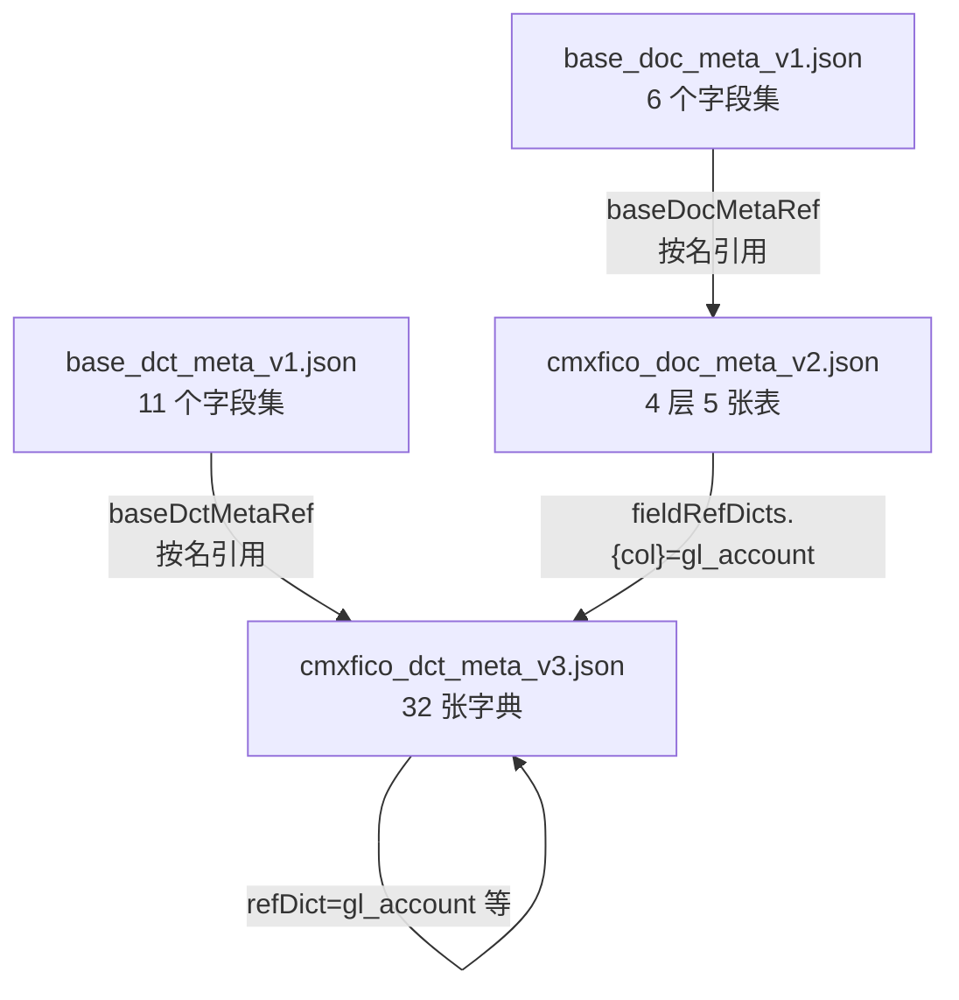
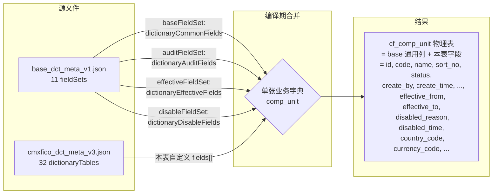

# 17 · 元数据 JSON 文件字段详解

> **本章给小白**——把 CMX 模型的"定义文件"掰开揉碎讲清楚。
> 看懂本章 = 看懂 4 个 JSON 配置文件，碰到任何"字段是啥意思、为啥要这么写"都不慌。

## 1. 4 个文件一览

| # | 文件路径 | 角色 | 大小 | 关联运行时模型 |
| --- | --- | --- | --- | --- |
| 1 | [`cmxfico_dct_meta_v3.json`](file:///media/yqs/工作/rustspace/cmx/cmx-container/data/meta/definitions/fi/cmxfico/gl/cmxfico_dct_meta_v3.json) | **业务模块字典** | 2854 行 / 32 张字典 | `CmxDCTMeta`（[04 章](04-字典模型-CmxDCTMeta.md)） |
| 2 | [`base_dct_meta_v1.json`](file:///media/yqs/工作/rustspace/cmx/cmx-container/data/meta/definitions/base/base_dct_meta_v1.json) | **基础字段集（字典）** | 545 行 / 11 个字段集 | 被 #1 通过 `baseDctMetaRef` 引用 |
| 3 | [`cmxfico_doc_meta_v2.json`](file:///media/yqs/工作/rustspace/cmx/cmx-container/data/meta/definitions/fi/cmxfico/gl/cmxfico_doc_meta_v2.json) | **业务模块单据** | 3331 行 / 4 层 5 张表 | `CmxDOCMeta`（[05 章](05-单据模型-CmxDOCMeta.md)） |
| 4 | [`base_doc_meta_v1.json`](file:///media/yqs/工作/rustspace/cmx/cmx-container/data/meta/definitions/base/base_doc_meta_v1.json) | **基础字段集（单据）** | 327 行 / 6 个字段集 | 被 #3 通过 `baseDocMetaRef` 引用 |

> 命名约定：`<app>_{dct|doc|base}_meta_v<version>.json`

### 1.1 关系图



> **关键认识**：
> - `base_*` 文件**不是表**，是"字段集合的集合"——多张业务字典/单据**共用**的字段集
> - 业务模块文件**不直接重复**这些通用列，通过引用 `fieldSets: ["dictionaryCommonFields", ...]` 获得
> - 物理建表时把这些列**合并**进业务表（compile 期展开）

---

## 2. 先搞懂通用字段约定

在读 4 个文件前，先记住 4 类**反复出现**的字段含义（任何模型都适用）。

### 2.1 字段三态 `dimType`

| 值 | 含义 | 行为 | 例子 |
| --- | --- | --- | --- |
| `"dimension"` | 分类维度 | 绑字典下拉、可被 match 评分 | 科目、客户、期间 |
| `"attribute"` | 普通属性 | 既不下拉、也不聚合 | 编码、名称、备注、状态 |
| `"measure"` | 度量 | 可 SUM/AVG/COUNT、可表脚合计、可被主从协调器聚合 | 金额、数量、单价 |

> 不写 `dimType` = 视作 `attribute`。**几乎所有字段都应该明确写一个值**，方便引擎识别。

### 2.2 通用列字段（每个 `fields[]` 元素几乎都有）

| 字段 | 类型 | 必填 | 含义 |
| --- | --- | --- | --- |
| `id` | string | 是 | 字段逻辑 id（前端引用、后端落库列名） |
| `name` | string | 是 | 字段名（通常与 id 相同；极少数场景做映射） |
| `dataType` | string | 是 | 数据类型：`VARCHAR` / `BIGINT` / `INT` / `TINYINT` / `DECIMAL` / `DATE` / `DATETIME` / `TEXT` |
| `fieldLength` | int | 否 | 字符串/数字总位数 |
| `intDigits` | int | 数值字段 | 整数部分位数 |
| `decimalDigits` | int | 数值字段 | 小数部分位数 |
| `nullable` | bool | 否 | 是否可空；默认 `true` |
| `caption` | object | 是 | 多语言标题：`{ "zh_CN": "客户端" }` |
| `dimType` | string | 否 | 字段三态（见 2.1） |
| `edit` | object | 否 | 编辑控制：`{ mode: "input" / "select" / "number" / "checkbox" / "date" / "textarea" / "hidden" }` |
| `refDict` | string | 否 | 引用字典的 dictCode（绑下拉） |
| `refField` | string | 否 | 引用字典的字段（默认 `id`） |
| `displayField` | string | 否 | 显示用的字典字段（默认 `name`） |
| `physicalField` | string | 否 | 对应的物理列名（用于数据迁移/SAP 兼容） |
| `isPrimaryKey` | int(0/1) | 否 | 是否主键 |
| `agg` | string | 否 | 聚合方式：`sum` / `avg` / `min` / `max` / `count`（通常配 `dimType: "measure"`） |

### 2.3 三种"属性"标识

| 字段                                         | 出现在 | 含义 |
|--------------------------------------------| --- | --- |
| `dimType: "attribute"`                     | 字段 | 此字段是"属性"，**既非维度也非度量**——纯文本/基础信息 |
| `metaKind: "DCT"/"DOC"/"BASE"/"FLC"`       | 顶层 moduleMeta | 标识这个 JSON 是什么**类型**（DCT 还是 DOC 还是基础还是 FLC） |
| `dictKind: "BUSINESS"/"CLASSIFY"/"GROUP"、"RELATION"` | dictMeta | 单张字典的"种类"（业务/分类/分组/关系），影响哪些 baseFieldSet 默认加载 |

### 2.4 字典取数配置（`dict` 块）

弹性组合 FLC 里 `dimensions[xxx].dict` 块的字段含义（与 DCT/DOC 字段不完全一致）：

| 字段 | 含义 |
| --- | --- |
| `dictId` / `dictCode` | 字典标识 |
| `idCol` / `codeCol` / `labelCol` / `parentCol` | 4 个关键列名 |
| `hierarchical` | 是否有层级（树形显示） |
| `helpLayout` | 弹窗布局：`list` / `tree` / `grid` |
| `valueField` | 实际写到字段里的值（默认 `idCol`） |
| `displayMode` | 显示方式：`code` / `label` / `code-label` |
| `dictTitle` | 弹窗标题 |
| `columns` | 弹窗列定义 |
| `pageSize` | 弹窗分页大小 |
| `filters` | 弹窗预过滤条件 |
| `writeBack` | 选中后回写到哪些字段 |

---

## 3. 业务模块 DCT 详解（cmxfico_dct_meta_v3.json）

### 3.1 顶层结构

```json
{
  "moduleMeta":        { ... },        // ① 元数据文件自身信息
  "baseDctMetaRef":    { ... },        // ② 引用 base 字段集
  "dictionaryTableConventions": { ... },// ③ 命名约定（注释性）
  "dictionaryTables":  [ ... ]         // ④ 32 张业务字典
}
```

### 3.2 `moduleMeta`（元数据文件信息）

| 字段 | 含义 | 例子 |
| --- | --- | --- |
| `moduleCode` | 业务模块代号 | `"FICO"` |
| `moduleName` | 业务模块名 | `"cmx-fico 总账"` |
| `metaKind` | 文件类型 | `"DCT"` |
| `metaName` | 这个 DCT 文件的标题 | `"cmx-fico 会计凭证数据字典元数据"` |
| `version` | 版本号 | `3`（对应 `_v3.json`） |
| `designStyle` | 设计风格 | `"separate-dictionary-tables"`（SAP 风格，一张字典一张表） |
| `remark` | 备注 | 解释这个文件"是什么、覆盖什么" |
| `versionName` | 版本名 | 可空字符串 |
| `isDefault` | 是否默认版本 | `true`（同 stem 多版本时，只能一个为默认） |

### 3.3 `baseDctMetaRef`（引用基础字段集）

```json
{
  "file": "base_dct_meta_v1.json",     // 引用的 base 文件
  "version": 1,                         // base 文件版本
  "fieldSets": [                        // 本文件用到的字段集名列表
    "dictionaryCommonFields",
    "dictionaryHierarchyFields",
    "dictionaryAuditFields",
    "dictionaryEffectiveFields",
    "dictionaryDisableFields",
    "dictionarySystemFields"
  ],
  "remark": "复用 base_dct_meta_v1.json fieldSet"
}
```

> **关键**：`fieldSets` 列出的 6 个名字必须在 base 文件的 `fieldSets` 顶层键中存在。单张字典通过 `baseFieldSet` 等字段**具体引用**这里列出的某个。

### 3.4 `dictionaryTableConventions`（字典表约定）

**注释性**字段，没有运行时意义，只是写给"读这个 JSON 的人"看：
```json
{
  "remark": "参考 SAP 字典;辅助核算行用其中主数据(成本中心/利润中心/客商/订单/WBS)+附加字典(段/业务范围/功能范围/税码)作维度。"
}
```

### 3.5 `dictionaryTables[]`（32 张业务字典）

这是核心：每张字典都是一个对象，含**dictMeta / fields / 引用配置**三大块。

#### 3.5.1 `dictMeta`（字典元信息）

| 字段 | 含义 | 例子 |
| --- | --- | --- |
| `dictCode` | 字典代号（= `dictCode` 唯一） | `"client"` / `"gl_account"` / `"comp_unit"` |
| `dictName` | 字典名（中文） | `"客户端"` / `"总账科目"` |
| `dictKind` | 字典种类 | `"BUSINESS"`（业务）/ `"CLASSIFY"`（分类）/ `"GROUP"`（分组） |
| `selfHierarchy` | 是否有内部父子层级 | `true` / `false`（如 `gl_account` 有上下级科目） |
| `tableName` | 物理表名 | `"cf_client"` / `"cf_gl_account"` |
| `idField` | 主键列名 | `"id"` |
| `codeField` | 编码列名 | `"code"` |
| `labelField` | 名称列名 | `"name"` |
| `parentField` | 父级列名 | `"parent_id"`（仅 `selfHierarchy: true` 时有） |
| `remark` | 备注 | 用途/参考来源说明 |
| `codeLength` | 编码长度（约束） | `3`（client）/ `10`（gl_account） |

> **dictKind 三类说明**：
> | kind | 含义 | 例子 |
> | --- | --- | --- |
> | `BUSINESS` | 业务主数据 | 客户、供应商、科目、银行账户 |
> | `CLASSIFY` | 分类/基础 | 客户端、国家、币种 |
> | `GROUP` | 分组/层级 | 科目组、报表版本 |

#### 3.5.2 `fields[]`（字典的字段定义）

**每张字典表都先复用 base 字段集，再追加自己的业务字段。** 字段定义本身在 §2.2 介绍过通用列字段；这里补充**字典特有的字段**：

| 字段 | 含义 | 例子 |
| --- | --- | --- |
| `refDict` | 引用另一张字典 | `country` / `currency` / `coa` |
| `refField` | 引用字典的哪一列 | `id` / `code` |
| `displayField` | 显示值从字典的哪一列取 | `name` |
| `physicalField` | 兼容物理列名 | `MANDT` / `BUKRS` / `LOGSYS`（SAP 字段名） |

**真实例子（comp_unit 表）**：
```json
{
  "dataType": "BIGINT",
  "nullable": true,
  "dimType": "attribute",
  "refDict": "company",                  // ← 引用 company 字典
  "refField": "code",                    // ← 关联到 company.code
  "displayField": "name",                // ← 显示时取 company.name
  "id": "company_id",
  "name": "company_id",
  "caption": { "zh_CN": "集团合并主体" },
  "physicalField": "BUKRS"               // ← SAP 字段名（迁移/集成用）
}
```

#### 3.5.3 单张字典的"配套配置"（fields[] 之后的字段）

```json
{
  "baseFieldSet": "dictionaryCommonFields",       // 基础列（id/code/name/sort_no/status）
  "auditFieldSet": "dictionaryAuditFields",       // 审计列（create_by/create_time/...）
  "effectiveFieldSet": "dictionaryEffectiveFields",// 生效期列（effective_from/effective_to）
  "disableFieldSet": "dictionaryDisableFields",   // 停用信息列
  "systemFieldSet": "dictionarySystemFields",     // 系统预置列（is_system）
  "hierarchyFieldSet": "dictionaryHierarchyFields",// 层级列（仅 selfHierarchy=true 时用）
  "scopeFieldSet": "dictionaryScopeFields",       // 范围列（global/acct_entity）
  "permissionScope": "global",                    // 权限范围：global / acct_entity / ...
  "codeRule": { ... },                            // 编码规则
  "uniqueKeys": [ ["code"] ]                      // 唯一键
}
```

> `fieldSet` 字段的**值**必须在 `baseDctMetaRef.fieldSets` 列表里。

| fieldSet 名 | 引入哪些字段（来自 base_dct_meta_v1.json） |
| --- | --- |
| `dictionaryCommonFields` | `id, code, name, sort_no, status`（5 列基础） |
| `dictionaryCommonNoIDFields` | `code, name, sort_no, status`（无 id 版） |
| `dictionaryHierarchyFields` | `parent_id, full_path, level_no, is_leaf`（4 列层级） |
| `dictionaryHierarchyNoIDFields` | `parent_code, full_path, level_no, is_leaf`（无 id 版） |
| `dictionaryAuditFields` | `create_by, create_time, update_by, update_time`（4 列审计） |
| `dictionaryScopeFields` | `scope_type, entity_id`（2 列范围） |
| `dictionaryEffectiveFields` | `effective_from, effective_to`（2 列有效期） |
| `dictionaryDisableFields` | `disabled_reason, disabled_time`（2 列停用） |
| `dictionarySystemFields` | `is_system`（1 列系统预置标识） |
| `hierarchyClosureFields` | `dict_code, ancestor_id, descendant_id, depth`（层级闭包表） |
| `relationCommonFields` | 关系字典专用：id / code / name / hierarchy_node_id / hierarchy_node_code / hierarchy_node_name / business_data_id / business_data_code / business_data_name |

#### 3.5.4 `codeRule`（编码规则）

| 子字段 | 含义 | 例子 |
| --- | --- | --- |
| `mode` | 编码模式 | `"manual"`（人工输入）/`"auto"`（自动生成）/`"auto-serial"`（前缀+流水） |
| `field` | 编码字段名 | `"code"`（默认值） |
| `pattern` | 编码正则 | `"^[0-9]{1,3}$"` / `"^[A-Za-z0-9_.-]{1,6}$"` |
| `uniqueCheck` | 是否全局唯一 | `true` |
| `serialLength` | 流水号长度（auto 模式） | `6` |
| `prefix` | 流水号前缀（auto 模式） | `"V"` |

#### 3.5.5 `uniqueKeys[]`（唯一键约束）

```json
"uniqueKeys": [
  ["code"]              // 单字段唯一：code 字段不可重复
  // 或
  ["coa_id", "code"]    // 组合唯一：同一科目表下 code 不重复
]
```

#### 3.5.6 32 张字典的 dictKind 分布

| `dictKind` | 数量 | 例子 |
| --- | --- | --- |
| `BUSINESS` | 25+ | `client`, `company`, `comp_unit`, `gl_account`, `business_partner`, `cost_center`, `profit_center`, `project`, `bank`, ... |
| `CLASSIFY` | 5+ | `country`, `currency`, `coa`, `account_type`, `fld_stat_grp` |
| `GROUP` | 3+ | `fs_version`（报表版本）, ... |

---

## 4. 基础 DCT 字段集详解（base_dct_meta_v1.json）

### 4.1 顶层结构

```json
{
  "moduleMeta": { ... },          // ① 文件信息
  "fieldSets": { ... },         // ② 11 个字段集（每个含 fields[] + remark）
  "updatedAt": "..."            // ③ 更新时间
}
```

### 4.2 `moduleMeta`

| 字段 | 含义 | 例子 |
| --- | --- | --- |
| `moduleCode` | 标识 | `"base_dct_meta"` |
| `metaKind` | 文件类型 | `"BASE"` |
| `metaName` | 标题 | `"基础数据字典元数据"` |
| `version` | 版本 | `1` |
| `remark` | 用途 | "跨模块复用的数据字典基础 fieldSet。业务模块通过 baseDctMetaRef 引用，避免重复维护字典基础列、层级列、审计列、组织范围、有效期、停用信息和系统预置标识。" |

### 4.3 11 个字段集（按用途分组）

| 字段集名 | 字段数 | 包含字段 | 用途 |
| --- | --- | --- | --- |
| **`dictionaryCommonFields`** | 5 | `id, code, name, sort_no, status` | 所有字典**必备**——id 主键 + 编码 + 名称 + 排序 + 启用状态 |
| **`dictionaryCommonNoIDFields`** | 4 | `code, name, sort_no, status` | 同上但无 id（用 code 自己做主键） |
| **`dictionaryHierarchyFields`** | 4 | `parent_id, full_path, level_no, is_leaf` | 内部层级（自己表里父子关系 + 物化路径） |
| **`dictionaryHierarchyNoIDFields`** | 4 | `parent_code, full_path, level_no, is_leaf` | 同上无 id 版 |
| **`dictionaryAuditFields`** | 4 | `create_by, create_time, update_by, update_time` | 创建/最后修改人 + 时间 |
| **`dictionaryScopeFields`** | 2 | `scope_type, entity_id` | 数据范围（global 全局 / acct_entity 核算主体） |
| **`dictionaryEffectiveFields`** | 2 | `effective_from, effective_to` | 生效/失效日期 |
| **`dictionaryDisableFields`** | 2 | `disabled_reason, disabled_time` | 停用原因 + 停用时间（status=0 时填） |
| **`dictionarySystemFields`** | 1 | `is_system` | 系统预置标识（系统预置项不许删） |
| **`hierarchyClosureFields`** | 4 | `dict_code, ancestor_id, descendant_id, depth` | 层级闭包表（祖先-后代关系，O(1) 查所有祖先/后代） |
| **`relationCommonFields`** | 9 | `id, code, name, hierarchy_node_id/code/name, business_data_id/code/name` | 关系字典专用（"分组字典"和"业务字典"之间的关联） |

> **核心观察**：
> - 11 个字段集是**可拼装**的——一张业务字典按需挑选组合
> - "**有 id 版 vs 无 id 版**"的二元结构：业务量大的字典用 BIGINT 自增 id（高频关联），小字典直接用 code 字符串当主键（简单）
> - "**层级**"字段集是**自分级**的——表示"表内自己父子关系"（gl_account 父子科目），不是"指向其它字典"

### 4.4 一个完整字段集例子

```json
"dictionaryCommonFields": {
  "remark": "所有独立字典表共用的基础列。物理建表时与各字典表 fields 合并；字段名保持一致，便于通用组件复用。",
  "fields": [
    {
      "dataType": "BIGINT",
      "fieldLength": 20,
      "nullable": false,
      "intDigits": 20,
      "decimalDigits": 0,
      "id": "id",
      "name": "id",
      "caption": { "zh_CN": "字典项主键" },
      "dimType": "attribute",
      "isPrimaryKey": 1
    },
    ...
  ]
}
```

每个字段的 `id` 既是 JSON 字段名，也是**最终落库的列名**——`physicalField` 字段（SAP 兼容）才在业务模块里出现，base 文件里没有这个字段。

---

## 5. 业务模块 DOC 详解（cmxfico_doc_meta_v2.json）

### 5.1 顶层结构

```json
{
  "moduleMeta":          { ... },        // ① 文件信息（结构同 DCT）
  "baseDocMetaRef":      { ... },        // ② 引用 base 单据字段集
  "voucherCommonFieldSet": "...",        // ③ 全单据通用字段集名（字符串）
  "voucherSchema":       { ... },        // ④ 单据结构（树形 + 关系 + 聚合）
  "voucherTables":       [ ... ],        // ⑤ 4 层 5 张物理表
  "updatedAt":           "...",          // ⑥ 更新时间
  "validationRules":     [ ... ]         // ⑦ 跨表校验规则
}
```

### 5.2 `moduleMeta`（DOC 专属字段）

比 DCT 多了几个字段：

| 字段 | 含义 | 例子 |
| --- | --- | --- |
| `organizationDict` | 组织隔离字典 | `"comp_unit"`（公司代码） |
| `keyDicts` | 关键字典 | `"gl_account"`（总账科目） |
| `documentTypeDict` | 单据类型字典 | `"doc_type"` |
| `versioning` | 是否启用版本化 | `{ "enabled": true }`（[16 章 §3.14](16-后端API详解.md#314-get-apidocrevisions--apidocrevision--postapidocrestore--单据版本化)） |

### 5.3 `baseDocMetaRef`（引用基础单据字段集）

```json
{
  "file": "base_doc_meta_v1.json",
  "version": 1,
  "fieldSets": [
    "documentIdentityFields",   // 单据标识（doc_date / doc_type_id / doc_no / entity_id）
    "documentSourceFields",     // 来源/引用单据（source_* / ref_* / reverse_*）
    "documentLifecycleFields",  // 生命周期（doc_status / business_status / attach_count / remark）
    "documentTechnicalFields",  // 技术审计（create_by/_time / update_by/_time / delete_flag）
    "documentCommonFields"      // 兼容组合：上述 4 个的合集
  ],
  "remark": "复用 base_doc_meta_v1.json"
}
```

> **关键**：`documentCommonFields` 是个**"include 组合"**——base 文件里它的定义是 `includeFieldSets: [...]` 而不是 `fields: [...]`，物理建表时被展开成 4 个字段集的全部列。

### 5.4 `voucherSchema`（单据的"形状"）

凭证单据的形状定义（参考 SAP BKPF + Oracle GL_JE_BATCHES）。

#### 5.4.1 `schema`（4 层树）

```json
"schema": [
  [ { "id": "cv_batch",   "kind": "list", "level": "L1", "levelName": "凭证批" } ],
  [ { "id": "cv_header",  "kind": "list", "level": "L2", "levelName": "凭证头" } ],
  [ { "id": "cv_acc_line","kind": "list", "level": "L3", "levelName": "科目行" } ],
  [
    { "id": "cv_aux_line", "kind": "list", "level": "L4", "levelName": "辅助行" },
    { "id": "cv_zycb_line","kind": "list", "level": "L4" }
  ]
]
```

| 字段 | 含义 | 例子 |
| --- | --- | --- |
| `id` | 表 id | `"cv_batch"` / `"cv_header"` |
| `kind` | 节点类型 | `"list"`（列表型）/ `"single"`（单值型） |
| `level` | 业务层级 | `"L1"` ~ `"L4"` |
| `levelName` | 层级名 | `"凭证批"` / `"凭证头"` |

> `schema` 是**二维数组**：每个外层 = 一个层级；外层内的多个节点 = 该层并存的多个表。

#### 5.4.2 `relations`（主外键关系）

```json
"relations": [
  { "parent": "cv_batch",   "child": "headers",       "parentKey": "id", "childKey": "upper_id" },
  { "parent": "headers",   "child": "account_lines", "parentKey": "id", "childKey": "upper_id" },
  { "parent": "account_lines", "child": "aux_lines", "parentKey": "id", "childKey": "upper_id" }
]
```

| 字段 | 含义 |
| --- | --- |
| `parent` | 父表 schema id |
| `child` | 子表 schema id |
| `parentKey` | 父表关联字段（默认 `id`） |
| `childKey` | 子表外键字段（指向父表） |

#### 5.4.3 `aggregations`（聚合规则）

```json
"aggregations": [
  { "from": "...entered_dr", "to": "上层", "field": "entered_dr", "toField": "entered_dr", "agg": "sum", "remark": "..." }
]
```

| 字段 | 含义 |
| --- | --- |
| `from` | 源路径（`...` = 同级及以上所有） |
| `to` | 目标路径（`上层` / 具体表 id） |
| `field` | 源字段 |
| `toField` | 目标字段 |
| `agg` | 聚合方式：`sum` / `avg` / `min` / `max` / `count` |
| `remark` | 备注 |
| `scope` | 范围（默认 `siblings`，可选 `all`） |

> 见 [09 章 §3](09-主从协调器-CmxMasterSlave.md) 主从协调器对 aggregations 的处理。

### 5.5 `voucherTables[]`（4 层 5 张表）

每张表是一个对象，**关键字段**：

| 字段 | 含义 | 例子 |
| --- | --- | --- |
| `level` | 业务层级 | `"L1"` / `"L2"` / `"L3"` / `"L4"` |
| `tableName` | 物理表名 | `"cv_batch"` / `"cv_header"` / `"cv_acc_line"` / `"cv_aux_line"` / `"cv_zycb_line"` |
| `tableAlias` | 表的中文别名 | `"凭证批"` / `"凭证头"` / `"凭证科目行"` / `"凭证辅助核算行"` / `"作业成本表"` |
| `fields` | 字段定义数组 | （同 §2.2 通用列字段） |
| `remark` | 备注 | 通常引用 SAP 表名 + 字段映射 |
| `documentFieldSets` | 本表**额外**引用的 base 字段集 | `["documentLevelFields", "documentIdentityFields", ...]` |
| `fieldRefDicts` | 字段→字典的反向引用 | `{ "client_code": "client", "comp_unit_id": "comp_unit" }` |
| `parentTable` | 父表（可选） | `"cv_header"`（cv_acc_line 的父表） |

> `documentFieldSets` 与 `voucherCommonFieldSet`（顶层字符串）的关系：
> - `voucherCommonFieldSet` = 整个单据最常用的那一个字段集（默认 `"documentTechnicalFields"`）
> - `documentFieldSets` = 该表**额外**引入的字段集（每张表可不同）

### 5.6 `validationRules[]`（跨表校验规则）

```json
"validationRules": [
  {
    "code": "voucher_local_balance",                          // 规则代号
    "name": "凭证本位币借贷平衡",
    "level": "L2",                                            // 校验在哪一层
    "expr": "sum(account_lines.local_dr) == sum(account_lines.local_cr)",
    "message": "凭证本位币借贷必须平衡"
  }
]
```

| 字段 | 含义 |
| --- | --- |
| `code` | 规则唯一代号（程序可引用） |
| `name` | 规则中文名（用户可见） |
| `level` | 触发层（`"L1"` / `"L2"` / `"L3"` / `"L4"` / `"L1-L4"` 范围） |
| `expr` | 表达式（自定义语法） |
| `message` | 校验失败时的错误提示 |

> 7 条真实规则（来自文件末尾）：
> | code | 用途 |
> | --- | --- |
> | `voucher_local_balance` | 凭证本位币借贷平衡（L2 触发） |
> | `account_line_aux_rollup` | 科目行金额 = 辅助行金额合计 |
> | `aux_dimension_consistency` | 动态维度与专列维度一致 |
> | `customer_supplier_role` | 客户/供应商角色校验 |
> | `period_open_check` | 期间开放校验 |
> | `client_company_propagation` | 客户端/公司代码逐层一致 |
> | `gl_account_propagation` | 科目在科目行与辅助行一致 |

---

## 6. 基础 DOC 字段集详解（base_doc_meta_v1.json）

### 6.1 顶层结构

```json
{
  "moduleMeta":    { ... },       // 文件信息
  "fieldSets":   { ... },       // 6 个字段集
  "updatedAt":   "..."
}
```

### 6.2 6 个字段集

| 字段集名 | 字段数 | 包含字段 | 用途 |
| --- | --- | --- | --- |
| **`documentTechnicalFields`** | 5 | `create_by, create_time, update_by, update_time, delete_flag` | 技术审计 + 逻辑删除（**所有单据表都有**） |
| **`documentIdentityFields`** | 4 | `doc_date, doc_type_id, doc_no, entity_id` | 业务标识（**所有单据头都有**） |
| **`documentSourceFields`** | 8 | `source_doc_id, source_doc_type_id, source_doc_no, source_line_id, ref_doc_id, ref_doc_type_id, ref_doc_no, reverse_doc_id` | 来源/引用单据（**所有单据头都有**） |
| **`documentLifecycleFields`** | 4 | `doc_status, business_status, attach_count, remark` | 生命周期、附件、备注 |
| **`documentCommonFields`** | — | `includeFieldSets: [前 4 个]` | **组合字段集**——一次性引用前 4 个的全部列 |
| **`documentLevelFields`** | 3 | `id, upper_id, line_no` | 层级基础（id 主键 + upper_id 上级指针 + line_no 行号） |

### 6.3 关键观察

1. **`documentCommonFields` 没有 `fields`**，只有 `includeFieldSets`——这是"组合字段集"机制
2. **`documentIdentityFields`** 里的 4 列就是 16 章里提到的"通用单据头"——凭证、发票、采购单都长一样
3. **`documentSourceFields`** 用 8 个字段同时表达"上游单据 / 业务引用 / 红冲原单"——三种关系都用同一组列
4. **`documentLevelFields`** 是 5 张表都加的（id/upper_id/line_no），构成树形结构基础

---

## 7. 4 个文件的"拼接流程"（建表时）



> **结论**：建表 = base 字段集**按名引用** + 业务模块**追加** + 同名字段以业务模块覆盖 base。

---

## 8. 字段速查表（合并所有 4 个文件）

| 字段名 | 出现位置 | 类型 | 含义 |
| --- | --- | --- | --- |
| `moduleMeta` | 业务模块顶层 | object | 文件自身元信息 |
| `moduleMeta.metaKind` | 业务模块顶层 | string | 文件类型（`DCT` / `DOC` / `BASE` / `FLC`） |
| `moduleMeta.version` | 业务模块顶层 | int | 文件版本 |
| `moduleMeta.isDefault` | 业务模块顶层 | bool | 同 stem 多版本时是否默认 |
| `moduleMeta.designStyle` | 业务模块顶层 | string | 设计风格（如 `"separate-dictionary-tables"`） |
| `moduleMeta.organizationDict` | DOC 顶层 | string | 组织隔离字典代号 |
| `moduleMeta.keyDicts` | DOC 顶层 | string | 关键字典代号 |
| `moduleMeta.documentTypeDict` | DOC 顶层 | string | 单据类型字典代号 |
| `moduleMeta.versioning` | DOC 顶层 | object | `{ enabled: true }` 是否启用版本化 |
| `baseDctMetaRef` / `baseDocMetaRef` | 业务模块顶层 | object | 引用 base 文件 |
| `baseXxxRef.file` | ref 内 | string | 引用的 base 文件名 |
| `baseXxxRef.version` | ref 内 | int | base 文件版本 |
| `baseXxxRef.fieldSets` | ref 内 | string[] | 本文件用到的字段集名列表 |
| `dictionaryTables` | DCT 顶层 | array | 32 张业务字典 |
| `voucherTables` | DOC 顶层 | array | 4 层 5 张物理表 |
| `voucherSchema` | DOC 顶层 | object | 单据形状（schema + relations + aggregations） |
| `voucherCommonFieldSet` | DOC 顶层 | string | 全单据最常用字段集名 |
| `validationRules` | DOC 顶层 | array | 跨表校验规则 |
| `dictionaryTableConventions` | DCT 顶层 | object | 命名约定（注释性） |
| `dictMeta` | DCT 每张表 | object | 字典元信息 |
| `dictMeta.dictCode` | dictMeta | string | 字典代号（= `dictCode` 唯一） |
| `dictMeta.dictName` | dictMeta | string | 字典中文名 |
| `dictMeta.dictKind` | dictMeta | string | `BUSINESS` / `CLASSIFY` / `GROUP` |
| `dictMeta.selfHierarchy` | dictMeta | bool | 是否有内部父子层级 |
| `dictMeta.tableName` | dictMeta | string | 物理表名 |
| `dictMeta.idField` | dictMeta | string | 主键列名 |
| `dictMeta.codeField` | dictMeta | string | 编码列名 |
| `dictMeta.labelField` | dictMeta | string | 名称列名 |
| `dictMeta.parentField` | dictMeta | string | 父级列名（仅 selfHierarchy=true） |
| `dictMeta.codeLength` | dictMeta | int | 编码长度约束 |
| `fields` | 每张表 | array | 字段定义数组 |
| `id` / `name` | field | string | 字段逻辑 id/名（==落库列名） |
| `dataType` | field | string | `VARCHAR` / `BIGINT` / `INT` / `TINYINT` / `DECIMAL` / `DATE` / `DATETIME` / `TEXT` |
| `fieldLength` | field | int | 字符串/数字总位数 |
| `intDigits` | field | int | 数值字段整数部分位数 |
| `decimalDigits` | field | int | 数值字段小数部分位数 |
| `nullable` | field | bool | 是否可空 |
| `caption` | field | object | 多语言标题 `{ zh_CN: "..." }` |
| `dimType` | field | string | `dimension` / `attribute` / `measure` |
| `edit` | field | object | 编辑控制 `{ mode: "input"|"select"|... }` |
| `refDict` | field | string | 引用字典的 dictCode |
| `refField` | field | string | 引用字典的哪一列 |
| `displayField` | field | string | 显示值从字典的哪一列取 |
| `physicalField` | field | string | 兼容物理列名（SAP） |
| `isPrimaryKey` | field | int(0/1) | 是否主键 |
| `agg` | field | string | 聚合方式（配 `dimType: "measure"`） |
| `baseFieldSet` | 每张表 | string | 引用 base 字段集作主列 |
| `auditFieldSet` | 每张表 | string | 引用 base 审计列 |
| `hierarchyFieldSet` | 每张表 | string | 引用 base 层级列 |
| `effectiveFieldSet` | 每张表 | string | 引用 base 有效期列 |
| `disableFieldSet` | 每张表 | string | 引用 base 停用列 |
| `systemFieldSet` | 每张表 | string | 引用 base 系统预置列 |
| `scopeFieldSet` | 每张表 | string | 引用 base 数据范围列 |
| `permissionScope` | 每张表 | string | 权限范围（`global` / `acct_entity` / ...） |
| `codeRule` | 每张表 | object | 编码规则 |
| `codeRule.mode` | codeRule 内 | string | `manual` / `auto` / `auto-serial` |
| `codeRule.field` | codeRule 内 | string | 编码字段名 |
| `codeRule.pattern` | codeRule 内 | string | 编码正则 |
| `codeRule.uniqueCheck` | codeRule 内 | bool | 是否全局唯一 |
| `uniqueKeys` | 每张表 | array | 唯一键约束 |
| `documentFieldSets` | DOC 每张表 | array | 本表额外引用的 base 字段集 |
| `fieldRefDicts` | DOC 每张表 | object | 字段→字典的反向引用 |
| `parentTable` | DOC 每张表 | string | 父表 |
| `tableAlias` | DOC 每张表 | string | 表中文别名 |
| `moduleMeta` | base 顶层 | object | base 文件元信息 |
| `moduleMeta.moduleCode` | moduleMeta | string | 标识 |
| `moduleMeta.metaName` | moduleMeta | string | 标题 |
| `fieldSets` | base 顶层 | object | 11 / 6 个字段集 |
| `fieldSets[name].fields` | fieldSet | array | 该字段集包含的字段定义 |
| `fieldSets[name].remark` | fieldSet | string | 字段集说明 |
| `fieldSets[name].includeFieldSets` | fieldSet | string[] | 组合字段集（无 `fields`，列其它 fieldSet 名） |
| `schema` | voucherSchema | array | 二维数组（层级 → 多个表） |
| `schema[].id` | schema 节点 | string | 表 id |
| `schema[].kind` | schema 节点 | string | `list` / `single` |
| `schema[].level` | schema 节点 | string | `L1` / `L2` / `L3` / `L4` |
| `schema[].levelName` | schema 节点 | string | 层级中文名 |
| `relations` | voucherSchema | array | 主外键关系 |
| `relations[].parent` | relation | string | 父表 id |
| `relations[].child` | relation | string | 子表 id |
| `relations[].parentKey` | relation | string | 父表关联字段 |
| `relations[].childKey` | relation | string | 子表外键字段 |
| `aggregations` | voucherSchema | array | 聚合规则 |
| `aggregations[].from` | aggregation | string | 源路径（`...` = 同级及以上） |
| `aggregations[].to` | aggregation | string | 目标路径（`上层` / 具体表 id） |
| `aggregations[].field` | aggregation | string | 源字段 |
| `aggregations[].toField` | aggregation | string | 目标字段 |
| `aggregations[].agg` | aggregation | string | `sum` / `avg` / `min` / `max` / `count` |
| `aggregations[].scope` | aggregation | string | 范围（默认 `siblings`，可选 `all`） |
| `validationRules[].code` | validation | string | 规则唯一代号 |
| `validationRules[].name` | validation | string | 规则中文名 |
| `validationRules[].level` | validation | string | 触发层（`"L1"` / `"L2"` / `"L1-L4"`） |
| `validationRules[].expr` | validation | string | 表达式 |
| `validationRules[].message` | validation | string | 错误提示 |
| `updatedAt` | base 顶层 / DOC 顶层 | string | ISO 时间戳 |

---

## 9. 小白 3 分钟自测

读完本章能回答下面问题就过关：

1. **`dimType` 3 个值分别控制什么？**
   - `dimension` = 字典下拉，`measure` = 可聚合数值，`attribute` = 纯文本
2. **业务模块 DCT 怎么复用 base 的字段？**
   - 顶层 `baseDctMetaRef.fieldSets: [名字列表]` + 单张表的 `baseFieldSet: "具体名"`
3. **`selfHierarchy: true` 多了什么字段？**
   - `hierarchyFieldSet: "dictionaryHierarchyFields"`（4 个层级列）
4. **DOC 5 张表怎么组织？**
   - 4 层 L1 批 / L2 头 / L3 科目行 / L4 辅助行（外加 L4 作业成本表）
5. **校验规则 7 条都是干啥的？**
   - 见 §5.6 末尾表格
6. **`physicalField: "MANDT"` 干啥用？**
   - 兼容 SAP 字段名，做数据迁移/集成时用，前端不显示

回 [README](README.md) 看完整目录。
