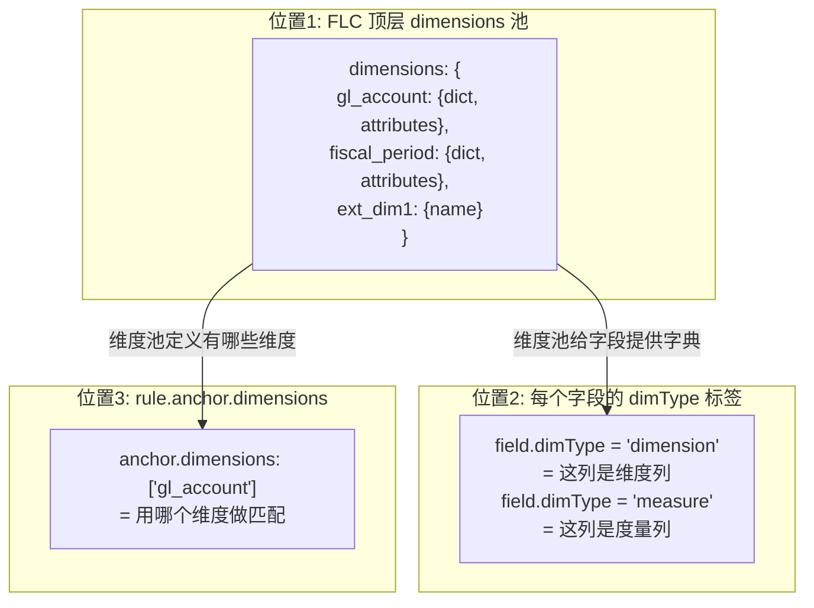
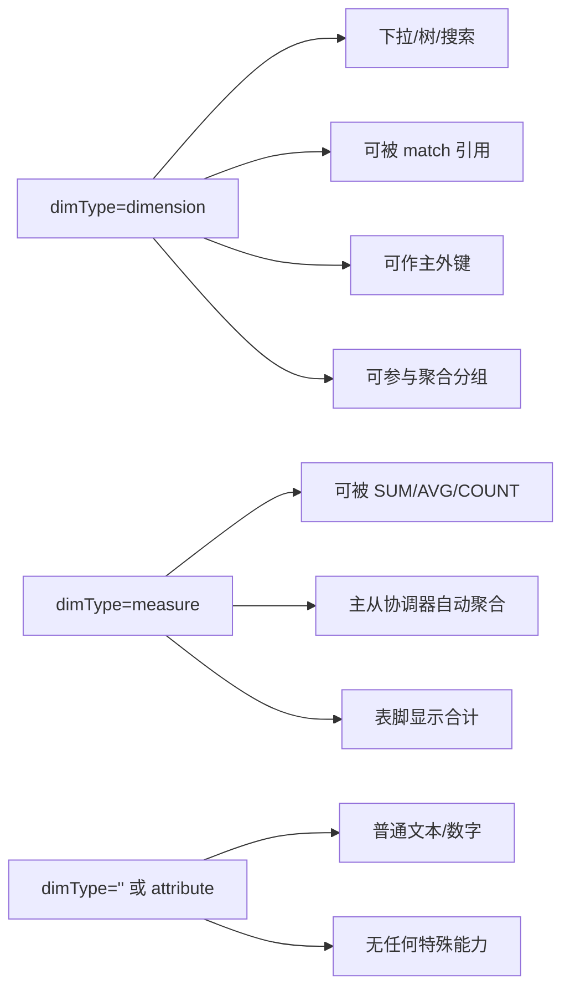
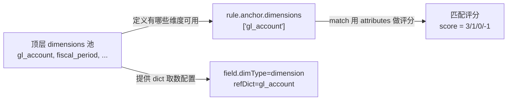
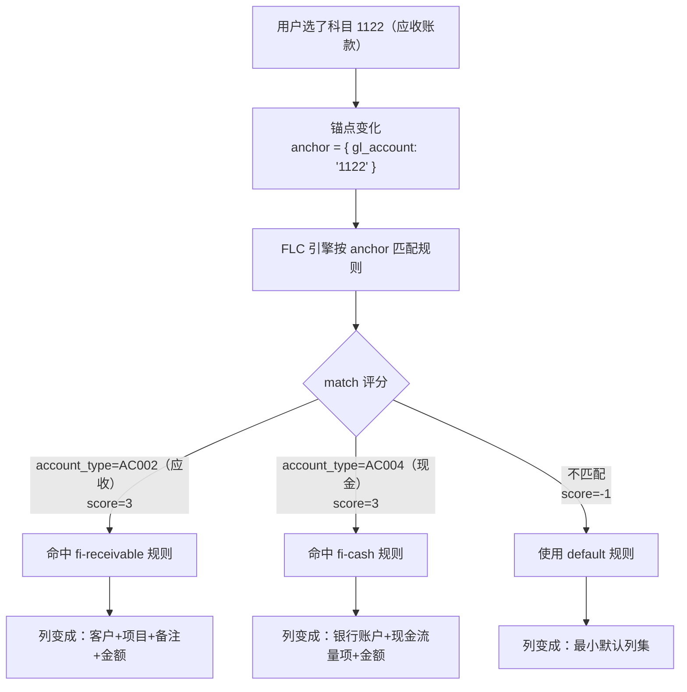
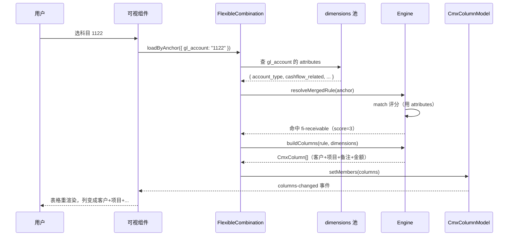
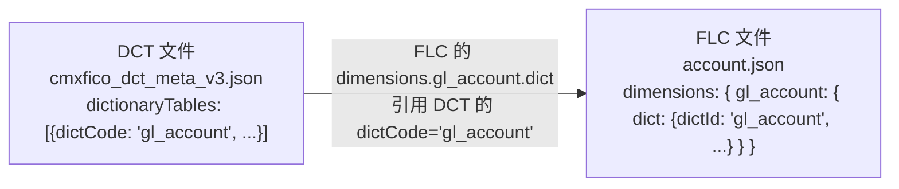
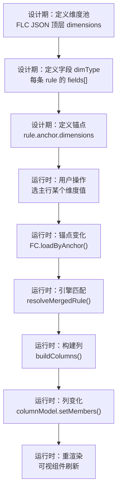
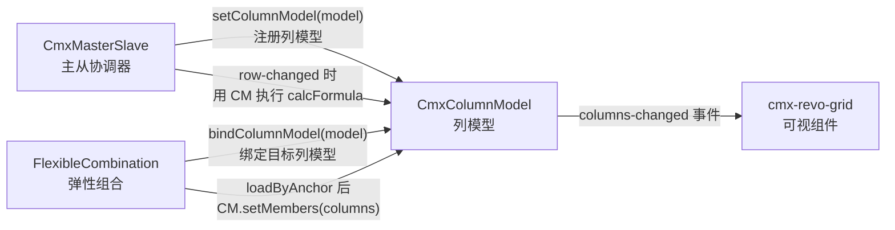
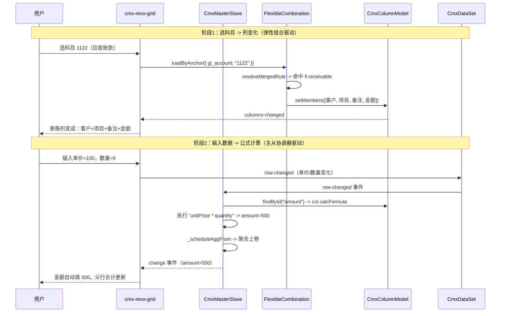

# 18 · 维度概念详解（dimension）

> **本章专门回答"维度到底是啥、有啥用、设置和不设置的区别"**。
> 面向零基础读者，从生活类比到代码实现全覆盖。

---

## 1. 一句话理解维度

> **维度（dimension）= "影响业务行为的分类变量"**--比如科目、客户、仓库、期间。
> 它和**度量（measure）**--"可被合计的数值"（如金额、数量）--相对。

**生活类比**：你去超市购物
- **维度** = 你买了什么品类（水果、蔬菜、肉类）--用来**分组**
- **度量** = 每个品类花了多少钱--用来**合计**
- **属性** = 每个品类的产地、保质期--**跟着维度走**，不单独合计

> **术语说明**：本章多次出现 **FLC**，它是 **F**lexible **L**ogic **C**ombination 的缩写（有时也写作 FlexibleCombination），中文叫**弹性组合**。它是 CMX 6 大模型之一，负责"按维度组合动态生成列"。详见 [10 章](10-弹性组合-FlexibleCombination.md)。在后端 `kind` 枚举里，FLC 对应的值就是 `"FLC"`（见 [16 章 §1.4](16-后端API详解.md#14-kind-枚举值详解dct--doc--base--flc)）。

---

## 2. 维度在 CMX 里的 3 处出现位置

CMX 模型体系里"维度"这个词出现在**3 个不同的地方**，容易混淆。下面分开讲。



---

## 3. 位置 1：FLC 顶层 `dimensions`（维度池）

### 3.1 它是啥

在弹性组合 JSON 文件（如 [account.json](file:///media/yqs/工作/rustspace/cmx/cmx-container/data/meta/flexible-combination/fi/cmxfico/gl/account.json)）的**顶层**，有一个 `dimensions` 对象，声明"这条业务规则集涉及哪些维度"。

### 3.2 结构

```json
{
  "dimensions": {
    "gl_account": {                          // ← 维度 id
      "name": "科目ID",
      "attributes": ["item_name", "item_code", "account_type", "cashflow_related"],
      "dict": {                              // ← 取数配置
        "dictId": "gl_account",
        "dictCode": "gl_account",
        "idCol": "id",
        "codeCol": "item_code",
        "labelCol": "item_name",
        "parentCol": "parent_id",
        "hierarchical": true,
        "helpLayout": "grid",
        "valueField": "item_code",
        "displayMode": "code-label",
        "dictTitle": "选择科目ID",
        "pageSize": 50,
        "columns": [...]
      },
      "valueType": "dict-select"
    },
    "ext_dim1": {                            // ← 无字典的占位维度
      "name": "扩展维度槽位1",
      "attributes": ["item_name"]
    }
  }
}
```

### 3.3 每个字段详解

| 字段 | 类型 | 必填 | 含义 |
| --- | --- | --- | --- |
| `name` | string | 是 | 维度中文名（显示用） |
| `attributes` | string[] | 否 | 维度的属性列名列表（可被 match 引用） |
| `dict` | object | 否 | **字典取数配置**（见 §3.4） |
| `valueType` | string | 否 | 值类型：`dict-select`（字典选择）/ `free-input`（自由输入） |

### 3.4 `dict` 块字段详解

| 字段 | 含义 | 例子 |
| --- | --- | --- |
| `dictId` / `dictCode` | 字典标识 | `"gl_account"` |
| `idCol` | 主键列名 | `"id"` |
| `codeCol` | 编码列名 | `"item_code"` |
| `labelCol` | 名称列名 | `"item_name"` |
| `parentCol` | 父级列名 | `"parent_id"`（仅层级字典有） |
| `hierarchical` | 是否有层级 | `true` / `false` |
| `helpLayout` | 弹窗布局 | `"grid"` / `"list"` / `"tree"` |
| `valueField` | 实际写到字段里的值 | `"item_code"` |
| `displayMode` | 显示方式 | `"code"` / `"label"` / `"code-label"` |
| `dictTitle` | 弹窗标题 | `"选择科目ID"` |
| `filters` | 预过滤条件 | `null` 或 `{ field, op, value }` |
| `pageSize` | 分页大小 | `50` |
| `writeBack` | 选中后回写哪些字段 | `null` 或 `{ targetCol: sourceCol }` |
| `columns` | 弹窗列定义 | `[{ id, caption, type, width, editMode }]` |

### 3.5 设置 vs 不设置的区别

| 能力 | 不设置 dimensions | 设置 dimensions |
| --- | --- | --- |
| **维度池** | 空 | 有显式维度字典 |
| **match 条件** | 只能写纯字面量 `match: { "field": "value" }` | 可写 `gl_account.account_type: "AC004"`（用维度的 attributes） |
| **取数配置** | 无 | 每维度可挂 `dict` / `values` / `valueSourceId` |
| **自动帮助器** | 没有 | 维度对应的下拉框/树/搜索器按 `dict.columns` 渲染 |
| **match 评分** | 全匹配/不匹配二元 | 多维打分排序（见 [10 章 §9](10-弹性组合-FlexibleCombination.md)） |
| **运行时锚点** | anchor.dimensions 写空数组 | anchor.dimensions 列具体维度名 |

> **简单说**：不设置 dimensions = 规则集只能"硬匹配固定条件换固定列"；设置了 = 能"按维度值动态评分匹配、按维度分类切换列"。

### 3.6 维度的 3 种数据来源

| 来源 | 字段 | 何时用 | 例子 |
| --- | --- | --- | --- |
| **字典引用** | `dict` | 维度量大、需建表维护、可能要下钻 | 科目、客户、期间（挂 DCT 字典） |
| **内联列表** | `values` | 维度少、变动不频繁（< 50 项） | `[{code:"SHA",name:"上海"}, ...]` |
| **外部数据源** | `valueSourceId` | 数据源是另一个 service/api | `"cityDict"` |

**不设置这 3 个** -> 维度就只是个"壳子"：可以参与 match 评分，但没有值可供匹配，实际等于没用。

### 3.7 真实例子（account.json 的 15 个维度）

| 维度 id | name | 有 dict? | 说明 |
| --- | --- | --- | --- |
| `fiscal_period` | 会计期间 | 是 | 层级字典，grid 布局 |
| `gl_account` | 科目ID | 是 | 层级字典，grid 布局 |
| `profit_center` | 利润中心 | 是 | 层级字典 |
| `cost_center` | 成本中心 | 是 | 层级字典 |
| `project` | 项目 | 是 | 层级字典 |
| `partner` | 合作伙伴 | 是 | 层级字典 |
| `contract` | 合同 | 是 | 层级字典 |
| `bank` | 银行账户 | 是 | 层级字典 |
| `cashflow_item` | 现金流量项 | 是 | 层级字典 |
| `currency` | 币种 | 是 | 平表字典 |
| `ext_dim1` ~ `ext_dim5` | 扩展维度槽位 1~5 | **否** | 无字典，运行时动态绑定 |

> **关键观察**：前 10 个维度都挂了 DCT 字典；后 5 个 `ext_dim` 是**占位槽位**--运行时才知道绑哪个字典（如 ext_dim1 本次绑"部门"，下次绑"仓库"）。

---

## 4. 位置 2：字段三态 `dimType`（每个字段的"角色"标签）

### 4.1 三态对照

| `dimType` | 角色 | 设置后 | 不设置（用 `""` 或 `attribute`） |
| --- | --- | --- | --- |
| `"dimension"` | 分类变量 | 绑字典（`refDict`），下拉/树/搜索；可被其他规则 match；显示 `code-label` | 失去字典下拉、退化为普通文本 |
| `"measure"` | 数值度量 | 自动 SUM/AVG/MIN/MAX/COUNT；表脚可显示合计；**可被主从协调器聚合** | 不能被聚合 |
| `"attribute"` 或 `""` | 普通字段 | 仅作文本/备注 | 文本输入框 |

### 4.2 真实例子（account.json 第 617-660 行，fi-bank 规则）

```json
{
  "edit": { "mode": "select", "required": true },     // ← 必须 mode=select
  "dimType": "dimension",                              // ← 标识为维度
  "refDict": "bank",                                   // ← 绑 bank 字典
  "id": "bankAccount",
  "caption": { "zh_CN": "银行账户" }
}
```

**对比**--同一个字段，如果 `dimType: ""`：

```json
{
  "edit": { "mode": "input" },                        // ← 自由输入
  "dimType": "",
  "id": "bankAccount",
  "caption": { "zh_CN": "银行账户" }
}
```

> 区别就是：用户要"点选已有银行账户"还是"手敲一个字符串"。前者安全（不会输错）、可校验（账户是否冻结）、可级联（按账户自动带出币种）。

### 4.3 字段三态的连锁效应



### 4.4 在 DOC/DCT 元数据里的 dimType

不仅 FLC 里有 `dimType`，DCT 和 DOC 的字段定义里也有：

```json
// DCT 字段（cmxfico_dct_meta_v3.json）
{
  "dataType": "BIGINT",
  "dimType": "attribute",          // ← DCT 字典字段也标 dimType
  "refDict": "company",
  "id": "company_id",
  "caption": { "zh_CN": "集团合并主体" }
}

// DOC 字段（cmxfico_doc_meta_v2.json）
{
  "dataType": "BIGINT",
  "dimType": "dimension",          // ← DOC 单据字段也标 dimType
  "refDict": "comp_unit",
  "id": "comp_unit_id",
  "caption": { "zh_CN": "公司代码" }
}
```

> **区别**：DCT 里大多标 `attribute`（字典字段本身不需要再被聚合）；DOC 里**组织隔离字段**标 `dimension`（后续按公司代码过滤数据）。

---

## 5. 位置 3：`rule.anchor.dimensions`（锚点维度）

### 5.1 它是啥

每条 FLC 规则的 `anchor` 块里有一个 `dimensions` 数组，声明"这条规则用哪个维度做匹配"。

```json
{
  "id": "fi-cash",
  "anchor": {
    "dimensions": ["gl_account"],           // ← 锚点维度
    "columns": ["account_code"],
    "match": {
      "gl_account.account_type": "AC004",   // ← 用维度的 attributes 做匹配
      "gl_account.cashflow_related": "true"
    }
  }
}
```

### 5.2 anchor 的 3 个字段

| 字段 | 含义 | 例子 |
| --- | --- | --- |
| `dimensions` | 用哪些维度做锚点 | `["gl_account"]` |
| `columns` | 锚点对应的列名 | `["account_code"]` |
| `match` | 匹配条件（用维度的 attributes） | `{"gl_account.account_type": "AC004"}` |

### 5.3 锚点维度 vs 顶层维度池的关系



> **关键**：`anchor.dimensions` 引用的维度名**必须在顶层 `dimensions` 池里存在**，否则 match 里的 `gl_account.account_type` 无法解析。

---

## 6. 维度与弹性组合的关系（重点）

### 6.1 维度是弹性组合的"发动机"

没有维度，弹性组合就退化为"固定列换固定列"的简单开关。有了维度，才能实现：



### 6.2 维度在弹性组合里的 4 个作用

| # | 作用 | 没有维度 | 有维度 |
| --- | --- | --- | --- |
| 1 | **锚点匹配** | 只能硬编码 `match: { "field": "value" }` | 可用 `gl_account.account_type: "AC004"`（维度属性） |
| 2 | **评分排序** | 二元（匹配/不匹配） | 多维打分，选最优规则 |
| 3 | **下拉帮助器** | 无 | 维度对应的下拉框/树/搜索器自动渲染 |
| 4 | **字段联动** | 无 | 选了维度值后，attribute 字段自动带出（如选科目 -> 自动带出科目名称） |

### 6.3 维度驱动的列变化（真实例子）

以 [account.json](file:///media/yqs/工作/rustspace/cmx/cmx-container/data/meta/flexible-combination/fi/cmxfico/gl/account.json) 为例：

| 选的科目 | 命中规则 | 列变化 |
| --- | --- | --- |
| 现金科目（account_type=AC004） | `fi-cash` | 银行账户 + 现金流量项 + 金额 |
| 银行科目（account_type=AC003） | `fi-bank` | 银行账户 + 金额 |
| 应收科目（account_type=AC002） | `fi-receivable` | 客户 + 项目 + 备注 + 金额 |
| 应付科目（account_type=AC001） | `fi-payable` | 供应商 + 项目 + 备注 + 金额 |
| 费用科目（无特殊匹配） | `fi-expense` | 部门 + 项目 + 备注 + 金额 |
| 其他（兜底） | `default` | 最小默认列集 |

> **这就是"弹性"的来源**：同一个凭证分录表格，选不同科目 -> 列自动变化。维度是这个机制的"触发器"。

### 6.4 维度与弹性组合的数据流



---

## 7. DCT 字典的"列" vs FLC 的"维度"

这两个最容易混淆：

| | **DCT 字典的"列"** | **FLC 的"维度"** |
| --- | --- | --- |
| **它是** | 字典表里的一个**取数配置字段** | 业务规则集里的一个**分类变量** |
| **例子** | `dict.columns[]` 里的 `id / code / name / parent_id` | 科目、期间、客户、仓库 |
| **作用** | 决定下拉框怎么显示（列宽、列名、是否可编辑） | 决定 match 评分、按什么分类切换列 |
| **层级** | DCT 文件 `dict` 块 | FLC 文件顶层 `dimensions` 块 |
| **联系** | FLC 维度的 `dict` 块**引用** DCT 字典的取数配置 |  |

> **简单记忆**：
> - **DCT 字典的"列"** -> 决定字典表怎么显示（列宽、列名、是否可编辑）
> - **FLC 维度的"维"** -> 决定业务怎么分类（科目=一组、期间=一组、币种=一组）

### 7.1 引用关系



> FLC 的 `dimensions.gl_account.dict` 块里**重新声明**了取数配置（idCol/codeCol/labelCol/...），而不是直接引用 DCT 文件。这是当前的设计（Overlay 设计提案计划改为直接引用，见 [flexible-combination-overlay-design.md](file:///media/yqs/工作/rustspace/cmx/packages/cmx-data-comp/docs/flexible-combination-overlay-design.md)）。

---

## 8. 扩展维度槽位（ext_dim）详解

### 8.1 它是啥

account.json 里有 5 个 `ext_dim1` ~ `ext_dim5`，它们是**无字典的占位维度**：

```json
"ext_dim1": {
  "name": "扩展维度槽位1(由gl_ext_dimension绑定)",
  "attributes": ["item_name"]
  // ← 没有 dict 块！
}
```

### 8.2 为什么需要槽位

有些业务场景下，**运行时才知道绑哪个字典**：
- A 公司的 ext_dim1 = "部门"
- B 公司的 ext_dim1 = "仓库"
- C 公司的 ext_dim1 = "业务线"

设计期留 5 个空槽位，运行时通过 `gl_ext_dimension` 字典动态绑定。

### 8.3 与普通维度的区别

| | 普通维度（如 gl_account） | 槽位维度（如 ext_dim1） |
| --- | --- | --- |
| **字典** | 设计期就绑定 | 运行时动态绑定 |
| **dict 块** | 有 | 无 |
| **match** | 可用 attributes | 只能做"是否设置了"的判断 |
| **下拉** | 自动渲染 | 运行时由绑定逻辑决定 |

---

## 9. 完整的维度生命周期



---

## 10. 弹性组合与主从协调器的关系

> **一句话**：主从协调器管"行级联动"（选了主行 -> 子行过滤），弹性组合管"列级动态"（选了维度值 -> 列变化）。两者通过 **CmxColumnModel** 桥接，经常配合使用。

### 10.1 各管什么

| | **CmxMasterSlave（主从协调器）** | **FlexibleCombination（弹性组合）** |
| --- | --- | --- |
| **管什么** | 行级联动 | 列级动态 |
| **输入** | 树形数据（主表+子表+孙表） | 锚点维度值（如科目=1122） |
| **输出** | 子表过滤/聚合/级联选中 | 列数组（CmxColumn[]） |
| **触发** | 用户选主行 -> cursor-changed | 锚点维度值变化 -> loadByAnchor |
| **作用对象** | CmxDataSet（数据行） | CmxColumnModel（列定义） |
| **事件** | `select` / `change` | `flexible-combination-loaded` / `flexible-combination-error` |

### 10.2 通过 CmxColumnModel 桥接

两个模型不直接通信，而是通过 **CmxColumnModel** 间接关联：



**关键代码**（[init-page-models.js:199-205](file:///media/yqs/工作/rustspace/cmx/packages/cmx-data-comp/src/lib/init-page-models.js#L199-L205)）：

```js
// CmxColumnModel 创建后，同时注册到 CmxMasterSlave
case 'CmxColumnModel': {
  const model = new CmxColumnModel({ datasetId: p.datasetId, ... })
  host[def.instanceId] = model
  // 注册到 schema 中包含该 datasetId 路径的 CmxMasterSlave
  for (const m of models) {
    if (m.modelType !== 'CmxMasterSlave') continue
    const ms = host[m.instanceId]
    if (ms._schemaById?.has(p.datasetId)) {
      ms.setColumnModel(model)    // ← 主从协调器持有列模型
    }
  }
  break
}
```

```js
// FlexibleCombination 创建后，绑定到目标 CmxColumnModel（第一·五步）
const target = host[p.columnModelId]
if (target) fc.bindColumnModel(target)   // ← 弹性组合持有同一个列模型
```

> **核心**：同一个 `CmxColumnModel` 实例，被 **主从协调器**（用于 calcFormula 执行）和 **弹性组合**（用于 setMembers 刷列）**共同持有**。

### 10.3 主从协调器怎么用 CmxColumnModel

主从协调器在 **row-changed 事件**（单元格值变化）时，用 CmxColumnModel 查找对应列的 `calcFormula`，执行公式计算：

```js
// cmx-master-slave.js:336-347
const model = this._columnModels.get(fullPath)    // ← 按 path 取列模型
if (model) {
  const col = model.findById(key)                  // ← 按字段 id 取列定义
  if (col?.calcFormula) {                          // ← 有公式就执行
    invokePreset(col.calcFormula, 'apply', row, { value, key })
    // 依赖字段也要触发聚合
    for (const dep of deps) {
      this._scheduleAggFrom(fullPath, dep)
    }
  }
}
```

> **作用**：用户改了"数量"字段 -> 主从协调器找到列模型里"金额"列的 `calcFormula = "unitPrice * quantity"` -> 自动计算金额 -> 触发聚合。

### 10.4 弹性组合怎么用 CmxColumnModel

弹性组合在 **loadByAnchor 后**（锚点变化），用 CmxColumnModel 的 `setMembers` 替换整个列数组：

```js
// cmx-flexible-combination.js:240-243
_applyMembers (members) {
  if (!this._targetModel) return
  this._targetModel.setMembers(members || [])    // ← 替换列模型的所有列
}
```

> **作用**：用户选了"应收账款"科目 -> 弹性组合匹配到 fi-receivable 规则 -> 构建"客户+项目+备注+金额"列 -> 调用 `setMembers` 替换列模型 -> 表格重渲染。

### 10.5 完整协作时序

以"凭证录入：选科目 -> 列变化 -> 输入金额 -> 自动合计"为例：



### 10.6 一张表总结协作

| 阶段 | 谁驱动 | 做什么 | 结果 |
| --- | --- | --- | --- |
| **选维度值** | FlexibleCombination | loadByAnchor -> setMembers | 列变化 |
| **输入数据** | CmxMasterSlave | row-changed -> calcFormula | 公式自动计算 |
| **增删行** | CmxMasterSlave | row-added/removed -> 聚合 | 父行合计更新 |
| **选主行** | CmxMasterSlave | cursor-changed -> _setCurrent | 子表过滤 |

> **关键认识**：弹性组合改的是"列有哪些"（横向），主从协调器改的是"行怎么联动"（纵向）。两者正交，互不干扰，但都作用于同一个 CmxColumnModel + CmxDataSet 组合。

### 10.7 在页面配置中的体现

在 `__designer_meta__.models` 里，三者通常这样配：

```jsonc
[
  // ① 主从协调器：定义 3 层树形结构
  {
    "modelType": "CmxMasterSlave",
    "instanceId": "ms",
    "props": {
      "schema": [
        { "id": "cv_header", "kind": "list" },
        { "id": "cv_acc_line", "kind": "list" },
        { "id": "cv_aux_line", "kind": "list" }
      ],
      "aggregations": [
        { "from": "...amount", "to": "上层", "toField": "amount", "agg": "sum" }
      ]
    }
  },
  // ② 列模型：辅助核算行的列定义（初始列，会被 FC 覆盖）
  {
    "modelType": "CmxColumnModel",
    "instanceId": "auxLineModel",
    "props": {
      "datasetId": "cv_aux_line",     // ← 绑到主从协调器的 L4 路径
      "columns": [/* 初始列 */]
    }
  },
  // ③ 弹性组合：按科目动态切换 auxLineModel 的列
  {
    "modelType": "FlexibleCombination",
    "instanceId": "detailFC",
    "props": {
      "columnModelId": "auxLineModel", // ← 绑到同一个列模型
      "domain": "fi", "app": "cmxfico", "module": "gl",
      "scenario": "account"
    }
  }
]
```

> **流程**：主从协调器 `ms` 管着 `cv_aux_line` 路径的数据行；列模型 `auxLineModel` 管着这个路径的列定义；弹性组合 `detailFC` 在用户选科目时替换 `auxLineModel` 的列。三者通过 `datasetId: "cv_aux_line"` 和 `columnModelId: "auxLineModel"` 关联。

---

## 11. 速查总结表

| 问题 | 答案 |
| --- | --- |
| 维度到底是啥？ | "影响业务行为的分类变量"（科目、客户、仓库、期间） |
| 设置和不设置的区别？ | 设置 = 有下拉、可 match、可评分；不设置 = 退化为普通文本 |
| FLC 顶层 dimensions 是啥？ | 维度池，声明规则集涉及哪些维度 |
| 字段 dimType=dimension 是啥？ | 这列是维度列，绑字典下拉 |
| 字段 dimType=measure 是啥？ | 这列是度量，可被 SUM/AVG/COUNT |
| anchor.dimensions 是啥？ | 这条规则用哪个维度做匹配 |
| ext_dim 是啥？ | 扩展维度槽位，运行时动态绑字典 |
| DCT 的列和 FLC 的维度啥关系？ | FLC 维度的 dict 块引用 DCT 字典的取数配置 |
| 弹性组合和主从协调器啥关系？ | 正交协作：FC 管"列有哪些"（横向），MS 管"行怎么联动"（纵向），通过 CmxColumnModel 桥接 |

---

## 12. 交叉引用

| 主题 | 跳转 |
| --- | --- |
| 弹性组合完整介绍 | [10 章](10-弹性组合-FlexibleCombination.md) |
| DCT 字典模型 | [04 章](04-字典模型-CmxDCTMeta.md) |
| DOC 单据模型 | [05 章](05-单据模型-CmxDOCMeta.md) |
| 基础元数据 | [06 章](06-基础元数据-BASE是什么.md) |
| 主从协调器（聚合） | [09 章](09-主从协调器-CmxMasterSlave.md) |
| 元数据 JSON 字段详解 | [17 章](17-元数据JSON文件字段详解.md) |
| 术语表 | [15 章](15-术语表-详细版.md) |

回 [README](README.md) 看完整目录。
