# 从记录到行动
## 传统 ERP 在大模型时代的深度变革——方向、方案与边界

> ERP 的上半场,是把业务"记下来";下半场,是让系统"想明白、做出来"。大模型不是给 ERP 加一个聊天框,而是把它从**记录系统**重构为**行动系统**。

---

## 摘要

企业资源计划(ERP)诞生四十年,本质是一套**记录系统(System of Record)**:把采购、库存、生产、财务、人事的每一笔业务数字化、结构化、流程化,确保一致、合规、可审计。在这套范式里,**人负责思考与决策,系统负责记录与约束**——你填单、它存档;你审批、它路由;你分析、它出表。

大模型的到来,第一次让"系统"具备了理解语言、归纳知识、推理决策、生成方案的能力。这动摇了 ERP 最底层的分工假设:如果系统能思考,那"人填单、系统记录"的关系就该反过来——**系统起草、执行,人监督、例外处理**。ERP 由此从记录系统迈向**行动系统(System of Action)**乃至**智能体系统(System of Agents)**。

但 ERP 有一条不可让渡的底线:**它是钱的系统,要的是正确、可审计、可追责**。因此本文的核心判断是——**大模型在 ERP 中的正确姿态是"AI 提议,确定性引擎执行"**:让大模型负责它擅长的语言、推理、生成与草拟,让久经考验的确定性引擎负责校验、过账与留痕。二者错位,轻则幻觉出错,重则财务事故。

本文从**为什么变、业务怎么变、技术怎么接、厂商怎么转、边界在哪**五个层面展开,给出可落地的参考架构与分阶段路线,并诚实讨论幻觉、数据质量、安全合规与 ROI 的真实挑战。

**图目录**:图0 ERP 三时代 · 图1 记录系统→行动系统 · 图2 ERP×大模型互补性 · 图3 交互革命 · 图4 三种集成范式 · 图5 AI-ERP 参考架构 · 图6 采购到付款 Agent 闭环 · 图7 "AI提议·引擎执行"确定性边界 · 图8 五层护栏 · 图9 厂商变革四维 · 图10 分阶段路线图 · 图11 cmx-container 资产映射

> 📌 全部图表以 Mermaid 绘制,GitHub / GitLab / VS Code / Typora / 语雀等主流 Markdown 环境可直接渲染。

---

## 一、为什么现在必须变:ERP 的结构性错配

传统 ERP 有三个与生俱来、如今却成为负担的特征:

1. **以"表单+菜单"为交互**:功能强大等于界面复杂。SAP 有数千个事务码(T-code),一个熟练顾问的价值一半在"知道去哪个屏幕点哪个按钮"。人被迫去适应系统。
2. **以"刚性流程"为骨架**:流程预先写死,变更要走实施项目。系统擅长"按既定规则记录已发生的事",不擅长"面对没预设的情况做判断"。
3. **以"记录过去"为目标**:ERP 的报表回答"发生了什么",而企业真正想问的是"接下来会怎样、我该怎么办"。

这三条,恰好是大模型的主场:**自然语言交互**消解界面复杂度;**推理与规划**应对未预设的情况;**预测与生成**把"记录过去"推进到"决策未来"。

### 图 0 · ERP 的三个时代

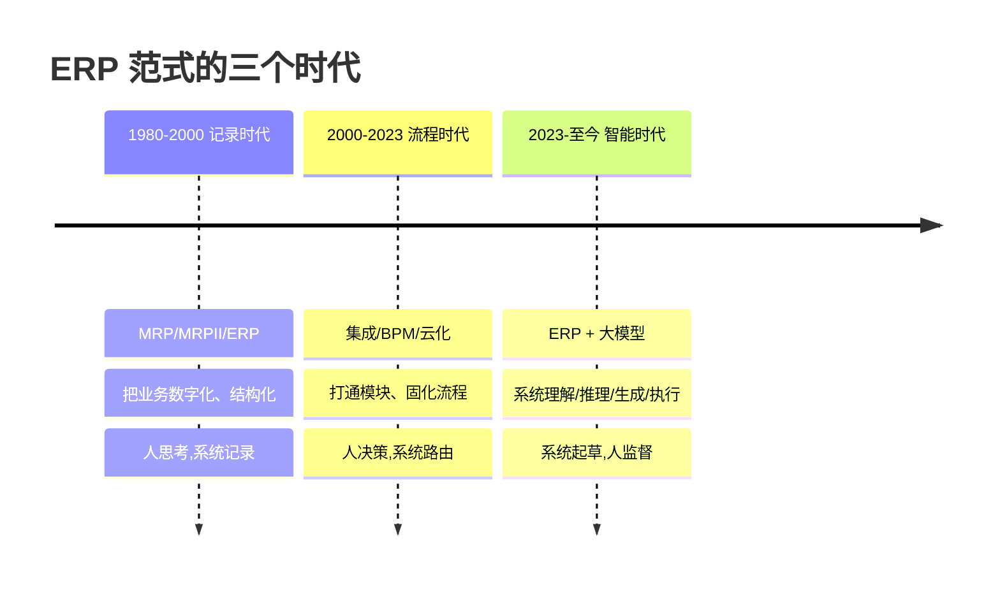

> 每一代不是推翻上一代,而是把上一代做成"地基"。**记录与流程不会消失,它们成为智能层可信的数据与执行底座。** 没有干净的记录与流程,AI 就是无源之水。

---

## 二、本质:从"记录系统"到"行动系统"的分工反转

理解这场变革,只需看清一件事:**谁思考、谁决策、谁行动、谁监督**——这四件事在人与系统之间的分配,正在反转。

### 图 1 · 分工反转:记录系统 vs 行动系统

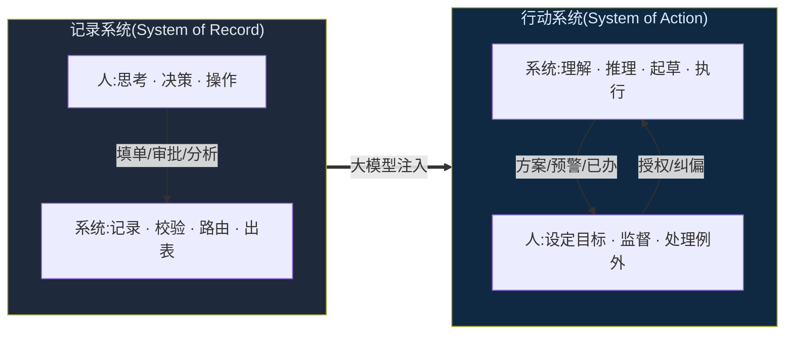

> 关键不是"AI 取代人",而是**默认值反转**:过去默认"人来做,系统辅助";未来默认"系统来做,人来兜底例外"。ERP 的价值重心从"记录的完整性"转向"行动的正确性 + 例外的可控性"。

---

## 三、ERP 与大模型:一场天作之合的互补

为什么是 ERP + 大模型,而不是"大模型取代 ERP"?因为二者的强弱**恰好互补**。

大模型强在语言、常识、推理、生成;**弱在它没有你企业的私有事实**——它不知道你这个月的应收账款、你的物料主数据、你的审批权限、你的过账规则。而这些"私有事实 + 业务语义 + 执行能力",正是 ERP 四十年积累的核心资产。

### 图 2 · ERP × 大模型的互补结构

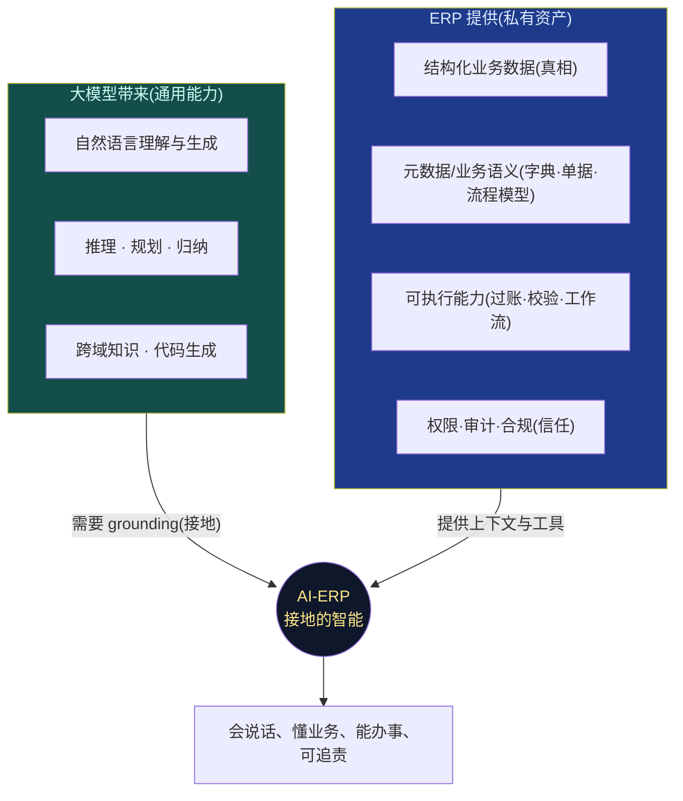

> 一句话:**大模型提供"脑",ERP 提供"记忆、手和规矩"。** 脱离 ERP 的大模型在企业里只会一本正经地胡说(幻觉);脱离大模型的 ERP 则永远只是一个更快的档案柜。**它们的护城河互补——这决定了融合而非替代。**

一个反直觉但关键的推论:**ERP 厂商最不起眼的资产——元数据与业务语义模型——在 AI 时代反而最值钱**。大模型要理解"这张表的这个字段是什么业务含义、这个单据要走什么流程、这个操作要什么权限",靠的正是这套语义层。谁的元数据越完整、越规范,谁的 AI 就越"接地"、越少幻觉。

---

## 四、业务层怎么变:四个可感知的跃迁

### 4.1 交互革命:自然语言成为新的"操作系统"

ERP 最痛的体验是"功能都有,但找不到、不会用"。大模型把**入口从"记住路径"变成"说出意图"**。

### 图 3 · 交互革命:从菜单迷宫到一句话

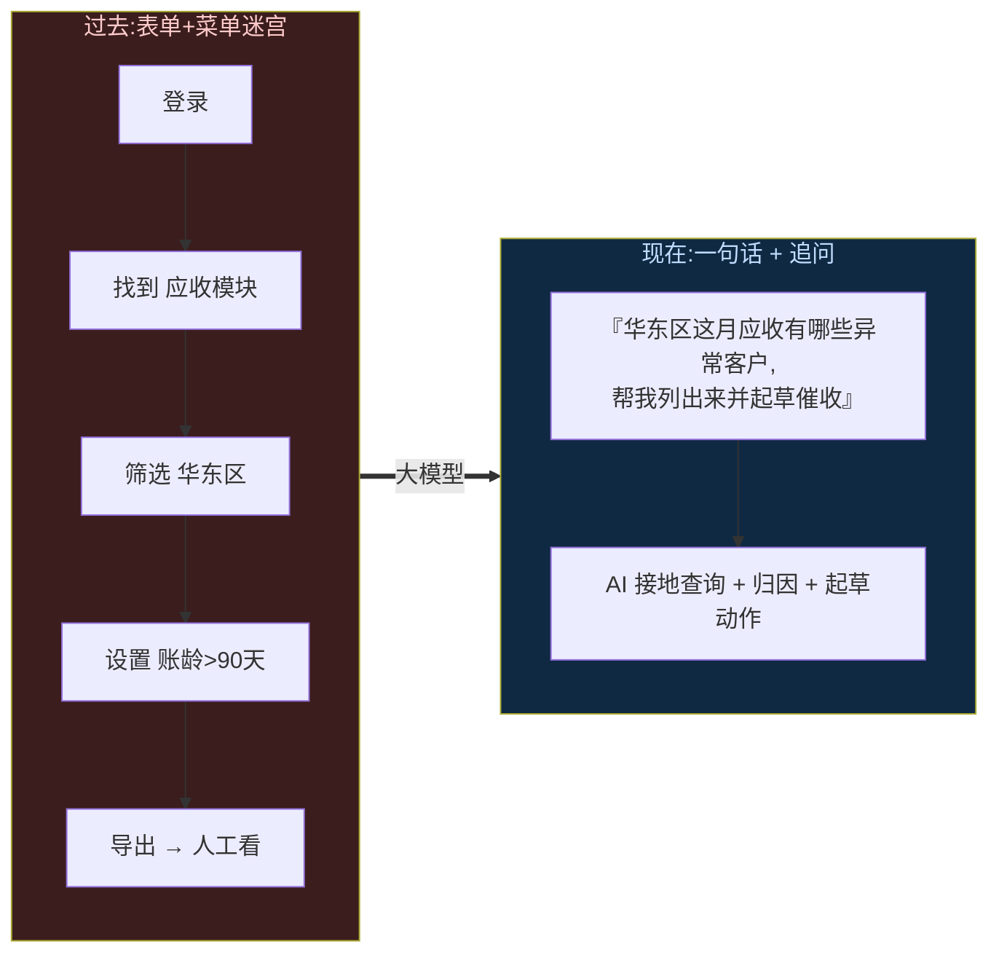

> 这不只是"加个搜索框"。当交互从"点击预设界面"变成"表达任意意图",ERP 的**长尾功能第一次真正可达**——那 80% 因为太难找而从未被用过的能力,被自然语言解锁。

### 4.2 从"记录过去"到"决策未来"

嵌入预测与优化:需求预测、库存优化、现金流预测、异常检测、供应风险预警。ERP 从"月底出一张报表告诉你亏了"变成"月中预警你哪条线要亏、并给出三个止损方案"。

### 4.3 流程的智能体化(Agentic Process)

传统工作流是"把表单在人之间路由";AI 工作流是"让智能体执行步骤,只在例外时找人"。采购到付款、订单到收款、招聘到入职这些跨模块长流程,可以由 Agent 端到端推进——**人从"每一步都要点"变成"只在异常和授权点介入"**。(具体闭环见第六节。)

### 4.4 定制的民主化:实施成本的结构性下降

ERP 总拥有成本的 60–70% 不在软件许可,而在**实施与定制**——配置、报表开发、流程调整、数据迁移,动辄数月数年。大模型能把"用自然语言描述需求"直接翻译成配置、报表、流程草案、迁移映射。**实施从"顾问雕花"变成"AI 生成 + 顾问校准"**,这是对 ERP 经济学的重构(对厂商是机会也是威胁,见第八节)。

---

## 五、技术层怎么接:AI-ERP 参考架构

把上面的业务愿景翻译成工程,需要一套分层架构。核心设计原则只有一句:**大模型永远不直接碰账本;它理解、检索、推理、起草,由确定性引擎校验并提交。**

### 图 4 · 三种集成范式(由浅入深)

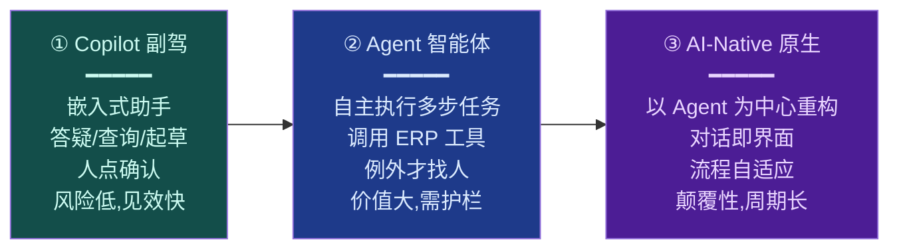

> 绝大多数 ERP 厂商与客户,理性路径是 **①→②→③ 渐进**:先用 Copilot 建立信任与数据飞轮,再放权给 Agent,最后在成熟域做 AI-Native 重构。跳级往往翻车。

### 图 5 · AI-ERP 技术参考架构

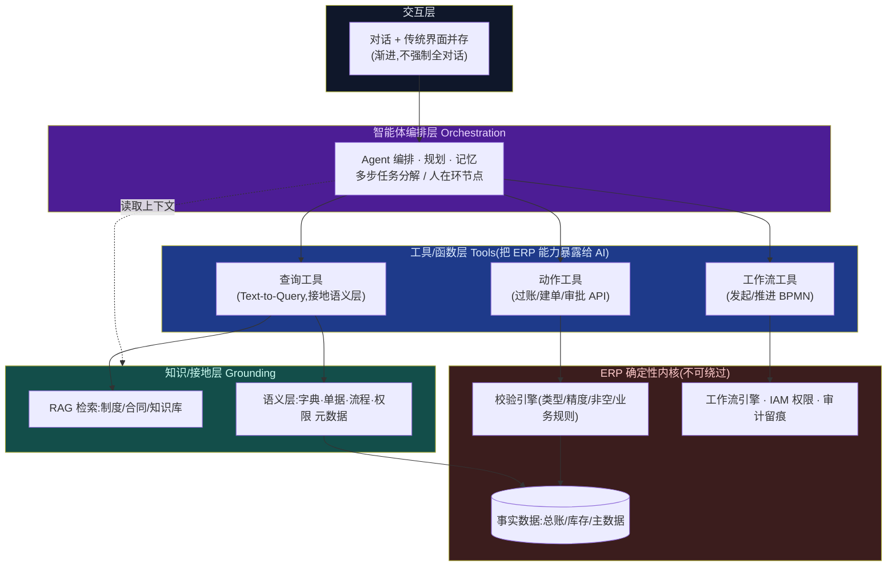

**逐层要点:**

- **交互层**:对话与传统界面**并存**,别一上来就废掉表单——高频结构化录入,表单仍更高效;探索、归因、跨模块任务,对话更强。
- **编排层**:这是 Agent 的大脑,负责把"催收华东区异常客户"拆成"查异常→归因→拟策略→建任务→发审批",并在每个高风险步骤插入**人在环(human-in-the-loop)**节点。
- **工具/函数层**:通过 function calling 把 ERP 能力暴露为工具。**这里是接地的关键**——AI 不是"猜"数据,而是"调工具查真数据、调工具做真动作"。
- **知识/接地层**:两条腿。**RAG** 检索非结构化制度/合同/知识;**语义层**提供结构化元数据,让 Text-to-Query 生成的查询"字段对得上、口径不出错"。**你们的 DCT 数据字典、DOC 单据模型、metaKind 分类学(DCT/DOC/FLX/RPT)——就是这套语义层。**
- **确定性内核**:一切写操作的最终关卡。**AI 生成的过账/建单,必须过校验引擎(类型/精度/非空/业务规则)才能落库**;权限走 IAM;每一步留审计。这一层不能被 AI 绕过——它是 ERP 之所以是 ERP 的原因。

---

## 六、一个真实闭环:采购到付款(P2P)的 Agent 化

抽象架构落到一个业务场景,看 AI 与确定性引擎如何分工。

### 图 6 · P2P Agent 闭环(AI 起草,引擎校验,人管例外)

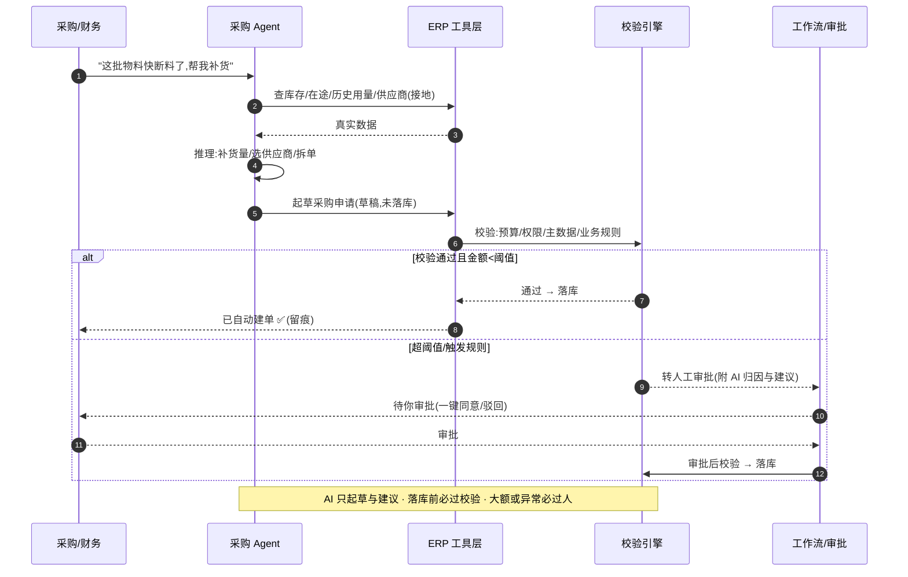

> 注意分工:**Agent 负责"想清楚补多少、找谁买、怎么拆单"(推理与起草),校验引擎负责"这单合不合规、能不能落"(确定性把关),工作流负责"该不该找人"(治理)**。三者各司其职,既拿到了自动化红利,又守住了正确性底线。

---

## 七、不可让渡的底线:正确性、可信与护栏

ERP 出错的代价是钱和法律责任,不是"再生成一次"。所以 AI-ERP 的工程重心,一半在能力,一半在**约束能力的护栏**。

### 图 7 · 最重要的一条原则:AI 提议,引擎执行

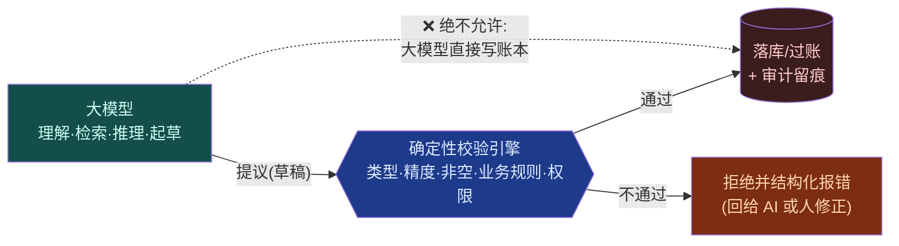

> 这条原则把"幻觉"关在了写操作之外:大模型可以幻觉出一张错的凭证,但它**过不了校验引擎那一关**——就像一个能言善辩但没有签字权的助理,提案再多,盖章的永远是那台一丝不苟的机器。**你们已经落地的"落库前列级校验 + CmxErrCode 统一错误码 + 结构化 violations",正是这道关卡的现成实现。**

### 图 8 · 五层纵深护栏

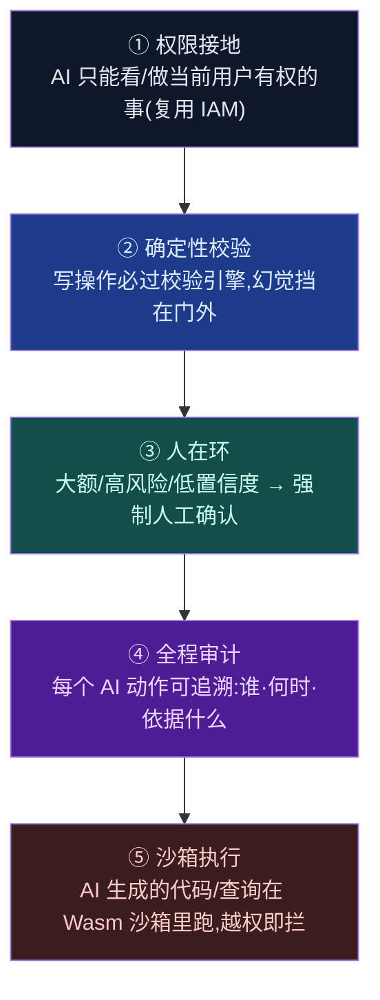

> 第⑤层值得单独说:当 Agent 开始**自己写查询、自己生成代码**去完成任务,你需要一个能安全执行不可信代码的基质。**这正是 Rust + WebAssembly 沙箱的用武之地**(deny-by-default、能力精确授予、燃料预算、用完即弃)——AI-ERP 与"下一代技术架构"在这里合流:**Wasm 是 Agent 时代安全执行的地基。**

---

## 八、ERP 厂商怎么转:四个维度的自我革命

对 ERP 公司而言,这不只是"给产品加 AI 功能",而是产品、数据、交付、商业模式的系统性重构。

### 图 9 · ERP 厂商变革的四个维度

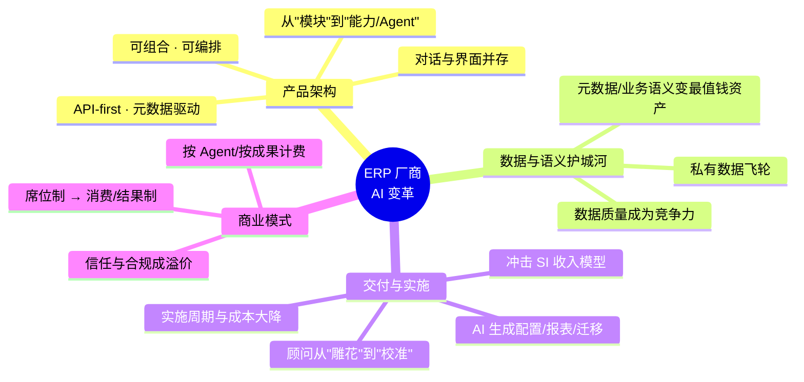

**四个维度的要害:**

1. **产品架构**:能被 Agent 操作的前提,是产品本身 **API-first + 元数据驱动 + 可组合**。一个到处是硬编码界面、没有干净接口和语义模型的 ERP,AI 无从下手。**这也是为什么"平台中立核 + 薄壳 + 元数据建模"的架构在 AI 时代是先手棋。**
2. **数据与语义护城河**:通用大模型人人可用,厂商的差异化在**私有数据 + 业务语义 + 领域知识**。把元数据模型做深做规范,就是在为 AI 修地基、也是在筑护城河。
3. **交付与实施**:AI 大幅压缩实施成本——对客户是福音,对靠实施收费的生态(尤其 SI 集成商)是**收入模型的冲击**。厂商要主动重构交付,否则被动被颠覆。
4. **商业模式**:当一个 Agent 顶十个操作员,"按席位收费"就站不住了。定价会从**席位制转向消费/结果制**(按 Agent、按处理量、按业务成果)。这是最难但最深刻的转变。

**竞争格局**:AI-Native 的 ERP 新势力会从"某个高价值场景 + 对话式体验"切入;而在位者(SAP/Oracle/用友/金蝶及自研平台)的护城河是**存量数据 + 深度流程 + 客户信任**。谁赢,取决于在位者**能否在自己被颠覆之前完成自我颠覆**。

---

## 九、落地路线:先爬,再走,后跑

不要一步到位。用可控的节奏建立信任、积累数据飞轮、沉淀护栏。

### 图 10 · 分阶段路线图

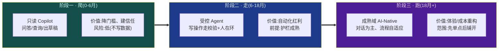

> 每一阶段都要有**可度量的 ROI** 才进入下一阶段。爬阶段量"采纳率与满意度",走阶段量"自动化率与差错率",跑阶段量"单位业务成本与周期"。**没有度量的 AI 转型,是烧钱的信仰。**

---

## 十、一个现成的地基:cmx-container 的资产映射

这场变革对很多 ERP 厂商是"重造",但对一个**元数据驱动 + Rust/Wasm + 微服务**的现代平台,更像是"接线"——因为 AI-ERP 需要的地基,大多已经在了。

### 图 11 · cmx-container 现有资产 → AI-ERP 能力映射

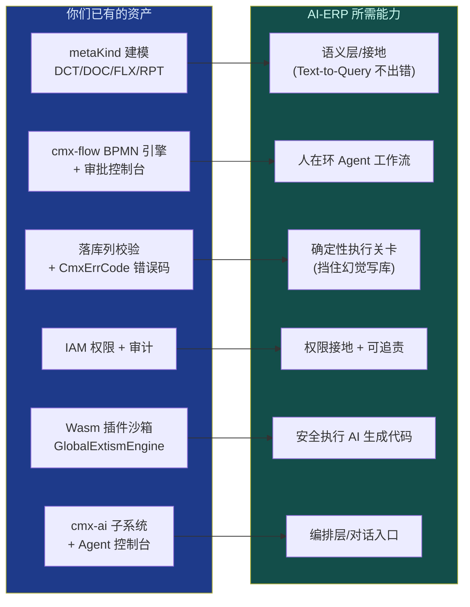

> 结论很清楚:**你们缺的不是地基,而是"接线"——把大模型的编排层接到已有的语义层、校验关卡、工作流与沙箱上。** 元数据建模天然是 AI 的接地层,BPMN 引擎天然是人在环 Agent 的执行骨架,落库校验天然是挡幻觉的确定性关卡,Wasm 沙箱天然是 Agent 安全执行的基质。**这套架构不是为 AI 准备的,却恰好为 AI 准备好了。**

---

## 十一、诚实的挑战:不回避的五道坎

任何只讲愿景不讲代价的 AI 叙事都是不负责任的。真实的坎有五道:

1. **幻觉与正确性**:大模型会自信地编造。**对策不是"消灭幻觉"(做不到),而是"隔离幻觉"**——用第七节的"AI 提议、引擎执行"把幻觉挡在写操作之外,用 RAG 接地降低读操作幻觉。**不能接受幻觉的环节,就不要让 AI 单独拍板。**
2. **数据质量**:AI 接地的前提是数据与元数据干净。**垃圾进,垃圾出**——很多企业的第一步其实不是上 AI,而是先把主数据和元数据治理好。这不性感,但绕不过。
3. **安全与合规**:企业数据不能随便喂给公有大模型;金融/医疗等行业有强监管。**对策**:私有化/本地部署模型、数据脱敏、权限接地、全程审计、可解释留痕。合规不是障碍,是 ERP 厂商相对 AI 新势力的**信任溢价**。
4. **成本与 ROI**:大模型推理有真实成本,Agent 多步调用会放大。**对策**:大小模型分级(简单任务用小模型/规则,复杂才上大模型)、缓存、按价值场景投放,而非全面铺开。每一步都要能算清账。
5. **组织与人**:岗位重塑会遇到真实阻力,"AI 抢饭碗"的焦虑是合理的。**对策**:把 AI 定位为"增强而非替代"的副驾,用人在环设计让人保留决策权与尊严,并配套再培训。**技术能一夜迭代,组织不能——变革的真正瓶颈往往在人,不在模型。**

---

## 十二、结语:ERP 的第二次诞生

四十年前,ERP 的诞生解决了一个问题:**把散落的业务,记录成统一的真相。** 它是伟大的,让企业第一次拥有了"数字化的自己"。

四十年后,大模型带来第二个问题的答案:**让这个统一的真相,自己思考、自己行动。** ERP 不再只是回答"发生了什么"的档案馆,而成为回答"该怎么办、并帮你办了"的行动系统。

但这次诞生有一条不变的脐带:**正确、可信、可追责**。谁能在拥抱大模型的推理与生成的同时,守住确定性引擎的校验与留痕——谁就能既拿到智能的红利,又不丢掉 ERP 立身的根本。**AI 提议,引擎执行;人设目标,系统行动**——这十六个字,是传统 ERP 走进 AI 时代最稳的一条路。

变革不会一夜发生,也不该一步到位。但方向已经清晰:**从记录到行动,从人适应系统到系统服务人。** ERP 的上半场,我们教会了机器记账;下半场,我们教它做事——而我们,负责告诉它该做什么、并确认它没做错。

---

*本文技术判断基于公开的 AI 工程实践与 ERP 领域常识,并结合 cmx-container 平台(metaKind 元数据建模、cmx-flow 流程引擎、落库校验+错误码、IAM、Wasm 插件沙箱、cmx-ai 子系统)的真实架构。文中阶段周期、成本占比为行业代表性区间,具体随企业规模、行业与实施策略而异。核心原则"AI 提议·确定性引擎执行"适用于一切以正确性与可审计性为底线的企业系统。*
