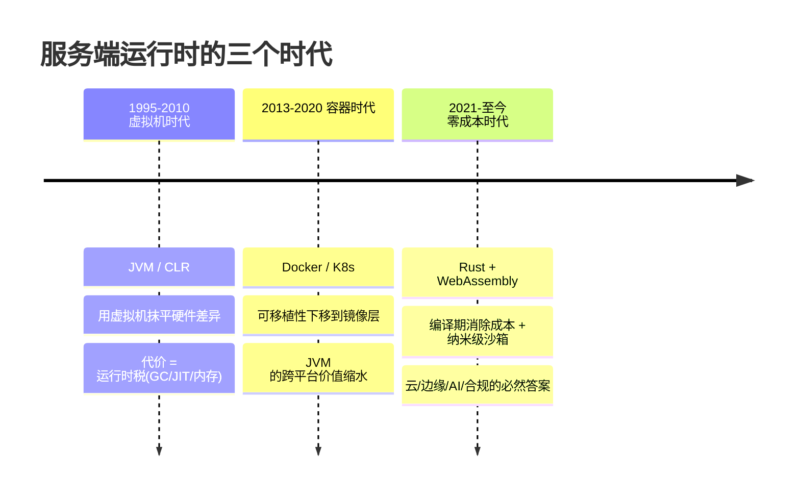
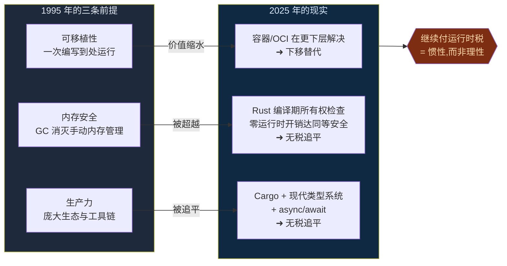
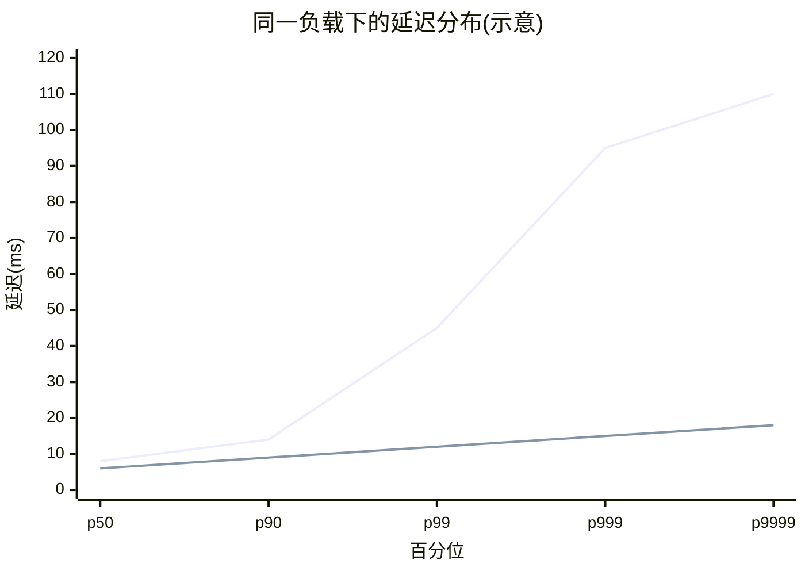
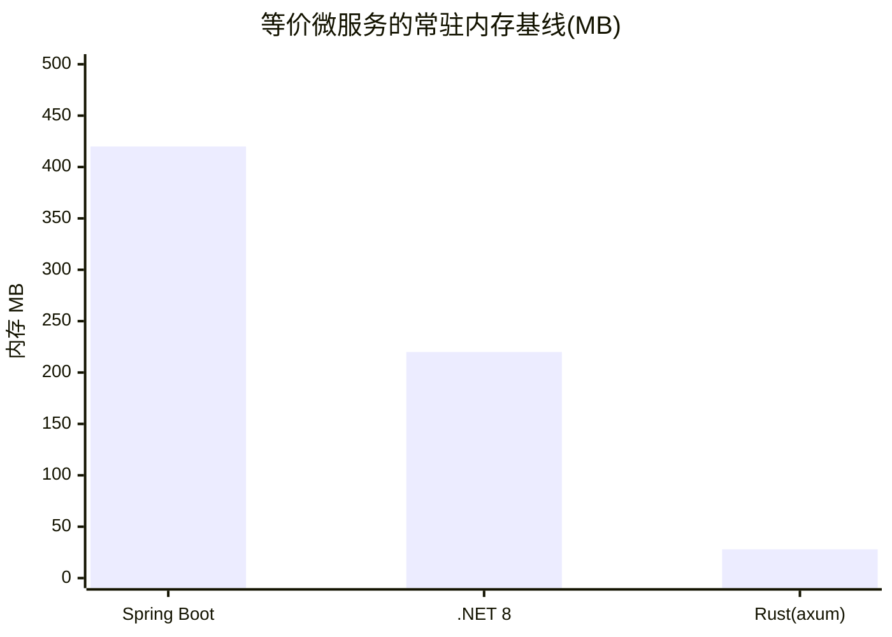
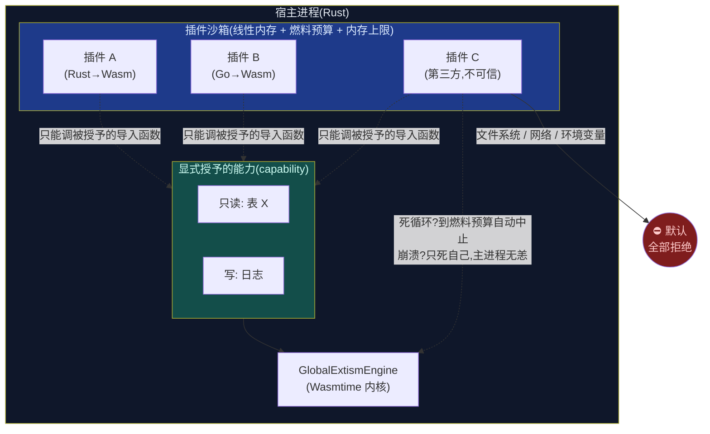
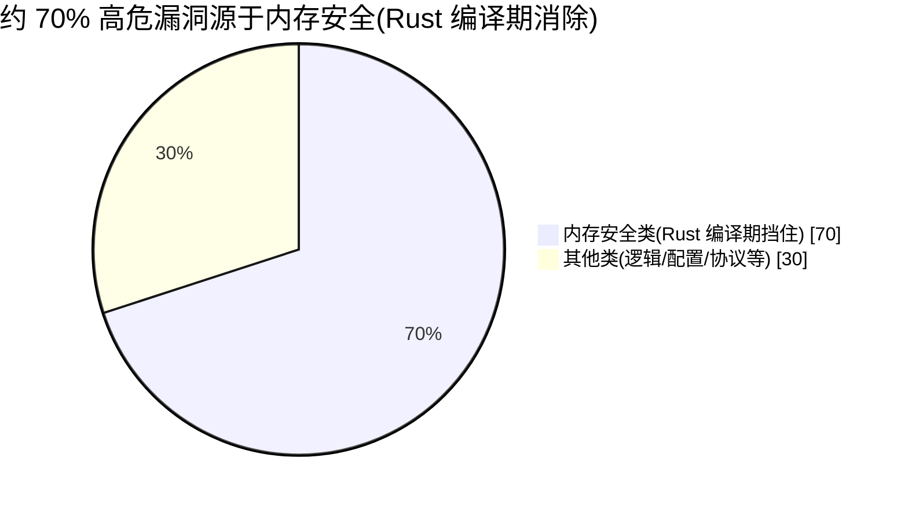
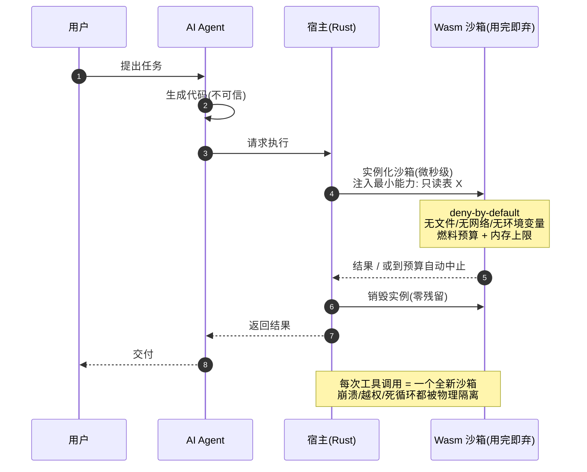
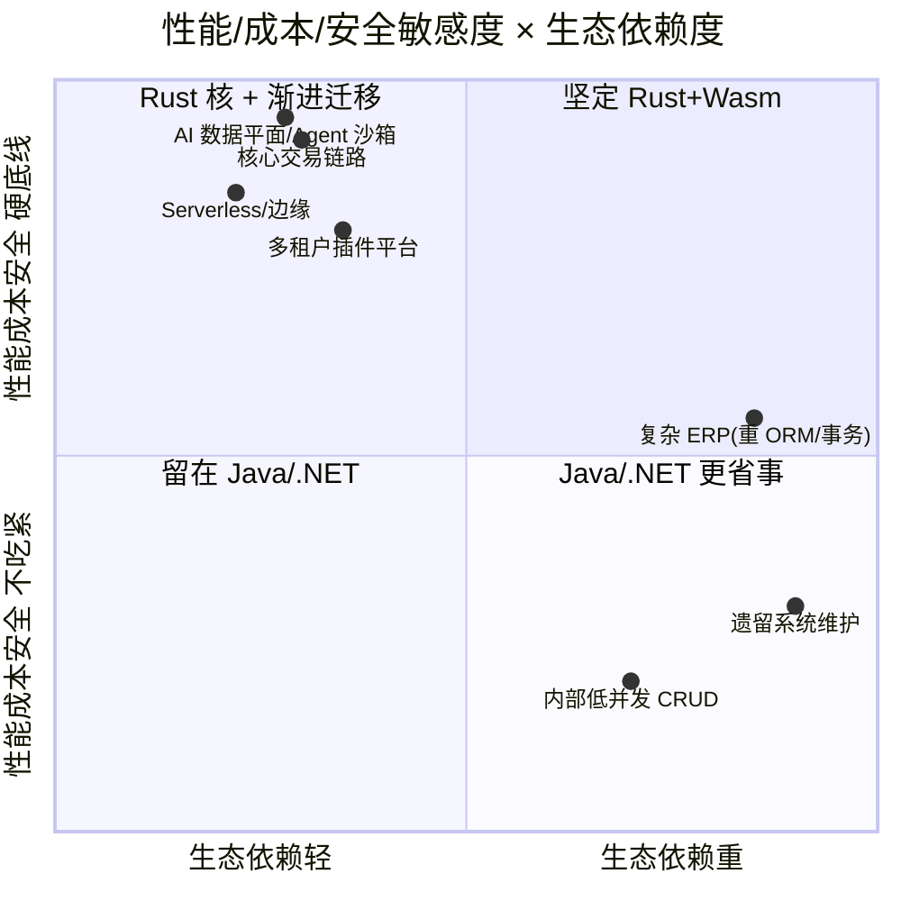
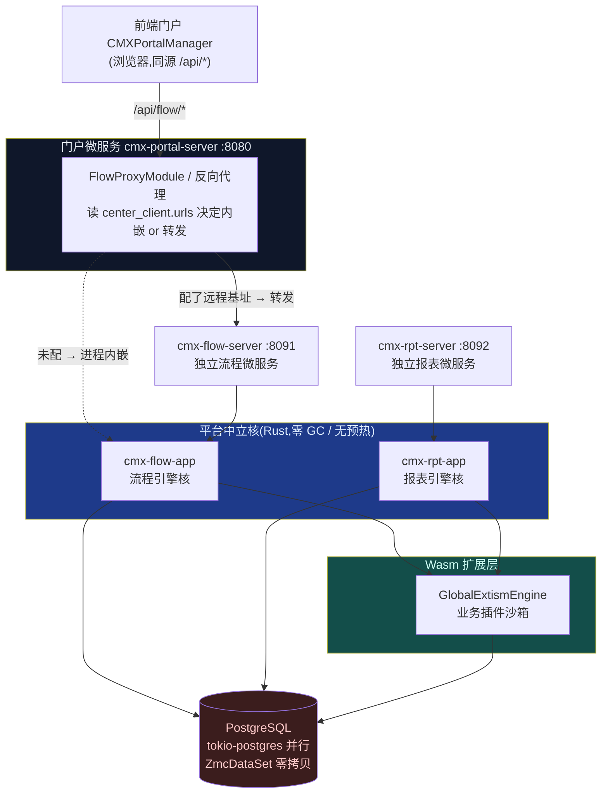
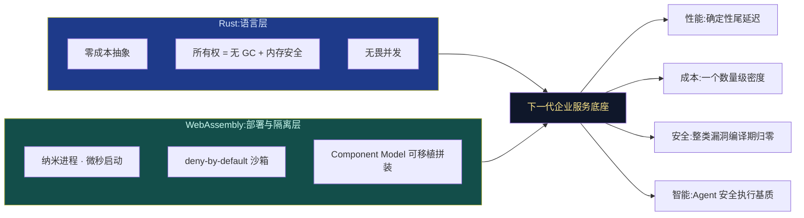

# 从托管运行时到零成本抽象
## Rust + WebAssembly 与下一代企业应用服务架构

> 一次关于"运行时税"的清算,一场从"虚拟机时代"到"零成本抽象时代"的范式迁移。

---

## 摘要

过去三十年,企业级服务端被两种"托管运行时"(managed runtime)统治:Java 的 JVM 与 .NET 的 CLR。它们用一层虚拟机换来了可移植性、内存安全与工程生产力——在 2000 年前后,这是一笔划算到无可争议的交易。

但支撑这笔交易的前提正在系统性瓦解:云计算把"资源"重新定价成了"按毫秒、按 MB 计费";Serverless 与边缘计算把"冷启动"从工程细节抬升为核心成本项;AI 把"确定性低延迟"与"安全地执行不可信代码"变成了刚需;而监管与供应链安全则把"内存安全"从加分项变成了合规底线(2024 年美国白宫 ONCD 报告直接点名建议业界转向内存安全语言)。

当这些前提逐一改变,答案也随之改变。本文论证:**Rust 作为语言 + WebAssembly 作为部署与隔离基质,构成了下一代企业应用服务的技术底座**。这不是又一次"新语言换旧语言"的轮回,而是一次运行时范式的迁移——从"用虚拟机抹平差异"到"用编译期消除成本"。我们将从性能、扩展性、云原生经济学、安全、智能化、工程正确性六个维度展开,与 Java/.NET 逐项对比,并诚实地讨论它的代价与边界。

### 图 0 · 三个运行时时代的范式迁移

> **一句话读懂本文**:上一代用"运行时的一层虚拟机"换安全与可移植;这一代用"编译期的所有权检查 + 部署期的 Wasm 沙箱",在**零运行时税**的前提下同时拿到安全、可移植、性能与隔离。

**图目录**:图0 三时代范式迁移 · 图1 三前提瓦解 · 图2 尾延迟形态 · 图3 内存基线 · 图4 冷启动时间轴 · 图5 隔离粒度光谱 · 图6 插件能力沙箱 · 图7 漏洞根因构成 · 图8 Agent 沙箱回路 · 图9 cmx-container 一芯多壳 · 图10 选型决策象限 · 图11 两半合流底座

> 📌 本文全部图表用 Mermaid 绘制,GitHub / GitLab / VS Code / Typora / 语雀等主流 Markdown 环境可直接渲染;已通过 Mermaid 11 解析校验(12/12)。

---

## 一、历史的回望:托管运行时为何曾经正确

1995 年的 Java 和 2002 年的 .NET 下了同一个赌注:**在应用与硬件之间插入一层虚拟机**(JVM / CLR),以此换来三样东西——

1. **可移植性**:"一次编写,到处运行",在 CPU 架构和操作系统碎片化的年代价值连城;
2. **内存安全**:垃圾回收(GC)让开发者告别手动 `malloc/free`,消灭了 C/C++ 时代最致命的一类崩溃;
3. **生产力**:反射、动态加载、庞大的标准库与中间件生态,让企业开发从"雕琢"变成"拼装"。

代价是一层**运行时税**:GC 停顿、JIT 预热、几百 MB 的内存基线、启动要数秒。但在 2005 年,一台服务器几万块、一年 7×24 常驻运行、内存以 GB 论价、启动一次跑三年——这层税几乎可以忽略。**托管运行时在它的时代是正确的。**

问题在于:那个时代的三条前提,今天还剩几条?

- 可移植性?——容器(Docker/OCI)已经在**更下面一层**解决了它。JVM 的"跨平台"在"跨平台的容器镜像"面前,价值大幅缩水。
- 内存安全?——GC 不是唯一解。Rust 证明了**编译期所有权检查**可以在零运行时开销的前提下达到同等甚至更强的安全(它连数据竞争都在编译期挡住,这是 GC 做不到的)。
- 生产力?——Cargo、现代类型系统、`async/await`,已经让 Rust 的工程体验逼近甚至在某些维度超越托管语言。

三条前提,一条被下移替代,两条被无税方案追平。**当支撑一笔交易的前提消失,继续付这笔税就不再是理性,而是惯性。**

### 图 1 · 托管运行时三大前提的瓦解

---

## 二、性能:确定性的胜利

性能的讨论,容易滑向"谁的吞吐量基准测试数字更大"的口水战。但企业服务真正的痛点从来不是**平均**性能,而是**确定性**——p99、p999 尾延迟,冷启动,以及单位算力的成本。这恰恰是托管运行时的结构性软肋。

### 2.1 GC:被抹平的平均值,被撕裂的尾部

JVM 的 GC 在过去十年进步巨大(G1、ZGC、Shenandoah 把停顿压到了亚毫秒级)。但**"低停顿"不等于"无成本"**:

- ZGC/Shenandoah 用**并发回收 + 读写屏障**换低停顿,屏障是加在每次对象访问上的隐性 CPU 税,吞吐通常要让出 5%–15%;
- 低停顿依赖**堆有足够冗余**——你得多给 30%–50% 的内存让 GC"有空间腾挪",这在按 MB 计费的云上是直接的账单;
- 一旦分配速率超过回收速率,仍会退化为长停顿。高负载下的 p999 毛刺,是每个 JVM 老手都熟悉的噩梦。

Rust **没有 GC**。内存在编译期就由所有权(ownership)和生命周期(lifetime)决定何时释放,`drop` 是确定性的、在离开作用域的那一刻发生。**没有后台回收线程,没有停顿,没有屏障税,尾延迟平坦。** 对于交易撮合、实时风控、支付清算这类"p999 就是 SLA"的场景,这不是优化,是资格。

### 图 2 · 尾延迟形态:GC 抖动 vs 确定性释放

> 平均值(p50)两者接近,**差距全在尾部**:GC 语言的 p999/p9999 被回收停顿撕出长尾,Rust 的确定性 `drop` 让曲线一路平坦。企业 SLA 恰恰写在尾部。

> .NET 的 CLR 与 JVM 同构,GC 特性类似(Server GC / 后台 GC),结论一致。.NET 在 AOT 上比 Java 走得略早(见下),但只要还依赖托管堆 + GC,尾延迟的结构性问题就在。

### 2.2 内存足迹:一个数量级的差距

一个典型的 Spring Boot 微服务,常驻内存(RSS)基线通常在 **300–500 MB**(堆 + 元空间 + JIT 编译缓存 + 线程栈)。一个功能等价的 Rust (axum/tokio) 微服务,常驻内存通常在 **10–40 MB**。

这**接近一个数量级**的差距,在云上是逐项传导的真金白银:

- 同一台 K8s 节点能塞下的实例数,直接决定 bin-packing 密度;
- 内存是很多云厂商 Serverless / 容器实例的**主计费维度**;
- 更小的常驻集意味着更好的 CPU 缓存局部性——间接又拿回一部分性能。

### 图 3 · 微服务常驻内存基线(MB,越低越好)

### 2.3 启动与预热:从"秒"到"毫秒",从"慢热"到"满血出场"

托管运行时有两道启动关:

1. **类加载 / 程序集加载 + 初始化**:JVM 冷启动到能服务第一个请求,常见几秒起步;
2. **JIT 预热**:JVM 靠 C2、CLR 靠 Tiered JIT,在运行时观测热点再编译成机器码。这意味着**服务刚起来的头几百、几千个请求跑的是解释执行或低优化代码**,要跑一阵才"热身"到峰值性能。

Rust 编译成**原生机器码**,由 LLVM 在**构建期**做完全部优化(内联、单态化、向量化)。它:

- 启动是**毫秒级**(就是把二进制映射进内存、跑 `main`);
- **从第一条指令就是满血**——没有预热曲线,第一个请求和第一百万个请求一样快。

这两点在两个场景里从"锦上添花"变成"决定成败":Serverless(见第四节)和自动扩缩容——当流量突刺、HPA 拉起新实例时,你要的是"新实例立刻分担负载",而不是"新实例先慢热 30 秒,期间把上游拖垮"。

### 图 4 · 冷启动到"满血服务"的时间轴(对数直觉,越短越好)

> 关键差异不只是"起得慢",而是 JVM **起来之后还要慢热一段**;Rust/Wasm **第一个请求就是峰值性能**。弹性扩容与 Serverless 场景,这一条常常直接决定成败。

### 2.4 一张对比表(代表性区间,非某次特定基准)

| 维度 | JVM (Java 21) | CLR (.NET 8) | Rust (native) |
|---|---|---|---|
| 内存基线(微服务) | 300–500 MB | 150–300 MB | 10–40 MB |
| 冷启动(到首个请求) | 1–5 s | 0.5–3 s(AOT 后 <100 ms) | 5–50 ms |
| JIT 预热 | 需要(C2) | 需要(可 AOT 免) | 无(构建期已优化) |
| GC 停顿 | 亚毫秒–数十毫秒 | 类似 | 无 GC |
| 峰值吞吐 | 高(预热后) | 高 | 高(且无预热) |
| 尾延迟(p999) | 受 GC 抖动 | 受 GC 抖动 | 平坦 |
| 静态二进制镜像 | 200 MB+(或 GraalVM) | 100 MB+(或 AOT) | 5–20 MB(scratch/distroless) |

> 公允地说:**GraalVM Native Image** 让 Java、**Native AOT** 让 .NET 都能编译成原生二进制,大幅改善启动与足迹。这恰恰印证了本文的方向——**整个行业都在朝"消除运行时税"移动**。但两者都要付出代价:GraalVM 的封闭世界假设让反射、动态代理、字节码增强(Spring/Hibernate 的看家本领)需要繁琐的配置甚至无法工作;Native AOT 同样牺牲了 CLR 的部分动态能力。它们是在为"过去的动态生态"打补丁向未来靠拢,而 Rust 生来就在终点。

### 2.5 能耗:一个常被忽略的维度

Pereira 等人发表的著名研究《Energy Efficiency across Programming Languages》(SLE 2017)对主流语言做了系统能耗测量:**C 与 Rust 并列第一梯队**,Java 的能耗约为 Rust 的 **2 倍**,而解释型语言(Python/Ruby)高达数十倍。在数据中心电力已成为规模化企业主要成本、且"碳足迹"进入 ESG 报表的今天,"同样的业务,一半的电",是一个战略级的数字。

---

## 三、WebAssembly:比容器更细的隔离粒度

如果说 Rust 解决的是"语言层"的运行时税,那么 WebAssembly(Wasm)解决的是"部署与隔离层"的粒度问题。它是这场变革中**同等重要、却更被低估**的另一半。

### 3.1 纳米进程:容器与函数之间缺失的一环

我们已经有了虚拟机(重、秒级启动)、容器(轻、百毫秒级启动)。Wasm 提供了更细的一层——**纳米进程(nanoprocess)**:

- **实例化时间以微秒计**(不是毫秒,是微秒);
- **内存开销以 KB–MB 计**;
- **默认沙箱、默认无权限**(deny-by-default):一个 Wasm 模块看不到文件系统、网络、环境变量,除非宿主**显式**通过导入函数(能力,capability)授予。

这意味着你可以在**单个进程内**安全地实例化成百上千个互不信任的模块,每个的启动和销毁成本低到可以"按请求"来做。这是容器做不到的粒度,也是托管运行时的类加载器/AppDomain 从未真正达到的隔离强度。

### 图 5 · 隔离粒度光谱:Wasm 填补了容器与函数之间的缺环

> 从左到右,越来越轻、越来越快;从右到左,隔离越来越强。**Wasm 是唯一同时"接近线程的轻"与"接近容器的隔离"的一档**,还额外带来"默认无权限"——这一档,正是过去缺失的。

### 3.2 插件化:企业系统的世纪难题,终于有了正确答案

企业系统永远需要"扩展点":多租户的定制逻辑、第三方插件、业务规则热更新。看看历史上的答案有多痛:

- **Java 的 ClassLoader / OSGi**:类加载器地狱、`ClassCastException` 跨加载器诡异错误、卸载时的**内存泄漏**(经典的 PermGen/Metaspace 泄漏)、以及——**没有真正的隔离**。一个插件里的 `while(true){}` 或 `System.exit()` 能拖垮整个 JVM。OSGi 复杂到成为一门"黑魔法"。
- **.NET 的 AppDomain**:曾用于隔离,但在 .NET Core 中**被废弃**,取而代之的 `AssemblyLoadContext` 只解决加载/卸载,**不提供内存与 CPU 隔离**。

Wasm 给出的答案干净得多:

- **强隔离**:插件跑在线性内存沙箱里,越界访问在指令级被拦截,崩溃只影响自己;
- **可计量**:宿主可以给每个实例设**燃料(fuel)/ 指令预算**和**内存上限**——插件死循环?到预算自动中止,主进程毫发无损;
- **语言无关**:插件可以用 Rust、Go、C、AssemblyScript、甚至(经 Wasm 化的)Python 编写,只要编译到 Wasm。企业不再被绑死在宿主的语言上;
- **供应链安全**:因为默认无权限,你可以精确审计"这个第三方插件到底能碰什么"。这在 Log4Shell 之后是决定性的。

> **这正是你们 cmx-container 架构里已经在做的事**:通过 Extism(基于 Wasmtime 的插件框架)把业务扩展点做成 Wasm 插件,由 `GlobalExtismEngine` 统一托管。宿主 Rust,插件 Wasm,能力显式注入——这不是 PPT,是已经在跑的工程。

### 图 6 · 宿主-插件的能力沙箱模型(deny-by-default)

### 3.3 Component Model 与 WASI:正在成型的"可移植组件标准"

早期 Wasm 只有整数浮点和线性内存,跨模块传个字符串都费劲。**WASI**(WebAssembly System Interface)和 **Component Model** 正在补齐这一环:

- **WASI** 定义了一套可移植、capability-based 的系统接口(文件、时钟、随机数、网络……),让 Wasm 走出浏览器、成为服务端一等公民;
- **Component Model** 定义了带丰富类型的组件接口(通过 WIT 描述),让不同语言写的 Wasm 组件像乐高一样**类型安全地拼装**,还能各自独立版本演进。

这是"一次编译,安全拼装,到处运行"——比 Java 的"一次编写到处运行"更进一步:它连**语言边界**也一起抹平了。标准仍在成熟(这是它今天的主要不成熟点,见第八节),但方向明确、进展迅速,微软、字节、Fastly、Cloudflare、Fermyon 等都在下重注。

---

## 四、扩展性与云原生经济学

把前两节的技术特性,翻译成 CFO 和 SRE 都能看懂的语言:**同样的业务,更少的机器,更低的账单,更快的弹性。**

### 4.1 密度:一个节点顶过去五个

内存基线从 400 MB 降到 30 MB,意味着同一台 64 GB 的节点,理论上能承载的实例数从 ~150 提升到 ~2000(实际受 CPU/连接数约束,但**5–10 倍的密度提升是现实可达的**)。密度直接决定:

- **更少的节点** → 更低的计算账单 + 更低的运维复杂度;
- **更好的 bin-packing** → K8s 调度碎片更少;
- **更小的爆炸半径** → 单节点故障影响面可控。

### 4.2 Serverless:冷启动是命门,而 Wasm 生来免疫

Serverless(FaaS)的核心承诺是"缩容到零、按需付费"。但它的阿喀琉斯之踵是**冷启动**:当函数从零拉起,用户就得等。

- 传统容器化函数冷启动:**数百毫秒到数秒**;
- JVM 函数冷启动:**雪上加霜**(类加载 + 预热);
- **Wasm 函数冷启动:毫秒甚至亚毫秒级**。

这不是理论。**Cloudflare Workers、Fastly Compute@Edge 用 Wasm 而非容器来跑边缘函数,正是因为 Wasm 能做到 ~5ms 级冷启动**——用容器根本不可能在边缘做到"每个请求可能落在不同节点、每次都近乎冷启动"还保持低延迟。Fermyon Spin、wasmCloud 则把这套搬到了通用服务端。**Wasm 让"真正缩容到零"第一次变得没有延迟代价。**

### 4.3 边缘计算:小、快、安全、可移植——四个词都是 Wasm 的主场

边缘节点资源受限、地理分散、物理上不可信。你需要一个**足够小**(塞进受限设备)、**足够快**(冷启动无感)、**足够安全**(强沙箱)、**足够可移植**(一份产物跑遍异构边缘)的执行单元。这四个约束的交集,几乎就是 Wasm 的定义。JVM 太重、容器太胖、原生二进制不跨架构——**Wasm 是唯一同时满足四者的选项。**

### 4.4 镜像与供应链

Rust 静态二进制可以打进 `scratch` 或 `distroless` 镜像,**5–20 MB**;对比动辄 200 MB+ 的 JVM 基础镜像。更小的镜像意味着:更快的拉取与扩容、更小的攻击面(镜像里根本没有 shell、包管理器、一堆 CVE 温床)、更清爽的供应链审计。

---

## 五、安全:把整类漏洞消灭在编译期

这可能是最不容辩驳的一维,因为它有硬数据。

### 5.1 内存安全:70% 的漏洞,一次性清零

微软安全响应中心(MSRC)和 Google Chromium 团队各自独立统计得出同一个惊人结论:**其大型 C/C++ 代码库中约 70% 的高危安全漏洞,根因是内存安全问题**(缓冲区溢出、use-after-free、越界读写、数据竞争)。

### 图 7 · 大型 C/C++ 代码库高危漏洞根因构成(MSRC / Chromium 统计)

> 这不是"少一点 bug",而是**一整类攻击面在编译期归零**。Rust 的所有权检查器让缓冲区溢出、use-after-free、数据竞争**根本编译不过**——把安全从"运行时防御"变成"编译期不可能"。

Rust 的所有权 + 借用检查器**在编译期**消灭了这**整一类**漏洞——不是"运行时检测",是"根本编译不过"。而且它比 GC 更进一步:**数据竞争(data race)也是编译错误**。GC 语言能防悬垂指针,但防不了并发下的数据竞争(Java 的 `synchronized` 用错了照样翻车);Rust 的 `Send`/`Sync` 把并发安全编进了类型系统——这就是所谓"无畏并发(fearless concurrency)"。

2024 年,美国白宫国家网络总监办公室(ONCD)发布报告,**明确建议业界转向内存安全语言**,并点名 Rust。当内存安全从"最佳实践"变成"监管期望",技术选型的天平就不再只由性能决定。

### 5.2 供应链与"执行不可信代码"

现代应用的另一半风险来自依赖与插件。Log4Shell(CVE-2021-44228)让全世界见识了"一个日志库的一个动态特性能捅多大的篓子";Java/.NET 反复出现的**反序列化漏洞**是同一类问题的不同面孔;JVM 的 `SecurityManager` 已在 Java 17 中被**废弃**,等于官方承认"在 JVM 里做进程内隔离这条路走不通"。

Wasm 的 deny-by-default 沙箱,正是这个问题的结构性答案:**不可信代码默认什么都干不了**,宿主给什么能力才有什么能力。在"要安全地运行第三方插件"和——下一节会讲到的——"要安全地运行 AI 生成的代码"这两个场景里,这是无可替代的地基。

---

## 六、智能化:AI 时代的系统语言

一个常被忽视的事实:**当代 AI 基础设施,正在被 Rust 悄悄重写。** 这不是巧合,是同一套底层逻辑(确定性性能 + 内存安全 + 无 GC)在 AI 数据平面上的必然。

### 6.1 Rust 已经是 AI 基建的系统语言

- **HuggingFace `tokenizers`**——全世界跑 Transformer 都在用的分词器,核心是 Rust;
- **`candle`**(HuggingFace)、**`burn`**——原生 Rust 的深度学习/推理框架;
- **`Polars`**、**Apache `DataFusion`**、**`Arrow`** 的 Rust 实现——正在取代 Pandas/Spark 部分场景的高性能数据处理引擎;
- **向量数据库**:`Qdrant`、`LanceDB` 均以 Rust 写就;
- **推理运行时**:`ort`(ONNX Runtime 绑定)、`llama.cpp` 的 Rust 生态。

为什么?因为 AI 的数据平面对**吞吐、延迟确定性、内存效率**极度敏感,而这正是 GC 语言的短板、Rust 的主场。**Python 负责"描述模型",但真正扛住流量的那层,越来越是 Rust。**

### 6.2 边缘推理与"模型即 Wasm 组件"

把一个量化后的小模型 + 推理逻辑编译成 Wasm 组件,你就得到了一个**可移植、沙箱化、毫秒冷启动**的推理单元,能安全地部署到任意边缘节点。配合 WASI-NN(WASI 的神经网络接口提案),Wasm 正在成为**边缘 AI 的标准部署格式**。相比之下,让 JVM 扛边缘实时推理,GC 抖动就足以破坏"实时"二字。

### 6.3 决定性时刻:安全地执行 AI 生成的代码

这是 2024 年之后最尖锐、也最能说明问题的新场景。当 AI Agent 开始**自己写代码、自己调工具**,你面对一个前所未有的安全命题:**如何执行一段由概率模型生成、你无法预先信任的代码,而不把宿主暴露给它?**

答案几乎是被 Wasm 量身定制的:

- **deny-by-default 沙箱**:AI 生成的代码默认碰不到文件、网络、系统调用;
- **能力精确授予**:你可以只给它"读这一张表"的能力,多一分都没有;
- **燃料预算**:防止生成的代码死循环烧光资源;
- **毫秒实例化**:每次工具调用起一个新沙箱,用完即弃,零残留。

**"AI 写代码"和"Wasm 安全执行代码"是天作之合。** 谁掌握了安全执行不可信代码的基质,谁就掌握了 Agent 时代的运行时。这一维度,托管运行时(废弃了 SecurityManager 的 JVM、废弃了 AppDomain 的 CLR)已经主动退场。

### 图 8 · Agent 安全执行 AI 生成代码的沙箱回路

---

## 七、工程与正确性:不止于快

技术选型不能只看运行时,还要看"人写它顺不顺、写出来的东西对不对"。

- **"如果它编译通过,它大概率就是对的"**——这是 Rust 社区反复被验证的体感。所有权、穷尽性匹配(exhaustive match)、`Option`/`Result` 强制错误处理、无空指针(no `null`),把大量"运行时才炸"的问题提前到编译期。企业软件最贵的成本是"线上事故",而 Rust 的哲学就是把事故左移到编译器。
- **无畏并发**:前面说过,数据竞争是编译错误。这让"写并发代码"从"资深工程师的雷区"变成"编译器保驾的常规操作"。
- **Cargo**:一体化的构建、依赖、测试、文档、发布工具链,是公认的现代语言工具链标杆——对比 Java 的 Maven/Gradle 之争与配置复杂度,Cargo 的"开箱即用"是实打实的生产力。
- **`async/await` + tokio**:M:N 协作式调度,单机可轻松承载**百万级并发任务**,内存开销远低于线程-per-请求模型。(Java 的虚拟线程 Project Loom 是同方向的追赶,值得肯定,但 tokio 生态已成熟数年。)

> 你们的 cmx-container 里,`cmx-database-pg` 的 `ZmcDataSet` 零拷贝数据层、tokio 全异步、`OnceCell` 引擎单例、跨引擎 parity 测试——都是这套"正确性 + 性能"哲学的具体落地。

---

## 八、诚实的代价:任何革命都有账单

如果一篇文章只有优点,它就是广告而不是技术分析。Rust + Wasm 的代价是真实的,认清它们反而让"何时该选它"的判断更可靠:

1. **生态成熟度**:Java/.NET 有 20+ 年沉淀的企业中间件——成熟的 ORM(Hibernate/EF)、完整的事务/消息/批处理框架、无数行业解决方案。Rust 在 Web/数据/系统层已经很强,但在某些重企业场景(复杂 ORM、成熟的分布式事务框架)仍在补齐。**选它,有时意味着你要自己造一些轮子**——你们自研 `cmx-flow`(流程引擎)、`cmx-rpt`(报表)、`cmx-hierarchy`(层级引擎)正是这个现实的写照:能力换来了掌控,也付出了自研成本。
2. **人才池**:Rust 工程师比 Java 稀缺、更贵、上手更陡。所有权和生命周期有真实的学习曲线,团队要有心理准备度过"与借用检查器搏斗"的头三个月。
3. **编译时间**:LLVM 的深度优化是把双刃剑——峰值性能的代价是编译慢。大型 workspace 的全量编译以分钟计(本项目就深有体会),需要用增量编译、分 crate、`sccache` 等手段管理。
4. **Wasm 标准仍在路上**:Component Model / WASI 尚未完全稳定,宿主-访客(host-guest)边界在"啰嗦接口"下有调用开销,复杂对象跨边界传递仍需谨慎设计。这是"下一代"的"下一代"部分,今天要接受它还在演进。
5. **不是所有场景都需要它**:一个内部的、低并发的 CRUD 后台,用 Spring Boot 三天上线、团队人人会维护——这时候强上 Rust 是工程上的傲慢。**技术革命的正确姿态不是"全面替换",而是"在对的地方,用对的工具"。**

**何时该坚定地选 Rust + Wasm?** 高并发/低延迟的核心链路、成本敏感的大规模服务、Serverless/边缘、多租户插件平台、AI 数据平面与 Agent 执行沙箱、以及"安全合规是硬底线"的系统。**何时不必?** 生态依赖极重、团队无迁移意愿、且性能/成本/安全都不吃紧的边缘业务。

### 图 10 · 技术选型决策象限

> 象限右上到左上是 Rust+Wasm 的主场,右下是 Java/.NET 仍更省事的地带。**革命的正确姿态不是"全面替换",而是"在对的象限用对的工具"。**

---

## 九、一个真实的印证

本文不是纸上谈兵。你们正在建设的 **cmx-container** 企业平台,本身就是这套架构哲学的一次完整实践:

- **语言底座**:整个平台以 Rust workspace 组织,数十个 crate,从数据层(`cmx-database-pg` 的 tokio-postgres 并行 + `ZmcDataSet` 零拷贝)、到业务引擎(流程 `cmx-flow`、报表 `cmx-rpt`、字典/单据 `cmx-dct`/`cmx-doc`、层级 `cmx-hierarchy`)、到 Web 骨架(`cmx-web-chassis`),全程无 GC、无 JIT 预热、内存足迹以十 MB 计。
- **Wasm 扩展**:通过 Extism(Wasmtime 内核)把业务扩展点做成 Wasm 插件,`GlobalExtismEngine` 统一托管,宿主能力显式注入——正是第三节所述的"强隔离 + 可计量 + 语言无关"插件范式的落地。
- **微服务形态("一芯多壳")**:流程、门户、报表各自抽出**平台中立核 + 薄壳**,既能进程内嵌、也能独立部署为微服务(`cmx-flow-server` / `cmx-portal-server` / `cmx-rpt-server`),经门户后端反向代理编排。同一份核,内嵌与独立只是一层配置开关——这正是 Component Model "同一组件、多种装配"理念在服务层的预演。

### 图 9 · cmx-container "一芯多壳" 架构(真实系统)

> "同一份核,内嵌与独立只看一层配置开关"——`[center_client.urls].flow` 配了就反代到独立 `flow-server`,没配就进程内嵌。前端零改、契约不变。这就是 Component Model "一次编译、多种装配"在服务层的落地。
- **AI 就绪**:平台内嵌 AI 子系统(`cmx-ai`)与 Agent 控制台,而 Rust + Wasm 的沙箱基质,恰好为"安全执行 AI 生成逻辑"预留了正确的地基。

一个能同时跑流程引擎、报表平台、主数据、异步任务中心、分布式 HA 抢占的完整企业中台,常驻资源却远低于同规模的 JVM 中台——**这不是基准测试,是每天在跑的生产事实。**

---

## 十、结语:不是替代,而是范式迁移

三十年前,我们用一层虚拟机,换来了可移植性、安全与生产力。那是正确的交易。

三十年后,支撑那笔交易的前提变了:可移植性下移到了容器,安全有了无税的编译期解法,生产力被现代工具链追平;而云的按量计费、Serverless 与边缘的冷启动命门、AI 的确定性延迟与不可信代码执行、监管对内存安全的硬要求——把"运行时税"从可忽略变成了不可承受。

**Rust 用零成本抽象消除了语言层的运行时税;WebAssembly 用纳米级沙箱重新定义了部署与隔离的粒度。** 一个管"跑得又快又对",一个管"装得又小又安全",两者合流,构成了下一代企业应用服务的底座。

### 图 11 · 两半合流:下一代企业服务底座

这不是又一次语言的改朝换代,而是一次**运行时范式的迁移**——从"用虚拟机在运行时抹平差异",到"用编译器在构建期消灭成本"。它不会在一夜之间替换掉存量的 Java/.NET 系统(也不该),但**所有对性能、成本、安全、智能化敏感的新增量**,天平已经不可逆地倾斜。

托管运行时的时代,是伟大的。而它谢幕的方式,正是被自己曾经解决的问题的**新解法**所超越。这,就是变革本来的样子。

---

*本文技术判断基于公开研究与工程实践:Pereira et al.《Energy Efficiency across Programming Languages》(SLE 2017);Microsoft MSRC 与 Google Chromium 关于内存安全漏洞占比的统计;美国白宫 ONCD 2024 年内存安全报告;Cloudflare Workers / Fastly Compute@Edge 的 Wasm 冷启动工程实践;以及 cmx-container 平台的真实架构。文中性能数字为代表性区间,具体取值随负载、配置与版本而异。*
