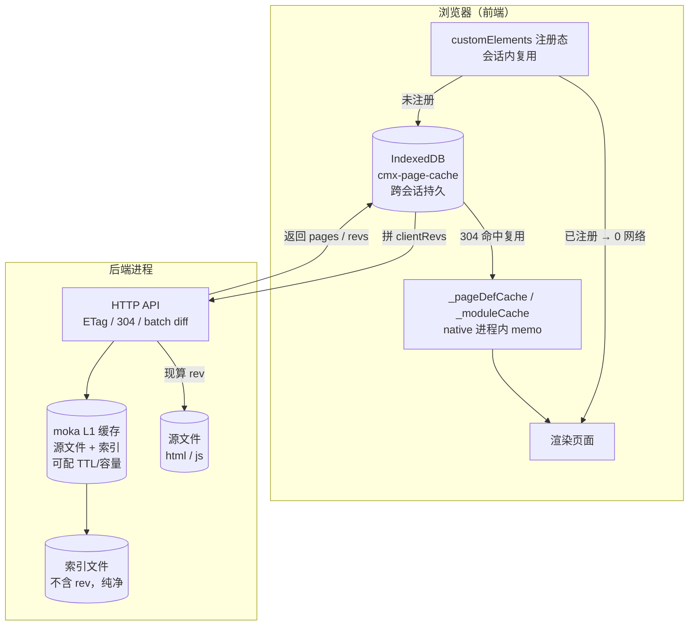
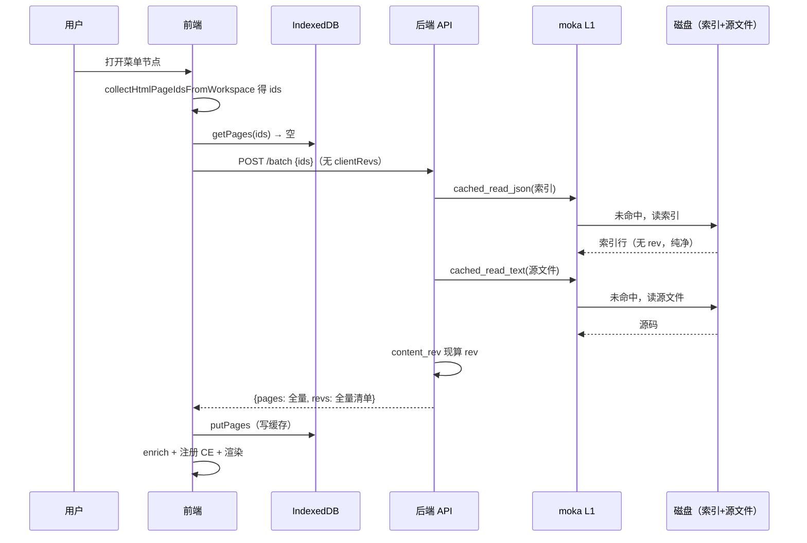
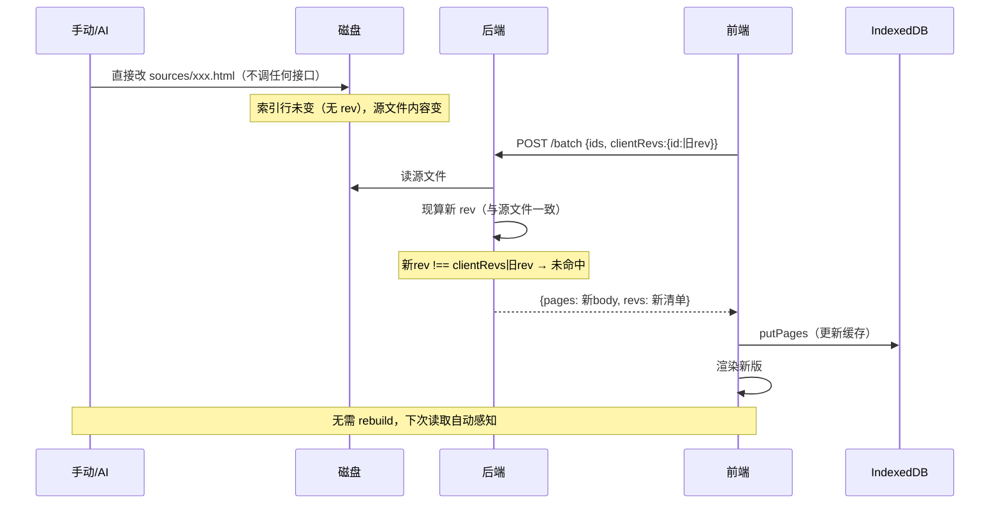
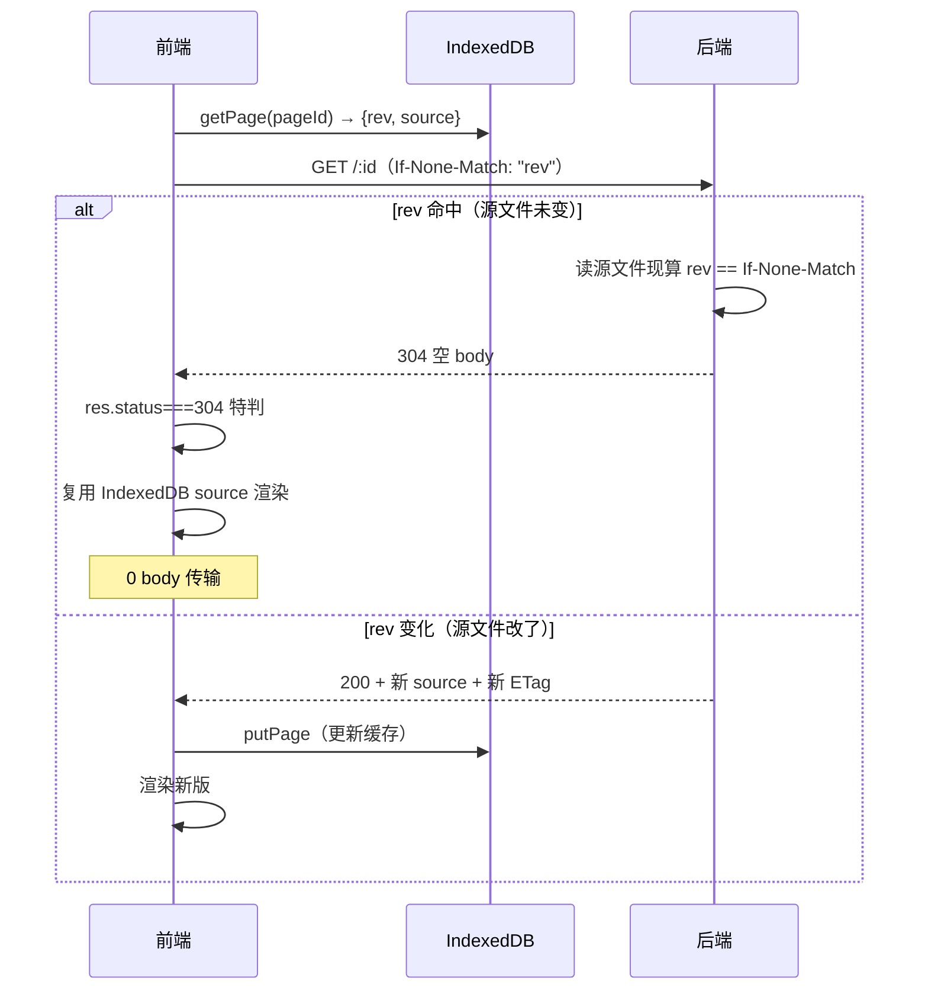
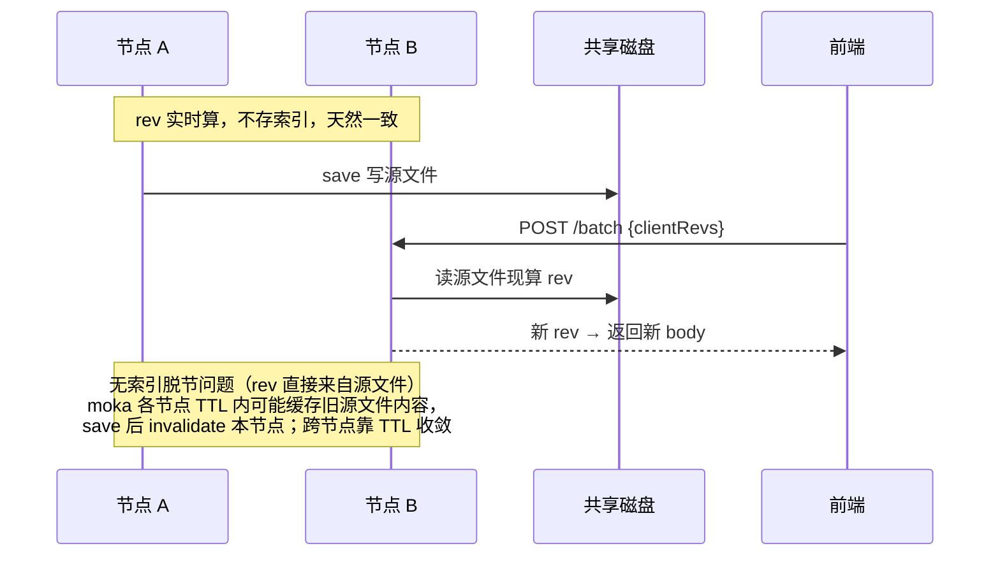

# 页面加载域缓存（前后端实现说明）

> 日期：2026-07-31（2026-08-01 方案2 改造更新）
> 范围：`/api/html-pages/*`、`/api/native-pages/*` 全链路（后端 cmx-container + 前端 CMXPortalManager）
> 关联方案：`20260730_前后端页面加载性能优化方案.md`（本文是其落地实现的说明文档，不含代码，仅函数签名 + 中文说明 + 流程图）

---

## 一、设计主线：rev 实时计算，天然一致

整个缓存体系围绕一个内容版本锚点 **`rev`** 展开。**方案2 的核心：rev 不存索引，读路径实时由源文件内容计算**（xxhash64 → 16 hex），保证 rev 与源文件天然一致，手动/AI 改源文件后下次读取自动感知，无需任何同步操作。

```
读路径读源文件 → 现算 rev → 作 ETag / 与 clientRevs 比对 → 协调 CE 注册
```

### `rev` 的选型

- **算法**：xxhash64 → 截断 16 位 hex
- **性能实测**（release，单核）：10KB=0.95µs / 50KB=3.67µs / 200KB=16.7µs / 1.1MB=76µs，吞吐 10-14 GB/s。相比读盘（100-500µs）可忽略。
- **为何非密码学哈希够用**：CMX 页面缓存属"非安全上下文"——输入受信（服务端算）、无对抗方、碰撞后果轻微（一次刷新即修）。百万页碰撞概率约 0.0000014%。

### 为何选"实时算"而非"存索引"

| 方案 | rev 存储 | 读路径 | 手动改源文件 | 复杂度 |
|---|---|---|---|---|
| ~~存索引~~ | save 时写索引行 | 透传索引 rev（省源文件 I/O） | 需调 rebuild 同步，否则索引脱节返旧页 | 高（需 rebuild/backfill） |
| **实时算（采用）** | 不存，索引纯净 | 读源文件现算 | **天然一致，无需任何操作** | 低（无 rebuild/backfill） |

方案2 的代价：batch diff 命中的 page 也要读源文件算 hash（不能像存索引那样不读源文件就判断）。但 moka 命中时不读盘，xxhash 极快，换来了天然一致性 + 删除 rebuild/backfill 的复杂度。

---

## 二、整体架构



### 三层缓存 + 控制权（关键：分层独立）

| 层 | 位置 | 存什么 | 控制方式 |
|---|---|---|---|
| **moka L1** | 后端进程内 | 源文件文本 + 索引 JSON 解析结果 | `portal.page_cache_enabled` 开关（默认 false） |
| **HTTP ETag/304** | 浏览器↔后端 | 条件请求 | **始终生效**（不依赖 moka，rev 现算） |
| **batch diff** | 浏览器↔后端 | clientRevs 差异同步 | **前端发 clientRevs 即 diff**（不依赖 moka） |
| **IndexedDB** | 浏览器 | `{pageId → {rev, source, relPath, sourceType}}` | 始终启用（配合 ETag/diff） |
| **CE 注册态 / 内存 Map** | 浏览器 | CE 模板 / native 模块 | 会话内 |

> **重要**：moka L1 开关只控制进程内文件缓存（省磁盘 I/O），**不影响** ETag/304 与 batch diff（HTTP 协议层缓存）。两者正交——关 moka 不该误杀浏览器省带宽。rev 实时算不经过 moka，故协议层缓存始终生效。

---

## 三、后端实现

### 3.1 数据地基：rev 实时计算（cmx-portal-base / cmx-form）

rev 不写入索引行（索引保持纯净），读路径读源文件后现算。

| 函数 | 位置 | 说明 |
|---|---|---|
| `content_rev(bytes)` | `cmx-portal-base/src/cache.rs` | xxhash64 → 16 hex |
| `read_full_from_row` / `full_page_from_row` | `cmx-form/pages/{html,native}.rs` | 读源文件后 `content_rev(html.as_bytes())` 现算 rev 放响应 |
| `save_html_page` / `save_native_page` | 同上 | **不再算 rev 写索引**（索引纯净）；只写源文件 + 失效 moka |

**索引行字段**（html）：`id, name, details, domain, app, module, page, doc, relPath, latestHtmlFile`（无 rev）
**索引行字段**（native）：`id, name, details, sourceType, relPath`（无 rev）

### 3.2 进程内 L1 缓存（moka，可配）

| 函数 | 说明 |
|---|---|
| `cached_read_text(path)` | 文本读：开关开→命中 moka 返回/未命中读盘回填；开关关→穿透读盘 |
| `cached_read_json(path)` | JSON 读：同上 |
| `invalidate_path` / `invalidate_paths` / `invalidate_all` | 失效；开关关→空操作 |
| `cache_enabled()` | 读 `portal.page_cache_enabled`（运行时热读） |

**配置**（`[portal]` 段，详见 CONFIG_MANUAL.md）：
- `page_cache_enabled`：开关，默认 false，**运行时热更新**
- `page_cache_ttl_secs`：TTL 秒数，默认 30，**重启生效**
- `page_cache_max_entries`：容量上限，默认 4096，**重启生效**

> TTL/容量是 moka `Cache::builder()` 构建期参数，`L1` 是 `LazyLock` 首次访问时构建一次固定；重建会丢缓存，故改配置需重启。开关是运行时 bool 判断，零成本热更新。

### 3.3 协议层：ETag / 304 / batch diff（始终生效，不依赖 moka）

| 接口 | 行为 |
|---|---|
| `GET /api/html-pages/:id` | 读源文件现算 rev 作 ETag；`If-None-Match` 命中 → 304 空 body |
| `GET /api/native-pages/:id` | 同上 |
| `POST /api/html-pages/batch` | 前端发 clientRevs → 每个 id 读源文件现算 rev 比对，命中省 body；始终返回全量 `revs` 清单 |
| `POST /api/native-pages/batch` | 同上，`MAX_BATCH = 64` |

| 函数 | 说明 |
|---|---|
| `render_with_etag(headers, rev, body)` | `cmx-api/handlers/portal/pages.rs`，单 GET 的 ETag/304 出口。**不受开关控制**（rev 现算不依赖 moka） |
| `get_html_pages_by_ids` / `get_native_pages_by_ids` | batch 差异同步。`diff_mode = !client_revs.is_empty()`（只看前端是否发 clientRevs） |

**batch 请求/响应契约**：

```
POST /api/html-pages/batch
Req:  { ids: [...], clientRevs?: { id → rev } }    // clientRevs 缺省 = 全量
Resp: { pages: [...], revs: { id → rev }, errors: [...] }
       // pages 仅含 clientRevs[id] !== 现算 rev 的 page body；命中省 body 但仍读源文件算 hash
```

### 3.4 已移除：索引重建（rebuild）

方案2 下 rev 实时算，索引与源文件天然一致，**无需 rebuild 接口**。已删除：
- `POST /api/html-pages/rebuild-index`、`POST /api/native-pages/rebuild-index`
- `rebuild_html_index` / `rebuild_native_index` / `collect_*_sources` / `id_from_rel_path`
- `backfill_html_rev` / `backfill_native_rev`（存量回填，不再需要）

手动/AI 改源文件后，下次读取即自动感知变化（rev 现算）。

---

## 四、前端实现（CMXPortalManager）

### 4.1 IndexedDB 持久缓存（`src/lib/page-cache.js`）

| 函数 | 说明 |
|---|---|
| `getPage(pageId)` / `getPages(pageIds)` | 读单个/批量（单事务） |
| `putPage(pageId, {rev, source, relPath, sourceType})` / `putPages` | 写入 + LRU 收敛 |
| `deletePage(pageId)` / `clear()` | bustCache / 全量清 |
| `requestPersistentStorage()` | 启动调一次，防低压淘汰 |

**容量策略**：LRU 上限 500；写前 `estimate()`；捕 `QuotaExceededError` → LRU 淘汰 20% 重试。

### 4.2 html_pages 入口（`workspace-html-pages.js`）

| 函数 | 说明 |
|---|---|
| `fetchHtmlPagesByIdsBatch(ids, options)` | 从 IndexedDB 拼 `clientRevs` → batch 请求 → 变化 page 写回 IndexedDB → **diff 命中的 page 从 IndexedDB 补全进 pages** |
| `prepareWorkspaceHtmlPages(workspace, options)` | CE 注册检测 → 已注册走最小文档（0 网络）/ 未注册走 fetch；`bustCache` 清 IndexedDB |

**关键修复点（diff 命中补全）**：服务端 diff 命中时省略 body，但下游 `applyHtmlPagesBatchToWorkspace` 期望每个视图的 page 都在 pages 里。故命中的 page 必须从 IndexedDB 取 source 补全，否则报"页面未返回或不存在"。

### 4.3 native_pages 入口（`workspace-native-pages.js`）

| 函数 | 说明 |
|---|---|
| `loadNativePageDefWithCache(pageId)` | 查 IndexedDB 拿 rev → 带 `If-None-Match` 请求：304 复用缓存 source / 200 写回 |
| `persistNativePage(pageId, page)` | 写回 IndexedDB（含 sourceType） |
| `_reload({bustCache})` | 清 `_pageDefCache` + `_moduleCache` + IndexedDB |

**304 特判**：304 的 `res.ok === false`（仅 2xx 才 ok），必须按 `res.status === 304` 特判。

---

## 五、端到端时序图

### 5.1 冷启动首次打开（无缓存）



### 5.2 重复打开 / F5 刷新（IndexedDB 有缓存）

```mermaid
sequenceDiagram
    participant F as 前端
    participant IDB as IndexedDB
    participant API as 后端 API
    participant M as moka L1
    participant FS as 磁盘

    F->>F: CE 未注册（F5 后 registry 清空）
    F->>IDB: getPages(ids) → {id→rev}
    F->>API: POST /batch {ids, clientRevs}
    API->>M: cached_read_text(源文件)
    M-->>API: 源码（moka 命中则不读盘）
    API->>API: 现算 rev，与 clientRevs 比对
    Note over API: 命中也要读源文件算 hash（方案2 代价）
    API-->>F: {pages: 空（全命中）, revs: 全量清单}
    Note over F: diff 命中的 page 服务端省略 body
    F->>IDB: getPages(缺失的 ids) 取 source
    F->>F: 补全 pages → enrich + 注册 CE + 渲染
    Note over F: 仅 KB 级 manifest 往返，0 body 传输
```



### 5.3 手动改源文件后读取（方案2 核心优势）



### 5.4 native 页面单 GET（304 路径）



### 5.5 集群多节点一致性



---

## 六、配置项（`[portal]` 段）

| 配置项 | 默认 | 说明 | 生效方式 |
|---|---|---|---|
| `page_cache_enabled` | `false` | moka L1 缓存开关（仅控进程内文件缓存） | 运行时热更新 |
| `page_cache_ttl_secs` | `30` | moka 条目存活秒数 | 重启生效 |
| `page_cache_max_entries` | `4096` | moka 最大条目数（LRU 淘汰） | 重启生效 |

> ETag/304 与 batch diff **不受这些配置控制**，始终生效（rev 实时算不依赖 moka）。

---

## 七、踩坑记录

| 问题 | 根因 | 修复 |
|---|---|---|
| F5 后报"页面未返回或不存在" | diff 命中的 page 服务端省略 body，下游 `byId` 找不到 → 报错 | `fetchHtmlPagesByIdsBatch` 从 IndexedDB 补全命中的 page 进 pages 数组 |
| native 304 被当错误抛 | `res.ok` 仅 2xx 为 true，304 是 false | 按 `res.status === 304` 特判 |
| native 304 sourceType 误判 | 缓存未存 sourceType，靠 relPath 推断，relPath 空时 html 误判 js | 缓存补存 sourceType 字段 |
| ETag 误绑 moka 开关 | 旧假设"rev 存索引读 moka"，方案2 改实时算后两者正交 | `render_with_etag` / batch diff 去掉开关检查，始终生效 |
| moka `invalidate_all` 误用 `.await` | moka 的 `invalidate_all` 是同步方法（返回 `()`） | 去掉 `.await` |
| 右键刷新 tab 后页面零请求、拿旧数据（如 onto-studio 的 /manifest） | 页面定义/模块 promise/IndexedDB 三层缓存 bust 均生效、壳模块也经新 Blob URL 重新求值，但页面把全局单例挂在 `globalThis` 且用 `globalThis.X \|\| {}` 复用——旧 NS 里 `manifest/loaded` 残活，`loadManifest` 增量守卫判"已装载"直接跳过 | 页面壳契约（20260915，onto/studio.js）：**模块重求值 = 页面实例重置**，壳无条件 `globalThis.__ontoStudio = { __init: [] }` 新建 NS，禁止 `\|\|` 复用；跨求值持久化走 sessionStorage。其它 native JS 模块页若挂全局单例须遵循同一契约，否则刷新后必拿旧数据 |

---

## 八、文件清单

**后端 cmx-container（独立子仓库）**
- `cmx-portal-base/src/cache.rs` — moka L1 + `content_rev` + invalidate 系列 + 开关 + 可配 TTL/容量
- `cmx-form/src/pages/html.rs` — rev 实时算、batch diff、save 不写 rev
- `cmx-form/src/pages/native.rs` — 同上
- `cmx-api/src/handlers/portal/pages.rs` — ETag/304 handler（不受开关控制）

**前端 CMXPortalManager（随根仓库）**
- `src/lib/page-cache.js` — IndexedDB store + LRU + persist
- `src/lib/workspace-html-pages.js` — batch clientRevs + diff 补全 + bustCache
- `src/lib/workspace-native-pages.js` — 304 路径 + sourceType 缓存 + bustCache
