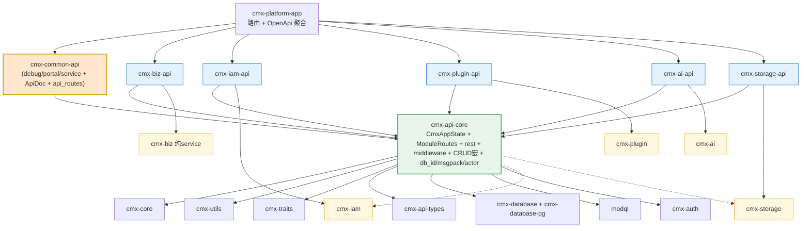

# cmx-api 依赖与 Handler 重构完整方案

> 状态：**✅ 已实施（落地记录）** · 分支：`refactor/cmx-api-core-split`（cmx-container 仓库）
> 关联：[依赖评估](./20260811_cmx-container_crate依赖关系图与编译优化评估.md) · [Handler 迁移评估](./20260811_cmx-api_handler迁移评估.md)
> 本文原为重构方案草案（经 3+1 轮子智能体审查），重构完成后更新为**实际落地记录**：标注与原计划的偏差、最终架构、提交链。

---

## 一、背景与目标

### 1.1 问题
`cmx-container`（58 crate）两大交织瓶颈：
1. **`cmx-api` 上帝中枢**：直接依赖 17 内部 crate，被 8 个 `*-api` + platform-app 依赖。改 `cmx-biz`/`cmx-iam` 一行 → 雪崩重编。
2. **18 组 handler 全堆 cmx-api**，而 rpt/doc/dct/mdm/job/flow/model/code 八域早已独立成各自 `*-api` crate。

### 1.2 目标与实际达成

| 目标 | 衡量标准 | 达成 |
|------|---------|------|
| 切断雪崩重编链 | 改 `cmx-biz` 一行，8 个 `*-api` 不重编 | ✅ cmx-api-core 对 cmx-biz **零依赖**（validation 移至 cmx-biz::errcode），8 个旧 `*-api` 已切 cmx-api-core |
| handler 归域、瘦身 | 13 组迁出 | ✅ **15 组迁出**（含 module 拆为 CRUD+包两半）；cmx-common-api 仅留 debug/portal/service |
| 不破坏下游 | portalservice/flowengine 编译通过 | ✅ 三 workspace `cargo check` + `cargo clippy` 全绿，0 error |
| 架构一致 | 薄 `*-api` crate 模式 | ✅ 8 旧 + 5 新 = 13 域 api crate 统一模式 |

### 1.3 非目标（本轮不做）
- ❌ DB 双门面 `cmx-database`/`cmx-database-pg` 收敛
- ❌ `cmx-biz` 内部职责拆分
- ❌ `cmx-api-types → cmx-database` 泄漏
- ❌ trait 下沉（IamChecker/StorageService → cmx-traits）——阶段 4 可选项，未做

---

## 二、最终架构

### 2.1 目录结构（实际落地）

```
cmx-container/crates/libs/
  cmx-apis/                    # ★ 整个 api 层集中（8 crate）
    cmx-api-types/             # 基础：DTO / ApiResp / Error
    cmx-api-core/              # 基础：CmxAppState / ModuleRoutes / rest / middleware / CRUD 宏 / db_id / msgpack / actor
    cmx-common-api/            # 装配中枢（原 cmx-api）：debug/portal/service handler + 主 ApiDoc + api_routes + core re-export
    cmx-biz-api/               # 域：domain/application/menu/sys_datasource/form + module CRUD
    cmx-iam-api/               # 域：iam + auth
    cmx-plugin-api/            # 域：marketplace/plugin/table_metadata + module 包
    cmx-ai-api/                # 域：ai 中继
    cmx-storage-api/           # 域：文件存储
```

> **命名演变**：原分组目录 `cmx-domain-api`（模糊）→ `cmx-apis`；原 `cmx-api` 瘦身 crate（已非唯一 api）→ `cmx-common-api`；3 个基础 crate 从顶层移入 `cmx-apis/` 集中。

### 2.2 依赖拓扑（重构后）



**关键性质**：
- 服务 crate（biz/iam/plugin/ai/storage）**零反向依赖** cmx-api-core → Strategy 2 全程无环（grep 实测核实）。
- **cmx-api-core 对 cmx-biz 零依赖**（`validation_fail_resp` 下沉到 cmx-biz::errcode）→ 改 cmx-biz 不触发 8 个旧 `*-api` 重编。
- cmx-api-core 过渡期仍依赖 cmx-iam（IamState）/ cmx-storage（storage_service），但服务 crate 不依赖 core，故**单向边不成环**。完全切断属可选阶段 4（trait 下沉）。
- `api_routes()` + 主 `ApiDoc` 在 cmx-common-api；各域 ApiDoc 切片由 platform-app `OpenApi::merge()` 聚合。

### 2.3 cmx-api-core 实际依赖表面

| 依赖 | 用途 |
|------|------|
| cmx-core / cmx-utils / cmx-traits / cmx-api-types | 基础（ApiResp/Error/Result re-export 自 api-types，使 CRUD 宏 `$crate::Error` 零改动） |
| cmx-database / cmx-database-pg / modql | rest/handler 通用 CRUD + db_id 库路由回退 |
| cmx-auth | mw_auth（OAuth2Policy/Registry 具体类型） |
| cmx-iam（过渡） | IamState（含具体 struct `IamChecker`） |
| cmx-storage（过渡） | `storage_service: Arc<dyn StorageService>` 字段 |
| axum / tower-http / serde / serde_json / tracing / chrono / regex / utoipa / rmp | web + msgpack 信封 |

> 迁入的骨架模块：`app_state` / `routes/{traits,macros}` / `rest/{handler,header_parse}` / `middleware/*` / `db_id` / `msgpack` / `actor`。`FromRef<CmxAppState> for cmx_storage::handler::AppState` 随 CmxAppState 下沉 core（孤儿规则）。

---

## 三、阶段实施记录（实际落地）

| 阶段 | 内容 | Commit |
|------|------|--------|
| **0** | 拆 cmx-api-core（骨架下沉 + 宏 re-export + FromRef 孤儿修复） | `2657bdad` |
| **2a** | cmx-storage-api（StorageModule 迁出，验证 pipeline） | `2657bdad` |
| **2b** | cmx-ai-api（handler + AiApiDoc + platform-app OpenApi::merge 基建） | `2657bdad` |
| **2c** | cmx-biz-api（domain/application/menu/sys_datasource/form + crud_handlers） | `2657bdad` |
| **2d** | cmx-plugin-api（marketplace/plugin/table_metadata） | `2657bdad` |
| **2e** | cmx-iam-api（iam + auth + IamApiDoc） | `2657bdad` |
| **3-1** | 8 旧 `*-api` 切 cmx-api-core + db_id/msgpack/actor 下沉 core + validation_fail_resp 下沉 cmx-biz | `a0dd7539` |
| **3-2** | module 拆分（CRUD→cmx-biz-api，包→cmx-plugin-api） | `f65cac2a` |
| **3-3** | dev handler feature gate（集群无状态） | `4774460b` |
| **整理** | 目录重组 cmx-domain-api→cmx-apis，cmx-api→cmx-common-api | `3afa882d` |
| **整理** | 三基础 crate（core/types/common-api）移入 cmx-apis/ | `7c8a6236` |
| **补迁** | storage Swagger 切片（阶段 2a 遗留补齐）→ cmx-storage-api StorageApiDoc | `ce435062` |
| **clippy** | 修重构引入的多余 let 绑定，全量 clippy 收尾 | `eb0ca560` |

> 原 OpenAPI 阶段 1（路径按域切片）未单独成阶段，而是**随每个域迁移时一并处理**（每域自带 ApiDoc 切片，platform-app merge）。这是对原计划的微调——比先切片再迁更增量、风险更低。

---

## 四、Handler 最终归宿（实际）

| handler | 最终位置 | ApiDoc |
|---------|---------|--------|
| storage | **cmx-storage-api**（StorageModule） | StorageApiDoc |
| ai | **cmx-ai-api**（AiModule） | AiApiDoc |
| domain / application / menu / sys_datasource / form | **cmx-biz-api** | BizApiDoc |
| module CRUD（handler.rs） | **cmx-biz-api**（ModuleCrudModule） | BizApiDoc |
| module 包（package_handler.rs） | **cmx-plugin-api**（ModulePackageModule） | PluginApiDoc |
| marketplace / plugin / table_metadata | **cmx-plugin-api** | PluginApiDoc |
| iam / auth | **cmx-iam-api** | IamApiDoc |
| service | 留 **cmx-common-api**（平台通用层，cmx_traits） | 主 ApiDoc |
| debug | 留 **cmx-common-api** | 主 ApiDoc |
| portal | 留 **cmx-common-api**（无 utoipa，外部 ws） | — |
| dev | **cmx-common-api** 内 `#[cfg(feature="dev-tools")]` feature gate | —（gate 掉） |

**迁出 15 组（含 module 拆分），留 cmx-common-api 4 组**（debug/portal/service + dev-gated）。

---

## 五、实际验证

- **编译门**：cmx-container / cmx-portalservice / cmx-flowengine 三 workspace `cargo check` 全绿。
- **clippy**：三 workspace `cargo clippy` **0 error**；重构引入的 1 个警告（routes_impl 多余 let 绑定）已修；其余为既有代码风格警告（if-collapse / doc 缩进 / cast 等，非本次引入）。
- **无 unused_import**：批量 sed 改写后无遗留未用导入。
- **雪崩切断确认**：`grep cmx-biz cmx-api-core/Cargo.toml` = 0（core 对 cmx-biz 零依赖）。
- **向后兼容**：cmx-common-api re-export cmx-api-core，`cmx_common_api::CmxAppState / ModuleRoutes` 等路径仍可用；下游零代码改动。

---

## 六、与原计划的偏差

| 项 | 原计划 | 实际 |
|----|--------|------|
| 目录命名 | 顶层平铺 `crates/libs/cmx-biz-api/` 等 | 集中到 `crates/libs/cmx-apis/`（含 3 基础 crate），更符合既有域目录惯例 |
| 原 cmx-api crate | 保持原名 | 改名 **cmx-common-api**（已非唯一 api crate，腾语义空间） |
| OpenAPI 阶段 1 | 独立阶段，先全量切片再迁 | 取消独立阶段，**随域迁移增量切片**（每域自带 ApiDoc），更低风险 |
| module 拆分 | 阶段 2c/2d 各做一半 | 阶段 3-2 统一拆完（CRUD→biz-api，包→plugin-api） |
| portal 迁出 | 标注"可迁出（外部 ws）" | **未迁**，留 cmx-common-api（portal 无 utoipa，外部 ws 迁移收益小） |
| `api_routes()` 上移 platform-app | 阶段 3 做 | **未做**（可选，无编译收益，仅净化装配根） |
| storage Swagger | 阶段 2a 暂留、阶段 3 整理 | 阶段 3 漏了，**补迁修复**（`ce435062`） |

---

## 七、待办（可选，低优先级）

- **`api_routes()` 上移 platform-app**：让 cmx-common-api 彻底变纯 handler+openapi 库。无编译/架构收益（雪崩已切断），仅净化单一装配根。
- **trait 下沉（阶段 4）**：`IamState`（含 `IamChecker` 具体 struct）+ `StorageService` trait → cmx-traits，让 cmx-api-core 摆脱过渡期 cmx-iam/cmx-storage 依赖，使"改 cmx-iam/auth/storage 不触发 8 个 *-api 重编"。纯编译优化，不阻断正确性。

---

## 附录：审查历程（浓缩）

本文档前身是重构方案草案，经 **3 路并行子智能体一审 + 1 路二审**驱动修订：
- **一审发现 4 个阻断性遗漏**：①OpenAPI 163 路径硬编码（迁 handler 会编译失败）②cmx-api-core 非"轻 core"（拉 database/auth/iam/storage）③CRUD 宏 `$crate::Error` 断裂④197 处 `Error::` 批改。
- **一审推翻 3 处误判**：module 可拆（非"不可分割"）、portal 可迁、dev 集群违规漏判。
- **核心决策**：从"迁入服务 crate"改为**新建薄 `*-api` crate（Strategy 2）**——服务 crate 零反向依赖 core，无环，溶解最难的 trait 下沉。
- **二审补丁**：宏改 re-export（零改）、路径基准 163、新 crate 放置路径、dev OpenApi 同 gate、`OpenApi::merge` schema 静默丢弃断言。

详细审查报告见会话记录。二审结论：架构无阻断，Strategy 2 无环主张经全边核实成立。
