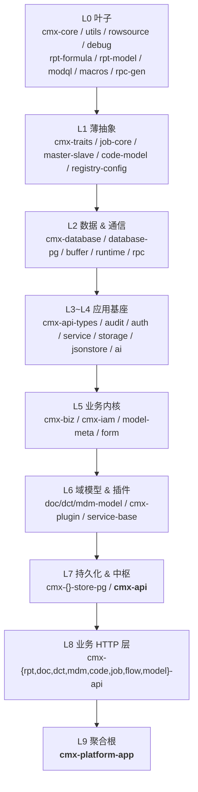
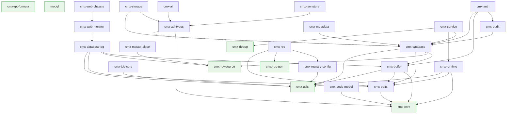
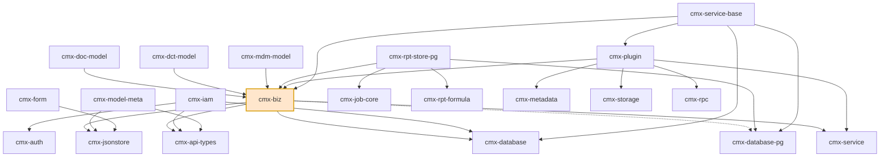

# cmx-container Crate 依赖关系图与编译优化评估

> 范围：`cmx-container/crates/` 下全部 workspace 成员 crate（共 **58 个**，已排除被注释掉的 `cmx-nacos` / `cmx-wasmdemo`）。
> 数据来源：各 crate 的 `Cargo.toml` `[dependencies]` 段（截至 2026-08-11，分支 `dev`）。
> 目标：梳理内部依赖拓扑 → 评估合理性 → 给出编译提速优化建议。

---

## 一、总体规模

| 指标 | 数值 |
| --- | --- |
| Workspace 成员 crate 总数 | 58（含 `modql` / `modql-macros` / `sdk/cmx-cli`） |
| 其中 `crates/libs/` 下库 crate | 56 |
| `crates/tests/` 测试 crate | 1（`cmx-database-test`） |
| `sdk/` CLI | 1（`cmx-cli`，仅 dev-binary，非运行时图） |
| 零内部依赖的叶子 crate | 10 |
| 跨 workspace 路径引用（外部 crate） | 2（`cmx-flow-app`→`cmx-flowengine`、`cmx-portal`→`cmx-portalservice`） |

> 本图只画 **内部 crate → 内部 crate** 的依赖；`cmx-flow-app` / `cmx-portal` 作为外部节点标灰，不展开其内部边。

---

## 二、依赖关系图（Mermaid）

> 全图 58 节点 + ~200 条边，单张图多数渲染器（GitHub / VSCode 预览）会超时。已拆为 5 张：
> **图 1** 分层总览 · **图 2** 基础设施层（L0~L4）· **图 3** 业务内核与域模型（L5~L6）· **图 4** 持久化 + 中枢 + HTTP（L7~L8）· **图 5** 聚合根。
>
> 约定：箭头 `A --> B` 表示 **A 依赖 B**（A 在上层）；🟧 橙色 = 高扇入/扇出瓶颈节点；⬜ 灰色虚线 = 跨 workspace 外部 crate。

### 图 1 ｜ 分层架构总览（L0 → L9）



### 图 2 ｜ 基础设施层（L0~L4）完整依赖



> 图例：🟩 绿色 = 零内部依赖叶子；虚线 `-.->` = 值得关注的重/可疑依赖（`api-types→database` 把 DB 栈泄漏给所有下游；`web-monitor→database-pg` 与"保持轻"自述矛盾）。

### 图 3 ｜ 业务内核与域模型（L5~L6）



> 图例：🟧 橙色 = 高扇入/扇出瓶颈节点（`cmx-biz`）；虚线 `biz -.-> database-pg` 表示与 `cmx-database` **并存的双 DB 门面依赖**（未完成迁移，详见 §四-问题 3）。

### 图 4 ｜ 持久化 + 中枢 + HTTP 层（L7~L8）

```mermaid
graph TD
    api["cmx-api 中枢"]:::hub
    api --> biz[cmx-biz] & iam[cmx-iam] & plugin[cmx-plugin] & auth[cmx-auth]
    api --> storage[cmx-storage] & metadata[cmx-metadata] & service[cmx-service] & rpc[cmx-rpc]
    api --> ai[cmx-ai]
    api --> portal["cmx-portal（外部）"]:::ext

    docstorepg[cmx-doc-store-pg] --> docmodel[cmx-doc-model] & masterslave[cmx-master-slave]
    dctstorepg[cmx-dct-store-pg] --> dctmodel[cmx-dct-model] & masterslave
    mdmstorepg[cmx-mdm-store-pg] --> mdmmodel[cmx-mdm-model] & dctstorepg
    jobstorepg[cmx-job-store-pg] --> jobcore[cmx-job-core]
    docstorepg & dctstorepg & mdmstorepg & jobstorepg --> dbpg[cmx-database-pg]

    rptapi[cmx-rpt-api] --> api
    docapi[cmx-doc-api] --> api & docstorepg
    dctapi[cmx-dct-api] --> api & dctstorepg
    mdmapi[cmx-mdm-api] --> api & mdmstorepg
    codeapi[cmx-code-api] --> api & codemodel[cmx-code-model]
    jobapi[cmx-job-api] --> api & jobstorepg
    flowapi[cmx-flow-api] --> api & flowapp["cmx-flow-app（外部）"]:::ext
    modelapi[cmx-model-api] --> api & modeldeploy[cmx-model-deploy]

    classDef hub fill:#ffe6cc,stroke:#d79b00,stroke-width:2px;
    classDef ext fill:#eee,stroke:#999,stroke-dasharray: 5 5;
```



### 图 5 ｜ 聚合根 cmx-platform-app

```mermaid
graph TD
    platform["cmx-platform-app<br/>聚合根"]:::root
    platform --> api[cmx-api] & servicebase[cmx-service-base]
    platform --> rptapi[cmx-rpt-api] & docapi[cmx-doc-api] & dctapi[cmx-dct-api]
    platform --> mdmapi[cmx-mdm-api] & codeapi[cmx-code-api] & jobapi[cmx-job-api]
    platform --> flowapi[cmx-flow-api] & modelapi[cmx-model-api]
    platform --> iam[cmx-iam] & plugin[cmx-plugin] & rpc[cmx-rpc] & storage[cmx-storage]
    platform --> webchassis[cmx-web-chassis] & webmonitor[cmx-web-monitor] & regconfig[cmx-registry-config]

    classDef root fill:#ffe6cc,stroke:#d79b00,stroke-width:3px;
```



> `cmx-plugin-demo → cmx-plugin-sdk → cmx-core`、`cmx-database-test → {cmx-database, cmx-database-pg, cmx-rowsource}` 为独立测试/demo 支线，未影响主依赖链，此处从略。

---

## 三、分层结构总览

| 层 | 职责 | 代表 crate |
| --- | --- | --- |
| **L0 叶子** | 零内部依赖的基石 | `cmx-core` / `cmx-utils` / `cmx-rowsource` / `cmx-debug` / `cmx-rpt-formula` / `modql` 等 |
| **L1** | 单层薄抽象 | `cmx-traits` / `cmx-job-core` / `cmx-master-slave` / `cmx-code-model` |
| **L2 数据/通信** | DB 门面 / RPC | `cmx-database` / `cmx-database-pg` / `cmx-buffer` / `cmx-runtime` / `cmx-rpc` |
| **L3~L4 应用基座** | API 类型、认证、审计、存储 | `cmx-api-types` / `cmx-audit` / `cmx-auth` / `cmx-storage` / `cmx-service` |
| **L5 业务内核** | 业务逻辑、IAM、门户基础设施 | `cmx-biz` / `cmx-iam` / `cmx-jsonstore` / `cmx-model-meta` |
| **L6 域模型 / 插件** | 各域 DB-free 模型 + 插件平台 | `cmx-doc/dct/mdm-model` / `cmx-plugin` / `cmx-service-base` |
| **L7 持久化 / 中枢** | PG store 层 + `cmx-api` 中枢 | `cmx-*-store-pg` / **`cmx-api`** |
| **L8 业务 HTTP** | 各域薄 handler + 路由 | `cmx-rpt/doc/dct/mdm/code/job/flow/model-api` |
| **L9 聚合根** | 服务组装入口（主应用经它拉起所有模块） | **`cmx-platform-app`** |

### 域内三段式（正面设计）

`cmx-rpt` / `cmx-doc` / `cmx-dct` / `cmx-mdm` / `cmx-job` 五个业务域都遵循 **model → store-pg → api** 的三段分层，这是本仓库最清晰的架构模式：

```
cmx-xxx-model   (DTO / 纯逻辑，声称 DB-free)
     ↓
cmx-xxx-store-pg (PG 持久化 + 服务层)
     ↓
cmx-xxx-api      (薄 HTTP handler + Module 路由)
```

注释明确说明 `*-api` 走 `cmx-api` 而非直接被 `cmx-api` 反向依赖，是为了「避免 `cmx-api ⇄ cmx-xxx` 环」。这个动机合理。

---

## 四、依赖合理性评估

### ✅ 做得好的地方

1. **叶子基石干净**：`cmx-core` / `cmx-utils` / `cmx-rowsource` 零内部依赖，可独立快速编译。
2. **域内三段式一致**：rpt/doc/dct/mdm/job 结构规整，新域可复制。
3. **跨 workspace 边界清晰**：`cmx-flow-api` / `cmx-api→cmx-portal` 用 path 引用隔离外部 workspace，本图不污染。
4. **无环依赖**：全图是有向无环图（DAG），分层方向单一。
5. **modql / cmx-macros 独立**：过程宏与查询 DSL 自成一体，不卷入业务依赖。

### ⚠️ 主要问题（按对编译速度影响排序）

#### 问题 1：`cmx-api` 是上帝中枢 —— 最大的编译放大器

`cmx-api` 直接依赖 **17 个内部 crate**（`cmx-ai/auth/biz/iam/plugin/metadata/storage/service/debug/buffer/database/database-pg/rpc/...` + 外部 `cmx-portal`），而它又被 **8 个 `*-api` 模块** + `cmx-platform-app` 依赖。

```
cmx-iam ─┐
cmx-biz ─┤
cmx-plugin ─┼──► cmx-api ──► {cmx-rpt-api, cmx-doc-api, cmx-dct-api,
cmx-auth ─┤                 cmx-mdm-api, cmx-code-api, cmx-job-api,
cmx-... ─┘                  cmx-flow-api, cmx-model-api} ──► cmx-platform-app
```

**后果**：`cmx-iam` 或 `cmx-biz` 改一行 → `cmx-api` 重编 → 全部 8 个 `*-api` + `platform-app` 雪崩重编。这是当前最大的"改动一行，等待数分钟"根源。

#### 问题 2："DB-free" 的域模型实际并不 DB-free

`cmx-doc-model` / `cmx-dct-model` / `cmx-mdm-model` 注释自述「DB-free」，但三者都 **依赖 `cmx-biz`**，而 `cmx-biz` 依赖 `cmx-database` + `cmx-database-pg` + `cmx-service`：

```
cmx-doc-model ─► cmx-biz ─► {cmx-database, cmx-database-pg, cmx-service, ...}
```

**后果**：只想用 DTO/纯逻辑的下游（如测试、文档生成、未来前端类型导出）会被迫拉起整套 DB 栈，违背分层意图，也增加这些 model crate 的编译时间。

#### 问题 3：`cmx-database` 与 `cmx-database-pg` 双重依赖

**6 个 crate 同时依赖两个 DB 门面**：`cmx-biz` / `cmx-api` / `cmx-doc-store-pg` / `cmx-doc-api` / `cmx-service-base` / `cmx-platform-app`。

注释说明 `cmx-database-pg` 是「tokio-postgres 零拷贝新链路」，与基于 sqlx 的 `cmx-database` 并存——这是一次**未完成迁移**的中间态。

**后果**：每个这类 crate 既要编译 sqlx 类型族，又要编译 tokio-postgres/deadpool 类型族，两套 `FromSql`/错误/连接管理都进依赖图，明显拖慢编译。

#### 问题 4：`cmx-api-types → cmx-database` 把轻量 DTO 变重

`cmx-api-types` 名义是「API 通用类型」，却是 `cmx-jsonstore` / `cmx-storage` / `cmx-ai` / `cmx-model-meta` / 各 `*-store-pg` 等**众多上层 crate 的依赖入口**。它依赖 `cmx-database`（仅注释写"数据库错误转换"），于是：

```
cmx-jsonstore / cmx-ai / cmx-model-meta ─► cmx-api-types ─► cmx-database ─► {buffer, rowsource, traits, ...}
```

**后果**：一个本该极轻的共享类型 crate，把整个 DB 栈泄漏给所有下游。

#### 问题 5：`cmx-web-monitor → cmx-database-pg` 与"刻意保持轻"自述矛盾

该 crate 注释写「依赖刻意保持轻：不依赖 cmx-web-chassis、不依赖 cmx-api/平台」，却直接依赖 `cmx-database-pg`（仅为取连接池状态 `pool_statuses()`）。这把 PG 驱动 + `cmx-buffer/rowsource/traits` 全拉进监控 crate。

#### 问题 6：`cmx-biz` 职责过载

`cmx-biz` 同时承担：业务模型 + DB 访问 + 服务编排（`cmx-service`）+ 门户基础设施（`cmx-jsonstore`）+ ZIP 解压（`PluginDataImporterImpl`）+ DAM 资产文件搬移（`tokio::fs`）。它是图中最重的非 api crate，且高居 L5，下游 6+ crate 受其牵连。

---

## 五、编译提速优化建议（按收益/成本排序）

### 🥇 P0 — 拆分 `cmx-api` 中枢（收益最大）

把 `cmx-api` 拆为两层，把"被 8 个 `*-api` 共享的稳定骨架"从"易变的业务聚合"中隔离：

```
cmx-api-core   ← 路由组装 trait、统一 Error/Result、Module 注册机制、共享中间件
                  （仅依赖 cmx-core / cmx-api-types / cmx-utils，≈ 当前 1/5 体量）
     ↑
cmx-api        ← 仍聚合 iam/plugin/biz/... 业务路由（体积不变，但下游不再直接依赖它）
```

**改造点**：让 8 个 `cmx-*-api` 改为依赖 `cmx-api-core` 而非 `cmx-api`；只有 `cmx-platform-app` 依赖 `cmx-api` 做最终聚合。

**收益**：`cmx-biz`/`cmx-iam` 改动不再触发 8 个 `*-api` 全量重编，只重编 `cmx-api` 与 `platform-app`。增量编译时间预计可降 **30%~50%**。

### 🥈 P1 — 让"DB-free 模型"真正 DB-free

把 `cmx-biz` 拆为 `cmx-biz-core`（纯 DTO/领域类型，仅依赖 `cmx-api-types`/`cmx-core`/`cmx-utils`）与 `cmx-biz`（DB/service 实现）：

```
cmx-doc-model / cmx-dct-model / cmx-mdm-model  ──改──► cmx-biz-core （不再拉 DB 栈）
```

**收益**：三个 model crate 编译时间骤降；下游测试/工具/类型导出不再背 DB 包；同时为 P0 减压（`cmx-biz-core` 比 `cmx-biz` 稳定得多）。

### 🥉 P2 — 收敛 DB 双门面，完成 sqlx→tokio-postgres 迁移

确认 `cmx-database-pg` 是目标终态后，逐 crate 把 `cmx-database` 依赖迁到 `cmx-database-pg`（或反向，择一）。6 个双依赖 crate 每消减一个，就少编译一套 sqlx **或** tokio-postgres 类型族。

若短期无法收口，至少**不要在同一个 crate 内同时用两条链路**（`cmx-doc-store-pg` / `cmx-doc-api` 当前就是 `database` + `database-pg` 并存）。

**收益**：DB 相关 crate 编译时间下降明显（sqlx 宏 + 类型推导是大头）；也消除两套错误类型互转的维护负担。

### P3 — 解耦 `cmx-api-types` 与 `cmx-database`

`cmx-api-types` 只为「数据库错误转换」依赖整个 `cmx-database`。两条路任选：

- **方案 A**：在 `cmx-api-types` 里定义自己的轻量 `DbError` 枚举，由 `cmx-database` 实现 `From` 转入（依赖方向反转，`cmx-database → cmx-api-types` 已存在，不增环）。
- **方案 B**：把需要 DB 错误的那几个类型移到 `cmx-database` 自身，`cmx-api-types` 保持纯 DTO。

**收益**：`cmx-jsonstore`/`cmx-storage`/`cmx-ai`/`cmx-model-meta` 及所有 `*-store-pg` 不再经 `api-types` 拉起 DB 栈。

### P4 — `cmx-web-monitor` 用 trait 解耦 PG 驱动

定义 `PoolStatusProvider` trait（返回 `Vec<PoolStatus>`），`cmx-web-monitor` 只依赖该 trait；由 `cmx-database-pg`（或在 `platform-app` 装配处）实现并注入。

**收益**：监控 crate 回归"刻意保持轻"的初衷，可被任意 chassis 服务复用而不绑定 PG。

### P5 — 开发态 profile 微调（零代码改动）

当前 `Cargo.toml`：`debug = 2`（完整调试信息）、`codegen-units = 256`、`incremental = true`。可考虑：

- **`debug = 1`**（仅行号表）：链接时间显著下降，backtrace 仍有行号；需逐变量调试时临时调回 2。
- **`codegen-units = 256`** 已偏激进，保持即可。
- 可对**重灾 crate**（`cmx-biz`/`cmx-api`/`cmx-platform-app`）单独配 `[profile.dev.package.cmx-biz] opt-level = 1`——开发期轻微优化能让这些巨型 crate 的依赖编译更快（依赖图深处只编一次，收益可观）。

### P6 — 工具链层

- `cargo nextest` 替代 `cargo test`：并行度更高，CI/本地测试快 2~3 倍。
- `sccache` 或 `mold`/`lld` 链接器：后者对大 workspace 链接阶段提速尤其明显（`cmx-platform-app` 链接耗时占比高）。
- `cargo binstall` + 预编译的 `sqlx`/`wasmtime` 等重依赖绕过源码编译（若有私有 registry 缓存）。

---

## 六、优化路线图建议

| 阶段 | 动作 | 风险 | 预期增量编译提速 |
| --- | --- | --- | --- |
| **S0**（零成本） | P5 profile 微调 + P6 工具链 | 低 | 10%~15% |
| **S1** | P3 解耦 `api-types ⇏ database` + P4 monitor 解耦 | 中（接口调整） | 10%~20% |
| **S2** | P1 拆 `cmx-biz-core`，三个 model 改依赖 | 中（动 biz） | 15%~25% |
| **S3** | P0 拆 `cmx-api-core`，8 个 `*-api` 改依赖 | 中高（中枢重构，需回归测试） | 30%~50% |
| **S4**（长期） | P2 收敛 DB 双门面 | 高（涉及 SQL 执行路径） | 视收口范围 |

> 顺序建议：S0 立即做；S1/S2 可并行，互不阻塞；S3 在 S1/S2 降压后再做更安全；S4 作为持续迁移。

---

## 七、附：依赖统计速查（入度/出度 Top）

**出度最高（依赖最多，最该减肥）：**

| crate | 直接内部依赖数 |
| --- | --- |
| `cmx-platform-app` | 31 |
| `cmx-api` | 17（+1 外部） |
| `cmx-plugin` | 12 |
| `cmx-service-base` | 13 |
| `cmx-biz` | 8 |

**入度最高（被依赖最多，改动影响面最大）：**

| crate | 被多少 crate 直接依赖 |
| --- | --- |
| `cmx-core` | ~30 |
| `cmx-utils` | ~26 |
| `cmx-traits` | ~16 |
| `cmx-api` | 9（8 个 `*-api` + `platform-app`） |
| `cmx-api-types` | 11 |
| `cmx-biz` | 8 |

> `cmx-api` 出度 17 + 入度 9，是图中当之无愧的「瓶颈节点」——拆分它的收益最高。
