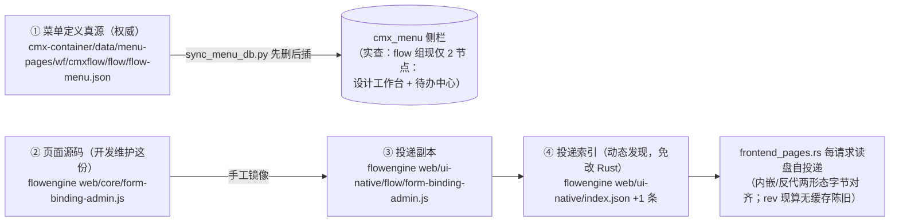

# cmx-flowengine 表单注册表维护页面方案

> 建档：2026-08-19 ｜ 修订：v2（2026-08-19，经子智能体审查后修正——菜单注册链权威源、seed 影响面、删除确认交互、设计工作台交叉覆盖等 9 项，详见文末「审查修订记录」）
> 对应债务：`documents/技术债/20260817_流程引擎_已知问题与技术债务.md` **002 号**（推荐演进方案 A 的落地细化；002 已实施，衍生债 seed 复位见 014）
>
> 一句话：为 `cmx_flow_form_binding`（F4 表单注册表）补一个**三区管理页**（对标身份管理工作台），挂门户「流程管理」菜单组；后端补**一个删除接口**并对保存接口加 kind 校验，彻底解决"接新表单只能改 seed 代码或手写 SQL"的问题。

---

## 一、背景与目标

### 1.1 现状问题（002 号债务，代码事实）

| 接口 | 能力 | 前端消费 |
|---|---|---|
| `GET /api/flow/forms` | 列表 | **零消费** |
| `POST /api/flow/forms` | upsert（form_key 冲突**整行**更新） | 仅设计工作台自动写 workspace 一种 kind |
| `GET /api/flow/forms/{key}` | 单条查询 | 待办中心打开任务时解析 |

- 没有 binding 列表页、没有新建/编辑表单；
- html / native 类绑定只能改 `biz_link.rs::seed_form_bindings()` 重编译，或手写 SQL；
- 运行期纠错（绑错 formKey、改 `console`/`pk_field`/`biz_table`）只能进库改。

### 1.2 目标

1. 门户「流程管理」菜单新增**表单注册表**管理页：列表 + 新建 + 编辑 + 删除，覆盖全部 kind（workspace / html / native）；
2. 后端**零新表、零字段变更**：新增删除端点 + 保存接口补 kind 枚举校验；
3. 页面风格与流程组既有页面一致（identity-workbench 同款骨架），不新增页面依赖。

---

## 二、页面与菜单注册链全景（先看懂链路，再动手）

> ⚠️ v2 修正：**权威链与档案链必须分清**——本节经代码与数据库实查核验（详见文末审查记录 R1）。

### 2.1 生效链（改这里才有效果）



**权威语义**（menu-generator 技能铁律）：门户侧栏只认 `cmx_menu`；`cmx-container/data/menu-pages/` 下的 JSON 是定义真源；`sync_menu_db.py`（位于 `.agents/skills/menu-generator/`）只认 `data/menu-pages/` 下的路径，且策略是**先 DELETE 该 domain/app/module 全部节点再插入**——真源文件里有什么，库里就只剩什么。

### 2.2 档案链（同步维护、但不驱动运行时）

| 文件 | 性质 | 说明 |
|---|---|---|
| `flowengine/web/menu-source/wf/cmxflow/flow/flow-menu.json` | 真源副本 | 与 cmx-container 真源同内容（外层 `{version,items}` 格式） |
| `flowengine/web/menu-manifest.json` | 服务自述档案 | **全工作区无任何代码消费者**（已检索 .rs/.js/.py/.sh）。其 menu 段现有 4 节点（含 identity/ops），但这两个节点**从未入库**（数据库实查无），属档案与实况的既有漂移 |
| `cmx-container/docs/sql/v2/platform/init_dml.sql:183,304` | 历史遗留 | 另有一套挂 `fi/cmxfico/gl` 域的 flow 菜单 INSERT（旧坐标），按 menu-generator 约定不主动重生成为 SQL；仅在此登记，防后人排查"两套 flow 菜单坐标"时走弯路 |

### 2.3 既有镜像漂移（本次顺手修复，R4）

`web/core/` 与 `web/ui-native/flow/` 约定逐字节镜像，实查 5 对中 4 对一致，**`todo-center.js` 漂移 19 行**（core 版缺 console 字段特性；根因 `eefc905` 只改了投递副本）。本次实施顺手把 core 版补齐，并在验证时 diff 全部 6 对。

---

## 三、方案总览

### 3.1 页面形态：三区 workspace-node（对标身份管理工作台）

选 **identity-workbench 同款三区**而不是"单页列表+弹窗"：

1. 流程管理组现有侧栏节点全部是三区 workspace-node（实况 2 个：设计工作台/待办中心；manifest 档案 4 个），三区是组内既定形态；
2. 表单绑定 14 个字段按 kind 联动显隐，content 编辑表单 + property 字段说明的分工正好容纳；
3. identity-workbench.js（410 行）是可直接抄的骨架：CFG 接缝、apiJson、hosts 多开、toast、三区渲染/绑定——同款代码结构，维护成本最低。

### 3.2 技术选型：跟随流程组先例

- ✅ 复用 identity-workbench 骨架 / CFG 接缝 / apiJson 封装 / toast / 样式变量（`--brand/--line/--mono` 同款）；
- ✅ **删除确认回归组内真实先例**（v2 修正，R3）：design-workbench 的条件性确认模式——`globalThis.__cmxDataComp` 存在时用 `cmxConfirm({intent:'danger'})`，否则回退 `window.confirm`（design-workbench.js:2490 同款）。不自创"二次点击确认"新交互；
- ❌ 不引入 cmx-data-comp 的表格/表单组件（`cmx-revo-grid`/`cmx-ui5-form` 等）——流程组 5 页是纯手写生态，走 flow-server 自投递通道；仅条件性借用 `cmxConfirm`（组内已有此先例）；
- ❌ 不用裸 `alert`——toast 同款。

### 3.3 后端：一个删除接口 + 两处小加固

1. 新增删除端点（全局新接口规范：**禁 DELETE 方法、禁可变路径段、操作走 POST + body**）：

   ```
   POST /api/flow/forms/delete    body: { "formKey": "..." }    → { "formKey": "...", "deleted": <受影响行数> }
   ```

2. `save_form_binding` 补 **kind 枚举校验**（∈ workspace/html/native，非法返业务错）——`FormBindingReq.kind` 现为任意字符串，API 层可写入非法值，消费端 `b.kind || 'native'` 兜底掩盖（R8）；
3. 删除 handler 返回受影响行数（`execute_sql_with_params` 本就返回 `Result<u64>`，现被丢弃），前端可区分"真删了"与"本来就不存在"。

---

## 四、后端改动（cmx-flowengine，3 个文件约 60 行）

### 4.1 `crates/cmx-flow-app/src/biz_link.rs` — 新增 delete 函数

```rust
/// 删一条表单绑定（管理页删除按钮）。返回受影响行数（0 = 本就不存在，幂等）。
pub async fn delete_form_binding(form_key: &str) -> Result<u64, String> {
    let sql = "DELETE FROM cmx_flow_form_binding WHERE form_key = $1";
    let params = SqlParams::DataValues(vec![DataValue::String(form_key.to_string())]);
    execute_sql_with_params(&db(), None, sql, params)
        .await
        .map_err(|e| format!("删表单绑定失败: {e}"))
}
```

> 走 `execute_sql_with_params` 参数化（与 `upsert_form_binding` 同款）；签名核验：`execute_sql_with_params(db_id, txn_id: Option<&str>, sql, params) -> Result<u64>`（cmx-database-pg `transaction/api.rs:297`）。

### 4.2 `crates/cmx-flow-app/src/handlers.rs` — 删除 handler + kind 校验

```rust
/// 删除一条表单绑定（管理页）。幂等：不存在也返回成功（deleted=0）。
#[derive(Deserialize)]
#[serde(rename_all = "camelCase")]
pub struct DeleteFormBindingReq {
    form_key: String,
}

pub async fn delete_form_binding(
    Json(req): Json<DeleteFormBindingReq>,
) -> Result<Json<ApiResp<Value>>> {
    let _rt = flow().await?;
    let deleted = crate::biz_link::delete_form_binding(&req.form_key).await.map_err(msg_err)?;
    Ok(Json(ApiResp::ok(json!({ "formKey": req.form_key, "deleted": deleted }))))
}
```

`save_form_binding` 开头加 kind 校验（既有接口收紧，非法 kind 本就无消费意义，风险极低）：

```rust
if !matches!(req.kind.as_str(), "workspace" | "html" | "native") {
    return Err(msg_err(format!("kind 非法: {}（仅 workspace/html/native）", req.kind)));
}
```

### 4.3 `crates/cmx-flow-app/src/lib.rs` — 注册路由（`/forms` 路由组内加一行）

```rust
.route("/forms/delete", post(handlers::delete_form_binding))
```

### 4.4 seed 的影响面（v2 补全，R2）——不只"删除复活"，**编辑也复位**

`seed_form_bindings()` 在引擎单例构建时（每次进程启动）无条件调用（`engine.rs:245`，多租户下每租户各自种），走 `ON CONFLICT (form_key) DO UPDATE SET` **整行更新**。对 3 条内置绑定（`pay.review` / `pay.review.html` / `expense.form`）：

- **删除** → 重启后复活；
- **编辑任意字段**（改 console/biz_table/title…）→ **重启后被静默复位回 seed 值**——比删除复活更隐蔽，且这 3 条恰是最常被纠错的对象。

应对（本方案内，v3 升级为后端标记）：

1. **后端 `seeded` 标记**：`biz_link.rs` 加 `const SEEDED_FORM_KEYS: [&str; 3] = [...]`，`form_binding_json()` 输出 `"seeded": true/false`（~5 行）。管理页列表/详情直接读该字段打**「内置」角标**，前端零硬编码（优于前端静态清单：消除双清单同步点，GET 单条自然携带）；
2. property 区说明"内置条目的改动重启后会被 seed 复位"；
3. 验证清单加"编辑复位"预期项。

应对（根治，另立小改动不在本方案）：示例 seed 改为可关（env 开关 / 仅空表时种）。MDM 的 `mdm.cr.review` 经 deploy 脚本注册，不经 seed，不受影响。

### 4.5 不做的事

- **删除接口不做在途实例校验**：表单绑定只影响"待办打开哪个页面"，不影响流转；删除后待办中心解析失败自动退 FORM_MAP 兜底 / task-form 通用展示。提示放前端确认文案。
- **不做后端分页/过滤**：binding 表量级小（个位数~几十），前端 kind 筛选 + 关键字过滤足够。

---

## 五、前端页面设计 `portal.flow.form-binding-admin`

### 5.1 三区职责

| 区 | 职责 |
|---|---|
| **explorer** | kind 筛选 tab（全部 / workspace / html / native）+ 关键字过滤（formKey/标题）+「新增」按钮 + 绑定卡片列表（formKey 主标题、title 副标题、kind 徽标、console=none 角标、**内置条目「内置」角标——读后端 `seeded` 字段**） |
| **content** | 选中绑定的编辑表单；顶部工具条「新增 / 保存 / 删除」；字段按 kind 联动显隐（§5.2） |
| **property** | 字段说明表 + kind 联动规则 + 消费方提示 + seed 复位/设计工作台覆盖（§九.3）警示 |

内置条目标记：读后端 `seeded` 字段（§4.4），前端不维护清单。

### 5.2 字段与 kind 联动（content 表单）

| 字段 | 控件 | 必填 | kind 联动 | 说明 |
|---|---|---|---|---|
| formKey | input | ✅ | 全部 | 主键；**编辑态禁改**（改 key = 删旧建新）；格式 `[A-Za-z0-9._-]` |
| kind | select：workspace / html / native | ✅ | — | 决定目标坐标字段组显隐 |
| title | input | ✅ | 全部 | 列表/待办 Tab 显示名 |
| workspaceNode | input | kind=workspace 时 ✅ | 仅 workspace | 工作区节点 id（如 `flow-form-expense`） |
| htmlPage | input | kind=html 时 ✅ | 仅 html | html_pages 页面 id（如 `flow-pay-review-form`） |
| nativePage | input | kind=native 时 ✅ | 仅 native | native 页 id（如 `portal.flow.task-form` 之外的真表单页） |
| nativeView | input（默认 content） | — | 仅 native | 打开该页的 view 名 |
| bizTable | input | 建议 | 全部 | 业务表名（doc-loader / 回查用） |
| pkField | input | — | 全部 | 单据主键字段名 |
| domain / application / module | input ×3 | 建议 | 全部 | DAM 归属（display 用） |
| file | input | — | 主要 html | html 文件名 |
| console | select：platform（默认）/ none | — | 全部 | property 区审批控制台归属；**none 时不挂平台审批台、property 改显只读轨迹**（todo-center.js:638-648 现行为）；表单自带审批操作（如 MDM cr-form）选 none |

### 5.3 保存/校验逻辑

1. 必填校验（上表 ✅ 项）+ formKey 格式校验；
2. 新建时若 `GET /forms/{key}` 已存在 → 提示"已存在同名绑定，保存将整行覆盖"，允许继续（upsert 语义）；
3. `POST /api/flow/forms`（body 驼峰，对齐 `FormBindingReq`）→ 成功后 toast、刷新 explorer 列表、保持选中；
4. kind 切换时清空互斥坐标字段的草稿值（防换 kind 后残留脏值随保存写入）。

### 5.4 删除交互（组内先例：cmxConfirm → confirm 回退）

点「删除」→ `cmxConfirm`（`globalThis.__cmxDataComp` 存在时，`intent:'danger'`，design-workbench.js:2490 同款）或回退 `window.confirm`。确认文案：

> 确认删除表单绑定 `xxx`？在途待办的该表单将退回兜底视图；**已打开的待办中心需刷新后生效**（其解析结果有会话级缓存）；seed 内置条目重启后会重新写入。

删除成功 toast 依据返回 `deleted` 区分：「已删除」/「条目本不存在（视为成功）」。

### 5.5 页面骨架代码结构（对标 identity-workbench.js）

```
web/core/form-binding-admin.js   （预计 ~520 行）
├── CFG 接缝（apiBase/fetchInit/authHeaders + configure）   ← 同款复制
├── apiJson（信封 code==0 判据）                            ← 同款复制
├── confirmBox（判据 `typeof C.cmxConfirm === 'function'`，抄 design-workbench:2490-2493）← 复审提醒：`__cmxDataComp` 存在不保证 cmxConfirm 存在，须按函数存在性判
├── state { kind, keyword, items, selected, draft, hosts }  ← 对标 identity.state
├── mount/refreshView/refreshAll（三区渲染 + hosts 多开）     ← 同款复制
├── explorerHtml / contentHtml / propertyHtml
├── bind（tab 切换、选中、字段 input、工具条动作）
├── loadList（GET /forms → data.bindings）/ saveBinding（POST /forms）
│   / deleteBinding（POST /forms/delete）/ existsCheck（GET /forms/{key}）
└── styleCss（--brand 等同款变量，类名前缀 fba-）
```

导出形态与组内一致：`export default { defaultView:'content', views:{ explorer/content/property } }`。

---

## 六、页面与菜单注册（改动清单）

> v2 修正：按 §2.1/§2.2 的权威语义排列——生效链 5 处 + 档案链 2 处 + 顺手修复 1 处。

| # | 文件 | 链路 | 改动 |
|---|---|---|---|
| 1 | `cmx-flowengine/web/core/form-binding-admin.js` | 生效 | **新建**（源码） |
| 2 | `cmx-flowengine/web/ui-native/flow/form-binding-admin.js` | 生效 | 新建（①的逐字节镜像） |
| 3 | `cmx-flowengine/web/ui-native/index.json` | 生效 | `pages[]` +1 条（id=`portal.flow.form-binding-admin`，sourceType=js，relPath=flow/form-binding-admin.js），版本号递增 |
| 4 | `cmx-container/data/menu-pages/wf/cmxflow/flow/flow-menu.json` | 生效·**真源** | children：新增表单注册表节点（见下）+ **补录 identity / ops 两个既有节点**（D2 决策：从 `menu-manifest.json` 档案原样抄入，修复档案与实况漂移；sync 后侧栏为 5 节点） |
| 5 | `sync_menu_db.py` 执行 | 生效 | 菜单同步 `cmx_menu`（**先删后插**：真源 5 节点 = 库内 5 节点） |
| 6 | `cmx-flowengine/web/menu-source/wf/cmxflow/flow/flow-menu.json` | 档案 | 同步 ④ 的 5 节点（真源副本，消除三方漂移） |
| 7 | `cmx-flowengine/web/menu-manifest.json` | 档案 | menu 段 +表单注册表节点、nativePages +登记（此后三份与库一致） |
| 8 | `cmx-flowengine/web/core/todo-center.js` | 修复 | 补齐 console 特性，与 ui-native 版对齐（以 ui-native 为基准反向覆盖——已核验其为 core 的严格超集；修复既有 19 行漂移，§2.3） |
| 9 | `design-workbench.js`（core + ui-native **双份同步改**） | 生效 | **D1 决策纳入**：`openWsNodeEditor` 的 onSaved 回调——POST 前先 `GET /forms/{key}`，已存在则合并原行字段、只更新 workspaceNode/title；GET 404 时维持现有 4 字段全量注册；GET 失败回退现有行为不阻断保存（§九.3） |

**菜单节点 JSON**（插入 ④ 真源 children 内、**流程设计工作台之后**——表单绑定与流程设计强关联；字段结构与现有 `fi-gl-flow-identity-workbench` 节点同构，已核验）：

```json
{
  "id": "fi-gl-flow-form-binding-admin",
  "name": "flow-form-binding-admin",
  "caption": "表单注册表",
  "type": "workspace-node",
  "permissionId": null,
  "icon": "form",
  "workspace": {
    "id": "flow_form_binding_admin",
    "explorer": {
      "caption": "表单绑定", "icon": "form",
      "views": [{ "id": "flow-form-binding-admin-explorer", "tabLabel": "绑定", "icon": "form", "type": "native_pages", "native_page": "portal.flow.form-binding-admin", "view": "explorer" }]
    },
    "content": {
      "caption": "绑定编辑", "icon": "detail-view",
      "views": [{ "id": "flow-form-binding-admin-content", "tabLabel": "编辑", "icon": "detail-view", "type": "native_pages", "native_page": "portal.flow.form-binding-admin", "view": "content" }]
    },
    "property": {
      "caption": "字段说明", "icon": "hint",
      "views": [{ "id": "flow-form-binding-admin-prop", "tabLabel": "说明", "icon": "hint", "type": "native_pages", "native_page": "portal.flow.form-binding-admin", "view": "property" }]
    }
  }
}
```

---

## 七、实施步骤（一天内）

1. **后端**（~65 行）：`biz_link.rs`（delete + `SEEDED_FORM_KEYS` const + `form_binding_json` seeded 字段）+ `handlers.rs`（删除 handler & kind 校验）+ `lib.rs` 路由 → `cargo check` + `cargo clippy`；
2. **顺手修复 ×2**：`web/core/todo-center.js` 以 ui-native 版为基准反向覆盖（§六.8）；`design-workbench.js` 双份合并修（§六.9，D1）；
3. **前端页面**：`web/core/form-binding-admin.js`（抄 identity-workbench 骨架）→ 镜像 `web/ui-native/flow/` → **diff 验证全部 6 对**镜像文件一致；
4. **登记与菜单**：`ui-native/index.json`；真源 `flow-menu.json`（cmx-container）补录 4+1 节点（identity/ops 从 manifest 原样抄 + 新节点）；两档案（menu-source / menu-manifest）同步 5 节点 → 跑 `sync_menu_db.py`；
5. **冒烟验证**（§八清单）。

## 八、端到端验证清单

- [ ] `cargo check` / `cargo clippy` 通过；
- [ ] 6 对镜像文件 `diff` 逐字节一致（含修复后的 todo-center 与双份同步改的 design-workbench）；
- [ ] 门户侧栏「流程管理」组出现 **5 个节点**：设计工作台 / 待办中心 / 身份管理（补录）/ 流程运维台（补录）/ 表单注册表；表单注册表三区正常打开（内嵌与反代两形态各验一次页面可投递）；
- [ ] 列表展示 seed 的 3 条示例（带「内置」角标，`GET /forms` 返回 `seeded:true`）+ MDM 的 `mdm.cr.review`；
- [ ] 新建 kind=html 绑定 → `GET /forms` 出现 → 待办/发起态能解析；
- [ ] 编辑既有绑定改 `console` → 保存后待办中心 property 区行为随预期变化（none → 只读轨迹）；
- [ ] **D1 合并修回归**：管理页把某 workspace 绑定 console 改 none → 设计工作台再保存该表单工作台 → 回管理页确认 console 仍为 none（字段未被覆盖）；新 formKey 首次自动注册仍正常（GET 404 → 全量注册）；
- [ ] kind 联动：切 kind 时互斥字段清空且显隐正确；kind=workspace 不填 workspaceNode 保存被拦截；
- [ ] 后端 kind 校验：POST 非法 kind（如 `abc`）返回业务错误；
- [ ] formKey 编辑态禁改；新建重复 key 有覆盖提示；
- [ ] 删除一条新建的绑定 → 列表消失、返回 `deleted:1`；重复删除同 key → 成功且 `deleted:0`；
- [ ] seed 行为预期：删除 `pay.review` → 重启 flow-server 复活；编辑内置条目的 console → 重启后复位为 seed 值（**预期行为**，非缺陷）；
- [ ] 待办中心缓存：管理页删除绑定后，已打开的待办中心打开该任务仍用旧解析（会话缓存），刷新后走兜底——文案已提示，属预期。

## 九、边界与后续（不在本方案内）

1. **权限**：菜单节点暂沿用现状 `permissionId: null`（组内节点同现状）；后续若要仅管理员可见，另立小改动。
2. **identity/ops 菜单补录（D2 已决策：补录）**：从 `menu-manifest.json` 档案原样抄入真源（§六.4），sync 后侧栏为 5 节点，消除档案与实况漂移。注意 identity 页 external 模式只读横幅、ops 为运维工具，入口暴露后行为符合各页自身设计。
3. **设计工作台交叉覆盖（v2 修正 R5；D1 已决策：纳入本次）**：设计工作台「编辑表单工作台」自动注册的 body 仅 4 字段（formKey/kind/workspaceNode/title，design-workbench.js:1821-1824），经整行 upsert 会**把管理页维护的 console/bizTable/pkField 等静默重置**。本次修法（约 10 行，改 design-workbench `openWsNodeEditor` 的 onSaved 回调，core/ui-native 双份同步）：POST 前先 `GET /forms/{key}`，已存在则合并原行字段、只更新 workspaceNode/title；**GET 404 时维持现有 4 字段全量注册；GET 失败（网络/接口错）回退现有行为、不阻断保存**。
4. **seed 根治**：示例 seed 改为可关（env 开关 / 仅空表时种），见 §4.4。
5. **待办中心 formCache 失效广播**：管理页保存/删除后广播自定义事件让待办中心清缓存（组内有 `cmx-flow-task-done` 先例）——刷新即愈，列为可选优化。
6. **多租户**：binding 表按租户库隔离（`db() → current_flow_db_id()`），管理页看到/改的是**当前请求租户**的绑定集，各租户互不可见。当前按**单租户部署**验证；若启用多租户（`FLOW_TENANCY=multi`），补验"各租户列表/增删互不可见"。

---

## 十、决策记录（2026-08-19 用户拍板）

| # | 决策项 | 结论 |
|---|---|---|
| D1 | 设计工作台合并修（自动注册 GET 合并原行，防整行覆盖） | **纳入本次实施**（§六.9 / §七.2 / §八 验证项） |
| D2 | identity / ops 菜单节点补录真源 | **补录**（§六.4，sync 后侧栏 5 节点，消除档案与实况漂移） |

---

## 审查修订记录

- **v1（2026-08-19 初稿）**：初版方案。
- **v2（2026-08-19）**：经子智能体全面审查（9 项问题 + 8 项技术断言核验）后修订：
  - **R1（🔴）** 菜单注册链权威源修正：原文"menu-manifest 与两份 flow-menu 同内容、组内 4 节点"失实——真源是 `cmx-container/data/menu-pages/`，DB 实况 2 节点，manifest 是无消费者的档案且与实况漂移；§二重写为"生效链/档案链"，§六清单按权威重排；
  - **R2（🔴）** seed 影响面补全："编辑复位"比"删除复活"更隐蔽，页面加「内置」角标 + property 警示 + 验证项；
  - **R3（🟠）** 删除确认回归组内先例（cmxConfirm→confirm 回退），弃自创"二次点击确认"；
  - **R4（🟠）** 发现既有镜像漂移（todo-center.js 19 行），纳入本次顺手修复，diff 验证扩为 6 对；
  - **R5（🟠）** 修正"设计工作台天然幂等不冲突"的错误断言——自动注册会整行覆盖管理页维护的字段，列边界警示 + 可选根治小修；
  - **R6（🟡）** 补多租户隔离声明与验证边界；
  - **R7（🟡）** 删除 toast/确认文案补"待办中心会话缓存需刷新"提示；
  - **R8（🟡）** 后端小加固：kind 枚举校验 + 删除返回受影响行数；
  - **R9（🟡）** 链路全景补 init_dml.sql 历史坐标遗留登记。
- **v3（2026-08-19，复审后微调）**：复审结论"达到可实施标准"，采纳两条遗留建议——①「内置」角标升级为**后端 `seeded` 标记**（`form_binding_json` 输出，~5 行，消除前端双清单同步点，§4.4）；② confirmBox 判据细节写明 `typeof C.cmxConfirm === 'function'`（§5.5）；design-workbench 合并修的两个防御点（GET 404 全量注册 / GET 失败不阻断）写入 §九.3；新增 §十 待决策项（D1 设计工作台合并修是否纳入、D2 identity/ops 菜单是否补录）。
- **v4（2026-08-19，决策定稿）**：用户拍板 D1=纳入本次（§六.9 双份同步改 + §八 回归验证项）、D2=补录 4+1 节点（§六.4 真源补录 identity/ops + §八 侧栏 5 节点验证）；实施步骤/工作量同步更新（总量仍一天内）。
