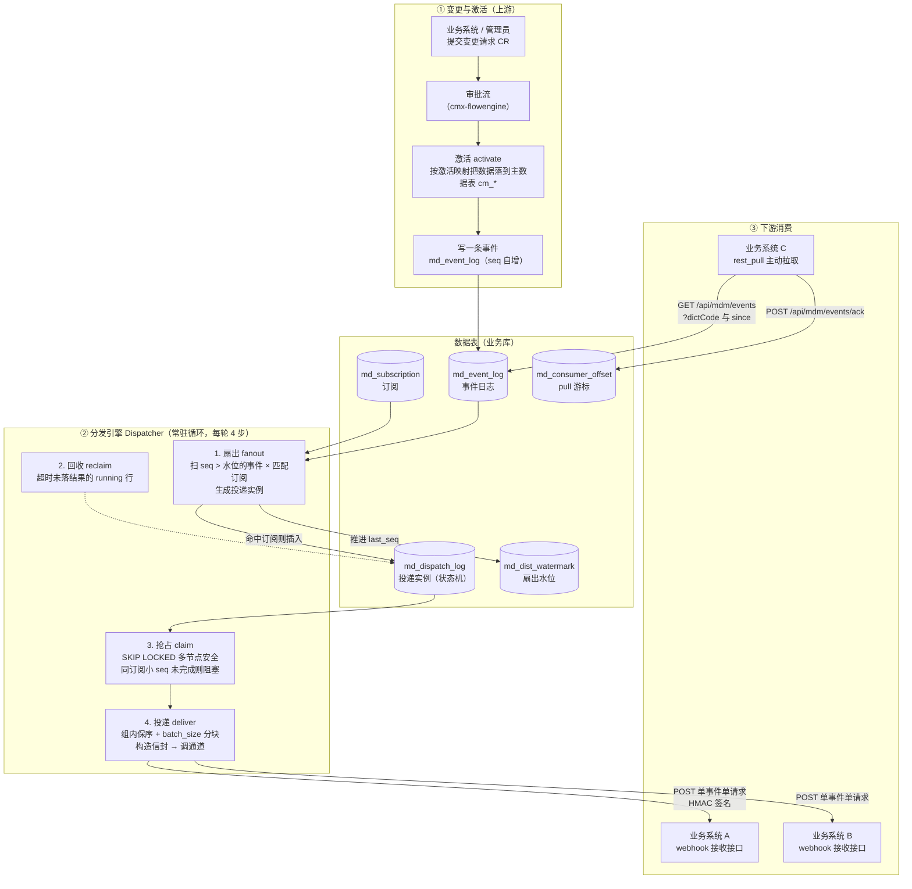
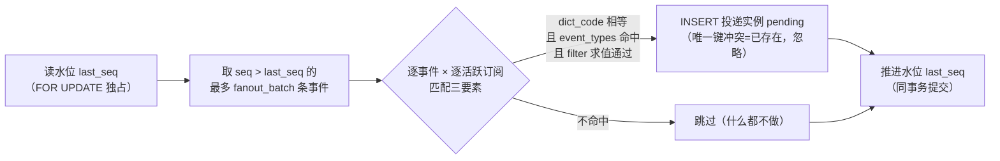
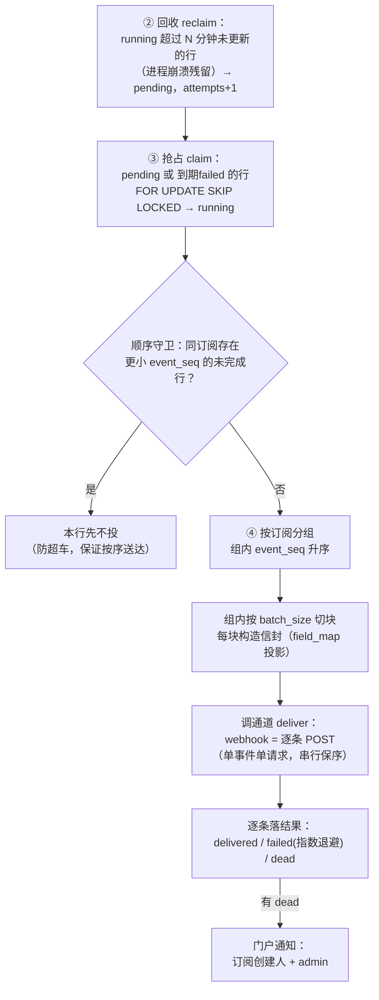
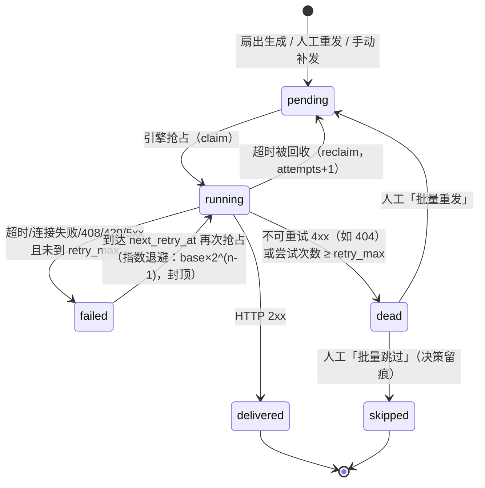

# CMX MDM 分发订阅模块详解（原理 · 表 · 流程 · API · 术语）

> 面向第一次接触消息分发/订阅模型的同学，从零讲清 M5 分发订阅模块。
> 读完你应该能回答：数据怎么从"一条主数据变更"变成"下游系统收到的一个 HTTP 请求"；中间经过哪几张表、什么状态；出问题去哪查、怎么补救。
>
> 代码位置：`cmx-container/crates/libs/cmx-mdm/`（model / store-pg / api 三层）；
> 管理页面：订阅管理（subscription-manager）、分发监控（dispatch-monitor）。

---

## 一、这个模块是干什么的

一句话：**主数据在 CMX 里被审批、激活之后，把"变了什么"主动推送给需要它的下游业务系统（WMS、ERP、MES……）。**

用一个快递比喻贯穿全文：

| 本模块的概念 | 快递比喻 |
| --- | --- |
| 主数据变更事件（event） | 你下单产生的一件货 |
| 事件日志表 `md_event_log` | 仓库的发货登记簿 |
| 订阅（subscription） | 收货人档案：谁要什么类型的货 |
| 扇出（fanout） | 拣货打包：一件货按收货人复制成 N 个包裹 |
| 投递实例（dispatch） | 一个具体的包裹，有自己的物流状态 |
| 投递通道（channel） | 快递公司：webhook（送货上门）/ rest_pull（自提）/ kafka（将来） |
| 死信（dead） | 反复投递失败的滞留件，需要人工处置 |

为什么不直接在激活的代码里调下游接口？因为要把"**发生了什么**"（事件）和"**要投给谁、投得怎么样**"（投递）解耦：

- 下游系统可以随时增删订阅，不影响已经发生的事件；
- 投递失败可以自动重试、进死信人工处理，而不是激活流程跟着失败；
- 所有投递有流水可查、有监控指标，出了问题能定位到具体哪一单。

---

## 二、全景图



三句话总结：

1. **变更侧**只管把"发生了什么"如实登记到事件表，不知道也不关心谁会消费。
2. **引擎**不停地把事件按订阅展开成投递实例，再把实例投出去，失败自动重试。
3. **消费侧**要么被动收 webhook，要么主动来拉（pull）。

---

## 三、术语表

| 术语 | 英文/字段 | 小白解释 |
| --- | --- | --- |
| 字典 | `dict_code` | 一种主数据类型，如 `supplier`（供应商）、`material`（物料）。全系统用它区分"这是哪种数据" |
| 目标系统 | `target_sys` | 订阅方标识，如 `wms`、`erp`。同一个系统订多种主数据 = 建多条订阅 |
| 事件 | event | 一次主数据变更的事实记录：哪种数据（dict_code）、哪条记录（record_id）、什么操作（event_type）、变更后长什么样（payload 快照） |
| 事件类型 | `event_type` | `created`（新建）/ `updated`（更新）/ `merged`（合并）。测试连通性时会发 `test` |
| 订阅 | subscription | 一份"收货人档案"：谁（target_sys）要哪种数据（dict_code）、通过什么方式（channel）、要哪些事件类型、重试策略等。唯一键 `(target_sys, dict_code, channel)`，**一条订阅只绑一种主数据** |
| 通道 | `channel` | 投递方式。当前可用 `webhook`（推送）；`rest_pull`（拉取）；`kafka` / `rocketmq`（骨架预留） |
| 扇出 | fan-out | 一条事件按命中的订阅复制成 N 条投递实例的"一对多"展开过程 |
| 水位 | watermark | 扇出的进度条（`md_dist_watermark.last_seq`）：已处理到事件表的第几号。重启不会丢，因为存在数据库里 |
| 投递实例 | dispatch | "事件 × 订阅"的一行：这个事件要投给这个订阅的那一单。有自己的状态机、尝试次数、错误记录 |
| 状态机 | status | `pending` 待投 → `running` 投递中 → `delivered` 已送达 / `failed` 待重试 → `dead` 死信；`skipped` 人工跳过 |
| 死信 | dead | 重试次数耗尽、或遇到不可重试错误（如 404）的投递实例。需要人工"重发"或"跳过" |
| 幂等 | idempotent | 同一件事做多次效果和做一次相同。消费端按 `eventId` 去重；扇出按唯一键防重 |
| 信封 | envelope | 投递给下游的标准 JSON 结构（`EventEnvelope`），含 eventId/dictCode/eventType/data 等 11 个驼峰字段 |
| 签名 | `X-CMX-Signature` | HMAC-SHA256(secret, body)，下游用它验证"这请求真的是 CMX 发的、没被篡改" |
| at-least-once | 至少一次 | 投递语义：不丢，但可能重复（重试、崩溃恢复都会重发），所以消费端要按 eventId 去重 |
| 保序 | 顺序守卫 | 同一订阅内，前面的投递没完成，后面的不投。保证下游按事件发生顺序收到 |
| delta 拉取 | `since` | pull 消费端只拉"第 n 号之后"的事件，n 就是自己记的游标 |
| 滞后 | lag | pull 消费端落后了多少条（当前最大 seq − 已确认 seq），衡量消费进度 |
| batch_size | 订阅级参数 | 单订阅组分批处理的块大小（每块发完落一次结果）。**不改变"单事件单请求"协议**，详见 FAQ |

---

## 四、五张表各自的作用

全部在**业务库**（表名 `md_` 前缀）。谁写谁读很重要——写的人越少，表越稳定。

### 1. `md_event_log` —— 事件日志（发货登记簿）

- **谁写**：只有激活服务（激活 `created`/`updated`、合并 `merged`）。
- **谁读**：扇出（匹配订阅）、投递（组装信封）、pull 消费端（delta 拉取）、监控页。
- **关键列**：
  - `id` VARCHAR(64)：主键，应用层 snowflake（分布式发号器生成的全局唯一 id）；
  - `seq` BIGSERIAL：**数据库自增序号**，全局单调递增、有唯一索引。所有"按顺序"的逻辑（扇出水位、delta 游标、保序）都靠它。它是数据库序列对象 `md_event_log_seq_seq` 分配的，**重启服务继续编号、不受应用影响**；事务回滚不归还已分配的号，所以 seq 会有空洞——空洞无害，只要求"递增不重号"；
  - `dict_code` / `record_id` / `event_type`：哪种数据、哪条记录、什么操作；
  - `payload` JSON：事件详情，含 `cr_id`（变更请求 id）、`version`、`snapshot`（变更后的完整记录快照——扇出行级过滤和下游 data 字段都从这里来）；
  - `emitted_at` TIMESTAMPTZ：事件发生时间（UTC 存储，接口返回 RFC3339）。

### 2. `md_subscription` —— 订阅（收货人档案）

- **谁写**：订阅管理页（运维人员）通过 API。
- **谁读**：扇出（匹配）、投递（通道配置/重试策略）、监控页。
- **关键列**：
  - `target_sys` + `dict_code` + `channel`：唯一键。一条订阅 = 一个系统的一种主数据的一种通道；
  - `channel_config` JSONB：通道配置。webhook 是 `{url, secret, headers{}}`；rest_pull 是 `{consumerId}`。**多条订阅可以填同一个 url + secret**——一个系统用一个 webhook 接口收多种主数据完全没问题（按信封里的 dictCode 区分）；
  - `event_types` JSONB：订阅哪些事件类型，`[]` = 全部，支持 `"*"`；
  - `filter` JSONB：行级过滤（可选），对事件快照求值，操作符 `eq/ne/in/like`，logic 仅 `and`。比如"只要 status=启用的供应商"；
  - `field_map` JSONB：字段投影（可选）：`include` 裁剪 / `rename` 重命名 / `mask` 脱敏成 `***`；
  - `retry_max`（默认 8）/ `timeout_ms`（默认 10s）/ `batch_size`（默认 50）：重试与节奏参数。

### 3. `md_dispatch_log` —— 投递实例（包裹 + 物流跟踪）

- **谁写**：扇出（插入 pending）、抢占（置 running）、投递落结果（delivered/failed/dead）、人工操作（retry/skip）、手动补发。
- **谁读**：投递引擎、监控页、死信处理。
- **关键列**：
  - `subscription_id` + `event_id`：唯一键。**幂等靠它**——同一事件对同一订阅最多一条实例，扇出重复执行也不会插重；
  - `event_seq`：冗余的事件序号（保序排序用）；
  - `status`：状态机（见下节）；
  - `attempts`：已尝试次数；
  - `next_retry_at`：failed 状态的下次可投时间（指数退避算出来的）；
  - `last_error` / `http_status` / `response_snippet`：最近一次失败的错误信息、响应码、响应体摘要（截断 512）——排查下游问题先看这三列；
  - `delivered_at` / `created_at` / `updated_at`：时间三件套。
- **索引**：`(status, next_retry_at)` 投递扫描用；`(subscription_id, created_at DESC)` 按订阅查流水。

### 4. `md_dist_watermark` —— 扇出水位（进度条，全局一行）

- 只有 `key='fanout'` 一行，`last_seq` 记录扇出已经处理到事件表第几号。
- **为什么需要**：引擎每轮只处理 `seq > last_seq` 的新事件，处理完推进水位。这样事件再多也是分批消化，不重复；即使扇出一半崩了，水位在事务里不推进，下一轮重扫，配合投递实例的唯一键，重复扇出无害。
- KPI「扇出滞后」= 事件表 MAX(seq) − 水位 last_seq，衡量扇出环节积压。

### 5. `md_consumer_offset` —— pull 消费者游标（自提记录）

- pull 模式下，消费端每拉一批就 `POST /api/mdm/events/ack` 登记"我已确认到第几号"（`consumer_id + dict_code + acked_seq`），单调递增（只接受更大的值）。
- **注意**：这只是监控/对账用的登记簿，**消费端仍应自己保存游标**，不能只依赖这张表。
- KPI/监控页的「滞后 lag」= 当前该字典最大 seq − 已确认 seq。

---

## 五、一次事件的完整旅程

### 5.1 第 0 步：事件怎么产生

主数据的任何正式变更都走 CR（变更请求）流程：提交 → 审批（对接流程引擎）→ **激活**。激活时：

1. 按激活映射配置，把 CR 里的数据落到主数据表（`cm_*` 表，版本号 +1）；
2. 在同一事务里写**一条**事件到 `md_event_log`，`seq` 由数据库序列自动分配，`payload.snapshot` 带上变更后的完整记录。

合并（去重合并两条重复记录）同样会写 `merged` 事件。

> 要点：事件只在激活/合并这些"数据正式生效"的时刻写入。草稿、审批中都不会产生事件。

### 5.2 第 1 步：扇出（fanout）

Dispatcher 常驻循环每隔 `scan_interval_ms`（有新事件时会被立即唤醒）跑一轮，第一步是扇出：



匹配三要素（`transform.rs::event_matches_sub`）：

1. **字典相等**：订阅的 `dict_code` === 事件的 `dict_code`；
2. **事件类型命中**：订阅 `event_types` 包含该事件的 `event_type`（空数组 = 全部）；
3. **行级过滤通过**（可选）：订阅 `filter` 对事件快照求值。存量"薄事件"（无 snapshot）跳过求值视为命中。

扇出用行锁独占水位窗口：**多节点部署时各实例排队扇出，不会重复**；就算重复，投递实例唯一键也兜底。

**水位什么时候更新？——提交时，不是插完就更新。** 一个扇出事务的完整时序：

```text
BEGIN（带 guard，作用域结束自动提交/回滚）
 ├─ ① SELECT last_seq ... WHERE key='fanout' FOR UPDATE
 │      行级排他锁：并发扇出在此排队；拿到锁 = 拿到独占的事件窗口
 ├─ ② 读 seq > 水位 的一批事件（LIMIT fanout_batch，升序）
 ├─ ③ 读全部活跃订阅，内存匹配
 ├─ ④ 批量 INSERT 投递实例（ON CONFLICT DO NOTHING）
 ├─ ⑤ UPDATE 水位 SET last_seq = 这批最大 seq
COMMIT ← 水位在这里（且仅在这里）生效；锁同时释放，排队者拿到新水位继续
```

两个机制各管一件事：

| 机制 | 管什么 | 效果 |
| --- | --- | --- |
| **事务**（④⑤ 同事务） | 原子性 | 水位推进和实例插入"同生同灭"：提交前崩溃/报错 → 整体回滚，水位原地、实例也没插；提交成功 → 两者同时对外可见。**不存在"水位推进了但实例没插进去"的中间状态** |
| **FOR UPDATE 行锁**（①） | 互斥 | 水位表全局一行，锁住它 = 锁住"扇出"动作本身：多节点全局串行排队，两个节点不可能处理同一段 seq 窗口（实例唯一键再兜一层底）。锁的生命周期 = 事务，扇出本身很快（内存匹配 + 批量 INSERT），串行不是瓶颈——并发大头在投递环节（SKIP LOCKED） |

### 5.3 第 2~4 步：回收 → 抢占 → 投递



**回收（reclaim）是崩溃兜底**：投递三步是"抢占置 running → 发 HTTP → 落结果"，进程若在置 running 之后、落结果之前崩溃，这行就永远卡在 running（claim 只拿 pending/到期 failed，没人会再碰它，成为孤儿）。回收就是把 running 超过 `running_reclaim_minutes` 分钟没动的行重置回 pending 并 attempts+1，让它重新进入投递循环。三个设计点：判定安全（正常投递秒级完成、远短于分钟级回收窗口，不会误伤正在投的行）；attempts+1 防崩溃循环（某事件一投就崩的场景下，反复崩溃-回收-重投会让 attempts 累计到 retry_max 进 dead，转人工）；重置 pending 而非 failed（崩溃是基础设施问题不是下游问题，恢复后立即补投、不走退避等待；崩溃瞬间 HTTP 可能已送达，重投重复由 at-least-once + 下游 eventId 幂等兜底）。

两个多节点安全设计值得记住：

- **SKIP LOCKED 抢占**：两个实例同时扫描待投行，各自锁定互不冲突的行，不会重复投；
- **顺序守卫**：某行前面还有同订阅更小 seq 的未完成行（含退避等待中的 failed），它就不投——保证下游**按事件发生顺序**收到同一订阅的数据。

### 5.4 投递状态机与重试

**投递状态中英文对照**（`md_dispatch_log.status` 的值，接口返回 / 数据库 / 监控页通用；终态 = 不会再变化）：

| 英文状态值 | 中文名 | 含义 | 谁会置成这个状态 |
| --- | --- | --- | --- |
| `pending` | 待投递 | 已生成、排队等待投递 | 扇出生成 / 回收重置 / 人工重发 / 手动补发 |
| `running` | 投递中 | 已被某个节点抢占，HTTP 请求在途 | 投递引擎抢占（claim） |
| `delivered` | 已送达（终态） | 下游返回 2xx | 投递成功 |
| `failed` | 失败·待重试 | 本次失败但可重试，正在退避等待 `next_retry_at` 到期 | 投递失败（超时/连接失败/408/429/5xx） |
| `dead` | 死信（终态） | 重试耗尽或不可重试错误，等待人工处置 | 重试次数 ≥ retry_max，或 4xx 类不可重试错误 |
| `skipped` | 已跳过（终态） | 人工决策跳过不投，留痕 | 死信处理页「批量跳过」 |

**事件类型中英文对照**（`md_event_log.event_type` / 信封 `eventType`）：

| 英文值 | 中文名 | 产生时机 |
| --- | --- | --- |
| `created` | 新建 | 记录首次激活发布 |
| `updated` | 更新 | 记录变更后激活发布 |
| `merged` | 合并 | 两条重复记录合并（败方并入胜方） |
| `test` | 测试 | 连通性测试专用（不写入事件表，仅试探投递） |



- **退避公式**：`下次可投时间 = now + backoff_base_ms × 2^(attempts-1)`，封顶 `backoff_max_ms`（调度器级配置）。第一次失败退避 base，之后翻倍，避免频繁轰炸下游。
- **可重试**：超时、连接失败、HTTP 408/429/5xx（下游临时故障）；
- **不可重试**：其余 4xx（404、401 等——配置错了，重试也没用，直接进死信）；
- **死信通知**：进入 dead 时门户发通知给订阅创建人和 admin，监控页顶部也会出现红色告警条。

### 5.5 webhook 投递协议（下游怎么接）

**单事件单请求**（Stripe/GitHub 惯例）：一个 HTTP POST = 一个事件，body 就是标准信封。

请求头：

```text
POST {订阅配置的 url}
Content-Type: application/json
X-CMX-Event-Id:      7495484794059558912   ← 幂等键（重复投递时相同）
X-CMX-Event-Type:    created               ← 事件类型
X-CMX-Timestamp:     1760000000000         ← 防重放（建议 ±5min 窗口）
X-CMX-Signature:     sha256=9f86d081...     ← HMAC-SHA256(secret, raw_body)
{channel_config.headers 里的自定义头}
```

body（信封，驼峰命名，11 个字段）：

```json
{
  "eventId": "7495484794059558912",
  "seq": 57,
  "eventType": "created",
  "dictCode": "supplier",
  "recordId": 53868740218881,
  "recordCode": "SUP-001",
  "version": 3,
  "source": "cmx-mdm",
  "occurredAt": "2026-08-18T14:20:35Z",
  "data": { "code": "SUP-001", "name": "示例供应商", "...": "field_map 投影后的快照" },
  "meta": { "crId": 9001001, "dispatchId": 53868741267458 }
}
```

下游接入清单（按重要性排序）：

1. **按 `dictCode` 路由**——一个接口收多种主数据就靠它（注意：dictCode 只在 body 里，header 没有）；
2. **按 `eventId` 去重**——at-least-once 语义，重试会重发同一事件；
3. **验签**——用约定好的 secret 对 raw body 算 HMAC-SHA256，与 `X-CMX-Signature` 比对；
4. （可选）用 `version` 丢弃乱序到达的旧版本、用 `seq` 校验连续性发现缺口；
5. 返回 **2xx** 表示成功；临时故障返回 408/429/5xx 或超时，CMX 会自动重试；返回其他 4xx 会被判为不可重试直接进死信。

安全限制：webhook 目标默认**禁止私网/回环地址**（防 SSRF），开发联调本地地址需要把调度器配置 `allow_private_address` 打开。

### 5.6 pull 模式（下游主动拉）

不想暴露接收接口的系统可以走拉取：

1. `GET /api/mdm/events?dictCode=supplier&since=100&page=1&pageSize=100`——拉"第 100 号之后"的事件，响应含 `nextSince`（本页最大 seq）和 `hasMore`；
2. 处理完这批，`POST /api/mdm/events/ack` 登记 `{consumerId, dictCode, seq: nextSince}`（只接受比当前更大的值）；
3. 下次从新游标继续。游标登记进 `md_consumer_offset`，监控页能看到每个消费者的 lag（落后多少条）。

### 5.7 补救手段（出问题了怎么办）

| 场景 | 手段 | API | 效果 |
| --- | --- | --- | --- |
| 死信 | 批量重发 | `POST /mdm/dispatches/retry` | dead/failed → pending，重新走投递 |
| 死信（确认不要了） | 批量跳过 | `POST /mdm/dispatches/skip` | → skipped 终态，留痕 |
| 新订阅要补历史数据 | 手动补发 | `POST /mdm/publish` | 按"订阅/字典 + seq 范围"重建投递实例（上限 5000；不勾 force 时已送达的跳过） |
| 下游刚上线要全量 | 全量快照 | `POST /mdm/records/snapshot` | 按字典分页拉主数据表 published 记录（不走事件，支持日期段增量） |
| 怀疑下游配置错了 | 连通性测试 | `POST /mdm/subscriptions/test` | 发一条 `test` 事件的试探投递，回显响应码 |

---

## 六、API 一览

前缀都是 `/api`，鉴权走登录 token 或 `X-API-Key`。参数一律走 query（GET）或 JSON body（POST），**没有路径变量**（平台规范）。

### 订阅与治理

| 方法 | 路径 | 用途 |
| --- | --- | --- |
| GET | `/mdm/subscriptions` | 订阅列表（分页，含近 24h 投递统计） |
| POST | `/mdm/subscriptions` | 保存订阅（有 id 更新、无 id 新增） |
| POST | `/mdm/subscriptions/delete` | 删除订阅（body 传 id） |
| POST | `/mdm/subscriptions/set-active` | 启用/停用（id + active） |
| POST | `/mdm/subscriptions/test` | 连通性测试（发 test 事件） |
| GET | `/mdm/subscriptions/channels` | 可用通道列表 |
| GET | `/mdm/audit` | 变更审计（field 级新旧值留痕） |
| GET | `/mdm/events` | 事件日志（delta：`since` 游标；`order=desc` 最新在前，监控页用；缺省正序保持消费契约） |
| POST | `/mdm/publish` | 手动补发（订阅/字典 + seq 范围重建实例） |

### 分发投递治理

| 方法 | 路径 | 用途 |
| --- | --- | --- |
| POST | `/mdm/dispatches/query` | 投递流水查询（订阅/状态/字典/时间范围过滤 + 分页，时间倒序） |
| GET | `/mdm/dispatches/detail` | 单条投递详情（含事件类型/payload/订阅名） |
| POST | `/mdm/dispatches/retry` | 批量重发（ids 列表或订阅+状态） |
| POST | `/mdm/dispatches/skip` | 批量跳过死信 |
| GET | `/mdm/dispatches/stats` | 监控 KPI（见下节） |
| POST | `/mdm/events/ack` | pull 游标登记（单调递增） |
| GET | `/mdm/events/offsets` | pull 消费者游标列表（含 lag） |
| POST | `/mdm/records/snapshot` | 全量快照分页拉取（首接/对账） |

---

## 七、监控与运维

### KPI 指标（`GET /mdm/dispatches/stats`，监控页顶部六张卡）

| 指标 | 口径 | 含义 |
| --- | --- | --- |
| 今日投递 `today_total` | 今日 `updated_at` 有变化的实例数 | 今天动了多少单 |
| 今日成功率 | `today_ok / today_total` | 质量总览 |
| 平均耗时 `avg_latency_ms` | 近 24h delivered 实例的 `delivered_at − created_at` 平均毫秒 | 从事件产生到送达的端到端延迟 |
| 积压 `backlog` | pending + running 数 | 已生成还没投完的量（投递环节积压） |
| 死信 `dead` | dead 数 | 需要人工处置的量（>0 时监控页顶部出红色告警条） |
| 扇出滞后 `fanout_lag` | 事件表 MAX(seq) − 水位 last_seq | 事件还没被展开成投递实例的量（扇出环节积压） |

**排障路径**：死信 > 0 → 「死信处理」tab 看最近错误（点击可看完整错误+复制）→ 通常两类：URL/secret 配错（404/401，改订阅配置后重发）或下游临时故障（5xx，直接重发）。

### 管理页面

- **订阅管理**：订阅 CRUD、启停、连通性测试、跳转"投递"看该订阅流水；
- **分发监控**：KPI + 投递流水（过滤/详情弹框）+ 事件日志（payload 弹框可复制）+ 死信处理（批量重发/跳过）。KPI 每 30s、列表每 60s 自动刷新。

### 死信通知

投递进入 dead 时，门户会给订阅创建人和 admin 发通知——不用盯着监控页也会知道。

---

## 八、常见问题 FAQ

**Q1：一个业务系统订多种主数据，能用同一个 webhook 接口吗？**
能。建多条订阅（同一 target_sys、不同 dictCode、同一个 url+secret），投递到下游的每个请求 body 里都有 `dictCode` 字段区分类型。注意 dictCode 只在 body，header 里只有事件类型。

**Q2：`seq` 是怎么生成的？服务重启后会重置吗？**
`seq` 是 PostgreSQL 数据库序列（`md_event_log_seq_seq`）自增分配的，INSERT 时不传、由数据库默认值填。序列状态存在数据库里，**重启应用服务完全不影响，继续往后编号**；只有显式 `setval`/删表重建才会重置。事务回滚不归还已分配的号，所以会有空洞（如 1,2,5,6）——无害，只保证单调递增不重号。集群多实例共用同一序列，天然全局唯一。

**Q3：订阅里的 `batch_size` 是"一个请求装多个事件"吗？**
不是。它是**引擎分批处理的块大小**：单订阅的待投行按 `batch_size` 切块，每块构造一批信封交给通道，发完这块落一次结果再进行下一块（控制内存 + 落库节奏）。webhook 通道收到一批后仍是**逐条发 HTTP、单事件单请求**。将来 kafka 等批量协议通道落地时，它才是"每请求事件数"。

**Q4："扇出"到底是什么？**
一条事件复制成 N 条投递实例的一对多展开：1 个 supplier 事件 × 3 个命中订阅 = 3 条投递实例（各自独立重试）。扇出有水位表记进度，不重不漏。

**Q5：投递语义是什么？会不会丢、会不会重？**
at-least-once（至少一次）：不丢（失败重试、死信留痕、扇出幂等），但**可能重**（重试期间下游其实已处理成功、崩溃恢复重投）。所以下游必须按 `eventId` 幂等去重。

**Q6：事件顺序有保证吗？**
有。同一订阅内严格保序（顺序守卫：前面的没完成，后面的不投）。不同订阅之间没有顺序关系。下游如果担心跨类型乱序，可以用信封里的 `version` 丢弃旧版本兜底。

**Q7：监控页时间显示的是什么时区？**
数据库 TIMESTAMPTZ 存 UTC，接口返回 RFC3339 UTC 串；前端统一换算成**东八区**显示。投递流水的时间范围过滤也按东八区解释。

**Q8：下游怎么验签？**
用约定 secret 对**原始请求体字节**算 HMAC-SHA256，十六进制后拼上前缀 `sha256=`，与请求头 `X-CMX-Signature` 比对（常量时间比较更稳妥）。建议同时校验 `X-CMX-Timestamp` 在 ±5 分钟窗口内防重放。

**Q9：怎么给一个刚建的新订阅补历史数据？**
「手动补发」（`POST /mdm/publish`）：按订阅/字典 + 事件 seq 范围重建投递实例，上限 5000 行；默认已送达的不重发，勾 force 可强制。要的是主数据全量而非事件流的话，用全量快照接口。

**Q10：Dispatcher 常驻循环在哪配置？重启安全吗？**
调度参数（扫描间隔、扇出批量、并发数、退避 base/max 等）在服务配置里（DistCfg）。重启安全：所有状态都在数据库表里（水位、实例状态、next_retry_at），running 残留会被回收步骤清理，集群多节点靠 FOR UPDATE 排队 + SKIP LOCKED 抢占，不重复不遗漏。

**Q11：扇出一次取多少条？某个订阅者一直投递失败，水位会卡住吗？**
扇出每轮在**一个事务**里取一批（`fanout_batch` 条，`seq > 水位` 升序），匹配全部活跃订阅、批量插入投递实例后，把水位推进到这批的最大 seq。**水位只度量"扇出环节"，与订阅者的投递成败完全无关**——推进条件只是"这批事件被读过、匹配过"，哪怕一个订阅都没命中也推进；投递实例后续 failed/dead 只写在实例行上，不回写水位。所以某个订阅者一直失败：它自己的队列会积压、被顺序守卫压着（只影响它自己），但新事件照常扇出、水位照常推进、其他订阅照常收到。水位唯一不动的场景是扇出事务自身失败回滚——下一轮从原水位重扫，配合幂等插入无害。真正"每个消费者各有一档进度"的是 pull 模式的 `md_consumer_offset`（消费端自己 ack），与扇出水位是两码事。

**Q12：水位具体在什么时候更新？靠事务还是锁？**
都在：**锁保证同一时刻只有一个扇出在跑，事务保证水位和它产出的实例要么都算数、要么都不算数**。时序是"先锁 → 干活（读事件/匹配/插实例）→ 事务最后一步 UPDATE 水位 → COMMIT 生效"——水位是**提交时**更新，不是插完实例就更新。提交前崩溃 → 整个事务回滚（水位原地、实例也没插，无中间状态）；提交后 → 水位推进与实例落库同时可见。并发安全靠水位行的 `FOR UPDATE` 行锁：多节点全局串行排队，不可能两个节点处理同一段 seq 窗口。详见 §5.2。

**Q13：多节点部署，两个节点会不会同时往一个订阅推不同 seq，导致旧事件晚到覆盖新事件？**
自动投递路径**不会**，三层机制叠加保证同订阅全局串行：① 抢占的顺序守卫（同订阅存在更小 seq 的未完成行 pending/running/failed 则不可抢 + SKIP LOCKED，同一时刻同一订阅最多一个节点持有"下一单"）；② 组内 await 串行投递（seq n+1 的请求在 seq n 的响应之后才发出，到达顺序物理有序）；③ failed 退避中也阻塞后续（重试等待不超车），崩溃由 running 回收兜底且回收后继续按序。下游收到的只会是 `10, (10 重复), 11...`，用 eventId 去重即可。**两个显式让渡顺序的例外**需要 `version` 兜底：死信人工重发（dead 不阻塞后续，重发的旧事件会晚于已投的新事件到达）和跨订阅投到同一下游（订阅之间并行无序）。下游 upsert 带版本条件（只接受更大 version）即可根治——这正是信封带 version 字段的原因。
