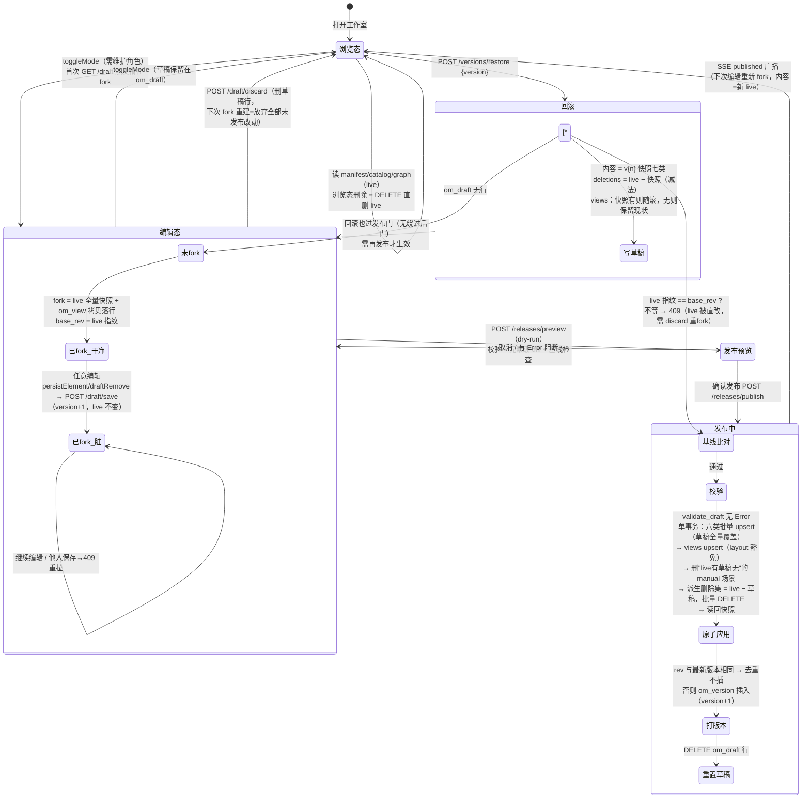
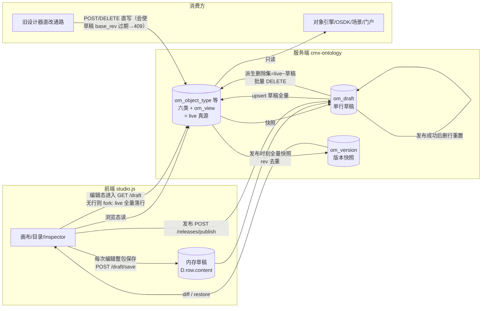

# 本体工作室（studio.js）编辑态/浏览态/草稿/发布/版本关系梳理 + "数据消失"诊断

> 日期：2026-09-12 · 模块：cmx-ontology（本体工作室 P2 草稿/发布双轨）
> 代码锚点：`backend/cmx-container/assets/onto/web/ui-native/onto/studio.js`（前端）
> `backend/cmx-ontology/crates/cmx-onto-app/src/draft_handlers.rs`（handler）
> `backend/cmx-ontology/crates/cmx-onto-store-pg/src/draft_store.rs`（存储）
> `backend/cmx-ontology/crates/cmx-onto-model/src/draft.rs`（纯函数：指纹/diff/校验/派生删除）

---

## 〇、TL;DR（先看这里）

**你的数据没有丢。** 2026-09-12 00:31 启动的 8097 服务加载的是 `CONFIG_FILE=./onto-server-test.toml`，连的是 **`192.168.137.111:5432/cmx_onto`（全新空库）**；而你的全部本体数据在 **`192.168.157.46:5432/cmx_fico`（dev 库）**，实测完好：对象类型 **1077**、关系 **244**、接口 32、共享属性 23、动作 48、函数 33、场景 4、版本快照 **39 条**、草稿行 1 条（内容约 1MB，非空）。

三个症状逐一对应：

| 症状 | 真相 |
| --- | --- |
| "发布后所有数据都消失不见了" | 当前视角是 test 空库，本来就没有数据；test 库 `om_version` = 0 条，说明**从未发生过一次成功发布**，不存在"发布清空"。切回 dev 配置重启即全部回来。 |
| "草稿里存的东西也都是空的" | 同因：空库上 `GET /draft` 惰性 fork，fork 自空 live → 空草稿（实测返回七段全空 content）。 |
| "对象类型删除也删不了，总是能查出来" | 编辑态删除是**草稿轨两段式**：只从草稿数组摘除、不动 live（toast 原话"已写入草稿删除（发布后生效）"）；**不发布则刷新后永远还在**。且前端 `mergedArray` 合并函数存在语义缺陷：编辑态里"live 有、草稿无"的元素会被当作未删从 live 合并回来继续显示（见 §五 H3）。 |

要回 dev 数据：`CONFIG_FILE=onto-server-dev.toml ./onto.sh`（或 launcher 里把 onto 的 toml 切回 dev）重启即可，无需任何数据恢复。

---

## 一、三层数据模型

```
┌─────────────────────────────────────────────────────────────────────┐
│ live 层（已发布真源）                                                │
│   om_object_type / om_link_type / om_interface / om_shared_property │
│   / om_action_type / om_function / om_view                          │
│   消费方（对象引擎 / OSDK / 场景 / 旧设计器直改）只认这一层。         │
├─────────────────────────────────────────────────────────────────────┤
│ draft 层（草稿工作区，om_draft 单行 id=1）                           │
│   content 七段：objectTypes/linkTypes/interfaces/sharedProperties   │
│                 /actionTypes/functions/views（+ deletions 清单）     │
│   base_rev：fork 时刻的 live 全量快照指纹（xxh64）                   │
│   version ：行级乐观锁（每次保存 +1）                                │
├─────────────────────────────────────────────────────────────────────┤
│ version 层（版本档案，om_version）                                   │
│   每次成功发布插一条：version（递增）+ rev（发布时刻全量快照指纹）   │
│   + summary + snapshot（全量 JSONB 快照，回滚/diff 的数据源）        │
└─────────────────────────────────────────────────────────────────────┘
```

核心纪律（方案 §2.4）：**编辑写草稿，发布才动 live；发布 = 版本诞生点；浏览/消费侧永远 live 口径。**

## 二、浏览态 vs 编辑态

| | 浏览态（browse，默认） | 编辑态（edit） |
| --- | --- | --- |
| 入口 | 页面默认 | 工具条开关 `toggleMode()`（studio.js:460），需维护角色（`GET /me/roles`，白名单空表=开放） |
| 读 | 全部 live：`GET /manifest`（清单）/ 目录分页 / `GET /graph`（画布） | 同左，但装载后叠加草稿 overlay（`applyDraftOverlay` studio.js:311）：清单数组 = `mergedArray(live, 草稿)`，场景清单 = `mergedViews` |
| 写元素 | `POST /object-types` 等直写 live（旧设计器通路，会触发 fork 的 base_rev 过期） | 统一走 `persistElement`：改内存草稿 → `POST /draft/save` 整包保存（studio.js:290），**不碰 live** |
| 删元素 | `DELETE /object-types/{name}` 等直删 live（studio.js:3284-3292，级联删引用关系） | `draftRemove`：仅从草稿数组摘除（studio.js:3255-3281），**live 不动**；发布时派生删除集才真删 |
| 布局拖动 | — | `saveLayout` 写草稿 views 段 layout（发布时 layout 列豁免回吞） |
| 消费方可见性 | 立即 | 发布后才可见（SSE `published` 广播刷新） |

## 三、状态机（mermaid）

一次编辑会话的完整生命周期（`D.row` = 前端草稿行缓存；om_draft 行为服务端事实源）：



## 四、数据流（mermaid）



各操作落表对照：

| 操作 | 端点 | 动 live？ | 动 om_draft？ | 动 om_version？ |
| --- | --- | --- | --- | --- |
| 浏览态读 | `GET /manifest` `/graph` `/views` | 只读 | 否 | 否 |
| 进编辑态 | `GET /draft` | 只读 | 无行 → fork 落行 | 否 |
| 编辑保存 | `POST /draft/save` | **否** | 整包覆盖，version+1 | 否 |
| 编辑态删除 | `draftRemove` + save | **否**（仅草稿摘除） | 同上 | 否 |
| 丢弃草稿 | `POST /draft/discard` | 否 | 删行 | 否 |
| 发布预览 | `POST /releases/preview` | 只读 | 否 | 否 |
| **发布** | `POST /releases/publish` | upsert 全量 + **删除 live−草稿** | 事务末删行 | 插入（rev 去重时跳过） |
| 回滚 | `POST /versions/restore` | 否（写草稿） | 覆盖，base_rev=当前 live 指纹 | 否 |
| 浏览态删除/新建（旧通路） | `DELETE/POST /object-types` 等 | **直改** | 否（但会使草稿 base_rev 过期） | 否 |

## 五、本次三症状诊断与代码隐患

### 5.1 症状一："发布后所有数据都消失不见了" → 连错库

实测证据链（2026-09-12 00:35-00:45）：

- 进程 `pid 899433 target/release/cmx-onto-server`，`/proc/<pid>/environ` 显示 **`CONFIG_FILE=./onto-server-test.toml`**；
- `onto-server-test.toml:15`：`db_url = "...@192.168.137.111:5432/cmx_onto"`（test 库），而 dev 是 `onto-server-dev.toml:15` → `192.168.157.46:5432/cmx_fico`；
- `GET /stats` → 八类计数全 0；`GET /versions` → `[]`；
- 直连 test 库：12 张 om_* 表齐全（服务首启自动 DDL）但**全部 0 行**——`om_version` 也是 0，说明**没有发生过任何一次成功发布**（发布必插版本，rev 去重只对"与最新版相同"跳过，首次必插）。排除"发布把数据删了"；
- 直连 dev 库：1077/244/32/23/48/33/4 全在，`om_version` 39 条（最新 v39，2026-09-11 11:36），草稿行内容 1,037,559 字节——完好。

**结论：数据视角问题，不是接口或后端 bug。** 你在 studio 里看到的是 test 空库；发布/草稿的一切操作也都发生在空库上，自然"什么都看不见、草稿是空的"。

### 5.2 症状二："草稿里存的东西也都是空的" → 空库 fork 的必然结果

`GET /draft`（draft_handlers.rs:98）在 om_draft 无行时惰性 fork：`snapshot_full()` 读 live 七类 → 落 om_draft。live 空 → fork 出的草稿七段全空（实测响应 `content` 全空数组）。**同一根因。**

附带一个真实的代码隐患（H2，见 5.5）：草稿内容反序列化失败时会**静默**退成空草稿（`get_draft_row` draft_store.rs:72-75、fork 处 draft_handlers.rs:123 均 `unwrap_or_default()`）——本次是"空库所以空"，但将来跨版本字段变更时这条通路会把满草稿静默变空，且后续保存会把空内容写回，是比连错库更危险的地雷。

### 5.3 症状三："对象类型删除也删不了，总是能查出来" → 草稿轨两段式 + 前端合并缺陷

编辑态删除的正确预期（studio.js:3253-3281）：从草稿数组摘除 → 提示"已写入草稿删除（**发布后生效**）" → 发布时 `derive_deletions_tx`（draft_store.rs:434）计算 `live − 草稿` 才真正 DELETE。所以：

1. **不发布就刷新/切浏览态**：live 没动，元素当然还在——"总是能查出来"的第一层。
2. **即使发布了**，编辑态内的合并函数 `mergedArray`（studio.js:305）也有缺陷：

```js
function mergedArray(liveArr, draftArr) {
  const names = new Set((draftArr || []).map((x) => x.apiName));
  return (liveArr || []).filter((x) => !names.has(x.apiName)).concat(draftArr || []);
}
```

fork 是 live 全量拷贝，故"草稿数组里没有"本应表达"已删除"；但该函数把"live 有、草稿无"的条目**又从 live 带回**拼接进结果。例：live=[A,B,X]，fork 后草稿=[A,B,X]，摘除 X → 草稿=[A,B]，合并结果 = (live 中不在{A,B}的 = X) + [A,B] = **[A,B,X]，X 仍在编辑态显示**。注释声称的语义"草稿 ∪ (live − 草稿派生删除)"与实现不符——实现无法区分"从草稿删除"与"从未进草稿"。这是"点了删除、toast 成功、界面刷新元素还在"的直接原因（H3）。浏览态读 live 不受影响；发布后 live 真删、浏览态才消失。

3. 已排除 403 路径：dev 库 `om_maintainer` 0 行 = 白名单开放模式，`require_maintainer`（draft_handlers.rs:32）恒放行。

### 5.4 隐患 H1（高危）："空草稿发布"会清空整个 live

发布应用第 4 步（draft_store.rs:392-395）：派生删除集 = live − 草稿，**逐类批量 DELETE**。发布门只做两件事：base_rev 比对 + `validate_draft`（只校验**草稿里有的元素**与删除清单一致性）。若草稿因任何原因变空（连错库 fork 空 live、H2 静默置空、前端把空 content 整包保存），而 base_rev 恰好匹配（fork 后 live 未被直改），发布将：校验 0 个 Error → 派生删除 = **全部 live 元素** → 一次性清空六类表 + manual 场景 → 打一条"空快照"版本。预览 diff 会显示全量 Removed（这是唯一可见的刹车），但发布端点本身没有"删除比例/数量异常"护栏。本次 test 空库上 live 本来就空所以无事，但在 dev 库上若发生 H2 就是灾难性的。

### 5.5 隐患与修复建议清单（按优先级）

| # | 级别 | 问题 | 位置 | 建议 |
| --- | --- | --- | --- | --- |
| H1 | 🔴 高 | 空草稿发布会派生删除全部 live，无数量护栏 | `draft_store.rs:392-395` | 发布门增加护栏：派生删除量 > 阈值（如 live 的 20% 或绝对数）且草稿非显式 deletions 时要求请求体带 `confirmMassDelete` 或直接 409；另可校验"草稿元素总数 << base_rev 时"告警 |
| H2 | 🔴 高 | 草稿 JSON 反序列化失败静默 `unwrap_or_default()` → 满草稿变空，后续保存/发布放大为 H1 | `draft_store.rs:72-75`、`draft_handlers.rs:123` | fail-loud：解析失败返回 500 并在响应中标出失败原因，禁止静默兜底；fork 侧同理 |
| H3 | 🟠 中 | `mergedArray` 语义缺陷：编辑态删除后元素仍显示（"删不掉"观感） | `studio.js:305-308` | 以草稿数组为权威世界（fork 全量模型下"草稿没有=删除"）：`draftArr` 全量 + live 中"草稿从未见过"的条目按需保留；或删除时同步从 `S.manifest` 摘除并在重拉 live 时以草稿名集差集过滤 |
| H4 | 🟡 低 | 旧设计器直改 live 与草稿双轨并存，直改后草稿 base_rev 必过期（409 rebase），两侧互相"打架"易被感知为"数据乱跳" | 架构层面 | 长期收敛：旧直改通路逐步迁移到草稿轨；短期在 409 文案中引导"刷新草稿比对" |
| H5 | 🟡 低 | `GET /draft` 带副作用（fork 落行）且响应含 MB 级 content；此前 74s 排队问题源于此（另案） | `draft_handlers.rs:98` | fork 副作用移到显式 `POST /draft/fork`；meta/content 响应拆分 |

### 5.6 结论修正与后续（2026-09-12 当日补记）

**用户确认：`192.168.137.111:5432/cmx_onto` 就是当前正式使用的库**（空库起步属预期）——"数据消失"实为切换到新库后的正常空态，无需切回 dev 库，dev 库（cmx_fico）保留作历史参考。

**H1 / H2 / H3 已于当日修复**（cmx-ontology 仓，待提交；服务重启后生效）：

| # | 修复内容 | 位置 |
| --- | --- | --- |
| H2 | 草稿反序列化 fail-loud：`get_draft_row` / fork / `versions_restore`（含快照 views 段）共 4 处 `unwrap_or_default()` 静默置空改为显式报错（500，附解析失败原因），杜绝"满草稿静默变空 → 保存固化 → 发布清库"通路 | `draft_store.rs` `get_draft_row`；`draft_handlers.rs` `ensure_draft_forked` / `versions_restore` |
| H1 | 发布大规模删除护栏：`releases_publish` 在校验后预计算派生删除集（与发布事务同口径 `derive_deletions`），超过 `max(50, liveTotal/5)` 且请求未带 `confirmMassDelete=true` 时 409 拒绝；`releases_preview` 响应新增 `liveTotal` / `massDelete` 字段；前端发布对话框在 `massDelete` 时显示红色警告块、按钮变"确认大规模删除并发布"、请求带 `confirmMassDelete` | `draft_handlers.rs` `PublishReq` / `releases_publish` / `releases_preview`；`studio.js` `openPublishCenter` |
| H3 | 编辑态删除持久化：`draftRemove` 摘除草稿数组的同时显式登记 `content.deletions`（随草稿行持久化，fork 全量模型下"草稿无 = 删除"有了持久表达）；`draftUpsert` 同名先撤销删除登记（与后端"既改又删矛盾"校验同口径）；`mergedArray` 增加 `delNames` 过滤参数，`applyDraftOverlay` 按 kind 传入 `deletedNames(kind)`——修复"删除后刷新又回来显示"；`versions/restore` 回滚草稿自带的 deletions 直接被合并消费 | `studio.js` `draftUpsert` / `draftRemove` / `mergedArray` / `deletedNames`（新增）/ `applyDraftOverlay` |

验证：`cargo check`（全 workspace）通过；`cargo test -p cmx-onto-model` 79 例全过；`node --check studio.js` 通过；`cargo clippy` 新改动零告警（存量告警不涉及本次文件）。`kind_key` 经此修复加入 `cmx-onto-model` 公开导出。

**生效条件**：本体服务重启（release 二进制需重新 `cargo build --release` 后 `./onto.sh --release`，或 dev 模式直接 `./onto.sh`）。前端 studio.js 经 `[assets] ui_native_dir` 直指工作区真源，浏览器强刷（Ctrl+Shift+R）即生效。
