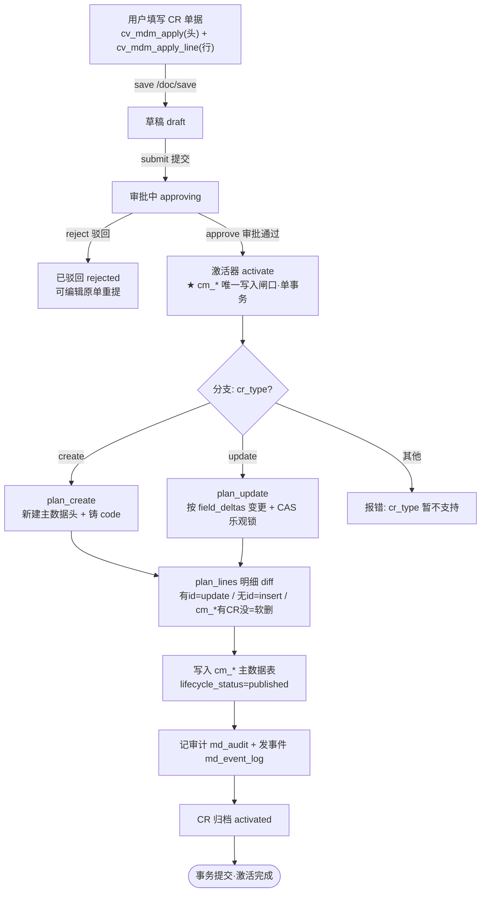
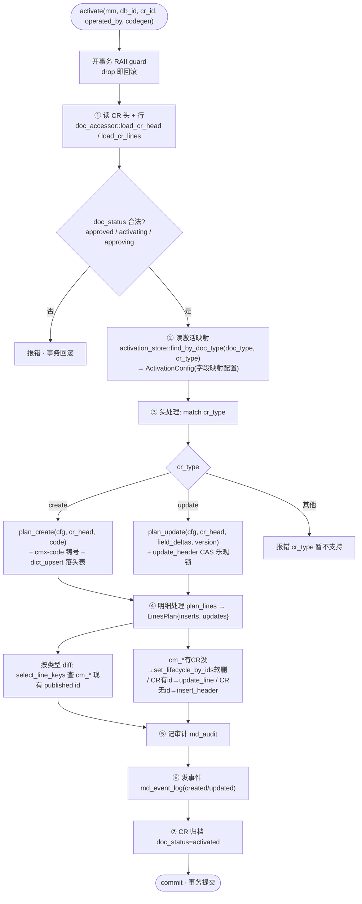

# CMX MDM · 单据审批通过 → 写入主数据表机制

> **文档目的**：说明 MDM 变更申请单据（CR）审批通过后，数据如何经「激活器」写入真实主数据表（`cm_*`）——含流程图、代码处理、对表的要求、以及硬编码点对后续扩展的影响。
> **适用版本**：2026-08-14 代码现状（cmx-mdm：M0–M4 + M2.5 + M8 已落地）。
> **核心机制**：reference 纯净——草稿走 CR 单据（`cv_*`），正式数据走主数据表（`cm_*`），**激活器是 cm_\* 唯一写入闸口**。

---

## 一、概述

MDM 主数据不允许直接编辑 `cm_*` 表。所有变更必须走「变更申请单据（CR）」流程：

```
用户填 CR 单据(cv_mdm_apply) → 提交审批 → 审批通过 → 激活器落实变更 → cm_* published
```

- **CR 单据**：`cv_mdm_apply`（头）+ `cv_mdm_apply_line`（明细行），承载"想做什么变更"
- **激活器**（`activate`）：审批通过后触发，单事务把 CR 的变更"落实"到 `cm_*`，是**唯一写入闸口**（强制 `lifecycle_status='published'`）
- **主数据表**：`cm_supplier`（头）/ `cm_bank_account`（明细）等，只存 published

CR 用两个维度描述变更：
- **`cr_type`**（头级别）：变更性质 → `create` 新增 / `update` 修改（`merge`/`block`/`flag_delete` 暂不实现）
- **`line_target_id`**（明细行级别，diff 关键）：有值（指向 cm_* 明细 id）= 改已有；无值 = 新增；cm_* 现有但 CR 未提及 = 删除（激活器 diff 算出）

---

## 二、整体流程



---

## 三、激活器七步（代码处理）

激活器入口 `activate()`（`cmx-mdm-store-pg/src/activation_service/activate.rs`）开一个 RAII 事务，调 `activate_inner()` 执行七步，**任一步失败整体回滚，cm_\* 无中间态**。



### 触发入口

| 入口 | 代码 | 说明 |
|---|---|---|
| 审批通过 | `handlers/cr.rs::mdm_cr_approve` → `store::activate(...)` | **方案 A**：approve 端点内部直接调激活器，单事务完成 `approving → activated` |
| 手动激活 | `handlers/activation.rs::mdm_cr_activate` → `store::activate(...)` | 内部/手动 CR 直接激活（不经审批） |

两路径统一走 `activate()`，保证事件不漏、事务原子。

### 并发控制（关键）

- **CR 互斥**：同一目标记录同时只允许一个 approving CR（DB 唯一约束）
- **乐观锁 CAS**：update 分支读 `published_version` 作期望值，`UPDATE ... WHERE id=? AND published_version=?`，0 行=版本冲突报错
- **明细软删 CAS**：`set_lifecycle` 用 `WHERE id=? AND lifecycle_status='published'` 防重复操作

---

## 四、字段搬运规则（纯逻辑层 `cmx-mdm-model/src/activation.rs`）

激活器的"搬运"是**纯计算**（不接 DB），按 `ActivationConfig` 的映射配置，把 CR 字段搬到 cm_* 列。

### plan_create（create 分支）
- 按 `header_mapping {源字段: 目标列}` 从 CR `payload` / 顶层搬值到头行
- `subject_name_field` 特殊处理：CR 的 `subject_name` 列 → 目标名称列（如 `name`）
- 强制补：`code`(铸号) + `lifecycle_status='published'` + `published_version=1`
- 空串/null 跳过（让目标表 DEFAULT / backfill 兜底）

### plan_update（update 分支）
- 只搬 `field_deltas` 里的 `new` 值（不覆盖整行）
- `published_version = current + 1`
- 空串跳过（未改）；null 保留（显式清空，落 `SET col=NULL`）
- 不改 `lifecycle_status`（保持 published）

### plan_lines（明细 diff，返回 `LinesPlan{inserts, updates}`）
- 遍历 CR 行，按 `line_type` 匹配 `line_mappings`，按 `line_target_id` 区分：
- **无 `line_target_id`** → `inserts`（新增明细）：按 `line_mappings[].fields` 搬值 + 回填关联列（`parent_field` = header_id）+ 强制 `lifecycle_status='published'`
- **有 `line_target_id`** → `updates`（改已有 cm_* 明细）：只搬业务字段，**id 稳定**（不改关联列/lifecycle）
- cm_* 现有但 CR 未提及的明细（用户删除的）→ 激活器 diff（`select_line_keys` 查现有 id vs CR `updates` 的 id）算出 to_delete，调 `set_lifecycle_by_ids` 软删 `published→archived`

---

## 五、对主数据表的要求（字段）

激活器能正确工作的**前提**：主数据表必须包含以下字段（来自 base fieldSets）。

### 头表（如 `cm_supplier`）必须字段

| 字段 | 来源 fieldSet | 用途 | 约束 |
|---|---|---|---|
| `id` | documentLevelFields | 主键（雪花 id） | 激活器铸 `next_pk_id()` |
| `code` | dictionaryCommonFields | 主数据唯一业务码 | **NOT NULL**；create 时铸号或 backfill `MDM-{id}` 占位 |
| `name` | dictionaryCommonFields | 主体名称 | **NOT NULL**；由 `subject_name_field` 映射 |
| `lifecycle_status` | **mdmGovernanceFields** | 生命周期（published/frozen/archived/merged） | **激活器强制 published**（闸口约束） |
| `published_version` | mdmGovernanceFields | 乐观锁版本号 | update 时 CAS +1 |
| `effective_date` | mdmGovernanceFields | 未来生效日（预留） | 可空 |
| `sort_no`/`status`/`create_by`/`update_by`/`create_time`/`update_time` | documentTechnicalFields | 公共技术列 | insert_header 条件 backfill |

### 明细表（如 `cm_bank_account`）必须字段

| 字段 | 用途 |
|---|---|
| `id` | 主键 |
| 业务外键（如 `supplier_id`） | 指向头表（`line_mappings.parent_field` 配置，**无物理 FK**） |
| `line_no` | 行号（可选） |
| `lifecycle_status` | **软删必需**（delete 明细 → archived） |
| 公共技术列 | 同头表（条件 backfill） |
| `code`/`name` | **可选**——明细表若无此两列，激活器不会补（条件 backfill，查 `information_schema` 判断） |

> ⚠️ **关键**：`cm_*` 表必须引用 `mdmGovernanceFields`（含 `lifecycle_status`/`published_version`）。没有这两个字段，激活器的"闸口强制 published + 乐观锁"无从落实。这是 MDM 主数据表与普通字典表的本质区别。

---

## 六、配置驱动（激活映射 `mdm_activation`）

新增一类主数据（如"客户"），**不改激活器代码**，只加一行激活映射配置：

| 配置项 | 说明 | 示例 |
|---|---|---|
| `activation_code` | 映射编码 | `customer_apply` |
| `source_doc_type` | 来源单据类型（匹配 CR `doc_type`） | `mdm_customer_apply` |
| `cr_type` | 变更类型 | `create` / `update` |
| `target_dict` | 目标字典 code | `customer` |
| `target_table` | 目标头表物理名 | `cm_customer` |
| `header_mapping` | 头字段映射 JSON `{源: 目标列}` | `{"name":"name","tax_no":"tax_no"}` |
| `line_mappings` | 明细映射数组（lineType/targetTable/parentIdField/fields） | 银行账户明细 |
| `code_rule_code` | 铸号规则 code（走 cmx-code 引擎） | `MDM_BILL` |
| `subject_name_field` | 主体名称目标列 | `name` |

激活器 `find_by_doc_type(doc_type, cr_type)` 查此配置，驱动后续搬运。**这是"新增主数据零改引擎"承诺的落脚点。**

---

## 七、写死的字典 / 代码（⚠️ 扩展影响分析）

按"硬编码 vs 配置驱动"分类，便于评估后续扩展成本：

### 🔴 硬编码（改代码才能扩展）

| 写死点 | 位置 | 影响 |
|---|---|---|
| **`lifecycle_status` 仅 4 值**（published/frozen/archived/merged） | `cmx-mdm-model/src/lib.rs` `LifecycleStatus` | 新增生命周期状态需改枚举 + 激活器/合并器；激活器 create 强制 `"published"`、软删 `"archived"` 是字符串写死 |
| **`cr_type` match 仅 create/update** | `activate.rs` 七步第③步 | merge/block/flag_delete 进 `other` 分支报错（已评估**暂不实现**：merge 走 merge-requests 独立链路） |
| **backfill 列名清单写死**（code/name/published_version/sort_no/status/create_by/update_by/create_time/update_time） | `dct_accessor.rs::insert_header` | 已改为**条件 backfill**（查 `information_schema` 只补目标表拥有的列，不会报错）；但列名列表本身写死——若某表用 `seq` 而非 `sort_no`，不会被 backfill |
| **backfill code 占位格式 `"MDM-{id}"`** | `dct_accessor.rs::insert_header` | 未配 cmx-code 规则时，code 占位前缀固定 `MDM-` |
| **doc_status 状态机 6 态**（draft/approving/approved/activated/rejected/aborted） | `cr_service.rs` + DOC meta | 状态值字符串写死，新增中间态需改激活器幂等校验 |
| **`id` 生成走 `cmx_utils::next_pk_id()`**（雪花 id） | `dct_accessor.rs` | 主键策略写死 |
| **审计/事件类型字符串**（`"created"`/`"updated"`） | `activate.rs` 第⑥步 | 按 cr_type 写死事件类型 |

### 🟡 配置驱动（加配置即可扩展，不改代码）

| 灵活点 | 说明 |
|---|---|
| **字段映射**（header_mapping / line_mappings） | 源字段→目标列完全配置驱动 |
| **目标表/字典**（target_table / target_dict） | 新增主数据类型只加配置 |
| **明细关联列**（parent_field） | 业务外键名可配（如 supplier_id / customer_id） |
| **铸号规则**（code_rule_code） | 走 cmx-code 引擎，规则可配（MDM_BILL 等） |
| **主体名称/编码字段**（subject_name_field / subject_code_field） | 可配 |

### 影响总结

1. **新增一类主数据**（如客户、物料）：✅ **零改代码**——只需 ① 建 cm_* 表（含 mdmGovernanceFields）② 建 DCT/DOC 元数据 ③ 加 mdm_activation 映射配置。
2. **新增生命周期状态**（如"待生效 pending"）：🔴 需改枚举 + 激活器。
3. **新增 cr_type**（如 block 冻结）：🔴 需改 activate.rs 的 match + 实现 set_lifecycle 分支。
4. **明细表用非标准列名**（如不用 sort_no）：🟡 条件 backfill 已避免报错，但该列不会被自动补默认值（需 CR 显式提供或表设 DEFAULT）。

---

## 八、关键文件索引

| 层 | 文件 | 职责 |
|---|---|---|
| **API** | `cmx-mdm-api/src/handlers/cr.rs` | `mdm_cr_approve`（审批通过→激活）/ submit / reject / abort |
| **API** | `cmx-mdm-api/src/handlers/activation.rs` | `mdm_cr_activate`（手动激活） |
| **服务** | `cmx-mdm-store-pg/src/activation_service/activate.rs` | 激活器主流程七步（单事务编排） |
| **服务** | `cmx-mdm-store-pg/src/cr_service.rs` | CR 状态机/列表/详情/作废 |
| **服务** | `cmx-mdm-store-pg/src/dct_accessor.rs` | cm_* 写入闸口（insert_header / update_header CAS / set_lifecycle 软删 / load_table_columns） |
| **服务** | `cmx-mdm-store-pg/src/activation_store.rs` | `mdm_activation` 映射配置读写 |
| **服务** | `cmx-mdm-store-pg/src/doc_accessor.rs` | 读 CR 头/行 |
| **服务** | `cmx-mdm-store-pg/src/md_accessor.rs` | md_audit / md_event_log 写读 + CR 归档 |
| **模型** | `cmx-mdm-model/src/activation.rs` | 纯逻辑：plan_create / plan_update / plan_lines / LinesPlan / ActivationConfig |
| **模型** | `cmx-mdm-model/src/lib.rs` | `LifecycleStatus` 枚举（4 值） |
| **元数据** | `data/meta/definitions/basic/dataplatform/mdm/` | DCT(cm_supplier/cm_bank_account) + DOC(cv_mdm_apply) 定义 |
| **治理表** | `mdm_activation` / `md_audit` / `md_event_log` | 激活映射 / 审计 / 事件 |

---

> **一句话**：CR 审批通过 → `activate()` 单事务七步 → 按 `mdm_activation` 配置把 CR 字段搬到 `cm_*`（强制 published）→ 记审计发事件 → CR 归档。**新增主数据零改引擎（只加配置），但生命周期状态 / cr_type / backfill 列名是硬编码，扩展需改代码。**
