# CMX ERP Foundation — 物理模型 ER 图与列字典（58 表）

> 生成依据：`db/001_foundation.sql`（2026-09-14 补丁后版本，与 cmxsap 库实际结构一致）+ `docs/03_physical_table_catalog.json`（表用途）+ `docs/02_实施详设.md` 与 `evidence/SAP_实查证据.md`（E01–E16）的语义。
> 统计：58 表 · 132 条物理外键（其中 58 条统一指向 client_scope）· 17 个时态 GiST 排斥约束（EXCLUDE）· 8 组逻辑引用（无物理外键，由领域核校验）。
> 渲染：本文 Mermaid 图可在 GitHub / VSCode Mermaid 插件 / [mermaid.live](https://mermaid.live) 直接渲染。

## 0. 图例与通用约定

关系记法：`A }o--|| B` = A 多对一 B（子表 → 父表）；线上标注为外键列。

**通用列（所有表都有，各域图中不再重复画出指向 client_scope 的连线）：**

| 列 | 类型 | 含义 |
|---|---|---|
| `tenant_id` | uuid | 租户隔离键（与 mandt 共同构成范围；对应 SAP CLIENT/MANDT 语义的收敛） |
| `mandt` | varchar(3) | SAP 客户端号（CHECK：3 位数字） |

**统一 FK**：每张表的 `(tenant_id, mandt)` 外键 → `client_scope`，下文各域图省略；**另有 21 张发布绑定表**（域 C/D/E 全部 + 无）的 `release_id` 均外键 → `foundation_release`，总览图中亦省略、完整清单见 §13。

**三类数据模型的列型规范：**

| 列型 | 出现位置 | 含义 |
|---|---|---|
| `object_id` + 稳定业务编码 | `*_key` / `*_identity` 身份表 | 只表达身份的稳定 UUID；编码一经分配不得重新指向别的对象 |
| `release_id` | `*_config` 配置表 | 行属于某个不可变配置发布包；同一发布内跨表外键一致 |
| `revision_id` + `valid_from/valid_to` + `recorded_from/recorded_to` + `approved_change_id` | `*_version` 版本表 | 版本行：revision_id 为主键成分（快照/回执引用它而非业务键）；业务有效期 [from,to) 半开、to 可空=开放；系统认知期同构；时态不重叠由 EXCLUDE 约束兜底；approved_change_id 引用审批变更 |

---

## 1. 总览 ER 图（58 实体，仅关系）

```mermaid
erDiagram
    %% ── A 治理底座 ──
    foundation_release }o--|| client_scope : "scope"
    config_head }o--|| foundation_release : "active_release_id"
    command_receipt }o--|| client_scope : "scope"
    outbox }o--|| client_scope : "scope"
    context_snapshot }o--|| foundation_release : "release_id"
    %% ── B 组织身份 key ──
    company_key }o--|| client_scope : "scope"
    valuation_area_key }o--|| client_scope : "scope"
    plant_key }o--|| client_scope : "scope"
    purchasing_org_key }o--|| client_scope : "scope"
    sales_org_key }o--|| client_scope : "scope"
    controlling_area_key }o--|| client_scope : "scope"
    ledger_key }o--|| client_scope : "scope"
    %% ── C 参考与日历（均 FK→scope+release，仅画差异） ──
    fiscal_year_config }o--|| fiscal_variant_config : "periv"
    fiscal_period_config }o--|| fiscal_year_config : "periv+gjahr"
    %% ── D 组织配置与分配 ──
    company_config }o--|| company_key : "bukrs"
    company_config }o--|| currency_config : "currency"
    company_config }o--|| fiscal_variant_config : "periv"
    company_config }o--|| posting_variant_config : "opvar"
    valuation_area_config }o--|| valuation_area_key : "bwkey"
    valuation_area_config }o--|| company_config : "bukrs"
    plant_config }o--|| plant_key : "werks"
    plant_config }o--|| valuation_area_config : "bwkey"
    storage_location_config }o--|| plant_config : "werks"
    purchasing_org_config }o--|| purchasing_org_key : "ekorg"
    purchasing_org_config }o--|| company_config : "bukrs可空"
    purchasing_plant_config }o--|| plant_config : "werks"
    purchasing_plant_config }o--|| purchasing_org_config : "ekorg"
    controlling_assignment_config }o--|| company_config : "bukrs"
    controlling_assignment_config }o--|| controlling_area_key : "kokrs"
    sales_org_config }o--|| sales_org_key : "vkorg"
    sales_org_config }o--|| company_config : "bukrs"
    sales_area_config }o--|| sales_org_config : "vkorg"
    sales_plant_config }o--|| sales_org_config : "vkorg"
    sales_plant_config }o--|| plant_config : "werks"
    %% ── E 核算配置 ──
    ledger_config }o--|| ledger_key : "rldnr"
    book_config }o--|| company_config : "bukrs"
    book_config }o--|| ledger_config : "rldnr"
    book_config }o--|| fiscal_variant_config : "periv"
    book_config }o--|| posting_variant_config : "opvar"
    book_currency_config }o--|| book_config : "bukrs+rldnr"
    book_currency_config }o--|| currency_config : "currency"
    posting_account_rule }o--|| posting_variant_config : "opvar"
    posting_window }o--|| posting_account_rule : "rule_id"
    %% ── F 主数据身份 → G/H/I 版本 ──
    bp_role_version }o--|| bp_identity : "partner_guid"
    customer_company_version }o--|| customer_link : "kunnr"
    customer_company_version }o--|| company_key : "bukrs"
    supplier_company_version }o--|| supplier_link : "lifnr"
    supplier_company_version }o--|| company_key : "bukrs"
    customer_sales_version }o--|| customer_link : "kunnr"
    customer_sales_version }o--|| sales_org_key : "vkorg"
    supplier_purchasing_version }o--|| supplier_link : "lifnr"
    supplier_purchasing_version }o--|| purchasing_org_key : "ekorg"
    material_version }o--|| material_identity : "matnr"
    material_plant_version }o--|| material_identity : "matnr"
    material_plant_version }o--|| plant_key : "werks"
    material_uom_version }o--|| material_identity : "matnr"
    gl_company_version }o--|| company_key : "bukrs"
    cost_center_version }o--|| controlling_area_key : "kokrs"
    cost_center_version }o--|| company_key : "bukrs"
    profit_center_version }o--|| controlling_area_key : "kokrs"
    profit_company_version }o--|| controlling_area_key : "kokrs"
    profit_company_version }o--|| company_key : "bukrs"
    %% ── J 估值价格 ──
    material_price_version }o--|| valuation_unit : "kalnr"
    material_price_version }o--|| ledger_key : "rldnr"
    %% ── 逻辑引用（无物理 FK，领域核校验，见 §12；虚线） ──
    external_key_map }o..|| master_identity : "object_id+object_type(逻辑)"
    bp_identity }o..|| master_identity : "object_id(逻辑)"
    material_identity }o..|| master_identity : "object_id(逻辑)"
    customer_link }o..|| bp_identity : "partner_guid(逻辑)"
    supplier_link }o..|| bp_identity : "partner_guid(逻辑)"
    valuation_unit }o..|| material_identity : "matnr(逻辑)"
    valuation_unit }o..|| valuation_area_key : "bwkey(逻辑)"
    period_gate }o..|| company_key : "bukrs(逻辑)"
    period_gate }o..|| ledger_key : "rldnr(逻辑)"
    action_block }o..|| master_identity : "object_id(逻辑)"

    client_scope { }
    foundation_release { }
    config_head { }
    command_receipt { }
    outbox { }
    context_snapshot { }
    company_key { }
    valuation_area_key { }
    plant_key { }
    purchasing_org_key { }
    sales_org_key { }
    controlling_area_key { }
    ledger_key { }
    currency_config { }
    uom_config { }
    fiscal_variant_config { }
    fiscal_year_config { }
    fiscal_period_config { }
    posting_variant_config { }
    company_config { }
    valuation_area_config { }
    plant_config { }
    storage_location_config { }
    purchasing_org_config { }
    purchasing_plant_config { }
    controlling_assignment_config { }
    sales_org_config { }
    sales_area_config { }
    sales_plant_config { }
    ledger_config { }
    book_config { }
    book_currency_config { }
    posting_account_rule { }
    posting_window { }
    master_identity { }
    external_key_map { }
    bp_identity { }
    customer_link { }
    supplier_link { }
    material_identity { }
    bp_role_version { }
    customer_company_version { }
    supplier_company_version { }
    customer_sales_version { }
    supplier_purchasing_version { }
    material_version { }
    material_plant_version { }
    material_uom_version { }
    gl_account_version { }
    gl_company_version { }
    cost_center_version { }
    profit_center_version { }
    profit_company_version { }
    valuation_unit { }
    material_price_version { }
    fx_rate_version { }
    period_gate { }
    action_block { }
```

---

## 2. 域 A：治理底座与运行台账（6 表）

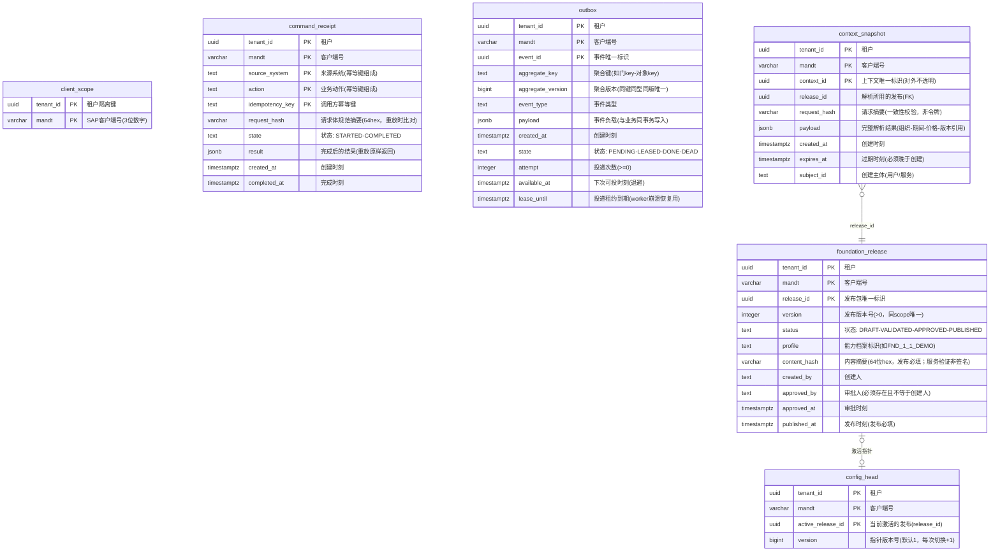

要点：`foundation_release` 状态机由触发器保护（PUBLISHED 行禁改）；`command_receipt` 是幂等激活的唯一闸口（STARTED 与业务写入同事务）；`outbox` 租约式至少一次投递；`context_snapshot` 是服务端受控快照，**不等于过账授权**。

---

## 3. 域 B：组织身份 key 表（7 表）

> 稳定身份：只表达"存在"，不表达启用条件；编码一经分配不得重新分配（目录 role）。

```mermaid
erDiagram
    company_key {
        uuid tenant_id PK "租户"
        varchar mandt PK "客户端号"
        varchar bukrs PK "公司代码(SAP T001-BUKRS，4位)"
        uuid object_id UK "稳定对象UUID(同一对象唯一)"
    }
    valuation_area_key {
        uuid tenant_id PK "租户"
        varchar mandt PK "客户端号"
        varchar bwkey PK "估值范围(SAP T001K-BWKEY，4位)"
        uuid object_id UK "稳定对象UUID"
    }
    plant_key {
        uuid tenant_id PK "租户"
        varchar mandt PK "客户端号"
        varchar werks PK "工厂代码(SAP T001W-WERKS，4位)"
        uuid object_id UK "稳定对象UUID"
    }
    purchasing_org_key {
        uuid tenant_id PK "租户"
        varchar mandt PK "客户端号"
        varchar ekorg PK "采购组织(SAP T024-EKORG)"
        uuid object_id UK "稳定对象UUID"
    }
    sales_org_key {
        uuid tenant_id PK "租户"
        varchar mandt PK "客户端号"
        varchar vkorg PK "销售组织(SAP TVKO-VKORG)"
        uuid object_id UK "稳定对象UUID"
    }
    controlling_area_key {
        uuid tenant_id PK "租户"
        varchar mandt PK "客户端号"
        varchar kokrs PK "控制范围(SAP TKA00-KOKRS)"
        uuid object_id UK "稳定对象UUID"
    }
    ledger_key {
        uuid tenant_id PK "租户"
        varchar mandt PK "客户端号"
        varchar rldnr PK "账本代码(SAP RLDNR，2位)"
        uuid object_id UK "稳定对象UUID"
    }
```

要点（E01）：工厂→估值范围→公司的归属靠配置表的关联链表达，**不存在** WERKS=BWKEY=BUKRS 的等码假设；本组 7 表是关联链的锚点。

---

## 4. 域 C：参考数据与财年日历（6 表，均 FK→release）

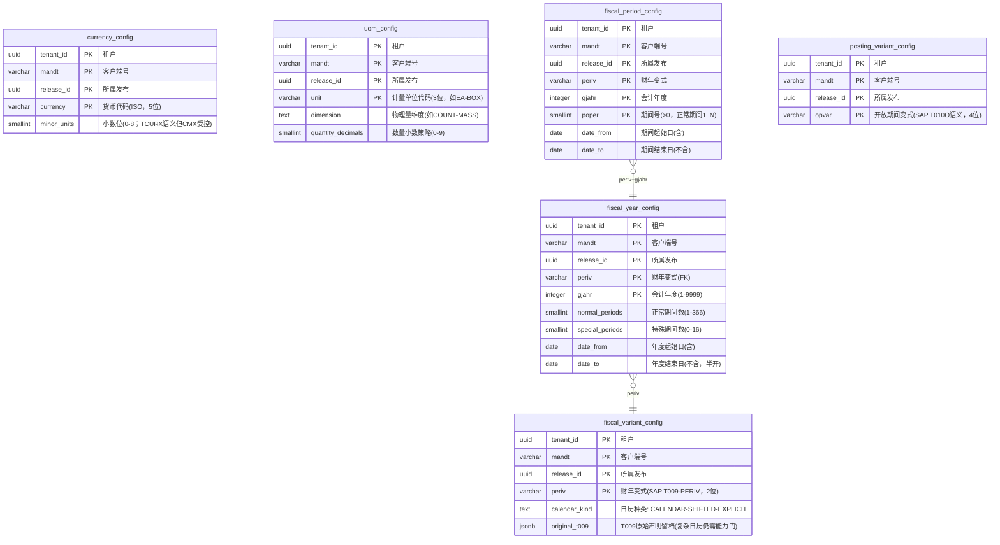

要点（E08）：同一 posting_date 按各账本自己的 PERIV 解析期间——K4 下 2027-01-15 是 2027/1，A4（4月起始）下是 2026/10；期间边界由本组表在发布时编译校验（连续覆盖、无洞无重叠，GiST 排斥约束兜底）。

---

## 5. 域 D：组织配置与分配（10 表，均 FK→release）

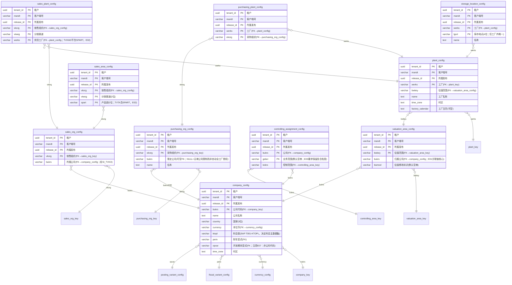

要点：组织解析的完整链路藏在配置表的外键里——`plant_config.bwkey → valuation_area_config.bukrs → company_config`；控制范围按 (bukrs,gsber) 复合粒度解析（E03，零条或多条均失败，不取第一条）。

---

## 6. 域 E：核算配置——账本、币种、期间规则（5 表，均 FK→release）

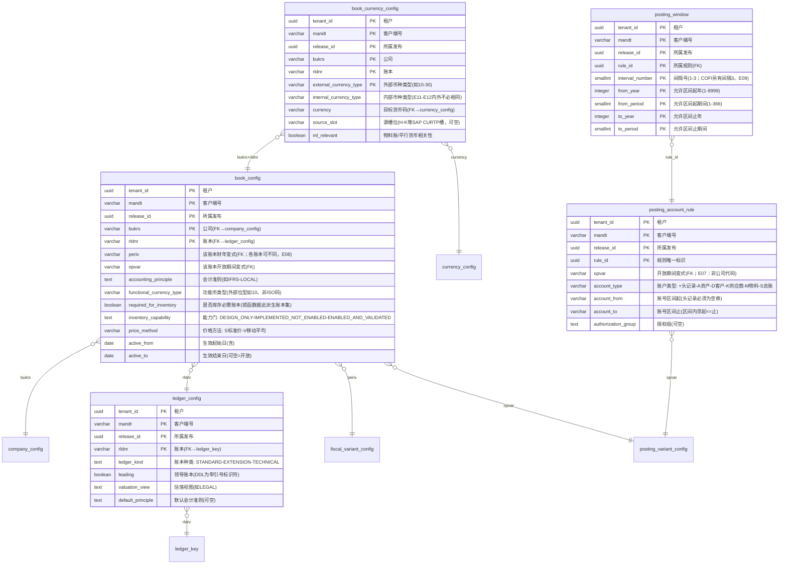

要点：必需账本集合由 `book_config.required_for_inventory` 派生（`lock_inventory_context` 不信调用方传入的账本数组）；币种映射按 公司+账本+外部类型 定位（E12，禁止按公司去重）；开放期间检查顺序=头记录→科目类型明细→窗口（E09，间隔语义 1/2/3 独立）。

---

## 7. 域 F：主数据身份与映射（6 表）

> 本域与 master_identity 的关联是**逻辑引用**（无物理外键，领域核校验；见 §12）。

```mermaid
erDiagram
    master_identity {
        uuid tenant_id PK "租户"
        varchar mandt PK "客户端号"
        uuid object_id PK "稳定对象UUID(全类型唯一)"
        text object_type "对象类型(BP-MATERIAL等)"
        text business_key "规范键(结构化序列化，不拼接歧义文本)"
    }
    external_key_map {
        uuid tenant_id PK "租户"
        varchar mandt PK "客户端号"
        text source_system PK "源系统标识"
        text source_client PK "源系统客户端"
        text object_type PK "对象类型"
        text external_key PK "源系统业务键"
        uuid object_id "目标对象UUID(逻辑→master_identity)"
    }
    bp_identity {
        uuid tenant_id PK "租户"
        varchar mandt PK "客户端号"
        uuid partner_guid PK "BP的GUID(SAP PARTNER_GUID，E04)"
        varchar partner UK "BP编号(10位；与客商编号不相等，E04)"
        uuid object_id "逻辑→master_identity"
        text object_type "恒为BP(默认BP)"
    }
    customer_link {
        uuid tenant_id PK "租户"
        varchar mandt PK "客户端号"
        varchar kunnr PK "客户编号(10位；CVI映射，不要求等于BP号)"
        uuid partner_guid UK "对应BP的GUID(逻辑→bp_identity)"
    }
    supplier_link {
        uuid tenant_id PK "租户"
        varchar mandt PK "客户端号"
        varchar lifnr PK "供应商编号(10位；CVI映射)"
        uuid partner_guid UK "对应BP的GUID(逻辑→bp_identity)"
    }
    material_identity {
        uuid tenant_id PK "租户"
        varchar mandt PK "客户端号"
        varchar matnr PK "物料号(40位字符串，E15：禁止截18位或转整数)"
        uuid object_id "逻辑→master_identity"
        text object_type "恒为MATERIAL(默认MATERIAL)"
    }
```

要点（E04）：BP 编号、客户编号、供应商编号三者互不相等，靠 GUID/link 表映射——这是主数据资格检查（采购/销售/发票/付款）的第一道关。

---

## 8. 域 G：主数据版本——BP 与客商视图（5 表）

> 版本表通用列：`revision_id` PK 成分；`valid_from/valid_to` 业务有效期；`recorded_from/recorded_to` 系统认知期（recorded_to 可空=当前版）；`approved_change_id` 审批引用；时态重叠由 EXCLUDE 兜底——各图中注明一次，不再逐列重复中文注释。

```mermaid
erDiagram
    bp_role_version {
        uuid tenant_id PK "租户"
        varchar mandt PK "客户端号"
        uuid revision_id PK "版本行唯一标识"
        uuid partner_guid "BP身份(FK→bp_identity)"
        varchar role "BP角色(6位，如FLVN01采购)"
        varchar dfval "角色区分值(默认空串)"
        timestamptz valid_from "业务有效自(时间戳粒度，E05禁止转DATE)"
        timestamptz valid_to "业务有效至(可空=开放)"
        timestamptz recorded_from "系统认知自"
        timestamptz recorded_to "系统认知至(可空=当前版)"
        uuid approved_change_id "审批变更引用(必填)"
    }
    customer_company_version {
        uuid tenant_id PK "租户"
        varchar mandt PK "客户端号"
        uuid revision_id PK "版本行标识"
        varchar kunnr "客户(FK→customer_link)"
        varchar bukrs "公司(FK→company_key)"
        varchar akont "统驭科目(E06：须按科目表与D/K类型领域校验)"
        varchar zterm "付款条件(4位，可空)"
        boolean posting_block "记账冻结"
        text payment_block "付款冻结(可空)"
        date valid_from "业务有效自"
        date valid_to "业务有效至(可空)"
        timestamptz recorded_from "系统认知自"
        timestamptz recorded_to "系统认知至(可空)"
        uuid approved_change_id "审批变更引用"
    }
    supplier_company_version {
        uuid tenant_id PK "租户"
        varchar mandt PK "客户端号"
        uuid revision_id PK "版本行标识"
        varchar lifnr "供应商(FK→supplier_link)"
        varchar bukrs "公司(FK→company_key)"
        varchar akont "供应商统驭科目(K类型)"
        varchar zterm "付款条件"
        boolean posting_block "记账冻结"
        text payment_block "付款冻结"
        date valid_from "业务有效自"
        date valid_to "业务有效至(可空)"
        timestamptz recorded_from "系统认知自"
        timestamptz recorded_to "系统认知至(可空)"
        uuid approved_change_id "审批变更引用"
    }
    customer_sales_version {
        uuid tenant_id PK "租户"
        varchar mandt PK "客户端号"
        uuid revision_id PK "版本行标识"
        varchar kunnr "客户(FK→customer_link)"
        varchar vkorg "销售组织(FK→sales_org_key)"
        varchar vtweg "分销渠道"
        varchar spart "产品部(销售范围三元组)"
        text order_block "订单冻结(可空)"
        text delivery_block "交货冻结(可空)"
        text billing_block "开票冻结(可空)"
        varchar currency "默认币种(可空)"
        varchar payment_terms "付款条件(可空)"
        date valid_from "业务有效自"
        date valid_to "业务有效至(可空)"
        timestamptz recorded_from "系统认知自"
        timestamptz recorded_to "系统认知至(可空)"
        uuid approved_change_id "审批变更引用"
    }
    supplier_purchasing_version {
        uuid tenant_id PK "租户"
        varchar mandt PK "客户端号"
        uuid revision_id PK "版本行标识"
        varchar lifnr "供应商(FK→supplier_link)"
        varchar ekorg "采购组织(FK→purchasing_org_key；LFM1粒度)"
        boolean purchasing_block "采购冻结"
        varchar order_currency "订单币种(可空)"
        varchar payment_terms "付款条件(可空)"
        date valid_from "业务有效自"
        date valid_to "业务有效至(可空)"
        timestamptz recorded_from "系统认知自"
        timestamptz recorded_to "系统认知至(可空)"
        uuid approved_change_id "审批变更引用"
    }
    bp_role_version }o--|| bp_identity : "partner_guid"
    customer_company_version }o--|| customer_link : "kunnr"
    customer_company_version }o--|| company_key : "bukrs"
    supplier_company_version }o--|| supplier_link : "lifnr"
    supplier_company_version }o--|| company_key : "bukrs"
    customer_sales_version }o--|| customer_link : "kunnr"
    customer_sales_version }o--|| sales_org_key : "vkorg"
    supplier_purchasing_version }o--|| supplier_link : "lifnr"
    supplier_purchasing_version }o--|| purchasing_org_key : "ekorg"
```

要点（§6.1 资格矩阵）：创建采购收货要 LFM1 粒度采购视图（supplier_purchasing_version）；供应商发票要公司视图+AKONT 统驭链（supplier_company_version.akont）；销售订单要 KNVV 视图（customer_sales_version）；付款/开票在执行时重验冻结列，不重用昨日放行。

---

## 9. 域 H：主数据版本——物料（3 表）

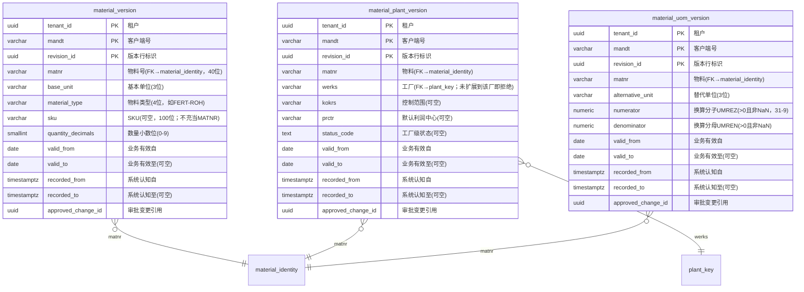

要点（§6.2）：换算公式 `基本量 = 输入量 × numerator / denominator`；不可分割件数物料换算出现小数必须拒绝（FND_UOM_PRECISION）；主数据表不含库存金额字段（价格在域 J）。

---

## 10. 域 I：主数据版本——科目与成本/利润对象（5 表）

```mermaid
erDiagram
    gl_account_version {
        uuid tenant_id PK "租户"
        varchar mandt PK "客户端号"
        uuid revision_id PK "版本行标识"
        varchar ktopl "科目表(4位；与公司config.ktopl同一字典)"
        varchar saknr "总账科目号(10位，SKA1视图)"
        text account_category "科目类别(资产负债-损益等)"
        text description "科目描述"
        date valid_from "业务有效自"
        date valid_to "业务有效至(可空)"
        timestamptz recorded_from "系统认知自"
        timestamptz recorded_to "系统认知至(可空)"
        uuid approved_change_id "审批变更引用"
    }
    gl_company_version {
        uuid tenant_id PK "租户"
        varchar mandt PK "客户端号"
        uuid revision_id PK "版本行标识"
        varchar bukrs "公司(FK→company_key)"
        varchar saknr "科目(10位；逻辑→gl_account_version，科目表经T001-KTOPL)"
        varchar reconciliation_type "统驭类型: D客户-K供应商-A资产(可空，E06)"
        varchar currency "科目币种"
        boolean open_item_managed "未清项管理(修改需迁移)"
        boolean posting_block "记账冻结"
        boolean automatic_postings_only "仅自动记账"
        date valid_from "业务有效自"
        date valid_to "业务有效至(可空)"
        timestamptz recorded_from "系统认知自"
        timestamptz recorded_to "系统认知至(可空)"
        uuid approved_change_id "审批变更引用"
    }
    cost_center_version {
        uuid tenant_id PK "租户"
        varchar mandt PK "客户端号"
        uuid revision_id PK "版本行标识"
        varchar kokrs "控制范围(FK→controlling_area_key)"
        varchar kostl "成本中心(10位，CSKS视图)"
        varchar bukrs "公司(FK→company_key)"
        varchar prctr "利润中心(可空)"
        varchar source_datbi "源系统DATBI留值(8位NUMC，E05迁移留痕)"
        text name "名称"
        date valid_from "业务有效自"
        date valid_to "业务有效至(可空)"
        timestamptz recorded_from "系统认知自"
        timestamptz recorded_to "系统认知至(可空)"
        uuid approved_change_id "审批变更引用"
    }
    profit_center_version {
        uuid tenant_id PK "租户"
        varchar mandt PK "客户端号"
        uuid revision_id PK "版本行标识"
        varchar kokrs "控制范围(FK→controlling_area_key)"
        varchar prctr "利润中心(10位，CEPC视图)"
        text name "名称"
        text segment "分部(可空)"
        date valid_from "业务有效自"
        date valid_to "业务有效至(可空)"
        timestamptz recorded_from "系统认知自"
        timestamptz recorded_to "系统认知至(可空)"
        uuid approved_change_id "审批变更引用"
    }
    profit_company_version {
        uuid tenant_id PK "租户"
        varchar mandt PK "客户端号"
        uuid revision_id PK "版本行标识"
        varchar kokrs "控制范围(FK→controlling_area_key)"
        varchar prctr "利润中心"
        varchar bukrs "公司(FK→company_key；CEPC_BUKRS，E03利润中心可多公司)"
        date valid_from "业务有效自"
        date valid_to "业务有效至(可空)"
        timestamptz recorded_from "系统认知自"
        timestamptz recorded_to "系统认知至(可空)"
        uuid approved_change_id "审批变更引用"
    }
    gl_company_version }o--|| company_key : "bukrs"
    cost_center_version }o--|| controlling_area_key : "kokrs"
    cost_center_version }o--|| company_key : "bukrs"
    profit_center_version }o--|| controlling_area_key : "kokrs"
    profit_company_version }o--|| controlling_area_key : "kokrs"
    profit_company_version }o--|| company_key : "bukrs"
```

要点：客户/供应商统驭科目校验链 = 客商公司视图 akont → gl_company_version（同公司+D/K 类型+冻结控制）→ gl_account_version（科目表由 company_config.ktopl 决定）；"科目存在"不等于"可作统驭科目"（E06）。

---

## 11. 域 J+K：估值价格与运行控制（5 表）

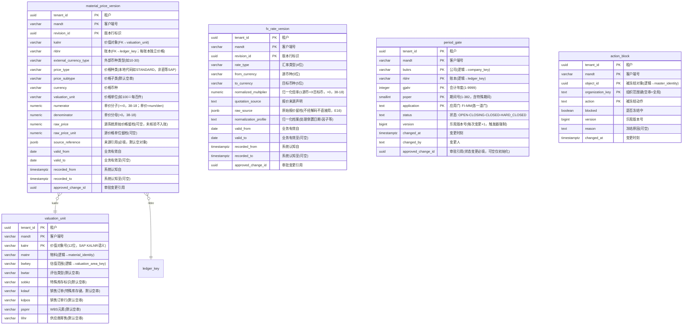

要点（E13/E14）：价格七元组键 = 价值对象 + 账本 + 外部币种类型 + 价格种类 + 子类 + 有效期（实体库存不因多账本复制）；历史价格与当前价格的物理键分离原则落在 revision_id 主键上；期间门是"当前运行态"（与发布配置快照分离），`lock_inventory_context` 在业务事务内对 4 元组门 FOR SHARE 加锁、关账时 FOR UPDATE。

---

## 12. 逻辑引用清单（无物理外键，领域核校验）

目录 JSON（`03_physical_table_catalog.json`）为下列 8 组关系登记了引用声明；DDL 刻意不建外键，由激活/发布校验与 `lock_inventory_context` 锁序重验保证一致性：

| # | 子表 | 引用列 | 父表 | 说明 |
|---|---|---|---|---|
| 1 | external_key_map | object_id+object_type | master_identity | 源键映射不可任意重指向 |
| 2 | bp_identity | object_id+object_type | master_identity | BP 身份纳入统一对象注册 |
| 3 | material_identity | object_id+object_type | master_identity | 物料身份纳入统一对象注册 |
| 4 | customer_link | partner_guid | bp_identity | CVI 客户映射（E04） |
| 5 | supplier_link | partner_guid | bp_identity | CVI 供应商映射（E04） |
| 6 | valuation_unit | matnr | material_identity | 价值对象挂在物料下 |
| 7 | valuation_unit | bwkey | valuation_area_key | 价值对象挂在估值范围下 |
| 8 | period_gate / action_block | bukrs/rldnr/object_id | company_key / ledger_key / master_identity | 运行控制引用稳定身份 |
| — | gl_company_version | saknr(+ktopl 派生) | gl_account_version | 统驭校验链（科目表经 company_config.ktopl） |

---

## 13. 全量物理外键清单（74 条，不含统一的 →client_scope）

| 子表 | 父表 | 外键列 |
|---|---|---|
| config_head | foundation_release | tenant_id,mandt,active_release_id |
| currency_config | foundation_release | tenant_id,mandt,release_id |
| uom_config | foundation_release | tenant_id,mandt,release_id |
| fiscal_variant_config | foundation_release | tenant_id,mandt,release_id |
| fiscal_year_config | foundation_release / fiscal_variant_config | release / periv |
| fiscal_period_config | foundation_release / fiscal_year_config | release / periv+gjahr |
| posting_variant_config | foundation_release | tenant_id,mandt,release_id |
| company_config | foundation_release / company_key / currency_config / fiscal_variant_config / posting_variant_config | release / bukrs / currency / periv / opvar |
| valuation_area_config | foundation_release / valuation_area_key / company_config | release / bwkey / bukrs |
| plant_config | foundation_release / plant_key / valuation_area_config | release / werks / bwkey |
| storage_location_config | foundation_release / plant_config | release / werks |
| purchasing_org_config | foundation_release / purchasing_org_key / company_config | release / ekorg / bukrs可空 |
| purchasing_plant_config | foundation_release / plant_config / purchasing_org_config | release / werks / ekorg |
| controlling_assignment_config | foundation_release / company_config / controlling_area_key | release / bukrs / kokrs |
| sales_org_config | foundation_release / sales_org_key / company_config | release / vkorg / bukrs |
| sales_area_config | foundation_release / sales_org_config | release / vkorg |
| sales_plant_config | foundation_release / sales_org_config / plant_config | release / vkorg / werks |
| ledger_config | foundation_release / ledger_key | release / rldnr |
| book_config | foundation_release / company_config / ledger_config / fiscal_variant_config / posting_variant_config | release / bukrs / rldnr / periv / opvar |
| book_currency_config | foundation_release / book_config / currency_config | release / bukrs+rldnr / currency |
| posting_account_rule | foundation_release / posting_variant_config | release / opvar |
| posting_window | foundation_release / posting_account_rule | release / rule_id |
| bp_role_version | bp_identity | tenant_id,mandt,partner_guid |
| customer_company_version | customer_link / company_key | kunnr / bukrs |
| supplier_company_version | supplier_link / company_key | lifnr / bukrs |
| customer_sales_version | customer_link / sales_org_key | kunnr / vkorg |
| supplier_purchasing_version | supplier_link / purchasing_org_key | lifnr / ekorg |
| material_version | material_identity | tenant_id,mandt,matnr |
| material_plant_version | material_identity / plant_key | matnr / werks |
| material_uom_version | material_identity | tenant_id,mandt,matnr |
| gl_company_version | company_key | tenant_id,mandt,bukrs |
| cost_center_version | controlling_area_key / company_key | kokrs / bukrs |
| profit_center_version | controlling_area_key | tenant_id,mandt,kokrs |
| profit_company_version | controlling_area_key / company_key | kokrs / bukrs |
| material_price_version | valuation_unit / ledger_key | kalnr / rldnr |
| context_snapshot | foundation_release | tenant_id,mandt,release_id |

## 14. 附录：域归属索引（58 表）

| 域 | 表数 | 表 |
|---|---|---|
| A 治理底座 | 6 | client_scope, foundation_release, config_head, command_receipt, outbox, context_snapshot |
| B 组织身份 | 7 | company_key, valuation_area_key, plant_key, purchasing_org_key, sales_org_key, controlling_area_key, ledger_key |
| C 参考与日历 | 6 | currency_config, uom_config, fiscal_variant_config, fiscal_year_config, fiscal_period_config, posting_variant_config |
| D 组织配置与分配 | 10 | company_config, valuation_area_config, plant_config, storage_location_config, purchasing_org_config, purchasing_plant_config, controlling_assignment_config, sales_org_config, sales_area_config, sales_plant_config |
| E 核算配置 | 5 | ledger_config, book_config, book_currency_config, posting_account_rule, posting_window |
| F 主数据身份 | 6 | master_identity, external_key_map, bp_identity, customer_link, supplier_link, material_identity |
| G 版本·BP客商 | 5 | bp_role_version, customer_company_version, supplier_company_version, customer_sales_version, supplier_purchasing_version |
| H 版本·物料 | 3 | material_version, material_plant_version, material_uom_version |
| I 版本·科目成本 | 5 | gl_account_version, gl_company_version, cost_center_version, profit_center_version, profit_company_version |
| J 估值价格 | 3 | valuation_unit, material_price_version, fx_rate_version |
| K 运行控制 | 2 | period_gate, action_block |

> 数据库级防护备忘：58 表全部 `ENABLE/FORCE ROW LEVEL SECURITY`（按 `app.tenant_id`+`app.mandt` GUC 隔离）；21 张发布绑定配置表挂"已发布不可变"触发器；15 张版本表挂"版本行禁改写"触发器；period_gate 挂键不可变+版本递增触发器；17 个时态 EXCLUDE 排斥约束。表中行归属哪个租户由会话 GUC 决定可见性——超管与表属主绕过 RLS，业务账号必须 `SET LOCAL app.tenant_id/app.mandt` 后在同事务内查询。
